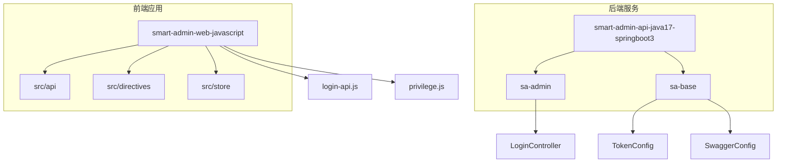
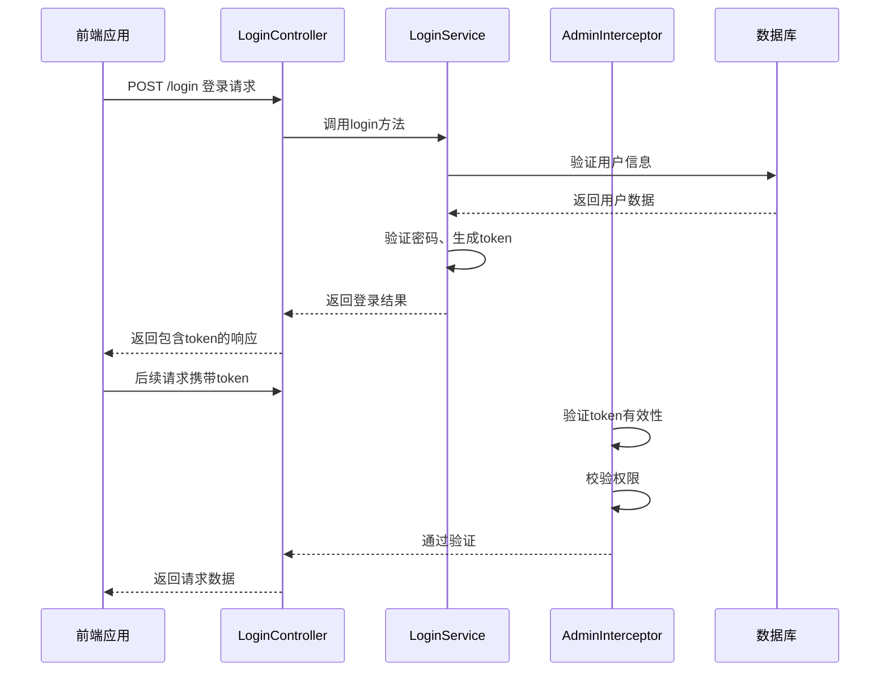
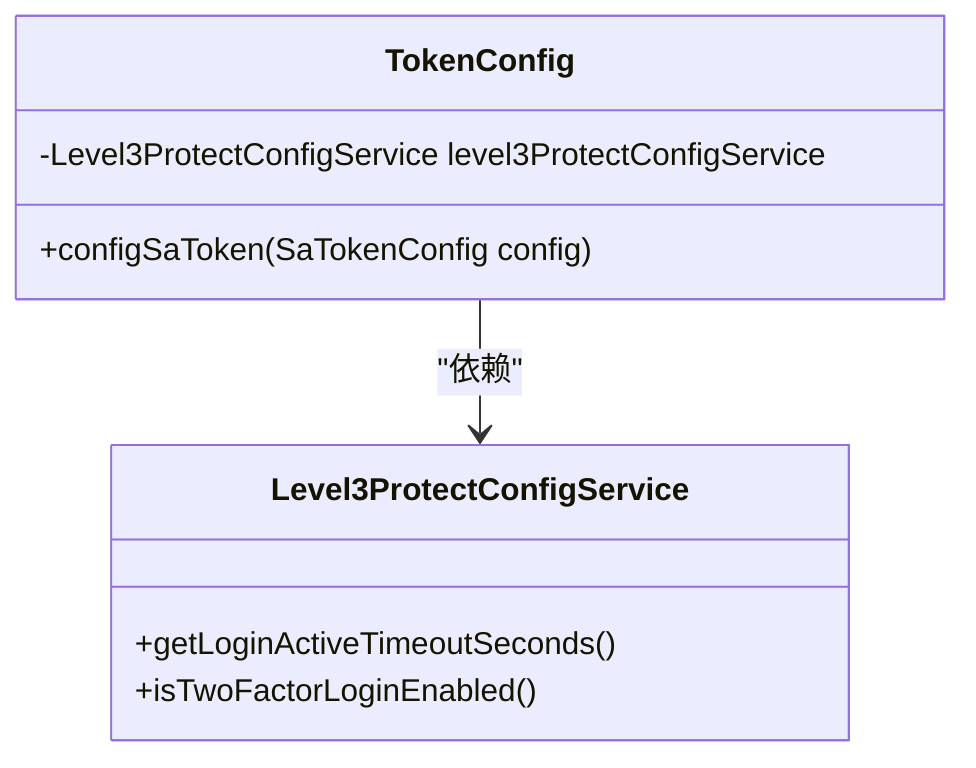
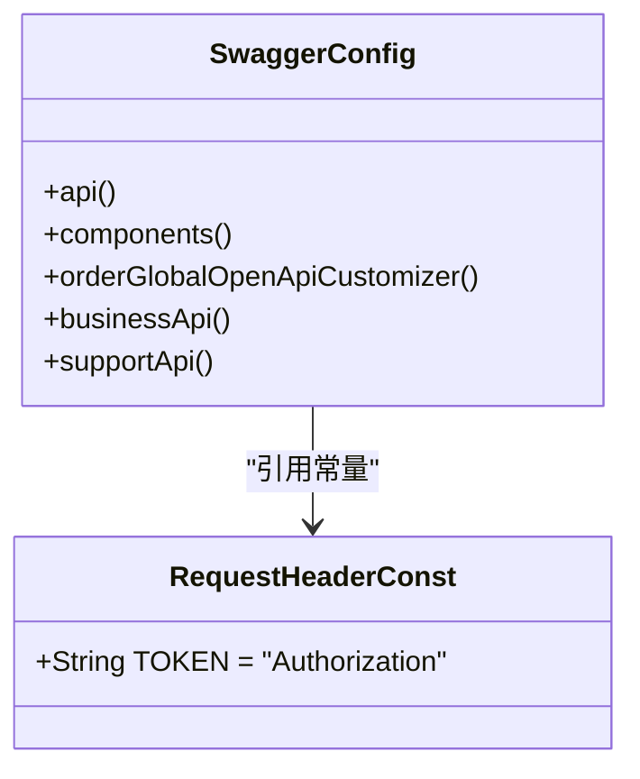
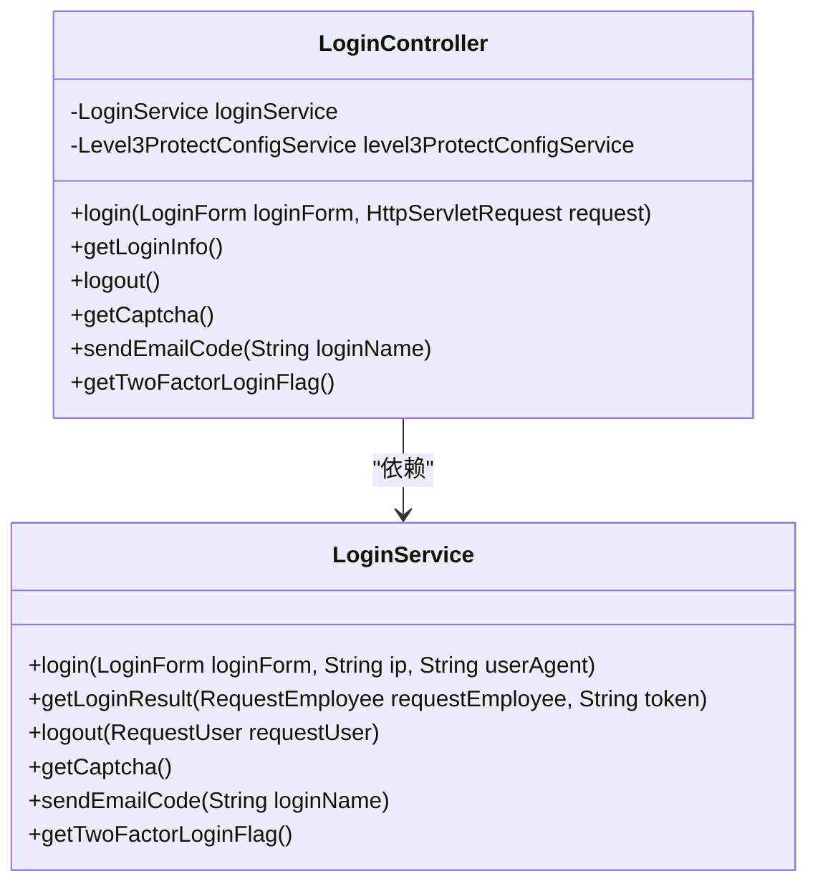
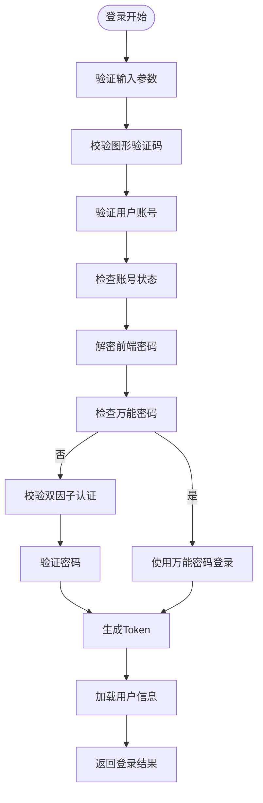
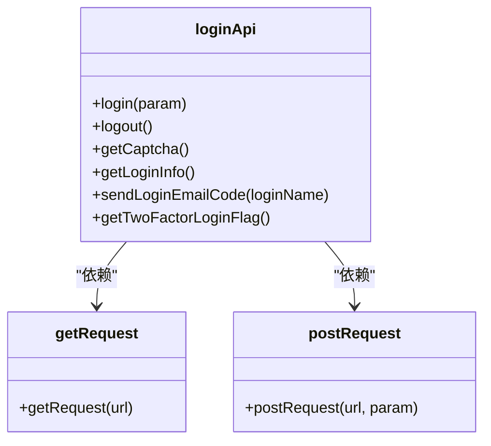
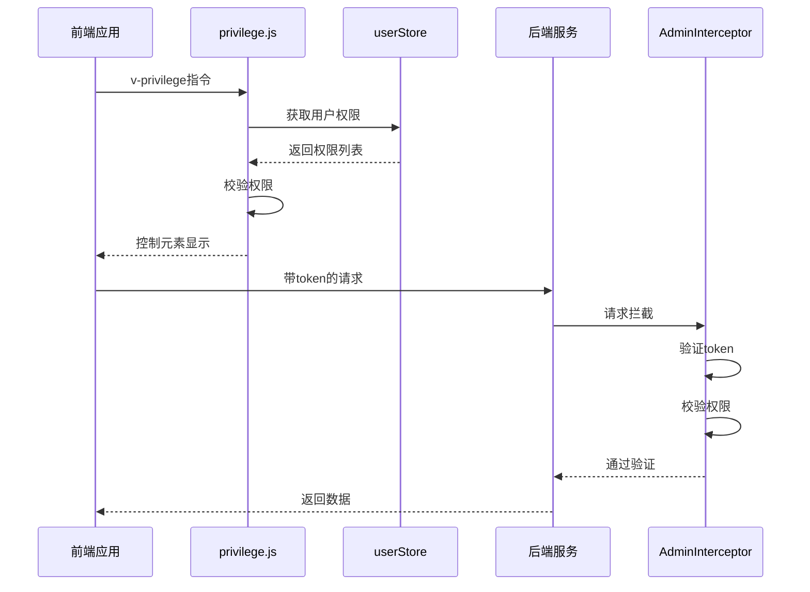
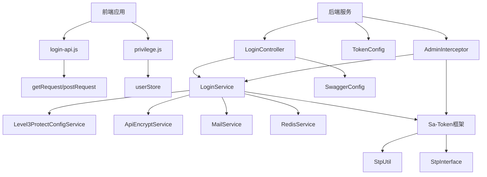

# 认证与授权

<cite>
**本文档引用的文件**   
- [TokenConfig.java](file://smart-admin-api-java17-springboot3/sa-base/src/main/java/net/lab1024/sa/base/config/TokenConfig.java)
- [SwaggerConfig.java](file://smart-admin-api-java17-springboot3/sa-base/src/main/java/net/lab1024/sa/base/config/SwaggerConfig.java)
- [LoginController.java](file://smart-admin-api-java17-springboot3/sa-admin/src/main/java/net/lab1024/sa/admin/module/system/login/controller/LoginController.java)
- [LoginService.java](file://smart-admin-api-java17-springboot3/sa-admin/src/main/java/net/lab1024/sa/admin/module/system/login/service/LoginService.java)
- [LoginForm.java](file://smart-admin-api-java17-springboot3/sa-admin/src/main/java/net/lab1024/sa/admin/module/system/login/domain/LoginForm.java)
- [login-api.js](file://smart-admin-web-javascript/src/api/system/login-api.js)
- [AdminInterceptor.java](file://smart-admin-api-java17-springboot3/sa-admin/src/main/java/net/lab1024/sa/admin/interceptor/AdminInterceptor.java)
- [privilege.js](file://smart-admin-web-javascript/src/directives/privilege.js)
- [RequestHeaderConst.java](file://smart-admin-api-java17-springboot3/sa-base/src/main/java/net/lab1024/sa/base/common/constant/RequestHeaderConst.java)
</cite>

## 目录
1. [简介](#简介)
2. [项目结构](#项目结构)
3. [核心组件](#核心组件)
4. [架构概述](#架构概述)
5. [详细组件分析](#详细组件分析)
6. [依赖分析](#依赖分析)
7. [性能考虑](#性能考虑)
8. [故障排除指南](#故障排除指南)
9. [结论](#结论)

## 简介
本文档详细解析了基于JWT的认证与授权机制，涵盖从用户登录获取token到后续请求的鉴权全过程。文档深入说明了TokenConfig.java中的配置项如token名称、过期时间、刷新机制等，解释了SwaggerConfig中如何配置全局安全方案要求所有接口携带Bearer格式的Authorization头。详细描述了LoginController的登录接口实现，包括参数验证、密码加密、token生成等步骤。提供了前端login-api.js中登录请求的完整示例，包括请求参数和响应处理。阐述了权限控制机制，如何通过Sa-Token框架实现角色和菜单权限的校验。

## 项目结构
本项目采用分层架构设计，主要分为后端Java服务和前端JavaScript应用两大部分。后端服务基于SpringBoot3和Sa-Token框架构建，前端应用基于Vue3和Vite5技术栈。项目结构清晰，模块化程度高，便于维护和扩展。

**图表来源**
- [TokenConfig.java](file://smart-admin-api-java17-springboot3/sa-base/src/main/java/net/lab1024/sa/base/config/TokenConfig.java)
- [SwaggerConfig.java](file://smart-admin-api-java17-springboot3/sa-base/src/main/java/net/lab1024/sa/base/config/SwaggerConfig.java)
- [LoginController.java](file://smart-admin-api-java17-springboot3/sa-admin/src/main/java/net/lab1024/sa/admin/module/system/login/controller/LoginController.java)
- [login-api.js](file://smart-admin-web-javascript/src/api/system/login-api.js)
- [privilege.js](file://smart-admin-web-javascript/src/directives/privilege.js)

**章节来源**
- [TokenConfig.java](file://smart-admin-api-java17-springboot3/sa-base/src/main/java/net/lab1024/sa/base/config/TokenConfig.java)
- [SwaggerConfig.java](file://smart-admin-api-java17-springboot3/sa-base/src/main/java/net/lab1024/sa/base/config/SwaggerConfig.java)
- [LoginController.java](file://smart-admin-api-java17-springboot3/sa-admin/src/main/java/net/lab1024/sa/admin/module/system/login/controller/LoginController.java)
- [login-api.js](file://smart-admin-web-javascript/src/api/system/login-api.js)

## 核心组件
系统的核心认证与授权组件主要包括Token配置、Swagger安全配置、登录控制器、登录服务、登录表单模型、前端登录API和权限指令等。这些组件协同工作，实现了完整的认证与授权流程。

**章节来源**
- [TokenConfig.java](file://smart-admin-api-java17-springboot3/sa-base/src/main/java/net/lab1024/sa/base/config/TokenConfig.java)
- [SwaggerConfig.java](file://smart-admin-api-java17-springboot3/sa-base/src/main/java/net/lab1024/sa/base/config/SwaggerConfig.java)
- [LoginController.java](file://smart-admin-api-java17-springboot3/sa-admin/src/main/java/net/lab1024/sa/admin/module/system/login/controller/LoginController.java)
- [LoginService.java](file://smart-admin-api-java17-springboot3/sa-admin/src/main/java/net/lab1024/sa/admin/module/system/login/service/LoginService.java)
- [LoginForm.java](file://smart-admin-api-java17-springboot3/sa-admin/src/main/java/net/lab1024/sa/admin/module/system/login/domain/LoginForm.java)
- [login-api.js](file://smart-admin-web-javascript/src/api/system/login-api.js)
- [privilege.js](file://smart-admin-web-javascript/src/directives/privilege.js)

## 架构概述
系统采用基于JWT的无状态认证架构，使用Sa-Token框架实现完整的认证与授权功能。前端通过登录接口获取token，后续请求在Authorization头中携带Bearer格式的token进行鉴权。系统通过拦截器实现权限校验，结合角色和菜单权限实现细粒度的访问控制。

**图表来源**
- [LoginController.java](file://smart-admin-api-java17-springboot3/sa-admin/src/main/java/net/lab1024/sa/admin/module/system/login/controller/LoginController.java)
- [LoginService.java](file://smart-admin-api-java17-springboot3/sa-admin/src/main/java/net/lab1024/sa/admin/module/system/login/service/LoginService.java)
- [AdminInterceptor.java](file://smart-admin-api-java17-springboot3/sa-admin/src/main/java/net/lab1024/sa/admin/interceptor/AdminInterceptor.java)

## 详细组件分析

### Token配置分析
TokenConfig类负责配置Sa-Token框架的全局参数，特别是与三级等保相关的安全配置。该配置通过注入Level3ProtectConfigService服务，动态获取登录活跃超时时间，确保系统符合安全合规要求。

**图表来源**
- [TokenConfig.java](file://smart-admin-api-java17-springboot3/sa-base/src/main/java/net/lab1024/sa/base/config/TokenConfig.java)
- [Level3ProtectConfigService.java](file://smart-admin-api-java17-springboot3/sa-base/src/main/java/net/lab1024/sa/base/module/support/securityprotect/service/Level3ProtectConfigService.java)

**章节来源**
- [TokenConfig.java](file://smart-admin-api-java17-springboot3/sa-base/src/main/java/net/lab1024/sa/base/config/TokenConfig.java)

### Swagger安全配置分析
SwaggerConfig类配置了全局的安全方案，要求所有API接口必须携带Bearer格式的Authorization头。通过OpenAPI规范定义了安全方案，确保API文档能够正确反映系统的安全要求。

**图表来源**
- [SwaggerConfig.java](file://smart-admin-api-java17-springboot3/sa-base/src/main/java/net/lab1024/sa/base/config/SwaggerConfig.java)
- [RequestHeaderConst.java](file://smart-admin-api-java17-springboot3/sa-base/src/main/java/net/lab1024/sa/base/common/constant/RequestHeaderConst.java)

**章节来源**
- [SwaggerConfig.java](file://smart-admin-api-java17-springboot3/sa-base/src/main/java/net/lab1024/sa/base/config/SwaggerConfig.java)

### 登录控制器分析
LoginController是系统登录功能的入口，提供了登录、获取登录信息、退出登录、获取验证码等接口。通过@NoNeedLogin注解标记无需登录即可访问的接口，实现了灵活的访问控制。

**图表来源**
- [LoginController.java](file://smart-admin-api-java17-springboot3/sa-admin/src/main/java/net/lab1024/sa/admin/module/system/login/controller/LoginController.java)
- [LoginService.java](file://smart-admin-api-java17-springboot3/sa-admin/src/main/java/net/lab1024/sa/admin/module/system/login/service/LoginService.java)

**章节来源**
- [LoginController.java](file://smart-admin-api-java17-springboot3/sa-admin/src/main/java/net/lab1024/sa/admin/module/system/login/controller/LoginController.java)

### 登录服务分析
LoginService是登录功能的核心服务类，实现了完整的登录业务逻辑。包括参数验证、密码加密、双因子认证、token生成等关键步骤。服务还实现了SotpInterface接口，为Sa-Token框架提供权限和角色列表。

**图表来源**
- [LoginService.java](file://smart-admin-api-java17-springboot3/sa-admin/src/main/java/net/lab1024/sa/admin/module/system/login/service/LoginService.java)

**章节来源**
- [LoginService.java](file://smart-admin-api-java17-springboot3/sa-admin/src/main/java/net/lab1024/sa/admin/module/system/login/service/LoginService.java)

### 前端登录API分析
login-api.js提供了前端调用后端登录接口的封装，包括登录、退出登录、获取验证码等方法。通过getRequest和postRequest统一的请求方法，简化了API调用。

**图表来源**
- [login-api.js](file://smart-admin-web-javascript/src/api/system/login-api.js)

**章节来源**
- [login-api.js](file://smart-admin-web-javascript/src/api/system/login-api.js)

### 权限控制分析
系统通过Sa-Token框架和自定义权限指令实现完整的权限控制。后端通过AdminInterceptor拦截器进行权限校验，前端通过privilege.js指令控制UI元素的显示。

**图表来源**
- [privilege.js](file://smart-admin-web-javascript/src/directives/privilege.js)
- [AdminInterceptor.java](file://smart-admin-api-java17-springboot3/sa-admin/src/main/java/net/lab1024/sa/admin/interceptor/AdminInterceptor.java)

**章节来源**
- [privilege.js](file://smart-admin-web-javascript/src/directives/privilege.js)
- [AdminInterceptor.java](file://smart-admin-api-java17-springboot3/sa-admin/src/main/java/net/lab1024/sa/admin/interceptor/AdminInterceptor.java)

## 依赖分析
系统各组件之间的依赖关系清晰，遵循了良好的分层架构原则。后端服务层依赖于Sa-Token框架和各种工具服务，前端应用依赖于状态管理和请求库。通过依赖注入和接口定义，实现了组件间的松耦合。

**图表来源**
- [TokenConfig.java](file://smart-admin-api-java17-springboot3/sa-base/src/main/java/net/lab1024/sa/base/config/TokenConfig.java)
- [SwaggerConfig.java](file://smart-admin-api-java17-springboot3/sa-base/src/main/java/net/lab1024/sa/base/config/SwaggerConfig.java)
- [LoginController.java](file://smart-admin-api-java17-springboot3/sa-admin/src/main/java/net/lab1024/sa/admin/module/system/login/controller/LoginController.java)
- [LoginService.java](file://smart-admin-api-java17-springboot3/sa-admin/src/main/java/net/lab1024/sa/admin/module/system/login/service/LoginService.java)
- [login-api.js](file://smart-admin-web-javascript/src/api/system/login-api.js)
- [privilege.js](file://smart-admin-web-javascript/src/directives/privilege.js)
- [AdminInterceptor.java](file://smart-admin-api-java17-springboot3/sa-admin/src/main/java/net/lab1024/sa/admin/interceptor/AdminInterceptor.java)

**章节来源**
- [TokenConfig.java](file://smart-admin-api-java17-springboot3/sa-base/src/main/java/net/lab1024/sa/base/config/TokenConfig.java)
- [SwaggerConfig.java](file://smart-admin-api-java17-springboot3/sa-base/src/main/java/net/lab1024/sa/base/config/SwaggerConfig.java)
- [LoginController.java](file://smart-admin-api-java17-springboot3/sa-admin/src/main/java/net/lab1024/sa/admin/module/system/login/controller/LoginController.java)
- [LoginService.java](file://smart-admin-api-java17-springboot3/sa-admin/src/main/java/net/lab1024/sa/admin/module/system/login/service/LoginService.java)
- [login-api.js](file://smart-admin-web-javascript/src/api/system/login-api.js)
- [privilege.js](file://smart-admin-web-javascript/src/directives/privilege.js)
- [AdminInterceptor.java](file://smart-admin-api-java17-springboot3/sa-admin/src/main/java/net/lab1024/sa/admin/interceptor/AdminInterceptor.java)

## 性能考虑
系统在认证与授权方面的性能考虑主要体现在以下几个方面：使用Redis缓存用户权限信息，减少数据库查询；通过Sa-Token的本地会话管理提高token验证效率；前端权限指令采用缓存机制避免重复计算；登录过程中的密码加密使用高效的算法实现。

## 故障排除指南
当遇到认证与授权相关问题时，可以按照以下步骤进行排查：
1. 检查前端请求是否正确携带Authorization头
2. 验证token是否已过期或无效
3. 检查用户权限配置是否正确
4. 查看后端日志中的认证错误信息
5. 确认Sa-Token配置是否正确

**章节来源**
- [AdminInterceptor.java](file://smart-admin-api-java17-springboot3/sa-admin/src/main/java/net/lab1024/sa/admin/interceptor/AdminInterceptor.java)
- [LoginService.java](file://smart-admin-api-java17-springboot3/sa-admin/src/main/java/net/lab1024/sa/admin/module/system/login/service/LoginService.java)

## 结论
本系统通过Sa-Token框架实现了完整的基于JWT的认证与授权机制，结合三级等保安全要求，提供了高安全性的用户认证解决方案。系统架构清晰，组件职责明确，前后端协同工作，实现了从登录到权限控制的完整流程。通过Swagger的全局安全配置，确保了API接口的安全性，为系统的稳定运行提供了保障。