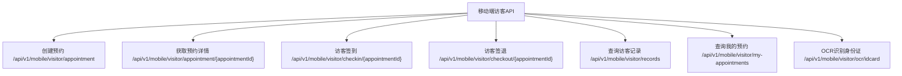
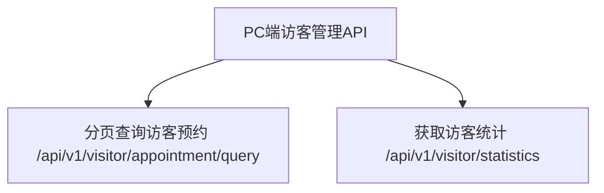
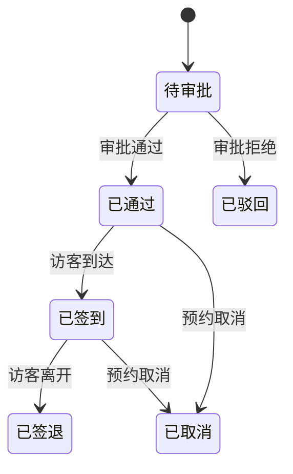
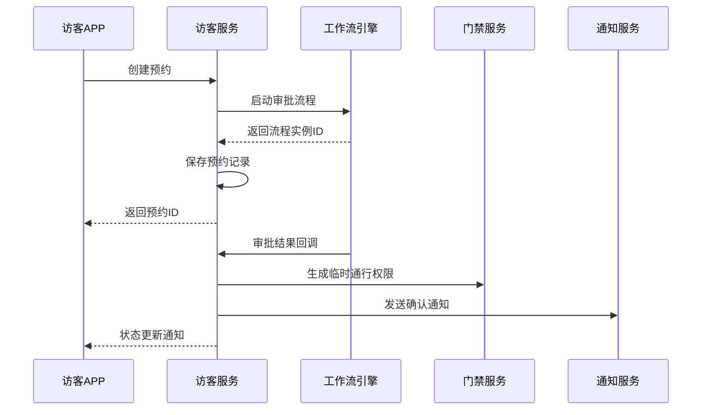
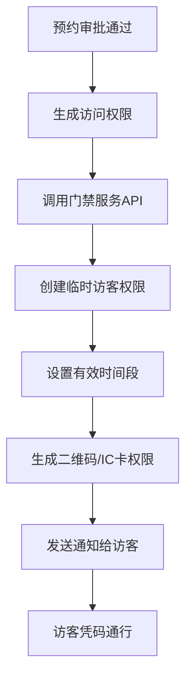
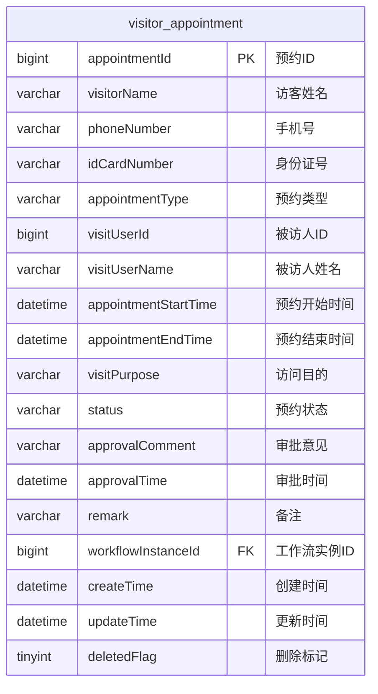

# 访客系统API

<cite>
**本文档引用文件**  
- [VisitorController.java](file://microservices\ioedream-visitor-service\src\main\java\net\lab1024\sa\visitor\controller\VisitorController.java)
- [VisitorMobileController.java](file://microservices\ioedream-visitor-service\src\main\java\net\lab1024\sa\visitor\controller\VisitorMobileController.java)
- [VisitorAppointmentEntity.java](file://microservices\ioedream-visitor-service\src\main\java\net\lab1024\sa\visitor\domain\entity\VisitorAppointmentEntity.java)
- [VisitorMobileForm.java](file://microservices\ioedream-visitor-service\src\main\java\net\lab1024\sa\visitor\domain\form\VisitorMobileForm.java)
- [VisitorAppointmentQueryForm.java](file://microservices\ioedream-visitor-service\src\main\java\net\lab1024\sa\visitor\domain\form\VisitorAppointmentQueryForm.java)
- [VisitorAppointmentServiceImpl.java](file://microservices\ioedream-visitor-service\src\main\java\net\lab1024\sa\visitor\service\impl\VisitorAppointmentServiceImpl.java)
- [VisitorQueryService.java](file://microservices\ioedream-visitor-service\src\main\java\net\lab1024\sa\visitor\service\VisitorQueryService.java)
- [VisitorCheckInService.java](file://microservices\ioedream-visitor-service\src\main\java\net\lab1024\sa\visitor\service\VisitorCheckInService.java)
- [VisitorStatisticsService.java](file://microservices\ioedream-visitor-service\src\main\java\net\lab1024\sa\visitor\service\VisitorStatisticsService.java)
- [VisitorAppointmentDao.java](file://microservices\ioedream-visitor-service\src\main\java\net\lab1024\sa\visitor\dao\VisitorAppointmentDao.java)
- [visitor_index_optimization.sql](file://microservices\ioedream-visitor-service\src\main\resources\sql\visitor_index_optimization.sql)
</cite>

## 目录
1. [简介](#简介)
2. [核心API接口](#核心api接口)
3. [预约请求JSON结构](#预约请求json结构)
4. [审批流程与状态变更](#审批流程与状态变更)
5. [临时通行码生成机制](#临时通行码生成机制)
6. [API调用示例](#api调用示例)
7. [数据模型与数据库设计](#数据模型与数据库设计)
8. [错误处理与响应格式](#错误处理与响应格式)
9. [安全与权限控制](#安全与权限控制)
10. [性能优化与索引策略](#性能优化与索引策略)

## 简介

访客系统API提供了一套完整的访客管理解决方案，覆盖从预约创建、审批处理、通行授权到记录查询的全生命周期管理。系统采用微服务架构，通过RESTful API提供服务，支持移动端和PC端的访客管理需求。API设计遵循企业级规范，确保安全性、可扩展性和易用性。

## 核心API接口

访客系统API分为移动端和PC端两个主要接口集，分别服务于不同的使用场景。

### 移动端API

移动端API主要供访客和被访人使用，支持预约创建、签到签退、记录查询等操作。



**接口来源**  
- [VisitorMobileController.java](file://microservices\ioedream-visitor-service\src\main\java\net\lab1024\sa\visitor\controller\VisitorMobileController.java)

### PC端API

PC端API主要供管理员使用，支持预约查询、统计分析等管理功能。



**接口来源**  
- [VisitorController.java](file://microservices\ioedream-visitor-service\src\main\java\net\lab1024\sa\visitor\controller\VisitorController.java)

## 预约请求JSON结构

创建访客预约时，需要提交符合规范的JSON数据结构。该结构定义了访客的基本信息、访问目的和时间安排。

### 请求结构定义

```json
{
  "visitorName": "张三",
  "phoneNumber": "13800138000",
  "idCardNumber": "11010119900307XXXX",
  "appointmentType": "BUSINESS",
  "visitUserId": 1001,
  "visitUserName": "李四",
  "appointmentStartTime": "2025-01-30T09:00:00",
  "appointmentEndTime": "2025-01-30T17:00:00",
  "visitPurpose": "商务洽谈",
  "remark": "携带笔记本电脑"
}
```

### 字段说明

| 字段名 | 类型 | 必填 | 说明 |
|--------|------|------|------|
| visitorName | string | 是 | 访客姓名 |
| phoneNumber | string | 是 | 手机号 |
| idCardNumber | string | 是 | 身份证号 |
| appointmentType | string | 否 | 预约类型（BUSINESS-商务，PERSONAL-个人） |
| visitUserId | long | 是 | 被访人用户ID |
| visitUserName | string | 否 | 被访人姓名 |
| appointmentStartTime | datetime | 是 | 预约开始时间 |
| appointmentEndTime | datetime | 是 | 预约结束时间 |
| visitPurpose | string | 否 | 访问目的 |
| remark | string | 否 | 备注 |

**数据来源**  
- [VisitorMobileForm.java](file://microservices\ioedream-visitor-service\src\main\java\net\lab1024\sa\visitor\domain\form\VisitorMobileForm.java)

## 审批流程与状态变更

访客预约系统集成了工作流审批机制，确保预约请求经过适当的审批流程后才能生效。

### 审批流程图



### 状态变更流程

当预约创建后，系统会自动启动审批流程。审批结果通过回调接口更新预约状态。



**流程来源**  
- [VisitorAppointmentServiceImpl.java](file://microservices\ioedream-visitor-service\src\main\java\net\lab1024\sa\visitor\service\impl\VisitorAppointmentServiceImpl.java)

## 临时通行码生成机制

当预约审批通过后，系统会自动生成临时通行码，授权访客在指定时间段内访问特定区域。

### 通行码生成流程



### 权限生成实现

系统通过网关服务调用门禁服务，创建临时访客权限。权限包含以下信息：

- 预约ID
- 访客姓名
- 手机号
- 身份证号
- 有效开始时间
- 有效结束时间
- 访问目的

**实现来源**  
- [VisitorAppointmentServiceImpl.java](file://microservices\ioedream-visitor-service\src\main\java\net\lab1024\sa\visitor\service\impl\VisitorAppointmentServiceImpl.java#L190-L261)

## API调用示例

### 创建访客预约

**请求示例**
```http
POST /api/v1/mobile/visitor/appointment HTTP/1.1
Content-Type: application/json

{
  "visitorName": "张三",
  "phoneNumber": "13800138000",
  "idCardNumber": "11010119900307XXXX",
  "visitUserId": 1001,
  "visitUserName": "李四",
  "appointmentStartTime": "2025-01-30T09:00:00",
  "appointmentEndTime": "2025-01-30T17:00:00",
  "visitPurpose": "商务洽谈"
}
```

**响应示例**
```json
{
  "code": "OK",
  "data": 10001,
  "message": "预约创建成功"
}
```

**接口来源**  
- [VisitorMobileController.java](file://microservices\ioedream-visitor-service\src\main\java\net\lab1024\sa\visitor\controller\VisitorMobileController.java#L108-L113)

### 查询待审批列表

**请求示例**
```http
GET /api/v1/visitor/appointment/query?pageNum=1&pageSize=20&status=PENDING HTTP/1.1
```

**响应示例**
```json
{
  "code": "OK",
  "data": {
    "list": [
      {
        "appointmentId": 10001,
        "visitorName": "张三",
        "phoneNumber": "13800138000",
        "visitUserName": "李四",
        "appointmentStartTime": "2025-01-30T09:00:00",
        "appointmentEndTime": "2025-01-30T17:00:00",
        "visitPurpose": "商务洽谈",
        "appointmentStatus": 1
      }
    ],
    "total": 1,
    "pageNum": 1,
    "pageSize": 20
  },
  "message": "查询成功"
}
```

**接口来源**  
- [VisitorController.java](file://microservices\ioedream-visitor-service\src\main\java\net\lab1024\sa\visitor\controller\VisitorController.java#L84-L133)

### 更新访客状态

**请求示例**
```http
PUT /api/v1/mobile/visitor/appointment/10001/status HTTP/1.1
Content-Type: application/json

{
  "status": "APPROVED",
  "approvalComment": "同意访问"
}
```

**响应示例**
```json
{
  "code": "OK",
  "data": null,
  "message": "操作成功"
}
```

**接口来源**  
- [VisitorMobileController.java](file://microservices\ioedream-visitor-service\src\main\java\net\lab1024\sa\visitor\controller\VisitorMobileController.java#L194-L207)

## 数据模型与数据库设计

### 访客预约实体

访客预约实体定义了预约的核心数据结构。



**实体来源**  
- [VisitorAppointmentEntity.java](file://microservices\ioedream-visitor-service\src\main\java\net\lab1024\sa\visitor\domain\entity\VisitorAppointmentEntity.java)

### 状态枚举

预约状态采用字符串枚举，便于扩展和维护。

| 状态值 | 说明 |
|--------|------|
| PENDING | 待审批 |
| APPROVED | 已通过 |
| REJECTED | 已驳回 |
| CANCELLED | 已取消 |
| CHECKED_IN | 已签到 |
| CHECKED_OUT | 已签退 |

**状态定义来源**  
- [VisitorAppointmentEntity.java](file://microservices\ioedream-visitor-service\src\main\java\net\lab1024\sa\visitor\domain\entity\VisitorAppointmentEntity.java#L87-L94)

## 错误处理与响应格式

系统采用统一的响应格式，确保API调用结果的一致性和可预测性。

### 响应格式

```json
{
  "code": "OK",
  "data": {},
  "message": "操作成功"
}
```

| 字段 | 说明 |
|------|------|
| code | 响应码（OK-成功，ERROR-错误） |
| data | 返回数据 |
| message | 响应消息 |

### 常见错误码

| 错误码 | 说明 |
|--------|------|
| QUERY_APPOINTMENTS_ERROR | 查询预约失败 |
| GET_STATISTICS_ERROR | 获取统计数据失败 |
| OCR_RECOGNIZE_ERROR | 身份证识别失败 |

**响应格式来源**  
- [VisitorController.java](file://microservices\ioedream-visitor-service\src\main\java\net\lab1024\sa\visitor\controller\VisitorController.java#L130-L132)

## 安全与权限控制

系统采用基于角色的访问控制（RBAC）机制，确保API的安全性。

### 权限配置

```java
@PreAuthorize("hasRole('VISITOR_MANAGER')")
public ResponseDTO<PageResult<VisitorAppointmentDetailVO>> queryAppointments(...)
```

- **访客经理角色**：可访问所有管理API
- **普通用户角色**：仅可访问个人预约相关API

**权限控制来源**  
- [VisitorController.java](file://microservices\ioedream-visitor-service\src\main\java\net\lab1024\sa\visitor\controller\VisitorController.java#L98)

## 性能优化与索引策略

为确保系统在高并发场景下的性能表现，数据库设计中包含了针对性的索引优化。

### 索引定义

```sql
-- 访客预约表索引
CREATE INDEX idx_visit_user_id ON visitor_appointment(visitUserId);
CREATE INDEX idx_appointment_time ON visitor_appointment(appointmentStartTime, appointmentEndTime);
CREATE INDEX idx_status ON visitor_appointment(status);
CREATE INDEX idx_create_time ON visitor_appointment(createTime);
```

### 查询优化

系统在查询时会根据条件自动选择合适的索引，提高查询效率。

**索引策略来源**  
- [visitor_index_optimization.sql](file://microservices\ioedream-visitor-service\src\main\resources\sql\visitor_index_optimization.sql)