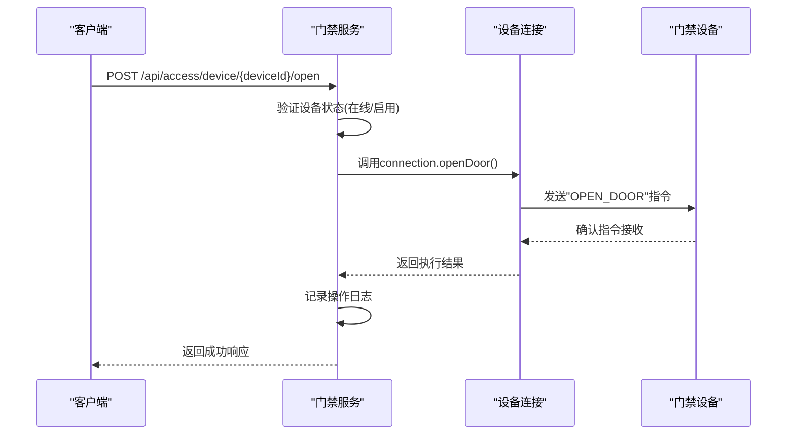
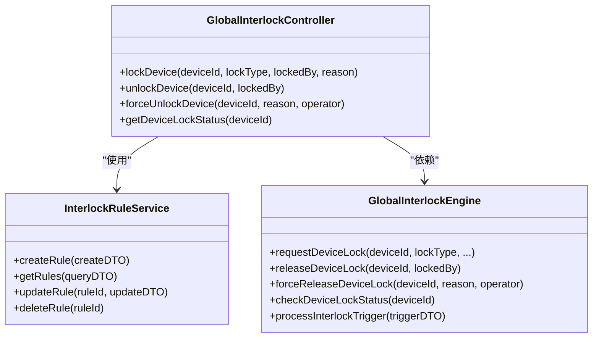
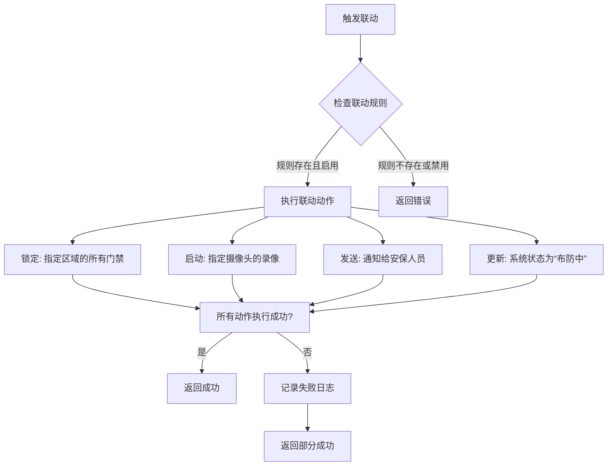
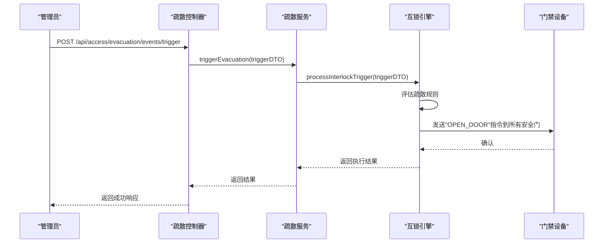
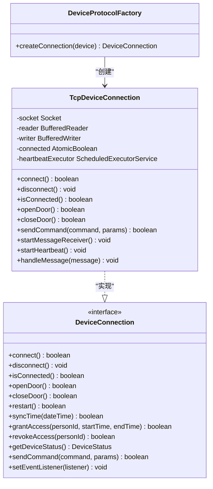
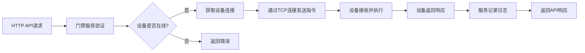
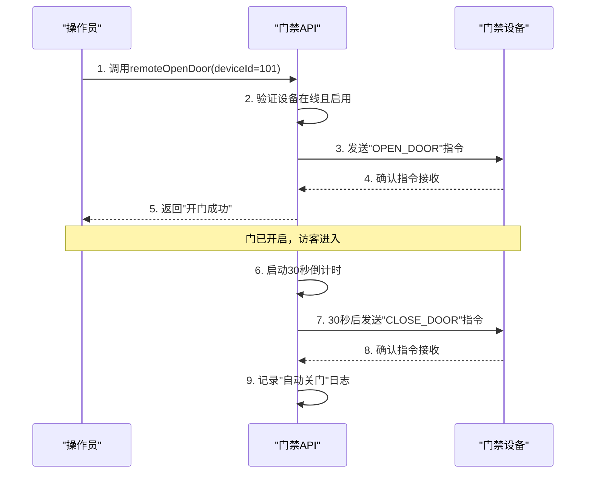
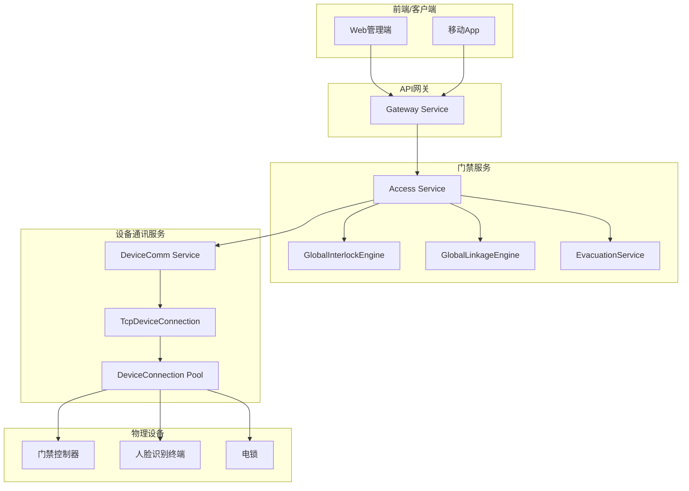

# 智能门禁控制API

<cite>
**本文档引用文件**
- [AccessDeviceService.java](file://documentation\technical\smart-access.md#L658-L1060)
- [TcpDeviceConnection.java](file://documentation\technical\smart-access.md#L1577-L1858)
- [DeviceCommunicationController.java](file://restful_refactor_backup_20251202_014224\microservices_ioedream-device-service_src_main_java_net_lab1024_sa_device_controller_DeviceCommunicationController.java)
- [GlobalInterlockController.java](file://restful_refactor_backup_20251202_014224\microservices_ioedream-access-service_src_main_java_net_lab1024_sa_access_advanced_controller_GlobalInterlockController.java)
- [GlobalLinkageController.java](file://restful_refactor_backup_20251202_014224\microservices_ioedream-access-service_src_main_java_net_lab1024_sa_access_advanced_controller_GlobalLinkageController.java)
- [EvacuationController.java](file://restful_refactor_backup_20251202_014224\microservices_ioedream-access-service_src_main_java_net_lab1024_sa_access_advanced_controller_EvacuationController.java)
- [功能概述.md](file://documentation\03-业务模块\门禁系统\功能概述.md)
</cite>

## 目录
1. [引言](#引言)
2. [核心控制API](#核心控制api)
3. [联动控制API](#联动控制api)
4. [设备通讯服务交互](#设备通讯服务交互)
5. [执行状态反馈与超时处理](#执行状态反馈与超时处理)
6. [应用场景示例](#应用场景示例)
7. [架构与数据流](#架构与数据流)

## 引言

智能门禁控制API是智慧园区一卡通管理平台的核心组成部分，提供对门禁设备的实时远程控制能力。本API允许管理员或授权系统通过HTTP请求对门禁设备执行开门、关门、锁定、解锁等操作，并支持触发复杂的联动控制场景，如“一键疏散”或“全局布防”。API设计遵循RESTful规范，确保了操作的可靠性和可追溯性。

本API与设备通讯服务紧密集成，通过TCP协议与终端设备建立稳定连接，确保控制指令能够可靠地下发到目标设备。系统具备完善的执行状态反馈机制和超时处理策略，确保操作的可监控性和系统的健壮性。

**Section sources**
- [功能概述.md](file://documentation\03-业务模块\门禁系统\功能概述.md#L1224-L1295)

## 核心控制API

核心控制API提供了对单个门禁设备进行直接操作的能力，是实现远程访问控制的基础。

### 远程开门与关门

`remoteOpenDoor` 和 `remoteCloseDoor` 是两个最基础的控制指令，用于远程操作门禁的开关状态。

**Diagram sources**
- [AccessDeviceService.java](file://documentation\technical\smart-access.md#L762-L797)
- [TcpDeviceConnection.java](file://documentation\technical\smart-access.md#L1650-L1652)

**Section sources**
- [AccessDeviceService.java](file://documentation\technical\smart-access.md#L762-L797)
- [TcpDeviceConnection.java](file://documentation\technical\smart-access.md#L1650-L1652)

### 设备锁定与解锁

除了简单的开关门，系统还提供了更高级的锁定功能，用于在特定情况下禁止设备操作。

**Diagram sources**
- [GlobalInterlockController.java](file://restful_refactor_backup_20251202_014224\microservices_ioedream-access-service_src_main_java_net_lab1024_sa_access_advanced_controller_GlobalInterlockController.java#L56-L152)

**Section sources**
- [GlobalInterlockController.java](file://restful_refactor_backup_20251202_014224\microservices_ioedream-access-service_src_main_java_net_lab1024_sa_access_advanced_controller_GlobalInterlockController.java#L56-L152)

## 联动控制API

联动控制API允许通过一个指令触发一系列预定义的自动化操作，实现复杂的业务场景。

### 全局布防与撤防

通过`GlobalLinkageController`，可以触发预设的联动规则，实现“一键布防”或“一键撤防”。

**Diagram sources**
- [GlobalLinkageController.java](file://restful_refactor_backup_20251202_014224\microservices_ioedream-access-service_src_main_java_net_lab1024_sa_access_advanced_controller_GlobalLinkageController.java#L52-L80)

**Section sources**
- [GlobalLinkageController.java](file://restful_refactor_backup_20251202_014224\microservices_ioedream-access-service_src_main_java_net_lab1024_sa_access_advanced_controller_GlobalLinkageController.java#L52-L80)

### 一键疏散

`EvacuationController` 提供了紧急情况下的疏散管理功能，可以一键开启所有安全通道。

**Diagram sources**
- [EvacuationController.java](file://restful_refactor_backup_20251202_014224\microservices_ioedream-access-service_src_main_java_net_lab1024_sa_access_advanced_controller_EvacuationController.java#L113-L116)

**Section sources**
- [EvacuationController.java](file://restful_refactor_backup_20251202_014224\microservices_ioedream-access-service_src_main_java_net_lab1024_sa_access_advanced_controller_EvacuationController.java#L113-L116)

## 设备通讯服务交互

智能门禁控制API通过设备通讯服务与物理终端设备进行交互，确保指令的可靠传输。

### TCP协议连接

系统使用TCP协议与门禁设备建立长连接，通过`TcpDeviceConnection`类实现。

**Diagram sources**
- [TcpDeviceConnection.java](file://documentation\technical\smart-access.md#L1577-L1858)

**Section sources**
- [TcpDeviceConnection.java](file://documentation\technical\smart-access.md#L1577-L1858)

### 指令下发流程

控制指令从API到设备的完整流程如下：

**Section sources**
- [AccessDeviceService.java](file://documentation\technical\smart-access.md#L777-L786)
- [TcpDeviceConnection.java](file://documentation\technical\smart-access.md#L1700-L1712)

## 执行状态反馈与超时处理

系统提供了完善的执行状态反馈和超时处理机制，确保操作的可监控性和可靠性。

### 状态反馈

系统通过多种方式提供状态反馈：
1.  **API响应**: HTTP请求的返回体包含操作结果。
2.  **设备状态查询**: 可通过`GET /api/device/{deviceId}/status`查询设备的实时状态。
3.  **事件监听**: `DeviceConnection`接口支持`DeviceEventListener`，可以接收来自设备的通行事件、告警等实时消息。

### 超时处理

系统在多个层面实现了超时处理：
1.  **连接超时**: 在建立TCP连接时设置5秒超时。
2.  **指令超时**: 虽然代码中未显式设置，但业务逻辑中通过`isConnected()`检查连接状态，间接处理了长时间无响应的情况。
3.  **心跳机制**: 通过`startHeartbeat()`方法每30秒发送一次心跳，如果连续多次未收到响应，则认为设备离线，断开连接。

**Section sources**
- [TcpDeviceConnection.java](file://documentation\technical\smart-access.md#L1602-L1603)
- [TcpDeviceConnection.java](file://documentation\technical\smart-access.md#L1764-L1765)

## 应用场景示例

### 远程为访客开门

以下是一个通过API远程为访客打开特定门区门禁，并在30秒后自动关闭的完整场景示例。

**Section sources**
- [AccessDeviceService.java](file://documentation\technical\smart-access.md#L762-L797)
- [AccessDeviceService.java](file://documentation\technical\smart-access.md#L803-L829)

## 架构与数据流

**Diagram sources**
- [功能概述.md](file://documentation\03-业务模块\门禁系统\功能概述.md#L114-L152)

**Section sources**
- [功能概述.md](file://documentation\03-业务模块\门禁系统\功能概述.md#L114-L152)