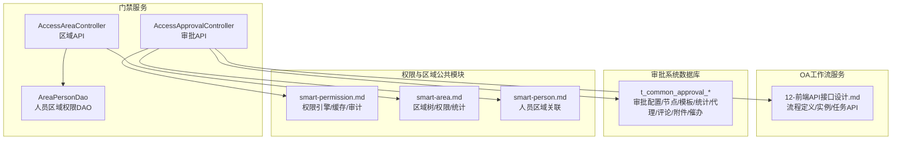
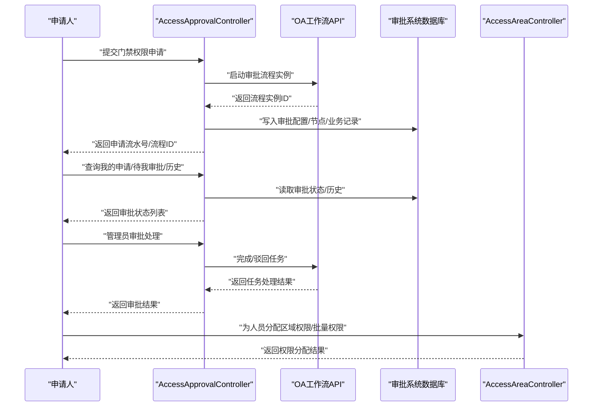
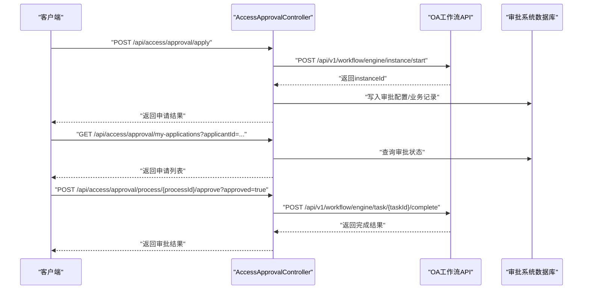
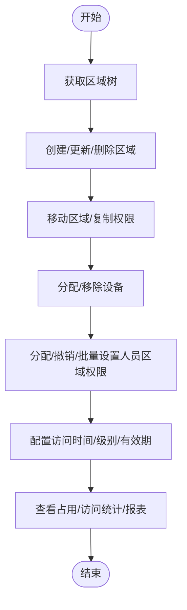
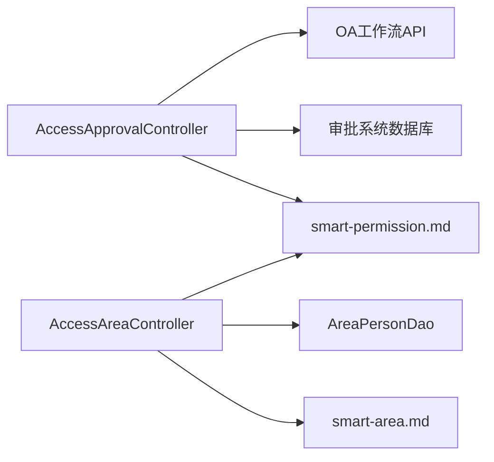
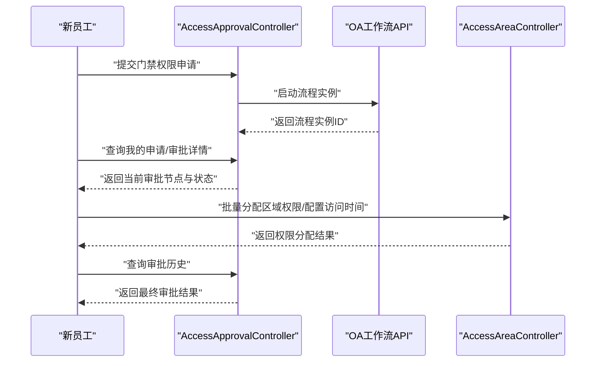

# 权限审批与配置API

<cite>
**本文引用的文件**
- [AccessApprovalController.java](file://restful_refactor_backup_20251202_014224/microservices_ioedream-access-service_src_main_java_net_lab1024_sa_access_approval_controller_AccessApprovalController.java)
- [AccessAreaController.java](file://restful_refactor_backup_20251202_014224/microservices_ioedream-access-service_src_main_java_net_lab1024_sa_access_area_controller_AccessAreaController.java)
- [smart-workflow.md](file://docs/COMMON_MODULES/smart-workflow.md)
- [12-前端API接口设计.md](file://documentation/03-业务模块/OA工作流/12-前端API接口设计.md)
- [APPROVAL_SYSTEM_DATABASE_SCHEMA.sql](file://documentation/technical/APPROVAL_SYSTEM_DATABASE_SCHEMA.sql)
- [smart-access.md](file://documentation/technical/smart-access.md)
- [smart-person.md](file://documentation/technical/smart-person.md)
- [smart-area.md](file://docs/COMMON_MODULES/smart-area.md)
- [smart-permission.md](file://docs/COMMON_MODULES/smart-permission.md)
- [AreaPersonDao.java](file://microservices/ioedream-access-service/src/main/java/net/lab1024/sa/access/dao/AreaPersonDao.java)
- [WORKFLOW_MODULE_COMPLETE_REPORT.md](file://documentation/03-业务模块/OA工作流/WORKFLOW_MODULE_COMPLETE_REPORT.md)
</cite>

## 目录
1. [引言](#引言)
2. [项目结构](#项目结构)
3. [核心组件](#核心组件)
4. [架构总览](#架构总览)
5. [详细组件分析](#详细组件分析)
6. [依赖关系分析](#依赖关系分析)
7. [性能考量](#性能考量)
8. [故障排查指南](#故障排查指南)
9. [结论](#结论)
10. [附录](#附录)

## 引言
本文件面向“门禁权限审批与配置API”的使用者与集成者，系统性说明如何通过API完成以下目标：
- 发起门禁权限申请（含临时权限与紧急权限）
- 查询审批流程状态与历史
- 管理员通过API进行审批处理
- 权限规则配置（基于时间、人员、区域的访问策略）
- 与OA工作流服务集成，实现审批流程自动化

文档同时给出一个完整场景示例：为一名新员工提交跨多个区域的门禁权限申请，并通过API查询当前审批节点与最终结果。

## 项目结构
围绕门禁权限审批与配置，涉及的关键模块与文件如下：
- 门禁审批API（AccessApprovalController）
- 区域管理API（AccessAreaController）
- OA工作流API（12-前端API接口设计.md）
- 审批系统数据库表（APPROVAL_SYSTEM_DATABASE_SCHEMA.sql）
- 门禁接入与审批流程联动（smart-access.md）
- 人员区域权限模型（smart-person.md、AreaPersonDao.java）
- 权限与区域公共模块（smart-permission.md、smart-area.md）

图表来源
- [AccessApprovalController.java](file://restful_refactor_backup_20251202_014224/microservices_ioedream-access-service_src_main_java_net_lab1024_sa_access_approval_controller_AccessApprovalController.java#L1-L194)
- [AccessAreaController.java](file://restful_refactor_backup_20251202_014224/microservices_ioedream-access-service_src_main_java_net_lab1024_sa_access_area_controller_AccessAreaController.java#L1-L335)
- [12-前端API接口设计.md](file://documentation/03-业务模块/OA工作流/12-前端API接口设计.md#L1-L897)
- [APPROVAL_SYSTEM_DATABASE_SCHEMA.sql](file://documentation/technical/APPROVAL_SYSTEM_DATABASE_SCHEMA.sql#L1-L260)
- [smart-access.md](file://documentation/technical/smart-access.md#L1102-L1127)
- [smart-person.md](file://documentation/technical/smart-person.md#L512-L540)
- [AreaPersonDao.java](file://microservices/ioedream-access-service/src/main/java/net/lab1024/sa/access/dao/AreaPersonDao.java#L1-L90)
- [smart-permission.md](file://docs/COMMON_MODULES/smart-permission.md#L1-L200)
- [smart-area.md](file://docs/COMMON_MODULES/smart-area.md#L1-L200)

章节来源
- [AccessApprovalController.java](file://restful_refactor_backup_20251202_014224/microservices_ioedream-access-service_src_main_java_net_lab1024_sa_access_approval_controller_AccessApprovalController.java#L1-L194)
- [AccessAreaController.java](file://restful_refactor_backup_20251202_014224/microservices_ioedream-access-service_src_main_java_net_lab1024_sa_access_area_controller_AccessAreaController.java#L1-L335)
- [12-前端API接口设计.md](file://documentation/03-业务模块/OA工作流/12-前端API接口设计.md#L1-L897)
- [APPROVAL_SYSTEM_DATABASE_SCHEMA.sql](file://documentation/technical/APPROVAL_SYSTEM_DATABASE_SCHEMA.sql#L1-L260)
- [smart-access.md](file://documentation/technical/smart-access.md#L1102-L1127)
- [smart-person.md](file://documentation/technical/smart-person.md#L512-L540)
- [AreaPersonDao.java](file://microservices/ioedream-access-service/src/main/java/net/lab1024/sa/access/dao/AreaPersonDao.java#L1-L90)
- [smart-permission.md](file://docs/COMMON_MODULES/smart-permission.md#L1-L200)
- [smart-area.md](file://docs/COMMON_MODULES/smart-area.md#L1-L200)

## 核心组件
- 门禁审批API（AccessApprovalController）
  - 提交申请、临时申请、紧急申请
  - 审批处理、撤回申请
  - 查询我的申请、待我审批、临时申请列表、审批详情、历史
- 区域管理API（AccessAreaController）
  - 区域树、创建/更新/删除、移动、复制权限
  - 设备分配/移除、人员权限分配/撤销、批量权限设置
  - 区域占用/访问统计、路径查询、报表
- OA工作流API（12-前端API接口设计.md）
  - 流程定义部署/激活/禁用/删除
  - 流程实例启动、任务受理/委派/转交/完成/驳回
  - 流程图/历史/统计
- 审批系统数据库（APPROVAL_SYSTEM_DATABASE_SCHEMA.sql）
  - 审批配置、节点配置、模板、统计、代理、评论、附件、催办
- 权限与区域公共模块
  - 权限引擎、缓存、审计（smart-permission.md）
  - 区域树/权限/统计（smart-area.md）
  - 人员区域关联与时间配置（smart-person.md、AreaPersonDao.java）
- 门禁接入与审批联动（smart-access.md）
  - 权限申请提交后启动审批流程

章节来源
- [AccessApprovalController.java](file://restful_refactor_backup_20251202_014224/microservices_ioedream-access-service_src_main_java_net_lab1024_sa_access_approval_controller_AccessApprovalController.java#L1-L194)
- [AccessAreaController.java](file://restful_refactor_backup_20251202_014224/microservices_ioedream-access-service_src_main_java_net_lab1024_sa_access_area_controller_AccessAreaController.java#L1-L335)
- [12-前端API接口设计.md](file://documentation/03-业务模块/OA工作流/12-前端API接口设计.md#L1-L897)
- [APPROVAL_SYSTEM_DATABASE_SCHEMA.sql](file://documentation/technical/APPROVAL_SYSTEM_DATABASE_SCHEMA.sql#L1-L260)
- [smart-access.md](file://documentation/technical/smart-access.md#L1102-L1127)
- [smart-person.md](file://documentation/technical/smart-person.md#L512-L540)
- [AreaPersonDao.java](file://microservices/ioedream-access-service/src/main/java/net/lab1024/sa/access/dao/AreaPersonDao.java#L1-L90)
- [smart-permission.md](file://docs/COMMON_MODULES/smart-permission.md#L1-L200)
- [smart-area.md](file://docs/COMMON_MODULES/smart-area.md#L1-L200)

## 架构总览
门禁权限审批与配置的整体架构由“门禁服务”、“OA工作流服务”、“审批系统数据库”、“权限与区域公共模块”共同组成。门禁服务通过API对外提供权限申请、审批、区域管理能力；OA工作流服务提供流程定义、实例、任务的生命周期管理；审批系统数据库承载审批配置与运行数据；权限与区域公共模块提供统一的权限校验、缓存与审计能力。

图表来源
- [AccessApprovalController.java](file://restful_refactor_backup_20251202_014224/microservices_ioedream-access-service_src_main_java_net_lab1024_sa_access_approval_controller_AccessApprovalController.java#L1-L194)
- [AccessAreaController.java](file://restful_refactor_backup_20251202_014224/microservices_ioedream-access-service_src_main_java_net_lab1024_sa_access_area_controller_AccessAreaController.java#L1-L335)
- [12-前端API接口设计.md](file://documentation/03-业务模块/OA工作流/12-前端API接口设计.md#L1-L897)
- [APPROVAL_SYSTEM_DATABASE_SCHEMA.sql](file://documentation/technical/APPROVAL_SYSTEM_DATABASE_SCHEMA.sql#L1-L260)

## 详细组件分析

### 门禁审批API（AccessApprovalController）
- 主要能力
  - 申请类：提交申请、临时申请、紧急申请
  - 审批类：审批处理、撤回申请
  - 查询类：我的申请、待我审批、临时申请列表、审批详情、历史
- 关键流程
  - 提交申请后，系统生成业务编码并启动OA工作流实例，随后写入审批配置与业务记录
  - 管理员审批完成后，流程实例推进至下一节点或结束，系统更新审批状态与结果

图表来源
- [AccessApprovalController.java](file://restful_refactor_backup_20251202_014224/microservices_ioedream-access-service_src_main_java_net_lab1024_sa_access_approval_controller_AccessApprovalController.java#L1-L194)
- [12-前端API接口设计.md](file://documentation/03-业务模块/OA工作流/12-前端API接口设计.md#L180-L476)
- [APPROVAL_SYSTEM_DATABASE_SCHEMA.sql](file://documentation/technical/APPROVAL_SYSTEM_DATABASE_SCHEMA.sql#L1-L260)

章节来源
- [AccessApprovalController.java](file://restful_refactor_backup_20251202_014224/microservices_ioedream-access-service_src_main_java_net_lab1024_sa_access_approval_controller_AccessApprovalController.java#L1-L194)

### 区域管理API（AccessAreaController）
- 主要能力
  - 区域树、创建/更新/删除、移动、复制权限
  - 设备分配/移除、人员权限分配/撤销、批量权限设置
  - 区域占用/访问统计、路径查询、报表
- 权限规则配置
  - 基于人员与区域的关联表，支持访问级别、访问时间配置、授权人、有效期等
  - DAO提供按时间范围查询有效权限、统计区域权限数量等能力

图表来源
- [AccessAreaController.java](file://restful_refactor_backup_20251202_014224/microservices_ioedream-access-service_src_main_java_net_lab1024_sa_access_area_controller_AccessAreaController.java#L1-L335)
- [smart-person.md](file://documentation/technical/smart-person.md#L512-L540)
- [AreaPersonDao.java](file://microservices/ioedream-access-service/src/main/java/net/lab1024/sa/access/dao/AreaPersonDao.java#L1-L90)

章节来源
- [AccessAreaController.java](file://restful_refactor_backup_20251202_014224/microservices_ioedream-access-service_src_main_java_net_lab1024_sa_access_area_controller_AccessAreaController.java#L1-L335)
- [smart-person.md](file://documentation/technical/smart-person.md#L512-L540)
- [AreaPersonDao.java](file://microservices/ioedream-access-service/src/main/java/net/lab1024/sa/access/dao/AreaPersonDao.java#L1-L90)

### OA工作流服务集成
- 流程定义与实例
  - 部署流程定义、激活/禁用、删除
  - 启动流程实例、受理/委派/转交/完成/驳回任务
  - 获取流程图、历史、统计
- 集成要点
  - 门禁审批在提交申请后，通过启动流程实例的方式接入OA工作流
  - 审批节点配置支持串行/并行/会签/或签/条件分支/自动节点等
  - 支持审批代理、评论、附件、催办等增强能力

章节来源
- [12-前端API接口设计.md](file://documentation/03-业务模块/OA工作流/12-前端API接口设计.md#L1-L897)
- [WORKFLOW_MODULE_COMPLETE_REPORT.md](file://documentation/03-业务模块/OA工作流/WORKFLOW_MODULE_COMPLETE_REPORT.md#L1-L106)

### 权限规则配置（基于时间、人员、区域）
- 时间规则
  - 人员区域关联表支持访问时间配置JSON字段，可按时间段、周期等设定有效时间范围
  - DAO提供按时间范围查询有效权限的能力，便于在门禁控制时快速判断
- 人员规则
  - 通过区域人员权限分配接口，为人员授予特定区域的访问级别与有效期
- 区域规则
  - 区域树形结构支持层级移动与复制权限，便于批量继承与下发
  - 区域占用/访问统计可用于策略调整与容量规划

章节来源
- [smart-person.md](file://documentation/technical/smart-person.md#L512-L540)
- [AreaPersonDao.java](file://microservices/ioedream-access-service/src/main/java/net/lab1024/sa/access/dao/AreaPersonDao.java#L1-L90)
- [AccessAreaController.java](file://restful_refactor_backup_20251202_014224/microservices_ioedream-access-service_src_main_java_net_lab1024_sa_access_area_controller_AccessAreaController.java#L1-L335)

### 与OA工作流服务的集成机制
- 门禁权限申请提交后，系统生成业务编码并启动OA工作流实例
- 审批节点配置决定审批链路（如部门经理、HR、总监等），并通过任务API完成受理/处理
- 审批完成后，系统更新门禁权限状态与有效期，实现审批流程自动化

章节来源
- [smart-access.md](file://documentation/technical/smart-access.md#L1102-L1127)
- [12-前端API接口设计.md](file://documentation/03-业务模块/OA工作流/12-前端API接口设计.md#L180-L476)

## 依赖关系分析
- 控制器层
  - AccessApprovalController 依赖 OA 工作流API 与审批系统数据库
  - AccessAreaController 依赖 区域权限DAO 与区域公共模块
- 数据层
  - 审批系统数据库提供审批配置、节点、模板、统计、代理、评论、附件、催办等表
  - 区域权限DAO提供按时间范围查询有效权限、统计区域权限数量等能力
- 公共模块
  - 权限引擎、缓存、审计（smart-permission.md）
  - 区域树/权限/统计（smart-area.md）

图表来源
- [AccessApprovalController.java](file://restful_refactor_backup_20251202_014224/microservices_ioedream-access-service_src_main_java_net_lab1024_sa_access_approval_controller_AccessApprovalController.java#L1-L194)
- [AccessAreaController.java](file://restful_refactor_backup_20251202_014224/microservices_ioedream-access-service_src_main_java_net_lab1024_sa_access_area_controller_AccessAreaController.java#L1-L335)
- [APPROVAL_SYSTEM_DATABASE_SCHEMA.sql](file://documentation/technical/APPROVAL_SYSTEM_DATABASE_SCHEMA.sql#L1-L260)
- [AreaPersonDao.java](file://microservices/ioedream-access-service/src/main/java/net/lab1024/sa/access/dao/AreaPersonDao.java#L1-L90)
- [smart-permission.md](file://docs/COMMON_MODULES/smart-permission.md#L1-L200)
- [smart-area.md](file://docs/COMMON_MODULES/smart-area.md#L1-L200)

章节来源
- [AccessApprovalController.java](file://restful_refactor_backup_20251202_014224/microservices_ioedream-access-service_src_main_java_net_lab1024_sa_access_approval_controller_AccessApprovalController.java#L1-L194)
- [AccessAreaController.java](file://restful_refactor_backup_20251202_014224/microservices_ioedream-access-service_src_main_java_net_lab1024_sa_access_area_controller_AccessAreaController.java#L1-L335)
- [APPROVAL_SYSTEM_DATABASE_SCHEMA.sql](file://documentation/technical/APPROVAL_SYSTEM_DATABASE_SCHEMA.sql#L1-L260)
- [AreaPersonDao.java](file://microservices/ioedream-access-service/src/main/java/net/lab1024/sa/access/dao/AreaPersonDao.java#L1-L90)
- [smart-permission.md](file://docs/COMMON_MODULES/smart-permission.md#L1-L200)
- [smart-area.md](file://docs/COMMON_MODULES/smart-area.md#L1-L200)

## 性能考量
- 权限缓存与审计
  - 权限引擎采用多级缓存策略，结合Redis加密缓存敏感权限信息，降低权限验证开销
  - 权限审计日志异步记录，避免阻塞主流程
- 区域权限查询
  - DAO提供按时间范围查询有效权限与统计能力，建议在高频查询场景下配合索引与缓存
- 审批流程
  - OA工作流采用高性能内存执行引擎，建议合理设计流程节点与分支，避免过度嵌套导致性能下降

章节来源
- [smart-permission.md](file://docs/COMMON_MODULES/smart-permission.md#L700-L800)
- [AreaPersonDao.java](file://microservices/ioedream-access-service/src/main/java/net/lab1024/sa/access/dao/AreaPersonDao.java#L1-L90)
- [smart-workflow.md](file://docs/COMMON_MODULES/smart-workflow.md#L1-L120)

## 故障排查指南
- 审批流程异常
  - 检查流程定义是否已部署并处于启用状态
  - 确认流程实例启动参数（definitionId、businessKey、variables、formData）正确
  - 查看流程历史与统计，定位卡点节点
- 权限未生效
  - 核对人员区域关联的有效时间范围与访问级别
  - 检查区域权限DAO查询是否返回预期结果
- 审批状态不一致
  - 对照审批系统数据库中的审批配置与节点配置，确认节点状态与流转条件
  - 关注超时流程与软删除标记

章节来源
- [12-前端API接口设计.md](file://documentation/03-业务模块/OA工作流/12-前端API接口设计.md#L1-L897)
- [APPROVAL_SYSTEM_DATABASE_SCHEMA.sql](file://documentation/technical/APPROVAL_SYSTEM_DATABASE_SCHEMA.sql#L1-L260)
- [AreaPersonDao.java](file://microservices/ioedream-access-service/src/main/java/net/lab1024/sa/access/dao/AreaPersonDao.java#L1-L90)

## 结论
通过门禁审批与配置API，企业可实现“申请—审批—授权—生效”的闭环管理。结合OA工作流服务，审批流程可灵活配置、可视化监控；结合区域与人员权限模型，可实现基于时间、人员、区域的精细化访问策略。建议在生产环境中充分利用缓存与审计能力，持续优化审批流程节点与分支，提升整体性能与用户体验。

## 附录

### 场景示例：为新员工提交跨多个区域的门禁权限申请
- 步骤
  1) 申请人通过门禁审批API提交权限申请，系统生成业务编码并启动OA工作流实例
  2) 管理员在OA工作流中受理任务，根据审批节点配置完成审批
  3) 审批完成后，系统更新门禁权限状态与有效期
  4) 通过门禁审批API查询当前审批节点与最终结果
  5) 通过区域管理API为该员工批量分配多个区域的权限，并配置访问时间与级别

图表来源
- [AccessApprovalController.java](file://restful_refactor_backup_20251202_014224/microservices_ioedream-access-service_src_main_java_net_lab1024_sa_access_approval_controller_AccessApprovalController.java#L1-L194)
- [AccessAreaController.java](file://restful_refactor_backup_20251202_014224/microservices_ioedream-access-service_src_main_java_net_lab1024_sa_access_area_controller_AccessAreaController.java#L1-L335)
- [12-前端API接口设计.md](file://documentation/03-业务模块/OA工作流/12-前端API接口设计.md#L180-L476)