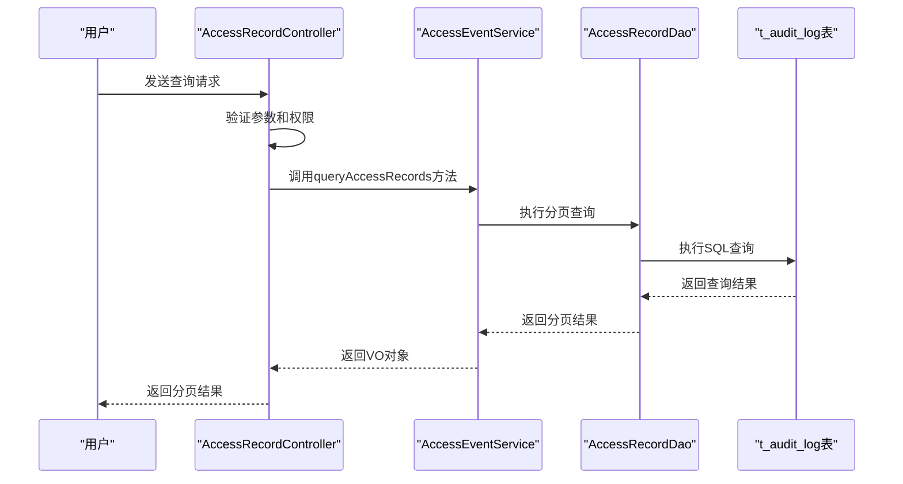
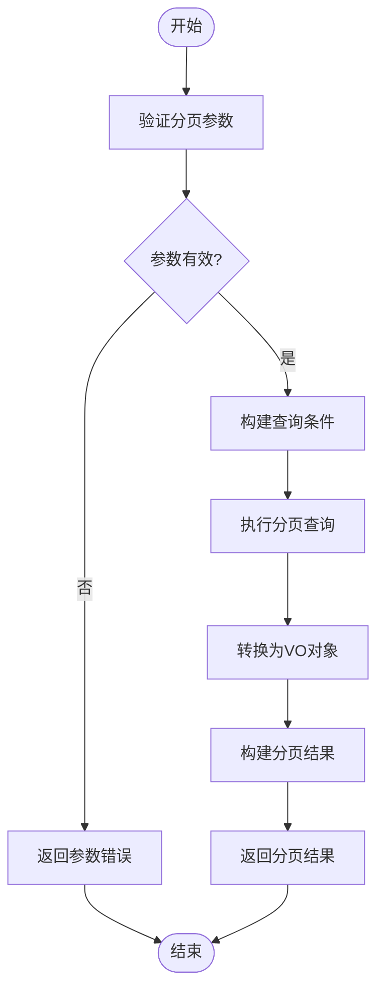
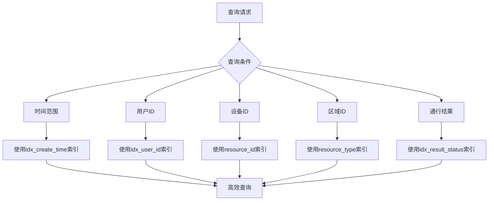
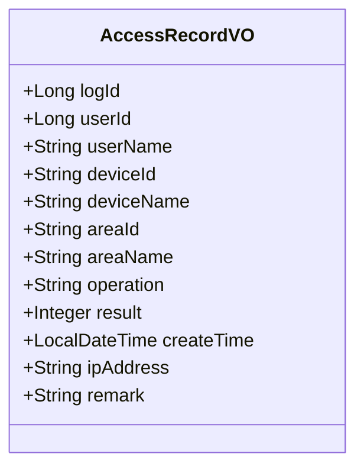
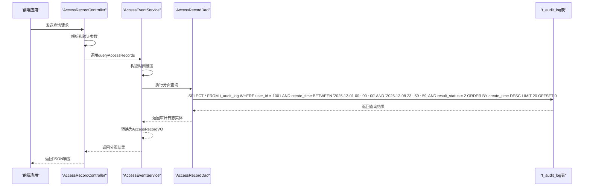

# 通行记录查询API

<cite>
**本文档引用文件**  
- [AccessRecordController.java](file://microservices\ioedream-access-service\src\main\java\net\lab1024\sa\access\controller\AccessRecordController.java)
- [AccessRecordQueryForm.java](file://microservices\ioedream-access-service\src\main\java\net\lab1024\sa\access\domain\form\AccessRecordQueryForm.java)
- [AccessRecordVO.java](file://microservices\ioedream-access-service\src\main\java\net\lab1024\sa\access\domain\vo\AccessRecordVO.java)
- [AccessEventServiceImpl.java](file://microservices\ioedream-access-service\src\main\java\net\lab1024\sa\access\service\impl\AccessEventServiceImpl.java)
- [t_audit_log.sql](file://database-scripts\common-service/10-t_audit_log.sql)
- [AccessRecordDao.java](file://microservices\ioedream-access-service\src\main\java\net\lab1024\sa\access\dao\AccessRecordDao.java)
</cite>

## 目录
1. [简介](#简介)
2. [核心查询功能](#核心查询功能)
3. [分页与排序](#分页与排序)
4. [性能优化建议](#性能优化建议)
5. [返回数据结构](#返回数据结构)
6. [查询示例](#查询示例)

## 简介
通行记录查询API是门禁系统的核心功能之一，用于查询人员的通行记录。该API支持根据人员ID、设备ID、时间范围、出入类型等条件进行高效查询。系统通过审计日志表`t_audit_log`存储所有门禁事件，确保数据的完整性和可追溯性。

**本文档引用文件**  
- [AccessRecordController.java](file://microservices\ioedream-access-service\src\main\java\net\lab1024\sa\access\controller\AccessRecordController.java)
- [t_audit_log.sql](file://database-scripts\common-service/10-t_audit_log.sql)

## 核心查询功能
通行记录查询API提供了灵活的查询功能，支持多种查询条件的组合。

### 查询参数
API支持以下查询参数：

| 参数 | 类型 | 必填 | 描述 |
|------|------|------|------|
| pageNum | Integer | 是 | 页码，从1开始 |
| pageSize | Integer | 是 | 每页大小 |
| userId | Long | 否 | 用户ID |
| deviceId | Long | 否 | 设备ID |
| areaId | String | 否 | 区域ID |
| startDate | LocalDate | 否 | 开始日期，格式：yyyy-MM-dd |
| endDate | LocalDate | 否 | 结束日期，格式：yyyy-MM-dd |
| accessResult | Integer | 否 | 通行结果：1-成功，2-失败，3-异常 |

### API端点
```
GET /api/v1/access/record/query
```

### 权限控制
查询操作需要`ACCESS_MANAGER`角色权限，通过`@PreAuthorize("hasRole('ACCESS_MANAGER')")`注解实现。



**图表来源**  
- [AccessRecordController.java](file://microservices\ioedream-access-service\src\main\java\net\lab1024\sa\access\controller\AccessRecordController.java#L117-L157)
- [AccessEventServiceImpl.java](file://microservices\ioedream-access-service\src\main\java\net\lab1024\sa\access\service\impl\AccessEventServiceImpl.java#L67-L122)
- [AccessRecordDao.java](file://microservices\ioedream-access-service\src\main\java\net\lab1024\sa\access\dao\AccessRecordDao.java#L24-L26)

**本节来源**  
- [AccessRecordController.java](file://microservices\ioedream-access-service\src\main\java\net\lab1024\sa\access\controller\AccessRecordController.java#L117-L157)
- [AccessRecordQueryForm.java](file://microservices\ioedream-access-service\src\main\java\net\lab1024\sa\access\domain\form\AccessRecordQueryForm.java#L24-L80)

## 分页与排序
### 分页参数
系统使用标准的分页参数，确保API的一致性和易用性。

- **pageNum**: 页码，从1开始，不能为空，必须大于0
- **pageSize**: 每页大小，不能为空，必须大于0

默认每页显示20条记录，最大页大小限制为100条，防止一次性查询过多数据影响系统性能。

### 排序机制
系统默认按创建时间降序排序，最新的记录排在前面。排序是在数据库层面实现的，确保查询效率。



**图表来源**  
- [AccessEventServiceImpl.java](file://microservices\ioedream-access-service\src\main\java\net\lab1024\sa\access\service\impl\AccessEventServiceImpl.java#L67-L122)

**本节来源**  
- [AccessRecordQueryForm.java](file://microservices\ioedream-access-service\src\main\java\net\lab1024\sa\access\domain\form\AccessRecordQueryForm.java#L24-L40)
- [AccessEventServiceImpl.java](file://microservices\ioedream-access-service\src\main\java\net\lab1024\sa\access\service\impl\AccessEventServiceImpl.java#L67-L122)

## 性能优化建议
### 数据库索引
为了确保大规模数据查询的性能，数据库表`t_audit_log`已经建立了多个索引：

```sql
KEY `idx_user_id` (`user_id`),
KEY `idx_module_name` (`module_name`),
KEY `idx_operation_type` (`operation_type`),
KEY `idx_result_status` (`result_status`),
KEY `idx_risk_level` (`risk_level`),
KEY `idx_trace_id` (`trace_id`),
KEY `idx_create_time` (`create_time`)
```

这些索引能够显著提高基于用户ID、模块名称、操作类型、结果状态、风险等级、追踪ID和创建时间的查询性能。

### 查询优化策略
1. **时间范围查询**: 建议使用`startDate`和`endDate`参数限制查询范围，避免全表扫描。
2. **组合索引**: 对于频繁使用的查询条件组合，可以考虑创建复合索引。
3. **缓存机制**: 对于频繁查询但不经常变化的数据，可以使用Redis等缓存技术。
4. **分页优化**: 避免查询过大的页码，建议使用游标分页（cursor-based pagination）替代基于偏移量的分页。

### 大数据量处理
当处理大规模数据查询时，建议：
- 限制查询时间范围，避免查询过长时间跨度的数据
- 使用合理的分页大小，避免一次性返回过多数据
- 考虑使用异步查询和导出功能，避免长时间阻塞



**图表来源**  
- [t_audit_log.sql](file://database-scripts\common-service/10-t_audit_log.sql#L30-L36)
- [AccessEventServiceImpl.java](file://microservices\ioedream-access-service\src\main\java\net\lab1024\sa\access\service\impl\AccessEventServiceImpl.java#L74-L82)

**本节来源**  
- [t_audit_log.sql](file://database-scripts\common-service/10-t_audit_log.sql#L30-L36)
- [AccessEventServiceImpl.java](file://microservices\ioedream-access-service\src\main\java\net\lab1024\sa\access\service\impl\AccessEventServiceImpl.java#L74-L82)

## 返回数据结构
### 通行记录VO
查询API返回的通行记录数据结构如下：



**图表来源**  
- [AccessRecordVO.java](file://microservices\ioedream-access-service\src\main\java\net\lab1024\sa\access\domain\vo\AccessRecordVO.java#L20-L89)

#### 字段说明
| 字段 | 类型 | 描述 |
|------|------|------|
| logId | Long | 记录ID |
| userId | Long | 用户ID |
| userName | String | 用户名 |
| deviceId | String | 设备ID |
| deviceName | String | 设备名称 |
| areaId | String | 区域ID |
| areaName | String | 区域名称 |
| operation | String | 操作类型（验证方式） |
| result | Integer | 操作结果：1-成功，2-失败，3-异常 |
| createTime | LocalDateTime | 操作时间 |
| ipAddress | String | IP地址 |
| remark | String | 备注 |

### 分页结果结构
系统使用统一的分页结果结构：

| 字段 | 类型 | 描述 |
|------|------|------|
| list | List<AccessRecordVO> | 记录列表 |
| total | Long | 总记录数 |
| pageNum | Integer | 当前页码 |
| pageSize | Integer | 每页大小 |
| pages | Integer | 总页数 |

**本节来源**  
- [AccessRecordVO.java](file://microservices\ioedream-access-service\src\main\java\net\lab1024\sa\access\domain\vo\AccessRecordVO.java#L20-L89)
- [AccessEventServiceImpl.java](file://microservices\ioedream-access-service\src\main\java\net\lab1024\sa\access\service\impl\AccessEventServiceImpl.java#L108-L113)

## 查询示例
### 查询员工过去一周的通行记录
以下示例展示如何查询某位员工在过去一周的所有通行记录，并筛选出所有"非法闯入"的记录。

#### 请求示例
```http
GET /api/v1/access/record/query?pageNum=1&pageSize=20&userId=1001&startDate=2025-12-01&endDate=2025-12-08&accessResult=2
```

#### 参数说明
- `userId=1001`: 查询用户ID为1001的员工
- `startDate=2025-12-01`: 开始日期为2025年12月1日
- `endDate=2025-12-08`: 结束日期为2025年12月8日
- `accessResult=2`: 筛选通行结果为"失败"的记录（非法闯入）

#### 处理流程


**图表来源**  
- [AccessRecordController.java](file://microservices\ioedream-access-service\src\main\java\net\lab1024\sa\access\controller\AccessRecordController.java#L117-L157)
- [AccessEventServiceImpl.java](file://microservices\ioedream-access-service\src\main\java\net\lab1024\sa\access\service\impl\AccessEventServiceImpl.java#L67-L122)
- [t_audit_log.sql](file://database-scripts\common-service/10-t_audit_log.sql#L9-L37)

**本节来源**  
- [AccessRecordController.java](file://microservices\ioedream-access-service\src\main\java\net\lab1024\sa\access\controller\AccessRecordController.java#L117-L157)
- [AccessRecordQueryForm.java](file://microservices\ioedream-access-service\src\main\java\net\lab1024\sa\access\domain\form\AccessRecordQueryForm.java#L24-L80)
- [AccessEventServiceImpl.java](file://microservices\ioedream-access-service\src\main\java\net\lab1024\sa\access\service\impl\AccessEventServiceImpl.java#L67-L122)