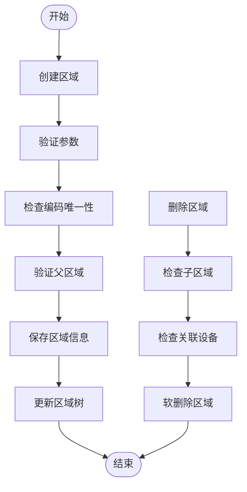
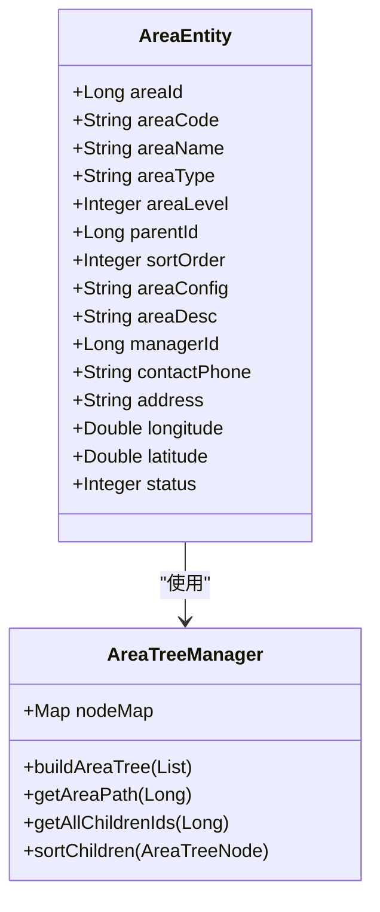
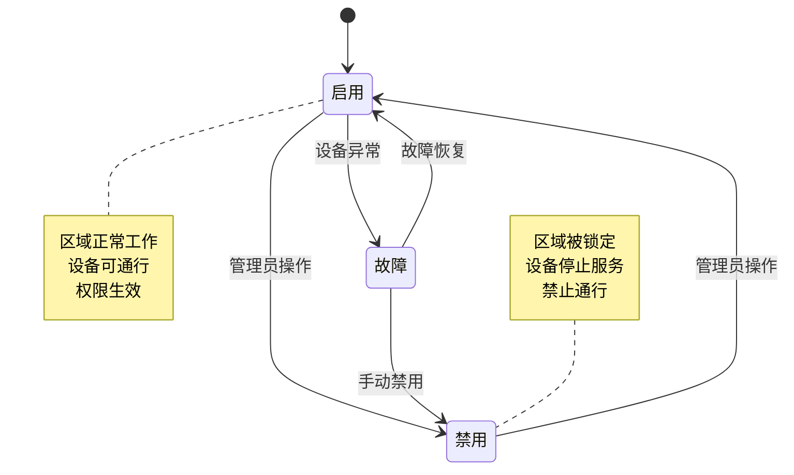

# 门禁区域管理API

<cite>
**本文档引用文件**  
- [smart-area.md](file://docs\COMMON_MODULES\smart-area.md)
- [smart-access.md](file://docs\COMMON_MODULES\smart-access.md)
- [AccessAreaController.java](file://restful_refactor_backup_20251202_014224\microservices_ioedream-access-service_src_main_java_net_lab1024_sa_access_controller_AccessAreaController.java)
- [AccessAreaDao.java](file://microservices\ioedream-access-service\src\main\java\net\lab1024\sa\access\dao\AccessAreaDao.java)
- [GlobalInterlockController.java](file://restful_refactor_backup_20251202_014224\microservices_ioedream-access-service_src_main_java_net_lab1024_sa_access_advanced_controller_GlobalInterlockController.java)
- [access-api.js](file://smart-admin-web-javascript\src\api\access\access-api.js)
- [12-前端API接口设计.md](file://documentation\03-业务模块\门禁\12-前端API接口设计.md)
</cite>

## 目录
1. [简介](#简介)
2. [区域管理API](#区域管理api)
3. [区域层级化管理](#区域层级化管理)
4. [区域与设备绑定](#区域与设备绑定)
5. [互锁区域配置](#互锁区域配置)
6. [区域状态管理](#区域状态管理)
7. [完整调用示例](#完整调用示例)
8. [API接口定义](#api接口定义)

## 简介

门禁区域管理API是SmartAdmin智慧园区管理系统的核心组成部分，提供对物理空间的逻辑化管理。系统支持多级区域结构（如园区-楼栋-楼层-房间），实现对门禁设备的分组管理、权限继承和互锁控制。通过该API，管理员可以创建、编辑、删除门禁区域，配置区域间的关联关系，并将物理设备分配到逻辑区域中。

**Section sources**
- [smart-area.md](file://docs\COMMON_MODULES\smart-area.md)
- [smart-access.md](file://docs\COMMON_MODULES\smart-access.md)

## 区域管理API

门禁区域管理API提供了一套完整的RESTful接口，用于管理门禁区域的生命周期。核心功能包括区域的创建、查询、更新和删除。

### 区域创建

通过POST请求创建新的门禁区域，需要提供区域名称、编码、类型、父级区域等信息。系统会自动验证区域编码的唯一性，并计算区域层级。

### 区域查询

支持多种查询方式：
- 分页查询区域列表
- 获取区域树形结构
- 查询区域详情
- 验证区域编码唯一性

### 区域更新与删除

支持对现有区域信息的更新，包括名称、类型、状态等。删除区域时，系统会检查是否存在子区域或关联设备，确保数据完整性。



**Diagram sources**
- [AccessAreaController.java](file://restful_refactor_backup_20251202_014224\microservices_ioedream-access-service_src_main_java_net_lab1024_sa_access_controller_AccessAreaController.java)
- [AccessAreaDao.java](file://microservices\ioedream-access-service\src\main\java\net\lab1024\sa\access\dao\AccessAreaDao.java)

**Section sources**
- [AccessAreaController.java](file://restful_refactor_backup_20251202_014224\microservices_ioedream-access-service_src_main_java_net_lab1024_sa_access_controller_AccessAreaController.java)

## 区域层级化管理

系统支持无限层级的区域树形结构，典型的层级关系为：园区 → 楼栋 → 楼层 → 房间。每个区域都有唯一的编码和层级标识，支持灵活的移动和重组。

### 层级结构

```json
{
  "areaId": 1000,
  "areaName": "总部园区",
  "areaType": "CAMPUS",
  "children": [
    {
      "areaId": 1001,
      "areaName": "A栋",
      "areaType": "BUILDING",
      "children": [
        {
          "areaId": 10011,
          "areaName": "1层",
          "areaType": "FLOOR",
          "children": [
            {
              "areaId": 100111,
              "areaName": "101室",
              "areaType": "ROOM"
            }
          ]
        }
      ]
    }
  ]
}
```

### 移动操作

支持将区域移动到其他父级下，系统会自动更新所有子区域的层级信息和路径。



**Diagram sources**
- [smart-area.md](file://docs\COMMON_MODULES\smart-area.md)
- [AccessAreaDao.java](file://microservices\ioedream-access-service\src\main\java\net\lab1024\sa\access\dao\AccessAreaDao.java)

**Section sources**
- [smart-area.md](file://docs\COMMON_MODULES\smart-area.md)

## 区域与设备绑定

门禁区域可以与一个或多个物理设备关联，实现设备的逻辑分组管理。每个设备只能属于一个区域，但区域的权限可以继承到所有子区域。

### 绑定流程

1. 验证区域和设备的存在性
2. 检查设备是否已绑定到其他区域
3. 创建区域-设备关联记录
4. 更新设备的区域信息

### API接口

```javascript
// 获取区域设备列表
export const getAreaDevices = (areaId, includeChildren = false) => {
  return getRequest(`/api/access/area/${areaId}/devices`, { includeChildren });
};

// 绑定设备到区域
export const bindDeviceToArea = (areaId, deviceId) => {
  return postRequest(`/api/access/area/${areaId}/device/bind`, { deviceId });
};

// 解绑设备
export const unbindDeviceFromArea = (areaId, deviceId) => {
  return postRequest(`/api/access/area/${areaId}/device/unbind`, { deviceId });
};
```

**Section sources**
- [smart-area.md](file://docs\COMMON_MODULES\smart-area.md)
- [access-api.js](file://smart-admin-web-javascript\src\api\access\access-api.js)

## 互锁区域配置

互锁区域是一种特殊的区域配置，用于实现多个门禁设备之间的互斥控制。当一个设备被激活时，其他互锁设备将被自动锁定，防止同时开启。

### 互锁规则

- **申请互锁**：设备使用前需申请互锁权限
- **自动释放**：使用完成后自动释放互锁
- **超时控制**：设置互锁超时时间，防止死锁
- **优先级管理**：支持不同优先级的互锁请求

### 控制器接口

```java
@RestController
@RequestMapping("/api/access/interlock")
@Tag(name = "全局互锁管理", description = "设备间互锁控制和管理")
public class GlobalInterlockController {

    @Resource
    private InterlockRuleService interlockRuleService;

    @Resource
    private InterlockLogService interlockLogService;

    @Resource
    private GlobalInterlockEngine interlockEngine;

    @PostMapping("/lock")
    @Operation(summary = "申请设备互锁", description = "为指定设备申请互锁")
    @SaCheckPermission("access:interlock:lock")
    public ResponseDTO<Boolean> requestDeviceLock(
            @RequestParam Long deviceId,
            @RequestParam String lockType,
            @RequestParam Long lockedBy,
            @RequestParam String reason,
            @RequestParam Integer priority,
            @RequestParam Long timeoutMs) {
        
        log.info("[GlobalInterlockController] 申请设备互锁: deviceId={}, lockType={}, lockedBy={}", 
                 deviceId, lockType, lockedBy);
        try {
            return interlockEngine.requestDeviceLock(deviceId, lockType, lockedBy, reason, priority, timeoutMs).get();
        } catch (Exception e) {
            log.error("[GlobalInterlockController] 申请设备互锁失败: deviceId={}, error={}", 
                      deviceId, e.getMessage());
            return ResponseDTO.error("申请设备互锁失败: " + e.getMessage());
        }
    }
}
```

**Section sources**
- [GlobalInterlockController.java](file://restful_refactor_backup_20251202_014224\microservices_ioedream-access-service_src_main_java_net_lab1024_sa_access_advanced_controller_GlobalInterlockController.java)

## 区域状态管理

区域状态直接影响其下所有设备的控制权限。区域状态分为"启用"和"禁用"两种。

### 状态影响

- **启用状态**：区域及其设备正常工作，允许通行
- **禁用状态**：区域被锁定，所有关联设备停止服务，禁止通行

### 状态变更



**Diagram sources**
- [AccessAreaController.java](file://restful_refactor_backup_20251202_014224\microservices_ioedream-access-service_src_main_java_net_lab1024_sa_access_controller_AccessAreaController.java)

**Section sources**
- [AccessAreaController.java](file://restful_refactor_backup_20251202_014224\microservices_ioedream-access-service_src_main_java_net_lab1024_sa_access_controller_AccessAreaController.java)

## 完整调用示例

以下示例展示如何创建一个包含多个设备的互锁区域：

### 1. 创建区域

```bash
POST /api/access/area/add
Content-Type: application/json

{
  "areaName": "数据中心机房",
  "areaCode": "DC-001",
  "areaType": "ROOM",
  "parentId": 10011,
  "sortOrder": 1,
  "areaDesc": "核心数据中心",
  "managerId": 1001,
  "contactPhone": "13800138001",
  "address": "A栋1层101室",
  "longitude": 116.397470,
  "latitude": 39.908823,
  "status": 1
}
```

### 2. 绑定设备

```bash
POST /api/access/area/100111/device/bind
Content-Type: application/json

{
  "deviceId": 2001,
  "deviceType": "DOOR"
}
```

### 3. 设置互锁

```bash
POST /api/access/interlock/lock
Content-Type: application/json

{
  "deviceId": 2001,
  "lockType": "INTERLOCK",
  "lockedBy": 1001,
  "reason": "机房维护",
  "priority": 1,
  "timeoutMs": 3600000
}
```

**Section sources**
- [AccessAreaController.java](file://restful_refactor_backup_20251202_014224\microservices_ioedream-access-service_src_main_java_net_lab1024_sa_access_controller_AccessAreaController.java)
- [GlobalInterlockController.java](file://restful_refactor_backup_20251202_014224\microservices_ioedream-access-service_src_main_java_net_lab1024_sa_access_advanced_controller_GlobalInterlockController.java)

## API接口定义

### 区域管理接口

| 接口 | 方法 | 描述 | 权限要求 |
|------|------|------|---------|
| `/api/access/area/tree` | GET | 获取区域树形结构 | access:area:query |
| `/api/access/area/page` | GET | 分页查询区域列表 | access:area:query |
| `/api/access/area/add` | POST | 创建区域 | access:area:add |
| `/api/access/area/{areaId}` | PUT | 更新区域 | access:area:update |
| `/api/access/area/{areaId}` | DELETE | 删除区域 | access:area:delete |
| `/api/access/area/{areaId}/status` | PUT | 更新区域状态 | access:area:update |
| `/api/access/area/{areaId}/move` | PUT | 移动区域 | access:area:update |

### 设备绑定接口

| 接口 | 方法 | 描述 | 权限要求 |
|------|------|------|---------|
| `/api/access/area/{areaId}/devices` | GET | 获取区域设备列表 | access:area:query |
| `/api/access/area/{areaId}/device/bind` | POST | 绑定设备 | access:area:device:bind |
| `/api/access/area/{areaId}/device/unbind` | POST | 解绑设备 | access:area:device:unbind |

### 互锁控制接口

| 接口 | 方法 | 描述 | 权限要求 |
|------|------|------|---------|
| `/api/access/interlock/lock` | POST | 申请设备互锁 | access:interlock:lock |
| `/api/access/interlock/unlock` | POST | 释放设备互锁 | access:interlock:unlock |
| `/api/access/interlock/force-unlock` | POST | 强制释放互锁 | access:interlock:force-unlock |

**Section sources**
- [12-前端API接口设计.md](file://documentation\03-业务模块\门禁\12-前端API接口设计.md)
- [AccessAreaController.java](file://restful_refactor_backup_20251202_014224\microservices_ioedream-access-service_src_main_java_net_lab1024_sa_access_controller_AccessAreaController.java)
- [GlobalInterlockController.java](file://restful_refactor_backup_20251202_014224\microservices_ioedream-access-service_src_main_java_net_lab1024_sa_access_advanced_controller_GlobalInterlockController.java)