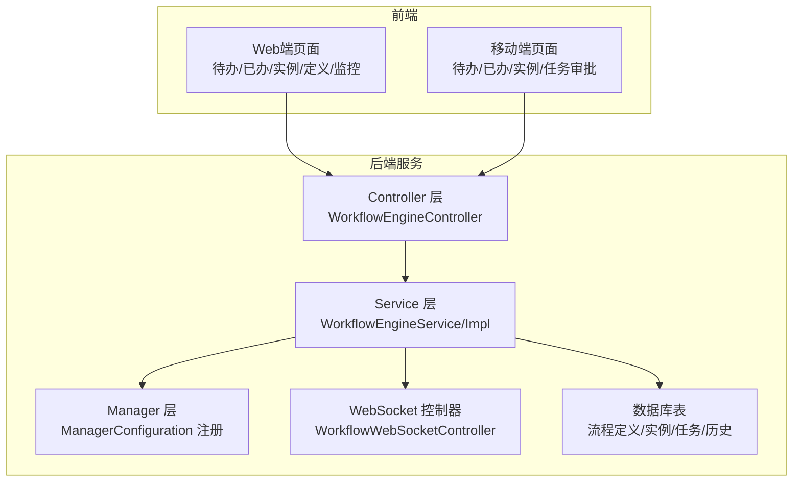
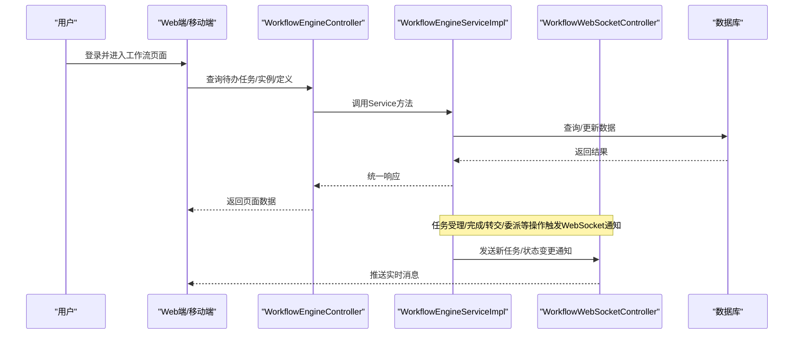
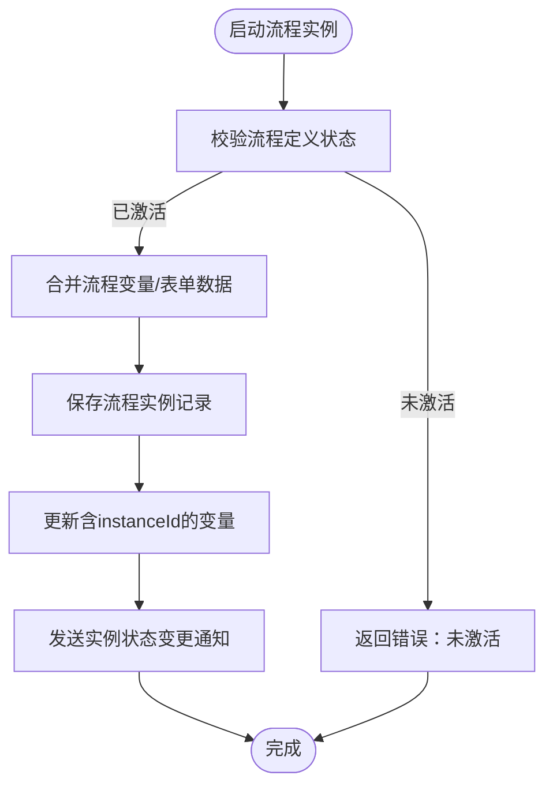
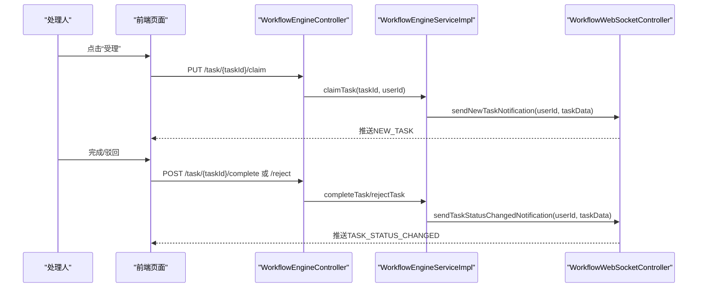
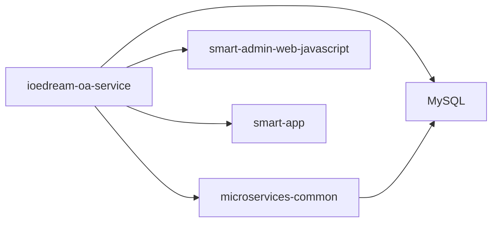

# OA工作流

<cite>
**本文引用的文件**
- [WorkflowEngineController.java](file://microservices/ioedream-oa-service/src/main/java/net/lab1024/sa/oa/workflow/controller/WorkflowEngineController.java)
- [WorkflowEngineService.java](file://microservices/ioedream-oa-service/src/main/java/net/lab1024/sa/oa/workflow/service/WorkflowEngineService.java)
- [WorkflowEngineServiceImpl.java](file://microservices/ioedream-oa-service/src/main/java/net/lab1024/sa/oa/workflow/service/impl/WorkflowEngineServiceImpl.java)
- [ManagerConfiguration.java](file://microservices/ioedream-oa-service/src/main/java/net/lab1024/sa/oa/workflow/config/ManagerConfiguration.java)
- [WorkflowWebSocketController.java](file://microservices/ioedream-oa-service/src/main/java/net/lab1024/sa/oa/workflow/websocket/WorkflowWebSocketController.java)
- [WorkflowDefinitionConstants.java](file://microservices/microservices-common/src/main/java/net/lab1024/sa/common/workflow/constant/WorkflowDefinitionConstants.java)
- [ApprovalConfigService.java](file://microservices/ioedream-oa-service/src/main/java/net/lab1024/sa/oa/workflow/service/ApprovalConfigService.java)
- [ApprovalConfigServiceImpl.java](file://microservices/ioedream-oa-service/src/main/java/net/lab1024/sa/oa/workflow/service/impl/ApprovalConfigServiceImpl.java)
- [smart-workflow.md](file://docs/COMMON_MODULES/smart-workflow.md)
- [smart-workflow.md](file://documentation/technical/smart-workflow.md)
- [OA工作流模块完整实施指南.md](file://OA工作流模块完整实施指南.md)
- [README.md（Web端）](file://smart-admin-web-javascript/src/views/business/oa/workflow/README.md)
- [README.md（移动端）](file://smart-app/pages/workflow/README.md)
- [workflow-menu-config.sql](file://sql/workflow-menu-config.sql)
</cite>

## 目录
1. [引言](#引言)
2. [项目结构](#项目结构)
3. [核心组件](#核心组件)
4. [架构总览](#架构总览)
5. [详细组件分析](#详细组件分析)
6. [依赖分析](#依赖分析)
7. [性能考虑](#性能考虑)
8. [故障排查指南](#故障排查指南)
9. [结论](#结论)
10. [附录](#附录)

## 引言
本文件面向OA工作流系统，围绕流程定义、流程实例、任务审批与流程监控等核心功能，系统阐述基于数据库实现的轻量工作流能力，以及与业务系统的集成方式。文档同时覆盖BPMN流程设计器的使用方法、流程配置流程、流程变量、监听器与任务分配规则的配置要点，并给出性能监控与优化建议，帮助开发者与运维人员快速理解与落地。

## 项目结构
OA工作流模块位于微服务架构中的 ioedream-oa-service，采用“四层架构”（Controller → Service → Manager → DAO），并通过公共模块提供审批配置、流程定义常量与通用实体/DAO。前端提供Web端与移动端页面，配合WebSocket实现实时通知。

图表来源
- [WorkflowEngineController.java](file://microservices/ioedream-oa-service/src/main/java/net/lab1024/sa/oa/workflow/controller/WorkflowEngineController.java#L1-L314)
- [WorkflowEngineServiceImpl.java](file://microservices/ioedream-oa-service/src/main/java/net/lab1024/sa/oa/workflow/service/impl/WorkflowEngineServiceImpl.java#L1-L200)
- [ManagerConfiguration.java](file://microservices/ioedream-oa-service/src/main/java/net/lab1024/sa/oa/workflow/config/ManagerConfiguration.java#L1-L66)
- [WorkflowWebSocketController.java](file://microservices/ioedream-oa-service/src/main/java/net/lab1024/sa/oa/workflow/websocket/WorkflowWebSocketController.java#L1-L160)

章节来源
- [WorkflowEngineController.java](file://microservices/ioedream-oa-service/src/main/java/net/lab1024/sa/oa/workflow/controller/WorkflowEngineController.java#L1-L314)
- [WorkflowEngineService.java](file://microservices/ioedream-oa-service/src/main/java/net/lab1024/sa/oa/workflow/service/WorkflowEngineService.java#L1-L293)
- [WorkflowEngineServiceImpl.java](file://microservices/ioedream-oa-service/src/main/java/net/lab1024/sa/oa/workflow/service/impl/WorkflowEngineServiceImpl.java#L1-L200)
- [ManagerConfiguration.java](file://microservices/ioedream-oa-service/src/main/java/net/lab1024/sa/oa/workflow/config/ManagerConfiguration.java#L1-L66)
- [WorkflowWebSocketController.java](file://microservices/ioedream-oa-service/src/main/java/net/lab1024/sa/oa/workflow/websocket/WorkflowWebSocketController.java#L1-L160)

## 核心组件
- 流程引擎控制器：提供流程定义、流程实例、任务管理与流程监控的完整REST API。
- 流程引擎服务：封装业务逻辑，负责流程部署、实例生命周期管理、任务受理/完成/驳回/转交/委派等。
- WebSocket控制器：负责心跳、订阅、点对点与广播消息推送，支撑实时通知。
- 审批配置服务：提供审批配置的CRUD与启停能力，支持按业务类型检索。
- 管理器配置：在公共模块基础上，注册Manager实现为Spring Bean，便于Service层注入。

章节来源
- [WorkflowEngineController.java](file://microservices/ioedream-oa-service/src/main/java/net/lab1024/sa/oa/workflow/controller/WorkflowEngineController.java#L1-L314)
- [WorkflowEngineService.java](file://microservices/ioedream-oa-service/src/main/java/net/lab1024/sa/oa/workflow/service/WorkflowEngineService.java#L1-L293)
- [WorkflowEngineServiceImpl.java](file://microservices/ioedream-oa-service/src/main/java/net/lab1024/sa/oa/workflow/service/impl/WorkflowEngineServiceImpl.java#L1-L200)
- [WorkflowWebSocketController.java](file://microservices/ioedream-oa-service/src/main/java/net/lab1024/sa/oa/workflow/websocket/WorkflowWebSocketController.java#L1-L160)
- [ApprovalConfigService.java](file://microservices/ioedream-oa-service/src/main/java/net/lab1024/sa/oa/workflow/service/ApprovalConfigService.java#L1-L98)
- [ApprovalConfigServiceImpl.java](file://microservices/ioedream-oa-service/src/main/java/net/lab1024/sa/oa/workflow/service/impl/ApprovalConfigServiceImpl.java#L1-L262)
- [ManagerConfiguration.java](file://microservices/ioedream-oa-service/src/main/java/net/lab1024/sa/oa/workflow/config/ManagerConfiguration.java#L1-L66)

## 架构总览
系统采用“后端微服务 + 前端多端”的架构，后端通过Controller暴露API，Service层编排业务，Manager层承载复杂流程与跨模块集成，DAO层访问数据库；前端通过页面与Store调用API，WebSocket实现任务与实例状态的实时推送。

图表来源
- [WorkflowEngineController.java](file://microservices/ioedream-oa-service/src/main/java/net/lab1024/sa/oa/workflow/controller/WorkflowEngineController.java#L1-L314)
- [WorkflowEngineServiceImpl.java](file://microservices/ioedream-oa-service/src/main/java/net/lab1024/sa/oa/workflow/service/impl/WorkflowEngineServiceImpl.java#L590-L800)
- [WorkflowWebSocketController.java](file://microservices/ioedream-oa-service/src/main/java/net/lab1024/sa/oa/workflow/websocket/WorkflowWebSocketController.java#L60-L160)

## 详细组件分析

### 流程定义与流程实例管理
- 流程定义管理：部署、分页查询、详情、激活/禁用、删除（支持级联）、版本化（当前保存BPMN XML或warm-flow定义）。
- 流程实例管理：启动、分页查询、详情、挂起/激活/终止/撤销、统计与监控。

图表来源
- [WorkflowEngineServiceImpl.java](file://microservices/ioedream-oa-service/src/main/java/net/lab1024/sa/oa/workflow/service/impl/WorkflowEngineServiceImpl.java#L304-L412)
- [WorkflowWebSocketController.java](file://microservices/ioedream-oa-service/src/main/java/net/lab1024/sa/oa/workflow/websocket/WorkflowWebSocketController.java#L120-L143)

章节来源
- [WorkflowEngineController.java](file://microservices/ioedream-oa-service/src/main/java/net/lab1024/sa/oa/workflow/controller/WorkflowEngineController.java#L51-L171)
- [WorkflowEngineServiceImpl.java](file://microservices/ioedream-oa-service/src/main/java/net/lab1024/sa/oa/workflow/service/impl/WorkflowEngineServiceImpl.java#L304-L412)

### 任务管理与审批流程
- 任务管理：分页查询我的待办/已办、任务详情、受理/取消受理、委派/转交、完成/驳回。
- 审批流程：通过Service层编排任务状态变更，结合WebSocket向处理人推送通知。

图表来源
- [WorkflowEngineController.java](file://microservices/ioedream-oa-service/src/main/java/net/lab1024/sa/oa/workflow/controller/WorkflowEngineController.java#L172-L313)
- [WorkflowEngineServiceImpl.java](file://microservices/ioedream-oa-service/src/main/java/net/lab1024/sa/oa/workflow/service/impl/WorkflowEngineServiceImpl.java#L590-L800)
- [WorkflowWebSocketController.java](file://microservices/ioedream-oa-service/src/main/java/net/lab1024/sa/oa/workflow/websocket/WorkflowWebSocketController.java#L66-L118)

章节来源
- [WorkflowEngineController.java](file://microservices/ioedream-oa-service/src/main/java/net/lab1024/sa/oa/workflow/controller/WorkflowEngineController.java#L172-L313)
- [WorkflowEngineServiceImpl.java](file://microservices/ioedream-oa-service/src/main/java/net/lab1024/sa/oa/workflow/service/impl/WorkflowEngineServiceImpl.java#L590-L800)
- [WorkflowWebSocketController.java](file://microservices/ioedream-oa-service/src/main/java/net/lab1024/sa/oa/workflow/websocket/WorkflowWebSocketController.java#L66-L118)

### 流程监控与统计
- 流程实例图与当前位置：获取流程实例的可视化流程图与当前节点位置。
- 流程历史记录：获取流程实例的完整历史记录。
- 统计信息：提供整体统计与用户工作量统计。

章节来源
- [WorkflowEngineController.java](file://microservices/ioedream-oa-service/src/main/java/net/lab1024/sa/oa/workflow/controller/WorkflowEngineController.java#L281-L313)
- [WorkflowEngineServiceImpl.java](file://microservices/ioedream-oa-service/src/main/java/net/lab1024/sa/oa/workflow/service/impl/WorkflowEngineServiceImpl.java#L1-L200)

### BPMN流程设计器与流程配置
- 设计器使用：前端通过bpmn-js渲染BPMN流程图，支持节点高亮与交互。
- 流程配置：后端接收BPMN XML，保存至流程定义表，后续启动流程时可结合业务变量与表单数据推进。

章节来源
- [README.md（Web端）](file://smart-admin-web-javascript/src/views/business/oa/workflow/README.md#L120-L140)
- [OA工作流模块完整实施指南.md](file://OA工作流模块完整实施指南.md#L85-L120)

### 审批配置与动态规则
- 审批配置：支持按业务类型、模块、状态分页查询，创建/更新/删除/启停配置。
- 动态审批：通过ManagerConfiguration注册Manager，结合审批配置实现动态审批规则与流程绑定。

章节来源
- [ApprovalConfigService.java](file://microservices/ioedream-oa-service/src/main/java/net/lab1024/sa/oa/workflow/service/ApprovalConfigService.java#L1-L98)
- [ApprovalConfigServiceImpl.java](file://microservices/ioedream-oa-service/src/main/java/net/lab1024/sa/oa/workflow/service/impl/ApprovalConfigServiceImpl.java#L1-L262)
- [ManagerConfiguration.java](file://microservices/ioedream-oa-service/src/main/java/net/lab1024/sa/oa/workflow/config/ManagerConfiguration.java#L1-L66)

### 流程变量、监听器与任务分配规则
- 流程变量：启动流程时传入variables与formData，保存至流程实例的变量字段，供后续节点使用。
- 监听器：当前实现通过Service层在关键节点（受理、完成、转交、委派、实例状态变更）调用WebSocket控制器推送通知。
- 任务分配规则：可通过审批配置与业务规则动态决定处理人（如部门经理、HR、总监等），并支持转办/委派。

章节来源
- [WorkflowEngineServiceImpl.java](file://microservices/ioedream-oa-service/src/main/java/net/lab1024/sa/oa/workflow/service/impl/WorkflowEngineServiceImpl.java#L304-L412)
- [WorkflowWebSocketController.java](file://microservices/ioedream-oa-service/src/main/java/net/lab1024/sa/oa/workflow/websocket/WorkflowWebSocketController.java#L66-L143)
- [ApprovalConfigServiceImpl.java](file://microservices/ioedream-oa-service/src/main/java/net/lab1024/sa/oa/workflow/service/impl/ApprovalConfigServiceImpl.java#L1-L262)

### 工作流引擎与各业务系统的集成
- 业务系统集成：通过审批配置与流程定义常量，将不同业务（如考勤、门禁、消费、访客）与对应流程绑定。
- 跨系统审批：通过审批配置的适用范围与通知配置，实现跨系统审批协作。

章节来源
- [WorkflowDefinitionConstants.java](file://microservices/microservices-common/src/main/java/net/lab1024/sa/common/workflow/constant/WorkflowDefinitionConstants.java#L1-L128)
- [ApprovalConfigServiceImpl.java](file://microservices/ioedream-oa-service/src/main/java/net/lab1024/sa/oa/workflow/service/impl/ApprovalConfigServiceImpl.java#L1-L262)

## 依赖分析
- 后端依赖：Spring Boot、MyBatis-Plus、Sa-Token、WebSocket（Spring Messaging）、数据库（MySQL）。
- 前端依赖：Vue 3 + Composition API、Pinia、bpmn-js、Axios/uni.request。
- 公共模块：提供审批配置DAO/实体、流程定义常量、统一响应与异常处理。

图表来源
- [ManagerConfiguration.java](file://microservices/ioedream-oa-service/src/main/java/net/lab1024/sa/oa/workflow/config/ManagerConfiguration.java#L1-L66)
- [README.md（Web端）](file://smart-admin-web-javascript/src/views/business/oa/workflow/README.md#L1-L120)
- [README.md（移动端）](file://smart-app/pages/workflow/README.md#L1-L80)

章节来源
- [ManagerConfiguration.java](file://microservices/ioedream-oa-service/src/main/java/net/lab1024/sa/oa/workflow/config/ManagerConfiguration.java#L1-L66)
- [README.md（Web端）](file://smart-admin-web-javascript/src/views/business/oa/workflow/README.md#L1-L120)
- [README.md（移动端）](file://smart-app/pages/workflow/README.md#L1-L80)

## 性能考虑
- 前端性能
  - 列表分页与虚拟滚动，减少DOM压力。
  - 图表与流程图按需渲染，避免一次性加载过多节点。
  - 组件按需加载与路由懒加载。
- 后端性能
  - 数据库索引优化（如流程实例、任务、历史表的常用查询字段）。
  - 查询结果缓存（Redis/Caffeine），降低热点查询压力。
  - 异步任务处理与批量更新，避免长事务阻塞。
- WebSocket
  - 心跳与自动重连机制，降低断线影响。
  - 点对点消息精准推送，避免广播风暴。

[本节为通用指导，不涉及特定文件]

## 故障排查指南
- WebSocket连接失败
  - 检查WebSocket服务器地址与认证token配置。
  - 确认后端WebSocket控制器已启用并正确注册。
- 流程图不显示
  - 确认bpmn-js已安装并在前端组件中启用。
- 任务状态未更新
  - 检查Service层是否正确调用WebSocket控制器推送通知。
- 审批配置异常
  - 检查业务类型唯一性与状态启停逻辑。

章节来源
- [OA工作流模块完整实施指南.md](file://OA工作流模块完整实施指南.md#L228-L256)
- [README.md（Web端）](file://smart-admin-web-javascript/src/views/business/oa/workflow/README.md#L227-L252)
- [README.md（移动端）](file://smart-app/pages/workflow/README.md#L138-L161)
- [WorkflowWebSocketController.java](file://microservices/ioedream-oa-service/src/main/java/net/lab1024/sa/oa/workflow/websocket/WorkflowWebSocketController.java#L1-L160)

## 结论
本工作流系统以数据库为核心，提供流程定义、实例、任务与监控的完整能力，并通过审批配置与流程定义常量实现跨业务系统的灵活集成。前端通过bpmn-js与WebSocket提升用户体验与实时性。建议在生产环境中完善索引、缓存与监控，持续优化流程变量与监听器配置，以满足高并发与复杂业务场景。

[本节为总结性内容，不涉及特定文件]

## 附录

### API概览（后端）
- 流程定义管理：部署、分页查询、详情、激活/禁用、删除
- 流程实例管理：启动、分页查询、详情、挂起/激活/终止/撤销
- 任务管理：分页查询我的待办/已办、详情、受理/取消受理、委派/转交、完成/驳回
- 流程监控：流程图与当前位置、历史记录、统计信息

章节来源
- [WorkflowEngineController.java](file://microservices/ioedream-oa-service/src/main/java/net/lab1024/sa/oa/workflow/controller/WorkflowEngineController.java#L51-L313)

### 菜单与权限配置
- 后端菜单SQL脚本：包含工作流主菜单、待办/已办/实例/定义/监控等子菜单与API权限点。
- 前端路由：通过后端菜单数据动态加载，确保页面与权限一致。

章节来源
- [OA工作流模块完整实施指南.md](file://OA工作流模块完整实施指南.md#L257-L359)
- [workflow-menu-config.sql](file://sql/workflow-menu-config.sql#L1-L360)

### 前端使用要点
- Web端：流程图组件启用bpmn-js，Store封装API调用，权限指令控制页面访问。
- 移动端：页面路由已配置，Store与API文件提供统一调用入口。

章节来源
- [README.md（Web端）](file://smart-admin-web-javascript/src/views/business/oa/workflow/README.md#L1-L120)
- [README.md（移动端）](file://smart-app/pages/workflow/README.md#L1-L80)