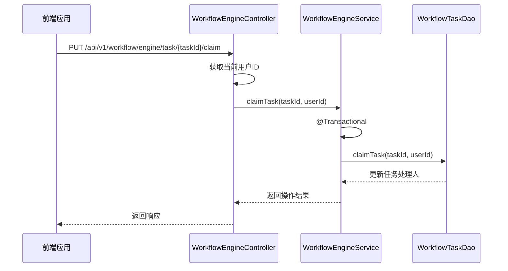
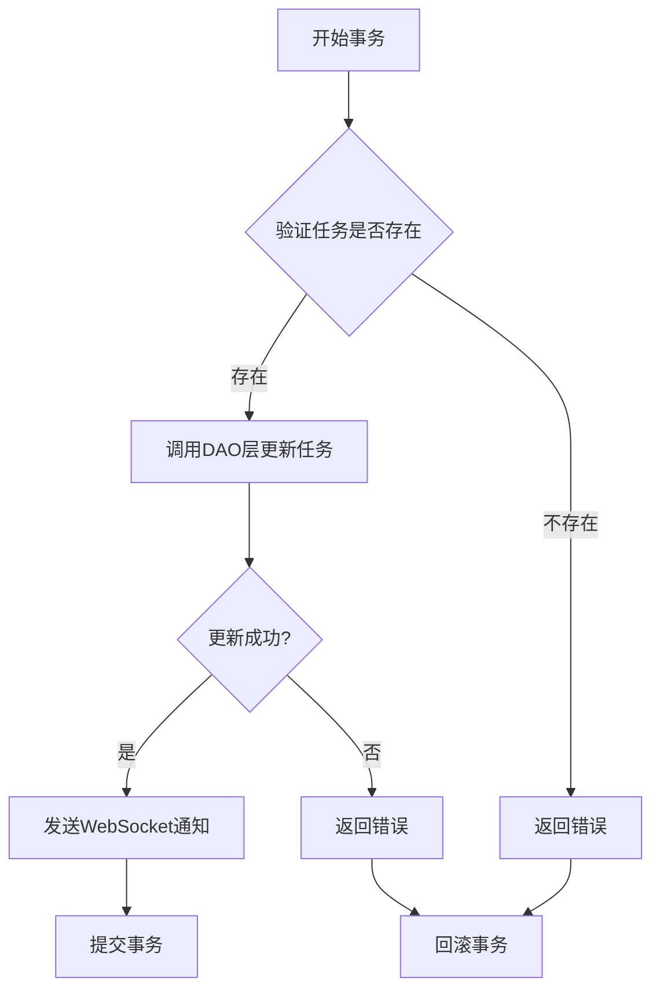
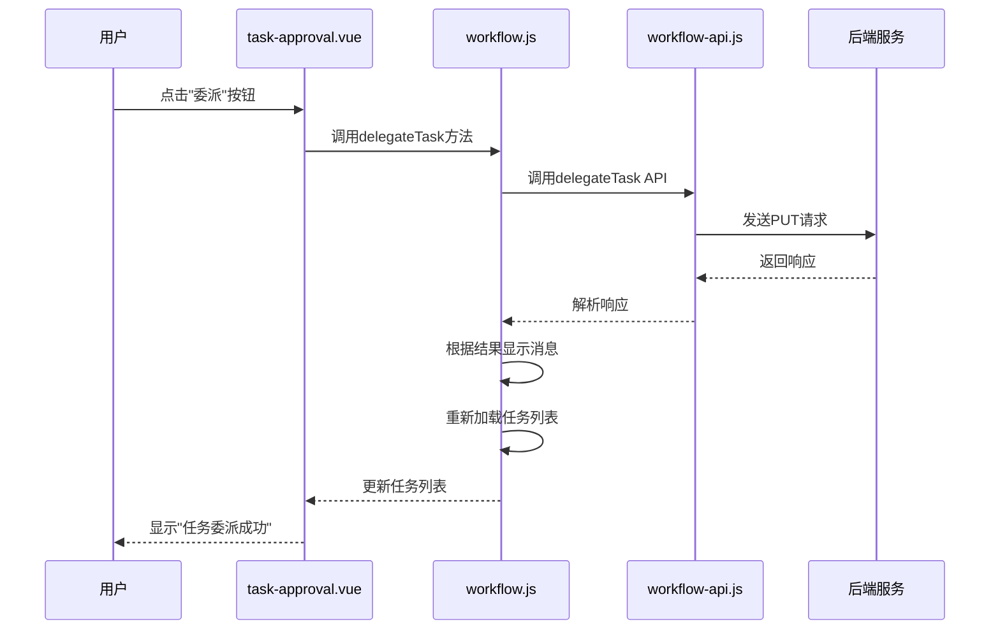
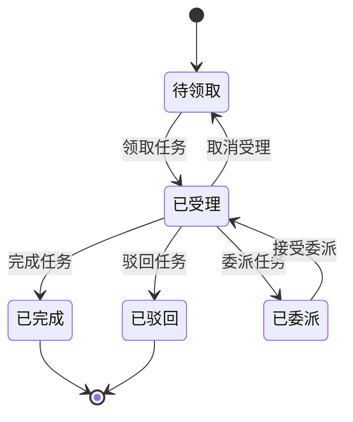
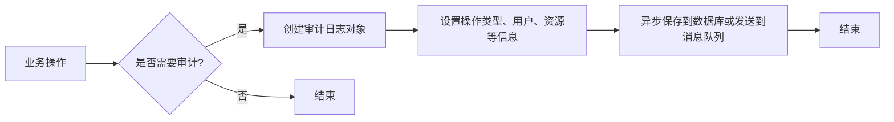

# 任务操作

<cite>
**本文档引用的文件**  
- [WorkflowEngineController.java](file://microservices\ioedream-oa-service\src\main\java\net\lab1024\sa\oa\workflow\controller\WorkflowEngineController.java)
- [WorkflowEngineServiceImpl.java](file://microservices\ioedream-oa-service\src\main\java\net\lab1024\sa\oa\workflow\service\impl\WorkflowEngineServiceImpl.java)
- [workflow-api.js](file://smart-admin-web-javascript\src\api\business\oa\workflow-api.js)
- [workflow.js](file://smart-admin-web-javascript\src\store\modules\business\workflow.js)
- [t_audit_log.sql](file://database-scripts\common-service\10-t_audit_log.sql)
- [smart-workflow.md](file://documentation\technical\smart-workflow.md)
</cite>

## 目录
1. [任务操作机制](#任务操作机制)
2. [事务控制与权限校验](#事务控制与权限校验)
3. [前端组件交互流程](#前端组件交互流程)
4. [幂等性与并发处理](#幂等性与并发处理)
5. [操作日志与审计追踪](#操作日志与审计追踪)

## 任务操作机制

任务操作是工作流系统的核心功能，主要包括任务领取、转办、委托和退回等操作。系统通过`WorkflowEngineController`提供RESTful API接口，前端通过`workflow-api.js`调用这些接口实现任务操作。

任务领取（claimTask）操作允许用户将待办任务从公共任务池中领取到个人任务列表中，使其成为该任务的处理人。任务取消受理（unclaimTask）则允许用户将已领取的任务退回公共任务池。任务委派（delegateTask）和转交（transferTask）操作允许用户将任务转移给其他用户处理。



**图1：任务领取操作序列图**

**Diagram sources**
- [WorkflowEngineController.java](file://microservices\ioedream-oa-service\src\main\java\net\lab1024\sa\oa\workflow\controller\WorkflowEngineController.java#L229-L236)
- [WorkflowEngineServiceImpl.java](file://microservices\ioedream-oa-service\src\main\java\net\lab1024\sa\oa\workflow\service\impl\WorkflowEngineServiceImpl.java#L701-L729)
- [workflow-api.js](file://smart-admin-web-javascript\src\api\business\oa\workflow-api.js#L217-L224)

**Section sources**
- [WorkflowEngineController.java](file://microservices\ioedream-oa-service\src\main\java\net\lab1024\sa\oa\workflow\controller\WorkflowEngineController.java#L229-L270)
- [WorkflowEngineServiceImpl.java](file://microservices\ioedream-oa-service\src\main\java\net\lab1024\sa\oa\workflow\service\impl\WorkflowEngineServiceImpl.java#L701-L829)

## 事务控制与权限校验

任务操作的实现中，系统采用了严格的事务控制和权限校验机制，确保操作的原子性和安全性。

### 事务控制

所有任务操作方法都使用了`@Transactional(rollbackFor = Exception.class)`注解，确保在发生异常时能够自动回滚事务，保持数据一致性。例如，在`claimTask`方法中，如果在更新任务处理人的过程中发生任何异常，数据库操作将被回滚，避免出现数据不一致的情况。



**图2：任务操作事务流程图**

**Diagram sources**
- [WorkflowEngineServiceImpl.java](file://microservices\ioedream-oa-service\src\main\java\net\lab1024\sa\oa\workflow\service\impl\WorkflowEngineServiceImpl.java#L702-L754)

### 权限校验

系统在任务操作前进行了严格的权限校验。以`delegateTask`方法为例，系统首先验证任务是否存在，然后检查当前用户是否为任务的受理人。只有任务的当前处理人才能进行委派操作，确保了操作的安全性。

```java
// 委派任务权限校验逻辑
WorkflowTaskEntity task = workflowTaskDao.selectById(taskId);
if (task == null) {
    return ResponseDTO.error("WORKFLOW_TASK_NOT_FOUND", "任务不存在");
}

Long originalUserId = task.getAssigneeId();
if (originalUserId == null) {
    return ResponseDTO.error("TASK_NOT_CLAIMED", "任务尚未被受理，无法委派");
}

// 检查当前用户是否有权限委派此任务
Long currentUserId = SmartRequestUtil.getUserId();
if (!originalUserId.equals(currentUserId)) {
    return ResponseDTO.error("NO_PERMISSION", "无权限委派此任务");
}
```

**Section sources**
- [WorkflowEngineServiceImpl.java](file://microservices\ioedream-oa-service\src\main\java\net\lab1024\sa\oa\workflow\service\impl\WorkflowEngineServiceImpl.java#L756-L792)

## 前端组件交互流程

前端通过`task-approval.vue`组件实现了任务操作的用户界面和交互逻辑。组件通过Vuex store管理任务状态，并通过API调用与后端进行通信。

### 操作按钮显示条件

任务操作按钮的显示基于任务的当前状态和用户权限。系统通过计算属性动态决定哪些按钮应该显示：

- **受理按钮**：当任务未被受理且当前用户有权限处理时显示
- **取消受理按钮**：当任务已被当前用户受理时显示
- **委派按钮**：当任务已被受理且当前用户是处理人时显示
- **转交按钮**：当任务已被受理且当前用户是处理人时显示
- **完成按钮**：当任务已被受理且当前用户是处理人时显示

### 交互流程

前端组件的交互流程如下：
1. 用户加载待办任务列表
2. 点击操作按钮触发相应方法
3. 调用API接口执行操作
4. 根据响应结果更新UI并显示提示信息
5. 重新加载任务列表以反映最新状态



**图3：前端任务委派操作流程**

**Diagram sources**
- [workflow.js](file://smart-admin-web-javascript\src\store\modules\business\workflow.js#L248-L269)
- [workflow-api.js](file://smart-admin-web-javascript\src\api\business\oa\workflow-api.js#L235-L245)

**Section sources**
- [workflow.js](file://smart-admin-web-javascript\src\store\modules\business\workflow.js#L207-L342)
- [workflow-api.js](file://smart-admin-web-javascript\src\api\business\oa\workflow-api.js#L217-L257)

## 幂等性保证方案和并发冲突处理策略

为确保系统在高并发场景下的稳定性和数据一致性，系统采用了多种幂等性保证和并发冲突处理策略。

### 幂等性保证

系统通过以下方式保证操作的幂等性：
1. **数据库唯一约束**：在关键表上设置唯一索引，防止重复操作
2. **状态机模式**：任务状态转换遵循严格的规则，防止非法状态转换
3. **乐观锁机制**：在更新操作中使用版本号或时间戳，检测并发修改



**图4：任务状态转换图**

### 并发冲突处理

系统采用以下策略处理并发冲突：
1. **数据库行级锁**：在更新任务时，数据库自动对相关行加锁，防止并发修改
2. **事务隔离级别**：使用适当的事务隔离级别，避免脏读、不可重复读和幻读
3. **重试机制**：在发生并发冲突时，前端可以实现重试逻辑

```java
// 并发冲突处理示例
@Transactional(rollbackFor = Exception.class)
public ResponseDTO<String> claimTask(Long taskId, Long userId) {
    try {
        // 使用数据库行级锁确保并发安全
        int updateCount = workflowTaskDao.claimTask(taskId, userId);
        if (updateCount > 0) {
            return ResponseDTO.ok("受理成功");
        } else {
            return ResponseDTO.error("受理失败，任务可能已被他人领取");
        }
    } catch (Exception e) {
        log.error("受理任务失败，任务ID: {}", taskId, e);
        return ResponseDTO.error("受理任务失败: " + e.getMessage());
    }
}
```

**Section sources**
- [WorkflowEngineServiceImpl.java](file://microservices\ioedream-oa-service\src\main\java\net\lab1024\sa\oa\workflow\service\impl\WorkflowEngineServiceImpl.java#L701-L754)

## 操作日志记录格式和审计追踪实现方式

系统实现了完整的操作日志记录和审计追踪功能，确保所有关键操作都有迹可循。

### 日志记录格式

操作日志记录在`t_audit_log`表中，包含以下关键字段：
- `operation_type`：操作类型（如任务领取、任务委派等）
- `user_id`：操作用户ID
- `resource_id`：资源ID（如任务ID）
- `operation_result`：操作结果（成功/失败）
- `details`：操作详情（JSON格式）
- `client_ip`：客户端IP地址
- `trace_id`：追踪ID，用于关联分布式调用链

```sql
-- t_audit_log表结构
CREATE TABLE `t_audit_log` (
    `log_id` BIGINT AUTO_INCREMENT PRIMARY KEY,
    `operation_type` INT NOT NULL COMMENT '操作类型',
    `user_id` BIGINT NOT NULL COMMENT '用户ID',
    `user_name` VARCHAR(50) NOT NULL COMMENT '用户名',
    `module_name` VARCHAR(50) NOT NULL COMMENT '模块名称',
    `resource_type` VARCHAR(50) COMMENT '资源类型',
    `resource_id` VARCHAR(100) COMMENT '资源ID',
    `operation_result` INT NOT NULL COMMENT '操作结果',
    `details` TEXT COMMENT '详情',
    `client_ip` VARCHAR(50) COMMENT '客户端IP',
    `trace_id` VARCHAR(100) COMMENT '追踪ID',
    `execution_time` BIGINT COMMENT '执行时间（毫秒）',
    `create_time` DATETIME NOT NULL DEFAULT CURRENT_TIMESTAMP COMMENT '创建时间'
) ENGINE=InnoDB DEFAULT CHARSET=utf8mb4 COLLATE=utf8mb4_unicode_ci COMMENT='审计日志表';
```

### 审计追踪实现

系统通过以下方式实现审计追踪：
1. **AOP切面**：在关键服务方法上使用AOP切面自动记录操作日志
2. **手动记录**：在复杂业务逻辑中手动创建审计日志记录
3. **异步处理**：使用消息队列异步处理日志记录，避免影响主业务流程性能



**图5：审计追踪流程图**

**Diagram sources**
- [t_audit_log.sql](file://database-scripts\common-service\10-t_audit_log.sql#L1-L38)
- [smart-workflow.md](file://documentation\technical\smart-workflow.md#L45-L82)

**Section sources**
- [t_audit_log.sql](file://database-scripts\common-service\10-t_audit_log.sql#L1-L38)
- [smart-workflow.md](file://documentation\technical\smart-workflow.md#L45-L82)