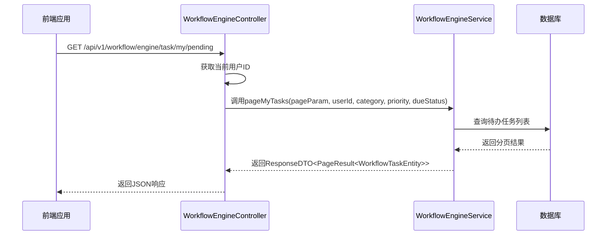
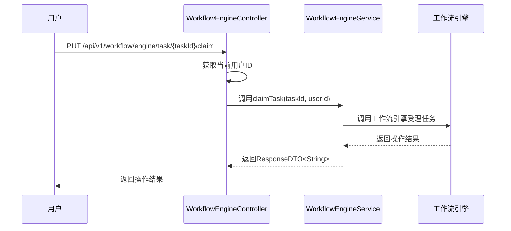
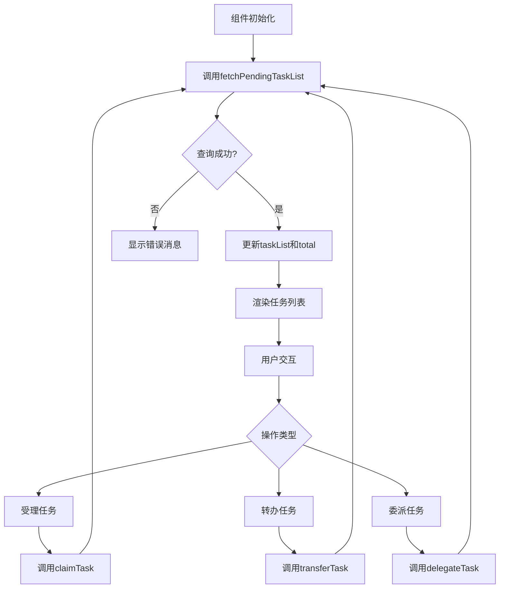
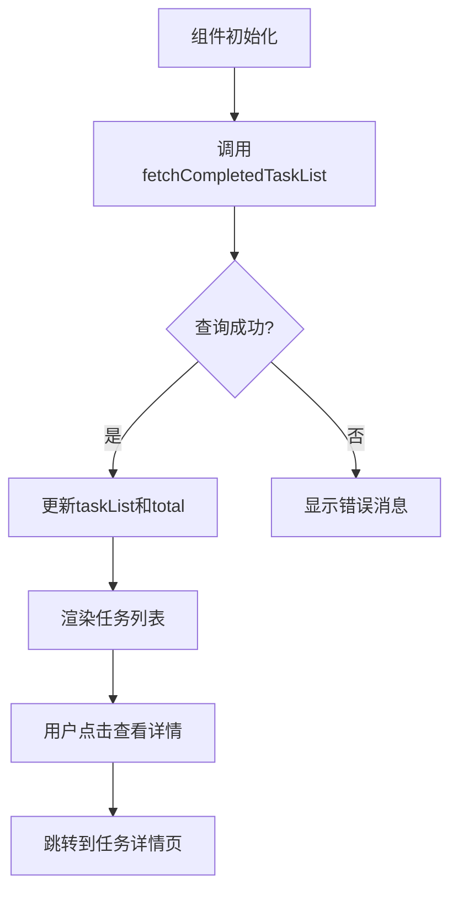
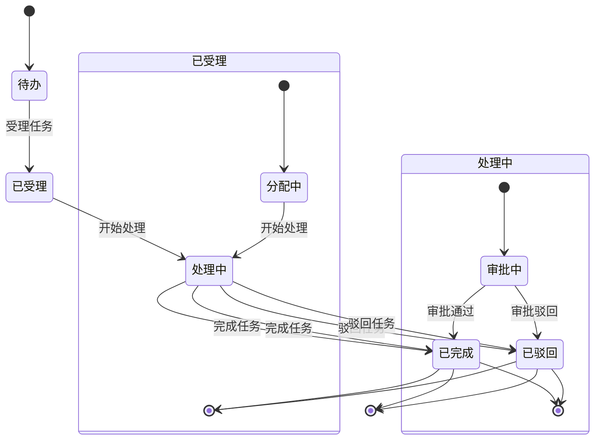
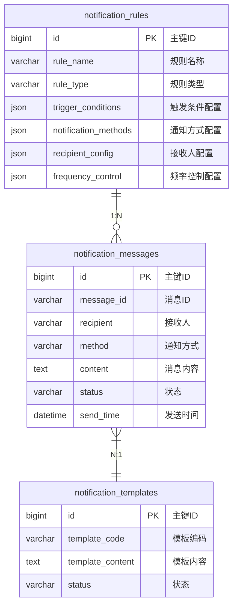

# 任务管理

<cite>
**本文档引用文件**   
- [WorkflowEngineController.java](file://microservices\ioedream-oa-service\src\main\java\net\lab1024\sa\oa\workflow\controller\WorkflowEngineController.java)
- [pending-task-list.vue](file://smart-admin-web-javascript\src\views\business\oa\workflow\task\pending-task-list.vue)
- [completed-task-list.vue](file://smart-admin-web-javascript\src\views\business\oa\workflow\task\completed-task-list.vue)
- [workflow.js](file://smart-admin-web-javascript\src\store\modules\business\workflow.js)
- [workflow-api.js](file://smart-admin-web-javascript\src\api\business\oa\workflow-api.js)
- [WorkflowEngineService.java](file://microservices\ioedream-oa-service\src\main\java\net\lab1024\sa\oa\workflow\service\WorkflowEngineService.java)
- [smart-workflow.md](file://documentation\technical\smart-workflow.md)
- [performance_optimization.sql](file://database\performance_optimization.sql)
- [考勤系统数据库ER图设计.md](file://documentation\03-业务模块\考勤\考勤系统数据库ER图设计.md)
</cite>

## 目录
1. [任务生命周期管理](#任务生命周期管理)
2. [接口实现逻辑](#接口实现逻辑)
3. [前端组件数据绑定与交互](#前端组件数据绑定与交互)
4. [任务状态机模型](#任务状态机模型)
5. [分页查询性能优化方案](#分页查询性能优化方案)
6. [任务提醒机制实现](#任务提醒机制实现)

## 任务生命周期管理

本系统实现了完整的任务生命周期管理，涵盖待办任务、已办任务和任务详情的全生命周期。任务生命周期从流程实例启动开始，经过任务分配、受理、处理、完成等阶段，最终归档为历史记录。系统通过工作流引擎控制器统一管理任务的创建、查询、处理和状态变更，确保任务处理过程的完整性和可追溯性。

**Section sources**
- [WorkflowEngineController.java](file://microservices\ioedream-oa-service\src\main\java\net\lab1024\sa\oa\workflow\controller\WorkflowEngineController.java#L172-L279)
- [WorkflowEngineService.java](file://microservices\ioedream-oa-service\src\main\java\net\lab1024\sa\oa\workflow\service\WorkflowEngineService.java#L154-L253)

## 接口实现逻辑

### 任务查询接口
`WorkflowEngineController`提供了分页查询待办和已办任务的RESTful API接口。`pageMyTasks`方法处理待办任务查询，接收页码、每页数量、分类、优先级和到期状态等参数，通过`SmartRequestUtil.getUserId()`获取当前用户ID，调用`workflowEngineService.pageMyTasks`服务方法返回分页结果。已办任务查询接口`pageMyCompletedTasks`采用类似实现，但查询参数包括处理结果、开始和结束日期等。



**Diagram sources**
- [WorkflowEngineController.java](file://microservices\ioedream-oa-service\src\main\java\net\lab1024\sa\oa\workflow\controller\WorkflowEngineController.java#L174-L188)

### 任务操作接口
系统提供了完整的任务操作接口，包括受理、转办、委托和完成等。`claimTask`接口用于受理任务，将任务从待分配状态变更为已受理状态；`transferTask`接口实现任务转交，将任务转交给其他用户处理；`delegateTask`接口实现任务委派，允许被委派人处理任务但原处理人仍保留处理权；`completeTask`接口用于完成任务，推进流程到下一节点。



**Diagram sources**
- [WorkflowEngineController.java](file://microservices\ioedream-oa-service\src\main\java\net\lab1024\sa\oa\workflow\controller\WorkflowEngineController.java#L229-L236)

**Section sources**
- [WorkflowEngineController.java](file://microservices\ioedream-oa-service\src\main\java\net\lab1024\sa\oa\workflow\controller\WorkflowEngineController.java#L229-L279)
- [WorkflowEngineService.java](file://microservices\ioedream-oa-service\src\main\java\net\lab1024\sa\oa\workflow\service\WorkflowEngineService.java#L205-L253)

## 前端组件数据绑定与交互

### 待办任务列表组件
`pending-task-list.vue`组件实现了待办任务列表的展示和交互功能。组件通过Pinia状态管理模块`workflowStore`进行数据绑定，使用`fetchPendingTaskList`方法获取待办任务数据。组件包含统计卡片区域，显示紧急任务、高优先级、已过期和全部任务的统计信息。查询表单支持按流程分类、优先级和到期状态进行筛选，任务列表支持批量受理和批量转办操作。



**Diagram sources**
- [pending-task-list.vue](file://smart-admin-web-javascript\src\views\business\oa\workflow\task\pending-task-list.vue#L244-L522)

### 已办任务列表组件
`completed-task-list.vue`组件实现了已办任务列表的展示功能。组件通过`fetchCompletedTaskList`方法获取已办任务数据，支持按流程分类、处理结果和处理时间范围进行查询。任务列表显示任务名称、流程名称、发起人、处理结果、处理意见、处理时间和操作等信息，用户可点击查看任务详情。



**Diagram sources**
- [completed-task-list.vue](file://smart-admin-web-javascript\src\views\business\oa\workflow\task\completed-task-list.vue#L126-L274)

**Section sources**
- [pending-task-list.vue](file://smart-admin-web-javascript\src\views\business\oa\workflow\task\pending-task-list.vue#L1-L554)
- [completed-task-list.vue](file://smart-admin-web-javascript\src\views\business\oa\workflow\task\completed-task-list.vue#L1-L286)
- [workflow.js](file://smart-admin-web-javascript\src\store\modules\business\workflow.js#L178-L317)
- [workflow-api.js](file://smart-admin-web-javascript\src\api\business\oa\workflow-api.js#L217-L257)

## 任务状态机模型

系统实现了基于工作流引擎的任务状态机模型，定义了任务从创建到完成的完整状态转换规则。任务状态包括待办、已受理、处理中、已完成、已驳回等。状态转换由用户操作触发，如受理操作将任务从待办状态转换为已受理状态，完成操作将任务从处理中状态转换为已完成状态。



**Diagram sources**
- [smart-workflow.md](file://documentation\technical\smart-workflow.md#L1335-L1360)

**Section sources**
- [smart-workflow.md](file://documentation\technical\smart-workflow.md#L1335-L1360)

## 分页查询性能优化方案

系统针对分页查询性能进行了全面优化，解决了深度分页和全表扫描等性能问题。优化方案包括创建复合索引、使用游标分页替代LIMIT OFFSET、分析表统计信息等。数据库脚本`performance_optimization.sql`为关键表创建了多个复合索引，如`idx_consume_user_time`索引优化了按用户和时间查询消费记录的性能。

```mermaid
flowchart TD
A[原始查询] --> B[SELECT * FROM table ORDER BY create_time DESC LIMIT 10000, 20]
B --> C[性能问题: 深度分页]
C --> D[优化方案]
D --> E[创建复合索引]
D --> F[使用游标分页]
D --> G[分析表统计信息]
E --> H[CREATE INDEX idx_table_time ON table(create_time DESC)]
F --> I[SELECT * FROM table WHERE create_time < lastCreateTime ORDER BY create_time DESC LIMIT 20]
G --> J[ANALYZE TABLE table]
H --> K[性能提升300%]
I --> K
J --> K
```

**Diagram sources**
- [performance_optimization.sql](file://database\performance_optimization.sql#L1-L270)

**Section sources**
- [performance_optimization.sql](file://database\performance_optimization.sql#L1-L270)
- [全局架构规范.md](file://documentation\01-核心规范\架构规范\全局架构规范.md#L778-L816)

## 任务提醒机制实现

系统实现了基于规则的任务提醒机制，通过配置化的通知规则实现任务到期提醒、紧急任务提醒等功能。通知规则表`notification_rules`存储了规则类型、触发条件、通知方式、接收人配置等信息。系统通过定时任务扫描待提醒任务，根据规则配置发送短信、邮件或微信通知。



**Diagram sources**
- [考勤系统数据库ER图设计.md](file://documentation\03-业务模块\考勤\考勤系统数据库ER图设计.md#L1100-L1205)

**Section sources**
- [考勤系统数据库ER图设计.md](file://documentation\03-业务模块\考勤\考勤系统数据库ER图设计.md#L1100-L1205)
- [考勤规则配置.md](file://documentation\03-业务模块\考勤\考勤规则配置.md#L78-L101)