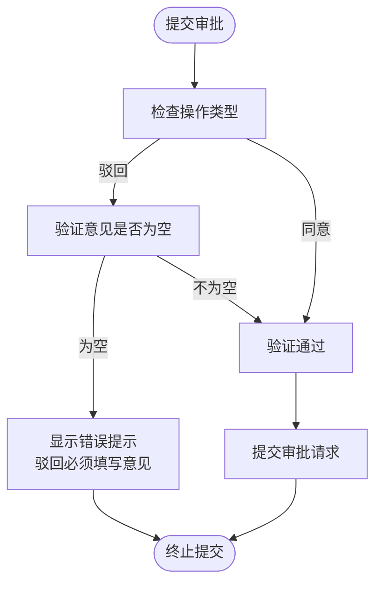

# 任务详情

<cite>
**本文档引用的文件**   
- [task-detail.vue](file://smart-admin-web-javascript/src/views/business/oa/workflow/task/task-detail.vue)
- [task-approval.vue](file://smart-app/pages/workflow/task-approval.vue)
- [ProcessDiagram.vue](file://smart-admin-web-javascript/src/components/workflow/ProcessDiagram.vue)
- [ProcessSteps.vue](file://smart-admin-web-javascript/src/components/workflow/ProcessSteps.vue)
- [ApprovalForm.vue](file://smart-admin-web-javascript/src/components/workflow/ApprovalForm.vue)
- [workflow-api.js](file://smart-admin-web-javascript/src/api/business/oa/workflow-api.js)
- [ApprovalTaskService.java](file://documentation/technical/smart-workflow.md)
- [WorkflowEngineController.java](file://microservices/ioedream-oa-service/src/main/java/net/lab1024/sa/oa/workflow/controller/WorkflowEngineController.java)
- [smart-workflow.md](file://documentation/technical/smart-workflow.md)
- [workflow.js](file://smart-admin-web-javascript/src/store/modules/business/workflow.js)
</cite>

## 目录
1. [任务详情管理功能概述](#任务详情管理功能概述)
2. [WorkflowEngineService事务处理逻辑分析](#workflowengineservice事务处理逻辑分析)
3. [task-detail.vue流程节点高亮机制](#task-detailvue流程节点高亮机制)
4. [task-approval.vue表单验证规则](#task-approvalvue表单验证规则)
5. [大流程实例性能优化方案](#大流程实例性能优化方案)
6. [审批历史展示机制](#审批历史展示机制)
7. [流程图可视化实现](#流程图可视化实现)

## 任务详情管理功能概述

本系统提供完整的任务详情管理功能，涵盖任务基本信息展示、审批意见填写和流程图可视化三大核心功能。系统通过`task-detail.vue`组件实现任务详情的全面展示，包括任务基本信息、申请内容、审批历史和流程图。用户可以通过`task-approval.vue`组件进行审批操作，填写审批意见并提交处理结果。系统采用前后端分离架构，前端通过API调用获取任务数据，后端基于Warm-Flow工作流引擎实现流程管理。

**Section sources**
- [task-detail.vue](file://smart-admin-web-javascript/src/views/business/oa/workflow/task/task-detail.vue)
- [task-approval.vue](file://smart-app/pages/workflow/task-approval.vue)

## WorkflowEngineService事务处理逻辑分析

`WorkflowEngineService`中的任务详情查询采用了复合数据加载策略，结合了Warm-Flow引擎原生数据和业务扩展数据。服务层通过`ApprovalTaskService`实现事务性数据处理，其核心逻辑如下：

1. **待办任务查询**：首先调用Warm-Flow引擎的`queryUserTask(userId)`方法获取用户待办任务列表，然后将引擎返回的`Data`对象转换为`ApprovalTaskVO`视图对象。
2. **数据关联加载**：在转换过程中，同步加载关联的业务信息（通过`ApprovalBusinessService`）和处理人信息（通过`UserService`），确保返回数据的完整性。
3. **条件过滤**：在内存中对任务列表进行业务类型和任务名称等条件的过滤处理。
4. **分页处理**：最后进行分页计算，返回指定页码的数据。

该服务采用了`@Transactional`注解确保数据一致性，在处理审批任务时，会先验证任务权限，然后执行流程处理操作，更新任务状态，并创建相应的审批记录。

**Diagram sources **
- [ApprovalTaskService.java](file://documentation/technical/smart-workflow.md#L1312-L1342)
- [WorkflowEngineController.java](file://microservices/ioedream-oa-service/src/main/java/net/lab1024/sa/oa/workflow/controller/WorkflowEngineController.java#L174-L188)

**Section sources**
- [ApprovalTaskService.java](file://documentation/technical/smart-workflow.md#L1312-L1342)
- [WorkflowEngineController.java](file://microservices/ioedream-oa-service/src/main/java/net/lab1024/sa/oa/workflow/controller/WorkflowEngineController.java#L174-L188)

## task-detail.vue流程节点高亮机制

`task-detail.vue`组件通过`ProcessDiagram`和`ProcessSteps`两个子组件实现流程节点的高亮显示。其核心机制如下：

1. **数据加载**：组件通过`workflowStore.fetchTaskDetail(taskId)`从后端获取任务详情，包括当前节点ID和流程实例ID。
2. **流程图高亮**：将获取到的当前节点ID通过`highlight-node`属性传递给`ProcessDiagram`组件，该组件使用bpmn-js库渲染BPMN流程图，并对指定节点进行高亮显示。
3. **进度条高亮**：`ProcessSteps`组件接收`historyList`作为输入，通过计算`currentStep`确定当前处理步骤，并使用Ant Design的Steps组件的`current`属性实现进度条的高亮显示。

组件采用响应式设计，当任务详情或流程历史数据更新时，会自动重新计算和渲染高亮状态。

**Diagram sources **
- [task-detail.vue](file://smart-admin-web-javascript/src/views/business/oa/workflow/task/task-detail.vue#L89-L93)
- [ProcessDiagram.vue](file://smart-admin-web-javascript/src/components/workflow/ProcessDiagram.vue#L48-L51)
- [ProcessSteps.vue](file://smart-admin-web-javascript/src/components/workflow/ProcessSteps.vue#L33-L40)

**Section sources**
- [task-detail.vue](file://smart-admin-web-javascript/src/views/business/oa/workflow/task/task-detail.vue#L116-L196)
- [ProcessDiagram.vue](file://smart-admin-web-javascript/src/components/workflow/ProcessDiagram.vue#L74-L137)
- [ProcessSteps.vue](file://smart-admin-web-javascript/src/components/workflow/ProcessSteps.vue#L33-L40)

## task-approval.vue表单验证规则

`task-approval.vue`组件实现了严格的表单验证规则，确保审批操作的合规性。其验证机制主要体现在以下几个方面：

1. **驳回意见必填**：当用户选择"驳回"操作时，系统强制要求填写审批意见。在`handleSubmit`方法中，会检查`form.comment`是否为空，若为空则弹出提示"驳回必须填写意见"。
2. **输入长度限制**：审批意见文本框设置了500字符的最大长度限制，通过`maxlength="500"`属性实现。
3. **转办/委派验证**：在转办或委派操作中，系统会验证目标用户ID是否为空，若未选择目标用户则提示"请输入目标用户ID"。
4. **附件上传验证**：支持上传jpg、png、pdf格式的文件，单个文件大小不超过10MB，通过`beforeUpload`方法进行验证。

组件采用响应式设计，验证逻辑在提交时执行，确保数据的完整性和合规性。

**Diagram sources **
- [task-approval.vue](file://smart-app/pages/workflow/task-approval.vue#L132-L138)
- [task-approval.vue](file://smart-app/pages/workflow/task-approval.vue#L186-L192)

**Section sources**
- [task-approval.vue](file://smart-app/pages/workflow/task-approval.vue#L131-L163)

## 大流程实例性能优化方案

针对大流程实例的任务详情加载性能问题，系统提供了以下优化方案：

1. **懒加载策略**：将任务详情、流程历史和流程图等数据分步加载，优先显示基本信息，其他内容在后台异步加载，提升首屏渲染速度。
2. **数据压缩传输**：后端对流程图的BPMN XML数据进行压缩处理，减少网络传输量。前端通过`workflowApi.getProcessDiagram(instanceId)`获取压缩后的数据。
3. **分页查询**：对于包含大量历史记录的流程实例，采用分页查询方式获取审批历史，避免一次性加载过多数据。
4. **缓存机制**：前端使用Vuex store缓存已加载的任务详情和流程历史数据，避免重复请求。
5. **按需加载组件**：对于非关键组件（如流程图），采用动态导入方式按需加载，减少初始包大小。

这些优化措施有效提升了大流程实例的加载性能，改善了用户体验。

**Diagram sources **
- [task-detail.vue](file://smart-admin-web-javascript/src/views/business/oa/workflow/task/task-detail.vue#L154-L167)
- [workflow.js](file://smart-admin-web-javascript/src/store/modules/business/workflow.js#L740-L757)

**Section sources**
- [task-detail.vue](file://smart-admin-web-javascript/src/views/business/oa/workflow/task/task-detail.vue#L145-L167)
- [workflow.js](file://smart-admin-web-javascript/src/store/modules/business/workflow.js#L740-L757)

## 审批历史展示机制

系统通过`ProcessSteps`组件和时间线组件实现审批历史的可视化展示。其核心机制如下：

1. **数据结构**：审批历史数据包含节点名称、处理人、处理意见、处理时间等信息，通过`workflowStore.fetchProcessHistory(instanceId)`从后端获取。
2. **进度条展示**：使用`ProcessSteps`组件将历史记录转换为步骤条，通过`currentStep`计算确定当前处理步骤，实现进度可视化。
3. **时间线展示**：使用Ant Design的时间线组件展示详细的审批历史，每个时间线节点显示处理人、意见和时间信息。
4. **状态标识**：根据处理结果（同意、驳回等）显示不同的颜色和图标，便于用户快速识别审批状态。

该机制提供了清晰的审批流程追溯功能，帮助用户了解任务的处理过程。

**Diagram sources **
- [task-detail.vue](file://smart-admin-web-javascript/src/views/business/oa/workflow/task/task-detail.vue#L55-L70)
- [ProcessSteps.vue](file://smart-admin-web-javascript/src/components/workflow/ProcessSteps.vue#L59-L91)

**Section sources**
- [task-detail.vue](file://smart-admin-web-javascript/src/views/business/oa/workflow/task/task-detail.vue#L174-L182)
- [ProcessSteps.vue](file://smart-admin-web-javascript/src/components/workflow/ProcessSteps.vue#L33-L40)

## 流程图可视化实现

流程图可视化功能通过`ProcessDiagram`组件实现，其核心实现方式如下：

1. **数据获取**：组件通过`instanceId`从后端获取流程图的BPMN XML数据，或直接接收传入的`bpmnXml`字符串。
2. **渲染引擎**：使用bpmn-js库的`NavigatedViewer`组件渲染BPMN流程图，支持流程图的导航和缩放功能。
3. **节点高亮**：通过`highlightNode`方法对指定节点进行高亮显示，增强当前处理节点的可视化效果。
4. **错误处理**：当流程图数据加载失败时，显示友好的错误提示，并提供XML数据的文本预览。

该实现提供了专业的流程图可视化能力，帮助用户直观理解流程结构。

**Diagram sources **
- [ProcessDiagram.vue](file://smart-admin-web-javascript/src/components/workflow/ProcessDiagram.vue#L74-L137)
- [ProcessDiagram.vue](file://smart-admin-web-javascript/src/components/workflow/ProcessDiagram.vue#L127-L129)

**Section sources**
- [ProcessDiagram.vue](file://smart-admin-web-javascript/src/components/workflow/ProcessDiagram.vue#L74-L137)
- [task-detail.vue](file://smart-admin-web-javascript/src/views/business/oa/workflow/task/task-detail.vue#L89-L93)