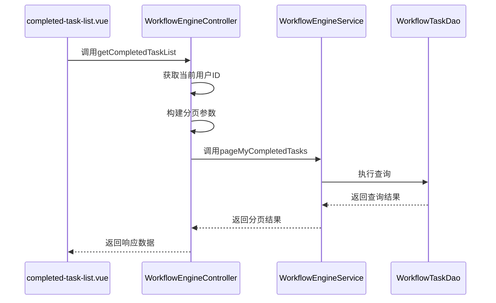
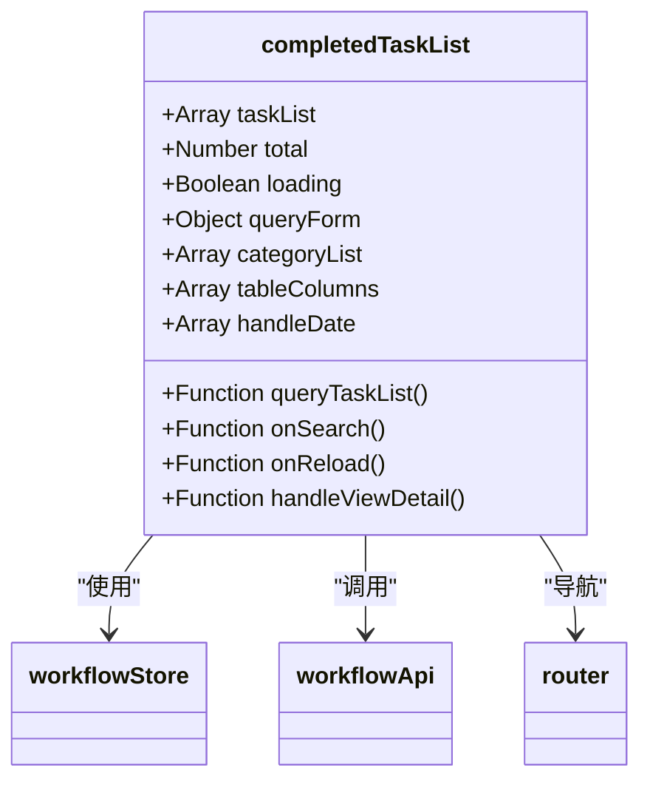
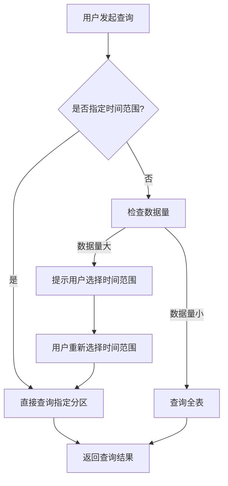
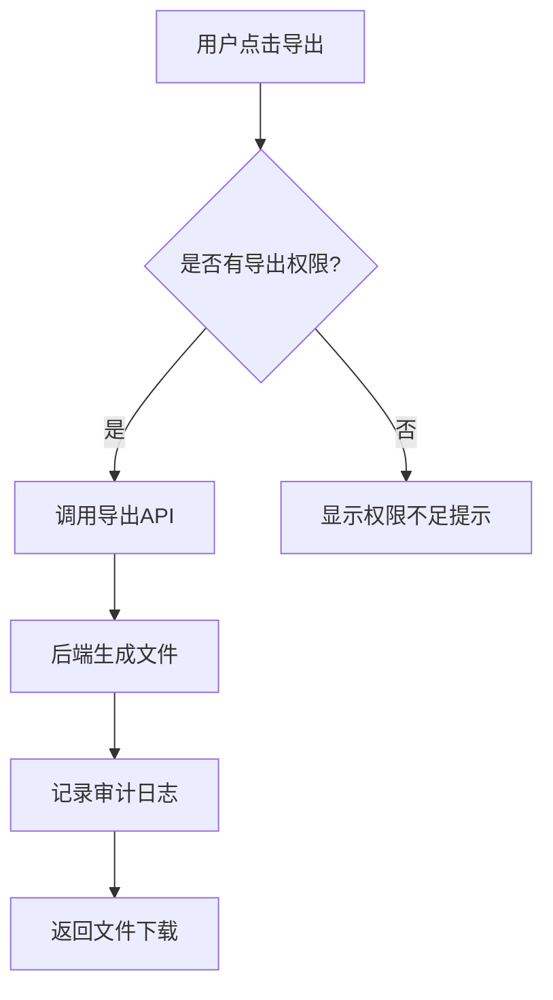

# 已办任务

<cite>
**本文档引用的文件**   
- [WorkflowEngineController.java](file://microservices\ioedream-oa-service\src\main\java\net\lab1024\sa\oa\workflow\controller\WorkflowEngineController.java)
- [completed-task-list.vue](file://smart-admin-web-javascript\src\views\business\oa\workflow\task\completed-task-list.vue)
- [workflow.js](file://smart-admin-web-javascript\src\store\modules\business\workflow.js)
- [WorkflowEngineServiceImpl.java](file://microservices\ioedream-oa-service\src\main\java\net\lab1024\sa\oa\workflow\service\impl\WorkflowEngineServiceImpl.java)
- [t_audit_log.sql](file://database-scripts\common-service\10-t_audit_log.sql)
</cite>

## 目录
1. [已办任务查询与归档功能](#已办任务查询与归档功能)
2. [getCompletedTaskList方法实现逻辑](#getcompletedtasklist方法实现逻辑)
3. [completed-task-list.vue组件分析](#completed-task-listvue组件分析)
4. [大数据量分页查询优化方案](#大数据量分页查询优化方案)
5. [导出功能与权限控制](#导出功能与权限控制)

## 已办任务查询与归档功能

已办任务管理功能是工作流系统的重要组成部分，主要提供用户已处理任务的查询、查看和归档功能。系统通过`WorkflowEngineController`中的`getCompletedTaskList`方法实现已办任务列表的查询，支持多维度筛选和分页查询。前端通过`completed-task-list.vue`组件展示已办任务数据，提供友好的用户界面和交互体验。

**Section sources**
- [WorkflowEngineController.java](file://microservices\ioedream-oa-service\src\main\java\net\lab1024\sa\oa\workflow\controller\WorkflowEngineController.java#L190-L205)
- [completed-task-list.vue](file://smart-admin-web-javascript\src\views\business\oa\workflow\task\completed-task-list.vue#L1-L286)

## getCompletedTaskList方法实现逻辑

`getCompletedTaskList`方法是`WorkflowEngineController`中的核心方法，用于分页查询当前用户的已办任务列表。该方法通过`@GetMapping("/task/my/completed")`注解暴露REST API接口，接收分页参数和筛选条件，调用`workflowEngineService.pageMyCompletedTasks`服务方法获取数据。

方法实现逻辑如下：
1. 从请求中获取当前用户ID
2. 构建分页参数对象
3. 调用服务层方法查询已办任务
4. 返回分页结果

该方法支持按流程分类、处理结果、时间范围等条件进行筛选，便于用户快速定位所需任务。



**Diagram sources**
- [WorkflowEngineController.java](file://microservices\ioedream-oa-service\src\main\java\net\lab1024\sa\oa\workflow\controller\WorkflowEngineController.java#L190-L205)
- [WorkflowEngineServiceImpl.java](file://microservices\ioedream-oa-service\src\main\java\net\lab1024\sa\oa\workflow\service\impl\WorkflowEngineServiceImpl.java#L620-L645)

**Section sources**
- [WorkflowEngineController.java](file://microservices\ioedream-oa-service\src\main\java\net\lab1024\sa\oa\workflow\controller\WorkflowEngineController.java#L190-L205)
- [WorkflowEngineServiceImpl.java](file://microservices\ioedream-oa-service\src\main\java\net\lab1024\sa\oa\workflow\service\impl\WorkflowEngineServiceImpl.java#L620-L645)

## completed-task-list.vue组件分析

`completed-task-list.vue`组件是已办任务列表的前端展示组件，采用Vue3 Composition API实现。组件主要功能包括：

1. **查询表单区域**：提供流程分类、处理结果、处理时间等筛选条件
2. **任务列表区域**：使用Ant Design Vue的Table组件展示已办任务数据
3. **分页功能**：支持分页显示和每页数量选择

组件数据展示格式如下：
- 任务名称：可点击查看详情
- 流程名称：显示任务所属流程
- 发起人：显示流程发起人姓名
- 处理结果：使用标签颜色区分不同结果（同意-绿色，驳回-红色，转办-蓝色，委派-橙色）
- 处理意见：显示处理时填写的意见，无意见时显示"无"
- 处理时间：显示任务完成时间
- 操作：提供"详情"按钮查看任务详细信息



**Diagram sources**
- [completed-task-list.vue](file://smart-admin-web-javascript\src\views\business\oa\workflow\task\completed-task-list.vue#L1-L286)
- [workflow.js](file://smart-admin-web-javascript\src\store\modules\business\workflow.js#L344-L373)

**Section sources**
- [completed-task-list.vue](file://smart-admin-web-javascript\src\views\business\oa\workflow\task\completed-task-list.vue#L1-L286)
- [workflow.js](file://smart-admin-web-javascript\src\store\modules\business\workflow.js#L344-L373)

## 大数据量分页查询优化方案

针对已办任务数据量大时的分页查询性能问题，系统提供了以下优化方案：

### 时间范围索引优化

在`t_common_workflow_task`表的`end_time`字段上创建索引，提高按时间范围查询的性能：

```sql
CREATE INDEX idx_end_time ON t_common_workflow_task(end_time);
```

### 数据分区策略

建议对`t_common_workflow_task`表按年份进行分区，将历史数据与近期数据分离，提高查询效率：

```sql
-- 按年份分区示例
ALTER TABLE t_common_workflow_task 
PARTITION BY RANGE (YEAR(end_time)) (
    PARTITION p2023 VALUES LESS THAN (2024),
    PARTITION p2024 VALUES LESS THAN (2025),
    PARTITION p2025 VALUES LESS THAN (2026),
    PARTITION p_future VALUES LESS THAN MAXVALUE
);
```

### 查询优化建议

1. **合理设置分页大小**：默认每页20条，避免一次性加载过多数据
2. **强制时间范围筛选**：对于数据量大的系统，建议强制用户选择时间范围
3. **缓存常用查询结果**：对于频繁查询的条件组合，可考虑使用Redis缓存结果



**Diagram sources**
- [WorkflowEngineServiceImpl.java](file://microservices\ioedream-oa-service\src\main\java\net\lab1024\sa\oa\workflow\service\impl\WorkflowEngineServiceImpl.java#L620-L645)
- [t_audit_log.sql](file://database-scripts\common-service\10-t_audit_log.sql#L1-L39)

**Section sources**
- [WorkflowEngineServiceImpl.java](file://microservices\ioedream-oa-service\src\main\java\net\lab1024\sa\oa\workflow\service\impl\WorkflowEngineServiceImpl.java#L620-L645)
- [t_audit_log.sql](file://database-scripts\common-service\10-t_audit_log.sql#L1-L39)

## 导出功能与权限控制

### 导出功能实现

系统支持已办任务数据的导出功能，主要实现方式如下：

1. **前端调用导出API**：在`completed-task-list.vue`组件中提供导出按钮
2. **后端生成导出文件**：`WorkflowEngineController`提供导出接口，支持EXCEL、CSV等格式
3. **权限验证**：导出操作需要`oa:workflow:task:export`权限

### 权限控制机制

系统采用基于角色的权限控制（RBAC）机制，已办任务相关权限如下：

| 权限编码 | 权限名称 | 说明 |
|---------|--------|------|
| oa:workflow:task:query | 已办任务查询 | 允许查看已办任务列表 |
| oa:workflow:task:detail | 已办任务详情 | 允许查看已办任务详情 |
| oa:workflow:task:export | 已办任务导出 | 允许导出已办任务数据 |

权限控制通过`@Privilege`注解实现，前端组件使用`v-privilege`指令控制元素显示：

```vue
<a-button v-privilege="'oa:workflow:task:export'" @click="handleExport">
    导出
</a-button>
```

审计日志模块会记录所有导出操作，包括操作用户、时间、导出数据量等信息，确保操作可追溯。



**Diagram sources**
- [completed-task-list.vue](file://smart-admin-web-javascript\src\views\business\oa\workflow\task\completed-task-list.vue#L1-L286)
- [t_audit_log.sql](file://database-scripts\common-service\10-t_audit_log.sql#L1-L39)

**Section sources**
- [completed-task-list.vue](file://smart-admin-web-javascript\src\views\business\oa\workflow\task\completed-task-list.vue#L1-L286)
- [t_audit_log.sql](file://database-scripts\common-service\10-t_audit_log.sql#L1-L39)