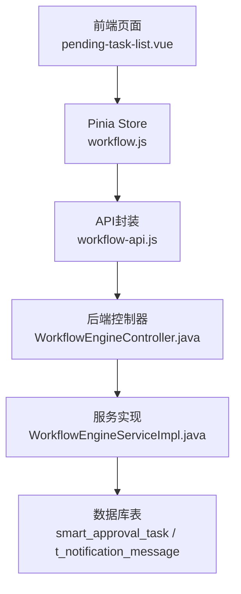
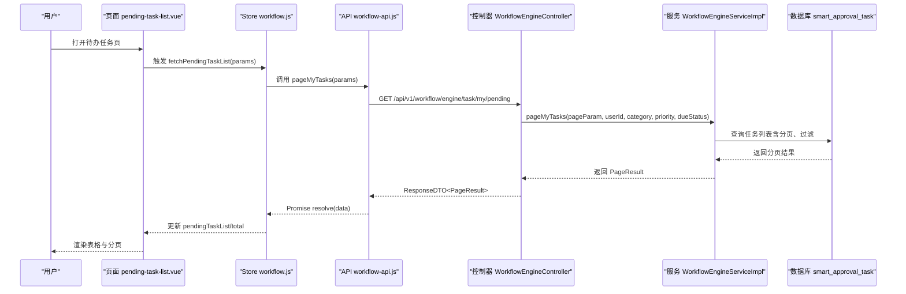
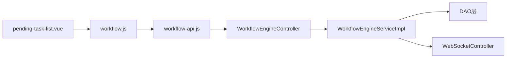

# 待办任务

<cite>
**本文引用的文件**
- [WorkflowEngineController.java](file://microservices/ioedream-oa-service/src/main/java/net/lab1024/sa/oa/workflow/controller/WorkflowEngineController.java)
- [WorkflowEngineService.java](file://microservices/ioedream-oa-service/src/main/java/net/lab1024/sa/oa/workflow/service/WorkflowEngineService.java)
- [WorkflowEngineServiceImpl.java](file://microservices/ioedream-oa-service/src/main/java/net/lab1024/sa/oa/workflow/service/impl/WorkflowEngineServiceImpl.java)
- [workflow-api.js](file://smart-admin-web-javascript/src/api/business/oa/workflow-api.js)
- [pending-task-list.vue](file://smart-admin-web-javascript/src/views/business/oa/workflow/task/pending-task-list.vue)
- [workflow.js](file://smart-admin-web-javascript/src/store/modules/business/workflow.js)
- [smart-workflow.md](file://documentation/technical/smart-workflow.md)
- [performance_optimization.sql](file://database/performance_optimization.sql)
- [t_notification_message.sql](file://database-scripts/common-service/07-t_notification_message.sql)
- [NotificationManager.java](file://microservices/microservices-common/src/main/java/net/lab1024/sa/common/monitor/manager/NotificationManager.java)
</cite>

## 目录
1. [简介](#简介)
2. [项目结构](#项目结构)
3. [核心组件](#核心组件)
4. [架构总览](#架构总览)
5. [详细组件分析](#详细组件分析)
6. [依赖分析](#依赖分析)
7. [性能考虑](#性能考虑)
8. [故障排查指南](#故障排查指南)
9. [结论](#结论)
10. [附录](#附录)

## 简介
本文件围绕“待办任务”主题，系统化梳理了待办任务列表的查询接口实现，重点覆盖：
- 后端接口：WorkflowEngineController 中 getPendingTaskList（对应 /api/v1/workflow/engine/task/my/pending）的分页查询逻辑与权限过滤机制
- 前端组件：pending-task-list.vue 的数据绑定、状态显示与操作按钮交互
- 性能优化：高并发查询的缓存策略与数据库索引优化建议
- 任务提醒：轮询频率与消息推送配置思路

## 项目结构
待办任务涉及前后端与数据库三层协作：
- 前端：Vue 页面 pending-task-list.vue + Pinia Store workflow.js + API 封装 workflow-api.js
- 后端：OA 微服务的 WorkflowEngineController + Service 层 + DAO 层
- 数据库：基于 smart-workflow.md 描述的审批任务表 smart_approval_task 以及通知消息表 t_notification_message

图表来源
- [pending-task-list.vue](file://smart-admin-web-javascript/src/views/business/oa/workflow/task/pending-task-list.vue#L1-L554)
- [workflow.js](file://smart-admin-web-javascript/src/store/modules/business/workflow.js#L1-L200)
- [workflow-api.js](file://smart-admin-web-javascript/src/api/business/oa/workflow-api.js#L153-L215)
- [WorkflowEngineController.java](file://microservices/ioedream-oa-service/src/main/java/net/lab1024/sa/oa/workflow/controller/WorkflowEngineController.java#L172-L205)
- [WorkflowEngineServiceImpl.java](file://microservices/ioedream-oa-service/src/main/java/net/lab1024/sa/oa/workflow/service/impl/WorkflowEngineServiceImpl.java#L1-L200)
- [smart-workflow.md](file://documentation/technical/smart-workflow.md#L160-L193)
- [t_notification_message.sql](file://database-scripts/common-service/07-t_notification_message.sql#L1-L42)

章节来源
- [WorkflowEngineController.java](file://microservices/ioedream-oa-service/src/main/java/net/lab1024/sa/oa/workflow/controller/WorkflowEngineController.java#L172-L205)
- [workflow-api.js](file://smart-admin-web-javascript/src/api/business/oa/workflow-api.js#L153-L215)
- [pending-task-list.vue](file://smart-admin-web-javascript/src/views/business/oa/workflow/task/pending-task-list.vue#L1-L554)
- [workflow.js](file://smart-admin-web-javascript/src/store/modules/business/workflow.js#L1-L200)
- [smart-workflow.md](file://documentation/technical/smart-workflow.md#L160-L193)
- [t_notification_message.sql](file://database-scripts/common-service/07-t_notification_message.sql#L1-L42)

## 核心组件
- 后端接口层：WorkflowEngineController 提供 /api/v1/workflow/engine/task/my/pending 接口，负责参数解析、调用 Service 并返回分页结果
- 服务层：WorkflowEngineServiceImpl 实现分页查询、受理、完成、驳回、转交、委派等业务逻辑
- 前端页面：pending-task-list.vue 负责查询表单、分页、列表渲染、状态展示与操作按钮交互
- 前端状态：workflow.js 提供 Pinia Store 管理待办任务列表、总数、查询参数与加载状态
- 数据模型：smart-workflow.md 定义了审批任务表 smart_approval_task 的字段与索引；t_notification_message.sql 定义通知消息表结构

章节来源
- [WorkflowEngineController.java](file://microservices/ioedream-oa-service/src/main/java/net/lab1024/sa/oa/workflow/controller/WorkflowEngineController.java#L172-L205)
- [WorkflowEngineService.java](file://microservices/ioedream-oa-service/src/main/java/net/lab1024/sa/oa/workflow/service/WorkflowEngineService.java#L152-L189)
- [WorkflowEngineServiceImpl.java](file://microservices/ioedream-oa-service/src/main/java/net/lab1024/sa/oa/workflow/service/impl/WorkflowEngineServiceImpl.java#L1-L200)
- [workflow-api.js](file://smart-admin-web-javascript/src/api/business/oa/workflow-api.js#L153-L215)
- [pending-task-list.vue](file://smart-admin-web-javascript/src/views/business/oa/workflow/task/pending-task-list.vue#L1-L554)
- [workflow.js](file://smart-admin-web-javascript/src/store/modules/business/workflow.js#L1-L200)
- [smart-workflow.md](file://documentation/technical/smart-workflow.md#L160-L193)
- [t_notification_message.sql](file://database-scripts/common-service/07-t_notification_message.sql#L1-L42)

## 架构总览
待办任务查询的端到端流程如下：

图表来源
- [pending-task-list.vue](file://smart-admin-web-javascript/src/views/business/oa/workflow/task/pending-task-list.vue#L355-L376)
- [workflow.js](file://smart-admin-web-javascript/src/store/modules/business/workflow.js#L178-L199)
- [workflow-api.js](file://smart-admin-web-javascript/src/api/business/oa/workflow-api.js#L166-L178)
- [WorkflowEngineController.java](file://microservices/ioedream-oa-service/src/main/java/net/lab1024/sa/oa/workflow/controller/WorkflowEngineController.java#L172-L205)
- [WorkflowEngineServiceImpl.java](file://microservices/ioedream-oa-service/src/main/java/net/lab1024/sa/oa/workflow/service/impl/WorkflowEngineServiceImpl.java#L1-L200)

## 详细组件分析

### 后端接口：WorkflowEngineController.getPendingTaskList
- 接口路径：/api/v1/workflow/engine/task/my/pending
- 请求参数：
  - pageNum：页码，默认1
  - pageSize：每页数量，默认20
  - category：流程分类（可选）
  - priority：优先级（1-低，2-普通，3-高，4-紧急，可选）
  - dueStatus：到期状态（OVERDUE-已过期，DUE_SOON-即将到期，NORMAL-正常，可选）
- 用户ID来源：从请求上下文中获取当前登录用户ID
- 分页参数转换：将 Long pageNum/pageSize 转为 PageParam
- 调用链：Controller -> Service.pageMyTasks(...)
- 返回：ResponseDTO<PageResult<WorkflowTaskEntity>>

权限过滤机制说明
- 控制器通过 SmartRequestUtil.getUserId() 获取当前用户ID，作为查询条件之一，确保只返回该用户的待办任务
- 业务层具体过滤逻辑由 Service 实现（见下节）

章节来源
- [WorkflowEngineController.java](file://microservices/ioedream-oa-service/src/main/java/net/lab1024/sa/oa/workflow/controller/WorkflowEngineController.java#L172-L205)

### 服务层：WorkflowEngineServiceImpl.pageMyTasks
- 职责：实现分页查询我的待办任务，结合用户ID、分类、优先级、到期状态进行过滤
- 事务与异常：方法标注事务，异常统一包装为 ResponseDTO
- 与数据库交互：通过 DAO 层执行 SQL 查询，返回 PageResult
- WebSocket：服务层持有 WebSocket 控制器引用，用于任务状态变更后的消息推送（见后文“任务提醒机制”）

注意：由于仓库未提供 Service 实现的完整源码片段，此处基于接口签名与注释进行说明；如需精确实现细节，可在 Service 实现类中查看具体 SQL 与过滤条件。

章节来源
- [WorkflowEngineService.java](file://microservices/ioedream-oa-service/src/main/java/net/lab1024/sa/oa/workflow/service/WorkflowEngineService.java#L152-L189)
- [WorkflowEngineServiceImpl.java](file://microservices/ioedream-oa-service/src/main/java/net/lab1024/sa/oa/workflow/service/impl/WorkflowEngineServiceImpl.java#L1-L200)

### 前端页面：pending-task-list.vue
- 查询表单：支持流程分类、优先级、到期状态筛选
- 列表渲染：任务名称、流程名称、发起人、优先级、到期时间、创建时间
- 状态显示：
  - 优先级标签：低/普通/高/紧急
  - 到期时间：过期样式与“已过期”标签
- 操作按钮：
  - 受理、转办、委派、详情
  - 批量受理（多选）
- 分页：使用 Ant Design Pagination，v-model:current 与 v-model:page-size 绑定查询参数
- 数据绑定：Store 中 pendingTaskList/pendingTaskTotal 与页面双向绑定

交互逻辑要点
- 查询：queryTaskList() 组装 params（pageNum/pageSize/category/priority/dueStatus），调用 Store.fetchPendingTaskList()
- 受理：claimTask(taskId) -> Store.claimTask() -> 重新拉取列表
- 转办/委派：打开模态框，加载用户列表，确认后调用 Store 对应动作
- 统计：顶部统计卡片由 Store 的 pendingTaskStats 计算得出

章节来源
- [pending-task-list.vue](file://smart-admin-web-javascript/src/views/business/oa/workflow/task/pending-task-list.vue#L1-L554)
- [workflow.js](file://smart-admin-web-javascript/src/store/modules/business/workflow.js#L120-L168)

### 前端状态：workflow.js
- 状态字段：pendingTaskList、pendingTaskTotal、pendingTaskLoading、pendingTaskQueryParams
- 计算属性：pendingTaskStats（统计紧急/高优先级/已过期/总数）
- 动作：
  - fetchPendingTaskList(params)：调用 API，更新列表与总数
  - claimTask/transferTask/delegateTask/completeTask/rejectTask：封装操作并刷新列表

章节来源
- [workflow.js](file://smart-admin-web-javascript/src/store/modules/business/workflow.js#L1-L200)

### 数据模型：smart_approval_task 与通知消息表
- 审批任务表 smart_approval_task
  - 关键字段：assignee_id、status、priority、due_time、start_time 等
  - 索引：idx_assignee_id、idx_status、idx_priority、idx_due_time 等
- 通知消息表 t_notification_message
  - 关键字段：message_type、status、send_time、business_type/business_id、create_time、deleted_flag 等
  - 索引：idx_message_type、idx_status、idx_send_time、idx_business、idx_create_time、idx_deleted_flag

章节来源
- [smart-workflow.md](file://documentation/technical/smart-workflow.md#L160-L193)
- [t_notification_message.sql](file://database-scripts/common-service/07-t_notification_message.sql#L1-L42)

## 依赖分析
- 前端依赖
  - pending-task-list.vue 依赖 workflow.js（Pinia Store）、workflow-api.js（HTTP 请求封装）
  - workflow-api.js 依赖 axios 封装的 request 工具
- 后端依赖
  - WorkflowEngineController 依赖 SmartRequestUtil 获取当前用户ID
  - WorkflowEngineServiceImpl 依赖 DAO 层（WorkflowDefinitionDao/WorkflowInstanceDao/WorkflowTaskDao）与 ObjectMapper
  - 服务层持有 WebSocket 控制器引用，用于任务状态变更后的消息推送

图表来源
- [pending-task-list.vue](file://smart-admin-web-javascript/src/views/business/oa/workflow/task/pending-task-list.vue#L1-L554)
- [workflow.js](file://smart-admin-web-javascript/src/store/modules/business/workflow.js#L1-L200)
- [workflow-api.js](file://smart-admin-web-javascript/src/api/business/oa/workflow-api.js#L153-L215)
- [WorkflowEngineController.java](file://microservices/ioedream-oa-service/src/main/java/net/lab1024/sa/oa/workflow/controller/WorkflowEngineController.java#L172-L205)
- [WorkflowEngineServiceImpl.java](file://microservices/ioedream-oa-service/src/main/java/net/lab1024/sa/oa/workflow/service/impl/WorkflowEngineServiceImpl.java#L1-L200)

章节来源
- [workflow-api.js](file://smart-admin-web-javascript/src/api/business/oa/workflow-api.js#L153-L215)
- [WorkflowEngineController.java](file://microservices/ioedream-oa-service/src/main/java/net/lab1024/sa/oa/workflow/controller/WorkflowEngineController.java#L172-L205)
- [WorkflowEngineServiceImpl.java](file://microservices/ioedream-oa-service/src/main/java/net/lab1024/sa/oa/workflow/service/impl/WorkflowEngineServiceImpl.java#L1-L200)

## 性能考虑
针对待办任务高并发查询，建议从以下方面优化：

- 缓存策略
  - 多级缓存：Redis + 本地缓存（Caffeine）
  - 缓存键设计：以用户ID+查询参数组合为键，避免重复计算
  - 缓存失效：按用户维度失效，或设置 TTL；热点数据可预热
  - 读写分离：查询走从库，写操作走主库

- 数据库索引优化
  - 建议在 smart_approval_task 上建立复合索引：
    - (assignee_id, status, priority, due_time)：满足按用户、状态、优先级、到期时间的过滤
    - (status, due_time)：满足按状态与到期时间的快速筛选
  - 参考现有索引设计与优化脚本：
    - [smart-workflow.md](file://documentation/technical/smart-workflow.md#L160-L193)
    - [performance_optimization.sql](file://database/performance_optimization.sql#L1-L270)

- 分页查询优化
  - 使用游标分页（基于上次记录的时间戳或主键）替代 OFFSET/LIMIT，降低深度分页成本
  - 参考性能优化脚本中的游标分页建议：
    - [performance_optimization.sql](file://database/performance_optimization.sql#L184-L192)

- 查询参数与过滤
  - 优先使用等值过滤（如 assignee_id、status）与范围过滤（due_time）相结合
  - 避免在 WHERE 子句中对列进行函数运算，导致索引失效

- 读写分离与连接池
  - 使用 Druid 连接池，合理配置最大连接数、空闲连接数与超时时间
  - 参考项目中对 Druid 的使用与配置说明

- 监控与分析
  - 定期执行 ANALYZE TABLE 更新统计信息，帮助查询优化器选择最佳执行计划
  - 监控慢查询日志，识别并优化高频慢查询
  - 参考性能优化脚本中的监控查询：
    - [performance_optimization.sql](file://database/performance_optimization.sql#L230-L249)

章节来源
- [smart-workflow.md](file://documentation/technical/smart-workflow.md#L160-L193)
- [performance_optimization.sql](file://database/performance_optimization.sql#L1-L270)

## 故障排查指南
- 前端常见问题
  - 列表不刷新：确认 Store.fetchPendingTaskList() 调用后是否更新 pendingTaskList/pendingTaskTotal
  - 分页异常：检查 queryForm.pageNum 与 v-model:current 的同步
  - 操作失败：查看 message.error 输出，确认 API 返回码与提示信息

- 后端常见问题
  - 用户ID为空：检查 SmartRequestUtil 是否正确注入当前用户
  - 查询结果为空：核对过滤条件（category/priority/dueStatus）与数据库索引是否匹配
  - 事务异常：关注 Service 方法上的事务注解与异常捕获

- 通知与提醒
  - 若需基于 WebSocket 或定时任务推送待办提醒，可参考 NotificationManager 的处理流程（重试、状态更新、统计）
  - 通知消息表结构可作为消息推送的数据载体

章节来源
- [workflow.js](file://smart-admin-web-javascript/src/store/modules/business/workflow.js#L178-L223)
- [WorkflowEngineController.java](file://microservices/ioedream-oa-service/src/main/java/net/lab1024/sa/oa/workflow/controller/WorkflowEngineController.java#L172-L205)
- [NotificationManager.java](file://microservices/microservices-common/src/main/java/net/lab1024/sa/common/monitor/manager/NotificationManager.java#L1-L615)
- [t_notification_message.sql](file://database-scripts/common-service/07-t_notification_message.sql#L1-L42)

## 结论
- 待办任务查询接口清晰，采用“控制器-服务-DAO”的分层架构，参数解析与分页转换明确
- 前端页面具备完善的筛选、分页与状态展示能力，交互逻辑清晰
- 性能优化建议集中在缓存、索引与分页策略上，可显著提升高并发场景下的响应速度
- 通知与提醒机制可通过现有通知表与管理器进行扩展，实现任务到期提醒与状态变更推送

## 附录

### API 定义概览
- 分页查询我的待办任务
  - 方法：GET
  - 路径：/api/v1/workflow/engine/task/my/pending
  - 参数：pageNum、pageSize、category、priority、dueStatus
  - 返回：ResponseDTO<PageResult<WorkflowTaskEntity>>

章节来源
- [workflow-api.js](file://smart-admin-web-javascript/src/api/business/oa/workflow-api.js#L166-L178)
- [WorkflowEngineController.java](file://microservices/ioedream-oa-service/src/main/java/net/lab1024/sa/oa/workflow/controller/WorkflowEngineController.java#L172-L205)

### 数据模型与索引建议
- smart_approval_task
  - 建议索引：(assignee_id, status, priority, due_time)、(status, due_time)
- t_notification_message
  - 建议索引：idx_message_type、idx_status、idx_send_time、idx_business、idx_create_time、idx_deleted_flag

章节来源
- [smart-workflow.md](file://documentation/technical/smart-workflow.md#L160-L193)
- [t_notification_message.sql](file://database-scripts/common-service/07-t_notification_message.sql#L1-L42)