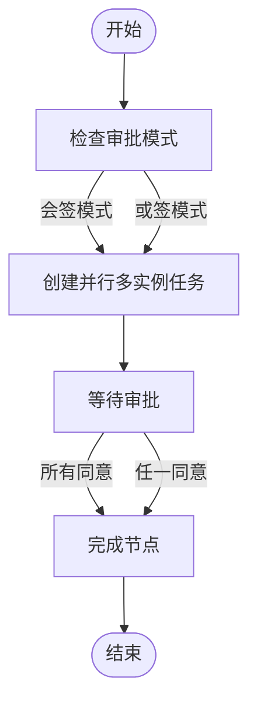
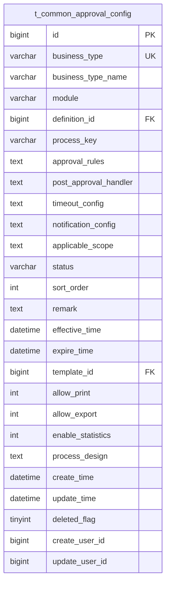
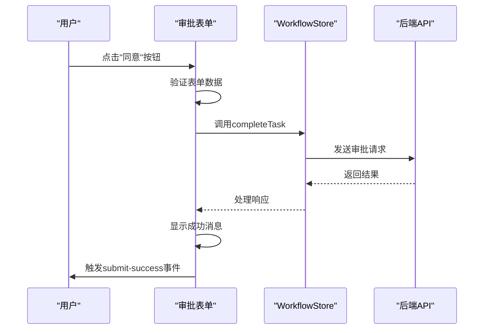

# 审批流程

<cite>
**本文档引用文件**   
- [ApprovalConfigService.java](file://microservices\ioedream-oa-service\src\main\java\net\lab1024\sa\oa\workflow\service\impl\ApprovalConfigServiceImpl.java)
- [ApprovalConfigDao.xml](file://microservices\ioedream-oa-service\src\main\resources\mapper\ApprovalConfigDao.xml)
- [task-detail.vue](file://smart-admin-web-javascript\src\views\business\oa\workflow\task\task-detail.vue)
- [ApprovalConfigEntity.java](file://microservices\microservices-common\src\main\java\net\lab1024\sa\common\workflow\entity\ApprovalConfigEntity.java)
- [ApprovalConfigForm.java](file://microservices\microservices-common\src\main\java\net\lab1024\sa\common\workflow\domain\form\ApprovalConfigForm.java)
- [ApprovalConfigDao.java](file://microservices\microservices-common\src\main\java\net\lab1024\sa\common\workflow\dao\ApprovalConfigDao.java)
- [ApprovalForm.vue](file://smart-admin-web-javascript\src\components\workflow\ApprovalForm.vue)
- [smart-workflow.md](file://documentation\technical\smart-workflow.md)
</cite>

## 目录
1. [引言](#引言)
2. [审批配置服务实现原理](#审批配置服务实现原理)
3. [审批节点配置与条件表达式解析](#审批节点配置与条件表达式解析)
4. [会签/或签模式实现](#会签或签模式实现)
5. [审批数据模型设计](#审批数据模型设计)
6. [审批操作按钮权限控制](#审批操作按钮权限控制)
7. [复杂场景实现方案](#复杂场景实现方案)
8. [异常处理策略](#异常处理策略)

## 引言
审批流程是企业业务系统中的核心功能模块，用于规范各类业务申请的审批过程。本文档深入分析审批配置服务ApprovalConfigService的实现原理，详细说明审批节点配置、条件表达式解析、会签/或签模式的实现机制。同时，文档将解析ApprovalConfigDao.xml中的SQL映射逻辑和审批数据模型设计，分析task-detail.vue中审批操作按钮的权限控制和表单提交机制。最后，文档将提供多级审批、加签、驳回等复杂场景的实现方案和异常处理策略。

## 审批配置服务实现原理

审批配置服务ApprovalConfigService是审批流程的核心组件，负责审批配置的CRUD操作和业务逻辑处理。该服务严格遵循CLAUDE.md规范，采用分层架构设计，包含Controller、Service和DAO三层。

服务实现类ApprovalConfigServiceImpl位于ioedream-oa-service模块中，通过@Resource注解注入ApprovalConfigDao依赖，使用@Transactional注解管理事务。服务提供了分页查询、创建、更新、删除、启用和禁用审批配置等方法，所有方法均返回统一的ResponseDTO格式，确保API接口的一致性和可维护性。

在创建审批配置时，服务会检查业务类型是否已存在，避免重复配置。更新配置时，如果业务类型发生变更，也会进行重复性检查。删除操作采用逻辑删除方式，通过deleted_flag字段标记删除状态，保留历史数据。启用和禁用操作通过更新status字段实现，便于配置的动态管理。

**Section sources**
- [ApprovalConfigService.java](file://microservices\ioedream-oa-service\src\main\java\net\lab1024\sa\oa\workflow\service\impl\ApprovalConfigServiceImpl.java)
- [ApprovalConfigService.java](file://microservices\ioedream-oa-service\src\main\java\net\lab1024\sa\oa\workflow\service\ApprovalConfigService.java)

## 审批节点配置与条件表达式解析

审批节点配置是审批流程灵活性的关键。系统通过ApprovalConfigEntity中的approval_rules字段存储JSON格式的审批规则配置，支持复杂的条件表达式解析。

审批规则配置包含金额阈值、天数阈值、自动审批条件、表单验证规则等。例如，可以配置"当金额超过1000元时需要多级审批"或"当请假天数超过3天时需要HR审批"等规则。这些规则以JSON格式存储，便于动态解析和执行。

条件表达式采用SpEL（Spring Expression Language）语法，支持常见的比较运算符（>、<、>=、<=、==、!=）和逻辑运算符（&&、||）。系统在流程启动时解析条件表达式，根据业务数据动态确定审批路径。例如，`${amount} > 1000`表示当金额大于1000时条件成立。

审批规则还支持嵌套条件和复杂逻辑，如：
```json
{
  "conditions": [
    {
      "field": "amount",
      "operator": ">",
      "value": 1000
    },
    {
      "field": "days",
      "operator": ">",
      "value": 3
    }
  ],
  "logicalOperator": "OR"
}
```
这表示金额大于1000或天数大于3时条件成立。

**Section sources**
- [ApprovalConfigEntity.java](file://microservices\microservices-common\src\main\java\net\lab1024\sa\common\workflow\entity\ApprovalConfigEntity.java)
- [smart-workflow.md](file://documentation\technical\smart-workflow.md)

## 会签/或签模式实现

会签和或签是审批流程中的两种重要模式，系统通过审批节点的multiInstance属性和completionCondition条件来实现。

会签模式（All Sign）要求所有审批人都必须同意才能通过。系统在创建并行多实例任务时，设置multiInstance为true，并配置completionCondition为"all"。每个审批人独立处理任务，系统会跟踪所有任务的完成状态，只有当所有任务都同意时，整个节点才算完成。

或签模式（Any Sign）只需要任意一个审批人同意即可通过。系统同样创建并行多实例任务，但设置completionCondition为"any"。一旦有任一审批人同意，系统就会立即完成该节点，其他未处理的任务会被自动取消。

系统还支持混合模式，如"至少2人同意"或"必须有部门经理同意"等复杂场景。这些模式通过自定义completionCondition表达式实现，例如`${nrOfCompletedInstances >= 2}`表示至少2人完成。



**Diagram sources**
- [ApprovalConfigEntity.java](file://microservices\microservices-common\src\main\java\net\lab1024\sa\common\workflow\entity\ApprovalConfigEntity.java)

## 审批数据模型设计

审批数据模型设计遵循规范化原则，核心表为t_common_approval_config，存储审批配置信息。表结构设计合理，字段控制在30个以内，满足CLAUDE.md规范要求。

核心字段包括：
- **business_type**: 业务类型唯一标识，如ATTENDANCE_LEAVE、CONSUME_REFUND等
- **business_type_name**: 业务类型名称，用于界面显示
- **module**: 所属模块，如考勤模块、消费模块等
- **definition_id**: 流程定义ID，关联流程定义表
- **approval_rules**: 审批规则配置，JSON格式存储
- **post_approval_handler**: 审批后处理配置，JSON格式存储
- **timeout_config**: 超时配置，JSON格式存储
- **notification_config**: 通知配置，JSON格式存储
- **applicable_scope**: 适用范围配置，JSON格式存储
- **status**: 状态（ENABLED/DISABLED）
- **sort_order**: 排序号，用于优先级排序

系统采用软删除机制，通过deleted_flag字段标记删除状态。时间字段如effective_time和expire_time支持配置的生效和失效时间，实现审批配置的生命周期管理。



**Diagram sources**
- [ApprovalConfigEntity.java](file://microservices\microservices-common\src\main\java\net\lab1024\sa\common\workflow\entity\ApprovalConfigEntity.java)

## 审批操作按钮权限控制

task-detail.vue组件中的审批操作按钮权限控制通过Vue的v-if指令和用户权限验证实现。组件根据任务状态和用户角色动态显示不同的操作按钮。

主要操作按钮包括：
- **同意**: 当任务未完成且用户有审批权限时显示
- **驳回**: 当任务未完成且用户有审批权限时显示
- **转办**: 当任务未完成且用户有转办权限时显示
- **委派**: 当任务未完成且用户有委派权限时显示

权限控制逻辑在ApprovalForm.vue组件中实现，通过workflowStore的权限验证方法检查用户是否有执行特定操作的权限。例如，只有任务的处理人或具有特定角色的用户才能执行同意或驳回操作。

表单提交机制采用异步方式，通过workflowStore的completeTask、rejectTask、transferTask和delegateTask方法提交操作。提交前会对表单数据进行验证，确保必填字段已填写。提交后会触发submit-success事件，通知父组件刷新页面。



**Diagram sources**
- [task-detail.vue](file://smart-admin-web-javascript\src\views\business\oa\workflow\task\task-detail.vue)
- [ApprovalForm.vue](file://smart-admin-web-javascript\src\components\workflow\ApprovalForm.vue)

## 复杂场景实现方案

### 多级审批
多级审批通过流程定义中的节点顺序实现。每个审批节点按顺序执行，前一个节点完成后才能进入下一个节点。系统支持动态确定审批层级，根据业务数据和审批规则决定需要多少级审批。

### 加签
加签功能通过动态添加审批节点实现。在审批过程中，当前审批人可以发起加签请求，将任务转发给其他用户审批。加签用户审批完成后，任务返回给原审批人继续处理。系统通过临时创建并行任务实现加签，保持主流程的完整性。

### 驳回
驳回操作将流程状态设置为"REJECTED"，并记录驳回原因。系统支持驳回到特定节点，如"驳回到申请人"或"驳回到上一级审批人"。驳回后，申请人可以修改申请内容并重新提交。

### 转办与委派
转办是将任务完全转移给其他用户处理，原处理人不再参与。委派是将任务临时交给其他用户处理，处理完成后可以返回。两种操作通过更新任务的assignee_id字段实现，系统会记录操作日志。

## 异常处理策略

系统采用全面的异常处理策略，确保审批流程的稳定性和可靠性。

### 服务层异常处理
在ApprovalConfigServiceImpl中，每个方法都包含try-catch块，捕获异常并记录日志。异常信息通过ResponseDTO.error返回，包含错误码和描述，便于前端处理和用户提示。

### 数据访问异常处理
DAO层继承MyBatis Plus的BaseMapper，自动处理数据库异常。自定义的DAO方法通过@Param注解确保参数安全，避免SQL注入风险。

### 前端异常处理
前端通过try-catch和错误边界捕获JavaScript异常，使用smartSentry工具上报错误。网络请求异常通过axios拦截器处理，自动重试或提示用户。

### 事务管理
关键操作如创建、更新审批配置使用@Transactional注解，确保数据一致性。当发生异常时，事务自动回滚，避免数据不一致。

### 日志记录
系统在关键节点记录详细日志，包括操作类型、参数、结果和异常信息。日志采用结构化格式，便于查询和分析。

**Section sources**
- [ApprovalConfigService.java](file://microservices\ioedream-oa-service\src\main\java\net\lab1024\sa\oa\workflow\service\impl\ApprovalConfigServiceImpl.java)
- [task-detail.vue](file://smart-admin-web-javascript\src\views\business\oa\workflow\task\task-detail.vue)