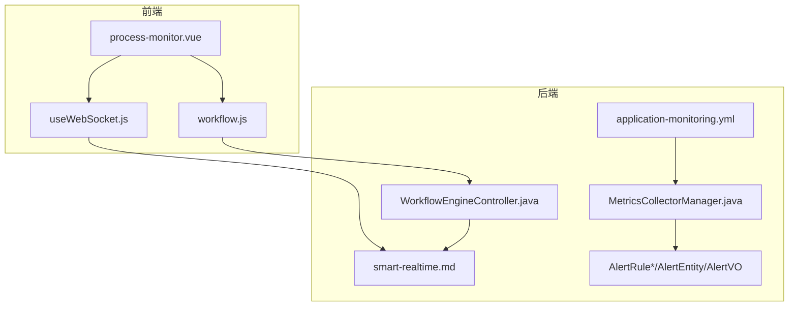
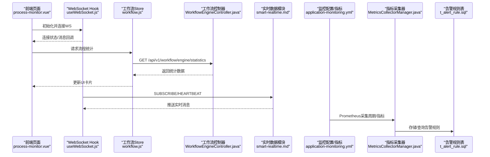
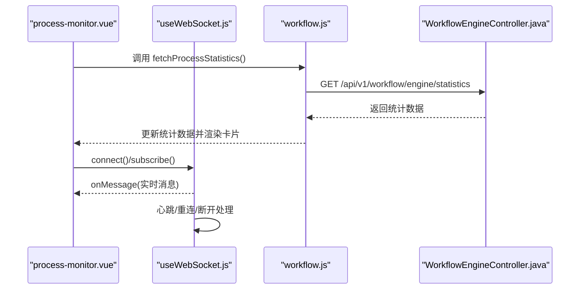
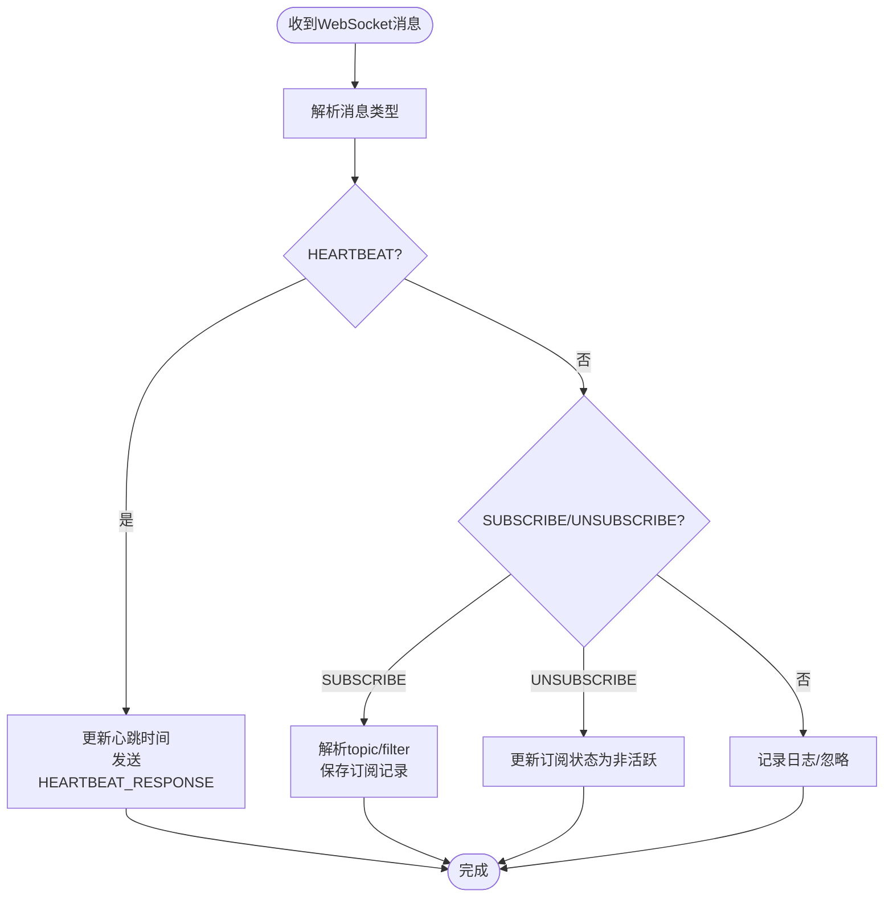
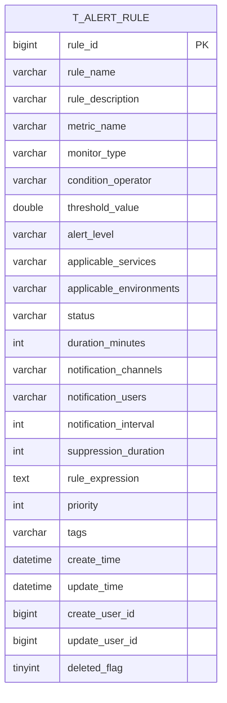
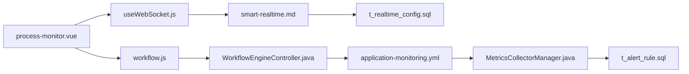

# 流程监控

<cite>
**本文引用的文件**
- [process-monitor.vue](file://smart-admin-web-javascript/src/views/business/oa/workflow/monitor/process-monitor.vue)
- [workflow.js](file://smart-admin-web-javascript/src/store/modules/business/workflow.js)
- [useWebSocket.js](file://smart-admin-web-javascript/src/composables/useWebSocket.js)
- [smart-realtime.md](file://documentation/technical/smart-realtime.md)
- [WorkflowController.java](file://microservices/ioedream-oa-service/src/main/java/net/lab1024/sa/oa/workflow/controller/WorkflowEngineController.java)
- [application-monitoring.yml](file://microservices/ioedream-gateway-service/src/main/resources/application-monitoring.yml)
- [MetricsCollectorManager.java](file://microservices/microservices-common/src/main/java/net/lab1024/sa/common/monitor/manager/MetricsCollectorManager.java)
- [AlertRuleAddDTO.java](file://microservices/microservices-common/src/main/java/net/lab1024/sa/common/monitor/domain/dto/AlertRuleAddDTO.java)
- [AlertRuleEntity.java](file://microservices/microservices-common/src/main/java/net/lab1024/sa/common/monitor/domain/entity/AlertRuleEntity.java)
- [AlertEntity.java](file://microservices/microservices-common/src/main/java/net/lab1024/sa/common/monitor/domain/entity/AlertEntity.java)
- [AlertVO.java](file://microservices/microservices-common/src/main/java/net/lab1024/sa/common/monitor/domain/vo/AlertVO.java)
- [12-t_alert_rule.sql](file://database-scripts/common-service/12-t_alert_rule.sql)
</cite>

## 目录
1. [引言](#引言)
2. [项目结构](#项目结构)
3. [核心组件](#核心组件)
4. [架构总览](#架构总览)
5. [详细组件分析](#详细组件分析)
6. [依赖关系分析](#依赖关系分析)
7. [性能考虑](#性能考虑)
8. [故障排查指南](#故障排查指南)
9. [结论](#结论)
10. [附录](#附录)

## 引言
本文件面向流程监控系统，围绕“WebSocket实时监控”“WorkflowWebSocketController的消息处理逻辑”“WorkflowWebSocketConfig的配置参数”“process-monitor.vue组件的实时数据更新/流程图可视化/性能监控指标展示”“监控数据采集频率/存储策略/告警阈值设置”以及“高并发场景下的连接管理与性能优化建议”展开，帮助开发者与运维人员快速理解与落地该能力。

## 项目结构
- 前端侧：
  - 流程监控页面组件：process-monitor.vue
  - 工作流状态与统计数据的Vuex Store：workflow.js
  - WebSocket Hook：useWebSocket.js
- 后端侧：
  - 实时数据公共模块文档：smart-realtime.md
  - 工作流引擎控制器：WorkflowEngineController.java
  - 网关监控配置：application-monitoring.yml
  - 指标采集与存储：MetricsCollectorManager.java
  - 告警规则模型与SQL：AlertRuleAddDTO.java、AlertRuleEntity.java、AlertEntity.java、AlertVO.java、12-t_alert_rule.sql

图表来源
- [process-monitor.vue](file://smart-admin-web-javascript/src/views/business/oa/workflow/monitor/process-monitor.vue#L1-L179)
- [useWebSocket.js](file://smart-admin-web-javascript/src/composables/useWebSocket.js#L1-L1556)
- [workflow.js](file://smart-admin-web-javascript/src/store/modules/business/workflow.js#L800-L999)
- [WorkflowController.java](file://microservices/ioedream-oa-service/src/main/java/net/lab1024/sa/oa/workflow/controller/WorkflowEngineController.java#L297-L313)
- [smart-realtime.md](file://documentation/technical/smart-realtime.md#L1-L800)
- [application-monitoring.yml](file://microservices/ioedream-gateway-service/src/main/resources/application-monitoring.yml#L54-L157)
- [MetricsCollectorManager.java](file://microservices/microservices-common/src/main/java/net/lab1024/sa/common/monitor/manager/MetricsCollectorManager.java#L85-L394)
- [AlertRuleAddDTO.java](file://microservices/microservices-common/src/main/java/net/lab1024/sa/common/monitor/domain/dto/AlertRuleAddDTO.java#L1-L77)
- [AlertRuleEntity.java](file://microservices/microservices-common/src/main/java/net/lab1024/sa/common/monitor/domain/entity/AlertRuleEntity.java#L1-L125)
- [AlertEntity.java](file://microservices/microservices-common/src/main/java/net/lab1024/sa/common/monitor/domain/entity/AlertEntity.java#L1-L54)
- [AlertVO.java](file://microservices/microservices-common/src/main/java/net/lab1024/sa/common/monitor/domain/vo/AlertVO.java#L1-L91)
- [12-t_alert_rule.sql](file://database-scripts/common-service/12-t_alert_rule.sql#L1-L39)

章节来源
- [process-monitor.vue](file://smart-admin-web-javascript/src/views/business/oa/workflow/monitor/process-monitor.vue#L1-L179)
- [workflow.js](file://smart-admin-web-javascript/src/store/modules/business/workflow.js#L800-L999)
- [useWebSocket.js](file://smart-admin-web-javascript/src/composables/useWebSocket.js#L1-L1556)
- [smart-realtime.md](file://documentation/technical/smart-realtime.md#L1-L800)
- [WorkflowController.java](file://microservices/ioedream-oa-service/src/main/java/net/lab1024/sa/oa/workflow/controller/WorkflowEngineController.java#L297-L313)
- [application-monitoring.yml](file://microservices/ioedream-gateway-service/src/main/resources/application-monitoring.yml#L54-L157)
- [MetricsCollectorManager.java](file://microservices/microservices-common/src/main/java/net/lab1024/sa/common/monitor/manager/MetricsCollectorManager.java#L85-L394)
- [AlertRuleAddDTO.java](file://microservices/microservices-common/src/main/java/net/lab1024/sa/common/monitor/domain/dto/AlertRuleAddDTO.java#L1-L77)
- [AlertRuleEntity.java](file://microservices/microservices-common/src/main/java/net/lab1024/sa/common/monitor/domain/entity/AlertRuleEntity.java#L1-L125)
- [AlertEntity.java](file://microservices/microservices-common/src/main/java/net/lab1024/sa/common/monitor/domain/entity/AlertEntity.java#L1-L54)
- [AlertVO.java](file://microservices/microservices-common/src/main/java/net/lab1024/sa/common/monitor/domain/vo/AlertVO.java#L1-L91)
- [12-t_alert_rule.sql](file://database-scripts/common-service/12-t_alert_rule.sql#L1-L39)

## 核心组件
- 前端流程监控组件：process-monitor.vue
  - 展示流程统计卡片与用户工作量统计表格，通过工作流Store拉取统计数据。
- 工作流Store：workflow.js
  - 提供获取流程统计与用户工作量统计的方法，并维护WebSocket连接状态。
- WebSocket Hook：useWebSocket.js
  - 封装WebSocket连接、订阅、心跳、重连、消息处理与特殊消息路由。
- 后端实时数据模块：smart-realtime.md
  - 定义WebSocket连接管理、订阅管理、消息处理、配置参数与数据库表结构。
- 工作流引擎控制器：WorkflowEngineController.java
  - 提供流程统计与用户工作量统计的REST接口。
- 监控与告警：application-monitoring.yml、MetricsCollectorManager.java、AlertRule*/AlertVO
  - Prometheus采集周期、业务指标、告警规则与存储。

章节来源
- [process-monitor.vue](file://smart-admin-web-javascript/src/views/business/oa/workflow/monitor/process-monitor.vue#L1-L179)
- [workflow.js](file://smart-admin-web-javascript/src/store/modules/business/workflow.js#L800-L999)
- [useWebSocket.js](file://smart-admin-web-javascript/src/composables/useWebSocket.js#L1-L1556)
- [smart-realtime.md](file://documentation/technical/smart-realtime.md#L354-L800)
- [WorkflowController.java](file://microservices/ioedream-oa-service/src/main/java/net/lab1024/sa/oa/workflow/controller/WorkflowEngineController.java#L297-L313)
- [application-monitoring.yml](file://microservices/ioedream-gateway-service/src/main/resources/application-monitoring.yml#L54-L157)
- [MetricsCollectorManager.java](file://microservices/microservices-common/src/main/java/net/lab1024/sa/common/monitor/manager/MetricsCollectorManager.java#L85-L394)
- [AlertRuleAddDTO.java](file://microservices/microservices-common/src/main/java/net/lab1024/sa/common/monitor/domain/dto/AlertRuleAddDTO.java#L1-L77)
- [AlertRuleEntity.java](file://microservices/microservices-common/src/main/java/net/lab1024/sa/common/monitor/domain/entity/AlertRuleEntity.java#L1-L125)
- [AlertEntity.java](file://microservices/microservices-common/src/main/java/net/lab1024/sa/common/monitor/domain/entity/AlertEntity.java#L1-L54)
- [AlertVO.java](file://microservices/microservices-common/src/main/java/net/lab1024/sa/common/monitor/domain/vo/AlertVO.java#L1-L91)
- [12-t_alert_rule.sql](file://database-scripts/common-service/12-t_alert_rule.sql#L1-L39)

## 架构总览
流程监控系统从前端到后端再到监控与告警的整体链路如下：

图表来源
- [process-monitor.vue](file://smart-admin-web-javascript/src/views/business/oa/workflow/monitor/process-monitor.vue#L1-L179)
- [useWebSocket.js](file://smart-admin-web-javascript/src/composables/useWebSocket.js#L1-L1556)
- [workflow.js](file://smart-admin-web-javascript/src/store/modules/business/workflow.js#L800-L999)
- [WorkflowController.java](file://microservices/ioedream-oa-service/src/main/java/net/lab1024/sa/oa/workflow/controller/WorkflowEngineController.java#L297-L313)
- [smart-realtime.md](file://documentation/technical/smart-realtime.md#L354-L800)
- [application-monitoring.yml](file://microservices/ioedream-gateway-service/src/main/resources/application-monitoring.yml#L54-L157)
- [MetricsCollectorManager.java](file://microservices/microservices-common/src/main/java/net/lab1024/sa/common/monitor/manager/MetricsCollectorManager.java#L85-L394)
- [12-t_alert_rule.sql](file://database-scripts/common-service/12-t_alert_rule.sql#L1-L39)

## 详细组件分析

### WebSocket实时监控与消息处理（前端）
- useWebSocket.js
  - 连接管理：connect/disconnect，自动重连与最大重连次数、心跳间隔配置。
  - 订阅管理：subscribe/unsubscribe，向后端发送SUBSCRIBE/UNSUBSCRIBE消息。
  - 心跳机制：定时发送HEARTBEAT，接收HEARTBEAT_RESPONSE。
  - 特殊消息路由：DEVICE_STATUS、ALARM、LOCATION_UPDATE、SYSTEM_NOTIFICATION等消息的处理与通知。
  - 生命周期：onMounted自动连接，onUnmounted断开连接并清理心跳定时器。
- process-monitor.vue
  - 通过Store调用流程统计接口，渲染“总流程数/进行中/已完成/待办任务”等卡片。
  - 用户工作量统计表格目前为空占位，后续可接入getUserWorkloadStatistics接口。
- workflow.js
  - 提供fetchProcessStatistics与fetchUserWorkloadStatistics方法，封装API调用与错误处理。
  - 维护wsConnected/wsReconnecting/wsError等WebSocket状态，便于UI反馈。

图表来源
- [process-monitor.vue](file://smart-admin-web-javascript/src/views/business/oa/workflow/monitor/process-monitor.vue#L1-L179)
- [useWebSocket.js](file://smart-admin-web-javascript/src/composables/useWebSocket.js#L1-L1556)
- [workflow.js](file://smart-admin-web-javascript/src/store/modules/business/workflow.js#L800-L999)
- [WorkflowController.java](file://microservices/ioedream-oa-service/src/main/java/net/lab1024/sa/oa/workflow/controller/WorkflowEngineController.java#L297-L313)

章节来源
- [useWebSocket.js](file://smart-admin-web-javascript/src/composables/useWebSocket.js#L1-L1556)
- [process-monitor.vue](file://smart-admin-web-javascript/src/views/business/oa/workflow/monitor/process-monitor.vue#L1-L179)
- [workflow.js](file://smart-admin-web-javascript/src/store/modules/business/workflow.js#L800-L999)
- [WorkflowController.java](file://microservices/ioedream-oa-service/src/main/java/net/lab1024/sa/oa/workflow/controller/WorkflowEngineController.java#L297-L313)

### WorkflowWebSocketController的消息处理逻辑
- smart-realtime.md中定义了WebSocketService对消息的处理：
  - HEARTBEAT：更新心跳时间并返回HEARTBEAT_RESPONSE。
  - SUBSCRIBE/UNSUBSCRIBE：持久化订阅关系，支持按topic与filter过滤。
  - 连接建立/断开事件：维护sessions连接池与连接状态。
- 前端通过useWebSocket.js发送SUBSCRIBE/UNSUBSCRIBE与HEARTBEAT，后端通过WebSocketService处理并持久化订阅。

图表来源
- [smart-realtime.md](file://documentation/technical/smart-realtime.md#L888-L1245)
- [useWebSocket.js](file://smart-admin-web-javascript/src/composables/useWebSocket.js#L1-L1556)

章节来源
- [smart-realtime.md](file://documentation/technical/smart-realtime.md#L888-L1245)

### WorkflowWebSocketConfig的配置参数
- smart-realtime.md中t_realtime_config默认配置：
  - WEBSOCKET.max_connections：最大连接数
  - WEBSOCKET.heartbeat_interval：心跳间隔（秒）
  - WEBSOCKET.max_message_size：最大消息大小（字节）
  - CACHE.local_cache_size、distributed_cache_expire
  - QUEUE.max_queue_size、consumer_threads
- 前端useWebSocket.js的心跳间隔heartbeatInterval与重连参数reconnectInterval/maxReconnectAttempts可在Hook选项中覆盖。

章节来源
- [smart-realtime.md](file://documentation/technical/smart-realtime.md#L354-L365)
- [useWebSocket.js](file://smart-admin-web-javascript/src/composables/useWebSocket.js#L1-L1556)

### process-monitor.vue组件的实时数据更新与可视化
- 实时数据更新
  - 通过Store的fetchProcessStatistics获取流程统计，渲染卡片。
  - 用户工作量统计表格预留getUserWorkloadStatistics接口，当前为空列表。
- 流程图可视化渲染
  - 当前process-monitor.vue未包含流程图可视化渲染逻辑；如需流程图，可在组件中引入可视化库并在数据更新后绘制。
- 性能监控指标展示
  - 当前process-monitor.vue未直接展示系统性能指标；可通过Prometheus+Grafana或前端图表组件展示。

章节来源
- [process-monitor.vue](file://smart-admin-web-javascript/src/views/business/oa/workflow/monitor/process-monitor.vue#L1-L179)
- [workflow.js](file://smart-admin-web-javascript/src/store/modules/business/workflow.js#L800-L999)

### 监控数据采集频率、存储策略与告警阈值
- 采集频率
  - application-monitoring.yml中prometheus.export.step为10秒，用于指标采集周期。
- 存储策略
  - MetricsCollectorManager.java中将服务指标写入Redis，设置过期时间为7天。
- 告警阈值
  - AlertRuleAddDTO/AlertRuleEntity定义了告警规则字段（ruleName、metricName、conditionOperator、thresholdValue、alertLevel、durationMinutes、notificationChannels、notificationUsers、notificationInterval、suppressionDuration、ruleExpression、priority、tags等）。
  - t_alert_rule.sql定义了规则表结构与索引。
  - AlertVO提供告警返回视图（alertLevel、alertTitle、alertMessage、serviceName、instanceId、metricName、metricValue、thresholdValue、status、resolutionNotes、resolvedTime、createTime等）。

图表来源
- [12-t_alert_rule.sql](file://database-scripts/common-service/12-t_alert_rule.sql#L1-L39)
- [AlertRuleEntity.java](file://microservices/microservices-common/src/main/java/net/lab1024/sa/common/monitor/domain/entity/AlertRuleEntity.java#L1-L125)
- [AlertRuleAddDTO.java](file://microservices/microservices-common/src/main/java/net/lab1024/sa/common/monitor/domain/dto/AlertRuleAddDTO.java#L1-L77)
- [AlertVO.java](file://microservices/microservices-common/src/main/java/net/lab1024/sa/common/monitor/domain/vo/AlertVO.java#L1-L91)

章节来源
- [application-monitoring.yml](file://microservices/ioedream-gateway-service/src/main/resources/application-monitoring.yml#L54-L157)
- [MetricsCollectorManager.java](file://microservices/microservices-common/src/main/java/net/lab1024/sa/common/monitor/manager/MetricsCollectorManager.java#L85-L394)
- [AlertRuleAddDTO.java](file://microservices/microservices-common/src/main/java/net/lab1024/sa/common/monitor/domain/dto/AlertRuleAddDTO.java#L1-L77)
- [AlertRuleEntity.java](file://microservices/microservices-common/src/main/java/net/lab1024/sa/common/monitor/domain/entity/AlertRuleEntity.java#L1-L125)
- [AlertEntity.java](file://microservices/microservices-common/src/main/java/net/lab1024/sa/common/monitor/domain/entity/AlertEntity.java#L1-L54)
- [AlertVO.java](file://microservices/microservices-common/src/main/java/net/lab1024/sa/common/monitor/domain/vo/AlertVO.java#L1-L91)
- [12-t_alert_rule.sql](file://database-scripts/common-service/12-t_alert_rule.sql#L1-L39)

## 依赖关系分析
- 前端依赖
  - process-monitor.vue依赖workflow.js与useWebSocket.js。
  - workflow.js依赖工作流API控制器（WorkflowEngineController.java）。
- 后端依赖
  - smart-realtime.md定义的WebSocketService依赖连接管理、订阅DAO、权限校验等组件。
  - 监控与告警依赖Prometheus配置与指标采集器，以及告警规则表。

图表来源
- [process-monitor.vue](file://smart-admin-web-javascript/src/views/business/oa/workflow/monitor/process-monitor.vue#L1-L179)
- [useWebSocket.js](file://smart-admin-web-javascript/src/composables/useWebSocket.js#L1-L1556)
- [workflow.js](file://smart-admin-web-javascript/src/store/modules/business/workflow.js#L800-L999)
- [WorkflowController.java](file://microservices/ioedream-oa-service/src/main/java/net/lab1024/sa/oa/workflow/controller/WorkflowEngineController.java#L297-L313)
- [smart-realtime.md](file://documentation/technical/smart-realtime.md#L354-L800)
- [application-monitoring.yml](file://microservices/ioedream-gateway-service/src/main/resources/application-monitoring.yml#L54-L157)
- [MetricsCollectorManager.java](file://microservices/microservices-common/src/main/java/net/lab1024/sa/common/monitor/manager/MetricsCollectorManager.java#L85-L394)
- [12-t_alert_rule.sql](file://database-scripts/common-service/12-t_alert_rule.sql#L1-L39)

章节来源
- [process-monitor.vue](file://smart-admin-web-javascript/src/views/business/oa/workflow/monitor/process-monitor.vue#L1-L179)
- [workflow.js](file://smart-admin-web-javascript/src/store/modules/business/workflow.js#L800-L999)
- [useWebSocket.js](file://smart-admin-web-javascript/src/composables/useWebSocket.js#L1-L1556)
- [WorkflowController.java](file://microservices/ioedream-oa-service/src/main/java/net/lab1024/sa/oa/workflow/controller/WorkflowEngineController.java#L297-L313)
- [smart-realtime.md](file://documentation/technical/smart-realtime.md#L354-L800)
- [application-monitoring.yml](file://microservices/ioedream-gateway-service/src/main/resources/application-monitoring.yml#L54-L157)
- [MetricsCollectorManager.java](file://microservices/microservices-common/src/main/java/net/lab1024/sa/common/monitor/manager/MetricsCollectorManager.java#L85-L394)
- [12-t_alert_rule.sql](file://database-scripts/common-service/12-t_alert_rule.sql#L1-L39)

## 性能考虑
- WebSocket连接与心跳
  - 合理设置heartbeat_interval，避免过于频繁导致CPU与网络压力。
  - 在useWebSocket.js中通过heartbeatInterval与reconnectInterval控制心跳与重连节奏。
- 指标采集与存储
  - Prometheus采集周期step=10s，建议结合Grafana进行可视化与告警。
  - 指标写入Redis并设置7天过期，注意Redis容量与淘汰策略。
- 并发与连接池
  - t_realtime_config中WEBSOCKET.max_connections为10000，需结合网关与后端资源评估。
  - SSE配置中heartbeat_interval与reconnect_timeout可用于不同场景的权衡。
- 前端渲染
  - process-monitor.vue中若引入流程图，建议采用虚拟滚动与懒加载，避免大数据量渲染阻塞。

[本节为通用指导，无需引用具体文件]

## 故障排查指南
- WebSocket连接问题
  - 检查useWebSocket.js的onError/onDisconnect回调与isReconnecting/reconnectAttempts状态。
  - 确认后端WebSocketService是否正确处理HEARTBEAT/HEARTBEAT_RESPONSE。
- 订阅与消息
  - 确认SUBSCRIBE/UNSUBSCRIBE消息是否正确发送与持久化。
  - 检查t_realtime_subscription表索引与状态字段。
- 监控与告警
  - 检查application-monitoring.yml中prometheus.export.step与percentiles配置。
  - 确认AlertRuleAddDTO/AlertRuleEntity字段与t_alert_rule.sql一致。
  - 关注MetricsCollectorManager.java的Redis写入与异常日志。

章节来源
- [useWebSocket.js](file://smart-admin-web-javascript/src/composables/useWebSocket.js#L1-L1556)
- [smart-realtime.md](file://documentation/technical/smart-realtime.md#L888-L1245)
- [application-monitoring.yml](file://microservices/ioedream-gateway-service/src/main/resources/application-monitoring.yml#L54-L157)
- [AlertRuleAddDTO.java](file://microservices/microservices-common/src/main/java/net/lab1024/sa/common/monitor/domain/dto/AlertRuleAddDTO.java#L1-L77)
- [AlertRuleEntity.java](file://microservices/microservices-common/src/main/java/net/lab1024/sa/common/monitor/domain/entity/AlertRuleEntity.java#L1-L125)
- [12-t_alert_rule.sql](file://database-scripts/common-service/12-t_alert_rule.sql#L1-L39)
- [MetricsCollectorManager.java](file://microservices/microservices-common/src/main/java/net/lab1024/sa/common/monitor/manager/MetricsCollectorManager.java#L85-L394)

## 结论
本系统通过前端useWebSocket.js与process-monitor.vue实现流程统计的实时更新，借助后端smart-realtime.md的WebSocket服务完成订阅与消息处理；同时依托application-monitoring.yml与MetricsCollectorManager.java实现指标采集与存储，并以AlertRule*/AlertVO与t_alert_rule.sql支撑告警规则与阈值配置。整体架构清晰、可扩展性强，适合在高并发场景下通过合理的心跳、连接池与指标策略进行优化。

[本节为总结性内容，无需引用具体文件]

## 附录
- API参考
  - 流程统计接口：GET /api/v1/workflow/engine/statistics
  - 用户工作量统计接口：GET /api/v1/workflow/engine/statistics/user/{userId}
- 配置参考
  - t_realtime_config默认配置键：WEBSOCKET.max_connections、WEBSOCKET.heartbeat_interval、WEBSOCKET.max_message_size、CACHE.*、QUEUE.*
  - Prometheus采集周期：step=10s，百分位统计与SLA边界

章节来源
- [WorkflowController.java](file://microservices/ioedream-oa-service/src/main/java/net/lab1024/sa/oa/workflow/controller/WorkflowEngineController.java#L297-L313)
- [smart-realtime.md](file://documentation/technical/smart-realtime.md#L354-L365)
- [application-monitoring.yml](file://microservices/ioedream-gateway-service/src/main/resources/application-monitoring.yml#L54-L157)