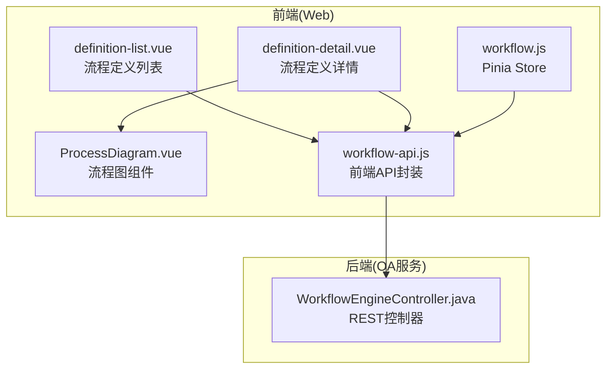
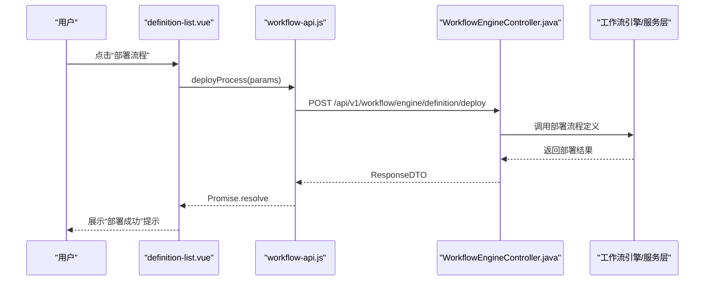
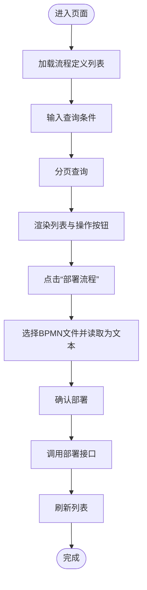
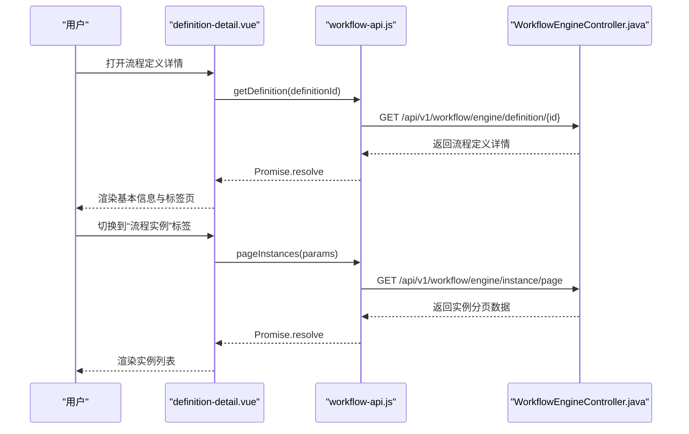
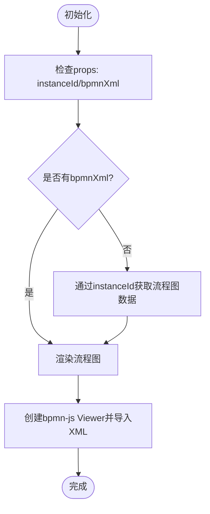
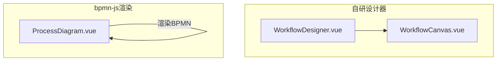
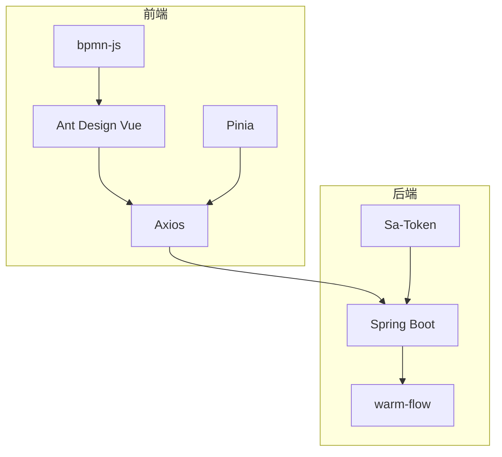

# 流程设计

<cite>
**本文引用的文件**
- [definition-list.vue](file://smart-admin-web-javascript/src/views/business/oa/workflow/definition/definition-list.vue)
- [definition-detail.vue](file://smart-admin-web-javascript/src/views/business/oa/workflow/definition/definition-detail.vue)
- [ProcessDiagram.vue](file://smart-admin-web-javascript/src/components/workflow/ProcessDiagram.vue)
- [workflow-api.js](file://smart-admin-web-javascript/src/api/business/oa/workflow-api.js)
- [workflow.js](file://smart-admin-web-javascript/src/store/modules/business/workflow.js)
- [12-前端API接口设计.md](file://documentation/03-业务模块/OA工作流/12-前端API接口设计.md)
- [OA工作流模块完整实施指南.md](file://OA工作流模块完整实施指南.md)
- [smart-workflow.md](file://documentation/technical/smart-workflow.md)
- [WorkflowEngineController.java](file://microservices/ioedream-oa-service/src/main/java/net/lab1024/sa/oa/workflow/controller/WorkflowEngineController.java)
- [workflow-menu-config.sql](file://sql/workflow-menu-config.sql)
</cite>

## 目录
1. [简介](#简介)
2. [项目结构](#项目结构)
3. [核心组件](#核心组件)
4. [架构总览](#架构总览)
5. [详细组件分析](#详细组件分析)
6. [依赖关系分析](#依赖关系分析)
7. [性能考虑](#性能考虑)
8. [故障排查指南](#故障排查指南)
9. [结论](#结论)
10. [附录](#附录)

## 简介
本文件面向OA工作流流程设计与前端可视化实现，围绕BPMN流程设计器、流程节点配置、审批条件设置、任务分配规则、流程模板创建与发布、版本管理机制，以及与业务系统的集成方式进行系统化说明。同时提供基于仓库现有实现的前端组件（definition-list.vue、definition-detail.vue）与后端API的调用路径、数据结构与最佳实践，帮助开发者快速落地流程设计与运行。

## 项目结构
OA工作流模块在前端采用Vue 3 + Ant Design Vue，后端采用Spring Boot微服务，通过REST API与工作流引擎交互；前端提供流程定义管理、流程实例管理、任务管理与流程监控等页面，配合流程图组件实现可视化设计与预览。

图表来源
- [definition-list.vue](file://smart-admin-web-javascript/src/views/business/oa/workflow/definition/definition-list.vue#L1-L198)
- [definition-detail.vue](file://smart-admin-web-javascript/src/views/business/oa/workflow/definition/definition-detail.vue#L1-L108)
- [ProcessDiagram.vue](file://smart-admin-web-javascript/src/components/workflow/ProcessDiagram.vue#L1-L80)
- [workflow-api.js](file://smart-admin-web-javascript/src/api/business/oa/workflow-api.js#L1-L40)
- [workflow.js](file://smart-admin-web-javascript/src/store/modules/business/workflow.js#L1-L120)
- [WorkflowEngineController.java](file://microservices/ioedream-oa-service/src/main/java/net/lab1024/sa/oa/workflow/controller/WorkflowEngineController.java#L62-L81)

章节来源
- [12-前端API接口设计.md](file://documentation/03-业务模块/OA工作流/12-前端API接口设计.md#L1-L120)
- [OA工作流模块完整实施指南.md](file://OA工作流模块完整实施指南.md#L1-L120)

## 核心组件
- 流程定义管理页（definition-list.vue）：提供流程定义的查询、部署、激活、禁用、删除与分页展示。
- 流程定义详情页（definition-detail.vue）：展示流程定义详情、流程图、表单定义、变量定义与实例列表。
- 流程图组件（ProcessDiagram.vue）：基于bpmn-js渲染BPMN流程图，支持加载与高亮。
- 前端API封装（workflow-api.js）：封装流程定义、实例、任务、监控等REST接口调用。
- 状态管理（workflow.js）：集中管理待办/已办任务、流程实例、流程定义、流程图与统计等状态。

章节来源
- [definition-list.vue](file://smart-admin-web-javascript/src/views/business/oa/workflow/definition/definition-list.vue#L1-L198)
- [definition-detail.vue](file://smart-admin-web-javascript/src/views/business/oa/workflow/definition/definition-detail.vue#L1-L108)
- [ProcessDiagram.vue](file://smart-admin-web-javascript/src/components/workflow/ProcessDiagram.vue#L1-L80)
- [workflow-api.js](file://smart-admin-web-javascript/src/api/business/oa/workflow-api.js#L1-L40)
- [workflow.js](file://smart-admin-web-javascript/src/store/modules/business/workflow.js#L1-L120)

## 架构总览
前端通过API封装调用后端控制器，控制器转发至服务层与工作流引擎交互，返回统一响应格式；流程图组件负责渲染BPMN流程图，支持高亮与节点点击事件扩展。

图表来源
- [definition-list.vue](file://smart-admin-web-javascript/src/views/business/oa/workflow/definition/definition-list.vue#L345-L420)
- [workflow-api.js](file://smart-admin-web-javascript/src/api/business/oa/workflow-api.js#L14-L26)
- [WorkflowEngineController.java](file://microservices/ioedream-oa-service/src/main/java/net/lab1024/sa/oa/workflow/controller/WorkflowEngineController.java#L62-L81)

## 详细组件分析

### 流程定义管理页（definition-list.vue）
- 功能要点
  - 查询条件：流程分类、状态、关键词
  - 列表字段：流程名称、流程Key、版本、状态、分类、部署时间、操作
  - 操作：详情、激活、禁用、删除、分页
  - 部署：弹窗收集流程名称、流程Key、描述、分类与BPMN文件（读取为文本），调用部署接口
- 关键交互
  - 分页查询：queryDefinitionList -> workflowStore.fetchDefinitionList -> workflow-api.pageDefinitions
  - 部署流程：handleDeployConfirm -> workflow-api.deployProcess
  - 激活/禁用/删除：调用对应API并刷新列表
- 数据来源
  - 列表数据来自Pinia Store（definitionList、definitionTotal）
  - 分页参数来自本地查询表单（pageNum、pageSize、category、status、keyword）

图表来源
- [definition-list.vue](file://smart-admin-web-javascript/src/views/business/oa/workflow/definition/definition-list.vue#L290-L420)
- [workflow-api.js](file://smart-admin-web-javascript/src/api/business/oa/workflow-api.js#L14-L40)
- [workflow.js](file://smart-admin-web-javascript/src/store/modules/business/workflow.js#L1-L120)

章节来源
- [definition-list.vue](file://smart-admin-web-javascript/src/views/business/oa/workflow/definition/definition-list.vue#L1-L198)
- [12-前端API接口设计.md](file://documentation/03-业务模块/OA工作流/12-前端API接口设计.md#L69-L91)

### 流程定义详情页（definition-detail.vue）
- 功能要点
  - 基本信息：流程Key、名称、版本、状态、分类、描述、部署/创建时间、实例数量
  - 标签页：流程图、表单定义、变量定义、流程实例
  - 流程图：通过ProcessDiagram组件渲染BPMN XML
  - 实例列表：分页查询并展示状态、发起人、开始时间
- 关键交互
  - 详情加载：queryDefinitionDetail -> workflowStore.fetchDefinitionDetail -> workflow-api.getDefinition
  - 实例列表：queryInstanceList -> workflow-api.pageInstances
  - 激活/禁用：调用对应API并刷新详情

图表来源
- [definition-detail.vue](file://smart-admin-web-javascript/src/views/business/oa/workflow/definition/definition-detail.vue#L156-L202)
- [workflow-api.js](file://smart-admin-web-javascript/src/api/business/oa/workflow-api.js#L41-L80)
- [WorkflowEngineController.java](file://microservices/ioedream-oa-service/src/main/java/net/lab1024/sa/oa/workflow/controller/WorkflowEngineController.java#L76-L81)

章节来源
- [definition-detail.vue](file://smart-admin-web-javascript/src/views/business/oa/workflow/definition/definition-detail.vue#L1-L108)
- [12-前端API接口设计.md](file://documentation/03-业务模块/OA工作流/12-前端API接口设计.md#L133-L157)

### 流程图组件（ProcessDiagram.vue）
- 功能要点
  - 支持通过instanceId或bpmnXml渲染流程图
  - 加载中/错误状态提示
  - 高亮节点与节点点击事件预留（TODO）
- 关键逻辑
  - 动态导入bpmn-js（NavigatedViewer）进行渲染
  - 若未安装bpmn-js，降级显示XML预览
  - 监听props变化，销毁旧viewer并重建

图表来源
- [ProcessDiagram.vue](file://smart-admin-web-javascript/src/components/workflow/ProcessDiagram.vue#L74-L137)

章节来源
- [ProcessDiagram.vue](file://smart-admin-web-javascript/src/components/workflow/ProcessDiagram.vue#L1-L80)

### 前端API封装（workflow-api.js）
- 流程定义管理
  - 部署流程定义：deployProcess
  - 分页查询流程定义：pageDefinitions
  - 获取流程定义详情：getDefinition
  - 激活/禁用/删除流程定义：activateDefinition/disableDefinition/deleteDefinition
- 流程实例管理
  - 启动流程实例：startProcess
  - 分页查询流程实例：pageInstances
  - 获取流程实例详情：getInstance
  - 挂起/激活/终止/撤销：suspendInstance/activateInstance/terminateInstance/revokeInstance
- 任务管理
  - 分页查询我的待办/已办任务：pageMyTasks/pageMyCompletedTasks
  - 获取任务详情：getTask
  - 受理/取消受理/委派/转交/完成/驳回：claimTask/unclaimTask/delegateTask/transferTask/completeTask/rejectTask
- 流程监控
  - 获取流程实例图：getProcessDiagram
  - 获取流程历史记录：getProcessHistory
  - 获取流程统计信息：getProcessStatistics

章节来源
- [workflow-api.js](file://smart-admin-web-javascript/src/api/business/oa/workflow-api.js#L1-L120)
- [12-前端API接口设计.md](file://documentation/03-业务模块/OA工作流/12-前端API接口设计.md#L69-L581)

### 状态管理（workflow.js）
- 管理范围
  - 待办/已办任务列表与查询参数
  - 流程实例列表与查询参数
  - 我发起的流程列表与查询参数
  - 流程定义列表与查询参数
  - 当前任务/实例/定义详情
  - 流程历史记录、流程图数据、统计信息
  - WebSocket连接状态
- 关键能力
  - getters：统计、按ID检索
  - actions：各模块数据拉取与查询参数合并

章节来源
- [workflow.js](file://smart-admin-web-javascript/src/store/modules/business/workflow.js#L1-L200)

### 流程设计器与BPMN可视化（概念说明）
- 仓库提供了基于bpmn-js的流程图组件（ProcessDiagram.vue），用于渲染BPMN流程图。
- 仓库还包含一套自研的流程设计器（WorkflowDesigner.vue、WorkflowCanvas.vue等），支持节点拖拽、连线、属性面板、保存/发布/预览/验证等流程设计能力。
- 由于本仓库以“流程定义管理页”为核心，且前端已集成bpmn-js渲染，因此在“流程定义详情页”的“流程图”标签中可直接展示BPMN流程图。

图表来源
- [ProcessDiagram.vue](file://smart-admin-web-javascript/src/components/workflow/ProcessDiagram.vue#L1-L80)
- [smart-workflow.md](file://documentation/technical/smart-workflow.md#L1921-L2005)
- [smart-workflow.md](file://documentation/technical/smart-workflow.md#L2312-L2360)

## 依赖关系分析
- 前端依赖
  - bpmn-js：用于流程图渲染（已在实施指南中确认安装）
  - Ant Design Vue：UI组件库
  - Pinia：状态管理
  - Axios：HTTP请求
- 后端依赖
  - Spring Boot + Sa-Token（认证授权）
  - 工作流引擎：warm-flow（集成方式见技术文档）
- 菜单与权限
  - 通过菜单配置SQL脚本将流程定义、流程实例、任务、监控等页面纳入系统菜单，并绑定权限点

图表来源
- [OA工作流模块完整实施指南.md](file://OA工作流模块完整实施指南.md#L85-L120)
- [workflow-menu-config.sql](file://sql/workflow-menu-config.sql#L260-L359)

章节来源
- [OA工作流模块完整实施指南.md](file://OA工作流模块完整实施指南.md#L85-L120)
- [workflow-menu-config.sql](file://sql/workflow-menu-config.sql#L260-L359)

## 性能考虑
- 前端
  - 列表分页：后端分页优先，避免一次性加载过多数据
  - 图片/流程图懒加载：仅在需要时渲染
  - 缓存策略：对不频繁变动的数据进行缓存
  - 虚拟滚动：大数据量列表使用虚拟滚动优化
- 后端
  - 数据库索引优化：针对高频查询字段建立索引
  - 查询结果缓存：热点数据缓存
  - 异步任务处理：耗时操作异步化

[本节为通用指导，不直接分析具体文件]

## 故障排查指南
- 部署流程失败
  - 检查BPMN文件是否正确上传并读取为文本
  - 确认流程名称、流程Key、分类、描述等必填字段
  - 查看接口返回的错误码与消息
- 流程图无法渲染
  - 确认bpmn-js已安装并正确导入
  - 若未安装，组件会降级显示XML预览
- WebSocket未连接
  - 检查环境变量VITE_WS_URL与后端WebSocket配置
  - 确认用户登录后初始化WebSocket
- 菜单与权限
  - 执行菜单配置SQL脚本，确保流程相关菜单与权限点已创建

章节来源
- [definition-list.vue](file://smart-admin-web-javascript/src/views/business/oa/workflow/definition/definition-list.vue#L345-L420)
- [ProcessDiagram.vue](file://smart-admin-web-javascript/src/components/workflow/ProcessDiagram.vue#L74-L137)
- [OA工作流模块完整实施指南.md](file://OA工作流模块完整实施指南.md#L228-L256)
- [workflow-menu-config.sql](file://sql/workflow-menu-config.sql#L260-L359)

## 结论
本仓库提供了完善的OA工作流前端页面与API封装，结合bpmn-js流程图渲染能力，能够满足流程定义管理、流程实例与任务管理、流程监控等核心需求。通过Pinia集中管理状态，前端与后端通过REST API协作，配合warm-flow工作流引擎，可快速构建企业级审批流程系统。后续可在现有基础上扩展流程模板库、版本管理、流程复制、催办与评论等功能，进一步提升可用性与可维护性。

[本节为总结性内容，不直接分析具体文件]

## 附录

### 常见设计模式与最佳实践
- 流程节点配置
  - 使用开始/结束节点、用户任务、服务任务与网关节点组合表达业务分支
  - 为每个节点设置清晰的任务名称与处理人规则
- 审批条件设置
  - 通过变量与监听器实现条件路由
  - 对敏感节点设置权限校验与审批时限
- 任务分配规则
  - 支持“指定用户”、“角色”、“部门”等候选处理人
  - 支持转办/委派/退回等灵活处理
- 流程模板创建与发布
  - 先在设计器中完成流程草稿，验证流程结构正确后再发布
  - 发布后禁止修改流程结构，仅允许调整变量与表单
- 版本管理机制
  - 通过版本号区分不同版本流程定义，保留历史版本以便审计与回溯
- 与业务系统集成
  - 通过表单定义与变量定义承载业务数据
  - 通过流程历史与任务表实现审批记录与追溯

[本节为通用指导，不直接分析具体文件]

### API调用路径与数据结构参考
- 流程定义管理
  - 部署流程定义：POST /api/v1/workflow/engine/definition/deploy
  - 分页查询流程定义：GET /api/v1/workflow/engine/definition/page
  - 获取流程定义详情：GET /api/v1/workflow/engine/definition/{definitionId}
  - 激活/禁用/删除流程定义：PUT /api/v1/workflow/engine/definition/{definitionId}/activate | /disable | /delete
- 流程实例管理
  - 启动流程实例：POST /api/v1/workflow/engine/instance/start
  - 分页查询流程实例：GET /api/v1/workflow/engine/instance/page
  - 获取流程实例详情：GET /api/v1/workflow/engine/instance/{instanceId}
  - 挂起/激活/终止/撤销：PUT /api/v1/workflow/engine/instance/{instanceId}/suspend | /activate | /terminate | /revoke
- 任务管理
  - 分页查询我的待办/已办任务：GET /api/v1/workflow/engine/task/my/pending | /completed
  - 获取任务详情：GET /api/v1/workflow/engine/task/{taskId}
  - 受理/取消受理/委派/转交/完成/驳回：PUT /api/v1/workflow/engine/task/{taskId}/claim | /unclaim | /delegate | /transfer | /complete | /reject
- 流程监控
  - 获取流程实例图：GET /api/v1/workflow/engine/instance/{instanceId}/diagram
  - 获取流程历史记录：GET /api/v1/workflow/engine/instance/{instanceId}/history
  - 获取流程统计信息：GET /api/v1/workflow/engine/statistics

章节来源
- [12-前端API接口设计.md](file://documentation/03-业务模块/OA工作流/12-前端API接口设计.md#L69-L581)