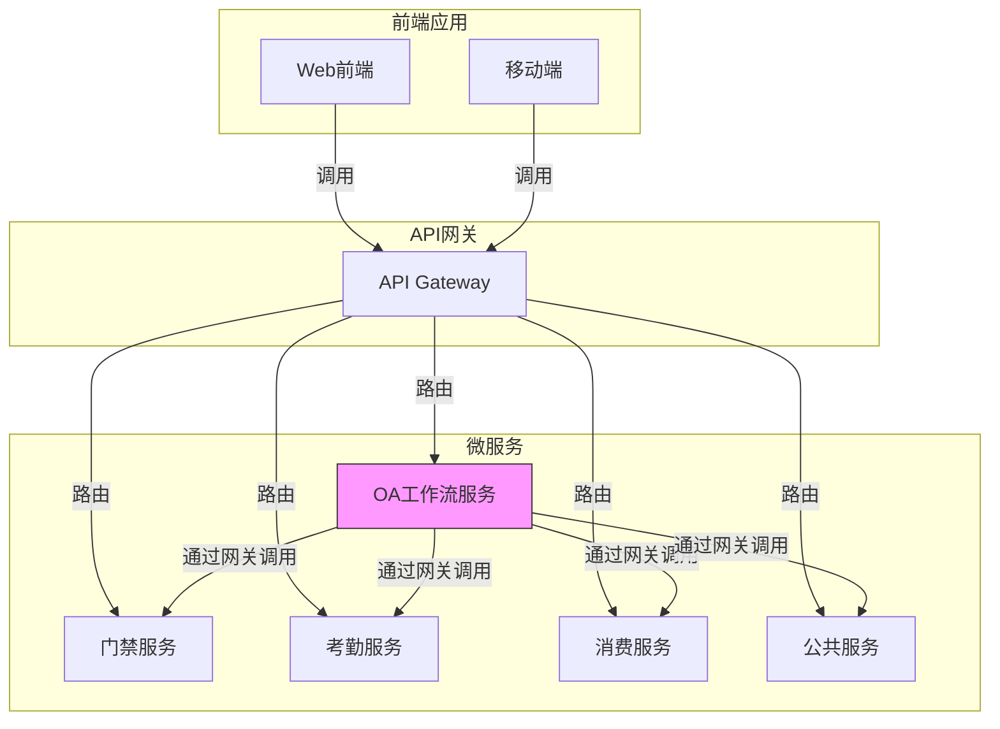
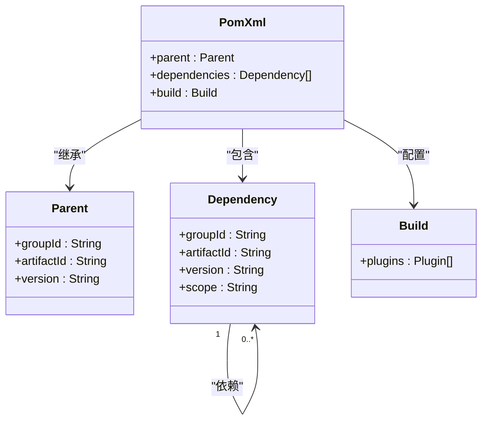
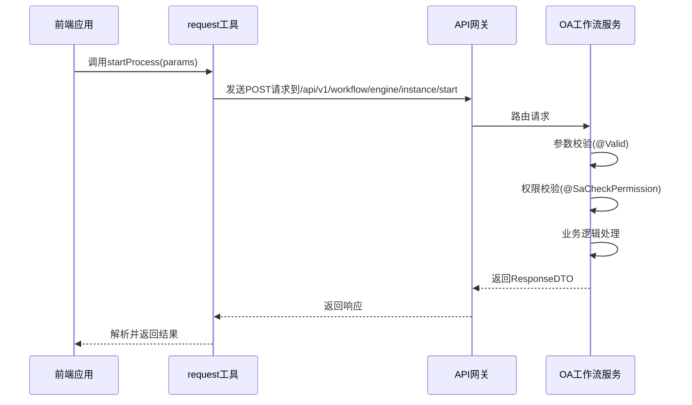
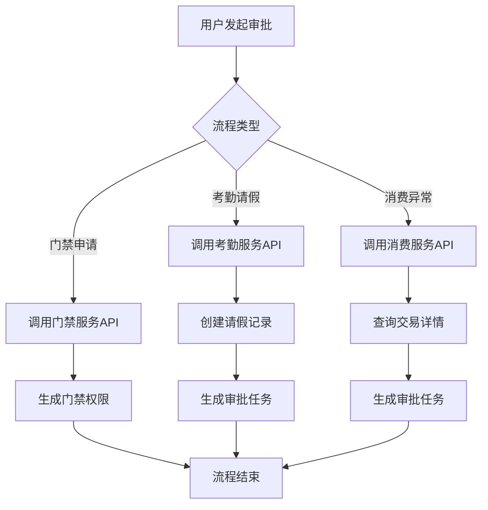

# 系统集成

<cite>
**本文档引用文件**   
- [pom.xml](file://microservices/ioedream-oa-service/pom.xml)
- [workflow-api.js](file://smart-admin-web-javascript/src/api/business/oa/workflow-api.js)
- [workflow.js](file://smart-admin-web-javascript/src/store/modules/business/workflow.js)
- [AccessMobileController.java](file://microservices/ioedream-access-service/src/main/java/net/lab1024/sa/access/controller/AccessMobileController.java)
- [ConsumeController.java](file://microservices/ioedream-consume-service/src/main/java/net/lab1024/sa/consume/controller/ConsumeController.java)
- [AttendanceLeaveHandler.java](file://documentation/technical/smart-business-integration.md)
- [AttendanceExceptionApplicationController.java](file://restful_refactor_backup_20251202_014224/microservices_ioedream-attendance-service_src_main_java_net_lab1024_sa_attendance_controller_AttendanceExceptionApplicationController.java)
</cite>

## 目录
1. [引言](#引言)
2. [OA工作流与其他业务系统集成方案](#oa工作流与其他业务系统集成方案)
3. [依赖管理分析](#依赖管理分析)
4. [API接口设计规范](#api接口设计规范)
5. [跨系统审批流程集成实现](#跨系统审批流程集成实现)
6. [服务间认证授权机制](#服务间认证授权机制)
7. [数据一致性保障与分布式事务](#数据一致性保障与分布式事务)
8. [集成测试用例](#集成测试用例)
9. [故障排查指南](#故障排查指南)
10. [结论](#结论)

## 引言

本技术文档旨在全面阐述IOE-DREAM智慧园区平台中OA工作流系统与其他业务系统的集成方案。文档重点分析了基于Maven的依赖管理如何支持跨服务调用，详细说明了前端API接口的设计规范，并深入探讨了通过统一网关实现门禁、考勤、消费等系统审批流程集成的具体实现方式。同时，文档提供了服务间认证授权、数据一致性保障和分布式事务处理的最佳实践，以及集成测试用例和故障排查指南，为系统的稳定运行和高效维护提供全面的技术支持。

## OA工作流与其他业务系统集成方案

IOE-DREAM平台采用微服务架构，OA工作流服务（ioedream-oa-service）作为核心业务协调者，与门禁、考勤、消费等业务系统通过API网关进行松耦合集成。集成方案的核心是基于RESTful API和统一网关调用模式，确保服务间的通信安全、可靠且可维护。

OA工作流服务负责定义和管理各类审批流程，如请假、加班、临时权限申请等。当用户在前端发起一个审批请求时，前端应用通过`workflow-api.js`调用OA工作流服务的API来启动流程实例。工作流引擎根据预设的业务规则，将任务分配给相应的审批人。在审批过程中，工作流服务可能需要调用其他业务系统的服务来获取数据或执行操作，例如在审批门禁权限申请时，需要调用门禁服务验证用户权限。

**图示来源**
- [pom.xml](file://microservices/ioedream-oa-service/pom.xml)
- [workflow-api.js](file://smart-admin-web-javascript/src/api/business/oa/workflow-api.js)

**本节来源**
- [pom.xml](file://microservices/ioedream-oa-service/pom.xml)
- [workflow-api.js](file://smart-admin-web-javascript/src/api/business/oa/workflow-api.js)

## 依赖管理分析

项目采用Maven进行依赖管理，其核心策略是通过父POM（`ioedream-microservices-parent`）统一管理所有微服务的公共依赖版本，确保整个系统依赖的一致性和稳定性。OA工作流服务的`pom.xml`文件通过继承父POM，获得了统一的依赖配置。

关键依赖分析如下：
- **microservices-common**: 这是所有微服务共享的公共模块，包含了工具类、通用DTO、网关客户端（`GatewayServiceClient`）等，是实现服务间调用的基础。
- **Spring Cloud Nacos Discovery**: 用于服务注册与发现，使微服务能够动态地发现和调用其他服务。
- **Spring Boot Web**: 提供了构建Web应用的基础，包括嵌入式Tomcat和Spring MVC。
- **MyBatis-Plus**: 作为持久层框架，简化了数据库操作。
- **Lombok**: 通过注解减少样板代码，如`@Data`、`@Slf4j`等。

值得注意的是，尽管`pom.xml`中注释提到了`warm-flow-spring-boot-starter`工作流引擎，但当前系统并未集成该引擎，而是采用了基于数据库的自定义工作流实现。这表明系统在技术选型上保持了灵活性，可以根据实际需求选择最合适的解决方案。

**图示来源**
- [pom.xml](file://microservices/ioedream-oa-service/pom.xml)

**本节来源**
- [pom.xml](file://microservices/ioedream-oa-service/pom.xml)

## API接口设计规范

前端API的设计严格遵循RESTful原则和项目内部的API路径规范，确保接口的清晰性、一致性和可维护性。API接口主要分为两类：面向前端的业务API和面向后端的服务间调用API。

### 前端API设计规范

前端API位于`smart-admin-web-javascript/src/api/business/oa/`目录下，以`workflow-api.js`为代表，其设计规范如下：
- **模块化**: 每个业务模块都有独立的API文件，便于管理和维护。
- **函数化**: 每个API端点都被封装为一个独立的函数，函数名清晰地描述了其功能，如`startProcess`、`pageMyTasks`。
- **参数化**: 函数参数采用对象形式，便于扩展和传递可选参数。
- **统一返回**: 所有API调用都通过`request`工具进行，该工具封装了统一的请求头、错误处理和响应格式。
- **路径规范**: API路径遵循`/api/v{版本号}/{业务域}/{资源}`的格式，如`/api/v1/workflow/engine/instance/start`。

### 后端API设计规范

后端API的设计遵循CLAUDE.md架构规范，主要特点包括：
- **注解驱动**: 使用`@RestController`、`@RequestMapping`、`@GetMapping`、`@PostMapping`等Spring注解定义REST端点。
- **参数校验**: 使用`@Valid`和JSR-303注解对请求参数进行校验。
- **安全控制**: 使用`@SaCheckLogin`、`@SaCheckPermission`等注解进行登录和权限校验。
- **统一响应**: 所有接口返回`ResponseDTO<T>`格式的统一响应体，包含状态码、消息和数据。
- **日志记录**: 在关键操作点记录日志，便于问题追踪和审计。

**图示来源**
- [workflow-api.js](file://smart-admin-web-javascript/src/api/business/oa/workflow-api.js)
- [AccessMobileController.java](file://microservices/ioedream-access-service/src/main/java/net/lab1024/sa/access/controller/AccessMobileController.java)

**本节来源**
- [workflow-api.js](file://smart-admin-web-javascript/src/api/business/oa/workflow-api.js)
- [AccessMobileController.java](file://microservices/ioedream-access-service/src/main/java/net/lab1024/sa/access/controller/AccessMobileController.java)

## 跨系统审批流程集成实现

跨系统审批流程的集成是通过OA工作流服务作为协调中心，利用统一的`GatewayServiceClient`来调用其他业务系统的API实现的。这种设计避免了服务间的直接耦合，所有通信都通过API网关进行，符合微服务架构的最佳实践。

### 门禁系统集成

当用户申请临时门禁权限时，流程如下：
1.  用户在前端提交申请，前端调用OA工作流的`startProcess` API启动“临时权限申请”流程。
2.  工作流引擎创建流程实例，并生成待办任务给审批人。
3.  审批人审批通过后，工作流服务通过`GatewayServiceClient`调用门禁服务的`/api/v1/access/visitor/permission/generate`接口，为访客生成门禁权限。
4.  门禁服务执行权限分配，并返回结果给工作流服务，流程结束。

### 考勤系统集成

以考勤请假为例，其集成实现更为复杂，涉及动态审批流程：
1.  用户提交请假申请，启动“请假审批”流程。
2.  在流程的“请假处理”环节，系统会调用`AttendanceLeaveHandler`处理器。
3.  该处理器根据请假天数（`leaveDays`）动态决定审批流程：
    -   1天以内：只需直属上级审批。
    -   1-3天：需要直属上级和部门经理两级审批。
    -   3天以上：需要直属上级、部门经理和HR三级审批。
4.  处理器通过`GatewayServiceClient`调用考勤服务创建请假记录，并根据规则生成相应数量的审批任务。

### 消费系统集成

消费系统的集成主要体现在消费异常处理和账户管理上：
1.  当消费设备上报异常交易时，可以触发一个“消费异常处理”流程。
2.  工作流服务调用消费服务的`/api/v1/consume/transaction/query`接口查询交易详情。
3.  审批人根据详情决定是否需要退款或调整账户余额。
4.  审批通过后，工作流服务调用消费服务的`/api/v1/consume/refund`接口执行退款操作。

**图示来源**
- [AttendanceLeaveHandler.java](file://documentation/technical/smart-business-integration.md)
- [ConsumeController.java](file://microservices/ioedream-consume-service/src/main/java/net/lab1024/sa/consume/controller/ConsumeController.java)

**本节来源**
- [AttendanceLeaveHandler.java](file://documentation/technical/smart-business-integration.md)
- [ConsumeController.java](file://microservices/ioedream-consume-service/src/main/java/net/lab1024/sa/consume/controller/ConsumeController.java)
- [AttendanceExceptionApplicationController.java](file://restful_refactor_backup_20251202_014224/microservices_ioedream-attendance-service_src_main_java_net_lab1024_sa_attendance_controller_AttendanceExceptionApplicationController.java)

## 服务间认证授权机制

系统采用多层次的安全机制来保障服务间调用的安全性。

### 认证机制

- **Token认证**: 前端应用在用户登录后会获得一个JWT Token。当调用任何需要认证的API时，前端必须在HTTP请求头中携带此Token。
- **网关验证**: API网关在接收到请求后，首先验证Token的有效性。只有通过验证的请求才会被路由到后端微服务。
- **服务间Token**: 当一个微服务通过`GatewayServiceClient`调用另一个微服务时，`GatewayServiceClient`会自动在请求头中添加一个服务间认证Token，该Token由网关验证，确保调用方是可信的服务。

### 授权机制

- **基于角色的访问控制 (RBAC)**: 系统使用Sa-Token框架实现RBAC。用户被赋予不同的角色（如`CONSUME_MANAGER`, `ATTENDANCE_USER`），角色又关联到具体的权限。
- **注解式授权**: 在API端点上使用`@SaCheckPermission("permission:code")`注解来声明所需的权限。例如，消费管理接口要求`CONSUME_MANAGER`角色。
- **数据权限**: 除了功能权限，系统还实现了数据权限控制，确保用户只能访问自己权限范围内的数据。

这种机制确保了只有经过身份验证和授权的用户或服务才能访问特定的资源，有效防止了未授权访问。

**本节来源**
- [AccessMobileController.java](file://microservices/ioedream-access-service/src/main/java/net/lab1024/sa/access/controller/AccessMobileController.java)
- [ConsumeController.java](file://microservices/ioedream-consume-service/src/main/java/net/lab1024/sa/consume/controller/ConsumeController.java)

## 数据一致性保障与分布式事务

在分布式系统中，跨服务的数据一致性是一个挑战。本系统采用了多种策略来保障数据一致性。

### 最终一致性

对于大多数业务场景，系统采用“最终一致性”模型。例如，在门禁权限申请流程中：
1.  工作流服务先将“审批通过”这一状态持久化到自己的数据库。
2.  然后异步调用门禁服务的API来创建权限。
3.  如果门禁服务调用失败，系统会记录一条失败日志，并通过定时任务或人工干预进行补偿。

### 分布式事务（Saga模式）

对于要求强一致性的场景，如消费退款，系统可以采用Saga模式：
1.  **开始Saga**: 工作流服务启动一个Saga事务，并记录事务ID。
2.  **执行本地事务**: 工作流服务在自己的数据库中创建一个“退款待处理”记录。
3.  **调用远程服务**: 调用消费服务的退款接口。
4.  **补偿事务**: 如果远程调用失败，工作流服务会执行一个补偿操作，将“退款待处理”记录的状态改为“失败”，并通知用户。

### 幂等性设计

所有对外暴露的API都设计为幂等的。例如，同一个退款请求，无论被调用多少次，都只会产生一次退款效果。这通常通过在请求中包含唯一的业务ID（如`businessCode`）来实现，服务端会检查该ID是否已处理过。

这些策略共同作用，确保了在分布式环境下，业务数据的完整性和可靠性。

**本节来源**
- [ConsumeController.java](file://microservices/ioedream-consume-service/src/main/java/net/lab1024/sa/consume/controller/ConsumeController.java)

## 集成测试用例

为确保集成方案的正确性，需要编写全面的集成测试用例。

### 测试用例1：门禁权限申请流程

- **前提条件**: 用户A有发起申请的权限，用户B是审批人。
- **步骤**:
    1.  用户A调用`startProcess` API，启动“临时权限申请”流程。
    2.  验证OA工作流服务中创建了新的流程实例。
    3.  验证用户B的待办任务列表中出现新任务。
    4.  用户B调用`completeTask` API，审批通过。
    5.  验证`GatewayServiceClient`成功调用了门禁服务的权限生成接口。
    6.  验证门禁服务中已为访客创建了相应的权限。
- **预期结果**: 整个流程顺利完成，数据在各系统中保持一致。

### 测试用例2：考勤请假动态审批

- **前提条件**: 用户C申请3天假期。
- **步骤**:
    1.  用户C提交请假申请。
    2.  验证系统生成了三个待办任务：直属上级、部门经理、HR。
    3.  按顺序完成三个审批任务。
    4.  验证考勤服务中已创建请假记录，且状态为“已批准”。
- **预期结果**: 三级审批流程被正确触发，所有任务均被处理。

### 测试用例3：服务调用失败恢复

- **前提条件**: 模拟门禁服务不可用。
- **步骤**:
    1.  启动一个门禁权限申请流程。
    2.  在审批通过后，人为关闭门禁服务。
    3.  观察OA工作流服务的日志和补偿机制。
    4.  重新启动门禁服务。
    5.  验证补偿任务是否成功执行。
- **预期结果**: 系统记录了调用失败，并在服务恢复后成功完成补偿操作。

**本节来源**
- [workflow-api.js](file://smart-admin-web-javascript/src/api/business/oa/workflow-api.js)
- [ConsumeController.java](file://microservices/ioedream-consume-service/src/main/java/net/lab1024/sa/consume/controller/ConsumeController.java)

## 故障排查指南

当集成出现问题时，可以按照以下步骤进行排查：

### 1. 检查API网关

- **症状**: 所有服务都无法访问。
- **排查步骤**:
    -   检查`docker-compose-services.yml`，确认`ioedream-gateway-service`是否正常运行。
    -   查看网关服务的日志，检查是否有路由错误或认证失败的记录。
    -   使用`curl`命令直接测试网关的健康检查接口。

### 2. 检查服务注册与发现

- **症状**: 服务间调用返回404或服务不可达。
- **排查步骤**:
    -   登录Nacos控制台，检查相关微服务（如`ioedream-oa-service`, `ioedream-access-service`）是否已成功注册。
    -   检查服务的IP和端口是否正确。
    -   确认`pom.xml`中`spring-cloud-starter-alibaba-nacos-discovery`依赖已正确配置。

### 3. 检查服务间调用

- **症状**: OA工作流能启动，但无法调用门禁或考勤服务。
- **排查步骤**:
    -   查看OA工作流服务的日志，确认`GatewayServiceClient`是否尝试调用目标服务。
    -   检查目标服务（如门禁服务）的日志，确认是否收到了请求。
    -   确认`GatewayServiceClient`的调用方法签名是否正确，避免编译时或运行时错误。

### 4. 检查数据库

- **症状**: 流程状态不更新，或数据丢失。
- **排查步骤**:
    -   检查`database-scripts/common-service/`下的SQL脚本，确认`t_workflow_instance`、`t_workflow_task`等表结构是否正确。
    -   使用数据库客户端直接查询相关表，验证数据是否按预期写入。
    -   检查数据库连接池（如Druid）的配置和状态。

通过系统性的排查，可以快速定位并解决集成过程中出现的各类问题。

**本节来源**
- [pom.xml](file://microservices/ioedream-oa-service/pom.xml)
- [AccessMobileController.java](file://microservices/ioedream-access-service/src/main/java/net/lab1024/sa/access/controller/AccessMobileController.java)

## 结论

本文档详细阐述了IOE-DREAM平台中OA工作流与其他业务系统的集成技术方案。通过分析`pom.xml`的依赖管理、`workflow-api.js`的API设计规范，以及`GatewayServiceClient`的统一调用模式，展示了系统如何实现松耦合、高内聚的微服务架构。门禁、考勤、消费等系统的审批流程集成，通过工作流引擎和动态处理器得以灵活实现。服务间认证授权、数据一致性保障和分布式事务处理的最佳实践，为系统的稳定性和可靠性提供了坚实基础。提供的集成测试用例和故障排查指南，为开发和运维团队提供了实用的操作指引。该集成方案设计合理，符合现代微服务架构的最佳实践，能够有效支撑智慧园区复杂多变的业务需求。