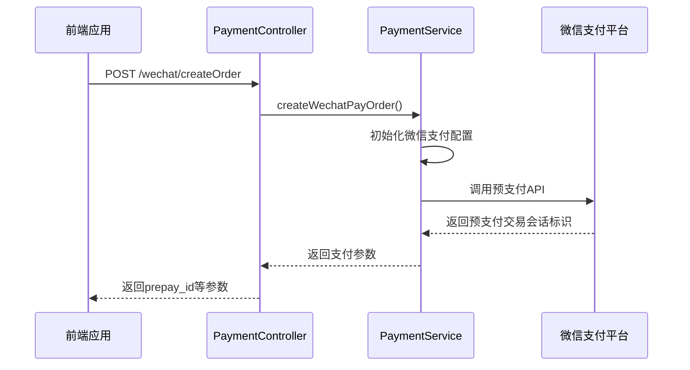
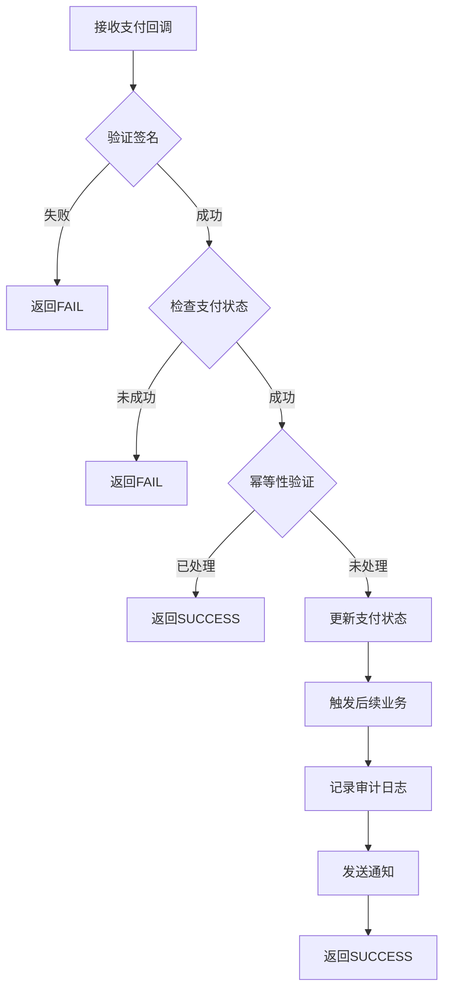
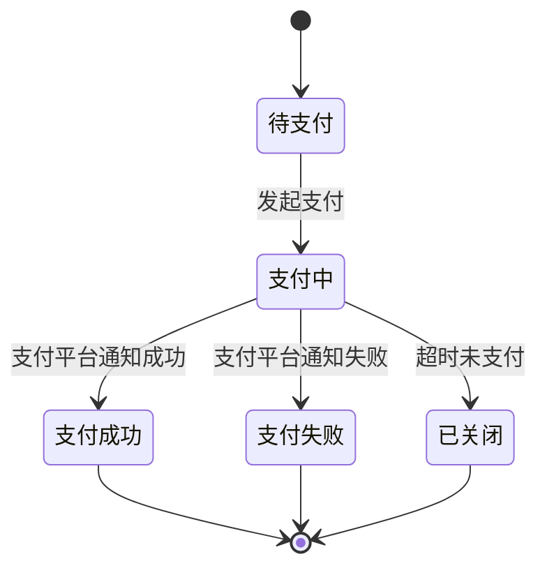
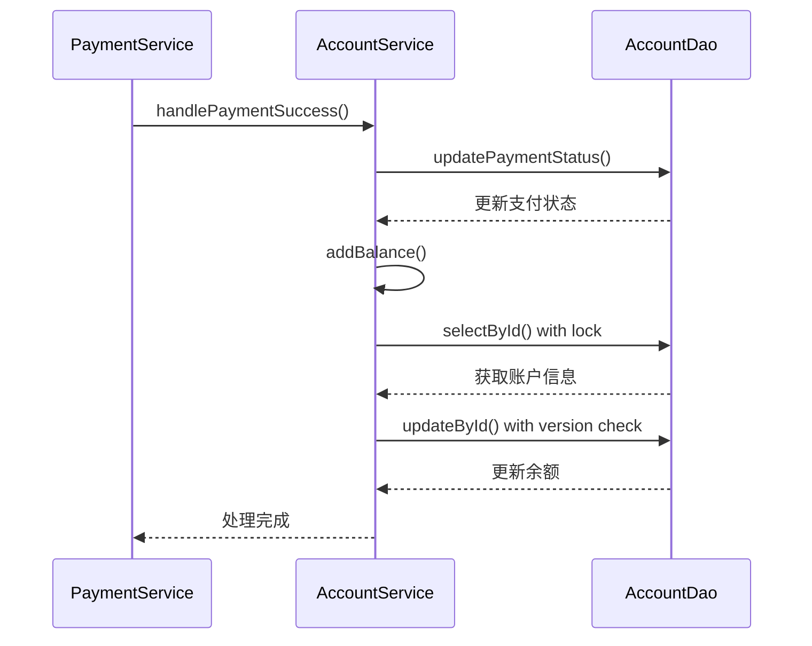

# 充值管理

<cite>
**本文档引用文件**   
- [PaymentController.java](file://microservices/ioedream-consume-service/src/main/java/net/lab1024/sa/consume/controller/PaymentController.java)
- [PaymentService.java](file://microservices/ioedream-consume-service/src/main/java/net/lab1024/sa/consume/service/PaymentService.java)
- [application-payment.yml](file://microservices/ioedream-consume-service/src/main/resources/application-payment.yml)
- [AccountService.java](file://microservices/ioedream-consume-service/src/main/java/net/lab1024/sa/consume/service/AccountService.java)
- [AccountServiceImpl.java](file://microservices/ioedream-consume-service/src/main/java/net/lab1024/sa/consume/service/impl/AccountServiceImpl.java)
</cite>

## 目录
1. [充值管理](#充值管理)
2. [RESTful接口设计](#restful接口设计)
3. [支付业务逻辑实现](#支付业务逻辑实现)
4. [支付配置文件说明](#支付配置文件说明)
5. [支付状态机设计](#支付状态机设计)
6. [账户服务交互](#账户服务交互)

## RESTful接口设计

充值功能的RESTful接口设计主要通过`PaymentController`类实现，提供了完整的支付请求处理能力。该控制器提供了创建支付订单、处理支付回调等核心接口。

支付创建接口通过`/api/v1/consume/payment/wechat/createOrder`和`/api/v1/consume/payment/alipay/createOrder`端点实现，支持微信支付和支付宝支付两种主流支付方式。接口采用POST方法，通过请求参数接收订单ID、金额、商品描述等必要信息。接口设计遵循了严格的权限控制，使用`@PreAuthorize`注解确保只有具备相应角色的用户才能发起支付请求。

支付状态查询功能通过订单ID实现，系统会记录每个支付请求的完整状态信息，包括支付中、支付成功、支付失败等状态。状态查询接口允许前端应用实时获取支付进度，为用户提供及时的反馈。

支付回调处理接口是整个支付流程的关键环节，通过`/api/v1/consume/payment/wechat/notify`和`/api/v1/consume/payment/alipay/notify`端点接收第三方支付平台的异步通知。这些接口不需要认证，由支付平台直接调用，确保了支付结果的及时性和可靠性。

**Section sources**
- [PaymentController.java](file://microservices/ioedream-consume-service/src/main/java/net/lab1024/sa/consume/controller/PaymentController.java#L45-L312)

## 支付业务逻辑实现

支付流程的业务逻辑主要在`PaymentService`类中实现，该服务类负责处理与第三方支付网关的集成、支付超时处理和支付结果异步通知等核心功能。

### 第三方支付网关集成

支付服务通过微信支付V3 SDK和支付宝SDK与第三方支付平台进行集成。对于微信支付，系统使用`RSAAutoCertificateConfig`自动管理证书，确保支付安全。支付服务初始化时会检查必要的配置参数，包括商户ID、API密钥、证书路径等，只有在配置完整的情况下才会启用支付功能。



**Diagram sources**
- [PaymentController.java](file://microservices/ioedream-consume-service/src/main/java/net/lab1024/sa/consume/controller/PaymentController.java#L45-L312)
- [PaymentService.java](file://microservices/ioedream-consume-service/src/main/java/net/lab1024/sa/consume/service/PaymentService.java#L75-L800)

### 支付超时处理

系统实现了完善的支付超时处理机制。在`application-payment.yml`配置文件中定义了订单超时时间（默认30分钟）和自动关闭未支付订单的时间（30分钟）。当用户发起支付请求后，如果在规定时间内未完成支付，系统会自动将订单状态更新为超时，释放相关资源。

支付服务在创建支付订单时会记录订单的创建时间，并在后台任务中定期检查超时订单。对于超时订单，系统会更新其状态并记录审计日志，确保交易状态的一致性。

### 支付结果异步通知机制

支付结果异步通知机制是确保支付结果可靠性的关键。当用户完成支付后，第三方支付平台会通过回调接口通知系统支付结果。系统在接收到回调通知后，会执行一系列验证和处理步骤：

1. 验证回调签名，确保通知来源的合法性
2. 检查支付结果状态，确认支付是否成功
3. 执行幂等性验证，防止重复处理同一笔交易
4. 更新支付记录状态
5. 触发后续业务处理，如更新账户余额
6. 记录审计日志
7. 发送支付成功通知



**Diagram sources**
- [PaymentService.java](file://microservices/ioedream-consume-service/src/main/java/net/lab1024/sa/consume/service/PaymentService.java#L362-L754)

**Section sources**
- [PaymentService.java](file://microservices/ioedream-consume-service/src/main/java/net/lab1024/sa/consume/service/PaymentService.java#L75-L800)

## 支付配置文件说明

`application-payment.yml`文件是支付功能的核心配置文件，包含了微信支付、支付宝支付以及支付业务相关的所有配置参数。

### 微信支付配置

微信支付配置部分包含了启用状态、AppID、商户号、API密钥、证书路径等关键信息。所有敏感信息都通过环境变量注入，避免了在代码中硬编码敏感信息的安全风险。

```yaml
wechat:
  pay:
    enabled: ${WECHAT_PAY_ENABLED:false}
    app-id: ${WECHAT_APP_ID:}
    mch-id: ${WECHAT_MCH_ID:}
    api-key: ${WECHAT_API_KEY:}
    cert-path: ${WECHAT_CERT_PATH:/opt/cert/apiclient_cert.p12}
    notify-url: ${WECHAT_NOTIFY_URL:https://api.ioedream.com/api/v1/consume/payment/wechat/notify}
```

### 支付宝配置

支付宝配置部分包含了启用状态、AppID、私钥、公钥、网关地址等信息。与微信支付类似，所有敏感信息都通过环境变量管理，确保了配置的安全性。

```yaml
alipay:
  enabled: ${ALIPAY_ENABLED:false}
  app-id: ${ALIPAY_APP_ID:}
  private-key: ${ALIPAY_PRIVATE_KEY:}
  public-key: ${ALIPAY_PUBLIC_KEY:}
  gateway-url: ${ALIPAY_GATEWAY_URL:https://openapi.alipay.com/gateway.do}
  notify-url: ${ALIPAY_NOTIFY_URL:https://api.ioedream.com/api/v1/consume/payment/alipay/notify}
```

### 支付业务配置

支付业务配置部分定义了订单超时时间、退款超时时间、最小和最大支付金额等业务规则。这些配置参数直接影响支付流程的行为，需要根据实际业务需求进行调整。

```yaml
payment:
  order-timeout: 30
  refund-timeout: 15
  min-amount: 0.01
  max-amount: 10000.00
  allow-partial-refund: true
  auto-close-timeout: 30
```

**Section sources**
- [application-payment.yml](file://microservices/ioedream-consume-service/src/main/resources/application-payment.yml#L1-L157)

## 支付状态机设计

支付流程的状态机设计涵盖了待支付、支付中、支付成功、支付失败等核心状态，确保了支付过程的完整性和一致性。

### 状态定义

- **待支付(PENDING)**: 用户已发起支付请求，但尚未完成支付
- **支付中(PROCESSING)**: 支付请求已发送到第三方支付平台，等待支付结果
- **支付成功(SUCCESS)**: 支付已完成，资金已到账
- **支付失败(FAILED)**: 支付过程中出现错误，支付未成功
- **已关闭(CLOSED)**: 订单超时未支付，系统自动关闭



**Diagram sources**
- [PaymentService.java](file://microservices/ioedream-consume-service/src/main/java/net/lab1024/sa/consume/service/PaymentService.java#L362-L754)

### 状态转换条件

状态转换由特定的事件触发，主要包括：

1. **支付请求事件**: 当用户发起支付请求时，状态从"待支付"转换为"支付中"
2. **支付成功事件**: 当接收到第三方支付平台的成功通知时，状态从"支付中"转换为"支付成功"
3. **支付失败事件**: 当接收到第三方支付平台的失败通知时，状态从"支付中"转换为"支付失败"
4. **超时事件**: 当支付请求超过规定时间未完成时，状态从"支付中"或"待支付"转换为"已关闭"

状态转换过程中，系统会执行相应的业务逻辑，如更新数据库记录、发送通知、记录审计日志等，确保状态变更的完整性和可追溯性。

**Section sources**
- [PaymentService.java](file://microservices/ioedream-consume-service/src/main/java/net/lab1024/sa/consume/service/PaymentService.java#L362-L754)

## 账户服务交互

支付服务与账户服务的交互是确保资金安全和账务一致性的关键环节。当支付成功后，系统需要及时更新用户的账户余额，确保账务数据的准确性。

### 账户服务接口

账户服务通过`AccountService`接口提供了一系列账户管理功能，包括创建账户、更新账户信息、查询账户、增加余额、扣减余额等。支付服务通过依赖注入获取账户服务实例，实现与账户服务的交互。

```java
public interface AccountService {
    boolean addBalance(Long accountId, BigDecimal amount, String reason);
    boolean deductBalance(Long accountId, BigDecimal amount, String reason);
    boolean validateBalance(Long accountId, BigDecimal amount);
    BigDecimal getBalance(Long accountId);
}
```

### 资金安全机制

系统实现了多重资金安全机制，确保资金操作的安全性和一致性：

1. **事务管理**: 所有涉及资金变动的操作都在事务中执行，确保操作的原子性
2. **余额验证**: 在扣减余额前，系统会验证账户余额是否充足
3. **版本控制**: 使用乐观锁机制防止并发修改导致的数据不一致
4. **审计日志**: 所有资金操作都会记录详细的审计日志，便于追踪和审计

### 账务一致性保障

为确保账务一致性，系统采用了以下措施：

1. **幂等性设计**: 支付回调处理具有幂等性，防止重复处理导致的账务错误
2. **对账机制**: 系统定期与第三方支付平台进行对账，发现并修复差异
3. **补偿机制**: 当出现异常情况时，系统会执行补偿操作，恢复账务一致性



**Diagram sources**
- [AccountService.java](file://microservices/ioedream-consume-service/src/main/java/net/lab1024/sa/consume/service/AccountService.java#L32-L240)
- [AccountServiceImpl.java](file://microservices/ioedream-consume-service/src/main/java/net/lab1024/sa/consume/service/impl/AccountServiceImpl.java#L52-L800)

**Section sources**
- [AccountService.java](file://microservices/ioedream-consume-service/src/main/java/net/lab1024/sa/consume/service/AccountService.java#L32-L240)
- [AccountServiceImpl.java](file://microservices/ioedream-consume-service/src/main/java/net/lab1024/sa/consume/service/impl/AccountServiceImpl.java#L52-L800)