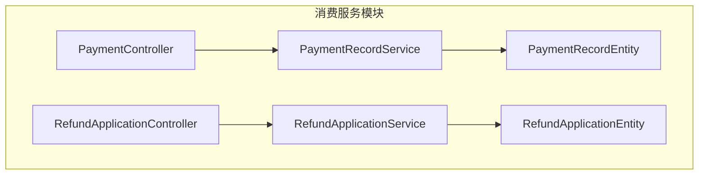
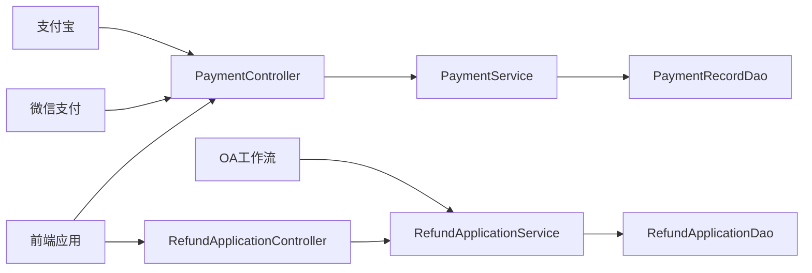
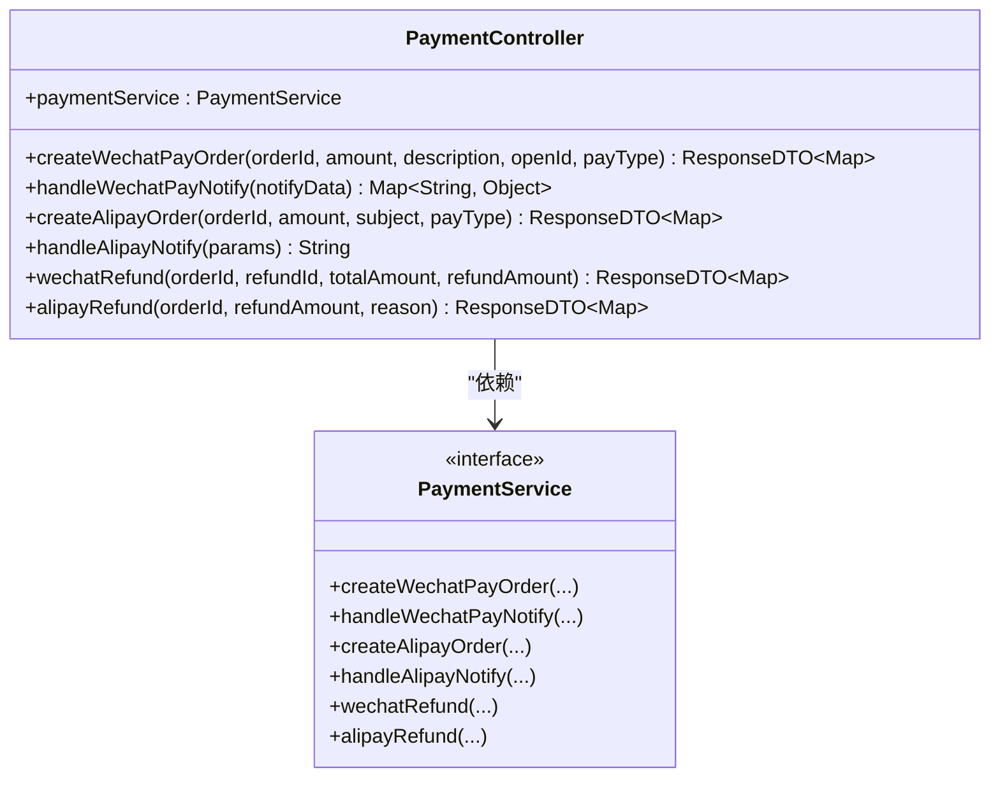
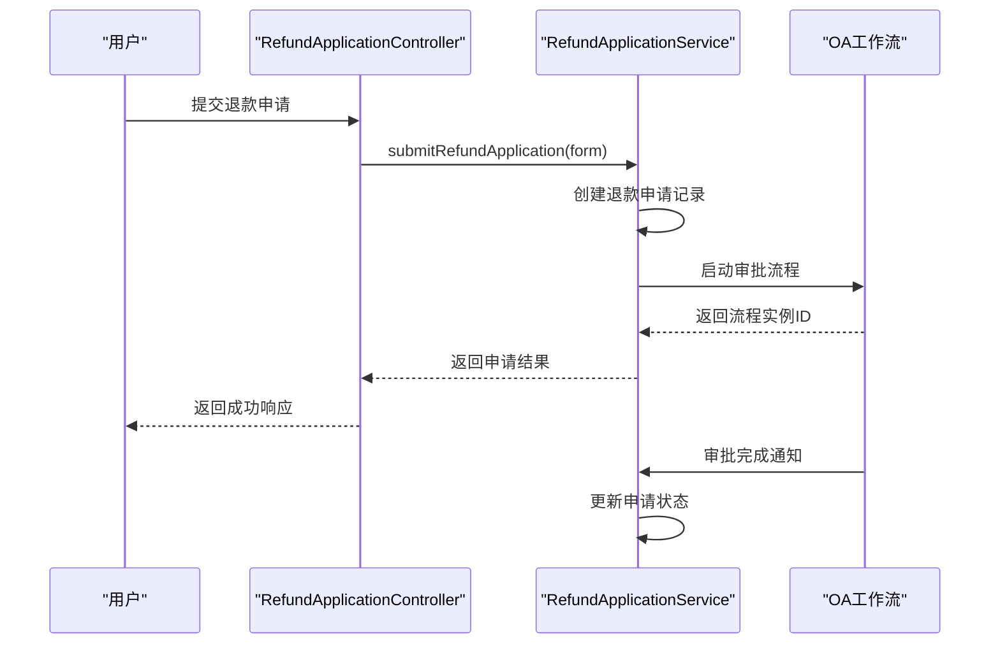
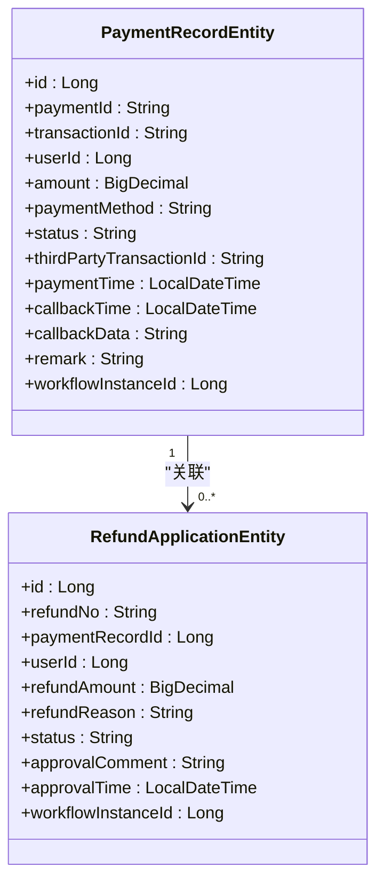
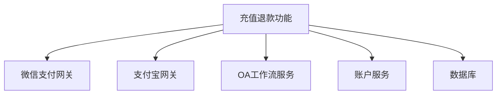

# 充值退款

<cite>
**本文档引用文件**  
- [PaymentController.java](file://microservices\ioedream-consume-service\src\main\java\net\lab1024\sa\consume\controller\PaymentController.java)
- [RefundApplicationController.java](file://microservices\ioedream-consume-service\src\main\java\net\lab1024\sa\consume\controller\RefundApplicationController.java)
- [PaymentRecordEntity.java](file://microservices\ioedream-consume-service\src\main\java\net\lab1024\sa\consume\domain\entity\PaymentRecordEntity.java)
- [RefundApplicationEntity.java](file://microservices\ioedream-consume-service\src\main\java\net\lab1024\sa\consume\domain\entity\RefundApplicationEntity.java)
- [application-payment.yml](file://microservices\ioedream-consume-service\src\main\resources\application-payment.yml)
- [PaymentRecordService.java](file://microservices\ioedream-consume-service\src\main\java\net\lab1024\sa\consume\service\payment\PaymentRecordService.java)
- [RefundApplicationService.java](file://microservices\ioedream-consume-service\src\main\java\net\lab1024\sa\consume\service\refund\RefundApplicationService.java)
</cite>

## 目录
1. [引言](#引言)
2. [项目结构](#项目结构)
3. [核心组件](#核心组件)
4. [架构概述](#架构概述)
5. [详细组件分析](#详细组件分析)
6. [依赖分析](#依赖分析)
7. [性能考虑](#性能考虑)
8. [故障排除指南](#故障排除指南)
9. [结论](#结论)
10. [附录](#附录)

## 引言
本文档全面阐述了智慧园区一卡通管理平台中的充值退款功能，重点介绍在线支付集成、退款申请流程、数据模型设计及配置参数说明。文档详细描述了支付服务与账户服务的协同工作机制，为开发人员、运维人员和业务管理人员提供完整的功能参考。

## 项目结构
充值退款功能主要位于消费服务模块中，涉及控制器、数据访问对象、实体类和服务层等多个组件。该功能通过微服务架构实现，与其他业务模块保持松耦合。



**图示来源**  
- [PaymentController.java](file://microservices\ioedream-consume-service\src\main\java\net\lab1024\sa\consume\controller\PaymentController.java)
- [RefundApplicationController.java](file://microservices\ioedream-consume-service\src\main\java\net\lab1024\sa\consume\controller\RefundApplicationController.java)
- [PaymentRecordEntity.java](file://microservices\ioedream-consume-service\src\main\java\net\lab1024\sa\consume\domain\entity\PaymentRecordEntity.java)
- [RefundApplicationEntity.java](file://microservices\ioedream-consume-service\src\main\java\net\lab1024\sa\consume\domain\entity\RefundApplicationEntity.java)

**本节来源**  
- [PaymentController.java](file://microservices\ioedream-consume-service\src\main\java\net\lab1024\sa\consume\controller\PaymentController.java)
- [RefundApplicationController.java](file://microservices\ioedream-consume-service\src\main\java\net\lab1024\sa\consume\controller\RefundApplicationController.java)

## 核心组件
充值退款功能的核心组件包括支付控制器、退款申请控制器、支付记录实体、退款申请实体以及相应的服务接口。这些组件共同实现了完整的支付和退款业务闭环。

**本节来源**  
- [PaymentController.java](file://microservices\ioedream-consume-service\src\main\java\net\lab1024\sa\consume\controller\PaymentController.java)
- [RefundApplicationController.java](file://microservices\ioedream-consume-service\src\main\java\net\lab1024\sa\consume\controller\RefundApplicationController.java)
- [PaymentRecordEntity.java](file://microservices\ioedream-consume-service\src\main\java\net\lab1024\sa\consume\domain\entity\PaymentRecordEntity.java)
- [RefundApplicationEntity.java](file://microservices\ioedream-consume-service\src\main\java\net\lab1024\sa\consume\domain\entity\RefundApplicationEntity.java)

## 架构概述
充值退款功能采用分层架构设计，包括表现层、服务层和数据访问层。支付网关通过回调通知与系统集成，退款申请通过工作流引擎进行审批管理。



**图示来源**  
- [PaymentController.java](file://microservices\ioedream-consume-service\src\main\java\net\lab1024\sa\consume\controller\PaymentController.java)
- [RefundApplicationController.java](file://microservices\ioedream-consume-service\src\main\java\net\lab1024\sa\consume\controller\RefundApplicationController.java)

## 详细组件分析
### 支付功能分析
支付功能通过PaymentController提供统一的API接口，支持微信支付、支付宝和银行支付等多种方式。控制器负责接收支付请求，调用支付服务处理业务逻辑。

#### 支付控制器类图


**图示来源**  
- [PaymentController.java](file://microservices\ioedream-consume-service\src\main\java\net\lab1024\sa\consume\controller\PaymentController.java)

**本节来源**  
- [PaymentController.java](file://microservices\ioedream-consume-service\src\main\java\net\lab1024\sa\consume\controller\PaymentController.java)

### 退款功能分析
退款功能通过RefundApplicationController管理退款申请的生命周期，从提交申请到审批结果处理，形成完整的业务闭环。

#### 退款申请流程序列图


**图示来源**  
- [RefundApplicationController.java](file://microservices\ioedream-consume-service\src\main\java\net\lab1024\sa\consume\controller\RefundApplicationController.java)
- [RefundApplicationEntity.java](file://microservices\ioedream-consume-service\src\main\java\net\lab1024\sa\consume\domain\entity\RefundApplicationEntity.java)

**本节来源**  
- [RefundApplicationController.java](file://microservices\ioedream-consume-service\src\main\java\net\lab1024\sa\consume\controller\RefundApplicationController.java)
- [RefundApplicationService.java](file://microservices\ioedream-consume-service\src\main\java\net\lab1024\sa\consume\service\refund\RefundApplicationService.java)

### 数据模型设计
支付记录和退款申请的数据模型设计遵循规范化原则，包含必要的业务字段和审计信息。

#### 数据模型类图


**图示来源**  
- [PaymentRecordEntity.java](file://microservices\ioedream-consume-service\src\main\java\net\lab1024\sa\consume\domain\entity\PaymentRecordEntity.java)
- [RefundApplicationEntity.java](file://microservices\ioedream-consume-service\src\main\java\net\lab1024\sa\consume\domain\entity\RefundApplicationEntity.java)

**本节来源**  
- [PaymentRecordEntity.java](file://microservices\ioedream-consume-service\src\main\java\net\lab1024\sa\consume\domain\entity\PaymentRecordEntity.java)
- [RefundApplicationEntity.java](file://microservices\ioedream-consume-service\src\main\java\net\lab1024\sa\consume\domain\entity\RefundApplicationEntity.java)

## 依赖分析
充值退款功能依赖于多个外部系统和内部服务，包括支付网关、OA工作流引擎和账户服务。



**图示来源**  
- [PaymentController.java](file://microservices\ioedream-consume-service\src\main\java\net\lab1024\sa\consume\controller\PaymentController.java)
- [RefundApplicationController.java](file://microservices\ioedream-consume-service\src\main\java\net\lab1024\sa\consume\controller\RefundApplicationController.java)

**本节来源**  
- [PaymentController.java](file://microservices\ioedream-consume-service\src\main\java\net\lab1024\sa\consume\controller\PaymentController.java)
- [RefundApplicationController.java](file://microservices\ioedream-consume-service\src\main\java\net\lab1024\sa\consume\controller\RefundApplicationController.java)

## 性能考虑
在高并发场景下，支付回调处理需要保证幂等性，避免重复处理。数据库表应建立适当的索引以提高查询效率，特别是支付订单号和用户ID字段。

## 故障排除指南
常见问题包括支付回调验证失败、退款申请状态不同步等。应检查支付网关配置是否正确，确保回调URL可访问，并验证签名算法实现。

**本节来源**  
- [PaymentController.java](file://microservices\ioedream-consume-service\src\main\java\net\lab1024\sa\consume\controller\PaymentController.java)
- [RefundApplicationController.java](file://microservices\ioedream-consume-service\src\main\java\net\lab1024\sa\consume\controller\RefundApplicationController.java)

## 结论
充值退款功能通过清晰的分层架构和规范的代码实现，提供了稳定可靠的支付和退款服务。系统设计考虑了安全性、可维护性和扩展性，能够满足智慧园区一卡通管理平台的业务需求。

## 附录
### application-payment.yml配置说明
```yaml
# 支付服务配置文件
wechat:
  pay:
    enabled: ${WECHAT_PAY_ENABLED:false}
    app-id: ${WECHAT_APP_ID:}
    mch-id: ${WECHAT_MCH_ID:}
    api-key: ${WECHAT_API_KEY:}
    cert-path: ${WECHAT_CERT_PATH:/opt/cert/apiclient_cert.p12}
    notify-url: ${WECHAT_NOTIFY_URL:https://api.ioedream.com/api/v1/consume/payment/wechat/notify}
    cert-serial-no: ${WECHAT_CERT_SERIAL_NO:}
    private-key-path: ${WECHAT_PRIVATE_KEY_PATH:/opt/cert/apiclient_key.pem}

alipay:
  enabled: ${ALIPAY_ENABLED:false}
  app-id: ${ALIPAY_APP_ID:}
  private-key: ${ALIPAY_PRIVATE_KEY:}
  public-key: ${ALIPAY_PUBLIC_KEY:}
  gateway-url: ${ALIPAY_GATEWAY_URL:https://openapi.alipay.com/gateway.do}
  notify-url: ${ALIPAY_NOTIFY_URL:https://api.ioedream.com/api/v1/consume/payment/alipay/notify}
  sign-type: RSA2
  charset: UTF-8
  format: json

payment:
  order-timeout: 30
  refund-timeout: 15
  min-amount: 0.01
  max-amount: 10000.00
  allow-partial-refund: true
  auto-close-timeout: 30
```

**本节来源**  
- [application-payment.yml](file://microservices\ioedream-consume-service\src\main\resources\application-payment.yml)