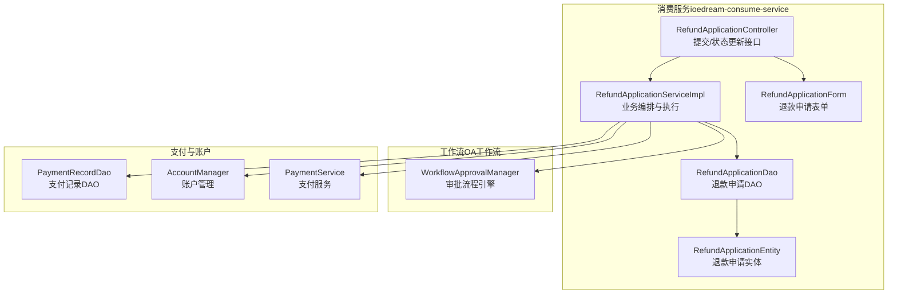
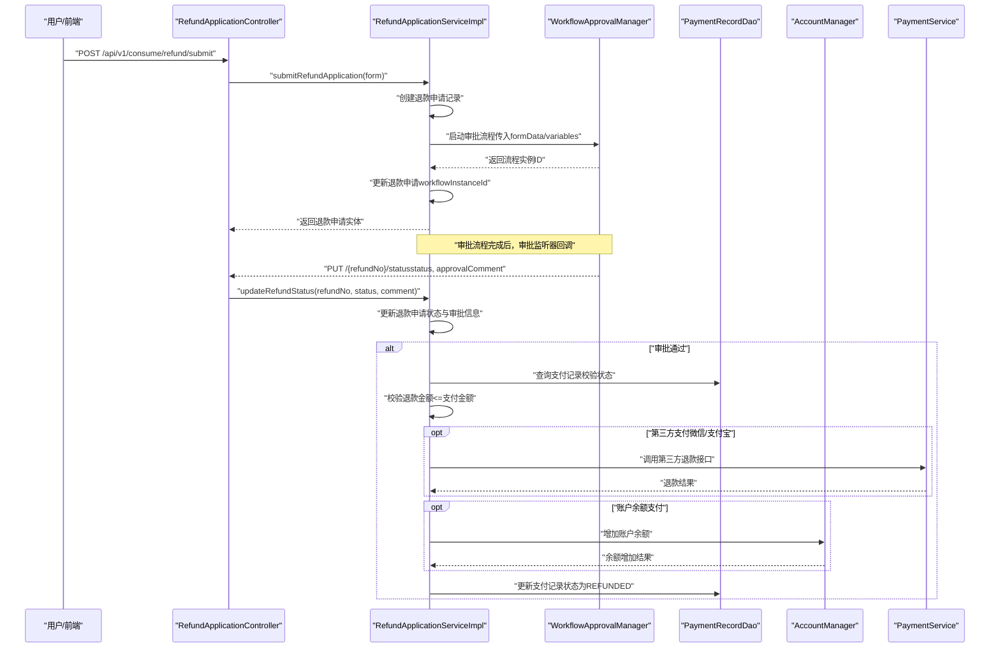
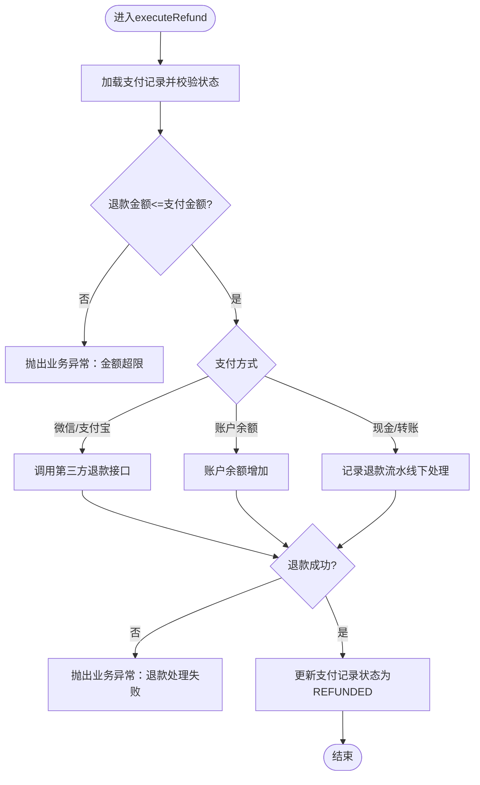
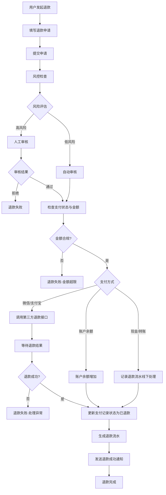
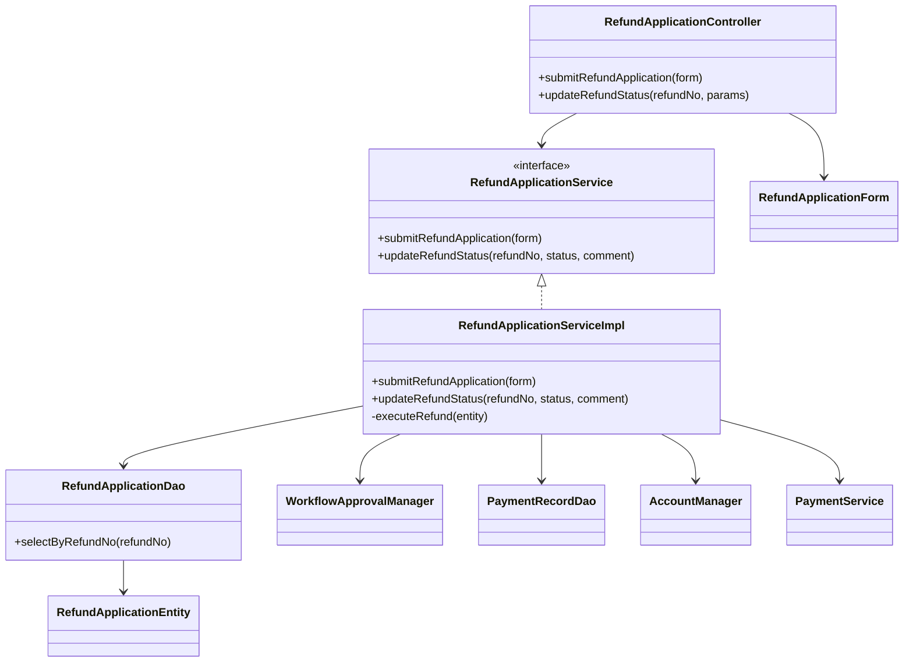

# 退款管理

<cite>
**本文引用的文件**
- [RefundApplicationController.java](file://microservices/ioedream-consume-service/src/main/java/net/lab1024/sa/consume/controller/RefundApplicationController.java)
- [RefundApplicationServiceImpl.java](file://microservices/ioedream-consume-service/src/main/java/net/lab1024/sa/consume/service/impl/refund/RefundApplicationServiceImpl.java)
- [RefundApplicationService.java](file://microservices/ioedream-consume-service/src/main/java/net/lab1024/sa/consume/service/refund/RefundApplicationService.java)
- [RefundApplicationEntity.java](file://microservices/ioedream-consume-service/src/main/java/net/lab1024/sa/consume/domain/entity/RefundApplicationEntity.java)
- [RefundApplicationForm.java](file://microservices/ioedream-consume-service/src/main/java/net/lab1024/sa/consume/domain/form/RefundApplicationForm.java)
- [RefundApplicationDao.java](file://microservices/ioedream-consume-service/src/main/java/net/lab1024/sa/consume/dao/RefundApplicationDao.java)
- [RefundController.java（重构备份）](file://restful_refactor_backup_20251202_014224/microservices_ioedream-consume-service_src_main_java_net_lab1024_sa_consume_controller_RefundController.java)
- [08-充值退款流程重构设计.md](file://documentation/03-业务模块/各业务模块文档/消费/08-充值退款流程重构设计.md)
- [smart-workflow.md](file://documentation/technical/smart-workflow.md)
</cite>

## 目录
1. [简介](#简介)
2. [项目结构](#项目结构)
3. [核心组件](#核心组件)
4. [架构总览](#架构总览)
5. [详细组件分析](#详细组件分析)
6. [依赖关系分析](#依赖关系分析)
7. [性能考量](#性能考量)
8. [故障排查指南](#故障排查指南)
9. [结论](#结论)
10. [附录](#附录)

## 简介
本文件面向“退款管理”功能，系统性阐述从用户提交退款申请到财务人员审核处理的完整生命周期，重点解析以下内容：
- RefundApplicationController 中退款相关接口的设计与职责边界
- RefundApplicationServiceImpl 中退款业务逻辑的实现细节，包括审批工作流、退款金额校验、退款状态管理
- 退款申请的数据模型设计，涵盖申请人信息、退款金额、退款原因、审核状态等字段的定义与约束
- 退款流程中的异常处理机制，如退款失败重试、退款超时处理等
- 结合实际业务场景说明退款与账户余额变动的协同机制

## 项目结构
退款相关能力主要位于消费服务模块，采用典型的四层架构：
- 控制层：RefundApplicationController（提交退款申请、状态更新）
- 服务层：RefundApplicationService 及其实现 RefundApplicationServiceImpl（业务编排、工作流集成、退款执行）
- 数据访问层：RefundApplicationDao（退款申请持久化）
- 领域模型：RefundApplicationEntity、RefundApplicationForm（实体与表单）

图表来源
- [RefundApplicationController.java](file://microservices/ioedream-consume-service/src/main/java/net/lab1024/sa/consume/controller/RefundApplicationController.java#L1-L81)
- [RefundApplicationServiceImpl.java](file://microservices/ioedream-consume-service/src/main/java/net/lab1024/sa/consume/service/impl/refund/RefundApplicationServiceImpl.java#L1-L402)
- [RefundApplicationDao.java](file://microservices/ioedream-consume-service/src/main/java/net/lab1024/sa/consume/dao/RefundApplicationDao.java#L1-L34)
- [RefundApplicationEntity.java](file://microservices/ioedream-consume-service/src/main/java/net/lab1024/sa/consume/domain/entity/RefundApplicationEntity.java#L1-L98)
- [RefundApplicationForm.java](file://microservices/ioedream-consume-service/src/main/java/net/lab1024/sa/consume/domain/form/RefundApplicationForm.java#L1-L53)
- [smart-workflow.md](file://documentation/technical/smart-workflow.md#L941-L1279)

章节来源
- [RefundApplicationController.java](file://microservices/ioedream-consume-service/src/main/java/net/lab1024/sa/consume/controller/RefundApplicationController.java#L1-L81)
- [RefundApplicationServiceImpl.java](file://microservices/ioedream-consume-service/src/main/java/net/lab1024/sa/consume/service/impl/refund/RefundApplicationServiceImpl.java#L1-L402)
- [RefundApplicationDao.java](file://microservices/ioedream-consume-service/src/main/java/net/lab1024/sa/consume/dao/RefundApplicationDao.java#L1-L34)
- [RefundApplicationEntity.java](file://microservices/ioedream-consume-service/src/main/java/net/lab1024/sa/consume/domain/entity/RefundApplicationEntity.java#L1-L98)
- [RefundApplicationForm.java](file://microservices/ioedream-consume-service/src/main/java/net/lab1024/sa/consume/domain/form/RefundApplicationForm.java#L1-L53)

## 核心组件
- 控制器：RefundApplicationController
  - 提交退款申请：接收 RefundApplicationForm，调用服务层提交并启动审批流程
  - 更新退款状态：由审批结果监听器调用，更新审批状态、审批意见与审批时间
- 服务实现：RefundApplicationServiceImpl
  - 提交流款申请：创建退款申请记录、构建表单数据与流程变量、启动工作流、回写流程实例ID
  - 更新退款状态：根据审批状态决定是否执行退款；审批通过则执行退款
  - 执行退款：校验支付记录状态与金额、按支付方式选择退款路径（第三方/账户余额/线下），更新支付记录状态并记录流水
- DAO：RefundApplicationDao
  - 提供按退款单号查询退款申请的能力
- 实体与表单：RefundApplicationEntity、RefundApplicationForm
  - 实体：包含退款单号、支付记录ID、用户ID、退款金额、退款原因、状态、审批意见、审批时间、工作流实例ID等
  - 表单：对提交参数进行校验（非空、金额范围、原因长度等）

章节来源
- [RefundApplicationController.java](file://microservices/ioedream-consume-service/src/main/java/net/lab1024/sa/consume/controller/RefundApplicationController.java#L41-L81)
- [RefundApplicationServiceImpl.java](file://microservices/ioedream-consume-service/src/main/java/net/lab1024/sa/consume/service/impl/refund/RefundApplicationServiceImpl.java#L62-L222)
- [RefundApplicationDao.java](file://microservices/ioedream-consume-service/src/main/java/net/lab1024/sa/consume/dao/RefundApplicationDao.java#L22-L34)
- [RefundApplicationEntity.java](file://microservices/ioedream-consume-service/src/main/java/net/lab1024/sa/consume/domain/entity/RefundApplicationEntity.java#L30-L98)
- [RefundApplicationForm.java](file://microservices/ioedream-consume-service/src/main/java/net/lab1024/sa/consume/domain/form/RefundApplicationForm.java#L23-L53)

## 架构总览
退款生命周期从“提交申请”开始，经“工作流审批”，再到“执行退款”。整体流程如下：

图表来源
- [RefundApplicationController.java](file://microservices/ioedream-consume-service/src/main/java/net/lab1024/sa/consume/controller/RefundApplicationController.java#L51-L78)
- [RefundApplicationServiceImpl.java](file://microservices/ioedream-consume-service/src/main/java/net/lab1024/sa/consume/service/impl/refund/RefundApplicationServiceImpl.java#L62-L222)
- [smart-workflow.md](file://documentation/technical/smart-workflow.md#L941-L1279)

## 详细组件分析

### 控制器：RefundApplicationController
- 提交退款申请
  - 接口路径：POST /api/v1/consume/refund/submit
  - 参数：RefundApplicationForm（含支付记录ID、用户ID、退款金额、退款原因）
  - 行为：调用服务层提交申请并启动审批流程，返回退款申请实体
- 更新退款状态
  - 接口路径：PUT /api/v1/consume/refund/{refundNo}/status
  - 参数：请求体Map（包含status、approvalComment）
  - 行为：由审批监听器调用，更新退款申请状态与审批信息

章节来源
- [RefundApplicationController.java](file://microservices/ioedream-consume-service/src/main/java/net/lab1024/sa/consume/controller/RefundApplicationController.java#L51-L78)

### 服务实现：RefundApplicationServiceImpl
- 提交流款申请
  - 步骤：
    1) 创建退款申请记录（生成退款单号、填充基础字段、初始状态为“待审批”）
    2) 构建表单数据（包含退款单号、支付记录ID、用户ID、金额、原因、申请时间）
    3) 构建流程变量（如按金额阈值驱动审批分支）
    4) 启动审批流程（使用工作流引擎，传入业务类型、表单数据、流程变量）
    5) 回写流程实例ID并返回实体
- 更新退款状态
  - 步骤：
    1) 根据退款单号查询申请记录
    2) 更新状态、审批意见、审批时间
    3) 若审批通过，执行退款逻辑
- 执行退款
  - 步骤：
    1) 查询支付记录并校验状态（仅“成功”可退款）
    2) 校验退款金额不超过支付金额
    3) 根据支付方式分流：
       - 第三方支付（微信/支付宝）：调用对应退款接口
       - 账户余额支付：调用账户余额增加接口
       - 现金/转账：记录退款流水，线下处理
    4) 成功后更新支付记录状态为“已退款”，记录备注
    5) 异常处理：捕获业务异常与通用异常，抛出统一业务异常

图表来源
- [RefundApplicationServiceImpl.java](file://microservices/ioedream-consume-service/src/main/java/net/lab1024/sa/consume/service/impl/refund/RefundApplicationServiceImpl.java#L142-L222)

章节来源
- [RefundApplicationServiceImpl.java](file://microservices/ioedream-consume-service/src/main/java/net/lab1024/sa/consume/service/impl/refund/RefundApplicationServiceImpl.java#L62-L222)

### 数据模型：RefundApplicationEntity 与 RefundApplicationForm
- RefundApplicationEntity（退款申请实体）
  - 字段要点：退款单号、支付记录ID、用户ID、退款金额、退款原因、状态、审批意见、审批时间、工作流实例ID
  - 状态枚举：待审批、已通过、已驳回、已取消
- RefundApplicationForm（退款申请表单）
  - 参数校验：支付记录ID与用户ID必填；退款金额必填且大于0；退款原因必填且长度限制
  - 用途：控制器接收并校验，服务层据此创建申请记录并启动审批

章节来源
- [RefundApplicationEntity.java](file://microservices/ioedream-consume-service/src/main/java/net/lab1024/sa/consume/domain/entity/RefundApplicationEntity.java#L30-L98)
- [RefundApplicationForm.java](file://microservices/ioedream-consume-service/src/main/java/net/lab1024/sa/consume/domain/form/RefundApplicationForm.java#L23-L53)

### 工作流与审批
- 工作流集成
  - 服务层通过 WorkflowApprovalManager 启动审批流程，传入业务类型、表单数据、流程变量
  - 审批完成后，审批监听器回调控制器的“更新状态”接口，服务层据此执行后续退款动作
- 工作流实现参考
  - 工作流引擎的启动、处理、撤回、转办等流程可参考智能工作流文档

章节来源
- [RefundApplicationServiceImpl.java](file://microservices/ioedream-consume-service/src/main/java/net/lab1024/sa/consume/service/impl/refund/RefundApplicationServiceImpl.java#L91-L116)
- [RefundApplicationController.java](file://microservices/ioedream-consume-service/src/main/java/net/lab1024/sa/consume/controller/RefundApplicationController.java#L68-L78)
- [smart-workflow.md](file://documentation/technical/smart-workflow.md#L941-L1279)

### 退款与账户余额协同
- 账户余额退款路径
  - 当支付方式为账户余额或余额时，服务层调用账户管理器增加余额
  - 成功后继续更新支付记录状态为“已退款”
- 与支付服务的协作
  - 对于第三方支付（微信/支付宝），服务层调用支付服务执行退款，并依据返回结果判定成功与否
- 退款流水与状态
  - 成功退款后，支付记录状态更新为“已退款”，并记录备注（包含退款申请号与原因）

章节来源
- [RefundApplicationServiceImpl.java](file://microservices/ioedream-consume-service/src/main/java/net/lab1024/sa/consume/service/impl/refund/RefundApplicationServiceImpl.java#L184-L214)

### 退款流程（概念图）
以下为业务层面的退款流程概览，展示从用户发起到完成的关键节点与分支决策：

图表来源
- [08-充值退款流程重构设计.md](file://documentation/03-业务模块/各业务模块文档/消费/08-充值退款流程重构设计.md#L67-L111)

## 依赖关系分析
- 控制器依赖服务接口与表单模型
- 服务实现依赖 DAO、工作流引擎、支付记录 DAO、账户管理器、支付服务
- DAO 依赖实体模型
- 工作流引擎提供流程启动与状态推进能力

图表来源
- [RefundApplicationController.java](file://microservices/ioedream-consume-service/src/main/java/net/lab1024/sa/consume/controller/RefundApplicationController.java#L41-L81)
- [RefundApplicationServiceImpl.java](file://microservices/ioedream-consume-service/src/main/java/net/lab1024/sa/consume/service/impl/refund/RefundApplicationServiceImpl.java#L1-L402)
- [RefundApplicationDao.java](file://microservices/ioedream-consume-service/src/main/java/net/lab1024/sa/consume/dao/RefundApplicationDao.java#L22-L34)
- [RefundApplicationEntity.java](file://microservices/ioedream-consume-service/src/main/java/net/lab1024/sa/consume/domain/entity/RefundApplicationEntity.java#L30-L98)
- [RefundApplicationForm.java](file://microservices/ioedream-consume-service/src/main/java/net/lab1024/sa/consume/domain/form/RefundApplicationForm.java#L23-L53)

## 性能考量
- 事务管理
  - 服务层方法均声明事务，写操作具备回滚策略，保证退款过程的一致性
- 并发与幂等
  - 建议在工作流与支付回调处增加幂等校验（如基于退款单号或业务Key），避免重复处理
- 日志与可观测性
  - 关键节点均有日志输出，便于定位问题；建议配合链路追踪与指标埋点
- 第三方接口调用
  - 对第三方退款接口应设置合理的超时与重试策略，避免阻塞线程

[本节为通用建议，无需列出具体文件来源]

## 故障排查指南
- 启动审批流程失败
  - 现象：提交申请后流程未启动或返回失败
  - 排查：检查工作流引擎可用性、流程定义是否存在、表单数据与流程变量是否完整
  - 参考实现位置：[RefundApplicationServiceImpl.java](file://microservices/ioedream-consume-service/src/main/java/net/lab1024/sa/consume/service/impl/refund/RefundApplicationServiceImpl.java#L91-L116)
- 支付记录不存在或状态不允许退款
  - 现象：执行退款时报错“支付记录不存在”或“状态不允许退款”
  - 排查：确认支付记录ID正确、支付状态为“成功”，退款金额未超过支付金额
  - 参考实现位置：[RefundApplicationServiceImpl.java](file://microservices/ioedream-consume-service/src/main/java/net/lab1024/sa/consume/service/impl/refund/RefundApplicationServiceImpl.java#L161-L182)
- 第三方退款失败
  - 现象：微信/支付宝退款返回失败
  - 排查：检查支付参数（金额单位转换、交易号）、回调与重试机制
  - 参考实现位置：[RefundApplicationServiceImpl.java](file://microservices/ioedream-consume-service/src/main/java/net/lab1024/sa/consume/service/impl/refund/RefundApplicationServiceImpl.java#L231-L353)
- 账户余额退款失败
  - 现象：账户余额增加失败
  - 排查：确认账户存在、余额增加接口返回成功
  - 参考实现位置：[RefundApplicationServiceImpl.java](file://microservices/ioedream-consume-service/src/main/java/net/lab1024/sa/consume/service/impl/refund/RefundApplicationServiceImpl.java#L355-L390)
- 状态更新与审批联动
  - 现象：审批通过后未执行退款
  - 排查：确认审批监听器回调已触发、服务层 updateRefundStatus 已被调用、状态为“已通过”
  - 参考实现位置：[RefundApplicationController.java](file://microservices/ioedream-consume-service/src/main/java/net/lab1024/sa/consume/controller/RefundApplicationController.java#L68-L78)、[RefundApplicationServiceImpl.java](file://microservices/ioedream-consume-service/src/main/java/net/lab1024/sa/consume/service/impl/refund/RefundApplicationServiceImpl.java#L119-L140)

章节来源
- [RefundApplicationServiceImpl.java](file://microservices/ioedream-consume-service/src/main/java/net/lab1024/sa/consume/service/impl/refund/RefundApplicationServiceImpl.java#L142-L222)
- [RefundApplicationController.java](file://microservices/ioedream-consume-service/src/main/java/net/lab1024/sa/consume/controller/RefundApplicationController.java#L68-L78)

## 结论
退款管理模块以“提交申请—工作流审批—执行退款”为主线，通过服务层统一编排、DAO 持久化与工作流引擎联动，实现了对不同支付方式的差异化处理。实体与表单模型明确了关键字段与约束，配合严格的参数校验与异常处理，保障了流程的稳定性与可追溯性。建议在生产环境中进一步完善第三方退款的超时与重试策略、增加幂等校验与可观测性指标，以提升整体可靠性与用户体验。

[本节为总结性内容，无需列出具体文件来源]

## 附录

### 退款相关接口一览（控制器）
- 提交退款申请
  - 方法：POST
  - 路径：/api/v1/consume/refund/submit
  - 权限：consume:refund:add
  - 参数：RefundApplicationForm
  - 返回：RefundApplicationEntity
- 更新退款状态
  - 方法：PUT
  - 路径：/api/v1/consume/refund/{refundNo}/status
  - 权限：consume:refund:review
  - 参数：Map（status、approvalComment）
  - 返回：Void

章节来源
- [RefundApplicationController.java](file://microservices/ioedream-consume-service/src/main/java/net/lab1024/sa/consume/controller/RefundApplicationController.java#L51-L78)

### 退款流程（概念图）
- 业务流程参考：[08-充值退款流程重构设计.md](file://documentation/03-业务模块/各业务模块文档/消费/08-充值退款流程重构设计.md#L67-L111)