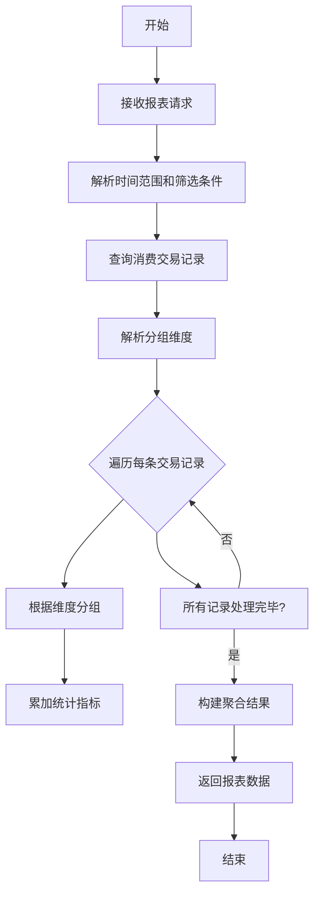
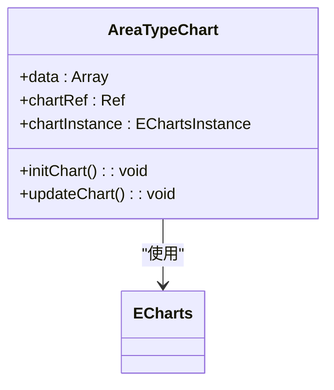

# 报表统计

<cite>
**本文档引用文件**   
- [ReportController.java](file://microservices/ioedream-consume-service/src/main/java/net/lab1024/sa/consume/controller/ReportController.java)
- [ConsumeReportManagerImpl.java](file://microservices/ioedream-consume-service/src/main/java/net/lab1024/sa/consume/report/manager/impl/ConsumeReportManagerImpl.java)
- [ReportParams.java](file://microservices/ioedream-consume-service/src/main/java/net/lab1024/sa/consume/report/domain/form/ReportParams.java)
- [ConsumeReportTemplateEntity.java](file://microservices/ioedream-consume-service/src/main/java/net/lab1024/sa/consume/report/domain/entity/ConsumeReportTemplateEntity.java)
- [AreaTypeChart.vue](file://smart-admin-web-javascript/src/views/business/consume/report/components/AreaTypeChart.vue)
- [13-报表统计模块重构设计.md](file://documentation/03-业务模块/消费/13-报表统计模块重构设计.md)
</cite>

## 目录
1. [引言](#引言)
2. [消费报表分类与数据聚合逻辑](#消费报表分类与数据聚合逻辑)
3. [ReportController统计API详解](#reportcontroller统计api详解)
4. [前端图表组件数据绑定与可视化](#前端图表组件数据绑定与可视化)
5. [报表数据缓存策略与性能优化](#报表数据缓存策略与性能优化)
6. [自定义报表开发指南](#自定义报表开发指南)
7. [结论](#结论)

## 引言
本技术文档旨在全面介绍消费管理系统中的报表统计模块。文档详细阐述了消费报表的分类体系、数据聚合逻辑、核心API接口、前端可视化组件、性能优化策略以及自定义报表的开发方法。通过本文档，开发人员和系统管理员可以深入了解报表模块的架构与实现，从而更好地进行系统维护、功能扩展和性能调优。

## 消费报表分类与数据聚合逻辑

### 消费报表分类体系
消费报表系统支持多维度的分类统计，主要分为以下几类：

1.  **按区域分类**：根据消费发生的物理区域（如食堂、餐厅、超市）进行统计，分析不同区域的经营状况和消费特征。
2.  **按餐别分类**：根据消费的餐别（如早餐、午餐、晚餐）进行统计，用于分析不同时段的消费趋势和就餐率。
3.  **按时间段分类**：支持按实时、小时、日、周、月、季、年等不同时间粒度进行统计，满足从即时监控到长期趋势分析的需求。
4.  **按经营模式分类**：根据`manage_mode`字段区分不同的经营模式（如餐别制、超市制），用于对比不同模式的经营效益。
5.  **按区域类型分类**：根据`area_sub_type`字段分析不同场所（如办公区、生活区、生产区）的消费特征。

这些分类维度可以相互组合，形成多维交叉分析报表，为业务决策提供更全面的数据支持。

### 数据聚合逻辑
报表数据的聚合逻辑在`ConsumeReportManagerImpl`类中实现，其核心流程如下：

1.  **数据查询**：根据用户请求的时间范围和筛选条件（如区域ID、用户ID、消费模式），从`consume_transaction`表中查询原始消费交易记录。
2.  **维度解析**：解析请求中的`groupBy`参数，确定需要按哪些维度进行分组聚合（如"area", "meal", "consume_mode"）。
3.  **分组聚合**：遍历查询到的交易记录，根据指定的维度进行分组，并计算各组的统计数据，包括：
    *   `count`：消费笔数
    *   `totalMoney`：消费总金额
    *   `personCount`：消费人数
4.  **结果构建**：将聚合后的数据整理成结构化的结果，包含基础统计（总笔数、总金额、人均消费）和按维度聚合的详细数据。



**Diagram sources**
- [ConsumeReportManagerImpl.java](file://microservices/ioedream-consume-service/src/main/java/net/lab1024/sa/consume/report/manager/impl/ConsumeReportManagerImpl.java#L436-L655)

**Section sources**
- [ConsumeReportManagerImpl.java](file://microservices/ioedream-consume-service/src/main/java/net/lab1024/sa/consume/report/manager/impl/ConsumeReportManagerImpl.java#L436-L655)
- [13-报表统计模块重构设计.md](file://documentation/03-业务模块/消费/13-报表统计模块重构设计.md#L23-L35)

## ReportController统计API详解

`ReportController`是报表模块的核心API入口，提供了生成、导出和获取统计数据的功能。

### 核心API列表
| API端点 | HTTP方法 | 功能描述 |
| :--- | :--- | :--- |
| `/api/v1/consume/report/generate` | POST | 根据模板ID和参数生成消费报表数据 |
| `/api/v1/consume/report/export` | POST | 根据模板ID和参数导出报表文件 |
| `/api/v1/consume/report/statistics` | POST | 获取指定时间范围和维度的报表统计数据 |

### 请求参数与分页处理
API通过`ReportParams`对象接收复杂的请求参数：

```java
public class ReportParams {
    private LocalDateTime startTime;        // 开始时间
    private LocalDateTime endTime;          // 结束时间
    private Map<String, Object> dimensions; // 统计维度
    private Map<String, Object> filters;    // 过滤条件
    private List<String> groupBy;           // 分组维度
    private String orderBy;                 // 排序字段
    private String orderDirection;          // 排序方向 (ASC/DESC)
    private Integer pageNum;                // 分页页码
    private Integer pageSize;               // 每页大小
}
```

分页处理通过`pageNum`和`pageSize`参数实现。当请求包含分页参数时，后端会在查询数据库或处理数据时应用分页逻辑，确保返回的数据量可控，避免一次性加载过多数据导致性能问题。

### 响应数据结构
API的响应统一使用`ResponseDTO<T>`包装，其结构如下：

```json
{
  "code": 200,
  "data": { /* 具体的业务数据 */ },
  "msg": "success"
}
```

对于`/statistics`接口，`data`字段的结构示例如下：

```json
{
  "totalCount": 1500,
  "totalMoney": 75000,
  "personCount": 800,
  "avgAmount": 50,
  "dimensions": {
    "byArea": {
      "list": [
        { "areaId": "AREA001", "areaName": "第一食堂", "count": 800, "totalMoney": 40000 },
        { "areaId": "AREA002", "areaName": "第二食堂", "count": 700, "totalMoney": 35000 }
      ],
      "total": 2
    },
    "byMeal": {
      "list": [
        { "mealId": "MEAL001", "mealName": "午餐", "count": 1000, "totalMoney": 50000 },
        { "mealId": "MEAL002", "mealName": "晚餐", "count": 500, "totalMoney": 25000 }
      ],
      "total": 2
    }
  }
}
```

**Section sources**
- [ReportController.java](file://microservices/ioedream-consume-service/src/main/java/net/lab1024/sa/consume/controller/ReportController.java#L52-L215)
- [ReportParams.java](file://microservices/ioedream-consume-service/src/main/java/net/lab1024/sa/consume/report/domain/form/ReportParams.java#L28-L92)

## 前端图表组件数据绑定与可视化

### AreaTypeChart组件
`AreaTypeChart`是一个基于ECharts的柱状图组件，用于展示按区域类型统计的消费数据。

#### 数据绑定机制
该组件通过`props`接收一个`data`数组，每个数组元素包含以下字段：
*   `areaTypeName`：区域类型的名称（如“食堂”、“超市”）
*   `count`：该区域类型的消费笔数

组件内部通过`watch`监听`props.data`的变化，当数据更新时，自动调用`updateChart()`方法重新渲染图表。

#### 可视化配置
图表的配置项（`option`）定义了其视觉表现：
*   **X轴**：显示`areaTypeName`，类型为类别轴。
*   **Y轴**：显示消费笔数，类型为数值轴。
*   **系列（Series）**：使用柱状图（bar），并配置了渐变色填充和悬停效果，提升视觉体验。
*   **提示框（Tooltip）**：鼠标悬停时显示详细数据。



**Diagram sources**
- [AreaTypeChart.vue](file://smart-admin-web-javascript/src/views/business/consume/report/components/AreaTypeChart.vue#L1-L93)

**Section sources**
- [AreaTypeChart.vue](file://smart-admin-web-javascript/src/views/business/consume/report/components/AreaTypeChart.vue#L1-L93)

## 报表数据缓存策略与性能优化

### 缓存策略
为提升报表访问性能，系统采用了多级缓存策略：
1.  **Redis缓存**：对于高频访问的、变化不频繁的统计报表（如昨日日报），系统会将生成的报表数据缓存到Redis中。后续请求直接从Redis读取，避免重复计算。
2.  **本地缓存**：对于一些基础的、静态的配置数据（如报表模板列表），使用`Caffeine`等本地缓存，减少对数据库和Redis的访问。

### 性能优化措施
1.  **预计算**：对于每日、每月的汇总统计报表，系统在夜间低峰期通过定时任务（Scheduled Job）预先计算好，并将结果存入专用的统计表（如`posid_stat_daily`）中。当用户查询时，直接查询这些预计算好的结果，极大提升了查询速度。
2.  **异步生成**：对于数据量巨大、生成耗时较长的复杂报表，系统提供异步生成接口。用户提交请求后，系统立即返回一个任务ID，然后在后台异步生成报表。用户可以通过任务ID轮询或通过消息通知获取生成结果。
3.  **数据库优化**：对消费交易表和统计表建立了合理的索引（如按时间、区域、用户ID的复合索引），并定期进行索引优化，确保查询效率。

```mermaid
graph TB
subgraph "数据源"
A[原始交易表]
B[预计算统计表]
end
subgraph "处理层"
C[定时任务]
D[异步任务]
end
subgraph "缓存层"
E[Redis]
F[本地缓存]
end
subgraph "应用层"
G[ReportController]
end
C --> B : "夜间预计算"
D --> E : "异步生成结果"
G --> E : "优先读取"
E --> |未命中| F : "降级读取"
F --> |未命中| B : "查询预计算表"
B --> |无预计算| A : "查询原始数据"
A --> D : "触发异步生成"
```

**Diagram sources**
- [13-报表统计模块重构设计.md](file://documentation/03-业务模块/消费/13-报表统计模块重构设计.md#L307-L375)
- [ConsumeReportManagerImpl.java](file://microservices/ioedream-consume-service/src/main/java/net/lab1024/sa/consume/report/manager/impl/ConsumeReportManagerImpl.java#L1023-L1072)

**Section sources**
- [13-报表统计模块重构设计.md](file://documentation/03-业务模块/消费/13-报表统计模块重构设计.md#L1-L455)
- [ConsumeReportManagerImpl.java](file://microservices/ioedream-consume-service/src/main/java/net/lab1024/sa/consume/report/manager/impl/ConsumeReportManagerImpl.java#L1023-L1072)

## 自定义报表开发指南

### 添加新的统计维度
要添加一个新的统计维度（例如“按部门统计”），需遵循以下步骤：

1.  **修改数据模型**：确保`consume_transaction`表或相关联的表中包含所需的维度字段（如`department_id`）。
2.  **扩展聚合逻辑**：在`ConsumeReportManagerImpl`类中添加新的聚合方法，例如`aggregateByDepartment()`。
3.  **注册维度**：在`aggregateStatistics()`方法的`switch`语句中，为新的维度（如"DEPARTMENT"）添加分支，调用新创建的聚合方法。
4.  **更新文档**：在`13-报表统计模块重构设计.md`文档中更新统计维度体系，说明新维度的用途和价值。

### 添加新的统计指标
要添加一个新的统计指标（例如“平均消费间隔”），需遵循以下步骤：

1.  **定义指标**：明确新指标的计算逻辑（如：总消费时间 / (消费笔数 - 1)）。
2.  **修改聚合逻辑**：在`aggregateStatistics()`或相关方法中，增加对新指标的计算。这可能需要在遍历交易记录时记录额外的状态信息。
3.  **更新响应结构**：确保`ResponseDTO`的`data`结构能够容纳新的指标字段。
4.  **前端适配**：如果需要在前端图表中展示，需修改或创建相应的ECharts配置。

**Section sources**
- [13-报表统计模块重构设计.md](file://documentation/03-业务模块/消费/13-报表统计模块重构设计.md#L23-L35)
- [ConsumeReportManagerImpl.java](file://microservices/ioedream-consume-service/src/main/java/net/lab1024/sa/consume/report/manager/impl/ConsumeReportManagerImpl.java#L590-L655)

## 结论
本报表统计模块通过清晰的分类体系、高效的聚合逻辑、丰富的API接口和直观的前端可视化，构建了一个强大的数据分析平台。通过预计算、异步生成和多级缓存等性能优化措施，系统能够高效处理海量数据，满足实时和离线分析的需求。模块设计具有良好的扩展性，便于根据业务发展添加新的统计维度和指标，为智慧园区的精细化运营提供了坚实的数据基础。