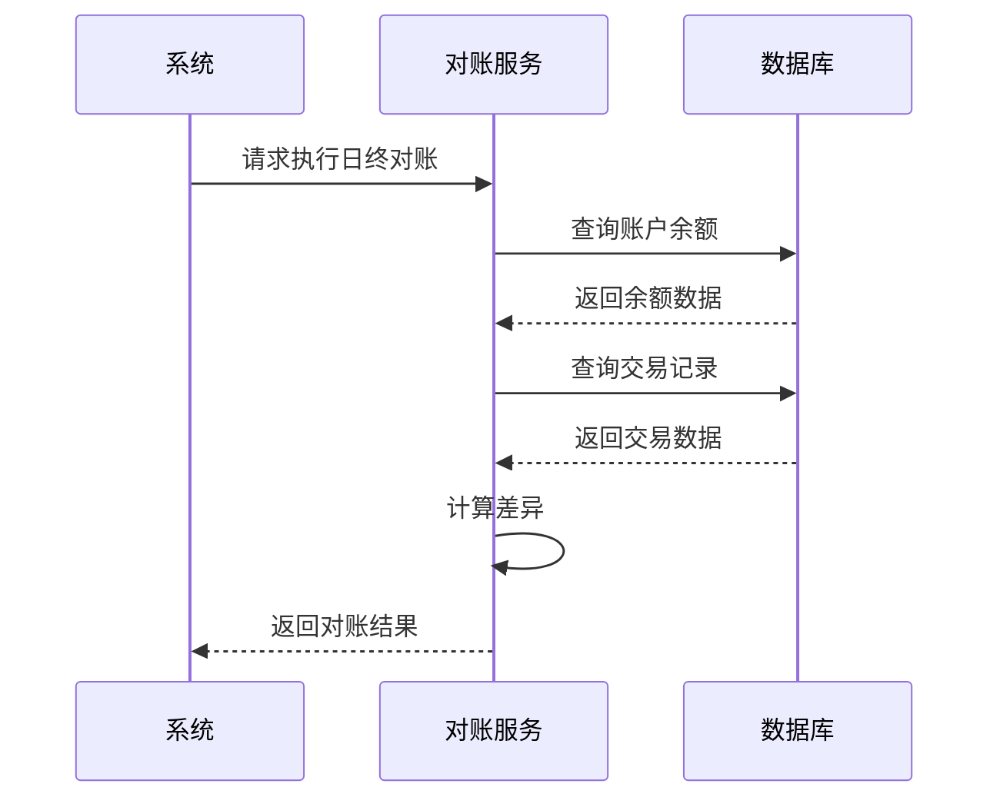

# 数据准确性与性能

<cite>
**本文档引用文件**  
- [consume_index_optimization.sql](file://microservices\ioedream-consume-service\src\main\resources\sql\consume_index_optimization.sql)
- [performance_optimization.sql](file://database\performance_optimization.sql)
- [DatabaseIndexAnalyzer.java](file://microservices\ioedream-consume-service\src\main\java\net\lab1024\sa\consume\util\DatabaseIndexAnalyzer.java)
- [ConsistencyValidationController.java](file://restful_refactor_backup_20251202_014224\microservices_ioedream-consume-service_src_main_java_net_lab1024_sa_consume_controller_ConsistencyValidationController.java)
- [ReconciliationService.java](file://microservices\ioedream-consume-service\src\main\java\net\lab1024\sa\consume\service\consistency\ReconciliationService.java)
- [SagaTransactionController.java](file://restful_refactor_backup_20251202_014224\microservices_ioedream-consume-service_src_main_java_net_lab1024_sa_consume_controller_SagaTransactionController.java)
- [CONSUME_SERVICE_IMPLEMENTATION_FINAL_REPORT.md](file://documentation\technical\CONSUME_SERVICE_IMPLEMENTATION_FINAL_REPORT.md)
</cite>

## 目录
1. [引言](#引言)
2. [消费流水数据一致性保障机制](#消费流水数据一致性保障机制)
3. [数据库索引优化策略](#数据库索引优化策略)
4. [性能监控与调优建议](#性能监控与调优建议)
5. [大数据量下的分表分库与数据归档](#大数据量下的分表分库与数据归档)
6. [索引健康度检测方法](#索引健康度检测方法)
7. [结论](#结论)

## 引言
本文档旨在详细说明消费流水数据的准确性保障机制与性能优化策略。通过分析分布式事务处理、数据校验和对账流程，确保消费流水数据的一致性。同时，深入探讨数据库索引优化、性能监控指标、调优建议以及大数据量下的分表分库和数据归档方案。结合DatabaseIndexAnalyzer工具，提供索引健康度检测方法，全面提升系统的稳定性和性能。

## 消费流水数据一致性保障机制

### 分布式事务处理
在消费系统中，分布式事务处理是确保数据一致性的关键。系统采用Saga模式来管理跨服务的事务，保证每个步骤的原子性。当一个事务涉及多个服务时，Saga模式通过一系列补偿操作来处理失败情况，确保最终一致性。

**Section sources**
- [SagaTransactionController.java](file://restful_refactor_backup_20251202_014224\microservices_ioedream-consume-service_src_main_java_net_lab1024_sa_consume_controller_SagaTransactionController.java)
- [CONSUME_SERVICE_IMPLEMENTATION_FINAL_REPORT.md](file://documentation\technical\CONSUME_SERVICE_IMPLEMENTATION_FINAL_REPORT.md#L139-L190)

### 数据校验
数据校验是防止错误数据进入系统的重要手段。系统在消费流程的各个阶段进行严格的数据校验，包括交易流水号的唯一性、账户是否存在、金额合理性等。这些校验规则确保了每笔交易的合法性和准确性。

**Section sources**
- [ConsistencyValidationController.java](file://restful_refactor_backup_20251202_014224\microservices_ioedream-consume-service_src_main_java_net_lab1024_sa_consume_controller_ConsistencyValidationController.java#L50-L67)
- [CONSUME_SERVICE_IMPLEMENTATION_FINAL_REPORT.md](file://documentation\technical\CONSUME_SERVICE_IMPLEMENTATION_FINAL_REPORT.md#L100-L111)

### 对账流程
对账流程是确保消费流水数据准确性的核心环节。系统通过定期执行日终对账和实时对账，验证账户余额、交易记录和库存的一致性。对账结果会生成详细的报告，并在发现差异时触发相应的补偿机制。



**Diagram sources**
- [ReconciliationService.java](file://microservices\ioedream-consume-service\src\main\java\net\lab1024\sa\consume\service\consistency\ReconciliationService.java#L28-L36)
- [CONSUME_SERVICE_IMPLEMENTATION_FINAL_REPORT.md](file://documentation\technical\CONSUME_SERVICE_IMPLEMENTATION_FINAL_REPORT.md#L72-L78)

## 数据库索引优化策略

### consume_index_optimization.sql中的索引设计原则
`consume_index_optimization.sql` 文件中定义了消费模块的索引优化策略。主要原则包括：

1. **主键索引**：确保每张表都有主键索引，以提升查询性能。
2. **唯一索引**：为交易流水号等唯一字段创建唯一索引，防止重复数据。
3. **组合索引**：根据高频查询条件创建组合索引，如用户ID + 时间范围、账户ID + 时间范围等。
4. **覆盖索引**：对于统计查询，使用覆盖索引避免回表查询，提高查询效率。

```sql
-- 示例：创建组合索引
CREATE INDEX IF NOT EXISTS `idx_consume_record_user_time`
ON `consume_record` (`user_id`, `consume_time`, `deleted`);
```

**Section sources**
- [consume_index_optimization.sql](file://microservices\ioedream-consume-service\src\main\resources\sql\consume_index_optimization.sql#L24-L27)

## 性能监控与调优建议

### 慢查询分析
慢查询是影响系统性能的主要因素之一。通过启用慢查询日志，可以记录执行时间超过阈值的SQL语句。定期分析慢查询日志，识别并优化这些查询，可以显著提升系统性能。

**Section sources**
- [performance_optimization.sql](file://database\performance_optimization.sql#L246-L249)

### 连接池配置
合理的连接池配置可以有效管理数据库连接，避免资源浪费。建议设置合适的最大连接数、最小空闲连接数和连接超时时间，确保系统在高并发场景下仍能稳定运行。

**Section sources**
- [DRUID_CONNECTION_POOL_CONFIGURATION.md](file://documentation\deployment\DRUID_CONNECTION_POOL_CONFIGURATION.md)

## 大数据量下的分表分库与数据归档

### 分表分库策略
随着数据量的增长，单一数据库可能无法满足性能需求。分表分库策略通过将数据分散到多个物理表或数据库中，减轻单个数据库的压力。常见的分表策略包括按时间、按用户ID或按地理位置进行分片。

**Section sources**
- [performance_optimization.sql](file://database\performance_optimization.sql#L184-L191)

### 数据归档方案
为了保持在线数据库的高效运行，需要定期将历史数据归档到离线存储中。数据归档不仅可以释放存储空间，还能减少在线查询的复杂度。归档过程应确保数据的完整性和可追溯性。

**Section sources**
- [performance_optimization.sql](file://database\performance_optimization.sql#L130-L133)

## 索引健康度检测方法

### DatabaseIndexAnalyzer工具说明
`DatabaseIndexAnalyzer` 工具用于检测索引的健康度，提供索引使用情况的详细分析。该工具通过以下步骤进行索引健康度检测：

1. **获取表结构信息**：读取表的字段、主键和索引信息。
2. **分析现有索引**：检查现有索引的使用情况，识别未使用的索引。
3. **生成优化建议**：根据查询模式和索引使用情况，生成索引优化建议。

```java
public IndexAnalysisResult analyzeTableIndex(String tableName) {
    // 获取表结构信息
    IndexAnalysisResult.TableStructureInfo tableInfo = getTableStructure(tableName);
    // 获取现有索引信息
    List<IndexAnalysisResult.IndexInfo> existingIndexes = getTableIndexes(tableName);
    // 生成索引优化建议
    List<IndexAnalysisResult.IndexSuggestion> suggestions = generateIndexSuggestions(tableInfo, existingIndexes);
    return IndexAnalysisResult.builder()
            .tableName(tableName)
            .tableStructure(tableInfo)
            .existingIndexes(existingIndexes)
            .suggestions(suggestions)
            .build();
}
```

**Section sources**
- [DatabaseIndexAnalyzer.java](file://microservices\ioedream-consume-service\src\main\java\net\lab1024\sa\consume\util\DatabaseIndexAnalyzer.java#L56-L92)

## 结论
本文档详细阐述了消费流水数据的准确性保障机制和性能优化策略。通过实施分布式事务处理、数据校验和对账流程，确保了数据的一致性和准确性。同时，通过合理的数据库索引优化、性能监控和调优建议，提升了系统的整体性能。在大数据量场景下，分表分库和数据归档方案进一步保障了系统的可扩展性和稳定性。结合DatabaseIndexAnalyzer工具，实现了索引健康度的持续监控和优化，为系统的长期稳定运行提供了有力支持。