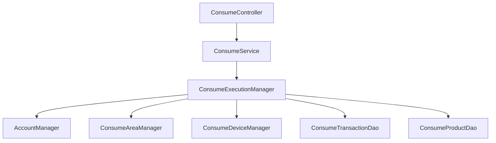
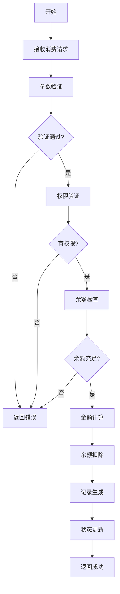
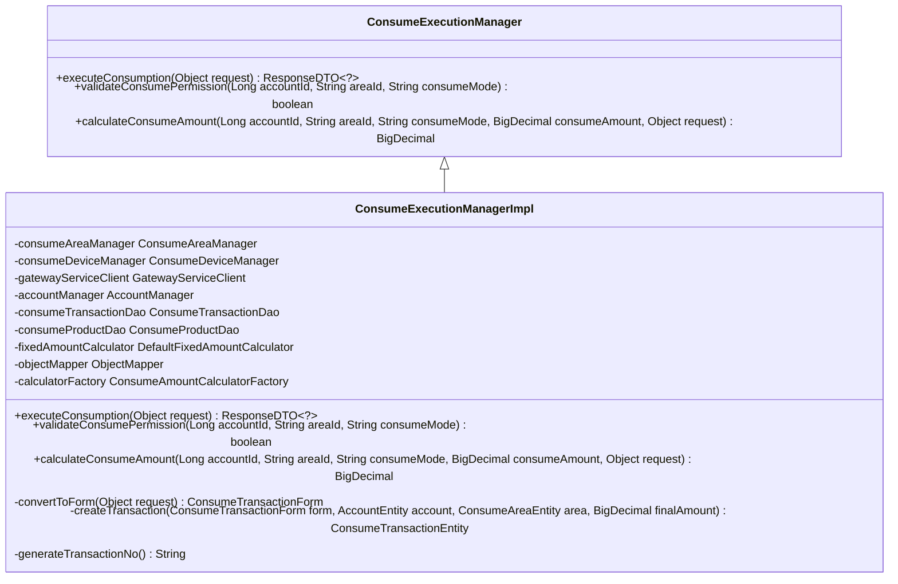
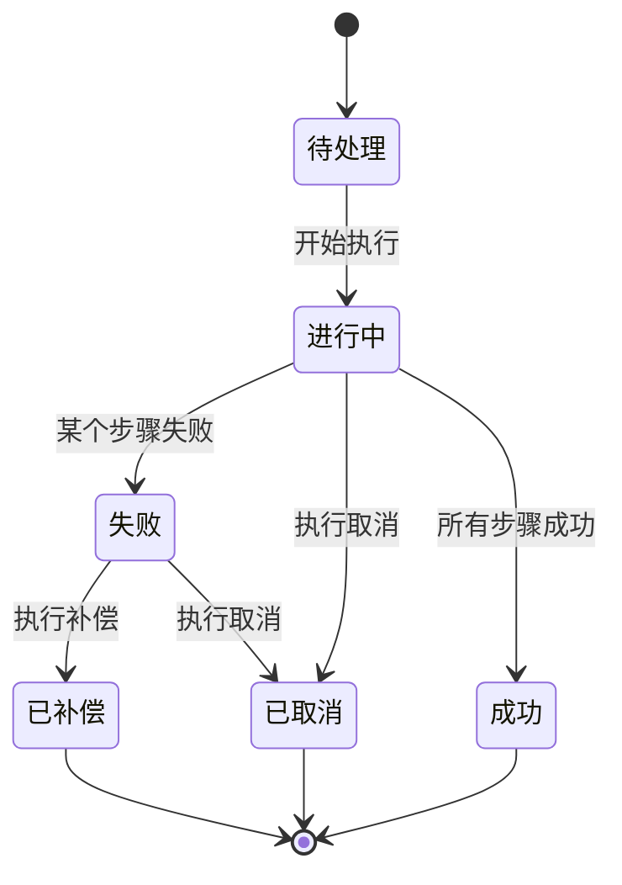
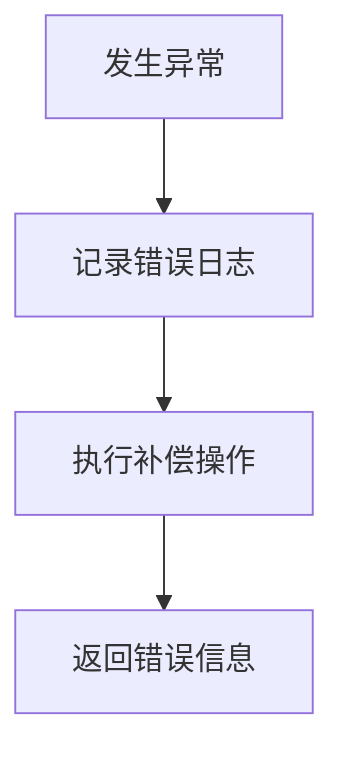
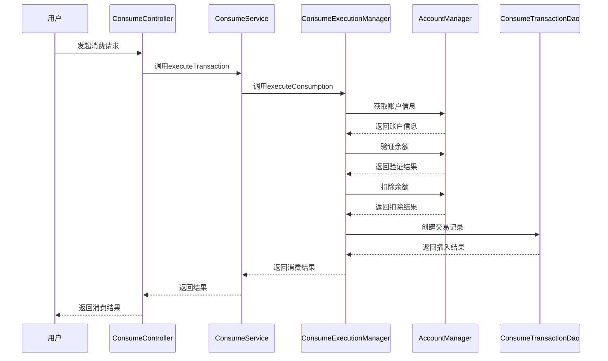
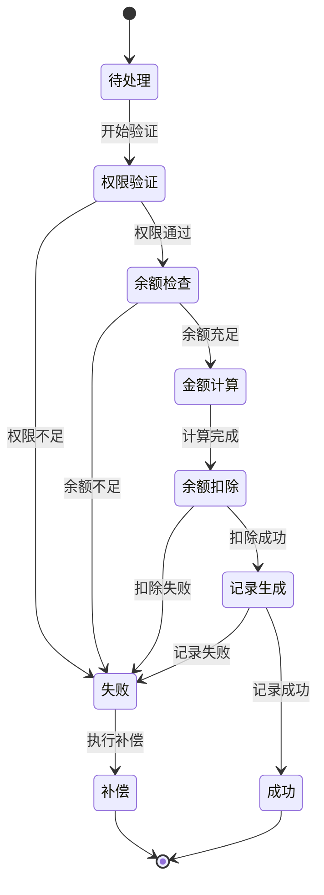
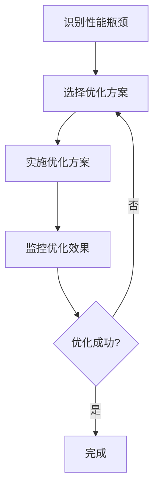

# 处理流程

<cite>
**本文档引用文件**  
- [ConsumeController.java](file://microservices\ioedream-consume-service\src\main\java\net\lab1024\sa\consume\controller\ConsumeController.java)
- [ConsumeExecutionManager.java](file://microservices\ioedream-consume-service\src\main\java\net\lab1024\sa\consume\manager\ConsumeExecutionManager.java)
- [ConsumeExecutionManagerImpl.java](file://microservices\ioedream-consume-service\src\main\java\net\lab1024\sa\consume\manager\impl\ConsumeExecutionManagerImpl.java)
- [ConsumeServiceImpl.java](file://microservices\ioedream-consume-service\src\main\java\net\lab1024\sa\consume\service\impl\ConsumeServiceImpl.java)
- [ConsumeTransactionEntity.java](file://microservices\ioedream-consume-service\src\main\java\net\lab1024\sa\consume\domain\entity\ConsumeTransactionEntity.java)
- [ConsumeTransactionForm.java](file://microservices\ioedream-consume-service\src\main\java\net\lab1024\sa\consume\domain\form\ConsumeTransactionForm.java)
- [ConsumeTransactionResultVO.java](file://microservices\ioedream-consume-service\src\main\java\net\lab1024\sa\consume\domain\vo\ConsumeTransactionResultVO.java)
- [ConsumeAmountCalculatorFactory.java](file://microservices\ioedream-consume-service\src\main\java\net\lab1024\sa\consume\strategy\ConsumeAmountCalculatorFactory.java)
- [AccountManager.java](file://microservices\ioedream-consume-service\src\main\java\net\lab1024\sa\consume\manager\AccountManager.java)
</cite>

## 目录
1. [引言](#引言)
2. [核心组件](#核心组件)
3. [消费处理流程](#消费处理流程)
4. [消费执行管理器](#消费执行管理器)
5. [事务管理机制](#事务管理机制)
6. [异常处理流程](#异常处理流程)
7. [流程时序图](#流程时序图)
8. [状态机图](#状态机图)
9. [性能瓶颈及优化方案](#性能瓶颈及优化方案)
10. [结论](#结论)

## 引言

本文档详细解析了IOE-DREAM项目中消费处理流程的完整实现。该流程涵盖了从消费请求接收到最终记账完成的全过程，包括请求验证、预扣款、策略执行、实际扣款、记录生成和状态更新等关键环节。文档重点分析了消费执行管理器（ConsumeExecutionManager）的核心作用和方法调用链路，说明了消费过程中涉及的事务管理机制以确保数据一致性，并解释了异常处理流程，包括余额不足、网络超时、系统故障等情况的应对策略。此外，文档还提供了流程时序图和状态机图，展示各阶段的状态转换和错误恢复机制，并分析了流程中的性能瓶颈及优化方案，如异步记账、批量处理和缓存优化。

## 核心组件

消费处理流程涉及多个核心组件，包括控制器层（Controller）、服务层（Service）、管理器层（Manager）和数据访问层（DAO）。这些组件共同协作，确保消费流程的顺利执行。

**组件关系图**

**组件说明**
- **ConsumeController**: 负责接收消费请求，进行参数验证，并调用服务层处理请求。
- **ConsumeService**: 提供消费相关的核心业务功能，协调管理器层的调用。
- **ConsumeExecutionManager**: 执行消费流程的核心管理器，负责消费流程的编排和执行。
- **AccountManager**: 管理账户信息，包括余额的增减和检查。
- **ConsumeAreaManager**: 管理消费区域信息，验证区域权限。
- **ConsumeDeviceManager**: 管理消费设备信息，验证设备状态。
- **ConsumeTransactionDao**: 数据访问对象，负责消费交易记录的持久化。
- **ConsumeProductDao**: 数据访问对象，负责商品信息的查询。

**组件调用流程**
1. 用户发起消费请求，由ConsumeController接收。
2. ConsumeController调用ConsumeService的executeTransaction方法。
3. ConsumeService调用ConsumeExecutionManager的executeConsumption方法。
4. ConsumeExecutionManager调用AccountManager、ConsumeAreaManager、ConsumeDeviceManager等进行权限和余额验证。
5. ConsumeExecutionManager调用ConsumeTransactionDao和ConsumeProductDao进行数据持久化和查询。
6. 最终返回消费结果给用户。

**Section sources**
- [ConsumeController.java](file://microservices\ioedream-consume-service\src\main\java\net\lab1024\sa\consume\controller\ConsumeController.java#L1-L355)
- [ConsumeServiceImpl.java](file://microservices\ioedream-consume-service\src\main\java\net\lab1024\sa\consume\service\impl\ConsumeServiceImpl.java#L1-L533)
- [ConsumeExecutionManagerImpl.java](file://microservices\ioedream-consume-service\src\main\java\net\lab1024\sa\consume\manager\impl\ConsumeExecutionManagerImpl.java#L1-L1159)

## 消费处理流程

消费处理流程从用户发起消费请求开始，经过一系列验证和处理步骤，最终完成记账并返回结果。流程主要包括请求验证、预扣款、策略执行、实际扣款、记录生成和状态更新等关键环节。

**流程步骤**
1. **请求验证**: 验证消费请求的参数，包括用户ID、账户ID、设备ID、区域ID等。
2. **权限验证**: 验证用户在指定区域的消费权限。
3. **余额检查**: 检查账户余额是否充足。
4. **金额计算**: 根据消费模式计算实际消费金额。
5. **余额扣除**: 扣除账户余额。
6. **记录生成**: 生成消费交易记录。
7. **状态更新**: 更新交易状态并返回结果。

**流程图**

**Section sources**
- [ConsumeExecutionManagerImpl.java](file://microservices\ioedream-consume-service\src\main\java\net\lab1024\sa\consume\manager\impl\ConsumeExecutionManagerImpl.java#L118-L208)
- [ConsumeServiceImpl.java](file://microservices\ioedream-consume-service\src\main\java\net\lab1024\sa\consume\service\impl\ConsumeServiceImpl.java#L84-L143)

## 消费执行管理器

消费执行管理器（ConsumeExecutionManager）是消费处理流程的核心组件，负责消费流程的编排和执行。它通过调用其他管理器和DAO组件，完成消费流程的各个步骤。

**核心方法**
- `executeConsumption(Object request)`: 执行消费流程，接收消费请求并返回消费结果。
- `validateConsumePermission(Long accountId, String areaId, String consumeMode)`: 验证消费权限。
- `calculateConsumeAmount(Long accountId, String areaId, String consumeMode, BigDecimal consumeAmount, Object request)`: 计算消费金额。

**方法调用链路**
1. `executeConsumption`方法首先进行参数转换和验证。
2. 调用`AccountManager.getAccountById`获取账户信息。
3. 调用`validateConsumePermission`验证消费权限。
4. 调用`ConsumeAreaManager.getAreaById`获取区域信息。
5. 调用`calculateConsumeAmount`计算消费金额。
6. 调用`AccountManager.checkBalanceSufficient`检查余额是否充足。
7. 调用`AccountManager.deductBalance`扣除余额。
8. 调用`createTransaction`创建交易记录。
9. 调用`ConsumeTransactionDao.insert`插入交易记录。
10. 返回消费结果。

**类图**

**Diagram sources**
- [ConsumeExecutionManager.java](file://microservices\ioedream-consume-service\src\main\java\net\lab1024\sa\consume\manager\ConsumeExecutionManager.java#L26-L57)
- [ConsumeExecutionManagerImpl.java](file://microservices\ioedream-consume-service\src\main\java\net\lab1024\sa\consume\manager\impl\ConsumeExecutionManagerImpl.java#L49-L96)

**Section sources**
- [ConsumeExecutionManager.java](file://microservices\ioedream-consume-service\src\main\java\net\lab1024\sa\consume\manager\ConsumeExecutionManager.java#L26-L57)
- [ConsumeExecutionManagerImpl.java](file://microservices\ioedream-consume-service\src\main\java\net\lab1024\sa\consume\manager\impl\ConsumeExecutionManagerImpl.java#L49-L96)

## 事务管理机制

消费处理流程中使用了SAGA分布式事务模式来确保数据一致性。SAGA模式通过一系列本地事务和补偿操作来保证整个流程的原子性。

**事务管理流程**
1. **开始事务**: 在消费流程开始时，创建一个SAGA事务。
2. **执行步骤**: 每个步骤（如余额扣除、记录生成）作为一个本地事务执行。
3. **提交事务**: 如果所有步骤都成功，则提交事务。
4. **补偿操作**: 如果某个步骤失败，则执行补偿操作，回滚之前的所有步骤。

**事务管理器**
- `SagaTransactionManager`: 管理SAGA事务的生命周期，包括创建、提交、补偿和取消事务。

**事务状态**
- **待处理**: 事务已创建，但尚未开始执行。
- **进行中**: 事务正在执行中。
- **成功**: 事务已成功完成。
- **失败**: 事务执行失败。
- **已补偿**: 事务已执行补偿操作。
- **已取消**: 事务已被取消。

**状态转换图**

**Section sources**
- [ConsumeExecutionManagerImpl.java](file://microservices\ioedream-consume-service\src\main\java\net\lab1024\sa\consume\manager\impl\ConsumeExecutionManagerImpl.java#L118-L208)
- [ConsumeServiceImpl.java](file://microservices\ioedream-consume-service\src\main\java\net\lab1024\sa\consume\service\impl\ConsumeServiceImpl.java#L84-L143)

## 异常处理流程

消费处理流程中包含了完善的异常处理机制，能够应对余额不足、网络超时、系统故障等各种异常情况。

**异常类型**
- **余额不足**: 账户余额不足以完成消费。
- **网络超时**: 与外部服务通信超时。
- **系统故障**: 系统内部错误，如数据库连接失败。
- **权限不足**: 用户无权在指定区域消费。
- **参数错误**: 消费请求参数无效。

**异常处理策略**
1. **余额不足**: 返回错误信息，提示用户充值。
2. **网络超时**: 重试请求，或返回错误信息。
3. **系统故障**: 记录错误日志，返回错误信息。
4. **权限不足**: 返回错误信息，提示用户无权消费。
5. **参数错误**: 返回错误信息，提示用户检查参数。

**异常处理流程**
1. 捕获异常。
2. 记录错误日志。
3. 执行补偿操作（如已扣除余额，则退还余额）。
4. 返回错误信息给用户。

**流程图**

**Section sources**
- [ConsumeExecutionManagerImpl.java](file://microservices\ioedream-consume-service\src\main\java\net\lab1024\sa\consume\manager\impl\ConsumeExecutionManagerImpl.java#L204-L207)
- [ConsumeServiceImpl.java](file://microservices\ioedream-consume-service\src\main\java\net\lab1024\sa\consume\service\impl\ConsumeServiceImpl.java#L136-L142)

## 流程时序图

流程时序图展示了消费处理流程中各组件之间的交互顺序。

**Diagram sources**
- [ConsumeController.java](file://microservices\ioedream-consume-service\src\main\java\net\lab1024\sa\consume\controller\ConsumeController.java#L84-L112)
- [ConsumeServiceImpl.java](file://microservices\ioedream-consume-service\src\main\java\net\lab1024\sa\consume\service\impl\ConsumeServiceImpl.java#L84-L143)
- [ConsumeExecutionManagerImpl.java](file://microservices\ioedream-consume-service\src\main\java\net\lab1024\sa\consume\manager\impl\ConsumeExecutionManagerImpl.java#L118-L208)

## 状态机图

状态机图展示了消费处理流程中各阶段的状态转换。

**Diagram sources**
- [ConsumeExecutionManagerImpl.java](file://microservices\ioedream-consume-service\src\main\java\net\lab1024\sa\consume\manager\impl\ConsumeExecutionManagerImpl.java#L118-L208)

## 性能瓶颈及优化方案

消费处理流程中可能存在性能瓶颈，如数据库查询、网络通信等。为提高系统性能，可以采取以下优化方案。

**性能瓶颈**
- **数据库查询**: 频繁的数据库查询可能导致性能下降。
- **网络通信**: 与外部服务的通信可能成为瓶颈。
- **同步处理**: 同步处理请求可能导致响应时间变长。

**优化方案**
1. **异步记账**: 将记账操作异步化，减少请求处理时间。
2. **批量处理**: 将多个消费请求批量处理，减少数据库操作次数。
3. **缓存优化**: 使用缓存减少数据库查询，提高响应速度。

**优化方案说明**
- **异步记账**: 使用消息队列将记账操作异步化，消费请求处理完成后立即返回结果，记账操作在后台异步执行。
- **批量处理**: 将多个消费请求收集起来，批量插入数据库，减少数据库操作次数。
- **缓存优化**: 使用Redis等缓存系统，缓存账户信息、区域信息等，减少数据库查询。

**性能优化流程**
1. 识别性能瓶颈。
2. 选择合适的优化方案。
3. 实施优化方案。
4. 监控优化效果。

**流程图**

**Section sources**
- [ConsumeExecutionManagerImpl.java](file://microservices\ioedream-consume-service\src\main\java\net\lab1024\sa\consume\manager\impl\ConsumeExecutionManagerImpl.java#L118-L208)
- [ConsumeServiceImpl.java](file://microservices\ioedream-consume-service\src\main\java\net\lab1024\sa\consume\service\impl\ConsumeServiceImpl.java#L84-L143)

## 结论

本文档详细解析了IOE-DREAM项目中消费处理流程的完整实现。通过分析核心组件、消费处理流程、消费执行管理器、事务管理机制、异常处理流程、流程时序图、状态机图以及性能瓶颈及优化方案，全面展示了消费处理流程的技术细节。消费执行管理器作为核心组件，通过SAGA分布式事务模式确保了数据一致性，并通过完善的异常处理机制应对各种异常情况。通过异步记账、批量处理和缓存优化等方案，可以有效提升系统性能。本文档为开发和维护消费处理流程提供了全面的技术参考。