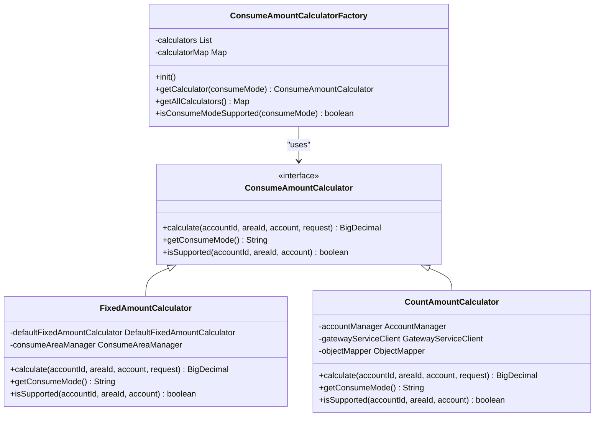
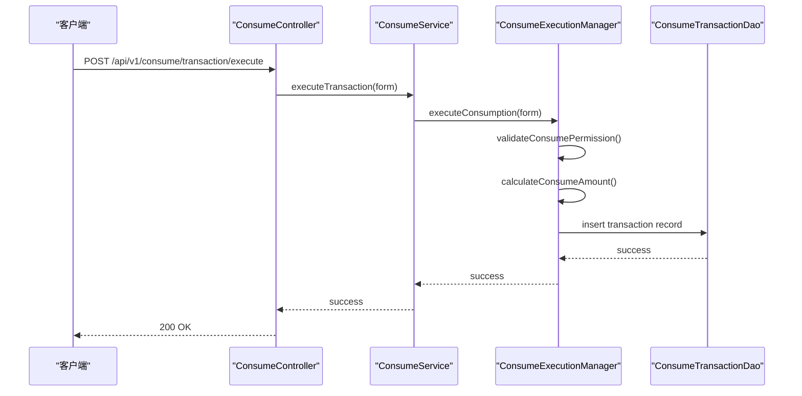
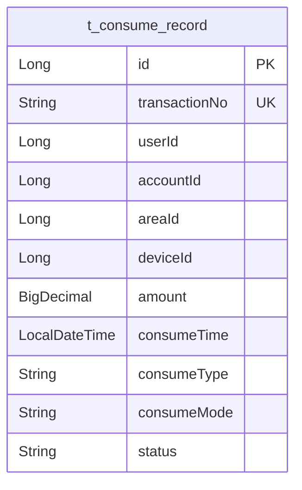

# 消费处理

<cite>
**本文档引用文件**  
- [ConsumeAmountCalculator.java](file://microservices\ioedream-consume-service\src\main\java\net\lab1024\sa\consume\strategy\ConsumeAmountCalculator.java)
- [ConsumeAmountCalculatorFactory.java](file://microservices\ioedream-consume-service\src\main\java\net\lab1024\sa\consume\strategy\ConsumeAmountCalculatorFactory.java)
- [FixedAmountCalculator.java](file://microservices\ioedream-consume-service\src\main\java\net\lab1024\sa\consume\strategy\impl\FixedAmountCalculator.java)
- [CountAmountCalculator.java](file://microservices\ioedream-consume-service\src\main\java\net\lab1024\sa\consume\strategy\impl\CountAmountCalculator.java)
- [ConsumeRecordEntity.java](file://microservices\microservices-common\src\main\java\net\lab1024\sa\common\consume\entity\ConsumeRecordEntity.java)
- [ConsumeController.java](file://microservices\ioedream-consume-service\src\main\java\net\lab1024\sa\consume\controller\ConsumeController.java)
- [ConsumeServiceImpl.java](file://microservices\ioedream-consume-service\src\main\java\net\lab1024\sa\consume\service\impl\ConsumeServiceImpl.java)
- [ConsumeExecutionManager.java](file://microservices\ioedream-consume-service\src\main\java\net\lab1024\sa\consume\manager\ConsumeExecutionManager.java)
- [ConsumeExecutionManagerImpl.java](file://microservices\ioedream-consume-service\src\main\java\net\lab1024\sa\consume\manager\impl\ConsumeExecutionManagerImpl.java)
</cite>

## 目录
1. [引言](#引言)
2. [消费模式实现机制](#消费模式实现机制)
3. [消费金额计算器策略模式设计](#消费金额计算器策略模式设计)
4. [消费交易流程](#消费交易流程)
5. [消费记录数据结构与持久化](#消费记录数据结构与持久化)
6. [消费API调用示例](#消费api调用示例)
7. [性能瓶颈与优化方案](#性能瓶颈与优化方案)
8. [结论](#结论)

## 引言

消费处理功能是智能管理系统中的核心模块之一，负责处理定额、计次、限额等多种消费模式的业务逻辑。本技术文档深入解析消费处理功能的实现机制，重点介绍消费金额计算器的策略模式设计、消费交易流程、消费记录的数据结构与持久化逻辑、API调用示例以及性能优化方案。通过本文档，开发人员可以全面了解消费处理模块的架构设计和实现细节，为后续的开发和维护工作提供指导。

## 消费模式实现机制

消费处理模块支持多种消费模式，包括定额、计次、限额等。每种消费模式都有其特定的业务场景和实现逻辑。

### 定额模式

定额模式适用于早餐、午餐、晚餐等固定金额的消费场景。该模式通过区域配置或账户类别配置获取定值金额，支持周末加价计算和账户类别定值覆盖。定额模式的实现依赖于`FixedAmountCalculator`类，该类通过注入`DefaultFixedAmountCalculator`和`ConsumeAreaManager`来计算定值金额。

### 计次模式

计次模式适用于固定计次消费的场景，如健身房、游泳馆等。该模式从账户类别配置中获取计次价格，并支持应用计次折扣。计次模式的实现依赖于`CountAmountCalculator`类，该类通过网关调用公共服务获取账户类别信息，并解析`mode_config` JSON字段来获取计次配置。

### 限额模式

限额模式适用于有消费上限的场景，如企业员工餐补。该模式通过账户类别配置中的`mode_config`字段来设置消费上限，并在消费时进行余额验证。限额模式的实现依赖于`AccountManager`类，该类负责管理账户信息和余额验证。

## 消费金额计算器策略模式设计

消费金额计算器采用策略模式设计，通过`ConsumeAmountCalculator`接口定义不同消费模式的金额计算策略。策略模式的核心思想是将算法的定义与使用分离，使得算法可以独立于使用它的客户端而变化。

### 策略接口

`ConsumeAmountCalculator`接口定义了三个核心方法：`calculate`用于计算消费金额，`getConsumeMode`用于获取策略支持的消费模式，`isSupported`用于验证消费模式是否支持。该接口的实现类包括`FixedAmountCalculator`、`CountAmountCalculator`、`AmountCalculator`和`ProductAmountCalculator`。

### 策略工厂

`ConsumeAmountCalculatorFactory`类作为策略工厂，负责管理和获取不同消费模式的金额计算器。该工厂类使用`@Component`注解，通过`@Resource`注入策略实现类，并使用`Map`缓存策略实例。工厂类的`init`方法在Spring容器初始化完成后，将所有策略实现类注册到`Map`中。

### 策略实现

每个策略实现类都使用`@Component`注解，并实现`ConsumeAmountCalculator`接口。例如，`FixedAmountCalculator`类通过注入`DefaultFixedAmountCalculator`和`ConsumeAreaManager`来计算定值金额，`CountAmountCalculator`类通过网关调用公共服务获取账户类别信息，并解析`mode_config` JSON字段来获取计次配置。



**图示来源**
- [ConsumeAmountCalculator.java](file://microservices\ioedream-consume-service\src\main\java\net\lab1024\sa\consume\strategy\ConsumeAmountCalculator.java)
- [ConsumeAmountCalculatorFactory.java](file://microservices\ioedream-consume-service\src\main\java\net\lab1024\sa\consume\strategy\ConsumeAmountCalculatorFactory.java)
- [FixedAmountCalculator.java](file://microservices\ioedream-consume-service\src\main\java\net\lab1024\sa\consume\strategy\impl\FixedAmountCalculator.java)
- [CountAmountCalculator.java](file://microservices\ioedream-consume-service\src\main\java\net\lab1024\sa\consume\strategy\impl\CountAmountCalculator.java)

## 消费交易流程

消费交易流程包括预扣款、实际扣款、异常处理等环节。整个流程通过`ConsumeExecutionManager`类进行编排，确保交易的原子性和一致性。

### 预扣款

预扣款环节在消费请求到达时立即执行，通过`AccountManager`类验证账户余额和消费权限。如果账户余额不足或消费权限验证失败，交易将被拒绝。

### 实际扣款

实际扣款环节在预扣款成功后执行，通过`ConsumeTransactionDao`类将交易记录插入数据库。交易记录包括交易流水号、用户ID、账户ID、设备ID、区域ID、消费金额、消费时间、消费模式、消费类型和状态等字段。

### 异常处理

异常处理环节在交易过程中发生异常时执行，通过`ConsumeRecordDao`类记录异常信息，并将交易状态设置为“失败”。异常信息包括异常类型、异常消息、异常堆栈等。



**图示来源**
- [ConsumeController.java](file://microservices\ioedream-consume-service\src\main\java\net\lab1024\sa\consume\controller\ConsumeController.java)
- [ConsumeServiceImpl.java](file://microservices\ioedream-consume-service\src\main\java\net\lab1024\sa\consume\service\impl\ConsumeServiceImpl.java)
- [ConsumeExecutionManager.java](file://microservices\ioedream-consume-service\src\main\java\net\lab1024\sa\consume\manager\ConsumeExecutionManager.java)
- [ConsumeExecutionManagerImpl.java](file://microservices\ioedream-consume-service\src\main\java\net\lab1024\sa\consume\manager\impl\ConsumeExecutionManagerImpl.java)

## 消费记录数据结构与持久化

消费记录的数据结构设计遵循CLAUDE.md规范，继承`BaseEntity`获取审计字段，使用`@TableName`指定数据库表名，字段数控制在30个以内，行数控制在200行以内。

### 数据结构

`ConsumeRecordEntity`类定义了消费记录的实体结构，包括消费记录ID、交易流水号、用户ID、账户ID、区域ID、设备ID、消费金额、消费时间、消费类型、消费模式和状态等字段。消费类型包括“正常消费”、“补单”和“纠错”，消费模式包括“定值”、“金额”、“商品”和“计次”，状态包括“成功”、“失败”和“已退款”。

### 持久化逻辑

消费记录的持久化逻辑通过`ConsumeTransactionDao`类实现，使用MyBatis-Plus框架进行数据库操作。`ConsumeTransactionDao`类提供了插入、查询、更新和删除消费记录的方法，并通过`@TableId`注解指定主键生成策略。



**图示来源**
- [ConsumeRecordEntity.java](file://microservices\microservices-common\src\main\java\net\lab1024\sa\common\consume\entity\ConsumeRecordEntity.java)

## 消费API调用示例

消费API提供了执行消费交易、查询交易详情、分页查询消费记录等接口。以下为调用示例。

### 执行消费交易

```json
POST /api/v1/consume/transaction/execute
{
  "userId": 1001,
  "accountId": 2001,
  "deviceId": 3001,
  "areaId": 4001,
  "amount": 50.00,
  "consumeMode": "CARD"
}
```

**响应格式**

```json
{
  "code": "SUCCESS",
  "message": "交易成功",
  "data": {
    "transactionId": 1,
    "transactionNo": "TXN2025013012345678",
    "transactionStatus": 2,
    "amount": 50.00,
    "balanceAfter": 950.00,
    "transactionTime": "2025-01-30T12:00:00"
  }
}
```

**错误码说明**

- `EXECUTE_TRANSACTION_ERROR`: 执行消费交易失败
- `TRANSACTION_NOT_FOUND`: 交易记录不存在
- `QUERY_TRANSACTION_ERROR`: 查询交易详情失败
- `QUERY_TRANSACTIONS_ERROR`: 查询消费记录失败
- `GET_DEVICE_ERROR`: 获取设备详情失败
- `GET_DEVICE_STATISTICS_ERROR`: 获取设备状态统计失败
- `GET_REALTIME_STATISTICS_ERROR`: 获取实时统计失败

## 性能瓶颈与优化方案

消费处理过程中可能存在性能瓶颈，如高并发下的数据库写入压力、频繁的网关调用等。以下为优化方案。

### 批量处理

通过批量处理消费记录，减少数据库写入次数。例如，将多个消费记录合并为一个批量插入操作，提高数据库写入效率。

### 异步记账

通过异步记账机制，将消费记录的持久化操作放入消息队列中，由后台任务异步处理。这样可以减少主线程的阻塞时间，提高系统的响应速度。

### 缓存优化

通过缓存消费记录和设备状态，减少数据库查询次数。例如，将最近1小时的消费记录和设备状态缓存到Redis中，提高查询效率。

### 索引优化

通过优化数据库索引，提高查询效率。例如，在`t_consume_record`表的`userId`、`areaId`、`consumeTime`字段上创建复合索引，加快分页查询的速度。

## 结论

消费处理功能通过策略模式设计实现了多种消费模式的灵活扩展，通过`ConsumeExecutionManager`类编排了消费交易流程，确保了交易的原子性和一致性。消费记录的数据结构设计合理，持久化逻辑清晰，API调用示例完整，性能优化方案有效。通过本技术文档，开发人员可以全面了解消费处理模块的架构设计和实现细节，为后续的开发和维护工作提供指导。