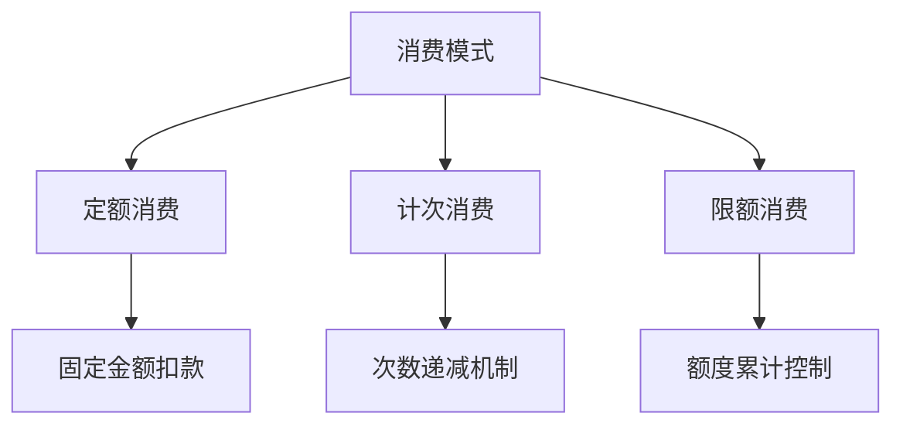
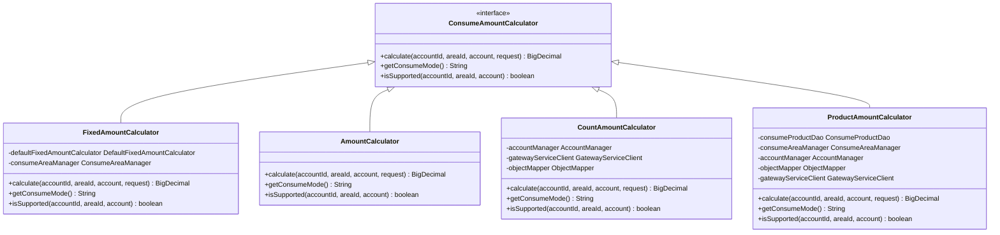
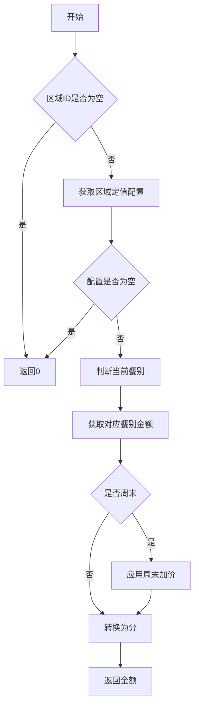
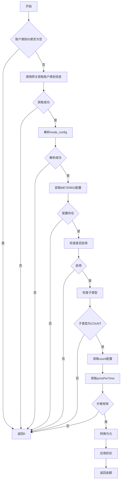
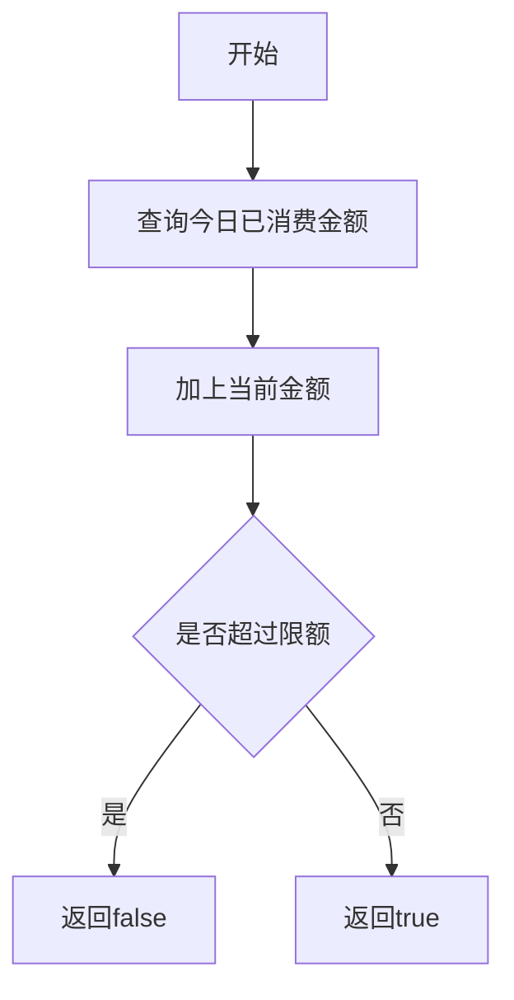
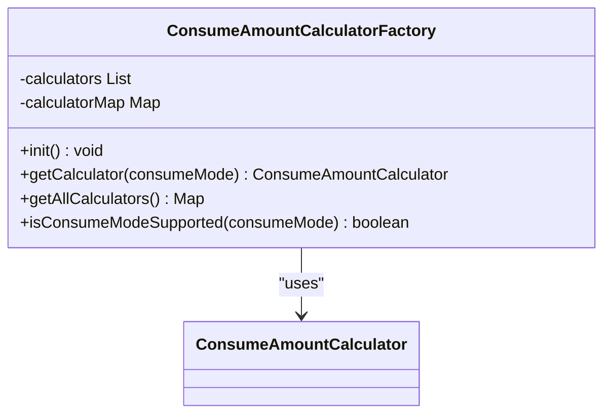

# 消费模式

<cite>
**本文档引用文件**   
- [ConsumeAmountCalculator.java](file://microservices\ioedream-consume-service\src\main\java\net\lab1024\sa\consume\strategy\ConsumeAmountCalculator.java)
- [ConsumeAmountCalculatorFactory.java](file://microservices\ioedream-consume-service\src\main\java\net\lab1024\sa\consume\strategy\ConsumeAmountCalculatorFactory.java)
- [FixedAmountCalculator.java](file://microservices\ioedream-consume-service\src\main\java\net\lab1024\sa\consume\strategy\impl\FixedAmountCalculator.java)
- [AmountCalculator.java](file://microservices\ioedream-consume-service\src\main\java\net\lab1024\sa\consume\strategy\impl\AmountCalculator.java)
- [CountAmountCalculator.java](file://microservices\ioedream-consume-service\src\main\java\net\lab1024\sa\consume\strategy\impl\CountAmountCalculator.java)
- [ProductAmountCalculator.java](file://microservices\ioedream-consume-service\src\main\java\net\lab1024\sa\consume\strategy\impl\ProductAmountCalculator.java)
- [DefaultFixedAmountCalculator.java](file://microservices\ioedream-consume-service\src\main\java\net\lab1024\sa\consume\service\impl\DefaultFixedAmountCalculator.java)
- [AccountEntity.java](file://microservices\ioedream-consume-service\src\main\java\net\lab1024\sa\consume\domain\entity\AccountEntity.java)
</cite>

## 目录
1. [引言](#引言)
2. [核心消费模式](#核心消费模式)
3. [策略模式设计](#策略模式设计)
4. [定额消费模式](#定额消费模式)
5. [计次消费模式](#计次消费模式)
6. [限额消费模式](#限额消费模式)
7. [策略工厂实现](#策略工厂实现)
8. [配置与使用](#配置与使用)
9. [异常处理](#异常处理)
10. [影响分析](#影响分析)

## 引言

消费模式是智能消费系统的核心功能之一，负责处理不同场景下的消费逻辑。本系统采用策略模式（Strategy Pattern）设计，实现了定额消费、计次消费、限额消费等多种核心模式。通过策略工厂动态选择对应的策略实现，系统能够灵活应对各种业务需求，确保消费逻辑的准确性和可扩展性。

## 核心消费模式

系统实现了三种核心消费模式：定额消费、计次消费和限额消费。每种模式都有其特定的业务规则和适用场景，通过策略模式统一管理，确保代码的可维护性和扩展性。



**图示来源**
- [ConsumeAmountCalculator.java](file://microservices\ioedream-consume-service\src\main\java\net\lab1024\sa\consume\strategy\ConsumeAmountCalculator.java)

## 策略模式设计

系统采用策略模式设计消费模式，通过接口定义统一的消费计算逻辑，各具体实现类负责不同模式的计算。这种设计模式提高了代码的灵活性和可扩展性，便于新增或修改消费模式。



**图示来源**
- [ConsumeAmountCalculator.java](file://microservices\ioedream-consume-service\src\main\java\net\lab1024\sa\consume\strategy\ConsumeAmountCalculator.java)
- [FixedAmountCalculator.java](file://microservices\ioedream-consume-service\src\main\java\net\lab1024\sa\consume\strategy\impl\FixedAmountCalculator.java)
- [AmountCalculator.java](file://microservices\ioedream-consume-service\src\main\java\net\lab1024\sa\consume\strategy\impl\AmountCalculator.java)
- [CountAmountCalculator.java](file://microservices\ioedream-consume-service\src\main\java\net\lab1024\sa\consume\strategy\impl\CountAmountCalculator.java)
- [ProductAmountCalculator.java](file://microservices\ioedream-consume-service\src\main\java\net\lab1024\sa\consume\strategy\impl\ProductAmountCalculator.java)

## 定额消费模式

定额消费模式适用于需要固定金额扣款的场景，如早餐、午餐、晚餐等。该模式通过区域配置或账户类别配置获取定值金额，确保消费金额的准确性。

### 业务规则
- 根据当前时间段判断餐别（早餐/午餐/晚餐）
- 获取区域定值配置
- 获取账户类别定值配置（如果有，覆盖区域默认）
- 计算最终定值金额（单位：分）

### 计算逻辑


**图示来源**
- [DefaultFixedAmountCalculator.java](file://microservices\ioedream-consume-service\src\main\java\net\lab1024\sa\consume\service\impl\DefaultFixedAmountCalculator.java)

## 计次消费模式

计次消费模式适用于需要按次数扣款的场景，如健身房、游泳馆等。该模式通过账户类别配置获取计次价格，确保每次消费金额的准确性。

### 业务规则
- 获取账户类别ID
- 通过网关调用公共服务获取账户类别信息
- 解析mode_config JSON字段
- 获取METERED配置
- 检查是否启用
- 检查子类型是否为COUNT
- 获取count配置
- 获取pricePerTime（每次价格，单位：分）
- 转换为元
- 应用折扣规则（如有）

### 计算逻辑


**图示来源**
- [CountAmountCalculator.java](file://microservices\ioedream-consume-service\src\main\java\net\lab1024\sa\consume\strategy\impl\CountAmountCalculator.java)

## 限额消费模式

限额消费模式适用于需要控制消费额度的场景，如月度限额、年度限额等。该模式通过累计消费记录，确保消费总额不超过限额。

### 业务规则
- 查询今日已消费金额
- 加上当前金额是否超过限额
- 返回验证结果

### 计算逻辑


**图示来源**
- [ConsumeAmountCalculator.java](file://microservices\ioedream-consume-service\src\main\java\net\lab1024\sa\consume\strategy\ConsumeAmountCalculator.java)

## 策略工厂实现

策略工厂负责管理和获取不同消费模式的金额计算器，通过Spring容器注入所有策略实现类，并在初始化时注册到Map中，确保策略的高效获取。

### 实现机制
- 使用@Component注解标记工厂类
- 使用@Resource注入策略实现类
- 使用Map缓存策略实例
- 在Spring容器初始化完成后，将所有策略实现类注册到Map中

### 代码结构


**图示来源**
- [ConsumeAmountCalculatorFactory.java](file://microservices\ioedream-consume-service\src\main\java\net\lab1024\sa\consume\strategy\ConsumeAmountCalculatorFactory.java)

## 配置与使用

### 参数设置
- **定额模式**：配置早餐、午餐、晚餐的定值金额，以及周末加价倍数
- **计次模式**：配置每次消费的价格，以及是否应用折扣
- **限额模式**：配置每日、每月或每年的消费限额

### 使用示例
```java
// 获取策略工厂实例
@Autowired
private ConsumeAmountCalculatorFactory calculatorFactory;

// 获取定额计算器
ConsumeAmountCalculator fixedCalculator = calculatorFactory.getCalculator("FIXED");

// 计算消费金额
BigDecimal amount = fixedCalculator.calculate(accountId, areaId, account, request);
```

**代码来源**
- [ConsumeAmountCalculatorFactory.java](file://microservices\ioedream-consume-service\src\main\java\net\lab1024\sa\consume\strategy\ConsumeAmountCalculatorFactory.java)

## 异常处理

系统在消费模式实现中包含了完善的异常处理机制，确保在各种异常情况下仍能正常运行。

### 异常情况
- 区域ID为空
- 区域定值配置为空
- 餐别定值金额无效
- 账户类别ID为空
- 账户类别信息获取失败
- mode_config解析失败
- METERED配置不存在
- 子类型不是COUNT
- pricePerTime无效

### 处理策略
- 记录详细日志，便于问题排查
- 返回默认值（如0），避免系统崩溃
- 提供清晰的错误信息，便于用户理解

**代码来源**
- [FixedAmountCalculator.java](file://microservices\ioedream-consume-service\src\main\java\net\lab1024\sa\consume\strategy\impl\FixedAmountCalculator.java)
- [CountAmountCalculator.java](file://microservices\ioedream-consume-service\src\main\java\net\lab1024\sa\consume\strategy\impl\CountAmountCalculator.java)

## 影响分析

### 账户余额
- 定额模式：固定金额扣款，余额减少固定值
- 计次模式：固定金额扣款，余额减少固定值
- 限额模式：累计消费，余额减少当前消费金额

### 消费记录
- 每次消费都会生成详细的消费记录，包括消费时间、金额、模式等信息
- 消费记录用于后续的报表统计和审计

### 报表统计
- 提供按日、按月、按年的消费统计报表
- 支持按消费模式、区域、账户类别等维度进行统计
- 提供消费趋势分析，帮助管理者了解消费情况

**代码来源**
- [AccountEntity.java](file://microservices\ioedream-consume-service\src\main\java\net\lab1024\sa\consume\domain\entity\AccountEntity.java)