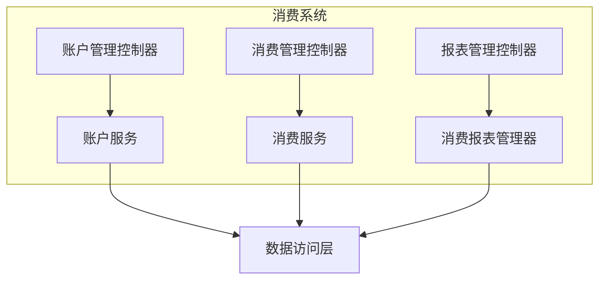
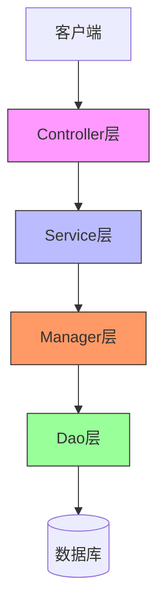
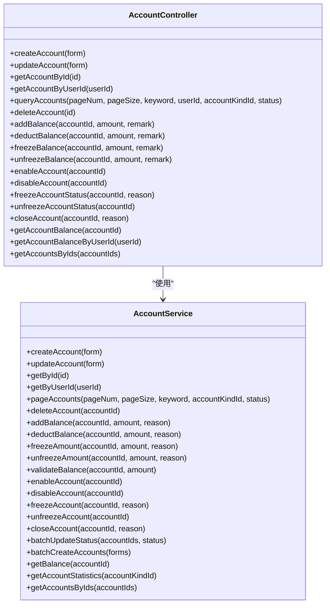
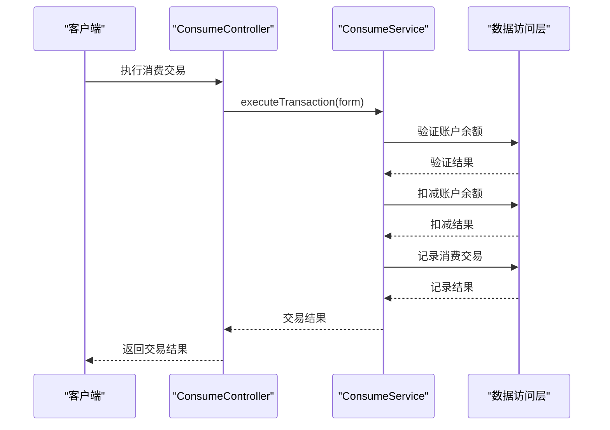
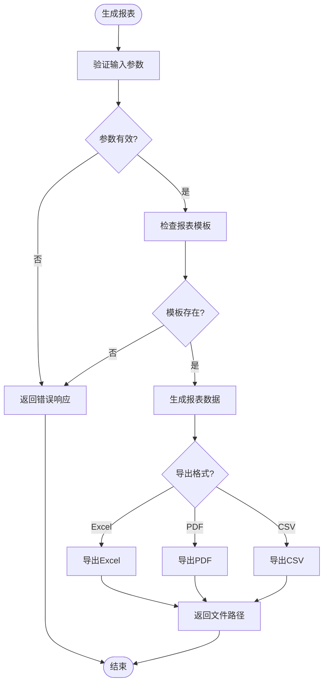
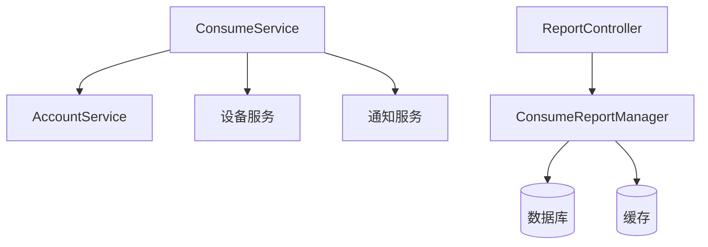
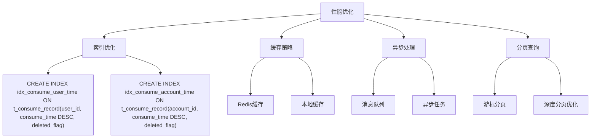

# 消费系统

<cite>
**本文档引用文件**   
- [AccountController.java](file://microservices\ioedream-consume-service\src\main\java\net\lab1024\sa\consume\controller\AccountController.java)
- [ConsumeController.java](file://microservices\ioedream-consume-service\src\main\java\net\lab1024\sa\consume\controller\ConsumeController.java)
- [ReportController.java](file://microservices\ioedream-consume-service\src\main\java\net\lab1024\sa\consume\controller\ReportController.java)
- [AccountService.java](file://microservices\ioedream-consume-service\src\main\java\net\lab1024\sa\consume\service\AccountService.java)
- [ConsumeService.java](file://microservices\ioedream-consume-service\src\main\java\net\lab1024\sa\consume\service\ConsumeService.java)
- [MinerU_消费PUSH通讯协议 （中控智慧） V1.0-20181225__20251206181016.md](file://docs\各个设备通讯协议\MinerU_消费PUSH通讯协议 （中控智慧） V1.0-20181225__20251206181016.md)
- [消费系统开发检查清单.md](file://docs\CHECKLISTS\消费系统开发检查清单.md)
- [06-消费处理流程重构设计.md](file://documentation\03-业务模块\各业务模块文档\消费\06-消费处理流程重构设计.md)
- [03-账户类别与消费模式设计.md](file://documentation\03-业务模块\消费\03-账户类别与消费模式设计.md)
- [performance_optimization.sql](file://database\performance_optimization.sql)
</cite>

## 目录
1. [引言](#引言)
2. [项目结构](#项目结构)
3. [核心组件](#核心组件)
4. [架构概述](#架构概述)
5. [详细组件分析](#详细组件分析)
6. [依赖分析](#依赖分析)
7. [性能考虑](#性能考虑)
8. [故障排除指南](#故障排除指南)
9. [结论](#结论)

## 引言
消费系统是企业智能管理系统中的关键模块，负责管理用户的消费账户、处理消费交易、管理补贴和商品、生成报表统计等功能。本系统支持多种消费模式，包括定额、计次、限额等，并实现了离线消费和数据同步机制。系统通过RESTful API提供服务，与前端应用和消费设备进行交互，确保消费数据的准确性和实时性。

## 项目结构
消费系统作为微服务架构的一部分，位于`microservices\ioedream-consume-service`目录下。系统采用分层架构设计，包含Controller、Service、Manager和Dao层。Controller层提供RESTful API接口，Service层处理业务逻辑，Manager层负责复杂的业务管理，Dao层负责数据访问。系统还包含专门的报表管理、设备管理和补贴管理模块。

**图源**
- [AccountController.java](file://microservices\ioedream-consume-service\src\main\java\net\lab1024\sa\consume\controller\AccountController.java)
- [ConsumeController.java](file://microservices\ioedream-consume-service\src\main\java\net\lab1024\sa\consume\controller\ConsumeController.java)
- [ReportController.java](file://microservices\ioedream-consume-service\src\main\java\net\lab1024\sa\consume\controller\ReportController.java)

**章节源**
- [AccountController.java](file://microservices\ioedream-consume-service\src\main\java\net\lab1024\sa\consume\controller\AccountController.java)
- [ConsumeController.java](file://microservices\ioedream-consume-service\src\main\java\net\lab1024\sa\consume\controller\ConsumeController.java)
- [ReportController.java](file://microservices\ioedream-consume-service\src\main\java\net\lab1024\sa\consume\controller\ReportController.java)

## 核心组件
消费系统的核心组件包括账户管理、消费管理、报表管理和设备管理。账户管理负责用户的账户创建、余额管理、状态管理等。消费管理处理消费交易的执行、记录和查询。报表管理生成各种消费统计报表。设备管理负责消费设备的配置和状态监控。这些组件通过RESTful API提供服务，确保系统的可扩展性和可维护性。

**章节源**
- [AccountController.java](file://microservices\ioedream-consume-service\src\main\java\net\lab1024\sa\consume\controller\AccountController.java)
- [ConsumeController.java](file://microservices\ioedream-consume-service\src\main\java\net\lab1024\sa\consume\controller\ConsumeController.java)
- [ReportController.java](file://microservices\ioedream-consume-service\src\main\java\net\lab1024\sa\consume\controller\ReportController.java)

## 架构概述
消费系统采用微服务架构，通过RESTful API提供服务。系统分为四个主要层次：Controller层负责接收请求和返回响应，Service层处理业务逻辑，Manager层负责复杂的业务管理，Dao层负责数据访问。这种分层设计确保了系统的高内聚和低耦合，便于维护和扩展。

**图源**
- [AccountController.java](file://microservices\ioedream-consume-service\src\main\java\net\lab1024\sa\consume\controller\AccountController.java)
- [ConsumeController.java](file://microservices\ioedream-consume-service\src\main\java\net\lab1024\sa\consume\controller\ConsumeController.java)
- [ReportController.java](file://microservices\ioedream-consume-service\src\main\java\net\lab1024\sa\consume\controller\ReportController.java)

## 详细组件分析
### 账户管理分析
账户管理是消费系统的核心功能之一，负责用户的账户创建、余额管理、状态管理等。系统通过`AccountController`提供RESTful API接口，支持账户的CRUD操作、余额管理、状态管理等。

#### 账户管理类图

**图源**
- [AccountController.java](file://microservices\ioedream-consume-service\src\main\java\net\lab1024\sa\consume\controller\AccountController.java)
- [AccountService.java](file://microservices\ioedream-consume-service\src\main\java\net\lab1024\sa\consume\service\AccountService.java)

**章节源**
- [AccountController.java](file://microservices\ioedream-consume-service\src\main\java\net\lab1024\sa\consume\controller\AccountController.java)
- [AccountService.java](file://microservices\ioedream-consume-service\src\main\java\net\lab1024\sa\consume\service\AccountService.java)

### 消费管理分析
消费管理负责处理消费交易的执行、记录和查询。系统通过`ConsumeController`提供RESTful API接口，支持消费交易的执行、交易详情查询、消费记录查询、设备管理、实时统计等功能。

#### 消费管理序列图

**图源**
- [ConsumeController.java](file://microservices\ioedream-consume-service\src\main\java\net\lab1024\sa\consume\controller\ConsumeController.java)
- [ConsumeService.java](file://microservices\ioedream-consume-service\src\main\java\net\lab1024\sa\consume\service\ConsumeService.java)

**章节源**
- [ConsumeController.java](file://microservices\ioedream-consume-service\src\main\java\net\lab1024\sa\consume\controller\ConsumeController.java)
- [ConsumeService.java](file://microservices\ioedream-consume-service\src\main\java\net\lab1024\sa\consume\service\ConsumeService.java)

### 报表管理分析
报表管理负责生成各种消费统计报表，包括日消费报表、月消费报表、设备统计报表等。系统通过`ReportController`提供RESTful API接口，支持报表生成、报表导出、报表模板管理、报表统计分析等功能。

#### 报表管理流程图

**图源**
- [ReportController.java](file://microservices\ioedream-consume-service\src\main\java\net\lab1024\sa\consume\controller\ReportController.java)

**章节源**
- [ReportController.java](file://microservices\ioedream-consume-service\src\main\java\net\lab1024\sa\consume\controller\ReportController.java)

## 依赖分析
消费系统依赖于多个外部组件和内部服务。系统通过`AccountService`和`ConsumeService`接口与数据访问层交互，通过`ConsumeReportManager`与报表管理模块交互。系统还依赖于数据库、缓存和消息队列等基础设施。

**图源**
- [ConsumeService.java](file://microservices\ioedream-consume-service\src\main\java\net\lab1024\sa\consume\service\ConsumeService.java)
- [AccountService.java](file://microservices\ioedream-consume-service\src\main\java\net\lab1024\sa\consume\service\AccountService.java)
- [ReportController.java](file://microservices\ioedream-consume-service\src\main\java\net\lab1024\sa\consume\controller\ReportController.java)

**章节源**
- [ConsumeService.java](file://microservices\ioedream-consume-service\src\main\java\net\lab1024\sa\consume\service\ConsumeService.java)
- [AccountService.java](file://microservices\ioedream-consume-service\src\main\java\net\lab1024\sa\consume\service\AccountService.java)
- [ReportController.java](file://microservices\ioedream-consume-service\src\main\java\net\lab1024\sa\consume\controller\ReportController.java)

## 性能考虑
消费系统在设计时充分考虑了性能优化。系统通过索引优化、缓存策略、异步处理等手段提高性能。数据库查询通过索引优化，减少全表扫描。高频查询通过缓存策略减少数据库访问。大事务通过异步处理提高响应速度。

**图源**
- [performance_optimization.sql](file://database\performance_optimization.sql)

**章节源**
- [performance_optimization.sql](file://database\performance_optimization.sql)

## 故障排除指南
消费系统提供了详细的故障排除指南，帮助开发人员和运维人员快速定位和解决问题。常见问题包括账户余额不一致、消费交易失败、报表生成缓慢等。系统通过日志记录、监控告警、错误码等方式提供故障诊断信息。

**章节源**
- [消费系统开发检查清单.md](file://docs\CHECKLISTS\消费系统开发检查清单.md)

## 结论
消费系统是一个功能完善、性能优越的微服务模块，支持多种消费模式和复杂的业务场景。系统通过分层架构设计，确保了高内聚和低耦合，便于维护和扩展。通过索引优化、缓存策略、异步处理等手段，系统在高并发场景下仍能保持良好的性能。未来可以进一步优化报表生成性能，增加更多的消费模式支持。