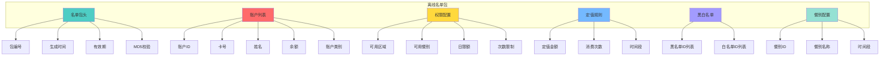
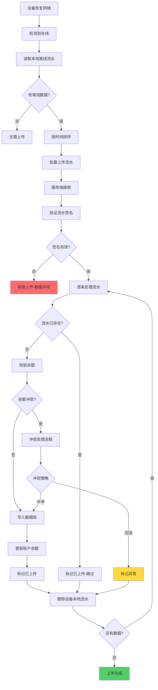
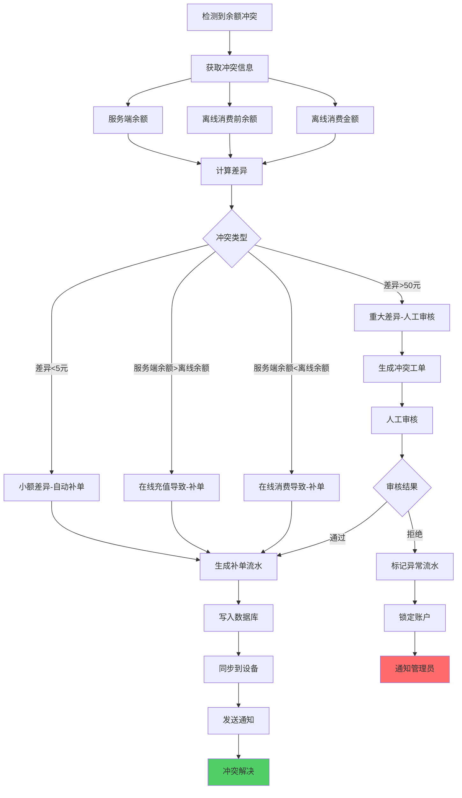

# 离线消费

<cite>
**本文档引用文件**  
- [11-离线消费模块重构设计.md](file://documentation\03-业务模块\各业务模块文档\消费\11-离线消费模块重构设计.md)
- [offline-manager.js](file://smart-app\src\utils\offline-manager.js)
</cite>

## 目录
1. [离线消费概述](#离线消费概述)
2. [本地存储机制与数据结构](#本地存储机制与数据结构)
3. [离线数据同步策略](#离线数据同步策略)
4. [冲突检测与解决机制](#冲突检测与解决机制)
5. [设备配置与状态监控](#设备配置与状态监控)
6. [数据一致性保障](#数据一致性保障)

## 离线消费概述

离线消费功能旨在保障在网络中断或不稳定情况下，消费设备仍能正常进行交易，确保业务连续性。该功能通过在设备端本地存储用户账户信息、权限配置和消费规则，实现离线状态下的消费验证和扣款。当网络恢复后，设备会自动将离线期间产生的交易流水同步至服务端，由系统进行统一处理和对账。

该功能主要解决以下核心问题：
- 设备离线后无法进行消费交易
- 离线产生的数据无法有效同步
- 服务端与设备端余额不一致导致的冲突
- 离线名单管理混乱，数据不完整

**Section sources**
- [11-离线消费模块重构设计.md](file://documentation\03-业务模块\各业务模块文档\消费\11-离线消费模块重构设计.md)

## 本地存储机制与数据结构

离线消费的核心在于设备端的本地存储机制。系统通过定时任务或事件触发，将必要的业务数据打包成“离线名单包”并下发至消费设备。设备在本地存储这些数据，用于离线状态下的交易验证。

### 离线名单包数据结构

离线名单包包含以下关键数据：
- **账户基础信息**：账户ID、卡号、姓名、账户类别。
- **账户余额信息**：当前可用余额。
- **权限配置**：用户可消费的区域、餐别、日限额、次数限制等。
- **定值规则**：针对餐别制消费的定值金额、消费次数和有效时间段。
- **黑白名单**：用于快速判断用户状态。
- **餐别信息**：包含餐别ID、名称和有效时间段。

此外，名单包还必须包含区域核心配置字段，以支持不同的经营模式：
| 字段 | 说明 |
|------|------|
| `manage_mode` | 消费模式（餐别制、超市制、混合模式），决定消费流程 |
| `fixed_value_config` | 餐别制下的定值配置，用于离线计算金额 |
| `meal_categories` | 餐别信息，用于离线验证餐别权限 |

**Diagram sources**
- [11-离线消费模块重构设计.md](file://documentation\03-业务模块\各业务模块文档\消费\11-离线消费模块重构设计.md)

### 不同经营模式的支持

| 经营模式 | 离线支持程度 | 必需数据 | 特殊处理 |
|---------|------------|---------|---------|
| **餐别制** | ✅ 完全支持 | 区域配置+餐别配置+定值配置 | 需下发完整餐别时间窗口 |
| **超市制** | ⚠️ 部分支持 | 区域配置+商品基础信息 | 商品价格可离线，库存扣减需上线后同步 |
| **混合模式** | ⚠️ 部分支持 | 两种模式数据均需下发 | 数据量较大，需压缩传输 |

**Section sources**
- [11-离线消费模块重构设计.md](file://documentation\03-业务模块\各业务模块文档\消费\11-离线消费模块重构设计.md)

## 离线数据同步策略

离线数据的同步由定时任务（ScheduledJob）驱动，确保数据的及时性和一致性。

### 同步触发条件

同步任务的触发条件包括：
- **定时触发**：系统配置的定时任务，如每小时执行一次。
- **事件触发**：当设备状态从离线变为在线时，立即触发同步。
- **手动触发**：管理员在管理后台手动发起同步。

### 同步流程

离线数据上传流程如下：

**Diagram sources**
- [11-离线消费模块重构设计.md](file://documentation\03-业务模块\各业务模块文档\消费\11-离线消费模块重构设计.md)

**Section sources**
- [11-离线消费模块重构设计.md](file://documentation\03-业务模块\各业务模块文档\消费\11-离线消费模块重构设计.md)

## 冲突检测与解决机制

由于网络延迟或设备离线期间在其他设备上发生的交易，可能导致服务端与设备端的余额不一致，从而产生冲突。系统通过以下机制进行检测和解决。

### 冲突检测

在处理每一条离线流水时，服务端会进行余额校验：
1. 查询该账户在服务端的当前余额。
2. 将服务端余额与离线流水中的“消费前余额”进行比对。
3. 如果两者不一致，则判定为余额冲突。

### 冲突解决策略

系统根据冲突的严重程度，采用不同的处理策略：

**Diagram sources**
- [11-离线消费模块重构设计.md](file://documentation\03-业务模块\各业务模块文档\消费\11-离线消费模块重构设计.md)

**Section sources**
- [11-离线消费模块重构设计.md](file://documentation\03-业务模块\各业务模块文档\消费\11-离线消费模块重构设计.md)

## 设备配置与状态监控

### 设备配置方法

消费设备的离线功能需要在系统中进行配置：
1. **启用离线功能**：在设备管理界面，为指定设备开启“是否启用离线”开关。
2. **设置离线容量**：配置设备本地可存储的离线流水最大数量。
3. **配置同步策略**：设置定时同步的频率和时间。

### 状态监控方案

系统通过以下方式监控离线设备的状态：
- **设备在线状态**：通过心跳机制，设备定期向服务端发送心跳包，服务端更新设备的在线状态。
- **离线时长监控**：记录设备最后一次心跳时间，计算其离线时长，超过阈值（如24小时）则触发告警。
- **离线流水监控**：监控设备本地存储的离线流水数量，接近容量上限时发出预警。

前端管理界面提供“离线设备列表”和“离线消费统计”报表，便于管理员实时掌握设备状态。

**Section sources**
- [11-离线消费模块重构设计.md](file://documentation\03-业务模块\各业务模块文档\消费\11-离线消费模块重构设计.md)

## 数据一致性保障

为确保离线消费对数据一致性的影响降到最低，系统实施了多层次的保障措施。

### 事务处理

在服务端处理离线流水时，采用数据库事务确保操作的原子性。写入交易流水和更新账户余额必须同时成功或同时失败，防止出现数据不一致。

### 补偿机制

系统设计了完善的补偿机制：
- **自动补偿**：对于因网络问题导致同步失败的流水，系统会自动重试，直至成功。
- **人工干预**：对于无法自动解决的冲突（如重大差异），系统生成工单，由管理员进行人工审核和处理。

### 缓存策略

系统使用Redis缓存关键数据，以提高性能和一致性：
| 缓存项 | Redis Key | 说明 |
|-------|-----------|------|
| 设备在线状态 | `device:online:{deviceId}` | 用于快速判断设备状态 |
| 待下发名单 | `offline:pending:{deviceId}` | 存储待推送的离线名单 |
| 离线流水锁 | `lock:offline:{transactionNo}` | 防止同一条流水被重复上传 |

**Section sources**
- [11-离线消费模块重构设计.md](file://documentation\03-业务模块\各业务模块文档\消费\11-离线消费模块重构设计.md)