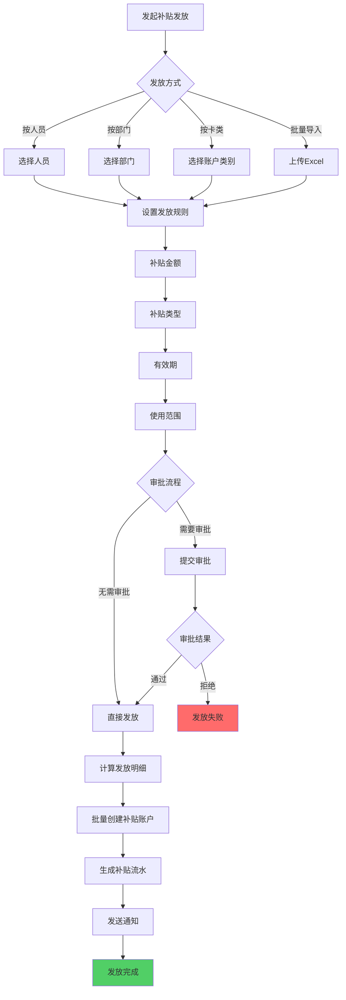
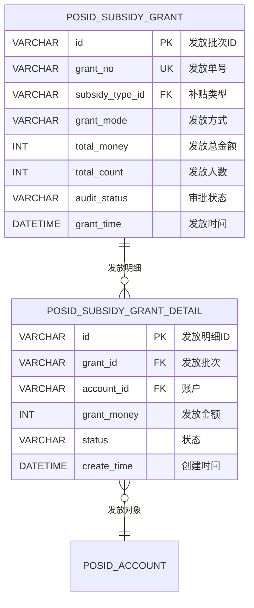

# 补贴管理

<cite>
**本文档引用文件**  
- [ConsumeSubsidyIssueRecordEntity.java](file://microservices\ioedream-consume-service\src\main\java\net\lab1024\sa\consume\domain\entity\ConsumeSubsidyIssueRecordEntity.java)
- [ConsumeSubsidyIssueRecordDao.java](file://microservices\ioedream-consume-service\src\main\java\net\lab1024\sa\consume\dao\ConsumeSubsidyIssueRecordDao.java)
- [10-补贴管理模块重构设计.md](file://documentation\03-业务模块\消费\10-补贴管理模块重构设计.md)
- [AccountController.java](file://microservices\ioedream-consume-service\src\main\java\net\lab1024\sa\consume\controller\AccountController.java)
- [FINAL_WORK_SUMMARY_REPORT.md](file://documentation\technical\FINAL_WORK_SUMMARY_REPORT.md)
</cite>

## 目录
1. [引言](#引言)
2. [补贴类型配置与发放规则](#补贴类型配置与发放规则)
3. [补贴发放流程](#补贴发放流程)
4. [补贴发放记录数据模型与状态管理](#补贴发放记录数据模型与状态管理)
5. [补贴余额查询与使用统计API](#补贴余额查询与使用统计api)
6. [补贴与消费账户关联机制及资金冻结/解冻逻辑](#补贴与消费账户关联机制及资金冻结解冻逻辑)
7. [补贴服务集成示例](#补贴服务集成示例)
8. [结论](#结论)

## 引言
本文档详细阐述了IoE-DREAM系统中补贴管理功能的设计与实现。文档涵盖了补贴类型配置、发放规则、发放流程、数据模型、API接口以及与其他服务的集成方式。通过本文档，用户可以全面了解如何配置和管理餐补、交通补等各类补贴，以及如何通过API进行补贴余额查询和使用情况统计。

## 补贴类型配置与发放规则
补贴管理模块支持多种补贴类型的配置，包括餐补、交通补贴、通用补贴和节日补贴等。每种补贴类型都有其独特的配置规则，如发放方式、有效期、使用范围和清零策略。

### 补贴类型配置
补贴类型配置包括以下关键属性：
- **类型编码**：唯一标识补贴类型的编码。
- **类型名称**：补贴类型的名称，如“餐补”、“交通补贴”等。
- **使用优先级**：决定补贴在消费时的使用顺序。
- **清零策略**：定义补贴的清零规则，如“月末清零”、“不清零累积”等。
- **有效期天数**：补贴的有效期，如“60天有效期”。
- **允许转换**：是否允许将补贴转换为现金。
- **允许退回**：是否允许将补贴退回。
- **使用范围**：定义补贴的使用范围，如特定区域或商品类别。

### 发放规则
补贴的发放规则根据不同的经营模式有所不同，但总体上遵循以下原则：
- **餐别制**（manage_mode=1）：补贴主要用于餐费，可限定特定餐别使用。
- **超市制**（manage_mode=2）：补贴可用于购物，可限定商品类别。
- **混合模式**（manage_mode=3）：补贴可用于定值消费和商品消费。

**补贴使用规则矩阵**：
| 场景 | 餐别制 | 超市制 | 混合模式 |
|------|--------|--------|---------|
| **补贴优先级** | 补贴→现金 | 补贴→现金 | 补贴→现金 |
| **限定使用** | 可限定特定餐别 | 可限定商品类别 | 可分别限定 |
| **时间限制** | 就餐时间段内 | 营业时间段内 | 根据消费方式判断 |
| **余额不足处理** | 补贴+现金混合支付 | 补贴+现金混合支付 | 支持混合支付 |

**业务示例**：
- **餐别制**：发放午餐补贴10元，仅在午餐时段使用，定值12元时补贴抵扣10元，现金支付2元。
- **超市制**：发放生活用品补贴50元，仅可购买指定类别商品。
- **混合模式**：发放综合补贴100元，定值消费和商品消费均可使用。

**Section sources**
- [10-补贴管理模块重构设计.md](file://documentation\03-业务模块\消费\10-补贴管理模块重构设计.md)

## 补贴发放流程
补贴发放流程包括定时任务触发、批量发放和发放记录追踪。整个流程确保补贴能够准确、高效地发放到用户账户，并且所有操作都有详细的记录。

### 发放流程图


**Diagram sources**
- [10-补贴管理模块重构设计.md](file://documentation\03-业务模块\消费\10-补贴管理模块重构设计.md)

### 定时任务触发
补贴发放可以通过定时任务触发，确保每月或每周自动发放。定时任务的配置包括：
- **触发时间**：设定具体的发放时间，如每月1日。
- **执行频率**：设定任务的执行频率，如每月一次。
- **任务状态**：启用或禁用任务。

### 批量发放
批量发放功能允许管理员一次性为多个用户或部门发放补贴。批量发放的步骤如下：
1. 选择发放对象（人员、部门、账户类别或通过Excel导入）。
2. 设置发放规则，包括补贴金额、类型、有效期和使用范围。
3. 提交审批（如果需要）。
4. 审批通过后，系统自动计算发放明细并创建补贴账户。
5. 生成补贴流水记录，并发送通知给用户。

### 发放记录追踪
每次补贴发放都会生成详细的发放记录，包括发放时间、金额、状态等信息。这些记录可以通过API查询，便于审计和统计。

**Section sources**
- [10-补贴管理模块重构设计.md](file://documentation\03-业务模块\消费\10-补贴管理模块重构设计.md)

## 补贴发放记录数据模型与状态管理
补贴发放记录的数据模型定义了发放记录的结构和属性，确保数据的完整性和可追溯性。

### 数据模型
`ConsumeSubsidyIssueRecordEntity` 实体类定义了补贴发放记录的主要属性：
- **发放记录ID**（主键）：唯一标识每条发放记录。
- **补贴账户ID**：关联的补贴账户ID。
- **用户ID**：接收补贴的用户ID。
- **发放金额**：发放的补贴金额。
- **发放时间**：补贴发放的时间。
- **发放状态**：发放的状态，包括：
  - 1-待发放
  - 2-已发放
  - 3-发放失败
- **发放方式**：发放的方式，包括：
  - AUTO-自动发放
  - MANUAL-手动发放
- **发放原因**：发放的原因说明。
- **备注**：额外的备注信息。

### 状态管理
发放状态的管理确保了补贴发放过程的透明度和可控性。系统会根据发放状态更新记录，并在发放失败时记录错误信息。



**Diagram sources**
- [10-补贴管理模块重构设计.md](file://documentation\03-业务模块\消费\10-补贴管理模块重构设计.md)
- [ConsumeSubsidyIssueRecordEntity.java](file://microservices\ioedream-consume-service\src\main\java\net\lab1024\sa\consume\domain\entity\ConsumeSubsidyIssueRecordEntity.java)

## 补贴余额查询与使用统计API
系统提供了丰富的API接口，用于查询补贴余额和使用情况统计。

### 查询补贴余额
通过用户ID查询账户余额的API接口：
```http
GET /api/v1/consume/account/balance/user/{userId}
```

**请求参数**：
- `userId`：用户ID

**响应数据**：
```json
{
  "code": 200,
  "data": 1250.50
}
```

### 使用情况统计
系统支持多种统计报表，包括：
- **补贴发放统计**：按类型、部门、时间统计发放情况。
- **补贴使用分析**：使用率、消费场景分布。
- **补贴清零报告**：清零金额、清零原因分析。
- **补贴余额预警**：即将过期补贴提醒。

**Section sources**
- [AccountController.java](file://microservices\ioedream-consume-service\src\main\java\net\lab1024\sa\consume\controller\AccountController.java)
- [10-补贴管理模块重构设计.md](file://documentation\03-业务模块\消费\10-补贴管理模块重构设计.md)

## 补贴与消费账户关联机制及资金冻结/解冻逻辑
补贴与消费账户的关联机制确保了补贴能够在消费时正确使用。资金冻结和解冻逻辑则保证了交易的安全性和准确性。

### 关联机制
每个用户账户可以关联多个补贴账户，每个补贴账户对应一种补贴类型。系统在消费时会优先使用补贴账户中的余额，不足部分再从现金账户中扣除。

### 资金冻结/解冻逻辑
在消费过程中，系统会先冻结相应的补贴金额，待交易确认后再解冻或扣款。具体逻辑如下：
1. **冻结**：在消费请求到达时，系统会检查用户是否有足够的补贴余额。如果有，系统会冻结相应的金额。
2. **解冻**：如果交易成功，系统会从冻结的金额中扣除实际消费金额；如果交易失败，系统会解冻冻结的金额。

**API示例**：
```http
POST /api/v1/consume/account/balance/freeze
```

**请求参数**：
- `accountId`：账户ID
- `amount`：冻结金额
- `remark`：备注

**响应数据**：
```json
{
  "code": 200,
  "data": true
}
```

**Section sources**
- [AccountController.java](file://microservices\ioedream-consume-service\src\main\java\net\lab1024\sa\consume\controller\AccountController.java)

## 补贴服务集成示例
补贴服务与其他服务的集成方式主要通过API调用实现。以下是一个简单的集成示例：

### 集成步骤
1. **获取用户信息**：通过用户服务获取用户的基本信息。
2. **查询补贴账户**：通过补贴服务查询用户的补贴账户信息。
3. **发放补贴**：调用补贴发放接口，为用户发放补贴。
4. **记录发放记录**：将发放记录保存到数据库中。

### 代码示例
```java
// 获取用户信息
UserEntity user = userService.getUserById(userId);

// 查询补贴账户
List<ConsumeSubsidyAccountEntity> subsidyAccounts = subsidyService.getSubsidyAccountsByUserId(userId);

// 发放补贴
SubsidyGrantForm form = new SubsidyGrantForm();
form.setUserId(userId);
form.setSubsidyType("meal");
form.setAmount(new BigDecimal("10.00"));
form.setReason("月度餐补");

ResponseDTO<String> result = subsidyService.grantSubsidy(form);

if (result.isSuccess()) {
    // 记录发放记录
    ConsumeSubsidyIssueRecordEntity record = new ConsumeSubsidyIssueRecordEntity();
    record.setSubsidyAccountId(subsidyAccounts.get(0).getId());
    record.setUserId(userId);
    record.setIssueAmount(new BigDecimal("10.00"));
    record.setIssueTime(LocalDateTime.now());
    record.setIssueStatus(2); // 已发放
    record.setIssueMethod("AUTO");
    record.setIssueReason("月度餐补");
    
    subsidyIssueRecordDao.insert(record);
}
```

**Section sources**
- [AccountController.java](file://microservices\ioedream-consume-service\src\main\java\net\lab1024\sa\consume\controller\AccountController.java)
- [ConsumeSubsidyIssueRecordDao.java](file://microservices\ioedream-consume-service\src\main\java\net\lab1024\sa\consume\dao\ConsumeSubsidyIssueRecordDao.java)

## 结论
本文档详细介绍了IoE-DREAM系统中补贴管理功能的各个方面，包括补贴类型配置、发放规则、发放流程、数据模型、API接口以及与其他服务的集成方式。通过本文档，用户可以全面了解如何配置和管理各类补贴，并通过API进行补贴余额查询和使用情况统计。系统的补贴管理功能设计合理，能够满足不同经营模式下的需求，确保补贴的准确发放和有效使用。