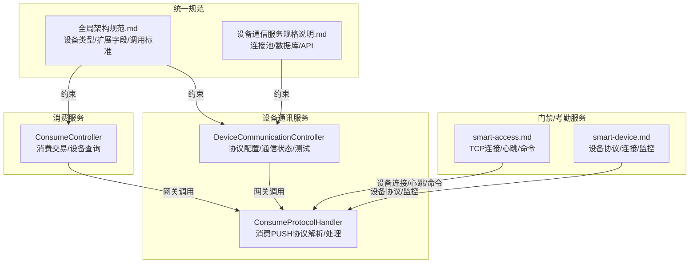
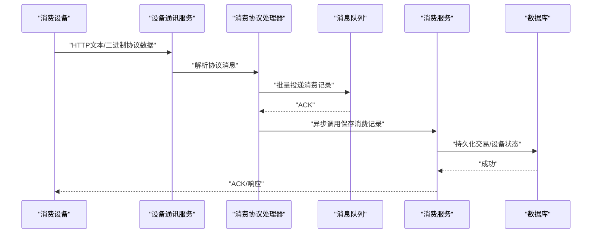
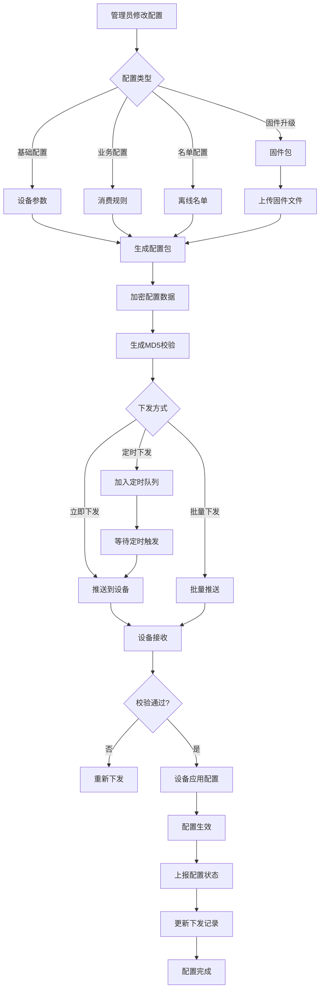
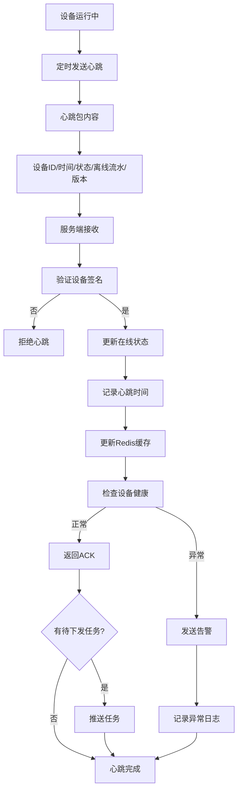
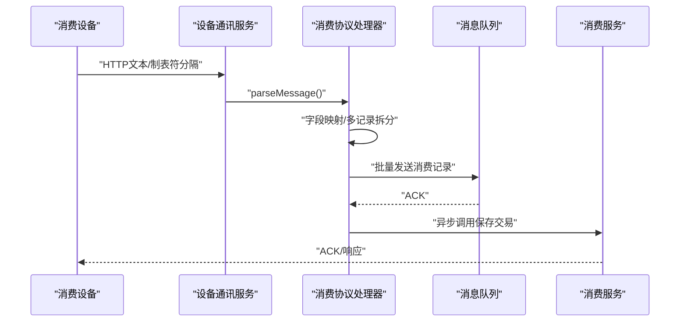
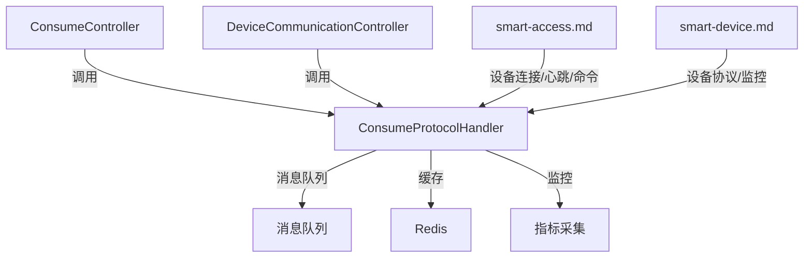
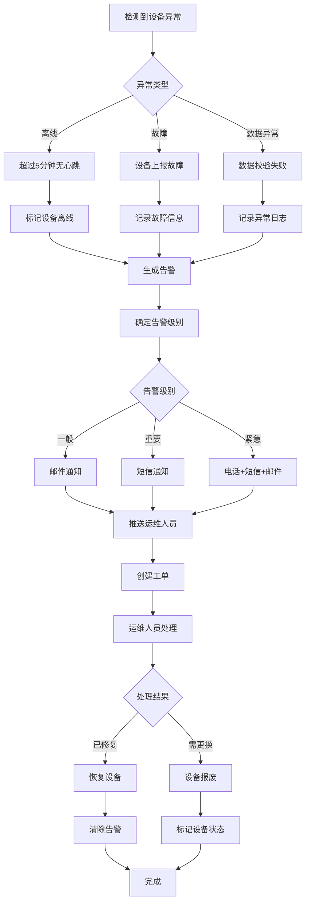

# 设备管理

<cite>
**本文引用的文件**
- [消费模块前端API接口设计.md](file://documentation/03-业务模块/消费/12-前端API接口设计.md)
- [设备管理模块重构设计.md](file://documentation/03-业务模块/消费/14-设备管理模块重构设计.md)
- [ConsumeController.java](file://microservices/ioedream-consume-service/src/main/java/net/lab1024/sa/consume/controller/ConsumeController.java)
- [ConsumeProtocolHandler.java](file://microservices/ioedream-device-comm-service/src/main/java/net/lab1024/sa/devicecomm/protocol/handler/impl/ConsumeProtocolHandler.java)
- [DeviceCommunicationController.java](file://restful_refactor_backup_20251202_014224/microservices_ioedream-device-service_src_main_java_net_lab1024_sa_device_controller_DeviceCommunicationController.java)
- [全局架构规范.md](file://documentation/01-核心规范/架构规范/全局架构规范.md)
- [设备通信服务规格说明.md](file://openspec/changes/seven-microservice-architecture-integration/specs/device-communication-service/spec.md)
- [PHASE2_DEVICE_ENTITY_OPTIMIZATION_PLAN.md](file://documentation/archive/reports-2025-12-04/PHASE2_DEVICE_ENTITY_OPTIMIZATION_PLAN.md)
- [PHASE2_STEP2_DEVICE_ENTITY_EVALUATION.md](file://documentation/archive/reports-2025-12-04/PHASE2_STEP2_DEVICE_ENTITY_EVALUATION.md)
- [smart-access.md](file://documentation/technical/smart-access.md)
- [smart-device.md](file://documentation/technical/smart-device.md)
- [历史告警页面功能布局文档_完善版.md](file://smart-admin-web-javascript/AI开发文档/历史告警页面功能布局文档_完善版.md)
- [real-time-monitoring-enhancement spec.md](file://openspec/changes/archive/completed-proposals/implement-access-control-missing-functions/specs/real-time-monitoring-enhancement/spec.md)
</cite>

## 目录
1. [引言](#引言)
2. [项目结构](#项目结构)
3. [核心组件](#核心组件)
4. [架构总览](#架构总览)
5. [详细组件分析](#详细组件分析)
6. [依赖分析](#依赖分析)
7. [性能考虑](#性能考虑)
8. [故障排查指南](#故障排查指南)
9. [结论](#结论)
10. [附录](#附录)

## 引言
本技术文档围绕消费设备管理展开，覆盖设备注册、配置、状态监控、通信协议、数据交互格式、设备分组与区域适配、固件升级、异常告警与故障排查，以及与门禁、考勤等系统的集成方案，旨在帮助开发者与运维人员快速理解并落地统一设备管控平台。

## 项目结构
- 消费服务提供消费交易、账户、退款、设备状态查询等接口，面向前端与移动端。
- 设备通讯服务负责设备协议解析、心跳处理、状态上报、配置下发、远程控制等。
- 门禁与考勤服务提供设备接入、状态监控与控制能力，支撑统一设备平台。
- 统一架构规范定义了设备类型、扩展字段、服务间调用标准，确保跨系统协同。

图表来源
- [ConsumeController.java](file://microservices/ioedream-consume-service/src/main/java/net/lab1024/sa/consume/controller/ConsumeController.java#L1-L355)
- [DeviceCommunicationController.java](file://restful_refactor_backup_20251202_014224/microservices_ioedream-device-service_src_main_java_net_lab1024_sa_device_controller_DeviceCommunicationController.java#L1-L193)
- [ConsumeProtocolHandler.java](file://microservices/ioedream-device-comm-service/src/main/java/net/lab1024/sa/devicecomm/protocol/handler/impl/ConsumeProtocolHandler.java#L1-L859)
- [smart-access.md](file://documentation/technical/smart-access.md#L1557-L1859)
- [smart-device.md](file://documentation/technical/smart-device.md#L1511-L1803)
- [全局架构规范.md](file://documentation/01-核心规范/架构规范/全局架构规范.md#L1539-L1591)
- [设备通信服务规格说明.md](file://openspec/changes/seven-microservice-architecture-integration/specs/device-communication-service/spec.md#L140-L184)

章节来源
- [消费模块前端API接口设计.md](file://documentation/03-业务模块/消费/12-前端API接口设计.md#L1-L120)
- [设备管理模块重构设计.md](file://documentation/03-业务模块/消费/14-设备管理模块重构设计.md#L1-L120)
- [全局架构规范.md](file://documentation/01-核心规范/架构规范/全局架构规范.md#L1539-L1591)

## 核心组件
- 消费服务控制器：提供消费交易、设备详情、设备统计、实时统计等接口，统一返回格式，严格遵循四层架构边界。
- 设备通讯服务控制器：提供协议配置、通信状态查询、通信统计概览、协议连通性测试等接口。
- 消费协议处理器：解析消费PUSH协议（中控智慧V1.0），支持多条记录批量处理，异步投递到消息队列，具备缓存与监控指标采集能力。
- 设备连接与心跳：基于TCP的设备连接实现，定时心跳、命令下发、事件处理，支撑门禁/考勤等设备类型。
- 统一设备模型与扩展字段：定义设备类型枚举、扩展字段（extendedAttributes）与服务间调用标准，确保跨系统一致性。

章节来源
- [ConsumeController.java](file://microservices/ioedream-consume-service/src/main/java/net/lab1024/sa/consume/controller/ConsumeController.java#L1-L355)
- [DeviceCommunicationController.java](file://restful_refactor_backup_20251202_014224/microservices_ioedream-device-service_src_main_java_net_lab1024_sa_device_controller_DeviceCommunicationController.java#L1-L193)
- [ConsumeProtocolHandler.java](file://microservices/ioedream-device-comm-service/src/main/java/net/lab1024/sa/devicecomm/protocol/handler/impl/ConsumeProtocolHandler.java#L1-L859)
- [smart-access.md](file://documentation/technical/smart-access.md#L1557-L1859)
- [smart-device.md](file://documentation/technical/smart-device.md#L1511-L1803)
- [全局架构规范.md](file://documentation/01-核心规范/架构规范/全局架构规范.md#L1539-L1591)

## 架构总览
消费设备管理采用微服务架构，消费服务与设备通讯服务协同工作，通过网关统一对外提供REST API；设备通过协议处理器对接，心跳与状态上报驱动消费服务侧的设备状态与统计；告警与监控贯穿各服务，形成闭环。

图表来源
- [ConsumeProtocolHandler.java](file://microservices/ioedream-device-comm-service/src/main/java/net/lab1024/sa/devicecomm/protocol/handler/impl/ConsumeProtocolHandler.java#L1-L859)
- [ConsumeController.java](file://microservices/ioedream-consume-service/src/main/java/net/lab1024/sa/consume/controller/ConsumeController.java#L1-L355)

## 详细组件分析

### 设备注册与配置下发
- 设备注册：消费服务提供设备注册接口，支持设备基础信息、网络信息、设备配置、商户信息等字段，注册成功后下发配置至设备。
- 配置下发流程：支持基础配置、业务配置、名单配置、固件升级等类型，生成配置包、加密与校验，支持立即下发、定时下发、批量下发，并记录下发状态与结果。

图表来源
- [设备管理模块重构设计.md](file://documentation/03-业务模块/消费/14-设备管理模块重构设计.md#L136-L178)

章节来源
- [消费模块前端API接口设计.md](file://documentation/03-业务模块/消费/12-前端API接口设计.md#L577-L723)
- [设备管理模块重构设计.md](file://documentation/03-业务模块/消费/14-设备管理模块重构设计.md#L136-L178)

### 设备心跳与状态监控
- 心跳上报：设备定期上报心跳，包含设备状态、离线流水数、CPU/内存/磁盘使用率、温度、电池电量、网络状态、服务状态等。
- 心跳处理：服务端验证签名、更新在线状态、记录心跳时间、更新Redis缓存、健康检查、推送待下发任务、异常时生成告警。

图表来源
- [设备管理模块重构设计.md](file://documentation/03-业务模块/消费/14-设备管理模块重构设计.md#L160-L198)

章节来源
- [消费模块前端API接口设计.md](file://documentation/03-业务模块/消费/12-前端API接口设计.md#L617-L699)
- [设备管理模块重构设计.md](file://documentation/03-业务模块/消费/14-设备管理模块重构设计.md#L160-L198)

### 通信协议与数据交互格式
- 协议类型：消费PUSH协议（中控智慧 V1.0），当前实现为HTTP文本格式（制表符分隔），支持多条记录批量处理。
- 字段映射：SysID、CARDNO、PosTime、PosMoney、Balance、CardRecID、State、MealType、MealDate、RecNo、OPID；双钱包格式额外包含子钱包金额与余额、用户工号。
- 处理流程：解析文本、提取设备编号、构造消息体、异步投递到消息队列，消费服务侧保存交易并返回ACK；支持设备状态消息与余额查询消息处理。

图表来源
- [ConsumeProtocolHandler.java](file://microservices/ioedream-device-comm-service/src/main/java/net/lab1024/sa/devicecomm/protocol/handler/impl/ConsumeProtocolHandler.java#L146-L280)
- [ConsumeProtocolHandler.java](file://microservices/ioedream-device-comm-service/src/main/java/net/lab1024/sa/devicecomm/protocol/handler/impl/ConsumeProtocolHandler.java#L529-L707)

章节来源
- [ConsumeProtocolHandler.java](file://microservices/ioedream-device-comm-service/src/main/java/net/lab1024/sa/devicecomm/protocol/handler/impl/ConsumeProtocolHandler.java#L146-L280)
- [ConsumeProtocolHandler.java](file://microservices/ioedream-device-comm-service/src/main/java/net/lab1024/sa/devicecomm/protocol/handler/impl/ConsumeProtocolHandler.java#L529-L707)

### 设备分组与区域适配
- 设备类型与消费模式：支持刷卡、人脸识别、扫码、自助终端等消费设备类型；消费模式包括固定金额、自由金额、计量计费等。
- 区域与设备适配：设备关联区域时需验证设备能力与区域经营模式匹配，如餐别制区域仅支持定值消费终端或综合终端，超市制区域仅支持商品扫码终端或综合终端。
- 离线能力：餐别制区域需具备离线定值配置能力。

章节来源
- [设备管理模块重构设计.md](file://documentation/03-业务模块/消费/14-设备管理模块重构设计.md#L23-L45)
- [设备管理模块重构设计.md](file://documentation/03-业务模块/消费/14-设备管理模块重构设计.md#L202-L246)
- [消费模块前端API接口设计.md](file://documentation/03-业务模块/消费/12-前端API接口设计.md#L260-L277)

### 固件升级与远程控制
- 固件升级：支持上传固件包，生成配置包、加密与校验，支持立即下发、定时下发、批量下发；设备接收后校验通过即应用配置。
- 远程控制：支持重启、关机、更新、配置、重置等命令，携带参数与操作员信息，消费服务侧记录并反馈。

章节来源
- [设备管理模块重构设计.md](file://documentation/03-业务模块/消费/14-设备管理模块重构设计.md#L136-L178)
- [消费模块前端API接口设计.md](file://documentation/03-业务模块/消费/12-前端API接口设计.md#L701-L723)

### 设备与门禁、考勤系统集成
- 设备类型：统一支持 CAMERA、ACCESS、CONSUME、ATTENDANCE、BIOMETRIC、INTERCOM、ALARM、SENSOR 等设备类型。
- 服务调用：业务微服务通过公共设备服务获取设备信息，设备协议通信通过网关调用设备微服务协议功能。
- 门禁设备：基于TCP协议的设备连接实现，定时心跳、命令下发、事件处理（通行事件、状态响应、告警）。
- 设备协议：摄像头协议示例展示了默认配置、连接、断开、控制、状态获取、监控数据、心跳与事件处理。

章节来源
- [全局架构规范.md](file://documentation/01-核心规范/架构规范/全局架构规范.md#L1539-L1591)
- [smart-access.md](file://documentation/technical/smart-access.md#L1557-L1859)
- [smart-device.md](file://documentation/technical/smart-device.md#L1511-L1803)

## 依赖分析
- 消费服务依赖设备通讯服务的协议处理与状态监控能力，通过网关统一调用。
- 设备通讯服务依赖消息队列进行高吞吐异步处理，依赖缓存与监控指标提升稳定性与可观测性。
- 统一设备模型与扩展字段确保跨系统一致性，避免重复实体类带来的维护成本。

图表来源
- [ConsumeController.java](file://microservices/ioedream-consume-service/src/main/java/net/lab1024/sa/consume/controller/ConsumeController.java#L1-L355)
- [DeviceCommunicationController.java](file://restful_refactor_backup_20251202_014224/microservices_ioedream-device-service_src_main_java_net_lab1024_sa_device_controller_DeviceCommunicationController.java#L1-L193)
- [ConsumeProtocolHandler.java](file://microservices/ioedream-device-comm-service/src/main/java/net/lab1024/sa/devicecomm/protocol/handler/impl/ConsumeProtocolHandler.java#L1-L859)
- [smart-access.md](file://documentation/technical/smart-access.md#L1557-L1859)
- [smart-device.md](file://documentation/technical/smart-device.md#L1511-L1803)

章节来源
- [设备通信服务规格说明.md](file://openspec/changes/seven-microservice-architecture-integration/specs/device-communication-service/spec.md#L140-L184)
- [PHASE2_DEVICE_ENTITY_OPTIMIZATION_PLAN.md](file://documentation/archive/reports-2025-12-04/PHASE2_DEVICE_ENTITY_OPTIMIZATION_PLAN.md#L65-L92)
- [PHASE2_STEP2_DEVICE_ENTITY_EVALUATION.md](file://documentation/archive/reports-2025-12-04/PHASE2_STEP2_DEVICE_ENTITY_EVALUATION.md#L68-L118)

## 性能考虑
- 连接池与负载均衡：设备通讯服务应提供高效的设备连接池管理，支持连接复用、负载均衡与故障转移，减少连接建立开销。
- 缓存策略：对设备在线状态、设备基础信息、设备配置、在线设备列表、告警队列等进行缓存，设置合理的过期时间，降低数据库压力。
- 指标监控：关注设备在线率、设备故障率、心跳延迟、配置下发成功率、告警响应时长等核心指标，建立告警阈值与报表。

章节来源
- [设备通信服务规格说明.md](file://openspec/changes/seven-microservice-architecture-integration/specs/device-communication-service/spec.md#L140-L184)
- [设备管理模块重构设计.md](file://documentation/03-业务模块/消费/14-设备管理模块重构设计.md#L413-L431)

## 故障排查指南
- 设备离线：检查心跳超时、网络连通性、设备签名验证、Redis缓存更新；超过阈值标记离线并生成告警。
- 配置下发失败：核对配置包生成、加密与校验、下发方式（立即/定时/批量）、设备接收与校验结果；失败时重新下发并记录日志。
- 协议解析异常：确认协议格式（制表符分隔）、字段映射、消息类型（消费记录/设备状态/余额查询），异常时记录错误码与错误信息。
- 告警处理：根据告警级别选择推送对象，支持自动升级与重试机制；记录处理过程与升级记录。

图表来源
- [设备管理模块重构设计.md](file://documentation/03-业务模块/消费/14-设备管理模块重构设计.md#L243-L286)

章节来源
- [设备管理模块重构设计.md](file://documentation/03-业务模块/消费/14-设备管理模块重构设计.md#L243-L286)
- [real-time-monitoring-enhancement spec.md](file://openspec/changes/archive/completed-proposals/implement-access-control-missing-functions/specs/real-time-monitoring-enhancement/spec.md#L88-L100)

## 结论
通过统一的设备模型、规范的注册与配置流程、完善的通信协议与监控告警机制，以及与门禁、考勤系统的深度集成，消费设备管理实现了全生命周期的可控、可观测与可运维。建议在生产环境中强化连接池与缓存策略，完善指标监控与告警升级机制，持续优化配置下发与固件升级流程，确保系统高可用与高扩展性。

## 附录
- 设备类型与扩展字段：参考统一规范中的设备类型枚举与扩展字段定义，确保跨系统一致性。
- 告警与通知：结合历史告警页面与实时监控增强规格，完善告警分级、推送与升级策略。

章节来源
- [全局架构规范.md](file://documentation/01-核心规范/架构规范/全局架构规范.md#L1539-L1591)
- [历史告警页面功能布局文档_完善版.md](file://smart-admin-web-javascript/AI开发文档/历史告警页面功能布局文档_完善版.md#L1917-L2195)
- [real-time-monitoring-enhancement spec.md](file://openspec/changes/archive/completed-proposals/implement-access-control-missing-functions/specs/real-time-monitoring-enhancement/spec.md#L145-L167)