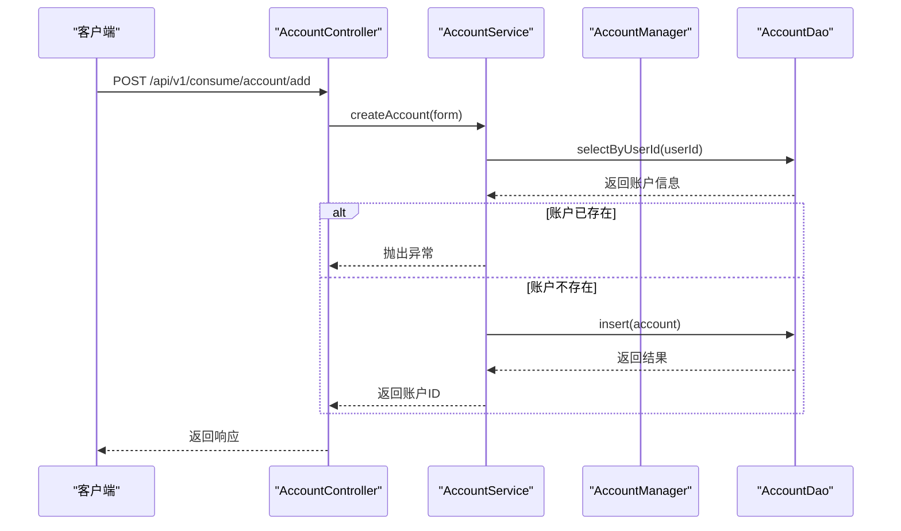
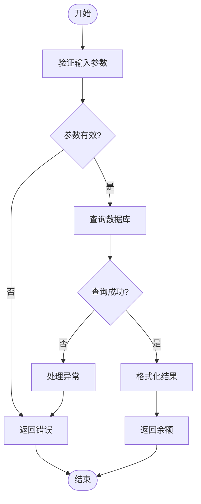
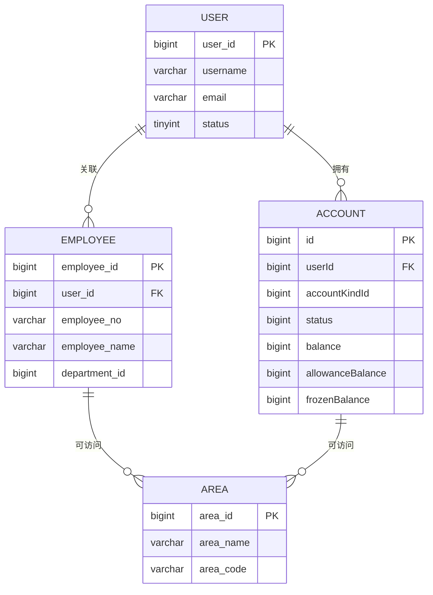
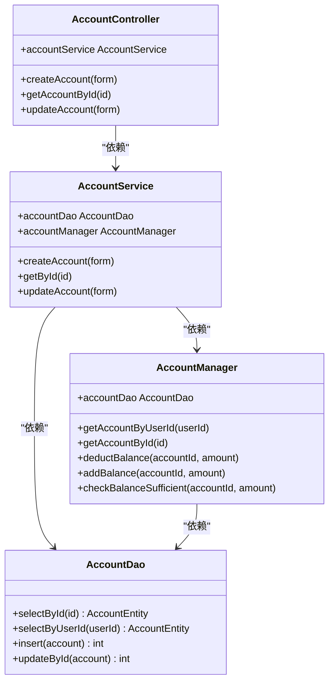
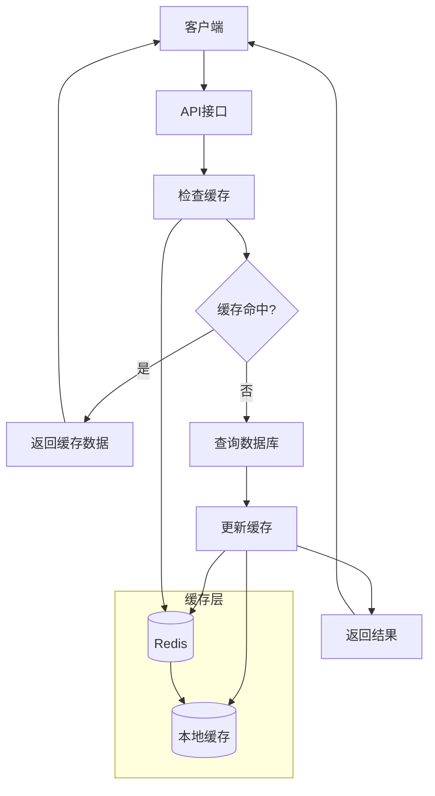

# 账户管理

<cite>
**本文档引用文件**  
- [AccountController.java](file://microservices\ioedream-consume-service\src\main\java\net\lab1024\sa\consume\controller\AccountController.java)
- [AccountService.java](file://microservices\ioedream-consume-service\src\main\java\net\lab1024\sa\consume\service\AccountService.java)
- [AccountServiceImpl.java](file://microservices\ioedream-consume-service\src\main\java\net\lab1024\sa\consume\service\impl\AccountServiceImpl.java)
- [AccountManager.java](file://microservices\ioedream-consume-service\src\main\java\net\lab1024\sa\consume\manager\AccountManager.java)
- [AccountManagerImpl.java](file://microservices\ioedream-consume-service\src\main\java\net\lab1024\sa\consume\manager\impl\AccountManagerImpl.java)
- [AccountDao.java](file://microservices\ioedream-consume-service\src\main\java\net\lab1024\sa\consume\dao\AccountDao.java)
- [AccountEntity.java](file://microservices\ioedream-consume-service\src\main\java\net\lab1024\sa\consume\domain\entity\AccountEntity.java)
- [AccountAddForm.java](file://microservices\ioedream-consume-service\src\main\java\net\lab1024\sa\consume\domain\form\AccountAddForm.java)
- [02-t_user.sql](file://database-scripts\common-service\02-t_user.sql)
- [18-t_employee.sql](file://database-scripts\common-service\18-t_employee.sql)
- [accounts.html](file://smart-admin-web-javascript\consumption-system-refactored copy\pages\accounts.html)
</cite>

## 目录
1. [账户类别设计与配置](#账户类别设计与配置)
2. [账户状态管理](#账户状态管理)
3. [核心接口实现逻辑](#核心接口实现逻辑)
4. [账户与区域权限关联机制](#账户与区域权限关联机制)
5. [前端账户管理界面操作指南](#前端账户管理界面操作指南)
6. [Service层与DAO层交互模式](#service层与dao层交互模式)
7. [缓存策略应用](#缓存策略应用)

## 账户类别设计与配置

消费系统支持多种账户类别，包括员工账户、访客账户和临时账户。账户类别通过`accountKindId`字段进行区分，该字段在`AccountEntity`实体类中定义，用于标识不同类型的账户。

账户类别信息存储在数据库中，通过`account_kind`表进行管理。每个账户类别包含以下属性：
- **类别ID**：唯一标识符
- **类别名称**：如"员工账户"、"访客账户"等
- **权限配置**：定义该类别账户可访问的区域和功能
- **消费限额**：设置单次、每日、每月消费上限
- **有效期**：定义账户的有效期限

在创建账户时，需要指定账户类别ID。系统通过`AccountAddForm`表单接收创建请求，其中`accountKindId`为必填字段。账户类别配置支持动态调整，管理员可通过管理界面修改各类别的权限和限额设置。

前端界面提供了账户类别管理功能，包括新增、编辑和删除操作。界面采用卡片式布局展示各类别信息，包含类别名称、用户数量等统计信息。

**Section sources**
- [AccountEntity.java](file://microservices\ioedream-consume-service\src\main\java\net\lab1024\sa\consume\domain\entity\AccountEntity.java#L92-L93)
- [AccountAddForm.java](file://microservices\ioedream-consume-service\src\main\java\net\lab1024\sa\consume\domain\form\AccountAddForm.java#L30-L31)
- [accounts.html](file://smart-admin-web-javascript\consumption-system-refactored copy\pages\accounts.html#L548-L560)

## 账户状态管理

系统定义了三种主要账户状态：正常、冻结和注销。这些状态通过`status`字段在`AccountEntity`实体类中表示，具体值如下：
- **1 - 正常**：账户处于可用状态，可以进行消费和查询操作
- **2 - 冻结**：账户被临时冻结，无法进行消费，但可以查询余额
- **3 - 注销**：账户已被永久关闭，所有功能不可用

账户状态管理遵循严格的业务规则：
1. **状态转换规则**：
   - 正常 → 冻结：通过冻结操作实现
   - 冻结 → 正常：通过解冻操作实现
   - 正常/冻结 → 注销：通过关闭操作实现
   - 注销状态不可逆

2. **状态变更操作**：
   - **启用账户**：将账户状态设置为正常
   - **禁用账户**：将账户状态设置为冻结
   - **冻结账户**：将账户状态设置为冻结
   - **解冻账户**：将账户状态设置为正常
   - **关闭账户**：将账户状态设置为注销

3. **状态验证**：
   - 只有正常状态的账户才能进行消费
   - 冻结和注销状态的账户不能进行余额变动操作
   - 系统在每次消费前会验证账户状态

状态变更操作均记录在审计日志中，包含操作人、操作时间和原因等信息。

**Section sources**
- [AccountEntity.java](file://microservices\ioedream-consume-service\src\main\java\net\lab1024\sa\consume\domain\entity\AccountEntity.java#L117-L118)
- [AccountServiceImpl.java](file://microservices\ioedream-consume-service\src\main\java\net\lab1024\sa\consume\service\impl\AccountServiceImpl.java#L61-L63)
- [AccountService.java](file://microservices\ioedream-consume-service\src\main\java\net\lab1024\sa\consume\service\AccountService.java#L159-L193)

## 核心接口实现逻辑

### 账户创建接口

账户创建接口通过`POST /api/v1/consume/account/add`提供服务。实现逻辑如下：
1. 接收`AccountAddForm`表单数据
2. 验证用户ID和账户类别ID是否为空
3. 检查用户是否已存在账户
4. 构建`AccountEntity`实体，设置初始余额（转换为分）
5. 保存到数据库

**Diagram sources**
- [AccountController.java](file://microservices\ioedream-consume-service\src\main\java\net\lab1024\sa\consume\controller\AccountController.java#L78-L109)
- [AccountServiceImpl.java](file://microservices\ioedream-consume-service\src\main\java\net\lab1024\sa\consume\service\impl\AccountServiceImpl.java#L71-L119)

### 余额查询接口

余额查询接口提供两种方式：
1. **通过账户ID查询**：`GET /api/v1/consume/account/{id}`
2. **通过用户ID查询**：`GET /api/v1/consume/account/balance/user/{userId}`

实现逻辑：
1. 验证账户ID或用户ID有效性
2. 从数据库查询账户信息
3. 返回余额信息（单位：元）

**Diagram sources**
- [AccountController.java](file://microservices\ioedream-consume-service\src\main\java\net\lab1024\sa\consume\controller\AccountController.java#L140-L173)
- [AccountServiceImpl.java](file://microservices\ioedream-consume-service\src\main\java\net\lab1024\sa\consume\service\impl\AccountServiceImpl.java#L216-L241)

### 账户变更接口

账户变更接口支持多种操作：
- **更新账户信息**：`PUT /api/v1/consume/account/update`
- **增加余额**：`POST /api/v1/consume/account/balance/add`
- **扣减余额**：`POST /api/v1/consume/account/balance/deduct`
- **冻结余额**：`POST /api/v1/consume/account/balance/freeze`
- **解冻余额**：`POST /api/v1/consume/account/balance/unfreeze`

所有变更操作均使用事务管理，确保数据一致性。余额变动以"分"为单位存储，对外提供"元"为单位的接口。

**Section sources**
- [AccountController.java](file://microservices\ioedream-consume-service\src\main\java\net\lab1024\sa\consume\controller\AccountController.java#L117-L359)
- [AccountServiceImpl.java](file://microservices\ioedream-consume-service\src\main\java\net\lab1024\sa\consume\service\impl\AccountServiceImpl.java#L127-L621)

## 账户与区域权限关联机制

账户与区域权限的关联通过用户-账户-区域的层级关系实现。系统架构如下：

**Diagram sources**
- [02-t_user.sql](file://database-scripts\common-service\02-t_user.sql#L8-L39)
- [18-t_employee.sql](file://database-scripts\common-service\18-t_employee.sql#L8-L68)
- [AccountEntity.java](file://microservices\ioedream-consume-service\src\main\java\net\lab1024\sa\consume\domain\entity\AccountEntity.java#L48-L107)

权限关联机制特点：
1. **多层级关联**：用户 → 账户 → 区域
2. **继承权限**：员工账户自动继承其部门的区域访问权限
3. **独立权限**：访客账户可单独配置区域访问权限
4. **动态更新**：权限变更实时生效

数据模型设计中，`AccountEntity`包含`userId`字段关联用户，通过用户信息获取其所属部门和岗位，进而确定可访问区域。同时，账户也可直接关联特定区域，实现精细化权限控制。

**Section sources**
- [AccountEntity.java](file://microservices\ioedream-consume-service\src\main\java\net\lab1024\sa\consume\domain\entity\AccountEntity.java#L61-L62)
- [02-t_user.sql](file://database-scripts\common-service\02-t_user.sql#L9-L16)
- [18-t_employee.sql](file://database-scripts\common-service\18-t_employee.sql#L10-L19)

## 前端账户管理界面操作指南

### 账户详情查看

1. 登录系统管理后台
2. 导航至"账户管理"模块
3. 在账户列表中选择目标账户
4. 点击"查看详情"按钮
5. 查看账户基本信息、余额和状态

界面显示内容包括：
- 账户ID和用户ID
- 账户类别和状态
- 现金余额和补贴余额
- 冻结金额
- 创建时间和更新时间

### 余额调整操作流程

1. 在账户详情页面，点击"余额管理"选项卡
2. 选择操作类型：
   - **增加余额**：输入增加金额和备注
   - **扣减余额**：输入扣减金额和原因
   - **冻结余额**：输入冻结金额
   - **解冻余额**：输入解冻金额
3. 确认操作信息
4. 输入操作密码（如有）
5. 提交操作

系统会记录所有余额调整操作，包括操作人、时间、金额和原因，确保操作可追溯。

**Section sources**
- [accounts.html](file://smart-admin-web-javascript\consumption-system-refactored copy\pages\accounts.html#L533-L560)
- [AccountController.java](file://microservices\ioedream-consume-service\src\main\java\net\lab1024\sa\consume\controller\AccountController.java#L269-L359)

## Service层与DAO层交互模式

系统采用四层架构：Controller → Service → Manager → DAO，各层职责明确：

**Diagram sources**
- [AccountController.java](file://microservices\ioedream-consume-service\src\main\java\net\lab1024\sa\consume\controller\AccountController.java#L58-L59)
- [AccountServiceImpl.java](file://microservices\ioedream-consume-service\src\main\java\net\lab1024\sa\consume\service\impl\AccountServiceImpl.java#L54-L58)
- [AccountManagerImpl.java](file://microservices\ioedream-consume-service\src\main\java\net\lab1024\sa\consume\manager\impl\AccountManagerImpl.java#L34-L35)

交互模式特点：
1. **依赖注入**：使用`@Resource`注解注入依赖
2. **事务管理**：在Service层使用`@Transactional`注解管理事务
3. **异常处理**：统一在Service层处理业务异常
4. **参数验证**：在Service层进行业务逻辑验证

Manager层负责复杂业务逻辑编排，保持为纯Java类，不使用Spring注解，通过构造函数注入依赖。

**Section sources**
- [AccountServiceImpl.java](file://microservices\ioedream-consume-service\src\main\java\net\lab1024\sa\consume\service\impl\AccountServiceImpl.java#L54-L58)
- [AccountManagerImpl.java](file://microservices\ioedream-consume-service\src\main\java\net\lab1024\sa\consume\manager\impl\AccountManagerImpl.java#L44-L46)
- [AccountDao.java](file://microservices\ioedream-consume-service\src\main\java\net\lab1024\sa\consume\dao\AccountDao.java#L23-L24)

## 缓存策略应用

系统采用多级缓存策略提升性能：

**Diagram sources**
- [AccountServiceImpl.java](file://microservices\ioedream-consume-service\src\main\java\net\lab1024\sa\consume\service\impl\AccountServiceImpl.java#L225-L232)
- [AccountManagerImpl.java](file://microservices\ioedream-consume-service\src\main\java\net\lab1024\sa\consume\manager\impl\AccountManagerImpl.java#L55-L62)

缓存策略具体实现：
1. **缓存层级**：
   - 本地缓存：使用Caffeine，存储热点数据
   - 分布式缓存：使用Redis，存储共享数据

2. **缓存键设计**：
   - 账户ID缓存：`account:id:{accountId}`
   - 用户ID缓存：`account:userId:{userId}`

3. **缓存更新**：
   - 写操作后立即更新缓存
   - 设置合理的过期时间
   - 使用缓存穿透保护

4. **缓存一致性**：
   - 采用Cache-Aside模式
   - 写操作先更新数据库，再删除缓存
   - 读操作先读缓存，未命中再读数据库

缓存策略显著提升了账户查询性能，特别是高频访问的余额查询接口。

**Section sources**
- [AccountServiceImpl.java](file://microservices\ioedream-consume-service\src\main\java\net\lab1024\sa\consume\service\impl\AccountServiceImpl.java#L225-L232)
- [AccountManagerImpl.java](file://microservices\ioedream-consume-service\src\main\java\net\lab1024\sa\consume\manager\impl\AccountManagerImpl.java#L55-L62)