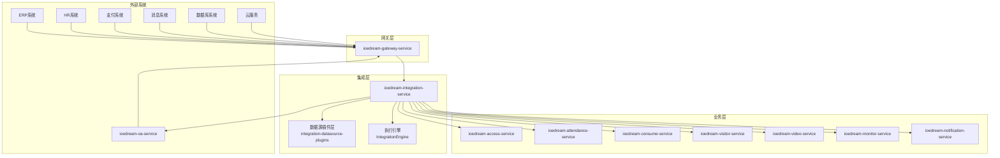
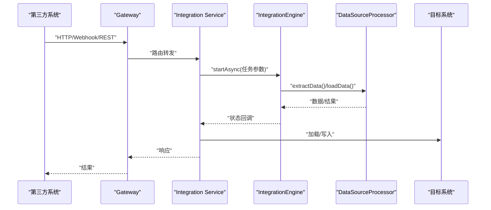
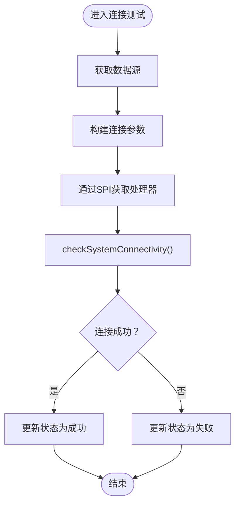
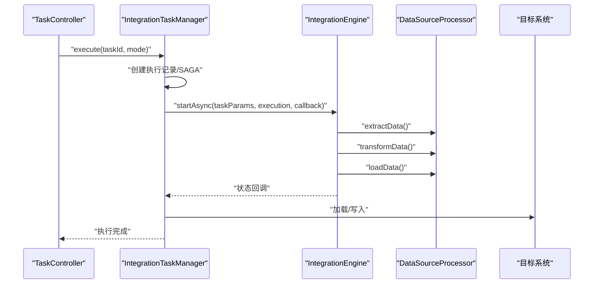
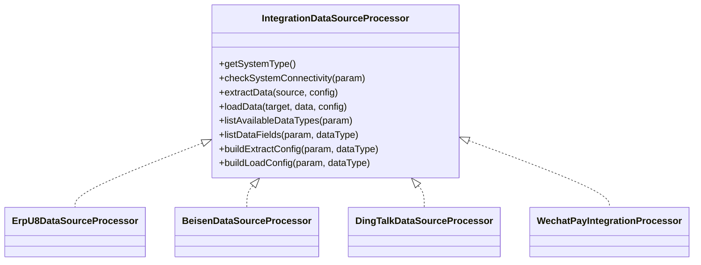
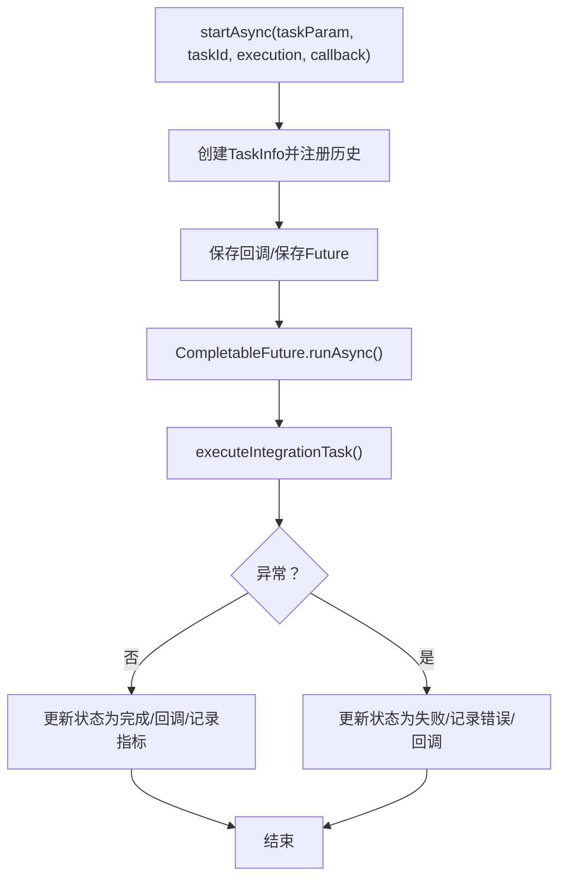
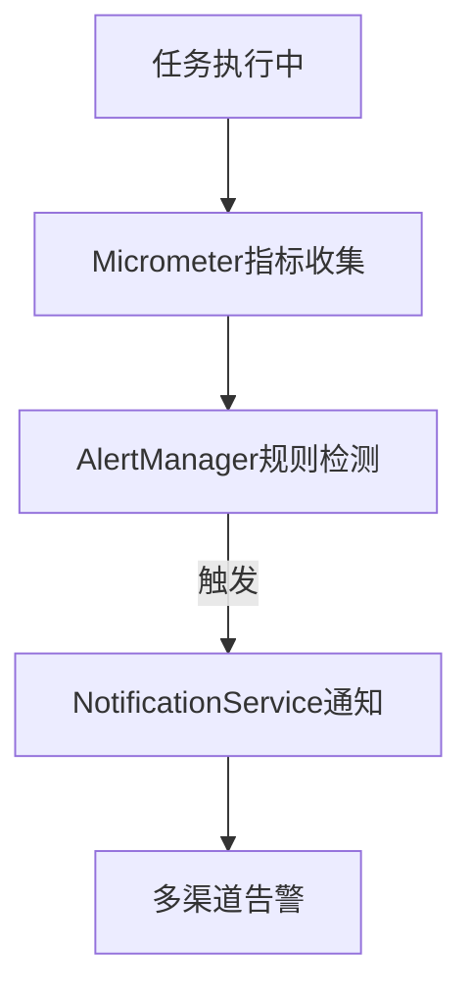
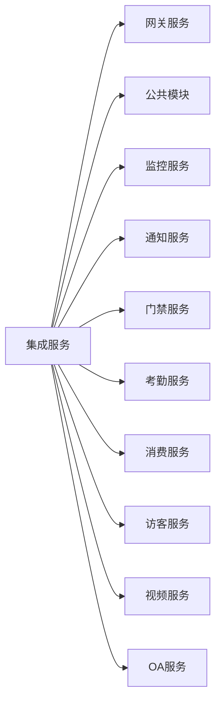

# 第三方系统集成实现

<cite>
**本文引用的文件**
- [第三方系统集成实现方案.md](file://documentation/03-业务模块/第三方系统集成实现方案.md)
- [ARCHITECTURE_REFACTORING_PLAN.md](file://documentation/architecture/ARCHITECTURE_REFACTORING_PLAN.md)
- [OPTIMAL_ARCHITECTURE_DESIGN.md](file://documentation/architecture/OPTIMAL_ARCHITECTURE_DESIGN.md)
- [design.md](file://openspec/changes/refactor-optimal-seven-microservice-architecture/design.md)
- [spec.md](file://openspec/changes/refactor-optimal-seven-microservice-architecture/specs/microservice-consolidation/spec.md)
- [spec.md](file://openspec/changes/fix-critical-architecture-violations/specs/architecture-compliance/spec.md)
- [design.md](file://openspec/changes/seven-microservice-architecture-integration/design.md)
- [spec.md](file://openspec/changes/archive/completed-proposals/implement-third-party-system-integration/specs/third-party-system-integration/spec.md)
- [design.md](file://openspec/changes/archive/completed-proposals/implement-third-party-system-integration/design.md)
- [ioedream-gateway-service/pom.xml](file://microservices/ioedream-gateway-service/pom.xml)
- [ioedream-gateway-service/src/main/resources/application.yml](file://microservices/ioedream-gateway-service/src/main/resources/application.yml)
- [ioedream-common-service/pom.xml](file://microservices/ioedream-common-service/pom.xml)
- [ioedream-common-service/src/main/resources/application.yml](file://microservices/ioedream-common-service/src/main/resources/application.yml)
- [ioedream-device-comm-service/pom.xml](file://microservices/ioedream-device-comm-service/pom.xml)
- [ioedream-device-comm-service/src/main/resources/application.yml](file://microservices/ioedream-device-comm-service/src/main/resources/application.yml)
- [ioedream-attendance-service/pom.xml](file://microservices/ioedream-attendance-service/pom.xml)
- [ioedream-attendance-service/src/main/resources/application.yml](file://microservices/ioedream-attendance-service/src/main/resources/application.yml)
- [ioedream-consume-service/pom.xml](file://microservices/ioedream-consume-service/pom.xml)
- [ioedream-consume-service/src/main/resources/application.yml](file://microservices/ioedream-consume-service/src/main/resources/application.yml)
- [ioedream-access-service/pom.xml](file://microservices/ioedream-access-service/pom.xml)
- [ioedream-access-service/src/main/resources/application.yml](file://microservices/ioedream-access-service/src/main/resources/application.yml)
- [ioedream-visitor-service/pom.xml](file://microservices/ioedream-visitor-service/pom.xml)
- [ioedream-visitor-service/src/main/resources/application.yml](file://microservices/ioedream-visitor-service/src/main/resources/application.yml)
- [ioedream-video-service/pom.xml](file://microservices/ioedream-video-service/pom.xml)
- [ioedream-video-service/src/main/resources/application.yml](file://microservices/ioedream-video-service/src/main/resources/application.yml)
- [ioedream-oa-service/pom.xml](file://microservices/ioedream-oa-service/pom.xml)
- [ioedream-oa-service/src/main/resources/application.yml](file://microservices/ioedream-oa-service/src/main/resources/application.yml)
- [ioedream-monitor-service/pom.xml](file://microservices/ioedream-monitor-service/pom.xml)
- [ioedream-monitor-service/src/main/resources/application.yml](file://microservices/ioedream-monitor-service/src/main/resources/application.yml)
- [ioedream-notification-service/pom.xml](file://microservices/ioedream-notification-service/pom.xml)
- [ioedream-notification-service/src/main/resources/application.yml](file://microservices/ioedream-notification-service/src/main/resources/application.yml)
- [ioedream-integration-service/pom.xml](file://microservices/ioedream-integration-service/pom.xml)
- [ioedream-integration-service/src/main/resources/application.yml](file://microservices/ioedream-integration-service/src/main/resources/application.yml)
- [ioedream-integration-service/src/main/java/**](file://microservices/ioedream-integration-service/src/main/java/)
- [ioedream-gateway-service/src/main/java/**](file://microservices/ioedream-gateway-service/src/main/java/)
- [ioedream-common-service/src/main/java/**](file://microservices/ioedream-common-service/src/main/java/)
- [ioedream-device-comm-service/src/main/java/**](file://microservices/ioedream-device-comm-service/src/main/java/)
- [ioedream-attendance-service/src/main/java/**](file://microservices/ioedream-attendance-service/src/main/java/)
- [ioedream-consume-service/src/main/java/**](file://microservices/ioedream-consume-service/src/main/java/)
- [ioedream-access-service/src/main/java/**](file://microservices/ioedream-access-service/src/main/java/)
- [ioedream-visitor-service/src/main/java/**](file://microservices/ioedream-visitor-service/src/main/java/)
- [ioedream-video-service/src/main/java/**](file://microservices/ioedream-video-service/src/main/java/)
- [ioedream-oa-service/src/main/java/**](file://microservices/ioedream-oa-service/src/main/java/)
- [ioedream-monitor-service/src/main/java/**](file://microservices/ioedream-monitor-service/src/main/java/)
- [ioedream-notification-service/src/main/java/**](file://microservices/ioedream-notification-service/src/main/java/)
</cite>

## 目录
1. [简介](#简介)
2. [项目结构](#项目结构)
3. [核心组件](#核心组件)
4. [架构总览](#架构总览)
5. [详细组件分析](#详细组件分析)
6. [依赖分析](#依赖分析)
7. [性能考量](#性能考量)
8. [故障排查指南](#故障排查指南)
9. [结论](#结论)
10. [附录](#附录)

## 简介
本文件面向“第三方系统集成实现”，基于仓库内的《IOE-DREAM第三方系统集成实现方案》与相关架构、规范文档，系统梳理了从数据源管理、任务编排、执行引擎、监控告警到部署实施的全链路能力，帮助读者快速理解并落地集成方案。方案强调微服务架构、四层架构规范、插件化扩展、多级缓存、SAGA分布式事务、智能调度与监控告警等关键能力，覆盖ERP、HR、OA、支付、消息、数据库、云服务等15+类第三方系统的对接路径与最佳实践。

## 项目结构
- 微服务划分：包含网关服务、公共模块、设备通讯、门禁、考勤、视频、消费、访客、OA、监控、通知等服务，以及新增的集成服务（ioedream-integration-service）。
- 网关服务（ioedream-gateway-service）：统一入口，承担路由、限流熔断、安全认证等职责。
- 集成服务（ioedream-integration-service）：负责第三方系统数据源管理、任务管理、执行引擎、SAGA事务编排、监控指标与告警联动。
- 公共模块（ioedream-common-service）：承载通用能力，如鉴权、身份、通知等。
- 设备通讯服务（ioedream-device-comm-service）：设备协议、通信状态、数据采集等。
- 其他业务服务：门禁、考勤、消费、访客、视频、OA等，按业务域独立部署。

图表来源
- [第三方系统集成实现方案.md](file://documentation/03-业务模块/第三方系统集成实现方案.md#L113-L193)
- [ioedream-gateway-service/pom.xml](file://microservices/ioedream-gateway-service/pom.xml)
- [ioedream-integration-service/pom.xml](file://microservices/ioedream-integration-service/pom.xml)

章节来源
- [第三方系统集成实现方案.md](file://documentation/03-业务模块/第三方系统集成实现方案.md#L195-L204)

## 核心组件
- 数据源管理（IntegrationDataSourceController/Service）：提供第三方系统数据源的创建、连接测试、更新、删除；通过SPI动态加载各系统处理器，统一参数校验与连接测试。
- 任务管理（IntegrationTaskController/Manager）：任务定义、启动、取消、状态跟踪；基于SAGA事务编排“校验源系统→提取数据→转换数据→加载目标→通知完成”五步流程。
- 执行引擎（IntegrationEngine）：基于线程池与异步任务，封装任务生命周期、状态回调、历史记录与指标收集。
- 数据源插件层（integration-datasource-plugins）：以SPI机制实现对ERP、HR、OA、支付、消息等系统的处理器扩展。
- 监控与告警：Micrometer + Prometheus + AlertManager + Grafana，提供任务计数、耗时、数据量、系统连通性等指标与告警通道。
- 网关与服务通信：统一通过GatewayServiceClient进行服务间通信，避免直接FeignClient调用，确保服务发现与路由一致。

章节来源
- [第三方系统集成实现方案.md](file://documentation/03-业务模块/第三方系统集成实现方案.md#L206-L239)
- [第三方系统集成实现方案.md](file://documentation/03-业务模块/第三方系统集成实现方案.md#L308-L508)
- [第三方系统集成实现方案.md](file://documentation/03-业务模块/第三方系统集成实现方案.md#L606-L744)
- [spec.md](file://openspec/changes/fix-critical-architecture-violations/specs/architecture-compliance/spec.md#L42-L53)

## 架构总览
方案采用“接入层→网关层→集成管理层→业务逻辑层→数据源管理层→连接器插件层→执行引擎层→持久化层”的七层架构，强调：
- 微服务架构与四层架构边界（Controller→Service→Manager→DAO）。
- 插件化扩展（SPI）与多级缓存（本地+Redis+网关）。
- SAGA分布式事务与智能调度（Quartz+Nacos）。
- 监控告警与通知（Prometheus+Grafana+AlertManager+通知服务）。

图表来源
- [第三方系统集成实现方案.md](file://documentation/03-业务模块/第三方系统集成实现方案.md#L113-L193)
- [第三方系统集成实现方案.md](file://documentation/03-业务模块/第三方系统集成实现方案.md#L800-L895)

## 详细组件分析

### 数据源管理组件
- 控制器职责：提供数据源创建、连接测试、更新、删除等接口，统一返回ResponseDTO。
- 服务层职责：构建参数、校验参数、构建连接参数、保存到数据库、缓存到Redis；通过SPI获取对应处理器执行连接测试。
- 关键流程：连接测试通过后更新连接状态；失败时回滚并记录错误。

图表来源
- [第三方系统集成实现方案.md](file://documentation/03-业务模块/第三方系统集成实现方案.md#L310-L383)

章节来源
- [第三方系统集成实现方案.md](file://documentation/03-业务模块/第三方系统集成实现方案.md#L206-L249)
- [第三方系统集成实现方案.md](file://documentation/03-业务模块/第三方系统集成实现方案.md#L310-L383)

### 任务执行与SAGA编排
- 任务管理器：创建执行记录、创建SAGA事务、异步启动执行引擎、更新执行状态。
- SAGA步骤：校验源系统→提取数据→转换数据→加载目标→通知完成，每步均有补偿操作。
- 执行引擎：线程池异步执行，回调状态，更新任务历史与指标。

图表来源
- [第三方系统集成实现方案.md](file://documentation/03-业务模块/第三方系统集成实现方案.md#L395-L508)
- [第三方系统集成实现方案.md](file://documentation/03-业务模块/第三方系统集成实现方案.md#L658-L744)

章节来源
- [第三方系统集成实现方案.md](file://documentation/03-业务模块/第三方系统集成实现方案.md#L395-L508)
- [第三方系统集成实现方案.md](file://documentation/03-业务模块/第三方系统集成实现方案.md#L658-L744)

### 数据源插件层（SPI）
- 接口职责：参数处理、连接管理、数据操作、元数据查询、配置生成。
- 典型实现：用友U8、北森、钉钉、微信支付等系统处理器，分别实现对应系统的连接测试、数据提取与加载。
- SPI配置：通过META-INF/services注册处理器，运行时动态加载。

图表来源
- [第三方系统集成实现方案.md](file://documentation/03-业务模块/第三方系统集成实现方案.md#L578-L603)
- [第三方系统集成实现方案.md](file://documentation/03-业务模块/第三方系统集成实现方案.md#L1265-L1333)
- [第三方系统集成实现方案.md](file://documentation/03-业务模块/第三方系统集成实现方案.md#L1555-L1688)
- [第三方系统集成实现方案.md](file://documentation/03-业务模块/第三方系统集成实现方案.md#L1741-L1818)
- [第三方系统集成实现方案.md](file://documentation/03-业务模块/第三方系统集成实现方案.md#L1820-L1918)
- [第三方系统集成实现方案.md](file://documentation/03-业务模块/第三方系统集成实现方案.md#L1920-L2000)

章节来源
- [第三方系统集成实现方案.md](file://documentation/03-业务模块/第三方系统集成实现方案.md#L578-L603)
- [第三方系统集成实现方案.md](file://documentation/03-业务模块/第三方系统集成实现方案.md#L1265-L1333)

### 执行引擎与异步任务
- 引擎特性：单例、任务存储、历史记录、状态回调、线程池（核心/最大/队列容量/拒绝策略）。
- 异步执行：提交到线程池，执行核心逻辑（提取→转换→加载→通知），回调成功/失败，更新状态与历史。

图表来源
- [第三方系统集成实现方案.md](file://documentation/03-业务模块/第三方系统集成实现方案.md#L606-L744)

章节来源
- [第三方系统集成实现方案.md](file://documentation/03-业务模块/第三方系统集成实现方案.md#L606-L744)

### 监控与告警
- 指标体系：任务总数、任务耗时、处理数据量、系统连通性等。
- 告警规则：任务失败率、同步延迟、连接失败、API响应超时、数据量异常波动。
- 通知渠道：邮件、短信、企业微信、钉钉机器人、Webhook。

图表来源
- [第三方系统集成实现方案.md](file://documentation/03-业务模块/第三方系统集成实现方案.md#L1034-L1091)

章节来源
- [第三方系统集成实现方案.md](file://documentation/03-业务模块/第三方系统集成实现方案.md#L1034-L1091)

### 网关与服务通信
- 统一通过GatewayServiceClient进行服务间通信，避免直接FeignClient调用。
- 服务发现与路由：所有服务发现与调用均通过网关，确保一致性与可观测性。

章节来源
- [spec.md](file://openspec/changes/fix-critical-architecture-violations/specs/architecture-compliance/spec.md#L42-L53)

## 依赖分析
- 微服务模块依赖：集成服务依赖网关、公共模块、监控与通知服务；业务服务通过网关进行内部通信。
- 技术栈依赖：Spring Boot 3.5.4、Spring Cloud 2023.0.3、Nacos、MySQL、Redis、RabbitMQ、Quartz、Micrometer、Prometheus、Grafana、AlertManager。
- 架构约束：严格四层架构、Jakarta EE包名规范、零容忍规则（如@Autowired禁止、Repository后缀禁止等）。

图表来源
- [第三方系统集成实现方案.md](file://documentation/03-业务模块/第三方系统集成实现方案.md#L195-L204)
- [OPTIMAL_ARCHITECTURE_DESIGN.md](file://documentation/architecture/OPTIMAL_ARCHITECTURE_DESIGN.md#L749-L760)

章节来源
- [design.md](file://openspec/changes/refactor-optimal-seven-microservice-architecture/design.md#L1-L130)
- [design.md](file://openspec/changes/seven-microservice-architecture-integration/design.md#L138-L176)
- [spec.md](file://openspec/changes/refactor-optimal-seven-microservice-architecture/specs/microservice-consolidation/spec.md#L182-L212)
- [OPTIMAL_ARCHITECTURE_DESIGN.md](file://documentation/architecture/OPTIMAL_ARCHITECTURE_DESIGN.md#L749-L760)

## 性能考量
- 多级缓存：本地Caffeine + Redis + 网关缓存，降低数据库压力与第三方系统调用频率。
- 线程池与异步：执行引擎线程池参数（核心/最大/队列/拒绝策略）直接影响吞吐与稳定性。
- 任务调度：Quartz + Nacos分布式调度，支持任务依赖、失败重试与故障恢复。
- 指标与监控：Micrometer + Prometheus + Grafana，结合告警规则，及时发现性能瓶颈。
- 数据批处理：插件层支持分页与批量写入，减少网络往返与第三方系统压力。

[本节为通用指导，不直接分析具体文件]

## 故障排查指南
- 网关客户端方法签名不匹配：确认GatewayServiceClient方法签名，避免错误调用导致编译失败。
- 架构违规（@Autowired/@Repository）：确保使用@Resource与@Mapper，严格四层架构边界。
- 网关客户端实现冲突：删除重复实现类，保留唯一实现，避免Java语法错误。
- 服务间通信：统一通过GatewayServiceClient，避免直接FeignClient调用。
- 连接测试失败：检查数据源参数、网络连通性、第三方系统凭据与API限制。

章节来源
- [spec.md](file://openspec/changes/fix-critical-architecture-violations/specs/architecture-compliance/spec.md#L29-L53)
- [GATEWAY_CLIENT_ARCHITECTURE_FIX.md](file://documentation/archive/reports-2025-12-04/GATEWAY_CLIENT_ARCHITECTURE_FIX.md#L1-L133)
- [FINAL_FIX_SUMMARY_REPORT.md](file://documentation/archive/reports-2025-12-04/FINAL_FIX_SUMMARY_REPORT.md#L175-L193)

## 结论
该集成方案以“插件化+四层架构+分布式事务+智能调度+监控告警”为核心，提供了从数据源接入、任务编排到执行与观测的全链路能力。通过网关统一入口与服务通信规范，确保系统在高并发、多系统对接场景下的稳定性与可维护性。建议在实施过程中严格遵循架构规范与部署配置，持续完善监控与告警策略，保障第三方系统集成的可靠性与可扩展性。

[本节为总结性内容，不直接分析具体文件]

## 附录
- 部署实施：Docker与Kubernetes部署配置、Nacos配置、数据库与缓存初始化、健康检查与指标导出。
- API规范：遵循RESTful设计原则，统一使用@Valid参数校验与ResponseDTO返回格式。
- 微服务整合：参考最优七微服务架构设计，确保功能迁移完整性与前端兼容性。

章节来源
- [第三方系统集成实现方案.md](file://documentation/03-业务模块/第三方系统集成实现方案.md#L2014-L2399)
- [spec.md](file://openspec/changes/archive/completed-proposals/implement-third-party-system-integration/specs/third-party-system-integration/spec.md#L443-L466)
- [design.md](file://openspec/changes/refactor-optimal-seven-microservice-architecture/design.md#L1-L130)
- [design.md](file://openspec/changes/seven-microservice-architecture-integration/design.md#L138-L176)