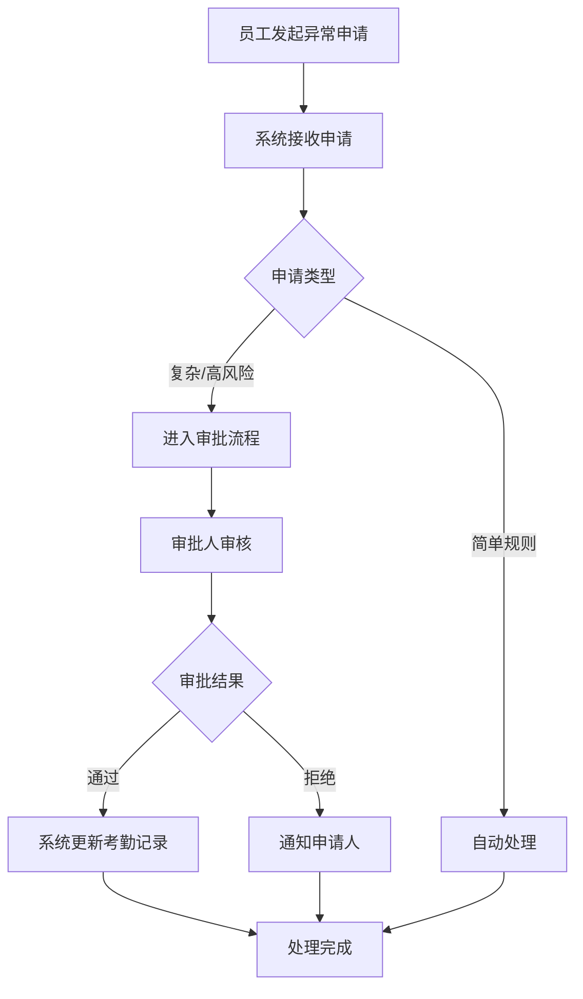
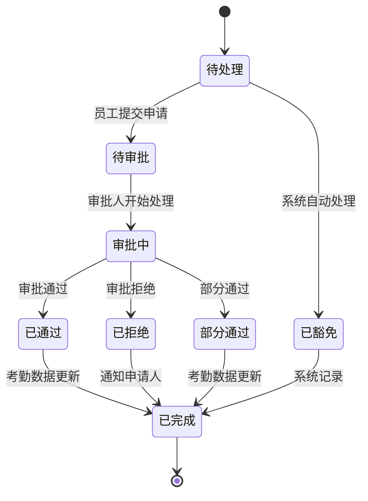
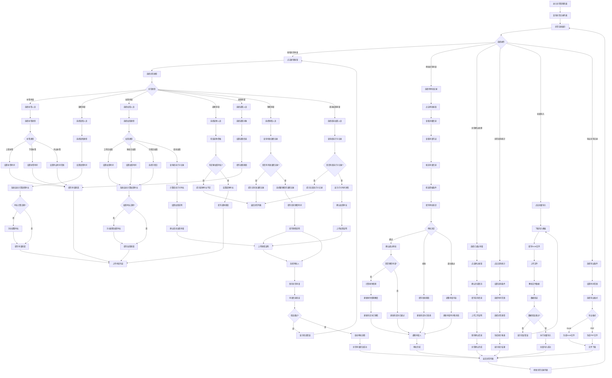

# 异常处理流程

<cite>
**本文档引用文件**   
- [AttendanceLeaveController.java](file://microservices\ioedream-attendance-service\src\main\java\net\lab1024\sa\attendance\controller\AttendanceLeaveController.java)
- [AttendanceLeaveServiceImpl.java](file://microservices\ioedream-attendance-service\src\main\java\net\lab1024\sa\attendance\service\impl\AttendanceLeaveServiceImpl.java)
- [异常管理.md](file://documentation\03-业务模块\考勤\异常管理.md)
- [考勤业务菜单功能流程图.md](file://documentation\03-业务模块\考勤\考勤业务菜单功能流程图.md)
- [application.yml](file://microservices\ioedream-attendance-service\src\main\resources\application.yml)
</cite>

## 目录
1. [引言](#引言)
2. [异常处理模式](#异常处理模式)
3. [异常处理时效性要求](#异常处理时效性要求)
4. [异常处理记录追溯](#异常处理记录追溯)
5. [异常处理状态机](#异常处理状态机)
6. [异常处理流程图](#异常处理流程图)
7. [结论](#结论)

## 引言

本文档详细阐述了考勤系统中异常处理的完整流程。异常处理是考勤管理的核心环节，旨在解决员工在考勤过程中出现的各类非标准情况，如缺卡、迟到、早退、请假、加班等。系统通过自动处理和人工审批两种模式，确保异常情况得到及时、准确、合规的处理。本流程设计遵循企业级微服务架构规范，确保了系统的可扩展性、可靠性和安全性。

**Section sources**
- [异常管理.md](file://documentation\03-业务模块\考勤\异常管理.md#L1-L511)

## 异常处理模式

考勤异常处理主要分为两种模式：自动处理模式和人工审批模式。这两种模式相辅相成，共同构成了完整的异常处理机制。

### 自动处理模式

自动处理模式是指系统根据预设的规则和条件，无需人工干预即可自动完成对某些异常的确认或豁免。该模式主要适用于规则明确、风险较低的场景，旨在提高处理效率，减轻管理员负担。

*   **触发条件**：当系统检测到符合预设规则的异常记录时，例如，员工在特定区域（如公司内部）通过移动设备完成打卡，系统可自动判断为有效打卡，豁免其缺卡异常。
*   **处理逻辑**：系统后台服务会定期扫描异常记录，根据配置的规则引擎进行匹配。一旦匹配成功，系统将自动更新该异常记录的状态为“已确认”或“已豁免”，并记录处理日志。
*   **优势**：处理速度快，效率高，能够实现7x24小时不间断处理，确保了考勤数据的及时性。

### 人工审批模式

人工审批模式是处理复杂或高风险异常的主要方式，需要员工发起申请，并由指定的管理员进行审核和批准。该模式确保了处理过程的透明度和合规性。

*   **发起申请**：员工在发现异常（如忘记打卡、需要请假或加班）后，通过前端界面提交异常申请。申请中需包含异常类型、时间、原因及必要的证明材料。
*   **审批流程**：申请提交后，系统根据预设的审批流程（如`approval_workflow` JSON配置）将申请流转至相应的审批人。审批人可在系统中查看申请详情、证明材料，并做出“通过”、“拒绝”或“部分通过”的决定。
*   **核心组件**：该模式的核心由`AttendanceLeaveController`和`AttendanceLeaveServiceImpl`等控制器与服务类实现。控制器负责接收HTTP请求，服务类则处理核心业务逻辑，包括启动工作流审批（通过`WorkflowApprovalManager`）和更新申请状态。

**Diagram sources**
- [异常管理.md](file://documentation\03-业务模块\考勤\异常管理.md#L351-L374)
- [AttendanceLeaveController.java](file://microservices\ioedream-attendance-service\src\main\java\net\lab1024\sa\attendance\controller\AttendanceLeaveController.java#L1-L81)
- [AttendanceLeaveServiceImpl.java](file://microservices\ioedream-attendance-service\src\main\java\net\lab1024\sa\attendance\service\impl\AttendanceLeaveServiceImpl.java#L1-L192)

**Section sources**
- [异常管理.md](file://documentation\03-业务模块\考勤\异常管理.md#L351-L374)
- [AttendanceLeaveController.java](file://microservices\ioedream-attendance-service\src\main\java\net\lab1024\sa\attendance\controller\AttendanceLeaveController.java#L1-L81)
- [AttendanceLeaveServiceImpl.java](file://microservices\ioedream-attendance-service\src\main\java\net\lab1024\sa\attendance\service\impl\AttendanceLeaveServiceImpl.java#L1-L192)

## 异常处理时效性要求

为确保考勤数据的准确性和管理的及时性，系统对异常处理设置了严格的时效性要求。

*   **申请时效**：员工必须在异常发生后的规定时间内（例如，3个工作日内）提交异常申请。超过时限的申请将无法提交或需要特殊权限才能处理。
*   **审批时效**：审批流程中，每个审批节点都有明确的时间限制（如`time_limit_hours`字段配置）。例如，一级审批人需在24小时内完成审批，否则系统将根据`escalation_rules`（升级规则）自动将申请升级至下一级审批人或发送超时提醒。
*   **系统处理时效**：对于自动处理模式，系统会以高频率（如每15分钟）扫描待处理的异常，确保在最短时间内完成自动化处理。

**Section sources**
- [异常管理.md](file://documentation\03-业务模块\考勤\异常管理.md#L269-L311)

## 异常处理记录追溯

系统提供了完整的异常处理记录追溯功能，确保所有操作均可审计、可追踪。

*   **记录内容**：每一条异常处理记录都包含以下关键信息：
    *   **处理人**：执行处理操作的用户ID和姓名。
    *   **处理时间**：操作发生的具体时间戳（`approval_time`）。
    *   **处理意见**：审批人填写的审批意见或系统自动生成的处理说明（`approval_comment`）。
    *   **处理状态**：异常记录的当前状态（如待审批、已通过、已拒绝）。
*   **数据存储**：这些信息被持久化存储在数据库的`exception_applications`和`exception_approvals`表中。`exception_approvals`表专门用于记录每一次审批操作，支持多级审批的完整追溯。
*   **查询功能**：管理员和员工均可通过系统提供的查询接口，按时间、类型、状态等条件检索历史处理记录，生成审计报告。

**Section sources**
- [异常管理.md](file://documentation\03-业务模块\考勤\异常管理.md#L31-L60)

## 异常处理状态机

异常处理过程遵循一个清晰的状态机模型，定义了异常从产生到最终解决的完整生命周期。

**Diagram sources**
- [异常管理.md](file://documentation\03-业务模块\考勤\异常管理.md#L47-L57)

## 异常处理流程图

以下是异常处理的详细流程图，涵盖了从员工申请到最终处理完成的全过程。

**Diagram sources**
- [考勤业务菜单功能流程图.md](file://documentation\03-业务模块\考勤\考勤业务菜单功能流程图.md#L652-L813)

## 结论

本文档全面介绍了考勤异常处理的流程，涵盖了自动处理与人工审批两种核心模式。系统通过预设规则实现高效自动化处理，同时通过灵活的多级审批流程确保复杂情况的合规性。严格的时效性要求保证了处理的及时性，而完整的处理记录追溯功能则提供了强大的审计能力。状态机和流程图清晰地描绘了异常处理的生命周期和操作路径。整体设计遵循了企业级微服务架构规范，确保了系统的健壮性和可维护性，为考勤管理的准确性和公平性提供了坚实的技术保障。