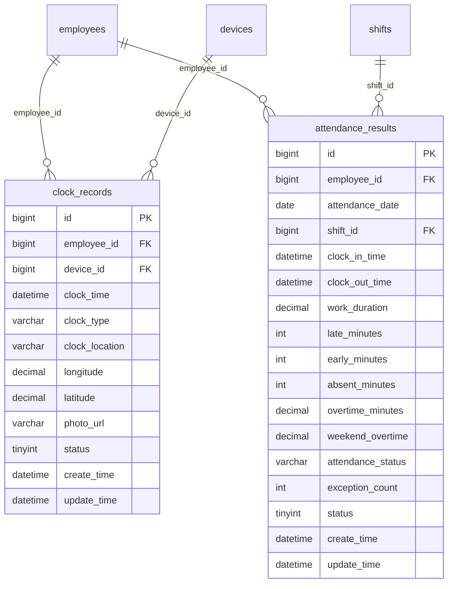
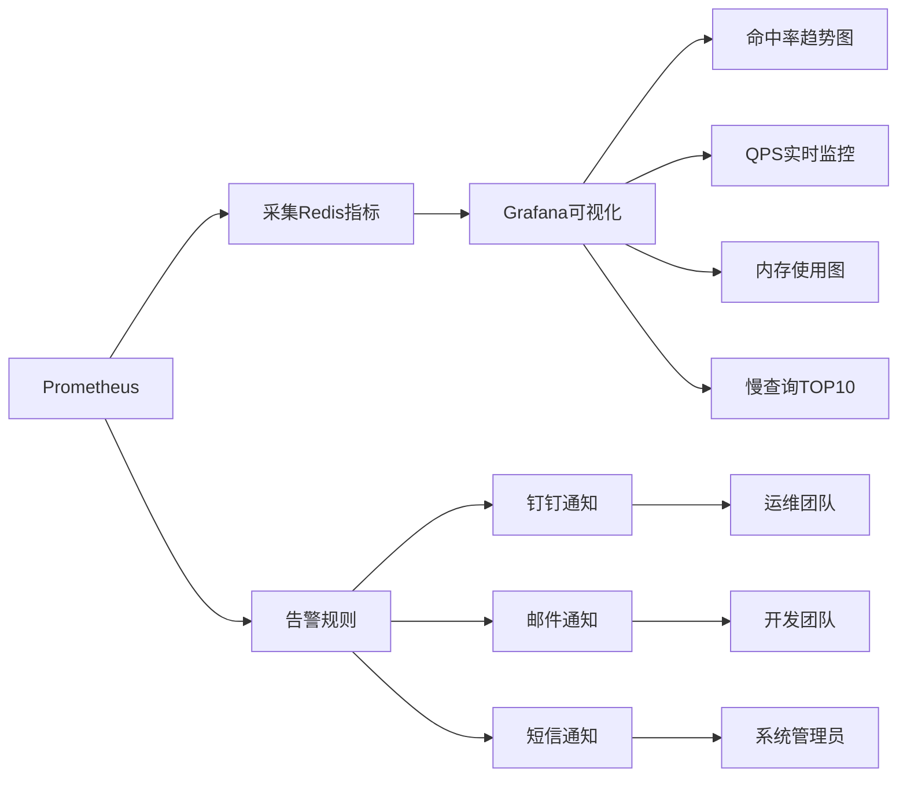

# 异常检测机制

<cite>
**本文档引用文件**   
- [t_alert_rule.sql](file://database-scripts/common-service/12-t_alert_rule.sql)
- [t_scheduled_job.sql](file://database-scripts/common-service/14-t_scheduled_job.sql)
- [t_job_execution_log.sql](file://database-scripts/common-service/15-t_job_execution_log.sql)
- [考勤前端原型布局\排班管理功能布局文档_完整版.md](file://documentation/03-业务模块/考勤/考勤前端原型布局/排班管理功能布局文档_完整版.md)
- [原始记录及考勤计算.md](file://documentation/03-业务模块/考勤/原始记录及考勤计算.md)
- [考勤规则配置.md](file://documentation/03-业务模块/考勤/考勤规则配置.md)
- [AttendanceRecordController.java](file://microservices/ioedream-attendance-service/src/main/java/net/lab1024/sa/attendance/controller/AttendanceRecordController.java)
- [NotificationManager.java](file://microservices/microservices-common/src/main/java/net/lab1024/sa/common/monitor/manager/NotificationManager.java)
- [考勤系统数据库ER图设计.md](file://documentation/03-业务模块/各业务模块文档/考勤/考勤系统数据库ER图设计.md)
- [09-缓存架构设计.md](file://documentation/03-业务模块/消费/09-缓存架构设计.md)
</cite>

## 目录
1. [引言](#引言)
2. [异常检测触发时机](#异常检测触发时机)
3. [异常检测核心算法与业务逻辑](#异常检测核心算法与业务逻辑)
4. [异常预警规则配置](#异常预警规则配置)
5. [异常检测性能优化策略](#异常检测性能优化策略)
6. [结论](#结论)

## 引言
本文档详细阐述了IOE-DREAM考勤系统中的异常检测机制。该机制旨在通过分析员工的打卡记录、排班计划和考勤规则，自动识别并预警考勤异常情况。系统支持实时检测和定时批量检测两种模式，确保异常情况能够被及时发现和处理。本文档将深入介绍异常检测的触发时机、核心算法、预警规则配置以及性能优化策略。

## 异常检测触发时机
考勤异常检测机制通过两种模式触发：实时检测和定时批量检测。

### 实时检测
实时检测在员工打卡时立即触发。当员工通过考勤机、移动端或门禁系统进行打卡时，系统会实时采集打卡数据，并立即启动异常检测流程。此模式确保了异常情况的即时响应，如迟到、早退或未在规定区域内打卡等，能够被立即识别并记录。

### 定时批量检测
定时批量检测通过调度任务定期执行。系统配置了定时任务（`t_scheduled_job`），按照预设的Cron表达式周期性地运行异常检测算法。此模式适用于对历史数据进行深度分析，如连续多日的异常模式识别或月度考勤统计。任务执行日志记录在` t_job_execution_log`表中，便于监控和审计。

**Section sources**
- [t_scheduled_job.sql](file://database-scripts/common-service/14-t_scheduled_job.sql#L1-L23)
- [t_job_execution_log.sql](file://database-scripts/common-service/15-t_job_execution_log.sql#L1-L30)

## 异常检测核心算法与业务逻辑
异常检测的核心在于将员工的打卡记录与排班计划和考勤规则进行比对分析。

### 数据比对分析
系统首先获取员工的打卡记录（`clock_records`），包括打卡时间、地点、设备信息等。然后，根据员工的排班计划（`attendance_results`）确定其应到岗和离岗时间。通过比对实际打卡时间与计划时间，系统可以判定是否存在迟到、早退或缺勤等异常。

### 异常判定逻辑
异常判定逻辑包括：
- **时间匹配**：检查打卡时间是否在排班规定的时间范围内。
- **位置验证**：利用GPS或WiFi定位，确认打卡位置是否在允许的考勤区域内。
- **连续性分析**：分析连续多日的打卡模式，识别频繁迟到或连续缺勤等趋势性异常。
- **规则匹配**：根据预设的考勤规则（`attendance_rules`），如允许的迟到分钟数、补卡次数限制等，进行综合判定。



**Diagram sources **
- [原始记录及考勤计算.md](file://documentation/03-业务模块/考勤/原始记录及考勤计算.md#L139-L204)

**Section sources**
- [原始记录及考勤计算.md](file://documentation/03-业务模块/考勤/原始记录及考勤计算.md#L211-L229)
- [考勤前端原型布局\排班管理功能布局文档_完整版.md](file://documentation/03-业务模块/考勤/考勤前端原型布局/排班管理功能布局文档_完整版.md#L97-L111)

## 异常预警规则配置
系统支持灵活的异常预警规则配置，允许基于时间、地点、频率等多维度设置预警条件。

### 预警规则结构
预警规则以JSON格式存储，包含以下关键部分：
- **预警类型**：如“未打卡”、“考勤异常”、“频繁迟到”等。
- **触发条件**：定义触发预警的阈值，如连续3次未打卡、7天内迟到3次等。
- **通知方式**：支持短信、邮件、微信、钉钉等多种通知渠道。
- **接收人**：可指定员工本人、直属领导或HR等接收通知。
- **升级规则**：当异常情况持续恶化时，自动升级通知级别，如连续7天异常通知HR。

```json
{
  "warning_types": [
    {
      "type": "no_clock_in",
      "threshold": 3,
      "level": "high",
      "description": "连续3次未打卡预警",
      "auto_actions": ["notify_manager", "notify_hr"]
    },
    {
      "type": "late_frequent",
      "threshold": 3,
      "time_range_days": 7,
      "level": "medium",
      "description": "频繁迟到预警",
      "auto_actions": ["notify_employee", "notify_manager"]
    }
  ],
  "escalation_rules": [
    {
      "condition": "consecutive_days >= 7",
      "action": "notify_hr",
      "description": "连续7天异常通知HR"
    }
  ]
}
```

**Diagram sources **
- [考勤规则配置.md](file://documentation/03-业务模块/考勤/考勤规则配置.md#L327-L368)

**Section sources**
- [考勤规则配置.md](file://documentation/03-业务模块/考勤/考勤规则配置.md#L327-L368)
- [考勤系统数据库ER图设计.md](file://documentation/03-业务模块/各业务模块文档/考勤/考勤系统数据库ER图设计.md#L1323-L1409)

## 异常检测性能优化策略
为确保异常检测机制的高效运行，系统采用了多种性能优化策略。

### 缓存机制
系统采用多级缓存（本地缓存Caffeine + 分布式缓存Redis）来减少数据库访问。例如，员工的排班信息和考勤规则会被缓存，避免每次检测时都查询数据库。缓存一致性通过“延迟双删”策略保证，即先删除缓存，再更新数据库，延迟500ms后再次删除缓存。

### 异步处理
对于非实时性要求高的任务，如生成月度考勤报告或发送批量通知，系统采用异步处理。通过消息队列或异步任务，将这些任务从主流程中剥离，提高系统的响应速度和吞吐量。

### 分片计算
在处理大规模数据时，系统采用分片计算策略。将员工数据按部门或区域分片，分配到不同的计算节点并行处理，显著缩短了计算时间。



**Diagram sources **
- [09-缓存架构设计.md](file://documentation/03-业务模块/消费/09-缓存架构设计.md#L436-L450)

**Section sources**
- [09-缓存架构设计.md](file://documentation/03-业务模块/消费/09-缓存架构设计.md#L393-L400)
- [09-缓存架构设计.md](file://documentation/03-业务模块/消费/09-缓存架构设计.md#L456-L469)

## 结论
IOE-DREAM考勤系统的异常检测机制通过实时与定时相结合的检测模式，结合多维度的预警规则配置，能够有效识别和预警各类考勤异常。通过缓存、异步处理和分片计算等性能优化策略，系统在保证高准确率的同时，也具备了良好的性能和可扩展性。该机制为企业的考勤管理提供了强有力的技术支持。