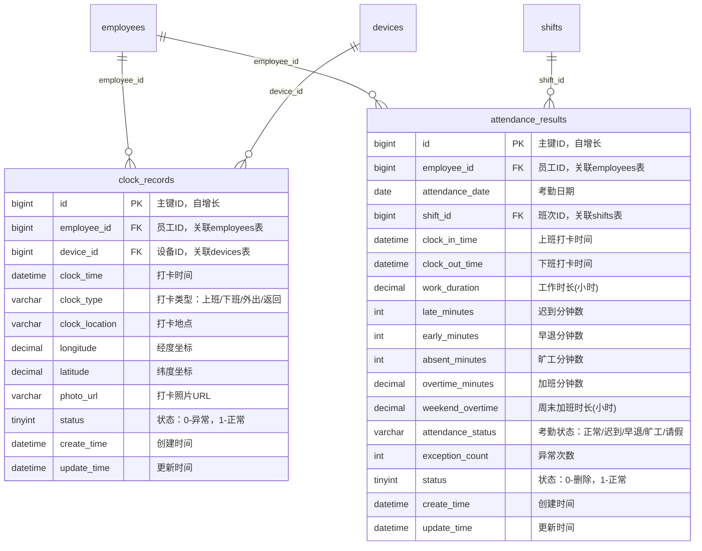
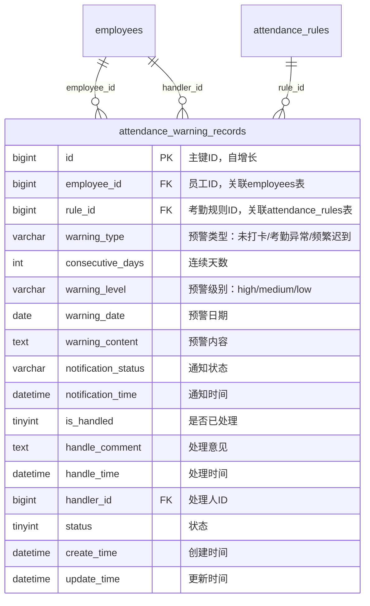
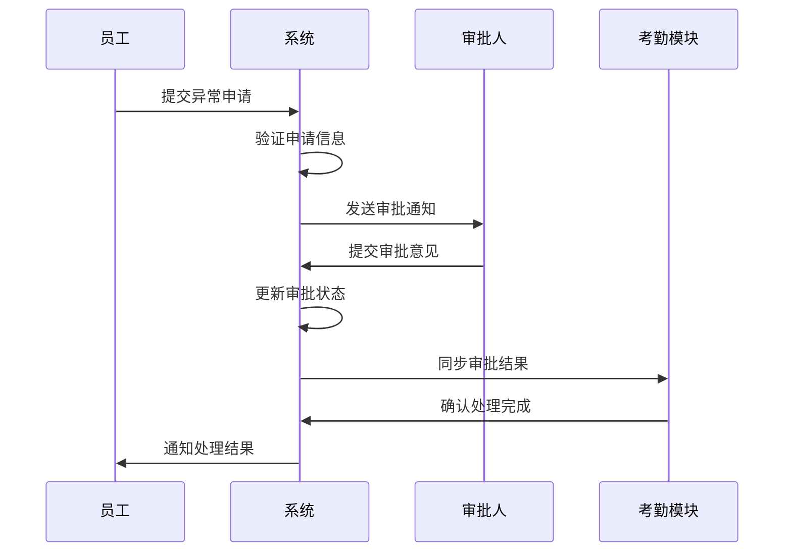
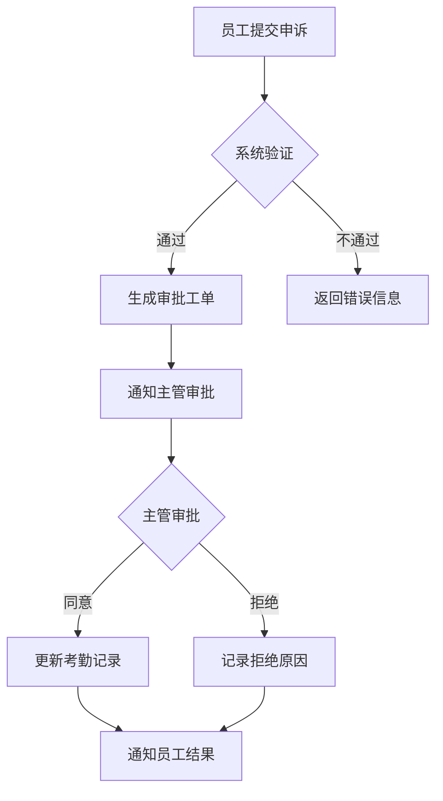
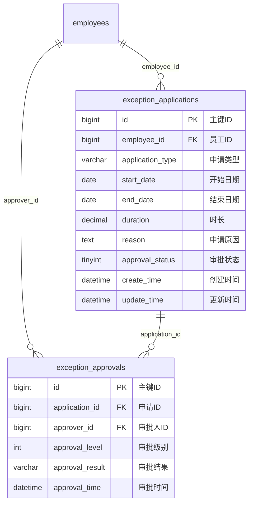
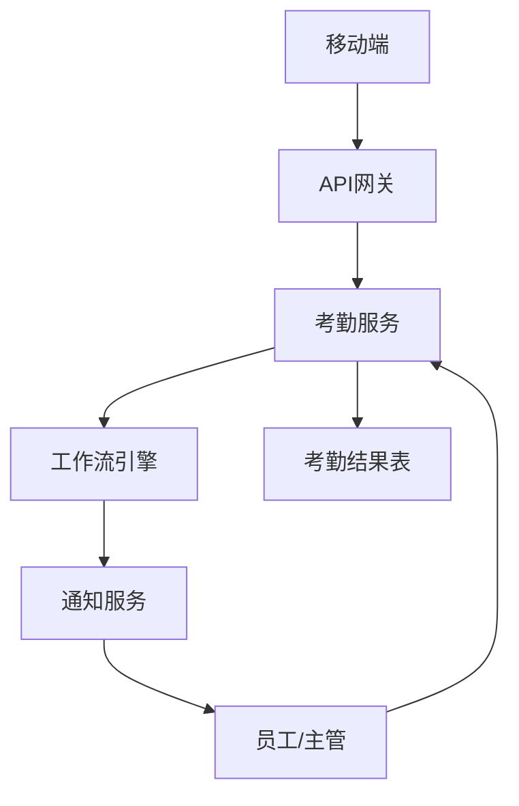

# 异常管理

<cite>
**本文档引用文件**  
- [异常管理.md](file://documentation\03-业务模块\考勤\异常管理.md)
- [考勤系统数据库ER图设计.md](file://documentation\03-业务模块\考勤\考勤系统数据库ER图设计.md)
- [原始记录及考勤计算.md](file://documentation\03-业务模块\考勤\原始记录及考勤计算.md)
- [AttendanceExceptionApplicationController.java](file://restful_refactor_backup_20251202_014224\microservices_ioedream-attendance-service_src_main_java_net_lab1024_sa_attendance_controller_AttendanceExceptionApplicationController.java)
- [AttendanceLeaveServiceImpl.java](file://microservices\ioedream-attendance-service\src\main\java\net\lab1024\sa\attendance\service\impl\AttendanceLeaveServiceImpl.java)
- [AttendanceOvertimeServiceImpl.java](file://microservices\ioedream-attendance-service\src\main\java\net\lab1024\sa\attendance\service\impl\AttendanceOvertimeServiceImpl.java)
- [AttendanceSupplementServiceImpl.java](file://microservices\ioedream-attendance-service\src\main\java\net\lab1024\sa\attendance\service\impl\AttendanceSupplementServiceImpl.java)
- [smart-workflow.md](file://documentation\technical\smart-workflow.md)
</cite>

## 目录
1. [引言](#引言)
2. [考勤异常类型](#考勤异常类型)
3. [异常识别机制与预警规则](#异常识别机制与预警规则)
4. [异常处理流程](#异常处理流程)
5. [异常申诉与审批](#异常申诉与审批)
6. [异常统计功能](#异常统计功能)
7. [处理时效性与记录追溯](#处理时效性与记录追溯)
8. [系统架构与数据流](#系统架构与数据流)
9. [结论](#结论)

## 引言

异常管理模块是考勤系统的核心组成部分，负责处理各类考勤异常情况，包括迟到、早退、缺卡、超时加班等。该模块通过自动识别与人工干预相结合的方式，确保考勤数据的准确性与公平性。系统支持多级审批流程、灵活的规则配置以及全面的统计分析功能，为人力资源管理提供有力支持。

**本文档引用文件**  
- [异常管理.md](file://documentation\03-业务模块\考勤\异常管理.md)

## 考勤异常类型

考勤系统定义了多种异常类型，涵盖员工日常考勤中的各种特殊情况：

- **迟到**：员工在规定上班时间之后打卡。
- **早退**：员工在规定下班时间之前打卡。
- **缺卡**：员工未在规定时间完成上班或下班打卡。
- **旷工**：员工全天未打卡且无请假记录。
- **加班**：员工在正常工作时间之外进行工作，需区分平时加班、周末加班和节假日加班。
- **补签**：因特殊原因未能及时打卡，事后申请补充打卡记录。
- **请假**：包括年假、病假、事假等多种假种，每种假种有其特定的申请与审批规则。

这些异常类型通过数据库表 `attendance_results` 中的 `attendance_status` 字段进行标识，并在 `exception_applications` 表中记录详细的申请信息。

**本文档引用文件**  
- [异常管理.md](file://documentation\03-业务模块\考勤\异常管理.md)
- [考勤系统数据库ER图设计.md](file://documentation\03-业务模块\考勤\考勤系统数据库ER图设计.md)

## 异常识别机制与预警规则

### 异常识别机制

系统通过比对员工的实际打卡时间与排班计划中的规定时间，自动识别异常情况。核心数据表 `clock_records` 存储原始打卡记录，`attendance_results` 表则存储计算后的考勤结果，包含迟到分钟数、早退分钟数、旷工分钟数等详细信息。

**图表来源**  
- [原始记录及考勤计算.md](file://documentation\03-业务模块\考勤\原始记录及考勤计算.md#L139-L204)

### 预警规则

系统支持灵活的预警规则配置，通过 `attendance_warning_records` 表记录预警信息。预警规则可基于以下条件触发：

- 连续多日未打卡
- 一周内迟到次数超过阈值
- 旷工天数达到设定值

预警信息包含预警类型、级别、内容及处理状态，支持通过短信、邮件、微信等多种渠道通知相关人员。

**图表来源**  
- [考勤系统数据库ER图设计.md](file://documentation\03-业务模块\考勤\考勤系统数据库ER图设计.md#L525-L543)

## 异常处理流程

异常处理支持自动处理和人工审批两种模式。

### 自动处理

对于简单的异常情况（如轻微迟到），系统可根据预设规则自动处理，无需人工干预。处理结果直接更新至 `attendance_results` 表。

### 人工审批

对于需要核实的异常（如请假、加班、补签），系统启动人工审批流程：

1. 员工提交异常申请
2. 系统根据申请类型和金额/时长，自动匹配审批流程
3. 审批人逐级审批
4. 审批通过后，系统更新考勤记录

审批流程由 `smart-workflow` 模块驱动，支持多级审批、条件分支和超时升级。

**图表来源**  
- [AttendanceExceptionApplicationController.java](file://restful_refactor_backup_20251202_014224\microservices_ioedream-attendance-service_src_main_java_net_lab1024_sa_attendance_controller_AttendanceExceptionApplicationController.java#L48-L59)
- [smart-workflow.md](file://documentation\technical\smart-workflow.md)

## 异常申诉与审批

### 异常申诉

员工可通过系统对系统自动判定的异常提出申诉。申诉流程如下：

1. 在移动端或Web端选择需要申诉的异常记录
2. 填写申诉理由并上传证明材料
3. 提交申诉申请
4. 系统生成申诉工单并通知主管

### 异常审批

审批功能由 `AttendanceExceptionApplicationController` 提供API支持：

- `POST /api/attendance/exception-application/submit`：提交异常申请
- `POST /api/attendance/exception-application/approve`：审批异常申请
- `GET /api/attendance/exception-application/pending`：获取待审批列表

审批服务实现类（如 `AttendanceLeaveServiceImpl`）负责具体的业务逻辑处理，包括启动工作流、更新状态和执行后续操作。

**本文档引用文件**  
- [AttendanceExceptionApplicationController.java](file://restful_refactor_backup_20251202_014224\microservices_ioedream-attendance-service_src_main_java_net_lab1024_sa_attendance_controller_AttendanceExceptionApplicationController.java)
- [AttendanceLeaveServiceImpl.java](file://microservices\ioedream-attendance-service\src\main\java\net\lab1024\sa\attendance\service\impl\AttendanceLeaveServiceImpl.java)

## 异常统计功能

系统提供全面的异常统计功能，支持按部门、个人、时间段等维度进行数据分析：

- **异常类型分布**：统计各类异常的发生频率
- **趋势分析**：展示异常数量随时间的变化趋势
- **部门对比**：比较不同部门的异常率
- **个人明细**：查看员工个人的异常记录

统计结果可用于绩效考核、管理改进和制度优化。

**图表来源**  
- [异常管理.md](file://documentation\03-业务模块\考勤\异常管理.md#L31-L60)

## 处理时效性与记录追溯

### 处理时效性

系统对异常处理设置了严格的时效性要求：

- **审批时效**：审批任务在24小时内未处理将自动升级至上级主管
- **申诉时效**：员工需在异常发生后3个工作日内提出申诉
- **处理时限**：主管需在收到申诉后48小时内完成处理

### 记录追溯

所有异常处理操作均被完整记录，确保可追溯性：

- **操作日志**：记录每次状态变更的操作人、时间和原因
- **审批历史**：保存完整的审批流程记录
- **数据版本**：关键数据变更保留历史版本

追溯功能通过 `t_audit_log` 表实现，支持按时间、操作人、操作类型等条件查询。

**本文档引用文件**  
- [异常管理.md](file://documentation\03-业务模块\考勤\异常管理.md)
- [考勤系统数据库ER图设计.md](file://documentation\03-业务模块\考勤\考勤系统数据库ER图设计.md)

## 系统架构与数据流

### 微服务架构

异常管理功能分布在多个微服务中：

- **attendance-service**：核心考勤业务逻辑
- **common-service**：公共组件，如工作流引擎
- **gateway-service**：API网关，统一入口

### 数据流

1. 员工通过移动端提交异常申请
2. 请求经网关路由至 `attendance-service`
3. 服务层调用工作流引擎启动审批流程
4. 审批结果通过回调接口更新考勤数据
5. 最终结果同步至 `attendance_results` 表

**本文档引用文件**  
- [AttendanceLeaveServiceImpl.java](file://microservices\ioedream-attendance-service\src\main\java\net\lab1024\sa\attendance\service\impl\AttendanceLeaveServiceImpl.java)
- [smart-workflow.md](file://documentation\technical\smart-workflow.md)

## 结论

本异常管理文档详细阐述了考勤系统中异常处理的完整流程，从异常类型定义、识别机制、预警规则到处理流程、申诉审批、统计分析和记录追溯。系统通过自动化与人工干预相结合的方式，确保了考勤管理的准确性与公平性。基于微服务架构的设计，保证了系统的可扩展性与可维护性，为企业的考勤管理提供了坚实的技术支持。