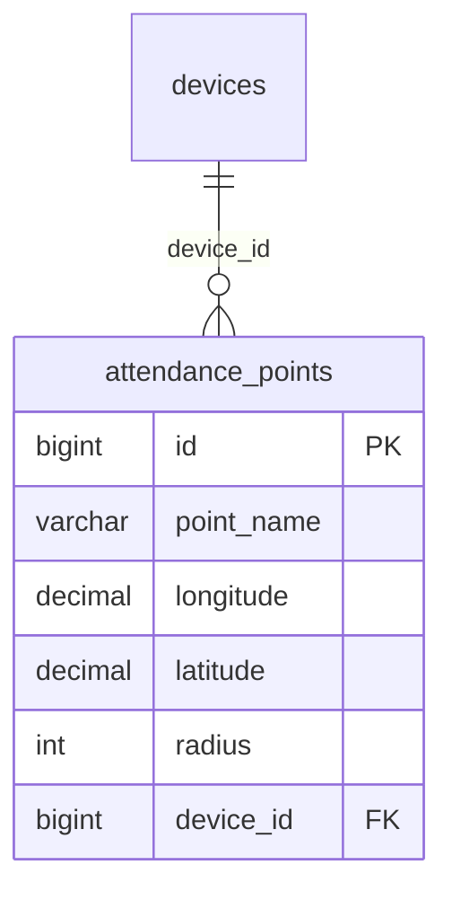
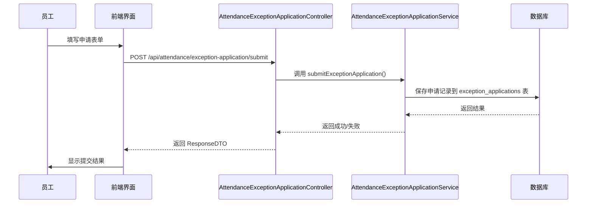
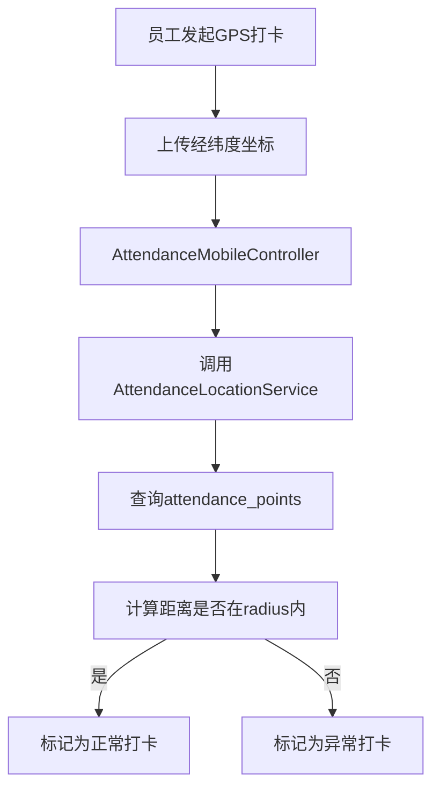

# 异常类型

<cite>
**本文档引用文件**  
- [异常管理.md](file://documentation\03-业务模块\考勤\异常管理.md)
- [原始记录及考勤计算.md](file://documentation\03-业务模块\考勤\原始记录及考勤计算.md)
- [考勤规则配置.md](file://documentation\03-业务模块\考勤\考勤规则配置.md)
- [考勤系统数据库ER图设计.md](file://documentation\03-业务模块\考勤\考勤系统数据库ER图设计.md)
- [AttendanceRecordEntity.java](file://microservices\ioedream-attendance-service\src\main\java\net\lab1024\sa\attendance\domain\entity\AttendanceRecordEntity.java)
- [AttendanceMobileController.java](file://restful_refactor_backup_20251202_014224\microservices_ioedream-attendance-service_src_main_java_net_lab1024_sa_attendance_controller_AttendanceMobileController.java)
- [AttendanceExceptionApplicationController.java](file://restful_refactor_backup_20251202_014224\microservices_ioedream-attendance-service_src_main_java_net_lab1024_sa_attendance_controller_AttendanceExceptionApplicationController.java)
</cite>

## 目录
1. [引言](#引言)
2. [核心考勤异常类型](#核心考勤异常类型)
3. [异常识别逻辑与业务规则](#异常识别逻辑与业务规则)
4. [异常处理与审批流程](#异常处理与审批流程)
5. [数据库存储结构](#数据库存储结构)
6. [代码实现与数据流](#代码实现与数据流)
7. [配置参数与分级管理](#配置参数与分级管理)
8. [总结](#总结)

## 引言
本文档旨在详细阐述考勤系统中支持的各类考勤异常，包括迟到、早退、缺卡、超时加班、未打卡、异常打卡位置等。文档将深入解释每种异常的定义标准、识别逻辑、业务规则、配置参数以及其在数据库中的存储结构和代码实现，为系统管理员、开发人员和人力资源管理者提供全面的技术与业务参考。

## 核心考勤异常类型
考勤系统通过自动化规则引擎和人工申请流程，识别和管理多种考勤异常。主要异常类型可分为两大类：**自动检测异常**和**人工申请异常**。

### 自动检测异常
此类异常由系统根据打卡记录、排班信息和预设规则自动计算和判定。

1.  **迟到 (Late)**
    *   **定义**: 员工在规定的班次开始时间之后打卡。
    *   **识别逻辑**: 系统将员工的实际打卡时间 (`clock_in_time`) 与班次的计划开始时间进行比较。若实际时间晚于计划时间，则判定为迟到。系统支持配置“迟到容忍时间”（如10分钟），在此阈值内的打卡不计为迟到。

2.  **早退 (Early)**
    *   **定义**: 员工在规定的班次结束时间之前打卡下班。
    *   **识别逻辑**: 系统将员工的实际下班打卡时间 (`clock_out_time`) 与班次的计划结束时间进行比较。若实际时间早于计划时间，则判定为早退。同样，系统支持配置“早退容忍时间”作为判定阈值。

3.  **旷工 (Absent)**
    *   **定义**: 员工在应出勤的工作日，既没有上班打卡也没有下班打卡，且未提交有效的请假申请。
    *   **识别逻辑**: 系统在考勤日结束时，检查员工当天的打卡记录。若缺少上班和下班的打卡记录，且无有效的请假、调休等申请，则根据旷工规则（如连续4小时未打卡）判定为旷工。

4.  **未打卡 (No Clock In/Out)**
    *   **定义**: 员工在应打卡的时间点（上班或下班）未能成功打卡，但并非全天缺勤。
    *   **识别逻辑**: 系统检测到员工有部分打卡记录（如只有上班打卡，缺少下班打卡），则标记为“未打卡”异常。这通常会触发补签申请流程。

5.  **超时加班 (Overtime)**
    *   **定义**: 员工在正常工作时间之外继续工作并打卡。
    *   **识别逻辑**: 系统根据班次的结束时间，计算员工下班打卡时间之后的工作时长。超过正常工作时长的部分即为加班时长。系统支持区分平时加班、周末加班和节假日加班，并应用不同的计算倍数。

6.  **异常打卡位置 (Abnormal Clock Location)**
    *   **定义**: 员工通过移动端打卡时，其GPS定位坐标超出了预设的考勤点有效范围。
    *   **识别逻辑**: 系统将移动端上报的经纬度坐标与数据库中配置的“考勤点”(attendance_points) 的坐标和有效半径进行比对。若距离超出半径，则判定为异常打卡位置，打卡记录状态标记为异常。

### 人工申请异常
此类异常由员工主动发起申请，经审批流程后生效，用于修正或补充考勤记录。

1.  **请假 (Leave)**
    *   **定义**: 员工因个人或工作原因，申请在工作日不上班。
    *   **类型**: 包括年假、病假、事假、婚假、产假等多种假种，每种假种有独立的额度和审批规则。

2.  **补签 (Punch Correction)**
    *   **定义**: 员工因忘记打卡、设备故障等原因导致未打卡，事后申请补充打卡记录。
    *   **流程**: 员工提交补签申请，说明原因并提供证明，经主管审批通过后，系统将补充的打卡时间计入考勤结果。

3.  **加班申请 (Overtime Application)**
    *   **定义**: 员工计划进行加班，需提前或事后提交申请，经审批后方可计入有效加班时长。
    *   **目的**: 用于控制加班成本和确保加班的必要性。

4.  **调班 (Shift Adjustment)**
    *   **定义**: 员工因个人原因，申请与他人交换班次或调整自己的班次。
    *   **流程**: 需要相关方确认和主管审批。

5.  **销假 (Leave Cancellation)**
    *   **定义**: 员工已申请的假期因故取消，申请恢复假期额度。
    *   **关联**: 必须关联到原请假申请进行处理。

**Section sources**
- [异常管理.md](file://documentation\03-业务模块\考勤\异常管理.md#L4)
- [原始记录及考勤计算.md](file://documentation\03-业务模块\考勤\原始记录及考勤计算.md#L4)

## 异常识别逻辑与业务规则
系统的异常识别依赖于一套灵活的规则配置体系，确保能够适应不同企业、部门和岗位的管理需求。

### 迟到与早退的判定规则
迟到和早退的判定核心在于时间比较和容忍度配置。相关规则主要存储在 `attendance_rules` 表的 `config_json` 字段中。

```json
{
  "attendance_settings": {
    "late_tolerance_minutes": 10,
    "early_tolerance_minutes": 10,
    "absent_threshold_hours": 4
  }
}
```

*   **`late_tolerance_minutes`**: 定义迟到的容忍分钟数。例如，班次开始时间为09:00，容忍时间为10分钟，则09:10之前的打卡均视为正常。
*   **`early_tolerance_minutes`**: 定义早退的容忍分钟数。
*   **`absent_threshold_hours`**: 定义旷工的阈值小时数。例如，若员工全天应工作8小时，但实际工作时长不足4小时，则直接判定为旷工。

### 旷工与未打卡的判定规则
旷工和未打卡的判定基于打卡记录的完整性。

*   **旷工**: 当员工在工作日没有任何打卡记录，且无有效请假时，系统根据 `absent_threshold_hours` 规则判定为旷工。
*   **未打卡**: 当员工在工作日仅有部分打卡记录（如只打了上班卡）时，系统标记为“未打卡”异常，并可能触发预警。

### 异常打卡位置的判定规则
此规则依赖于“考勤点”(attendance_points) 的配置。



**Diagram sources**
- [考勤规则配置.md](file://documentation\03-业务模块\考勤\考勤规则配置.md#L168)

系统通过比较移动端上报的GPS坐标与 `attendance_points` 表中配置的坐标和 `radius`（有效半径，单位：米），来判断打卡位置是否有效。

### 超时加班的计算规则
加班时长的计算不仅基于时间，还与日期类型相关。

```json
{
  "attendance_settings": {
    "weekend_overtime_multiplier": 2.0,
    "holiday_overtime_multiplier": 3.0
  }
}
```

*   **平时加班**: 工作日下班后的工作时长，按1.0倍计算。
*   **周末加班**: 在周末工作，按2.0倍计算。
*   **节假日加班**: 在法定节假日工作，按3.0倍计算。

**Section sources**
- [考勤规则配置.md](file://documentation\03-业务模块\考勤\考勤规则配置.md#L294)
- [原始记录及考勤计算.md](file://documentation\03-业务模块\考勤\原始记录及考勤计算.md#L309)

## 异常处理与审批流程
对于需要人工干预的异常，系统提供了一套完整的申请与审批流程。

### 异常申请流程
员工通过 `AttendanceExceptionApplicationController` 提交各类异常申请。



**Diagram sources**
- [AttendanceExceptionApplicationController.java](file://restful_refactor_backup_20251202_014224\microservices_ioedream-attendance-service_src_main_java_net_lab1024_sa_attendance_controller_AttendanceExceptionApplicationController.java#L45)
- [异常管理.md](file://documentation\03-业务模块\考勤\异常管理.md#L408)

### 多级审批流程
审批流程由 `approval_workflow` JSON 配置驱动，支持条件分支和多级审批。

```json
{
  "workflow_name": "病假审批流程",
  "approval_levels": [
    {
      "level": 1,
      "approver_type": "direct_manager",
      "required": true,
      "conditions": {
        "max_duration_days": 3
      }
    },
    {
      "level": 2,
      "approver_type": "hr_manager",
      "required": false,
      "conditions": {
        "duration_days >= 3"
      }
    }
  ]
}
```

审批人通过 `approve` 或 `reject` 接口处理申请，审批记录存储在 `exception_approvals` 表中。

**Section sources**
- [异常管理.md](file://documentation\03-业务模块\考勤\异常管理.md#L266)
- [考勤规则配置.md](file://documentation\03-业务模块\考勤\考勤规则配置.md#L277)

## 数据库存储结构
考勤异常相关的数据主要存储在以下几张核心表中。

### 考勤计算结果表 (attendance_results)
该表存储每日的考勤计算结果，是异常统计的直接来源。

| 字段名 | 数据类型 | 说明 |
| :--- | :--- | :--- |
| `id` | bigint | 主键ID |
| `employee_id` | bigint | 员工ID |
| `attendance_date` | date | 考勤日期 |
| `clock_in_time` | datetime | 上班打卡时间 |
| `clock_out_time` | datetime | 下班打卡时间 |
| `late_minutes` | int | 迟到分钟数 |
| `early_minutes` | int | 早退分钟数 |
| `absent_minutes` | int | 旷工分钟数 |
| `overtime_minutes` | decimal | 加班分钟数 |
| `attendance_status` | varchar | 考勤状态 (正常/迟到/早退/旷工/请假) |
| `exception_count` | int | 异常次数 |

**Section sources**
- [考勤系统数据库ER图设计.md](file://documentation\03-业务模块\考勤\考勤系统数据库ER图设计.md#L1493)

### 异常申请表 (exception_applications)
该表存储所有由员工发起的异常申请。

| 字段名 | 数据类型 | 说明 |
| :--- | :--- | :--- |
| `id` | bigint | 主键ID |
| `employee_id` | bigint | 申请人ID |
| `application_type` | varchar | 申请类型 (请假/补签/加班等) |
| `approval_status` | tinyint | 审批状态 (0:待审批, 1:已通过, 2:已拒绝) |
| `clock_in_time` | datetime | 补签时的打卡时间 |
| `overtime_type` | varchar | 加班类型 (平时/周末/节假日) |
| `status` | tinyint | 记录状态 (0:删除, 1:正常) |

**Section sources**
- [异常管理.md](file://documentation\03-业务模块\考勤\异常管理.md#L34)
- [考勤系统数据库ER图设计.md](file://documentation\03-业务模块\考勤\考勤系统数据库ER图设计.md#L1050)

### 考勤预警记录表 (attendance_warning_records)
该表存储系统自动检测到的异常预警。

| 字段名 | 数据类型 | 说明 |
| :--- | :--- | :--- |
| `id` | bigint | 主键ID |
| `employee_id` | bigint | 员工ID |
| `warning_type` | varchar | 预警类型 (no_clock_in, attendance_abnormal, late_frequent) |
| `warning_level` | varchar | 预警级别 (high, medium, low) |
| `is_handled` | tinyint | 是否已处理 |

**Section sources**
- [原始记录及考勤计算.md](file://documentation\03-业务模块\考勤\原始记录及考勤计算.md#L51)
- [考勤规则配置.md](file://documentation\03-业务模块\考勤\考勤规则配置.md#L331)

## 代码实现与数据流
考勤异常的处理贯穿于系统的多个层级，遵循标准的四层架构。

### 核心实体类
`AttendanceRecordEntity` 是考勤记录的核心实体，映射到数据库表 `t_attendance_record`。

```java
@Data
@EqualsAndHashCode(callSuper = true)
@TableName("t_attendance_record")
public class AttendanceRecordEntity extends BaseEntity {
    private Long recordId;
    private Long userId;
    private String userName;
    private LocalDateTime punchTime;
    private String attendanceStatus; // NORMAL, LATE, EARLY, ABSENT, OVERTIME
    private String attendanceType; // CHECK_IN, CHECK_OUT
    private java.math.BigDecimal longitude;
    private java.math.BigDecimal latitude;
    // ... 其他字段
}
```

**Section sources**
- [AttendanceRecordEntity.java](file://microservices\ioedream-attendance-service\src\main\java\net\lab1024\sa\attendance\domain\entity\AttendanceRecordEntity.java#L30)

### 移动端打卡与位置验证
移动端通过 `AttendanceMobileController` 提供的接口进行GPS打卡。



**Diagram sources**
- [AttendanceMobileController.java](file://restful_refactor_backup_20251202_014224\microservices_ioedream-attendance-service_src_main_java_net_lab1024_sa_attendance_controller_AttendanceMobileController.java#L38)
- [考勤规则配置.md](file://documentation\03-业务模块\考勤\考勤规则配置.md#L28)

## 配置参数与分级管理
系统通过灵活的配置实现了异常的分级管理。

### 异常严重程度分级
异常的严重程度通过 `warning_level` 字段体现，分为 `high`、`medium`、`low` 三个级别。

```json
{
  "warning_types": [
    {
      "type": "no_clock_in",
      "threshold": 3,
      "level": "high"
    },
    {
      "type": "late_frequent",
      "threshold": 3,
      "level": "medium"
    }
  ]
}
```

*   **高 (high)**: 如“连续3天未打卡”，会立即通知主管和HR。
*   **中 (medium)**: 如“7天内迟到3次”，会通知员工本人和主管。
*   **低 (low)**: 一般性提醒，如单次迟到。

### 异常处理优先级
处理优先级由预警规则的 `escalation_rules` 决定。

```json
{
  "escalation_rules": [
    {
      "condition": "consecutive_days >= 3",
      "action": "notify_manager"
    },
    {
      "condition": "consecutive_days >= 7",
      "action": "notify_hr"
    }
  ]
}
```

系统根据异常的连续天数等条件，自动升级通知级别，确保重要问题得到及时关注。

**Section sources**
- [考勤规则配置.md](file://documentation\03-业务模块\考勤\考勤规则配置.md#L331)
- [考勤系统数据库ER图设计.md](file://documentation\03-业务模块\考勤\考勤系统数据库ER图设计.md#L1372)

## 总结
本考勤系统通过自动检测与人工申请相结合的方式，全面覆盖了迟到、早退、缺卡、超时加班、未打卡、异常打卡位置等各类考勤异常。系统基于灵活的规则配置（JSON）和严格的数据库设计，实现了异常的精准识别、分级预警和流程化审批。其核心在于 `attendance_results`、`exception_applications` 和 `attendance_warning_records` 三张表的数据流转，并通过 `AttendanceExceptionApplicationController` 和 `AttendanceMobileController` 等API接口支撑前端业务。这套机制确保了考勤管理的自动化、规范化和可配置性，能够满足企业多样化的管理需求。