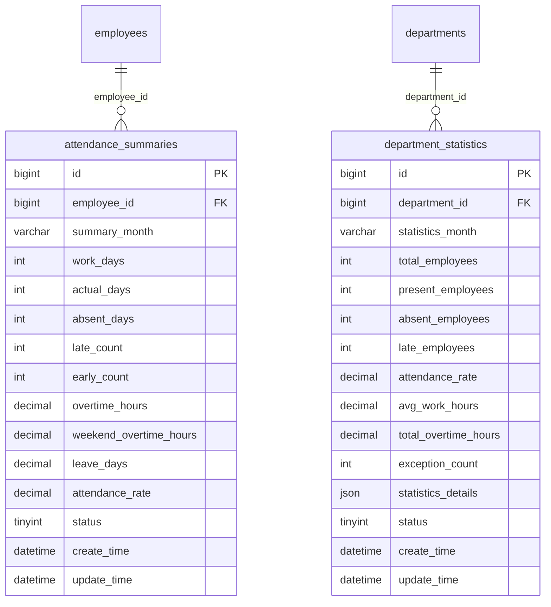
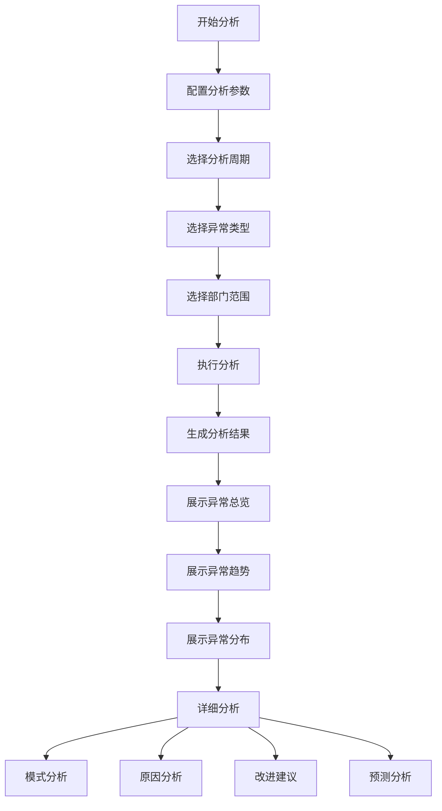
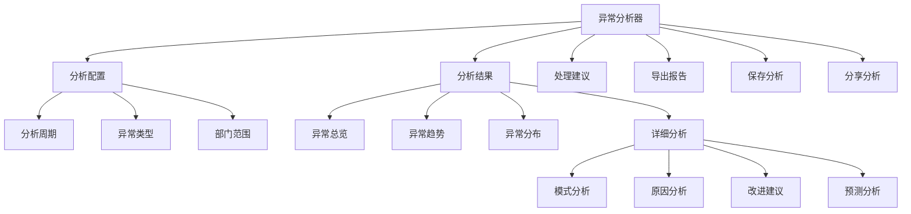

# 异常统计分析

<cite>
**本文档引用的文件**   
- [考勤汇总报表.md](file://documentation\03-业务模块\考勤\考勤汇总报表.md)
- [异常管理功能布局文档_完整版.md](file://documentation\03-业务模块\各业务模块文档\考勤\考勤前端原型布局\异常管理功能布局文档_完整版.md)
- [汇总报表功能布局文档_完整版.md](file://documentation\03-业务模块\各业务模块文档\考勤\考勤前端原型布局\汇总报表功能布局文档_完整版.md)
</cite>

## 目录
1. [异常统计维度与指标](#异常统计维度与指标)
2. [异常趋势分析](#异常趋势分析)
3. [异常原因分析](#异常原因分析)
4. [异常统计报表生成](#异常统计报表生成)
5. [数据准确性保障](#数据准确性保障)
6. [可视化展示与导出](#可视化展示与导出)

## 异常统计维度与指标

考勤异常统计分析支持多维度的数据统计，主要包括按部门、按员工和按时间段的异常分布统计。

**按部门统计**：通过`department_statistics`表记录各部门的考勤统计数据，包括部门总人数、出勤人数、缺勤人数、迟到人数、出勤率、平均工作时长、总加班时长和异常次数等关键指标。该表通过`department_id`字段与部门表关联，实现部门层级的统计分析。

**按员工统计**：通过`attendance_summaries`表记录每位员工的考勤汇总信息，包括应工作天数、实际出勤天数、旷工天数、迟到次数、早退次数、加班时长、请假天数和出勤率等指标。该表通过`employee_id`字段与员工表关联，实现个人维度的异常分析。

**按时间段统计**：支持按日、周、月等不同时间粒度进行异常统计。系统通过`summary_month`和`statistics_month`字段分别在个人汇总表和部门统计表中记录统计周期，实现时间维度的数据分析。

**Section sources**
- [考勤汇总报表.md](file://documentation\03-业务模块\考勤\考勤汇总报表.md#L29-L48)

## 异常趋势分析

系统支持异常趋势的同比和环比分析功能，帮助用户识别考勤异常的变化趋势。

**同比分析**：通过比较当前周期与去年同期的数据，分析异常情况的年度变化趋势。例如，比较今年1月与去年1月的迟到率变化。

**环比分析**：通过比较当前周期与上一周期的数据，分析异常情况的短期变化趋势。例如，比较本月与上月的缺勤人数变化。

系统通过`statistics_details`字段中的JSON结构存储详细的趋势分析数据，包括出勤趋势、加班趋势和绩效评分等信息。前端通过`ExceptionTrendChart`组件可视化展示异常趋势，支持用户选择不同的时间范围进行分析。

**Diagram sources**
- [考勤汇总报表.md](file://documentation\03-业务模块\考勤\考勤汇总报表.md#L152-L223)

**Section sources**
- [考勤汇总报表.md](file://documentation\03-业务模块\考勤\考勤汇总报表.md#L231-L238)
- [异常管理功能布局文档_完整版.md](file://documentation\03-业务模块\各业务模块文档\考勤\考勤前端原型布局\异常管理功能布局文档_完整版.md#L669-L755)

## 异常原因分析

系统提供异常原因分析功能，帮助识别高频异常类型和根本原因。

**异常类型识别**：系统支持分析迟到、早退、缺勤和忘打卡等多种异常类型。用户可以在分析配置中选择特定的异常类型进行深入分析。

**模式分析**：通过`PatternAnalysis`组件分析异常发生的规律和模式，如"周一上午迟到"等高频模式。系统会统计每种模式的发生频率和平均延迟时间。

**原因分析**：通过`CauseAnalysis`组件分析异常产生的根本原因，如"病假"、"事假"等。系统会统计每种原因的发生次数和持续时间。

**改进建议**：基于分析结果，系统会生成相应的改进建议，如"优化周一上班时间"、"加强考勤提醒"等，帮助管理者改善考勤状况。

**Diagram sources**
- [异常管理功能布局文档_完整版.md](file://documentation\03-业务模块\各业务模块文档\考勤\考勤前端原型布局\异常管理功能布局文档_完整版.md#L669-L772)

**Section sources**
- [异常管理功能布局文档_完整版.md](file://documentation\03-业务模块\各业务模块文档\考勤\考勤前端原型布局\异常管理功能布局文档_完整版.md#L758-L772)

## 异常统计报表生成

系统提供完善的异常统计报表生成机制，支持多种报表类型和格式。

**报表模板管理**：通过`report_templates`表管理各类报表模板，包括模板名称、类型、格式、配置和数据源等信息。支持个人报表、部门报表和公司报表等多种类型。

**报表生成流程**：报表生成遵循"选择模板→配置参数→获取数据→应用样式→生成文件→验证完整性→保存文件"的流程。系统通过`report_generation_logs`表记录每次报表生成的日志，包括生成参数、文件路径、生成状态和耗时等信息。

**定时生成**：支持定时自动生成报表，可配置生成周期（如每日、每周、每月）和生成时间，确保报表的及时性和一致性。

**Section sources**
- [考勤汇总报表.md](file://documentation\03-业务模块\考勤\考勤汇总报表.md#L50-L64)
- [考勤汇总报表.md](file://documentation\03-业务模块\考勤\考勤汇总报表.md#L251-L255)

## 数据准确性保障

为确保异常统计结果的准确性，系统采取了多项保障措施。

**数据校验**：在数据汇总过程中，系统会对原始数据进行完整性校验，确保没有缺失或异常的数据参与统计。

**缓存策略**：采用Redis+Caffeine多级缓存策略，确保统计数据的实时性和一致性。缓存数据会定期更新，避免数据过期。

**日志记录**：所有统计和报表生成操作都会记录到日志中，包括操作人、操作时间、参数和结果等信息，便于追溯和审计。

**错误处理**：系统具备完善的错误处理机制，当统计过程中出现异常时，会记录错误信息并通知管理员，确保问题能够及时发现和解决。

**Section sources**
- [考勤汇总报表.md](file://documentation\03-业务模块\考勤\考勤汇总报表.md#L410-L415)
- [考勤汇总报表.md](file://documentation\03-业务模块\考勤\考勤汇总报表.md#L554-L558)

## 可视化展示与导出

系统提供丰富的可视化展示方式和导出功能，便于用户分析和分享异常统计结果。

**可视化展示**：通过多种图表展示异常统计结果，包括：
- **总览统计**：使用卡片式布局展示关键指标
- **趋势图表**：使用折线图展示异常趋势变化
- **分布图表**：使用饼图或柱状图展示异常分布
- **对比分析**：使用对比图表展示不同维度的数据对比

**导出功能**：支持将异常统计结果导出为多种格式，包括PDF、Excel和HTML等。用户可以通过点击"导出报告"按钮将分析结果保存到本地。

**分享功能**：支持将分析结果分享给其他用户，便于团队协作和决策。

**Diagram sources**
- [异常管理功能布局文档_完整版.md](file://documentation\03-业务模块\各业务模块文档\考勤\考勤前端原型布局\异常管理功能布局文档_完整版.md#L669-L800)
- [汇总报表功能布局文档_完整版.md](file://documentation\03-业务模块\各业务模块文档\考勤\考勤前端原型布局\汇总报表功能布局文档_完整版.md#L884-L1311)

**Section sources**
- [异常管理功能布局文档_完整版.md](file://documentation\03-业务模块\各业务模块文档\考勤\考勤前端原型布局\异常管理功能布局文档_完整版.md#L777-L800)
- [汇总报表功能布局文档_完整版.md](file://documentation\03-业务模块\各业务模块文档\考勤\考勤前端原型布局\汇总报表功能布局文档_完整版.md#L1026-L1041)