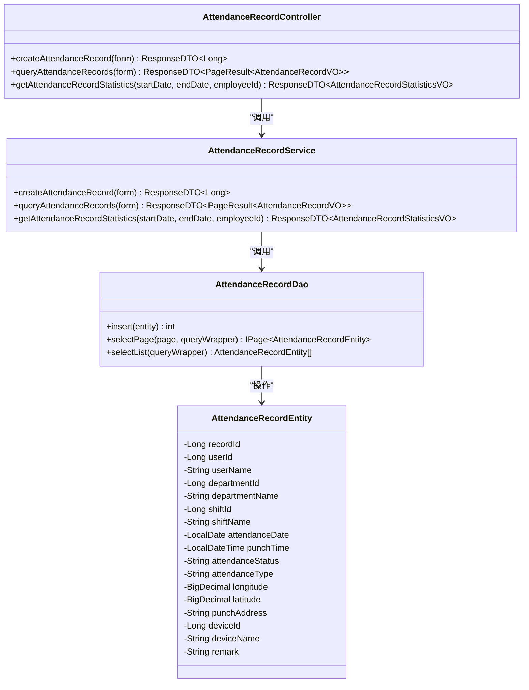
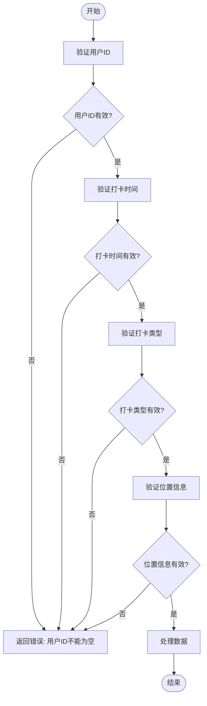
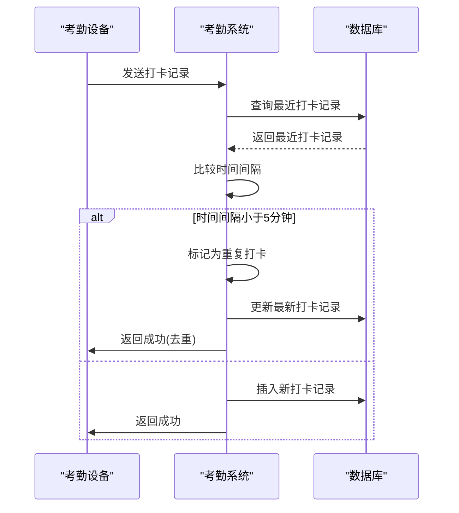
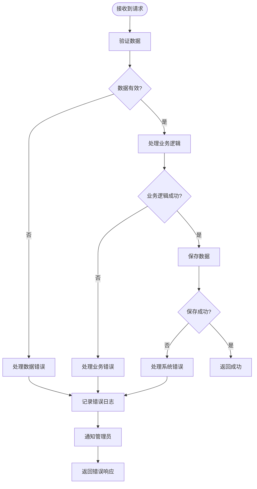
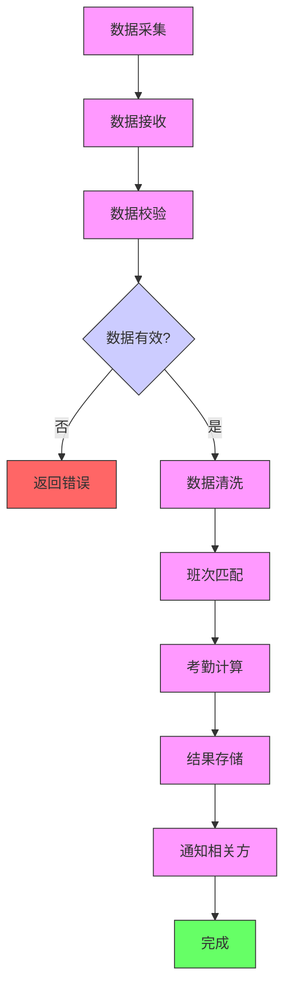

# 打卡数据处理

<cite>
**本文档引用文件**   
- [AttendanceRecordController.java](file://microservices\ioedream-attendance-service\src\main\java\net\lab1024\sa\attendance\controller\AttendanceRecordController.java)
- [AttendanceRecordEntity.java](file://microservices\ioedream-attendance-service\src\main\java\net\lab1024\sa\attendance\domain\entity\AttendanceRecordEntity.java)
- [AttendanceRecordDao.java](file://microservices\ioedream-attendance-service\src\main\java\net\lab1024\sa\attendance\dao\AttendanceRecordDao.java)
- [AttendanceRecordService.java](file://microservices\ioedream-attendance-service\src\main\java\net\lab1024\sa\attendance\service\AttendanceRecordService.java)
- [AttendanceRecordAddForm.java](file://microservices\ioedream-attendance-service\src\main\java\net\lab1024\sa\attendance\domain\form\AttendanceRecordAddForm.java)
- [AttendanceRecordVO.java](file://microservices\ioedream-attendance-service\src\main\java\net\lab1024\sa\attendance\domain\vo\AttendanceRecordVO.java)
- [原始记录及考勤计算.md](file://documentation\03-业务模块\考勤\原始记录及考勤计算.md)
- [考勤前端原型布局\考勤数据功能布局文档_完整版.md](file://documentation\03-业务模块\考勤\考勤前端原型布局\考勤数据功能布局文档_完整版.md)
</cite>

## 目录
1. [简介](#简介)
2. [打卡数据处理流程](#打卡数据处理流程)
3. [核心组件分析](#核心组件分析)
4. [数据校验与清洗](#数据校验与清洗)
5. [异常数据处理](#异常数据处理)
6. [性能优化策略](#性能优化策略)
7. [错误处理机制](#错误处理机制)
8. [数据处理流程图](#数据处理流程图)
9. [结论](#结论)

## 简介
打卡数据处理是考勤系统的核心功能，负责从各种渠道采集员工的打卡数据，经过校验、清洗、计算等处理后，生成准确的考勤结果。本系统支持多种打卡方式，包括考勤机、移动端、门禁系统等，确保数据的完整性和准确性。

## 打卡数据处理流程
打卡数据处理流程从数据采集开始，经过数据校验、清洗、匹配班次、计算考勤结果，最终存储到数据库中。整个流程设计为高可用、高并发的微服务架构，确保在大规模数据处理场景下的稳定性和性能。

### 数据采集
系统支持多种数据采集方式：
- **考勤机推送**：通过设备协议实时推送打卡数据
- **移动端打卡**：员工通过手机APP进行GPS定位打卡
- **门禁系统集成**：与门禁系统联动，自动记录进出时间
- **手动补录**：管理员在系统中手动添加或修正打卡记录

### 数据处理
采集到的打卡数据经过以下处理步骤：
1. **数据接收**：通过REST API接收打卡数据
2. **数据校验**：验证数据的完整性和有效性
3. **数据清洗**：处理异常数据，如重复打卡、时间冲突等
4. **班次匹配**：根据员工排班信息匹配相应的班次
5. **考勤计算**：计算工作时长、迟到、早退、加班等指标
6. **结果存储**：将计算结果存储到数据库

## 核心组件分析
打卡数据处理系统由多个核心组件构成，每个组件负责特定的功能，通过清晰的接口进行通信。

### 数据接收组件
数据接收组件负责接收来自各种渠道的打卡数据，主要通过`AttendanceRecordController`实现。

**组件来源**
- [AttendanceRecordController.java](file://microservices\ioedream-attendance-service\src\main\java\net\lab1024\sa\attendance\controller\AttendanceRecordController.java)
- [AttendanceRecordService.java](file://microservices\ioedream-attendance-service\src\main\java\net\lab1024\sa\attendance\service\AttendanceRecordService.java)
- [AttendanceRecordDao.java](file://microservices\ioedream-attendance-service\src\main\java\net\lab1024\sa\attendance\dao\AttendanceRecordDao.java)
- [AttendanceRecordEntity.java](file://microservices\ioedream-attendance-service\src\main\java\net\lab1024\sa\attendance\domain\entity\AttendanceRecordEntity.java)

### 数据校验组件
数据校验组件负责验证打卡数据的完整性和有效性，确保只有符合要求的数据才能进入后续处理流程。

**组件来源**
- [AttendanceRecordAddForm.java](file://microservices\ioedream-attendance-service\src\main\java\net\lab1024\sa\attendance\domain\form\AttendanceRecordAddForm.java)

## 数据校验与清洗
数据校验与清洗是确保打卡数据质量的关键步骤，系统通过多层次的校验规则和清洗策略来处理各种异常情况。

### 数据校验规则
系统实施严格的数据校验规则，确保数据的完整性和一致性：

| 校验项 | 规则说明 | 处理方式 |
|-------|--------|--------|
| 用户ID | 必须存在且有效 | 验证用户是否存在 |
| 打卡时间 | 必须在合理范围内 | 验证时间格式和范围 |
| 打卡类型 | 必须为上班或下班 | 验证类型值 |
| 位置信息 | 必须包含经纬度 | 验证坐标有效性 |
| 设备信息 | 必须关联有效设备 | 验证设备状态 |

### 数据清洗策略
对于不符合校验规则的数据，系统采用以下清洗策略：

1. **重复打卡处理**：识别并处理同一用户在短时间内多次打卡的情况
2. **时间冲突处理**：解决上班打卡时间晚于下班打卡时间等逻辑冲突
3. **缺失数据补全**：通过关联信息补全缺失的部门、班次等信息
4. **异常数据标记**：对无法自动处理的异常数据进行标记，等待人工处理

## 异常数据处理
系统设计了完善的异常数据处理机制，能够有效应对各种异常情况。

### 重复打卡处理
当系统检测到同一用户在短时间内多次打卡时，采用以下策略：

**异常处理来源**
- [原始记录及考勤计算.md](file://documentation\03-业务模块\考勤\原始记录及考勤计算.md)

### 时间冲突处理
对于上班打卡时间晚于下班打卡时间等时间冲突情况，系统采用智能匹配算法进行处理：

1. **时间范围分析**：分析打卡时间与排班时间的匹配度
2. **位置信息辅助**：利用GPS位置信息判断打卡的合理性
3. **历史数据参考**：参考用户的历史打卡模式进行判断
4. **人工干预机制**：对于无法自动判断的情况，标记为待处理

## 性能优化策略
为应对大规模打卡数据处理的性能挑战，系统采用了多种优化策略。

### 数据库优化
- **分表策略**：按月对打卡记录表进行分表，提高查询性能
- **索引优化**：在常用查询字段上建立复合索引
- **批量处理**：采用批量插入方式减少数据库交互次数
- **缓存机制**：使用Redis缓存常用查询结果

### 系统架构优化
- **微服务架构**：将打卡数据处理功能独立为考勤服务
- **异步处理**：使用消息队列处理耗时的计算任务
- **水平扩展**：支持服务实例的水平扩展以应对高并发
- **负载均衡**：通过API网关实现请求的负载均衡

## 错误处理机制
系统建立了完善的错误处理机制，确保在各种异常情况下仍能稳定运行。

### 错误分类
系统将错误分为以下几类：

| 错误类型 | 描述 | 处理方式 |
|--------|-----|--------|
| 数据错误 | 数据格式或内容错误 | 返回具体错误信息 |
| 业务错误 | 违反业务规则 | 返回业务错误码 |
| 系统错误 | 系统内部错误 | 记录日志并返回通用错误 |
| 网络错误 | 网络通信错误 | 重试机制 |

### 错误处理流程

**错误处理来源**
- [AttendanceRecordController.java](file://microservices\ioedream-attendance-service\src\main\java\net\lab1024\sa\attendance\controller\AttendanceRecordController.java)

## 数据处理流程图
以下是完整的打卡数据处理流程图：

**流程图来源**
- [原始记录及考勤计算.md](file://documentation\03-业务模块\考勤\原始记录及考勤计算.md)
- [考勤前端原型布局\考勤数据功能布局文档_完整版.md](file://documentation\03-业务模块\考勤\考勤前端原型布局\考勤数据功能布局文档_完整版.md)

## 结论
打卡数据处理系统通过完善的架构设计和处理流程，能够高效、准确地处理各种打卡数据。系统采用微服务架构，具有良好的可扩展性和可维护性。通过严格的数据校验、智能的异常处理和多种性能优化策略，确保了系统在高并发场景下的稳定运行。未来可以进一步优化智能匹配算法，提高处理复杂考勤场景的能力。