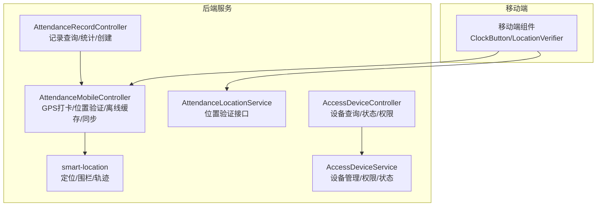
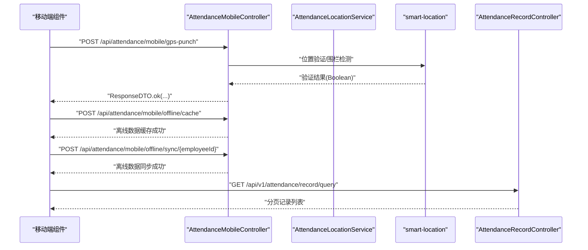
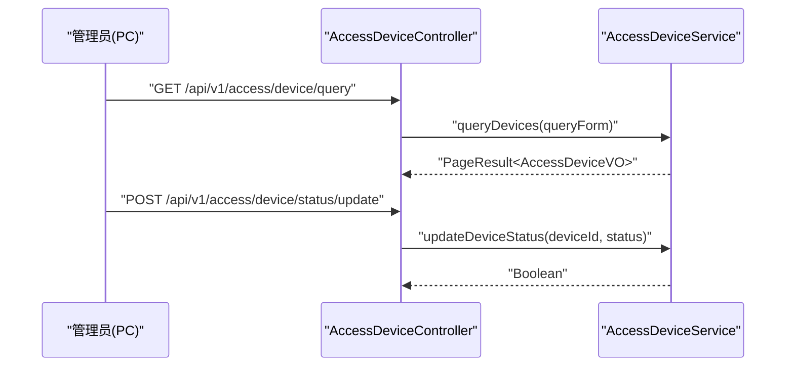
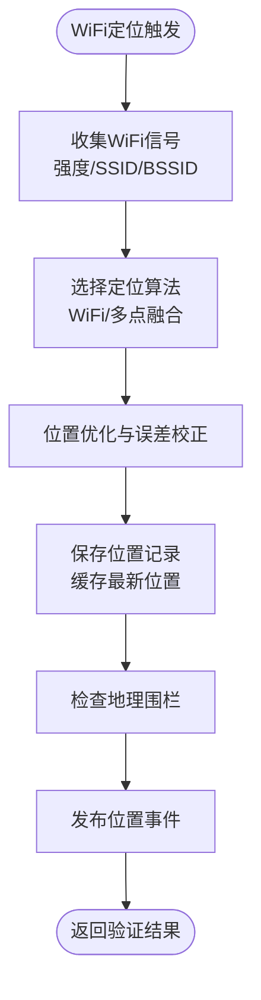
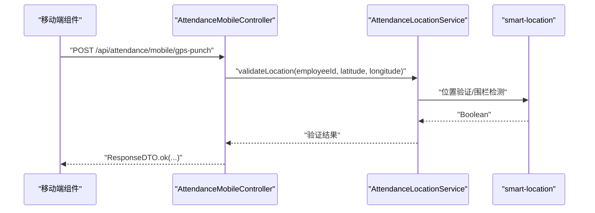
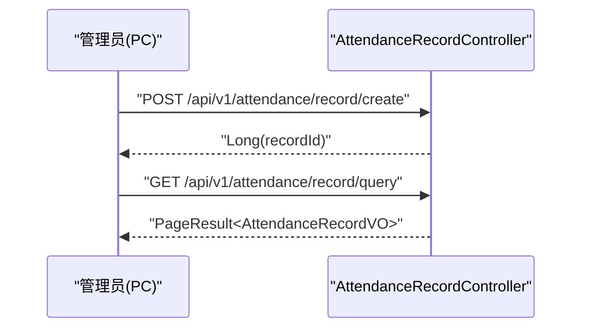
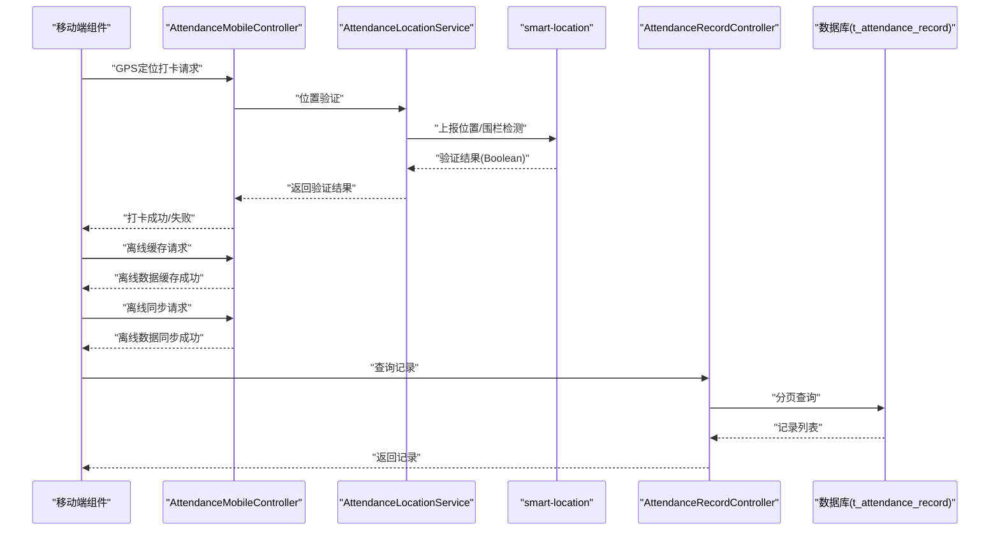
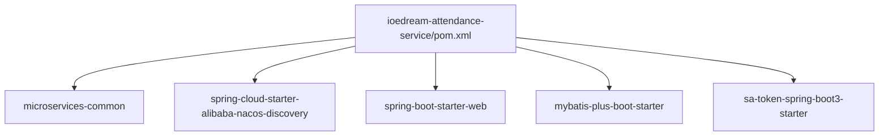

# 打卡方式

<cite>
**本文引用的文件**
- [ioedream-attendance-service/pom.xml](file://microservices/ioedream-attendance-service/pom.xml)
- [AttendanceMobileController.java](file://microservices/ioedream-attendance-service/src/main/java/net/lab1024/sa/attendance/controller/AttendanceMobileController.java)
- [AttendanceRecordController.java](file://microservices/ioedream-attendance-service/src/main/java/net/lab1024/sa/attendance/controller/AttendanceRecordController.java)
- [AttendanceRecordEntity.java](file://microservices/ioedream-attendance-service/src/main/java/net/lab1024/sa/attendance/domain/entity/AttendanceRecordEntity.java)
- [AttendanceLocationService.java](file://microservices/ioedream-attendance-service/src/main/java/net/lab1024/sa/attendance/service/AttendanceLocationService.java)
- [smart-location.md](file://documentation/technical/smart-location.md)
- [smart-access.md](file://documentation/technical/smart-access.md)
- [12-前端API接口设计.md](file://documentation/03-业务模块/考勤/12-前端API接口设计.md)
- [13-前端移动端组件设计.md](file://documentation/03-业务模块/考勤/13-前端移动端组件设计.md)
- [考勤系统数据库ER图设计.md](file://documentation/03-业务模块/各业务模块文档/考勤/考勤系统数据库ER图设计.md)
- [原始记录及考勤计算.md](file://documentation/03-业务模块/各业务模块文档/考勤/原始记录及考勤计算.md)
- [AccessDeviceController.java](file://microservices/ioedream-access-service/src/main/java/net/lab1024/sa/access/controller/AccessDeviceController.java)
- [AccessDeviceService.java](file://microservices/ioedream-access-service/src/main/java/net/lab1024/sa/access/service/AccessDeviceService.java)
</cite>

## 目录
1. [引言](#引言)
2. [项目结构](#项目结构)
3. [核心组件](#核心组件)
4. [架构总览](#架构总览)
5. [详细组件分析](#详细组件分析)
6. [依赖分析](#依赖分析)
7. [性能考虑](#性能考虑)
8. [故障排查指南](#故障排查指南)
9. [结论](#结论)
10. [附录](#附录)

## 引言
本文件围绕“多种打卡方式”的主题，系统化梳理门禁打卡、WiFi打卡、GPS定位打卡、手动打卡等实现机制与技术原理，覆盖配置方法、适用场景、优缺点、前端操作指引以及后端服务处理流程，并通过序列图与流程图直观呈现数据流转过程，帮助开发者与产品人员快速理解与落地。

## 项目结构
- 考勤服务（Attendance Service）提供移动端GPS打卡、位置验证、离线缓存与同步等能力；同时提供PC端考勤记录查询与统计接口。
- 门禁服务（Access Service）提供设备管理、权限授权、实时监控与远程控制等能力，支持门禁设备接入与通行控制。
- 位置服务（smart-location）提供统一的GPS/Wi-Fi/蓝牙/基站定位、地理围栏、位置验证、轨迹分析等能力，为考勤与门禁提供位置支撑。
- 前端移动端组件提供统一的打卡按钮、位置验证、生物识别等交互体验，并与后端服务进行数据对接。

**图表来源**
- [AttendanceMobileController.java](file://microservices/ioedream-attendance-service/src/main/java/net/lab1024/sa/attendance/controller/AttendanceMobileController.java#L52-L111)
- [AttendanceRecordController.java](file://microservices/ioedream-attendance-service/src/main/java/net/lab1024/sa/attendance/controller/AttendanceRecordController.java#L80-L124)
- [AttendanceLocationService.java](file://microservices/ioedream-attendance-service/src/main/java/net/lab1024/sa/attendance/service/AttendanceLocationService.java#L18-L30)
- [smart-location.md](file://documentation/technical/smart-location.md#L1-L120)
- [AccessDeviceController.java](file://microservices/ioedream-access-service/src/main/java/net/lab1024/sa/access/controller/AccessDeviceController.java#L74-L120)
- [AccessDeviceService.java](file://microservices/ioedream-access-service/src/main/java/net/lab1024/sa/access/service/AccessDeviceService.java#L29-L118)

**章节来源**
- [ioedream-attendance-service/pom.xml](file://microservices/ioedream-attendance-service/pom.xml#L21-L86)
- [smart-location.md](file://documentation/technical/smart-location.md#L1-L120)
- [smart-access.md](file://documentation/technical/smart-access.md#L1-L60)

## 核心组件
- 考勤移动端控制器：提供GPS定位打卡、位置验证、离线数据缓存与同步等接口。
- 考勤记录控制器：提供记录分页查询、统计与创建接口。
- 考勤位置服务接口：抽象位置验证能力，便于统一接入定位算法与地理围栏。
- 门禁设备控制器与服务：提供设备查询、状态更新、权限与实时状态等能力。
- 位置服务：提供定位上报、位置验证、地理围栏检测、轨迹分析等能力。

**章节来源**
- [AttendanceMobileController.java](file://microservices/ioedream-attendance-service/src/main/java/net/lab1024/sa/attendance/controller/AttendanceMobileController.java#L52-L111)
- [AttendanceRecordController.java](file://microservices/ioedream-attendance-service/src/main/java/net/lab1024/sa/attendance/controller/AttendanceRecordController.java#L80-L124)
- [AttendanceLocationService.java](file://microservices/ioedream-attendance-service/src/main/java/net/lab1024/sa/attendance/service/AttendanceLocationService.java#L18-L30)
- [AccessDeviceController.java](file://microservices/ioedream-access-service/src/main/java/net/lab1024/sa/access/controller/AccessDeviceController.java#L74-L120)
- [AccessDeviceService.java](file://microservices/ioedream-access-service/src/main/java/net/lab1024/sa/access/service/AccessDeviceService.java#L29-L118)

## 架构总览
下图展示了移动端考勤与门禁相关的关键交互路径，包括GPS定位打卡、位置验证、离线缓存与同步、记录创建与查询，以及门禁设备的状态与权限管理。

**图表来源**
- [AttendanceMobileController.java](file://microservices/ioedream-attendance-service/src/main/java/net/lab1024/sa/attendance/controller/AttendanceMobileController.java#L52-L111)
- [AttendanceRecordController.java](file://microservices/ioedream-attendance-service/src/main/java/net/lab1024/sa/attendance/controller/AttendanceRecordController.java#L80-L124)
- [smart-location.md](file://documentation/technical/smart-location.md#L327-L470)

## 详细组件分析

### 门禁打卡（设备刷卡/读卡）
- 技术原理
  - 门禁设备通过统一协议接入门禁服务，设备状态与权限由门禁服务集中管理。
  - 门禁设备控制器提供设备查询、状态更新、权限授权等接口；门禁服务接口提供设备详情、添加、更新、删除、状态变更等能力。
- 配置方法
  - 在门禁设备控制器中，通过查询接口筛选设备（关键词、区域ID、设备状态、启用状态），并通过状态更新接口调整设备状态。
- 适用场景
  - 办公楼出入口、会议室门禁、区域通道等需要刷卡/读卡通行的场景。
- 优缺点
  - 优点：安全性高、权限可控、可追溯性强。
  - 缺点：依赖设备与网络，离线能力有限。
- 前端操作指引
  - PC端：通过设备查询与状态管理接口进行设备维护与状态调整。
- 后端处理流程
  - 设备CRUD与状态变更由门禁服务接口实现，控制器负责参数校验与权限控制。

**图表来源**
- [AccessDeviceController.java](file://microservices/ioedream-access-service/src/main/java/net/lab1024/sa/access/controller/AccessDeviceController.java#L74-L120)
- [AccessDeviceService.java](file://microservices/ioedream-access-service/src/main/java/net/lab1024/sa/access/service/AccessDeviceService.java#L29-L118)

**章节来源**
- [AccessDeviceController.java](file://microservices/ioedream-access-service/src/main/java/net/lab1024/sa/access/controller/AccessDeviceController.java#L74-L120)
- [AccessDeviceService.java](file://microservices/ioedream-access-service/src/main/java/net/lab1024/sa/access/service/AccessDeviceService.java#L29-L118)
- [smart-access.md](file://documentation/technical/smart-access.md#L1-L60)

### WiFi打卡（基于WiFi信号的定位）
- 技术原理
  - 位置服务支持多定位方式，包括WiFi定位；通过WiFi信号强度与热点信息进行室内定位，结合地理围栏判定是否满足打卡范围。
- 配置方法
  - 在位置服务中配置WiFi最小信号强度、最大有效期等参数，确保WiFi定位的稳定性与准确性。
- 适用场景
  - 室内办公区域、大型园区、地下停车场等GPS弱信号环境。
- 优缺点
  - 优点：无需外设，成本低，适合室内场景。
  - 缺点：精度受环境影响较大，易受干扰。
- 前端操作指引
  - 移动端组件支持开启WiFi定位选项，并在位置设置中进行开关与刷新间隔配置。
- 后端处理流程
  - 位置上报与验证由位置服务统一处理，支持缓存与事件发布。

**图表来源**
- [smart-location.md](file://documentation/technical/smart-location.md#L327-L470)
- [smart-location.md](file://documentation/technical/smart-location.md#L1-L120)

**章节来源**
- [smart-location.md](file://documentation/technical/smart-location.md#L1-L120)
- [13-前端移动端组件设计.md](file://documentation/03-业务模块/考勤/13-前端移动端组件设计.md#L774-L800)

### GPS定位打卡
- 技术原理
  - 移动端上报GPS坐标与精度，后端通过位置服务进行验证与地理围栏检测，确保在有效范围内完成打卡。
- 配置方法
  - 在移动端组件中配置允许范围半径、自动刷新与精度阈值；后端通过位置验证接口进行范围判断。
- 适用场景
  - 大户外场景、外勤打卡、移动办公等。
- 优缺点
  - 优点：精度高、覆盖广。
  - 缺点：室内信号弱、耗电较高。
- 前端操作指引
  - 打卡按钮组件会先验证位置，再进行生物识别，最后发起打卡请求。
- 后端处理流程
  - 移动端控制器提供GPS打卡、位置验证、离线缓存与同步接口；位置服务负责位置上报、验证与地理围栏检测。

**图表来源**
- [AttendanceMobileController.java](file://microservices/ioedream-attendance-service/src/main/java/net/lab1024/sa/attendance/controller/AttendanceMobileController.java#L52-L111)
- [AttendanceLocationService.java](file://microservices/ioedream-attendance-service/src/main/java/net/lab1024/sa/attendance/service/AttendanceLocationService.java#L18-L30)
- [smart-location.md](file://documentation/technical/smart-location.md#L327-L470)

**章节来源**
- [AttendanceMobileController.java](file://microservices/ioedream-attendance-service/src/main/java/net/lab1024/sa/attendance/controller/AttendanceMobileController.java#L52-L111)
- [AttendanceLocationService.java](file://microservices/ioedream-attendance-service/src/main/java/net/lab1024/sa/attendance/service/AttendanceLocationService.java#L18-L30)
- [13-前端移动端组件设计.md](file://documentation/03-业务模块/考勤/13-前端移动端组件设计.md#L182-L242)

### 手动打卡（PC端/后台补录）
- 技术原理
  - PC端控制器提供考勤记录创建接口，支持设备协议推送与后台手动创建。
- 配置方法
  - 通过记录创建接口传入用户ID、设备ID、打卡时间、类型与地址等信息。
- 适用场景
  - 设备异常、网络中断、人工补录等场景。
- 优缺点
  - 优点：灵活、可补录。
  - 缺点：依赖人工，存在误操作风险。
- 前端操作指引
  - PC端：通过记录查询与统计接口查看与核对考勤数据，必要时使用创建接口进行补录。
- 后端处理流程
  - 记录创建接口负责参数校验与权限控制，并返回创建的记录ID。

**图表来源**
- [AttendanceRecordController.java](file://microservices/ioedream-attendance-service/src/main/java/net/lab1024/sa/attendance/controller/AttendanceRecordController.java#L141-L182)
- [AttendanceRecordController.java](file://microservices/ioedream-attendance-service/src/main/java/net/lab1024/sa/attendance/controller/AttendanceRecordController.java#L80-L124)

**章节来源**
- [AttendanceRecordController.java](file://microservices/ioedream-attendance-service/src/main/java/net/lab1024/sa/attendance/controller/AttendanceRecordController.java#L80-L124)
- [AttendanceRecordController.java](file://microservices/ioedream-attendance-service/src/main/java/net/lab1024/sa/attendance/controller/AttendanceRecordController.java#L141-L182)

### 打卡请求处理与数据流转（综合示例）
以下序列图展示了移动端GPS打卡的完整流程，包括位置验证、离线缓存与同步、记录创建与查询。

**图表来源**
- [AttendanceMobileController.java](file://microservices/ioedream-attendance-service/src/main/java/net/lab1024/sa/attendance/controller/AttendanceMobileController.java#L52-L111)
- [AttendanceRecordController.java](file://microservices/ioedream-attendance-service/src/main/java/net/lab1024/sa/attendance/controller/AttendanceRecordController.java#L80-L124)
- [AttendanceRecordEntity.java](file://microservices/ioedream-attendance-service/src/main/java/net/lab1024/sa/attendance/domain/entity/AttendanceRecordEntity.java#L30-L149)
- [smart-location.md](file://documentation/technical/smart-location.md#L327-L470)

**章节来源**
- [AttendanceMobileController.java](file://microservices/ioedream-attendance-service/src/main/java/net/lab1024/sa/attendance/controller/AttendanceMobileController.java#L52-L111)
- [AttendanceRecordController.java](file://microservices/ioedream-attendance-service/src/main/java/net/lab1024/sa/attendance/controller/AttendanceRecordController.java#L80-L124)
- [AttendanceRecordEntity.java](file://microservices/ioedream-attendance-service/src/main/java/net/lab1024/sa/attendance/domain/entity/AttendanceRecordEntity.java#L30-L149)

## 依赖分析
- 考勤服务依赖
  - 依赖 microservices-common、Spring Cloud Nacos Discovery、Web、MyBatis-Plus、Lombok、Sa-Token 等，保证统一的微服务基础设施与权限认证。
- 位置服务依赖
  - 提供定位算法工厂、缓存管理、验证服务与地理围栏检测，支撑考勤与门禁的定位需求。
- 门禁服务依赖
  - 提供设备管理、权限授权、实时状态与区域列表等能力，支撑门禁打卡场景。

**图表来源**
- [ioedream-attendance-service/pom.xml](file://microservices/ioedream-attendance-service/pom.xml#L21-L86)

**章节来源**
- [ioedream-attendance-service/pom.xml](file://microservices/ioedream-attendance-service/pom.xml#L21-L86)
- [smart-location.md](file://documentation/technical/smart-location.md#L1-L120)
- [smart-access.md](file://documentation/technical/smart-access.md#L1-L60)

## 性能考虑
- 定位精度与能耗平衡：在室内场景优先使用WiFi定位，在户外场景使用GPS定位；合理设置刷新间隔与精度阈值，降低能耗。
- 离线缓存与同步：移动端在网络不稳定时缓存打卡数据，待网络恢复后批量同步，减少重复请求与数据库压力。
- 地理围栏容差：合理设置围栏容差与驻留时间，避免频繁触发事件与误判。
- 数据库索引与分页：记录查询采用分页与索引优化，避免大范围扫描导致的延迟。

[本节为通用指导，不涉及具体文件分析]

## 故障排查指南
- 位置权限与权限控制
  - 若移动端无法获取位置或无法打卡，检查位置权限与定位开关；确认控制器中的权限注解与登录态。
- 离线数据异常
  - 若离线缓存或同步失败，检查请求参数与服务日志，确认缓存数量与时间戳是否正确。
- 记录查询异常
  - 若记录查询为空或异常，检查查询条件（员工ID、日期范围、状态、类型）与分页参数。
- 门禁设备状态异常
  - 若设备状态异常，检查设备状态更新接口与权限角色配置。

**章节来源**
- [AttendanceMobileController.java](file://microservices/ioedream-attendance-service/src/main/java/net/lab1024/sa/attendance/controller/AttendanceMobileController.java#L52-L111)
- [AttendanceRecordController.java](file://microservices/ioedream-attendance-service/src/main/java/net/lab1024/sa/attendance/controller/AttendanceRecordController.java#L80-L124)
- [AccessDeviceController.java](file://microservices/ioedream-access-service/src/main/java/net/lab1024/sa/access/controller/AccessDeviceController.java#L74-L120)

## 结论
- 门禁打卡适用于需要刷卡/读卡的固定场景，强调权限与设备管理。
- WiFi打卡适用于室内弱信号场景，需关注信号强度与稳定性。
- GPS定位打卡适用于大户外场景，需平衡精度与能耗。
- 手动打卡适用于异常与补录场景，强调灵活性与可追溯性。
- 建议在实际部署中结合业务场景选择合适的打卡方式，并通过位置服务与门禁服务实现统一的定位与权限控制。

[本节为总结性内容，不涉及具体文件分析]

## 附录
- 前端API接口参考
  - 打卡接口与请求参数、响应数据可参考考勤模块前端API接口设计文档。
- 数据模型参考
  - 考勤记录实体与ER图可参考考勤系统数据库ER图设计与原始记录及考勤计算文档。
- 门禁与位置能力参考
  - 门禁系统公共模块与地理位置公共模块文档提供了设备管理与定位能力的详细说明。

**章节来源**
- [12-前端API接口设计.md](file://documentation/03-业务模块/考勤/12-前端API接口设计.md#L117-L196)
- [考勤系统数据库ER图设计.md](file://documentation/03-业务模块/各业务模块文档/考勤/考勤系统数据库ER图设计.md#L1222-L1275)
- [原始记录及考勤计算.md](file://documentation/03-业务模块/各业务模块文档/考勤/原始记录及考勤计算.md#L75-L140)
- [smart-access.md](file://documentation/technical/smart-access.md#L1-L60)
- [smart-location.md](file://documentation/technical/smart-location.md#L1-L120)