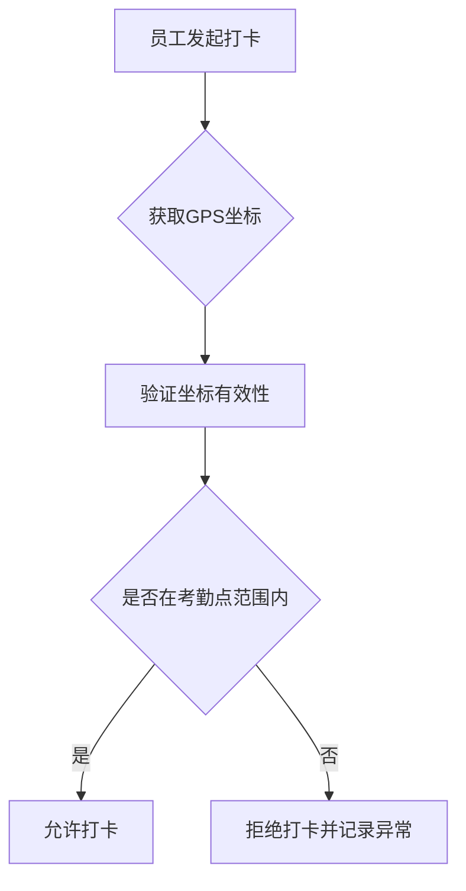
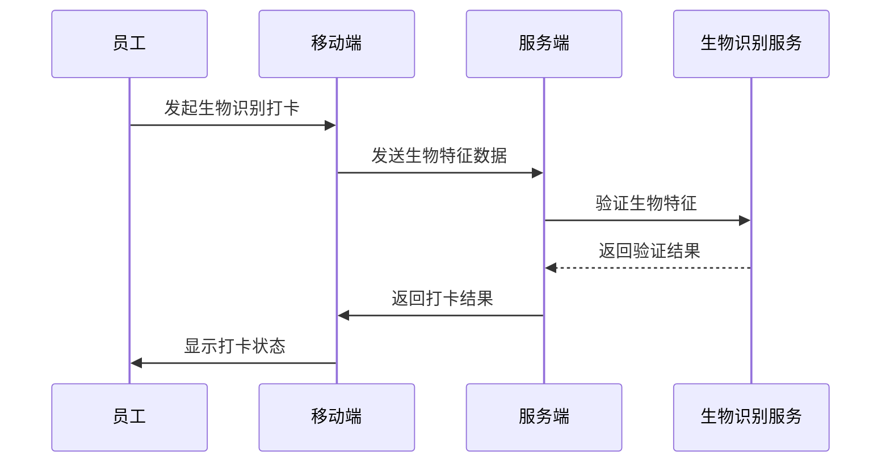
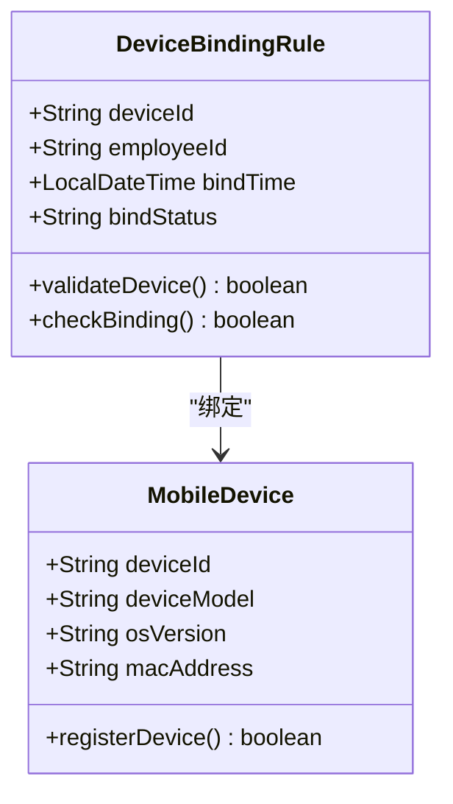
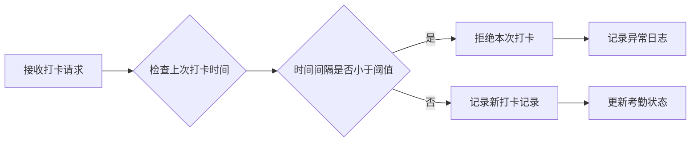
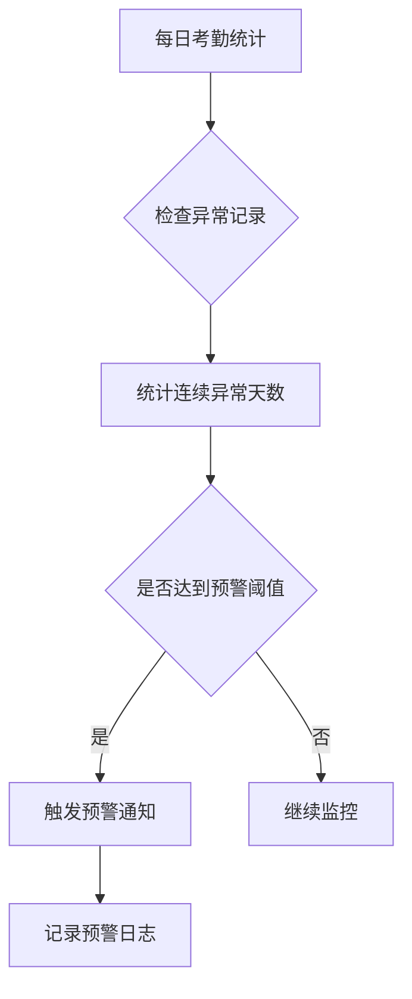
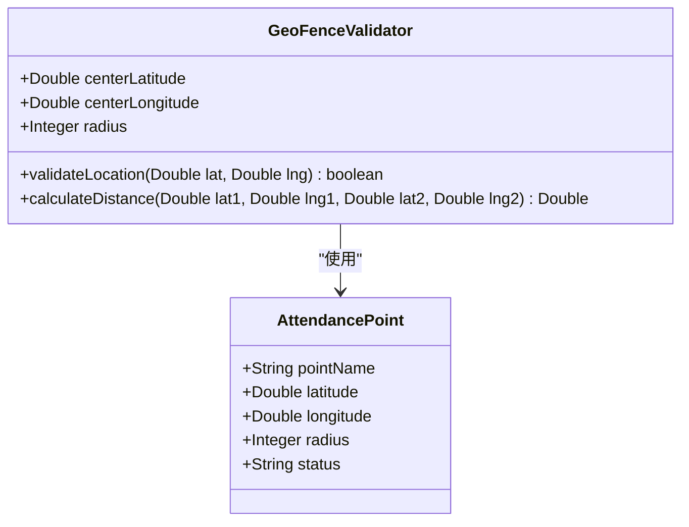
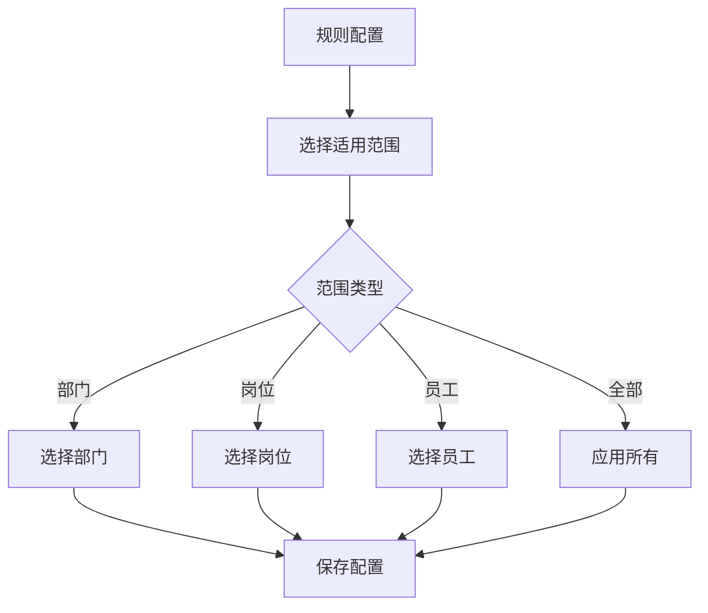
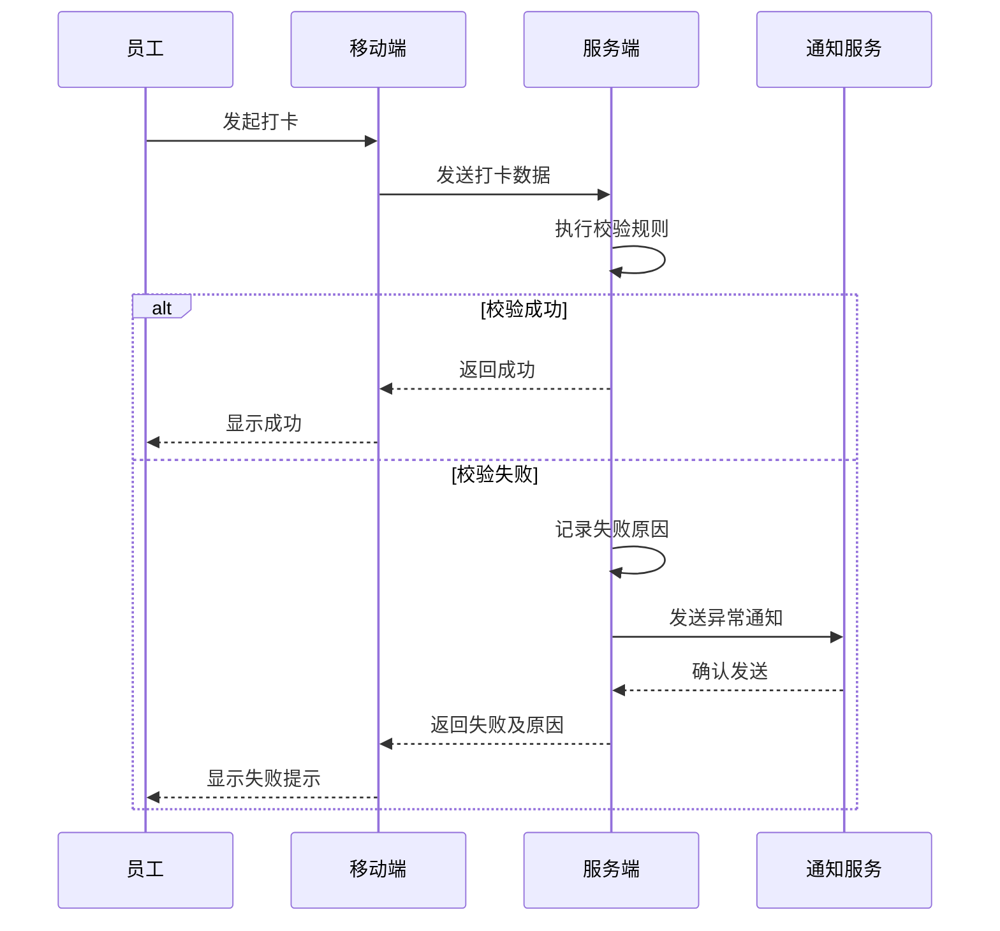

# 打卡校验规则

<cite>
**本文档引用文件**  
- [AttendanceMobileController.java](file://microservices\ioedream-attendance-service\src\main\java\net\lab1024\sa\attendance\controller\AttendanceMobileController.java)
- [AttendanceMobileService.java](file://microservices\ioedream-attendance-service\src\main\java\net\lab1024\sa\attendance\service\AttendanceMobileService.java)
- [AttendanceMobileIntegrationTest.java](file://microservices\ioedream-attendance-service\src\test\java\net\lab1024\sa\attendance\integration\AttendanceMobileIntegrationTest.java)
- [考勤规则配置.md](file://documentation\03-业务模块\考勤\考勤规则配置.md)
- [考勤系统数据库ER图设计.md](file://documentation\03-业务模块\各业务模块文档\考勤\考勤系统数据库ER图设计.md)
- [考勤前端原型布局\规则配置功能布局文档_完整版.md](file://documentation\03-业务模块\各业务模块文档\考勤\考勤前端原型布局\规则配置功能布局文档_完整版.md)
</cite>

## 目录
1. [引言](#引言)
2. [防作弊机制](#防作弊机制)
3. [重复打卡处理](#重复打卡处理)
4. [异常打卡识别](#异常打卡识别)
5. [校验规则配置](#校验规则配置)
6. [校验失败处理流程](#校验失败处理流程)
7. [用户提示信息设计](#用户提示信息设计)
8. [实际案例分析](#实际案例分析)

## 引言
本文档详细介绍了考勤系统中的打卡校验规则，包括防作弊机制、重复打卡处理、异常打卡识别等核心功能的实现原理。系统通过多维度的校验规则确保考勤数据的真实性和准确性，为企业的考勤管理提供可靠的技术支持。

## 防作弊机制
考勤系统采用多种技术手段防止代打卡、虚假打卡等作弊行为，确保考勤数据的真实性。

### GPS位置验证
系统通过GPS定位技术验证员工打卡位置，确保员工在指定范围内打卡。



**图源**  
- [AttendanceMobileController.java](file://microservices\ioedream-attendance-service\src\main\java\net\lab1024\sa\attendance\controller\AttendanceMobileController.java#L73-L80)

### 生物识别验证
系统支持生物识别技术（如人脸识别）进行身份验证，防止代打卡。



**图源**  
- [考勤规则配置.md](file://documentation\03-业务模块\考勤\考勤规则配置.md#L130-L194)

### 设备绑定规则
系统实施设备绑定策略，确保考勤操作只能在授权设备上进行。



**图源**  
- [考勤规则配置.md](file://documentation\03-业务模块\考勤\考勤规则配置.md#L49-L52)

## 重复打卡处理
系统通过智能算法识别和处理重复打卡行为，确保考勤记录的准确性。

### 时间间隔校验
系统设置最小打卡时间间隔，防止短时间内重复打卡。



**图源**  
- [AttendanceMobileService.java](file://microservices\ioedream-attendance-service\src\main\java\net\lab1024\sa\attendance\service\AttendanceMobileService.java#L30-L31)

### 打卡类型识别
系统区分不同类型的打卡操作，避免重复计算。

```mermaid
erDiagram
attendance_records {
bigint id PK
bigint employee_id FK
varchar punch_type
datetime punch_time
decimal latitude
decimal longitude
varchar device_id
varchar status
datetime create_time
}
employees ||--o{ attendance_records : "employee_id"
class attendance_records {
punch_type: clock_in|clock_out|break_start|break_end
}
```

**图源**  
- [考勤系统数据库ER图设计.md](file://documentation\03-业务模块\各业务模块文档\考勤\考勤系统数据库ER图设计.md#L1270-L1275)

## 异常打卡识别
系统通过多维度分析识别异常打卡行为，及时发现潜在问题。

### 连续异常检测
系统监控员工的连续异常打卡行为，如连续多天未打卡。



**图源**  
- [考勤规则配置.md](file://documentation\03-业务模块\考勤\考勤规则配置.md#L389-L397)

### 地理围栏异常
系统检测超出地理围栏范围的打卡行为。



**图源**  
- [考勤规则配置.md](file://documentation\03-业务模块\考勤\考勤规则配置.md#L30-L40)

## 校验规则配置
系统提供灵活的校验规则配置，满足不同场景的需求。

### 规则类型配置
系统支持多种校验规则类型的配置。

```mermaid
erDiagram
attendance_rules {
bigint id PK
varchar rule_name
varchar rule_code
varchar rule_type
text description
json config_json
json warning_config
json notification_config
json applicable_scope
tinyint is_enabled
tinyint status
datetime create_time
datetime update_time
}
class attendance_rules {
rule_type: attendance|warning|notification|mobile
}
```

**图源**  
- [考勤规则配置.md](file://documentation\03-业务模块\考勤\考勤规则配置.md#L10-L24)

### 适用范围配置
规则可配置适用范围，精确控制规则的应用对象。



**图源**  
- [考勤前端原型布局\规则配置功能布局文档_完整版.md](file://documentation\03-业务模块\各业务模块文档\考勤\考勤前端原型布局\规则配置功能布局文档_完整版.md#L857-L902)

## 校验失败处理流程
当打卡校验失败时，系统执行标准化的处理流程。



**图源**  
- [AttendanceMobileController.java](file://microservices\ioedream-attendance-service\src\main\java\net\lab1024\sa\attendance\controller\AttendanceMobileController.java#L57-L65)

## 用户提示信息设计
系统设计了清晰的用户提示信息，帮助用户理解校验结果。

### 成功提示
```json
{
  "code": 200,
  "message": "打卡成功",
  "data": "2025-01-30 09:00:00"
}
```

### 失败提示
```json
{
  "code": 400,
  "message": "位置验证失败",
  "data": {
    "reason": "超出考勤范围",
    "allowedRadius": 100,
    "actualDistance": 150
  }
}
```

**图源**  
- [AttendanceMobileController.java](file://microservices\ioedream-attendance-service\src\main\java\net\lab1024\sa\attendance\controller\AttendanceMobileController.java#L64-L65)

## 实际案例分析
通过实际案例展示系统在不同异常情况下的响应和处理结果。

### 案例一：超出范围打卡
**场景描述**：员工在距离考勤点150米处尝试打卡，而考勤点的有效半径为100米。

**系统响应**：
1. 接收打卡请求，获取GPS坐标
2. 计算当前位置与考勤点的距离
3. 发现距离150米 > 允许半径100米
4. 拒绝打卡请求
5. 返回错误信息："超出考勤范围，请在考勤点100米范围内打卡"

**处理结果**：打卡失败，员工收到提示后移动到考勤点范围内重新打卡成功。

### 案例二：连续三天未打卡
**场景描述**：某员工连续三天未进行任何打卡操作。

**系统响应**：
1. 每日考勤统计发现该员工无打卡记录
2. 累计连续异常天数达到3天
3. 触发预警规则（连续3天未打卡）
4. 向员工发送提醒通知
5. 向直属领导发送预警通知
6. 记录异常日志

**处理结果**：员工收到提醒后及时处理，领导了解情况并跟进。

### 案例三：短时间内重复打卡
**场景描述**：员工在1分钟内连续发起5次打卡请求。

**系统响应**：
1. 接收第一次打卡请求，成功记录
2. 接收后续打卡请求，检查时间间隔
3. 发现时间间隔小于最小间隔要求（30分钟）
4. 拒绝后续打卡请求
5. 记录异常行为日志
6. 向员工提示："打卡过于频繁，请30分钟后再次尝试"

**处理结果**：仅记录一次有效打卡，防止数据污染。

**图源**  
- [AttendanceMobileIntegrationTest.java](file://microservices\ioedream-attendance-service\src\test\java\net\lab1024\sa\attendance\integration\AttendanceMobileIntegrationTest.java#L85-L108)