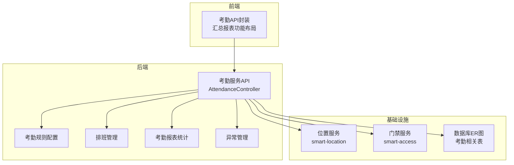
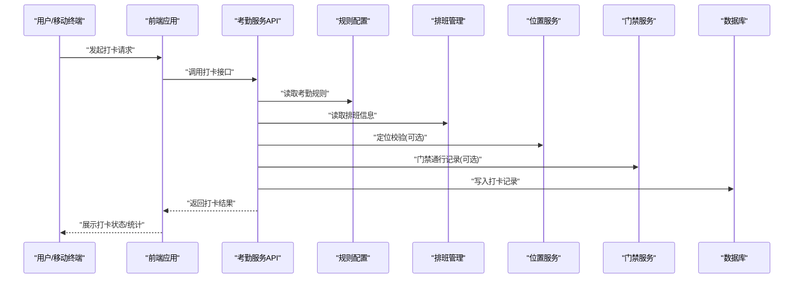
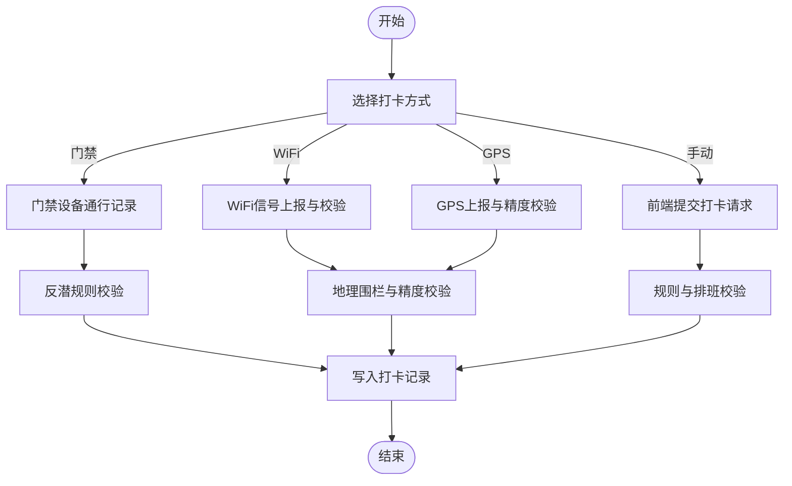
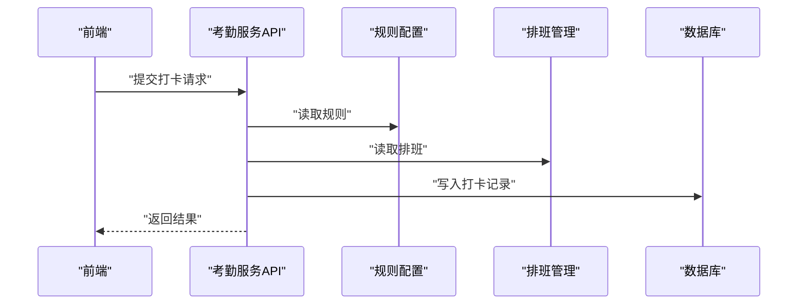
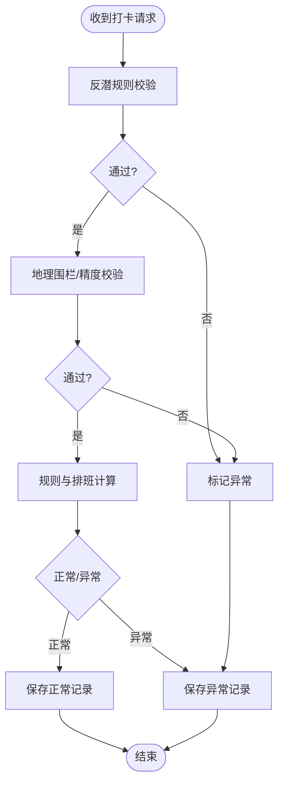
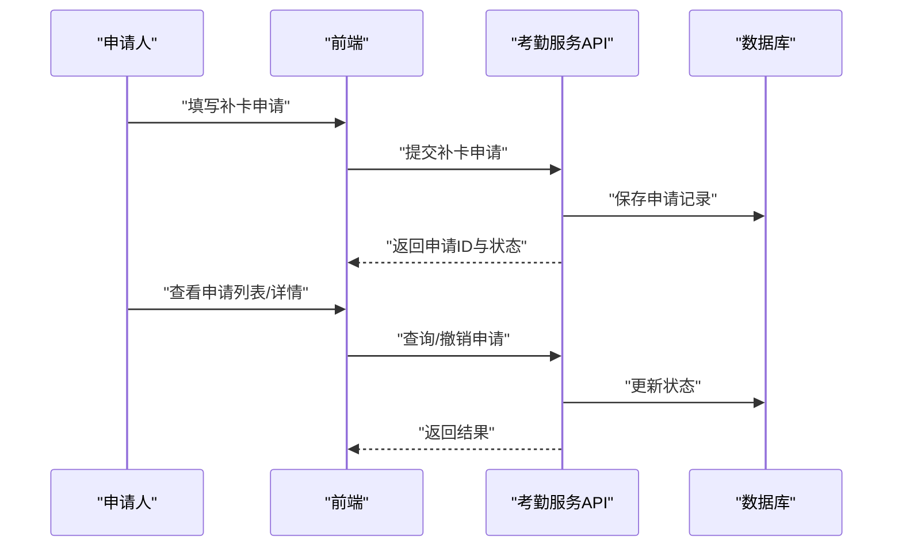
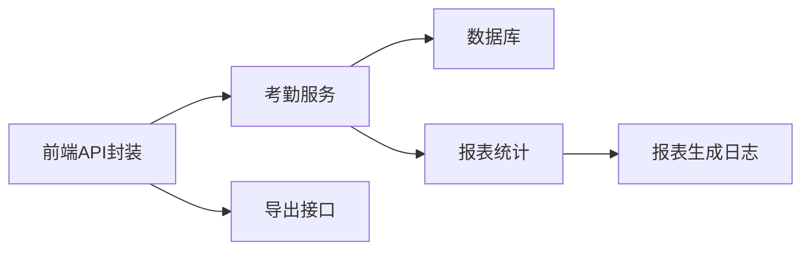
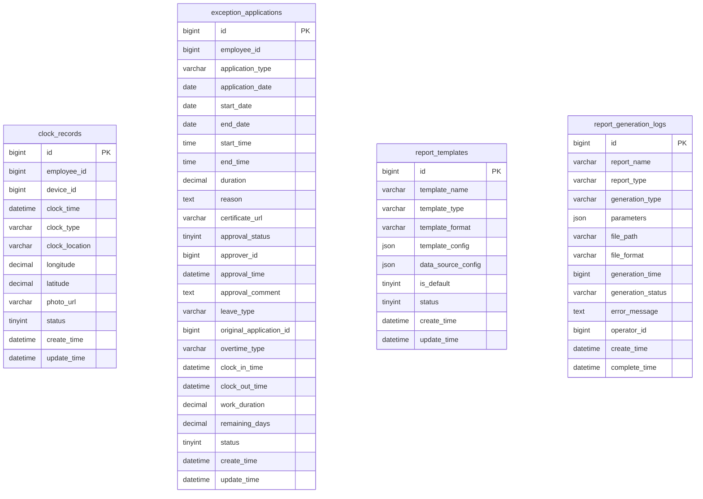

# 打卡管理

<cite>
**本文引用的文件**
- [考勤模块API接口文档.md](file://documentation/06-模板工具/API文档/考勤模块API接口文档.md)
- [AttendanceController.java](file://restful_refactor_backup_20251202_014224/microservices_ioedream-attendance-service_src_main_java_net_lab1024_sa_attendance_controller_AttendanceController.java)
- [考勤规则配置.md](file://documentation/03-业务模块/考勤/考勤规则配置.md)
- [排班管理.md](file://documentation/03-业务模块/考勤/排班管理.md)
- [考勤汇总报表.md](file://documentation/03-业务模块/考勤/考勤汇总报表.md)
- [汇总报表功能布局文档_完整版.md](file://documentation/03-业务模块/考勤/考勤前端原型布局/汇总报表功能布局文档_完整版.md)
- [异常管理.md](file://documentation/03-业务模块/考勤/异常管理.md)
- [考勤系统数据库ER图设计.md](file://documentation/03-业务模块/考勤/考勤系统数据库ER图设计.md)
- [smart-location.md](file://documentation/technical/smart-location.md)
- [smart-access.md](file://documentation/technical/smart-access.md)
- [CLAUDE.md](file://documentation/03-业务模块/门禁/CLAUDE.md)
- [GlobalApbController.java](file://restful_refactor_backup_20251202_014224/microservices_ioedream-access-service_src_main_java_net_lab1024_sa_access_advanced_controller_GlobalApbController.java)
- [t_user.sql](file://database-scripts/common-service/02-t_user.sql)
- [t_employee.sql](file://database-scripts/common-service/18-t_employee.sql)
</cite>

## 目录
1. [简介](#简介)
2. [项目结构](#项目结构)
3. [核心组件](#核心组件)
4. [架构总览](#架构总览)
5. [详细组件分析](#详细组件分析)
6. [依赖分析](#依赖分析)
7. [性能考虑](#性能考虑)
8. [故障排查指南](#故障排查指南)
9. [结论](#结论)
10. [附录](#附录)

## 简介
本文件面向“打卡管理”主题，系统化梳理多种打卡方式（门禁打卡、WiFi打卡、GPS定位打卡、手动打卡）的实现机制；详述打卡记录的采集、存储与处理流程；解释打卡数据的校验规则（含防作弊机制、重复打卡处理、异常打卡识别）；给出补卡申请与审批流程的配置与使用说明；并提供打卡记录查询、导出与统计功能的使用指南。内容以仓库现有文档与接口文档为基础，结合数据库ER图与前后端原型布局，形成可读性强、可落地的参考材料。

## 项目结构
- 后端服务采用微服务架构，考勤相关能力由“考勤模块”提供，包含API接口、规则配置、报表统计等。
- 前端提供考勤模块的API封装与报表页面布局，支持个人/部门统计、导出与趋势分析。
- 位置服务与门禁服务分别提供定位与通行记录，为考勤打卡提供位置与门禁数据支撑。

**章节来源**
- file://documentation/06-模板工具/API文档/考勤模块API接口文档.md#L1-L120
- file://documentation/03-业务模块/考勤/考勤系统数据库ER图设计.md#L1-L120

## 核心组件
- 打卡接口与记录
  - 上班/下班打卡、今日打卡查询、补卡申请与审批、记录分页查询等接口详见“考勤模块API接口文档”。
  - 打卡记录表包含员工ID、设备ID、打卡时间、类型、地点、经纬度、照片、状态等字段，支撑考勤计算与异常识别。
- 规则配置
  - 考勤规则表支持基础规则、工作时间规则、特殊规则（周末/节假日/夜班）、适用范围等，为考勤判定提供依据。
- 排班与班次
  - 排班记录、模板与覆盖规则，支持临时排班、优先级与时间段配置。
- 异常管理
  - 请假、加班、调班、销假、补签等统一管理，支持审批流程与额度控制。
- 报表统计
  - 个人/部门/公司级汇总、趋势分析、异常分析、报表模板与生成日志。
- 位置与门禁
  - 位置上报与验证、地理围栏、门禁通行记录，为定位打卡与门禁打卡提供数据基础。

**章节来源**
- file://documentation/06-模板工具/API文档/考勤模块API接口文档.md#L55-L120
- file://documentation/03-业务模块/考勤/考勤系统数据库ER图设计.md#L1410-L1491
- file://documentation/03-业务模块/考勤/考勤规则配置.md#L1-L120
- file://documentation/03-业务模块/考勤/排班管理.md#L115-L175
- file://documentation/03-业务模块/考勤/异常管理.md#L269-L311
- file://documentation/03-业务模块/考勤/考勤汇总报表.md#L29-L83
- file://documentation/technical/smart-location.md#L316-L323
- file://documentation/03-业务模块/门禁/CLAUDE.md#L420-L434

## 架构总览
下图展示打卡管理的关键交互：前端通过统一API调用考勤服务，考勤服务根据规则与排班计算考勤结果；位置服务与门禁服务提供定位与通行数据；数据库持久化记录与报表。

**图表来源**
- [考勤模块API接口文档.md](file://documentation/06-模板工具/API文档/考勤模块API接口文档.md#L55-L120)
- [AttendanceController.java](file://restful_refactor_backup_20251202_014224/microservices_ioedream-attendance-service_src_main_java_net_lab1024_sa_attendance_controller_AttendanceController.java#L35-L72)
- [smart-location.md](file://documentation/technical/smart-location.md#L404-L469)
- [smart-access.md](file://documentation/technical/smart-access.md#L28-L54)
- [考勤系统数据库ER图设计.md](file://documentation/03-业务模块/考勤/考勤系统数据库ER图设计.md#L1410-L1491)

**章节来源**
- file://documentation/06-模板工具/API文档/考勤模块API接口文档.md#L55-L120
- file://restful_refactor_backup_20251202_014224/microservices_ioedream-attendance-service_src_main_java_net_lab1024_sa_attendance_controller_AttendanceController.java#L35-L72

## 详细组件分析

### 打卡方式与实现机制
- 门禁打卡
  - 门禁设备产生通行记录，包含设备ID、通行时间、进出方向、权限验证结果、照片URL等，可用于门禁打卡记录。
  - 门禁反潜（Anti-Passback）规则用于防止“替人打卡”，通过用户在区域内的通行顺序与方向进行校验。
- WiFi打卡
  - 通过位置服务上报WiFi信号强度、定位精度与时间窗口，结合地理围栏与考勤规则判断是否满足WiFi打卡条件。
- GPS定位打卡
  - 位置服务支持GPS上报、精度校验、缓存与地理围栏检测，打卡时可要求在有效半径内且精度达标。
- 手动打卡
  - 前端调用考勤API提交打卡请求，携带员工ID、打卡时间、位置信息与可选照片，服务端根据规则判定状态。

**图表来源**
- [CLAUDE.md](file://documentation/03-业务模块/门禁/CLAUDE.md#L420-L434)
- [smart-location.md](file://documentation/technical/smart-location.md#L316-L323)
- [考勤模块API接口文档.md](file://documentation/06-模板工具/API文档/考勤模块API接口文档.md#L55-L120)
- [GlobalApbController.java](file://restful_refactor_backup_20251202_014224/microservices_ioedream-access-service_src_main_java_net_lab1024_sa_access_advanced_controller_GlobalApbController.java#L1-L288)

**章节来源**
- file://documentation/03-业务模块/门禁/CLAUDE.md#L420-L434
- file://documentation/technical/smart-location.md#L316-L323
- file://documentation/06-模板工具/API文档/考勤模块API接口文档.md#L55-L120
- file://restful_refactor_backup_20251202_014224/microservices_ioedream-access-service_src_main_java_net_lab1024_sa_access_advanced_controller_GlobalApbController.java#L1-L288

### 打卡记录采集、存储与处理流程
- 采集
  - 前端通过统一API提交打卡请求；门禁设备与位置上报分别产生通行记录与位置记录。
- 存储
  - 打卡记录表包含员工ID、设备ID、时间、类型、地点、经纬度、照片、状态等字段；位置记录包含经纬度、精度、时间、类型等。
- 处理
  - 服务端根据规则配置与排班信息判定打卡状态（正常/异常），并写入数据库；同时可触发地理围栏与反潜校验。

**图表来源**
- [AttendanceController.java](file://restful_refactor_backup_20251202_014224/microservices_ioedream-attendance-service_src_main_java_net_lab1024_sa_attendance_controller_AttendanceController.java#L35-L72)
- [考勤模块API接口文档.md](file://documentation/06-模板工具/API文档/考勤模块API接口文档.md#L55-L120)
- [考勤系统数据库ER图设计.md](file://documentation/03-业务模块/考勤/考勤系统数据库ER图设计.md#L1410-L1491)

**章节来源**
- file://restful_refactor_backup_20251202_014224/microservices_ioedream-attendance-service_src_main_java_net_lab1024_sa_attendance_controller_AttendanceController.java#L35-L72
- file://documentation/03-业务模块/考勤/考勤系统数据库ER图设计.md#L1410-L1491

### 打卡数据校验规则与防作弊机制
- 防作弊（反潜）
  - 门禁反潜规则通过用户在区域内的通行顺序与方向进行校验，防止替人打卡；支持启用/禁用、测试、统计与历史查询。
- 重复打卡处理
  - 规则配置中可设置迟到/早退容忍时间、最小工作时长、异常阈值等；服务端在计算时对同一天重复打卡进行去重与合并处理。
- 异常打卡识别
  - 基于地理围栏、精度阈值、时间窗口与规则配置综合判定；异常记录进入异常管理流程，支持审批与额度控制。

**图表来源**
- [GlobalApbController.java](file://restful_refactor_backup_20251202_014224/microservices_ioedream-access-service_src_main_java_net_lab1024_sa_access_advanced_controller_GlobalApbController.java#L1-L288)
- [考勤规则配置.md](file://documentation/03-业务模块/考勤/考勤规则配置.md#L223-L326)
- [smart-location.md](file://documentation/technical/smart-location.md#L316-L323)

**章节来源**
- file://restful_refactor_backup_20251202_014224/microservices_ioedream-access-service_src_main_java_net_lab1024_sa_access_advanced_controller_GlobalApbController.java#L1-L288
- file://documentation/03-业务模块/考勤/考勤规则配置.md#L223-L326
- file://documentation/technical/smart-location.md#L316-L323

### 补卡申请与审批流程
- 申请
  - 前端提交补卡申请，包含员工ID、补卡日期、打卡类型、原因、位置与照片等；服务端返回申请ID与初始状态。
- 审批
  - 支持按员工/部门/状态/时间范围查询补卡申请列表；支持查看详情、撤销申请；审批完成后更新打卡记录。
- 配置
  - 适用范围（部门/岗位/员工级别/入职时长/排除人员）与条件（绩效/出勤率/无违纪记录）可在规则配置中设定。

**图表来源**
- [考勤模块API接口文档.md](file://documentation/06-模板工具/API文档/考勤模块API接口文档.md#L318-L435)
- [异常管理.md](file://documentation/03-业务模块/考勤/异常管理.md#L269-L311)

**章节来源**
- file://documentation/06-模板工具/API文档/考勤模块API接口文档.md#L318-L435
- file://documentation/03-业务模块/考勤/异常管理.md#L269-L311

### 打卡记录查询、导出与统计
- 查询
  - 支持按员工ID、日期范围、类型等条件分页查询；提供今日打卡记录查询接口。
- 导出
  - 前端提供导出接口封装，支持个人/部门报表导出。
- 统计
  - 提供个人汇总、部门统计、对比分析、趋势分析、异常分析等；支持报表模板与生成日志。

**图表来源**
- [汇总报表功能布局文档_完整版.md](file://documentation/03-业务模块/考勤/考勤前端原型布局/汇总报表功能布局文档_完整版.md#L72-L125)
- [考勤汇总报表.md](file://documentation/03-业务模块/考勤/考勤汇总报表.md#L29-L83)

**章节来源**
- file://documentation/03-业务模块/考勤/考勤前端原型布局/汇总报表功能布局文档_完整版.md#L72-L125
- file://documentation/03-业务模块/考勤/考勤汇总报表.md#L29-L83

## 依赖分析
- 组件耦合
  - 考勤服务依赖规则配置、排班管理、位置服务与门禁服务；数据库承担记录与报表数据存储。
- 外部依赖
  - 位置服务提供定位上报、精度校验与地理围栏；门禁服务提供通行记录与反潜校验。
- 数据模型
  - 打卡记录表、异常申请表、报表模板与生成日志表构成核心数据模型。

**图表来源**
- [考勤系统数据库ER图设计.md](file://documentation/03-业务模块/考勤/考勤系统数据库ER图设计.md#L1410-L1491)
- [考勤系统数据库ER图设计.md](file://documentation/03-业务模块/考勤/考勤系统数据库ER图设计.md#L985-L1092)
- [考勤汇总报表.md](file://documentation/03-业务模块/考勤/考勤汇总报表.md#L29-L83)

**章节来源**
- file://documentation/03-业务模块/考勤/考勤系统数据库ER图设计.md#L1410-L1491
- file://documentation/03-业务模块/考勤/考勤系统数据库ER图设计.md#L985-L1092
- file://documentation/03-业务模块/考勤/考勤汇总报表.md#L29-L83

## 性能考虑
- 位置上报与缓存
  - 位置服务支持缓存最新位置与近期有效性判断，减少重复查询与计算开销。
- 打卡并发
  - 打卡接口应避免重复提交与并发冲突，可通过规则与数据库约束保证幂等性。
- 报表生成
  - 报表模板与生成日志支持批量与定时生成，建议异步执行并设置合理的时间窗口与阈值。

[本节为通用指导，无需特定文件引用]

## 故障排查指南
- 常见错误码
  - 考勤记录不存在、已经打过卡、不在打卡时间/位置范围内、规则不存在、补卡申请次数超限、已审批等。
- 门禁反潜
  - 检查反潜规则状态、用户通行历史与区域权限；必要时重置计数器或清除记录。
- 位置上报
  - 校验定位精度、时间窗口与地理围栏半径；确认设备绑定与权限配置。

**章节来源**
- file://documentation/06-模板工具/API文档/考勤模块API接口文档.md#L956-L968
- file://restful_refactor_backup_20251202_014224/microservices_ioedream-access-service_src_main_java_net_lab1024_sa_access_advanced_controller_GlobalApbController.java#L1-L288
- file://documentation/technical/smart-location.md#L316-L323

## 结论
本文件基于现有文档与接口，系统化梳理了打卡管理的多种方式、记录采集与处理、规则与防作弊机制、补卡流程以及查询导出与统计功能。建议在实际落地时，结合规则配置与排班管理，完善异常处理与报表分析，确保系统稳定、可审计、可扩展。

[本节为总结性内容，无需特定文件引用]

## 附录
- 用户与员工数据
  - 用户表与员工表提供身份与组织关系基础，考勤记录通常与员工ID关联。

**章节来源**
- file://database-scripts/common-service/02-t_user.sql#L1-L41
- file://database-scripts/common-service/18-t_employee.sql#L1-L69