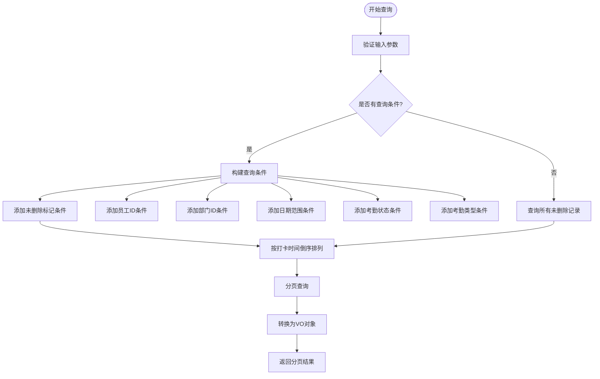
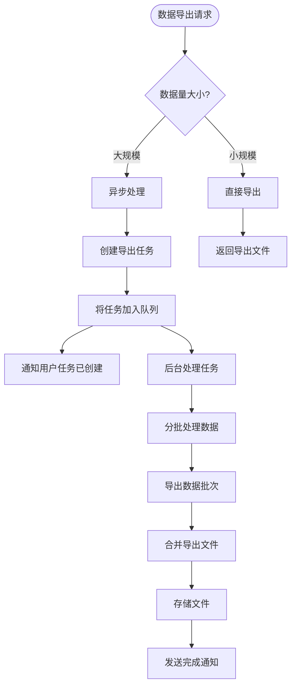
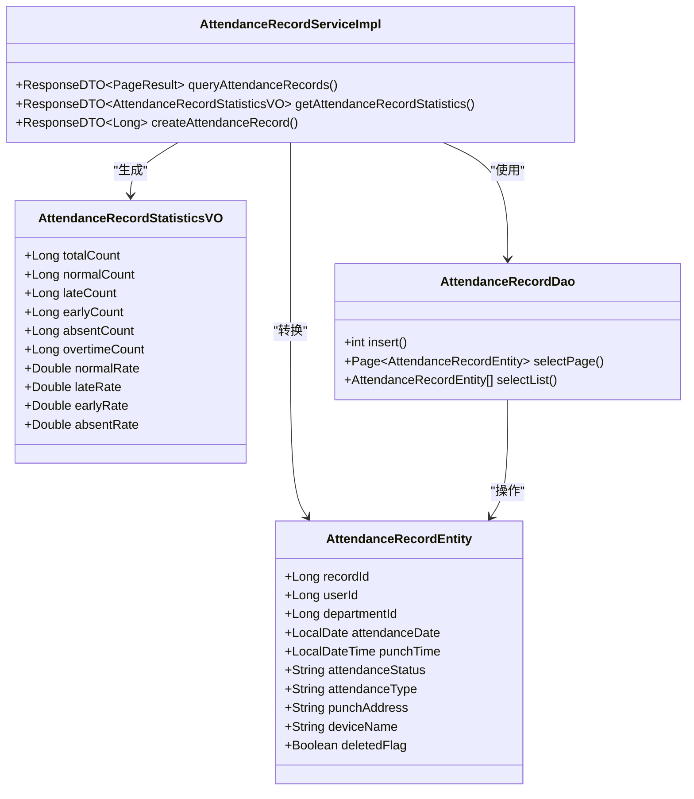
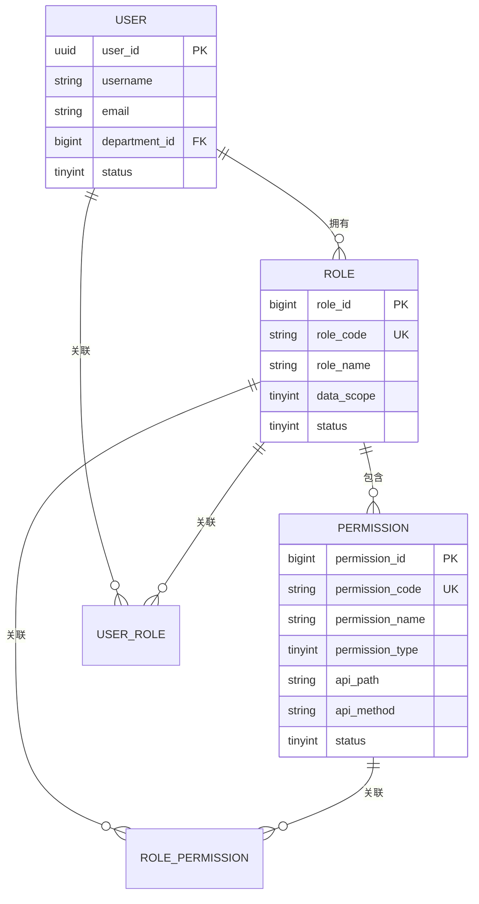
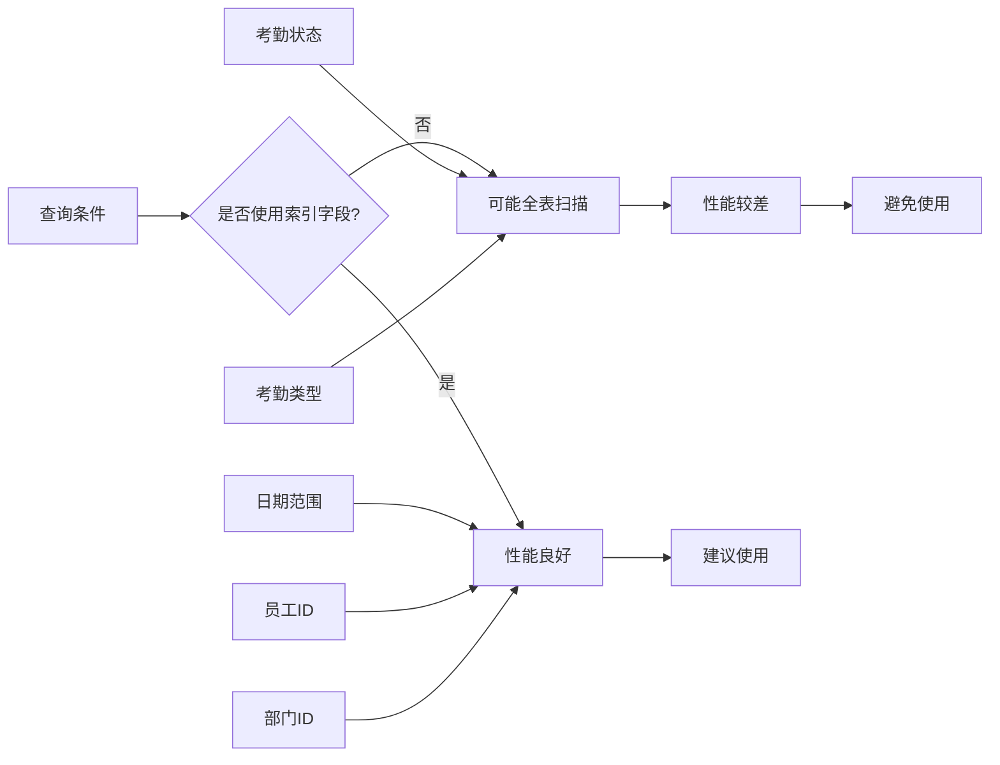

# 打卡记录管理

<cite>
**本文档引用文件**   
- [AttendanceRecordController.java](file://microservices/ioedream-attendance-service/src/main/java/net/lab1024/sa/attendance/controller/AttendanceRecordController.java)
- [AttendanceRecordQueryForm.java](file://microservices/ioedream-attendance-service/src/main/java/net/lab1024/sa/attendance/domain/form/AttendanceRecordQueryForm.java)
- [AttendanceRecordVO.java](file://microservices/ioedream-attendance-service/src/main/java/net/lab1024/sa/attendance/domain/vo/AttendanceRecordVO.java)
- [AttendanceRecordStatisticsVO.java](file://microservices/ioedream-attendance-service/src/main/java/net/lab1024/sa/attendance/domain/vo/AttendanceRecordStatisticsVO.java)
- [AttendanceRecordServiceImpl.java](file://microservices/ioedream-attendance-service/src/main/java/net/lab1024/sa/attendance/service/impl/AttendanceRecordServiceImpl.java)
- [AttendanceRecordDao.java](file://microservices/ioedream-attendance-service/src/main/java/net/lab1024/sa/attendance/dao/AttendanceRecordDao.java)
- [performance_optimization.sql](file://database/performance_optimization.sql)
- [t_role.sql](file://database-scripts/common-service/03-t_role.sql)
- [t_permission.sql](file://database-scripts/common-service/04-t_permission.sql)
- [application.yml](file://microservices/ioedream-attendance-service/src/main/resources/application.yml)
</cite>

## 目录

1. [介绍](#介绍)
2. [打卡记录查询功能](#打卡记录查询功能)
3. [数据导出与大规模处理](#数据导出与大规模处理)
4. [统计报表生成与可视化](#统计报表生成与可视化)
5. [权限控制机制](#权限控制机制)
6. [性能优化与查询技巧](#性能优化与查询技巧)

## 介绍

打卡记录管理是考勤系统的核心功能模块，负责记录、查询、统计和分析员工的考勤数据。本系统通过微服务架构实现，主要由`ioedream-attendance-service`微服务提供相关API接口。系统支持多条件组合查询、分页展示、数据统计、报表生成等功能，同时具备完善的权限控制机制，确保数据安全。

**本文档引用文件**   
- [AttendanceRecordController.java](file://microservices/ioedream-attendance-service/src/main/java/net/lab1024/sa/attendance/controller/AttendanceRecordController.java)
- [AttendanceRecordServiceImpl.java](file://microservices/ioedream-attendance-service/src/main/java/net/lab1024/sa/attendance/service/impl/AttendanceRecordServiceImpl.java)

## 打卡记录查询功能

打卡记录查询功能允许用户根据多种条件组合查询员工的考勤记录。系统提供了灵活的查询接口，支持按员工、部门、日期范围、考勤状态和考勤类型等条件进行筛选。

### 查询条件说明

系统支持以下查询条件的组合使用：

- **员工ID**: 精确查询特定员工的考勤记录
- **部门ID**: 查询特定部门所有员工的考勤记录
- **日期范围**: 指定开始日期和结束日期，查询该时间段内的考勤记录
- **考勤状态**: 包括正常(NORMAL)、迟到(LATE)、早退(EARLY)、缺勤(ABSENT)、加班(OVERTIME)等状态
- **考勤类型**: 区分上班打卡(CHECK_IN)和下班打卡(CHECK_OUT)

查询接口采用分页机制，默认每页显示20条记录，支持自定义页码和每页大小。



**图表来源**
- [AttendanceRecordQueryForm.java](file://microservices/ioedream-attendance-service/src/main/java/net/lab1024/sa/attendance/domain/form/AttendanceRecordQueryForm.java)
- [AttendanceRecordServiceImpl.java](file://microservices/ioedream-attendance-service/src/main/java/net/lab1024/sa/attendance/service/impl/AttendanceRecordServiceImpl.java)

**章节来源**
- [AttendanceRecordController.java](file://microservices/ioedream-attendance-service/src/main/java/net/lab1024/sa/attendance/controller/AttendanceRecordController.java#L80-L124)
- [AttendanceRecordQueryForm.java](file://microservices/ioedream-attendance-service/src/main/java/net/lab1024/sa/attendance/domain/form/AttendanceRecordQueryForm.java)

## 数据导出与大规模处理

系统支持将查询结果导出为多种格式，满足不同场景下的数据处理需求。对于大规模数据处理，系统提供了优化建议以确保性能和稳定性。

### 导出格式选项

系统支持以下数据导出格式：

- **Excel**: 适用于需要在本地进行数据分析和处理的场景
- **CSV**: 适用于大数据量导出和与其他系统集成
- **PDF**: 适用于生成正式报告和存档

### 大规模数据处理建议

当处理大规模数据时，建议采取以下措施：

1. **分批处理**: 将大查询拆分为多个小查询，避免单次查询数据量过大
2. **使用游标分页**: 采用基于时间戳或ID的游标分页，替代传统的LIMIT OFFSET分页，提高查询效率
3. **异步导出**: 对于超大数据量的导出请求，采用异步处理模式，避免请求超时
4. **索引优化**: 确保查询条件字段已建立适当索引，提高查询性能



**图表来源**
- [AttendanceRecordServiceImpl.java](file://microservices/ioedream-attendance-service/src/main/java/net/lab1024/sa/attendance/service/impl/AttendanceRecordServiceImpl.java)
- [performance_optimization.sql](file://database/performance_optimization.sql)

**章节来源**
- [AttendanceRecordServiceImpl.java](file://microservices/ioedream-attendance-service/src/main/java/net/lab1024/sa/attendance/service/impl/AttendanceRecordServiceImpl.java#L50-L117)

## 统计报表生成与可视化

系统提供丰富的统计报表功能，能够根据指定时间范围和员工信息生成考勤统计数据，并支持可视化展示。

### 统计报表生成逻辑

统计报表的生成基于以下逻辑：

1. 根据指定的开始日期和结束日期构建查询条件
2. 可选地指定员工ID，若未指定则统计所有员工的数据
3. 查询符合条件的所有考勤记录
4. 按考勤状态分类统计各项数据：
   - 总打卡次数
   - 正常打卡次数
   - 迟到次数
   - 早退次数
   - 缺勤次数
   - 加班次数
5. 计算各项比率（正常率、迟到率、早退率、缺勤率）

### 可视化展示方式

统计结果支持多种可视化展示方式：

- **柱状图**: 展示各项考勤状态的对比
- **饼图**: 展示各项考勤状态的占比
- **折线图**: 展示考勤趋势变化
- **表格**: 展示详细的统计数据



**图表来源**
- [AttendanceRecordStatisticsVO.java](file://microservices/ioedream-attendance-service/src/main/java/net/lab1024/sa/attendance/domain/vo/AttendanceRecordStatisticsVO.java)
- [AttendanceRecordServiceImpl.java](file://microservices/ioedream-attendance-service/src/main/java/net/lab1024/sa/attendance/service/impl/AttendanceRecordServiceImpl.java#L120-L190)

**章节来源**
- [AttendanceRecordController.java](file://microservices/ioedream-attendance-service/src/main/java/net/lab1024/sa/attendance/controller/AttendanceRecordController.java#L184-L208)
- [AttendanceRecordStatisticsVO.java](file://microservices/ioedream-attendance-service/src/main/java/net/lab1024/sa/attendance/domain/vo/AttendanceRecordStatisticsVO.java)

## 权限控制机制

系统采用基于角色的权限控制机制(RBAC)，确保不同角色的用户只能访问其权限范围内的数据。

### 角色与数据权限

系统定义了多种角色，每种角色具有不同的数据访问权限：

- **考勤管理员(ATTENDANCE_MANAGER)**: 拥有全部考勤数据的访问权限
- **部门经理**: 只能访问本部门及下属部门的考勤数据
- **普通员工**: 只能访问自己的考勤数据

角色表(t_role)中的`data_scope`字段定义了数据权限范围：
- 1-全部
- 2-自定义
- 3-本部门
- 4-本部门及子部门
- 5-仅本人

### 接口权限控制

系统通过Spring Security的`@PreAuthorize`注解实现接口级别的权限控制。例如，考勤记录查询和统计接口要求用户具有`ATTENDANCE_MANAGER`角色：

```java
@PreAuthorize("hasRole('ATTENDANCE_MANAGER')")
public ResponseDTO<PageResult<AttendanceRecordVO>> queryAttendanceRecords()
```

权限表(t_permission)记录了每个权限的详细信息，包括权限编码、权限名称、权限类型(菜单、按钮、接口、数据)和API路径等。



**图表来源**
- [t_role.sql](file://database-scripts/common-service/03-t_role.sql)
- [t_permission.sql](file://database-scripts/common-service/04-t_permission.sql)
- [AttendanceRecordController.java](file://microservices/ioedream-attendance-service/src/main/java/net/lab1024/sa/attendance/controller/AttendanceRecordController.java#L94)

**章节来源**
- [t_role.sql](file://database-scripts/common-service/03-t_role.sql)
- [t_permission.sql](file://database-scripts/common-service/04-t_permission.sql)
- [AttendanceRecordController.java](file://microservices/ioedream-attendance-service/src/main/java/net/lab1024/sa/attendance/controller/AttendanceRecordController.java#L94-L95)

## 性能优化与查询技巧

为确保系统在高并发和大数据量场景下的性能表现，系统实施了多项性能优化措施。

### 数据库索引优化

系统针对考勤记录表(t_attendance_record)建立了多个复合索引，以优化常见查询场景的性能：

- **用户日期索引**: `idx_attendance_user_date` (user_id, record_date DESC, record_time DESC, deleted_flag)
- **班次日期索引**: `idx_attendance_shift_date` (shift_id, record_date DESC, deleted_flag)
- **时间范围索引**: `idx_attendance_time_range` (record_date DESC, record_time DESC, deleted_flag)

这些索引显著提升了按用户、班次和时间范围查询的性能。

### 查询性能影响

不同查询条件的组合使用对性能有不同影响：

- **单条件查询**: 性能最佳，能够充分利用单一索引
- **多条件组合查询**: 需要数据库优化器选择最佳执行计划，可能无法充分利用所有索引
- **模糊查询**: 如未建立适当索引，可能导致全表扫描，性能较差

建议在实际使用中，优先使用索引字段作为查询条件，并避免在高并发时段执行复杂的大数据量查询。



**图表来源**
- [performance_optimization.sql](file://database/performance_optimization.sql)
- [AttendanceRecordServiceImpl.java](file://microservices/ioedream-attendance-service/src/main/java/net/lab1024/sa/attendance/service/impl/AttendanceRecordServiceImpl.java)

**章节来源**
- [performance_optimization.sql](file://database/performance_optimization.sql#L56-L76)
- [AttendanceRecordServiceImpl.java](file://microservices/ioedream-attendance-service/src/main/java/net/lab1024/sa/attendance/service/impl/AttendanceRecordServiceImpl.java#L56-L90)