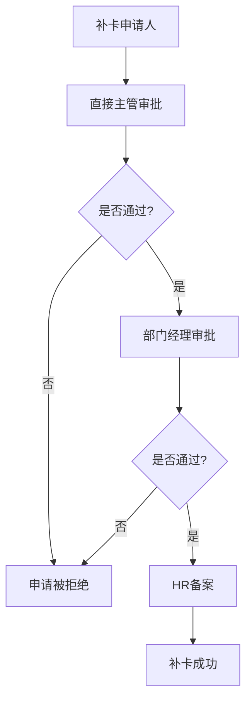
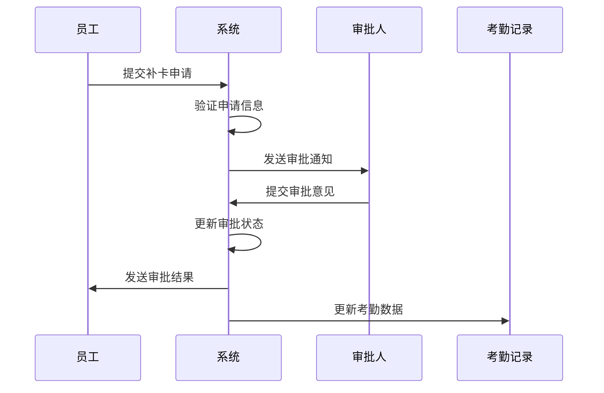
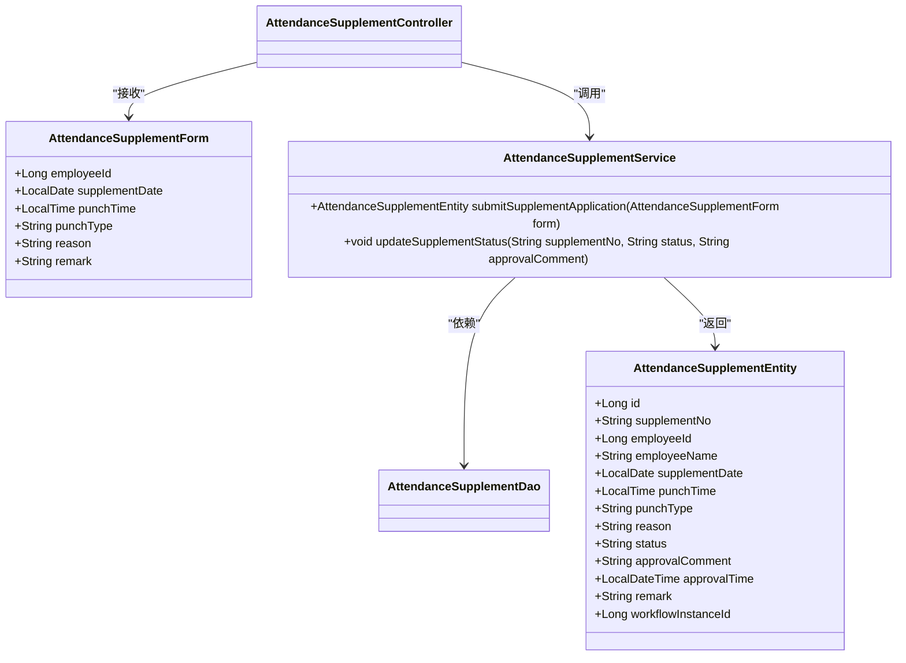
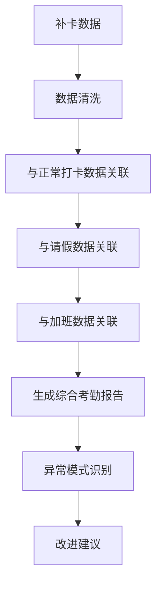

# 补卡流程

<cite>
**本文档引用文件**  
- [AttendanceSupplementController.java](file://microservices\ioedream-attendance-service\src\main\java\net\lab1024\sa\attendance\controller\AttendanceSupplementController.java)
- [AttendanceSupplementEntity.java](file://microservices\ioedream-attendance-service\src\main\java\net\lab1024\sa\attendance\domain\entity\AttendanceSupplementEntity.java)
- [AttendanceSupplementForm.java](file://microservices\ioedream-attendance-service\src\main\java\net\lab1024\sa\attendance\domain\form\AttendanceSupplementForm.java)
- [AttendanceSupplementService.java](file://microservices\ioedream-attendance-service\src\main\java\net\lab1024\sa\attendance\service\AttendanceSupplementService.java)
- [AttendanceSupplementServiceImpl.java](file://microservices\ioedream-attendance-service\src\main\java\net\lab1024\sa\attendance\service\impl\AttendanceSupplementServiceImpl.java)
- [AttendanceSupplementDao.java](file://microservices\ioedream-attendance-service\src\main\java\net\lab1024\sa\attendance\dao\AttendanceSupplementDao.java)
- [考勤模块API接口文档.md](file://documentation\06-模板工具\API文档\考勤模块API接口文档.md)
- [异常管理.md](file://documentation\03-业务模块\考勤\异常管理.md)
- [考勤模块用户操作手册.md](file://documentation\02-开发指南\用户手册\考勤模块用户操作手册.md)
- [smart-workflow.md](file://documentation\technical\smart-workflow.md)
</cite>

## 目录
1. [引言](#引言)
2. [补卡申请条件与限制](#补卡申请条件与限制)
3. [审批权限配置](#审批权限配置)
4. [补卡审批流程](#补卡审批流程)
5. [前端操作界面使用说明](#前端操作界面使用说明)
6. [后端服务处理逻辑](#后端服务处理逻辑)
7. [补卡记录查询与统计](#补卡记录查询与统计)
8. [与其他考勤数据的关联分析](#与其他考勤数据的关联分析)
9. [结论](#结论)

## 引言

补卡流程是考勤管理系统中的重要组成部分，用于处理员工因各种原因未能正常打卡的情况。本文档详细描述了补卡申请、审批、记录更新的全流程，包括补卡申请的条件限制、审批权限配置和审批流程设置。同时，提供了前端操作界面的使用说明和后端服务的处理逻辑，并包含补卡记录的查询和统计功能，以及与其他考勤数据的关联分析方法。

## 补卡申请条件与限制

补卡申请需要满足一定的条件和限制，以确保考勤数据的准确性和公平性。

### 申请条件

1. **员工身份验证**：申请人必须是系统注册的正式员工，且在职状态正常。
2. **时间限制**：补卡申请必须在缺卡发生后的一定时间内提交，通常为3个工作日内。
3. **唯一性**：同一时间段内只能提交一次补卡申请，避免重复补卡。
4. **原因说明**：申请人必须提供合理的补卡原因，如忘记打卡、设备故障等。

### 限制条件

1. **频率限制**：每位员工每月补卡次数有限制，通常不超过3次。
2. **时间段限制**：不允许对超过规定时间范围的打卡记录进行补卡。
3. **审批前置条件**：补卡申请必须经过直接主管审批，未经审批的申请无效。

**Section sources**
- [考勤模块用户操作手册.md](file://documentation\02-开发指南\用户手册\考勤模块用户操作手册.md#L159-L163)

## 审批权限配置

补卡流程的审批权限配置确保了审批过程的规范性和安全性。

### 权限层级

1. **一级审批**：由员工的直接主管进行审批，主要核实补卡原因的真实性。
2. **二级审批**：对于特殊情况或高频次补卡，需要部门经理进行二次审批。
3. **三级审批**：HR部门对所有补卡申请进行备案和最终审核。

### 权限配置方式

审批权限通过系统中的角色和权限管理模块进行配置，具体包括：

- **角色定义**：定义"直接主管"、"部门经理"、"HR专员"等角色。
- **权限分配**：将相应的审批权限分配给不同角色。
- **动态调整**：根据组织架构变化，动态调整审批权限。



**Diagram sources**
- [异常管理.md](file://documentation\03-业务模块\考勤\异常管理.md#L274-L331)

## 补卡审批流程

补卡审批流程是一个多步骤的自动化工作流，确保补卡申请得到及时和公正的处理。

### 流程步骤

1. **申请提交**：员工通过系统提交补卡申请，填写相关信息。
2. **自动路由**：系统根据预设规则将申请路由到相应的审批人。
3. **审批处理**：审批人收到通知后，在规定时间内完成审批。
4. **结果反馈**：审批结果实时反馈给申请人，并更新考勤记录。

### 审批规则

- **时效性**：审批人需在24小时内完成审批，超时系统自动提醒。
- **条件判断**：根据补卡原因和频率，系统自动判断是否需要多级审批。
- **历史记录**：系统记录每次审批的详细信息，包括审批意见和时间。



**Diagram sources**
- [AttendanceSupplementController.java](file://microservices\ioedream-attendance-service\src\main\java\net\lab1024\sa\attendance\controller\AttendanceSupplementController.java#L31-L50)
- [AttendanceSupplementServiceImpl.java](file://microservices\ioedream-attendance-service\src\main\java\net\lab1024\sa\attendance\service\impl\AttendanceSupplementServiceImpl.java)

## 前端操作界面使用说明

前端操作界面为员工和审批人提供了友好的交互体验。

### 申请界面

1. **进入补卡申请页面**：在考勤模块中选择"补卡申请"功能。
2. **填写申请表单**：
   - 选择补卡日期
   - 选择打卡类型（上班/下班）
   - 填写补卡原因
   - 上传相关证明照片（可选）
3. **提交申请**：确认信息无误后提交申请。

### 审批界面

1. **待办事项列表**：显示所有待审批的补卡申请。
2. **申请详情查看**：点击申请可查看详细信息。
3. **审批操作**：
   - 通过：同意补卡申请
   - 拒绝：拒绝补卡申请，并填写拒绝理由

**Section sources**
- [考勤模块用户操作手册.md](file://documentation\02-开发指南\用户手册\考勤模块用户操作手册.md#L160-L163)

## 后端服务处理逻辑

后端服务处理逻辑确保了补卡流程的稳定性和可靠性。

### 核心组件

#### 控制器层 (Controller)

`AttendanceSupplementController` 负责处理HTTP请求，主要包含两个接口：

- `submitSupplementApplication`：处理补卡申请提交
- `updateSupplementStatus`：处理审批状态更新

#### 服务层 (Service)

`AttendanceSupplementService` 接口定义了业务逻辑，具体实现由 `AttendanceSupplementServiceImpl` 提供。

#### 数据访问层 (DAO)

`AttendanceSupplementDao` 负责与数据库交互，使用MyBatis-Plus框架进行数据操作。

### 数据实体

`AttendanceSupplementEntity` 类定义了补卡记录的数据结构，主要字段包括：

- `supplementNo`：补卡编号
- `employeeId`：员工ID
- `supplementDate`：补卡日期
- `punchTime`：打卡时间
- `punchType`：打卡类型
- `reason`：补卡原因
- `status`：申请状态
- `workflowInstanceId`：工作流实例ID



**Diagram sources**
- [AttendanceSupplementEntity.java](file://microservices\ioedream-attendance-service\src\main\java\net\lab1024\sa\attendance\domain\entity\AttendanceSupplementEntity.java)
- [AttendanceSupplementForm.java](file://microservices\ioedream-attendance-service\src\main\java\net\lab1024\sa\attendance\domain\form\AttendanceSupplementForm.java)
- [AttendanceSupplementService.java](file://microservices\ioedream-attendance-service\src\main\java\net\lab1024\sa\attendance\service\AttendanceSupplementService.java)
- [AttendanceSupplementController.java](file://microservices\ioedream-attendance-service\src\main\java\net\lab1024\sa\attendance\controller\AttendanceSupplementController.java)

**Section sources**
- [AttendanceSupplementController.java](file://microservices\ioedream-attendance-service\src\main\java\net\lab1024\sa\attendance\controller\AttendanceSupplementController.java)
- [AttendanceSupplementEntity.java](file://microservices\ioedream-attendance-service\src\main\java\net\lab1024\sa\attendance\domain\entity\AttendanceSupplementEntity.java)
- [AttendanceSupplementForm.java](file://microservices\ioedream-attendance-service\src\main\java\net\lab1024\sa\attendance\domain\form\AttendanceSupplementForm.java)
- [AttendanceSupplementService.java](file://microservices\ioedream-attendance-service\src\main\java\net\lab1024\sa\attendance\service\AttendanceSupplementService.java)
- [AttendanceSupplementDao.java](file://microservices\ioedream-attendance-service\src\main\java\net\lab1024\sa\attendance\dao\AttendanceSupplementDao.java)

## 补卡记录查询与统计

系统提供了完善的补卡记录查询和统计功能。

### 查询功能

支持多种查询条件组合：

- 按员工ID查询
- 按部门查询
- 按申请状态查询（待审批、已通过、已拒绝）
- 按时间范围查询

### 统计功能

1. **个人统计**：统计员工个人的补卡次数、通过率等。
2. **部门统计**：统计各部门的补卡情况，识别异常模式。
3. **趋势分析**：分析补卡申请的时间分布趋势。

### API接口

```json
GET /attendance/correction/list

请求参数:
{
  "employeeId": 1001,
  "departmentId": 101,
  "status": "PENDING",
  "startDate": "2025-11-01",
  "endDate": "2025-11-30",
  "page": 1,
  "pageSize": 10
}

响应示例:
{
  "success": true,
  "code": 0,
  "msg": "查询成功",
  "data": {
    "list": [
      {
        "correctionId": 1001,
        "employeeId": 1001,
        "employeeName": "张三",
        "departmentName": "技术部",
        "correctionDate": "2025-11-16",
        "punchType": "PUNCH_IN",
        "reason": "忘记打卡",
        "status": "APPROVED",
        "approveTime": "2025-11-16 10:00:00",
        "createTime": "2025-11-16 09:00:00"
      }
    ],
    "total": 50,
    "page": 1,
    "pageSize": 10
  }
}
```

**Section sources**
- [考勤模块API接口文档.md](file://documentation\06-模板工具\API文档\考勤模块API接口文档.md#L346-L388)

## 与其他考勤数据的关联分析

补卡数据与其他考勤数据的关联分析有助于全面了解员工的出勤情况。

### 关联数据类型

1. **正常打卡记录**：对比补卡记录与正常打卡记录，分析出勤模式。
2. **请假记录**：检查补卡日期是否与请假记录冲突。
3. **加班记录**：分析补卡与加班之间的关系。

### 分析方法

1. **数据整合**：将补卡数据与其他考勤数据在时间维度上进行整合。
2. **模式识别**：识别频繁补卡的员工或部门，分析潜在问题。
3. **异常检测**：检测异常的补卡模式，如集中补卡、高频次补卡等。



**Diagram sources**
- [异常管理.md](file://documentation\03-业务模块\考勤\异常管理.md)

## 结论

补卡流程作为考勤管理系统的重要组成部分，通过规范的申请条件、完善的审批权限配置和清晰的审批流程，确保了考勤数据的准确性和公正性。前端操作界面提供了友好的用户体验，后端服务处理逻辑保证了系统的稳定运行。补卡记录的查询统计功能和与其他考勤数据的关联分析，为人力资源管理提供了有力的数据支持。建议定期审查补卡流程，根据实际使用情况优化审批规则和权限配置，进一步提升考勤管理的效率和准确性。