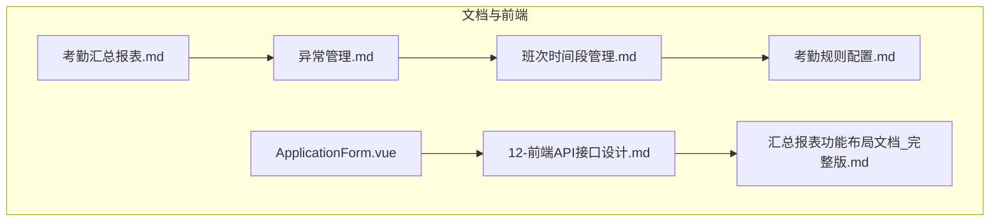
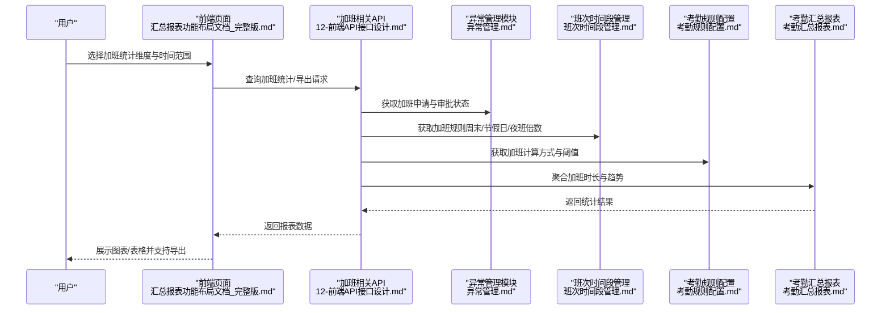
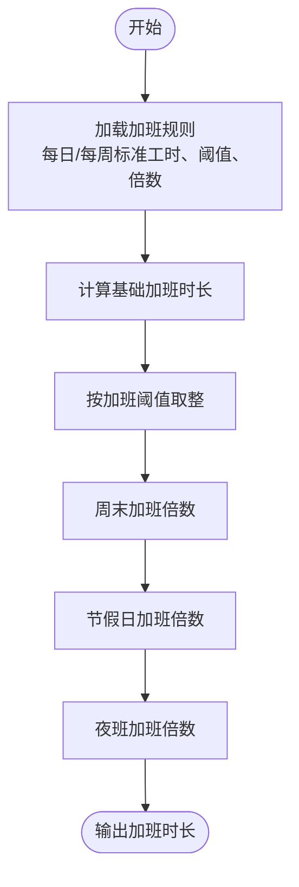
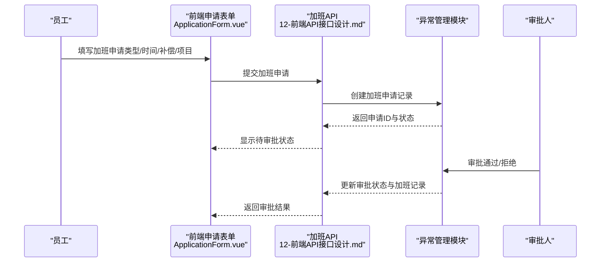
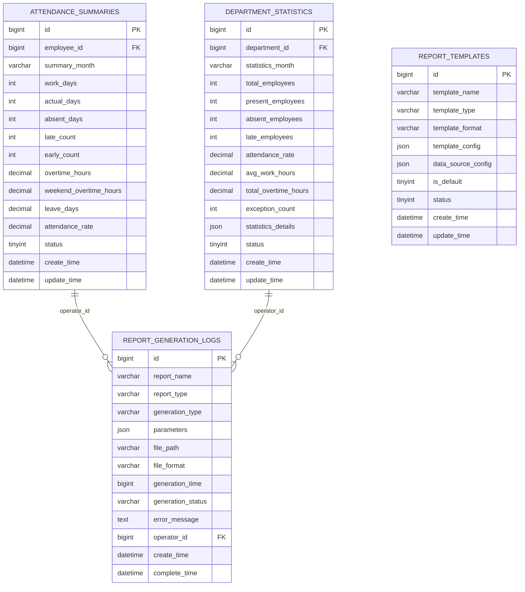
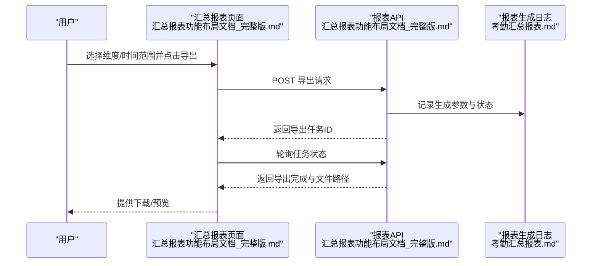

# 加班报表

<cite>
**本文引用的文件**
- [考勤汇总报表.md](file://documentation/03-业务模块/各业务模块文档/考勤/考勤汇总报表.md)
- [异常管理.md](file://documentation/03-业务模块/各业务模块文档/考勤/异常管理.md)
- [班次时间段管理.md](file://documentation/03-业务模块/各业务模块文档/考勤/班次时间段管理.md)
- [考勤规则配置.md](file://documentation/03-业务模块/考勤/考勤规则配置.md)
- [12-前端API接口设计.md](file://documentation/03-业务模块/考勤/12-前端API接口设计.md)
- [汇总报表功能布局文档_完整版.md](file://documentation/03-业务模块/考勤/考勤前端原型布局/汇总报表功能布局文档_完整版.md)
- [ApplicationForm.vue](file://smart-admin-web-javascript/src/views/business/smart-video/components/ApplicationForm.vue)
</cite>

## 目录
1. [引言](#引言)
2. [项目结构](#项目结构)
3. [核心组件](#核心组件)
4. [架构总览](#架构总览)
5. [详细组件分析](#详细组件分析)
6. [依赖分析](#依赖分析)
7. [性能考虑](#性能考虑)
8. [故障排查指南](#故障排查指南)
9. [结论](#结论)
10. [附录](#附录)

## 引言
本文件面向“加班报表”的使用与维护，围绕加班时长计算规则、加班申请与审批关联机制、加班报表的数据项与统计维度、与其他报表（如考勤汇总报表）的数据关联，以及加班数据导出与核对操作进行系统化说明。文档同时提供可视化图示与操作指引，帮助非技术读者理解加班报表的生成与使用流程。

## 项目结构
加班报表相关的内容主要分布在以下文档与前端组件中：
- 考勤汇总报表模块：定义了加班时长等关键指标字段、统计维度与报表生成流程。
- 异常管理模块：定义加班申请、审批、加班时长与加班类型等业务要素。
- 班次时间段管理模块：定义加班规则（如周末/节假日/夜班倍数、加班阈值）。
- 考勤规则配置模块：提供加班计算方式、倍数等规则配置。
- 前端API接口设计与前端布局：定义加班相关接口与前端页面组件。

**图表来源**
- [考勤汇总报表.md](file://documentation/03-业务模块/各业务模块文档/考勤/考勤汇总报表.md#L1-L120)
- [异常管理.md](file://documentation/03-业务模块/各业务模块文档/考勤/异常管理.md#L1-L120)
- [班次时间段管理.md](file://documentation/03-业务模块/各业务模块文档/考勤/班次时间段管理.md#L1-L120)
- [考勤规则配置.md](file://documentation/03-业务模块/考勤/考勤规则配置.md#L1-L120)
- [12-前端API接口设计.md](file://documentation/03-业务模块/考勤/12-前端API接口设计.md#L604-L658)
- [汇总报表功能布局文档_完整版.md](file://documentation/03-业务模块/考勤/考勤前端原型布局/汇总报表功能布局文档_完整版.md#L22-L125)
- [ApplicationForm.vue](file://smart-admin-web-javascript/src/views/business/smart-video/components/ApplicationForm.vue#L46-L68)

**章节来源**
- [考勤汇总报表.md](file://documentation/03-业务模块/各业务模块文档/考勤/考勤汇总报表.md#L1-L120)
- [异常管理.md](file://documentation/03-业务模块/各业务模块文档/考勤/异常管理.md#L1-L120)
- [班次时间段管理.md](file://documentation/03-业务模块/各业务模块文档/考勤/班次时间段管理.md#L1-L120)
- [考勤规则配置.md](file://documentation/03-业务模块/考勤/考勤规则配置.md#L1-L120)
- [12-前端API接口设计.md](file://documentation/03-业务模块/考勤/12-前端API接口设计.md#L604-L658)
- [汇总报表功能布局文档_完整版.md](file://documentation/03-业务模块/考勤/考勤前端原型布局/汇总报表功能布局文档_完整版.md#L22-L125)
- [ApplicationForm.vue](file://smart-admin-web-javascript/src/views/business/smart-video/components/ApplicationForm.vue#L46-L68)

## 核心组件
- 加班时长计算规则
  - 基于“每日标准工时/每周标准工时”与“加班阈值（分钟）”进行计算；周末与节假日分别按倍数计算；夜班时段按倍数计算。
  - 参考：加班规则JSON字段与加班计算方式。
- 加班申请与审批关联
  - 加班申请包含加班类型（工作日/周末/节假日）、起止时间、预计时长、补偿方式、项目信息、审批人等。
  - 审批通过后，系统记录加班并参与考勤汇总统计。
- 加班报表数据项
  - 个人/部门层面的关键指标：加班时长、周末加班时长、加班趋势、异常对比等。
- 统计维度
  - 支持按部门、时间、类型等维度进行对比分析与趋势分析。
- 报表生成与导出
  - 提供模板化报表生成、导出、分享与保存能力；前端提供导出与打印入口。

**章节来源**
- [班次时间段管理.md](file://documentation/03-业务模块/各业务模块文档/考勤/班次时间段管理.md#L161-L241)
- [考勤规则配置.md](file://documentation/03-业务模块/考勤/考勤规则配置.md#L287-L326)
- [异常管理.md](file://documentation/03-业务模块/各业务模块文档/考勤/异常管理.md#L171-L206)
- [12-前端API接口设计.md](file://documentation/03-业务模块/考勤/12-前端API接口设计.md#L604-L658)
- [汇总报表功能布局文档_完整版.md](file://documentation/03-业务模块/考勤/考勤前端原型布局/汇总报表功能布局文档_完整版.md#L22-L125)

## 架构总览
加班报表的生成与使用涉及前端页面、API接口、业务模块与数据表之间的协作关系。下图展示了加班报表的关键交互路径。

**图表来源**
- [汇总报表功能布局文档_完整版.md](file://documentation/03-业务模块/考勤/考勤前端原型布局/汇总报表功能布局文档_完整版.md#L22-L125)
- [12-前端API接口设计.md](file://documentation/03-业务模块/考勤/12-前端API接口设计.md#L604-L658)
- [异常管理.md](file://documentation/03-业务模块/各业务模块文档/考勤/异常管理.md#L171-L206)
- [班次时间段管理.md](file://documentation/03-业务模块/各业务模块文档/考勤/班次时间段管理.md#L161-L241)
- [考勤规则配置.md](file://documentation/03-业务模块/考勤/考勤规则配置.md#L287-L326)
- [考勤汇总报表.md](file://documentation/03-业务模块/各业务模块文档/考勤/考勤汇总报表.md#L1-L120)

## 详细组件分析

### 加班时长计算规则
- 计算方式
  - 支持按“每日标准工时/每周标准工时”进行计算，并以“加班阈值（分钟）”作为最小计量单位。
- 倍数规则
  - 周末加班倍数、节假日加班倍数、夜班加班倍数均在加班规则中配置。
- 夜班时段
  - 在“夜班开始/结束时间”范围内工作的加班按“夜班加班倍数”计算。
- 与排班的关系
  - 班次时间段管理中为每个时间段配置加班规则，确保跨时间段的加班计算准确。

**图表来源**
- [班次时间段管理.md](file://documentation/03-业务模块/各业务模块文档/考勤/班次时间段管理.md#L161-L241)
- [考勤规则配置.md](file://documentation/03-业务模块/考勤/考勤规则配置.md#L287-L326)

**章节来源**
- [班次时间段管理.md](file://documentation/03-业务模块/各业务模块文档/考勤/班次时间段管理.md#L161-L241)
- [考勤规则配置.md](file://documentation/03-业务模块/考勤/考勤规则配置.md#L287-L326)

### 加班申请与审批关联机制
- 申请要素
  - 加班类型（工作日/周末/节假日）、起止时间、预计时长、补偿方式（调休/补贴）、项目信息、审批人等。
- 审批流程
  - 多级审批、条件审批、审批权限与时效控制；审批通过后更新加班记录并参与统计。
- 与考勤汇总的关系
  - 审批通过后的加班记录进入考勤汇总统计，体现在个人/部门的加班时长与趋势中。

**图表来源**
- [ApplicationForm.vue](file://smart-admin-web-javascript/src/views/business/smart-video/components/ApplicationForm.vue#L46-L68)
- [12-前端API接口设计.md](file://documentation/03-业务模块/考勤/12-前端API接口设计.md#L604-L658)
- [异常管理.md](file://documentation/03-业务模块/各业务模块文档/考勤/异常管理.md#L171-L206)

**章节来源**
- [ApplicationForm.vue](file://smart-admin-web-javascript/src/views/business/smart-video/components/ApplicationForm.vue#L46-L68)
- [12-前端API接口设计.md](file://documentation/03-业务模块/考勤/12-前端API接口设计.md#L604-L658)
- [异常管理.md](file://documentation/03-业务模块/各业务模块文档/考勤/异常管理.md#L171-L206)

### 加班报表数据项与统计维度
- 报表数据项
  - 个人：加班时长、周末加班时长、出勤率、迟到/早退次数等。
  - 部门：部门总人数、出勤人数、缺勤人数、平均工作时长、总加班时长、异常次数等。
  - 统计详情JSON包含考勤分布、时间分析、异常分析与趋势分析。
- 统计维度
  - 支持按部门、时间、类型（加班类型）等维度进行对比分析与趋势分析。
- 报表生成
  - 模板管理、数据聚合、格式转换、定时生成与日志记录。

**图表来源**
- [考勤汇总报表.md](file://documentation/03-业务模块/各业务模块文档/考勤/考勤汇总报表.md#L1-L120)
- [考勤汇总报表.md](file://documentation/03-业务模块/各业务模块文档/考勤/考勤汇总报表.md#L152-L240)

**章节来源**
- [考勤汇总报表.md](file://documentation/03-业务模块/各业务模块文档/考勤/考勤汇总报表.md#L1-L120)
- [考勤汇总报表.md](file://documentation/03-业务模块/各业务模块文档/考勤/考勤汇总报表.md#L152-L240)

### 报表与其他报表的数据关联
- 与考勤汇总报表的关联
  - 加班数据来源于异常管理模块的加班申请与审批记录，经汇总后体现在个人/部门的加班时长与趋势中。
- 与模板与生成日志的关联
  - 报表模板定义数据源与样式；生成日志记录生成参数、耗时与状态，便于审计与重试。

**章节来源**
- [考勤汇总报表.md](file://documentation/03-业务模块/各业务模块文档/考勤/考勤汇总报表.md#L1-L120)
- [异常管理.md](file://documentation/03-业务模块/各业务模块文档/考勤/异常管理.md#L171-L206)

### 加班数据导出与核对操作指南
- 前端导出入口
  - 汇总报表页面提供导出、保存与分享按钮；结果表页面提供数据导出与打印预览组件。
- 导出流程
  - 选择维度与时间范围 -> 触发导出请求 -> 生成报表文件 -> 下载或预览。
- 核对要点
  - 对照加班申请单号、审批状态、加班类型、加班起止时间与实际加班时长，确保与考勤汇总一致。
  - 若存在差异，检查加班规则配置、审批状态与加班打卡记录。

**图表来源**
- [汇总报表功能布局文档_完整版.md](file://documentation/03-业务模块/考勤/考勤前端原型布局/汇总报表功能布局文档_完整版.md#L22-L125)
- [考勤汇总报表.md](file://documentation/03-业务模块/各业务模块文档/考勤/考勤汇总报表.md#L1-L120)

**章节来源**
- [汇总报表功能布局文档_完整版.md](file://documentation/03-业务模块/考勤/考勤前端原型布局/汇总报表功能布局文档_完整版.md#L22-L125)
- [考勤汇总报表.md](file://documentation/03-业务模块/各业务模块文档/考勤/考勤汇总报表.md#L1-L120)

## 依赖分析
- 模块耦合
  - 异常管理模块为加班数据来源；班次时间段管理与考勤规则配置为加班计算规则提供依据；考勤汇总报表模块负责统计与展示。
- 外部依赖
  - 前端页面通过API接口获取数据；报表模板与生成日志为报表能力提供支撑。

**图表来源**
- [异常管理.md](file://documentation/03-业务模块/各业务模块文档/考勤/异常管理.md#L171-L206)
- [班次时间段管理.md](file://documentation/03-业务模块/各业务模块文档/考勤/班次时间段管理.md#L161-L241)
- [考勤规则配置.md](file://documentation/03-业务模块/考勤/考勤规则配置.md#L287-L326)
- [考勤汇总报表.md](file://documentation/03-业务模块/各业务模块文档/考勤/考勤汇总报表.md#L1-L120)
- [12-前端API接口设计.md](file://documentation/03-业务模块/考勤/12-前端API接口设计.md#L604-L658)

**章节来源**
- [异常管理.md](file://documentation/03-业务模块/各业务模块文档/考勤/异常管理.md#L171-L206)
- [班次时间段管理.md](file://documentation/03-业务模块/各业务模块文档/考勤/班次时间段管理.md#L161-L241)
- [考勤规则配置.md](file://documentation/03-业务模块/考勤/考勤规则配置.md#L287-L326)
- [考勤汇总报表.md](file://documentation/03-业务模块/各业务模块文档/考勤/考勤汇总报表.md#L1-L120)
- [12-前端API接口设计.md](file://documentation/03-业务模块/考勤/12-前端API接口设计.md#L604-L658)

## 性能考虑
- 大数据量统计
  - 使用聚合查询与缓存策略，减少重复计算；对加班时长等指标进行分页与分组处理。
- 报表生成
  - 异步生成机制与文件存储管理，避免阻塞前端；模板引擎与多格式支持需注意内存占用。
- 可视化
  - 图表渲染优化与虚拟滚动，提升大数据量下的交互体验。

[本节为通用指导，无需特定文件引用]

## 故障排查指南
- 加班时长异常
  - 检查加班规则配置（标准工时、阈值、倍数、夜班时段）是否正确；核对加班类型与时间段是否匹配。
- 审批状态不一致
  - 核对异常管理模块中的加班申请与审批记录；确认审批流程与权限配置。
- 报表导出失败
  - 查看报表生成日志中的生成状态与错误信息；确认导出参数与模板配置。

**章节来源**
- [班次时间段管理.md](file://documentation/03-业务模块/各业务模块文档/考勤/班次时间段管理.md#L161-L241)
- [异常管理.md](file://documentation/03-业务模块/各业务模块文档/考勤/异常管理.md#L171-L206)
- [考勤汇总报表.md](file://documentation/03-业务模块/各业务模块文档/考勤/考勤汇总报表.md#L1-L120)

## 结论
加班报表以“加班申请与审批”为数据来源，结合“加班规则与排班配置”，在“考勤汇总报表”中呈现个人与部门层面的加班时长、趋势与对比分析。通过模板化报表与导出功能，用户可高效生成并核对加班数据。建议在日常使用中定期核对加班规则与审批状态，确保报表准确性与合规性。

[本节为总结性内容，无需特定文件引用]

## 附录
- 关键字段与接口参考
  - 加班申请字段与接口：参见加班API请求参数与接口定义。
  - 报表导出接口：参见汇总报表API导出接口定义。
- 前端组件参考
  - 加班申请表单组件：参见ApplicationForm.vue中的加班类型与时间选择。

**章节来源**
- [12-前端API接口设计.md](file://documentation/03-业务模块/考勤/12-前端API接口设计.md#L604-L658)
- [汇总报表功能布局文档_完整版.md](file://documentation/03-业务模块/考勤/考勤前端原型布局/汇总报表功能布局文档_完整版.md#L22-L125)
- [ApplicationForm.vue](file://smart-admin-web-javascript/src/views/business/smart-video/components/ApplicationForm.vue#L46-L68)