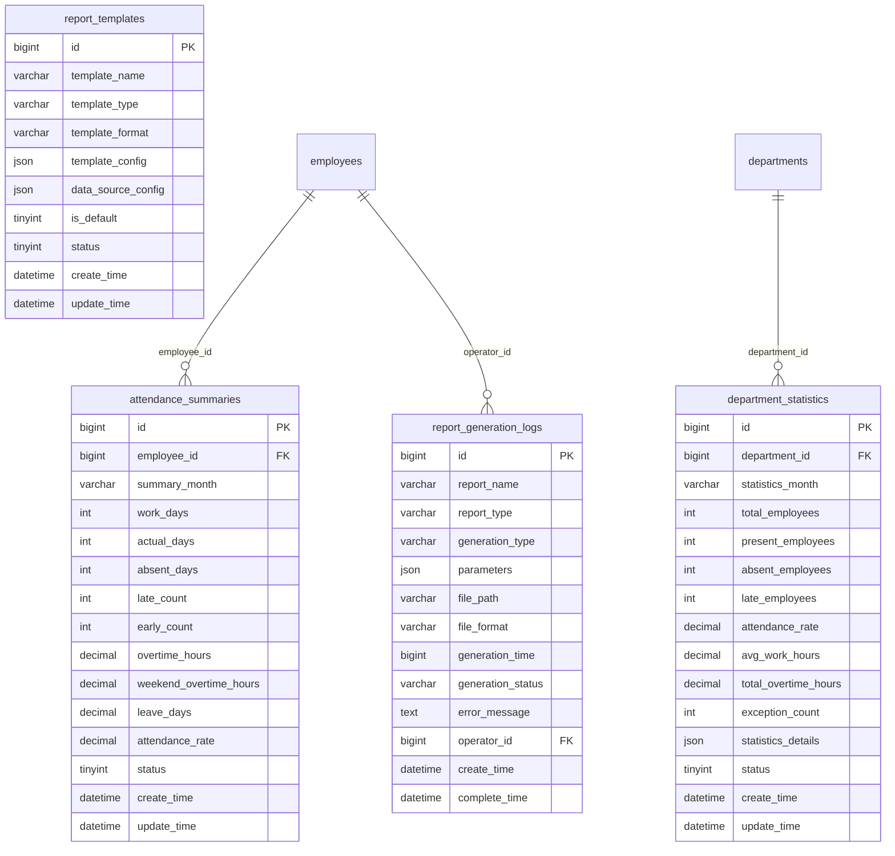
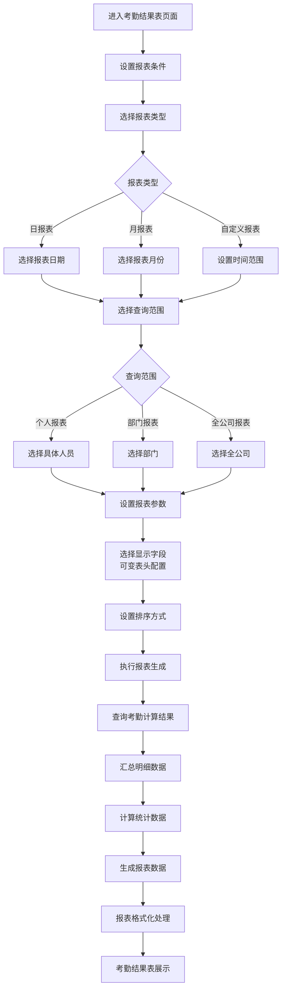
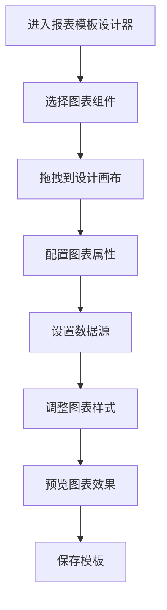

# 报表统计

<cite>
**本文档引用的文件**   
- [考勤汇总报表.md](file://documentation\03-业务模块\考勤\考勤汇总报表.md)
- [考勤业务菜单功能流程图.md](file://documentation\03-业务模块\考勤\考勤业务菜单功能流程图.md)
- [汇总报表功能布局文档_完整版.md](file://documentation\03-业务模块\各业务模块文档\考勤\考勤前端原型布局\汇总报表功能布局文档_完整版.md)
- [index.js](file://smart-admin-web-javascript\src\views\business\common\charts\index.js)
</cite>

## 目录
1. [考勤报表种类与用途](#考勤报表种类与用途)
2. [数据来源与统计维度](#数据来源与统计维度)
3. [自定义配置功能](#自定义配置功能)
4. [报表导出、打印与分享](#报表导出打印与分享)
5. [数据可视化图表](#数据可视化图表)

## 考勤报表种类与用途

考勤报表系统提供多种类型的报表，以满足不同层级和维度的管理需求。主要报表类型包括日报、月报、异常报表、加班报表等，每种报表都有其特定的用途和分析重点。

**日报表**用于展示员工每日的考勤情况，包括出勤、迟到、早退、缺勤等状态，帮助管理者及时掌握当天的考勤动态。

**月报表**按月度汇总员工的考勤数据，统计应出勤天数、实际出勤天数、出勤率、迟到次数、早退次数、加班时长等关键指标，为月度绩效考核提供数据支持。

**异常报表**专门用于分析和展示考勤异常情况，如旷工、迟到、早退、未打卡等，帮助管理者识别考勤问题，及时进行干预和处理。

**加班报表**详细记录员工的加班情况，包括工作日加班、休息日加班、节假日加班和周末加班，支持按部门、人员、时间段等维度进行统计，为加班费计算和人力资源调配提供依据。

**部门统计报表**从部门层面汇总考勤数据，展示部门总人数、出勤人数、缺勤人数、迟到人数、出勤率、平均工作时长、总加班时长等指标，支持部门间的对比分析。

**个人汇总报表**聚焦于单个员工的考勤表现，提供详细的考勤记录和统计分析，包括每日考勤状态、异常明细、统计汇总和周末加班记录，便于员工自我管理和绩效评估。

**Section sources**
- [考勤汇总报表.md](file://documentation\03-业务模块\考勤\考勤汇总报表.md#L1-L569)
- [考勤业务菜单功能流程图.md](file://documentation\03-业务模块\考勤\考勤业务菜单功能流程图.md#L873-L955)

## 数据来源与统计维度

### 数据来源

考勤报表的数据主要来源于以下几个核心数据表：

- **attendance_summaries（考勤汇总表）**: 存储员工月度考勤汇总数据，包括应工作天数、实际出勤天数、旷工天数、迟到次数、早退次数、加班时长、请假天数、出勤率等。
- **department_statistics（部门统计表）**: 存储部门月度考勤统计数据，包括部门总人数、出勤人数、缺勤人数、迟到人数、出勤率、平均工作时长、总加班时长、异常次数等。
- **report_templates（报表模板表）**: 存储报表模板的配置信息，包括模板名称、类型、格式、模板配置JSON和数据源配置JSON。
- **report_generation_logs（报表生成日志表）**: 记录报表生成的操作日志，包括报表名称、类型、生成参数、文件路径、生成状态、操作人等。

**Diagram sources **
- [考勤汇总报表.md](file://documentation\03-业务模块\考勤\考勤汇总报表.md#L152-L230)

### 统计维度

考勤报表支持多维度的统计分析，主要包括：

- **时间维度**: 按日、周、月、年等时间周期进行统计，支持自定义时间范围。
- **人员维度**: 按个人、部门、全公司等不同范围进行统计，支持按部门、岗位、姓名等条件筛选。
- **考勤状态维度**: 按出勤、迟到、早退、缺勤、请假、加班等不同状态进行分类统计。
- **异常类型维度**: 按旷工、迟到、早退、未打卡等不同异常类型进行统计分析。
- **加班类型维度**: 按工作日加班、休息日加班、节假日加班、周末加班等不同加班类型进行统计。

**Section sources**
- [考勤汇总报表.md](file://documentation\03-业务模块\考勤\考勤汇总报表.md#L8-L230)

## 自定义配置功能

系统提供强大的自定义配置功能，用户可以根据需求灵活配置报表的显示内容和格式。

### 自定义字段

用户可以在报表中选择需要显示的字段，如员工姓名、工号、部门、岗位、出勤天数、迟到次数、早退次数、加班时长、请假天数、出勤率等。通过可变表头配置，用户可以自由调整字段的显示顺序和可见性。

### 筛选条件

系统支持多种筛选条件，用户可以根据时间范围、部门、人员、考勤状态等条件进行数据筛选，快速定位所需信息。筛选条件支持组合使用，提高查询效率。

### 分组方式

报表支持按部门、岗位、考勤状态等维度进行分组显示，便于进行对比分析。用户可以自定义分组规则，满足不同的管理需求。

### 报表模板

系统提供报表模板管理功能，用户可以创建、编辑、删除和应用报表模板。模板配置包括页面设置（如纸张大小、方向、页边距）、标题、员工信息、考勤汇总、详细考勤记录等部分，支持自定义样式和布局。

**Diagram sources **
- [考勤业务菜单功能流程图.md](file://documentation\03-业务模块\考勤\考勤业务菜单功能流程图.md#L873-L955)

**Section sources**
- [汇总报表功能布局文档_完整版.md](file://documentation\03-业务模块\各业务模块文档\考勤\考勤前端原型布局\汇总报表功能布局文档_完整版.md#L1-L1404)

## 报表导出、打印与分享

系统提供完善的报表导出、打印和分享功能，方便用户获取和传播报表数据。

### 报表导出

用户可以将报表导出为多种格式，包括Excel、PDF和HTML。导出功能支持选择导出字段和格式，确保导出的数据符合需求。导出的文件可以用于存档、分析或与其他系统集成。

### 打印功能

系统提供打印预览和打印功能，用户可以在打印前预览报表的最终效果，并调整打印设置，如纸张大小、方向、页边距等。打印功能支持批量打印，提高工作效率。

### 分享功能

用户可以通过邮件、FTP或系统消息等方式分享报表。系统支持配置推送规则，如推送时间、推送方式、接收人员等，实现报表的自动化推送。分享功能还支持生成分享链接，方便快捷地分享报表。

**Section sources**
- [考勤业务菜单功能流程图.md](file://documentation\03-业务模块\考勤\考勤业务菜单功能流程图.md#L244-L288)

## 数据可视化图表

系统集成多种数据可视化图表，帮助用户直观地分析和展示考勤数据。

### 图表类型

系统支持的图表类型包括：
- **柱状图**: 用于比较不同类别或时间段的数据，如各部门出勤率对比。
- **折线图**: 用于展示数据随时间变化的趋势，如员工月度出勤率趋势。
- **饼图**: 用于展示各部分占总体的比例，如考勤状态分布。
- **仪表盘**: 用于展示关键指标的完成情况，如出勤率目标达成度。
- **散点图**: 用于分析两个变量之间的关系，如加班时长与工作效率的关系。

### 图表配置

用户可以通过报表模板设计器配置图表的显示内容和样式。配置项包括图表标题、X轴和Y轴标签、颜色、数据源等。系统支持拖拽式图表设计，用户可以将图表组件拖放到设计画布上，并通过属性面板进行详细配置。

**Diagram sources **
- [汇总报表功能布局文档_完整版.md](file://documentation\03-业务模块\各业务模块文档\考勤\考勤前端原型布局\汇总报表功能布局文档_完整版.md#L131-L740)

### 图表展示

生成的报表中，图表与表格数据相结合，提供全面的数据视图。用户可以通过点击图表中的数据点，钻取到更详细的明细数据。图表支持鼠标悬浮显示详情、缩放和平移等交互功能，提升用户体验。

**Section sources**
- [index.js](file://smart-admin-web-javascript\src\views\business\common\charts\index.js#L1-L61)
- [汇总报表功能布局文档_完整版.md](file://documentation\03-业务模块\各业务模块文档\考勤\考勤前端原型布局\汇总报表功能布局文档_完整版.md#L1-L1404)