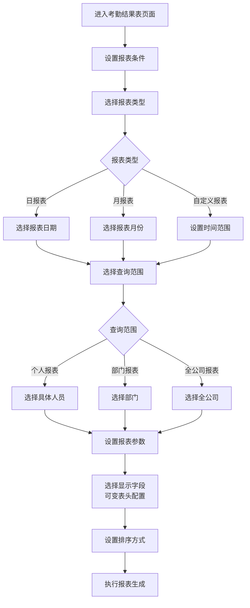
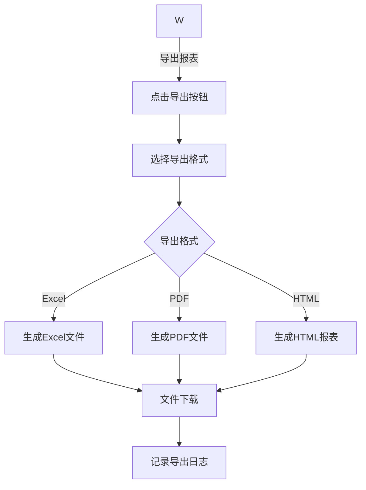

# 日报统计

<cite>
**本文档引用文件**   
- [考勤汇总报表.md](file://documentation\03-业务模块\考勤\考勤汇总报表.md)
- [考勤前端原型布局\汇总报表功能布局文档_完整版.md](file://documentation\03-业务模块\各业务模块文档\考勤\考勤前端原型布局\汇总报表功能布局文档_完整版.md)
- [考勤业务菜单功能流程图.md](file://documentation\03-业务模块\考勤\考勤业务菜单功能流程图.md)
- [AttendanceReportController.java](file://restful_refactor_backup_20251202_014224\microservices_ioedream-attendance-service_src_main_java_net_lab1024_sa_attendance_controller_AttendanceReportController.java)
</cite>

## 目录
1. [日报生成机制](#日报生成机制)
2. [日报数据项说明](#日报数据项说明)
3. [查询条件设置](#查询条件设置)
4. [数据计算逻辑与异常标记](#数据计算逻辑与异常标记)
5. [日报导出操作指南](#日报导出操作指南)
6. [自动推送功能设置](#自动推送功能设置)

## 日报生成机制

日报统计系统基于考勤数据采集与计算模块提供的原始数据，通过定时任务或手动触发方式生成每日考勤报告。系统在每日工作结束后自动执行数据汇总任务，从考勤记录表中提取当天的打卡数据，经过数据清洗、规则匹配和统计计算后生成结构化的日报数据。

日报的更新频率为每日一次，通常在夜间低峰时段（如凌晨2:00）自动执行生成任务。系统支持手动触发日报生成，管理员可根据需要随时重新生成特定日期的日报。生成过程包括：获取原始考勤数据、执行数据聚合、计算统计指标、生成汇总记录、验证数据准确性、保存汇总结果等步骤。

**Section sources**
- [考勤汇总报表.md](file://documentation\03-业务模块\考勤\考勤汇总报表.md#L231-L238)
- [考勤业务菜单功能流程图.md](file://documentation\03-业务模块\考勤\考勤业务菜单功能流程图.md#L873-L898)

## 日报数据项说明

日报包含以下考勤数据项：

- **出勤时间**：员工当天的实际工作时长，根据上下班打卡时间计算得出
- **迟到早退**：记录员工迟到和早退的情况，包括迟到分钟数和早退分钟数
- **打卡记录**：详细的上下班打卡时间记录，包括打卡设备、打卡地点等信息
- **应出勤天数**：根据员工排班计划确定的应出勤天数
- **实际出勤天数**：员工实际出勤的天数
- **旷工天数**：员工未出勤且未请假的天数
- **加班时长**：员工超出正常工作时间的加班时长
- **请假天数**：员工当天的请假天数
- **出勤率**：员工出勤情况的统计指标，计算公式为实际出勤天数/应出勤天数

这些数据项通过考勤规则引擎进行计算和验证，确保数据的准确性和一致性。

**Section sources**
- [考勤汇总报表.md](file://documentation\03-业务模块\考勤\考勤汇总报表.md#L8-L27)
- [考勤汇总报表.md](file://documentation\03-业务模块\考勤\考勤汇总报表.md#L231-L238)

## 查询条件设置

日报查询支持多种条件设置，用户可根据需要灵活配置查询参数：

- **日期范围**：支持按单日、多日或自定义日期范围查询，用户可选择开始日期和结束日期
- **人员筛选**：支持按个人、部门或全公司范围查询，可选择具体人员或部门进行筛选
- **部门选择**：支持多级部门层级选择，用户可选择一个或多个部门进行统计
- **报表类型**：支持日报表、月报表和自定义报表三种类型
- **显示字段**：支持可变表头配置，用户可选择需要显示的字段
- **排序方式**：支持按不同字段进行升序或降序排序

查询条件设置界面提供直观的操作控件，用户可通过下拉选择、日期选择器、多选框等方式配置查询条件，系统根据设置的条件动态生成查询SQL并返回结果。

**Diagram sources**
- [考勤业务菜单功能流程图.md](file://documentation\03-业务模块\考勤\考勤业务菜单功能流程图.md#L873-L898)

**Section sources**
- [考勤前端原型布局\汇总报表功能布局文档_完整版.md](file://documentation\03-业务模块\各业务模块文档\考勤\考勤前端原型布局\汇总报表功能布局文档_完整版.md#L72-L125)
- [考勤业务菜单功能流程图.md](file://documentation\03-业务模块\考勤\考勤业务菜单功能流程图.md#L873-L898)

## 数据计算逻辑与异常标记

日报数据的计算遵循严格的逻辑规则：

- **出勤时间计算**：根据员工的班次安排和实际打卡时间计算实际工作时长，扣除休息时间
- **迟到计算**：上班打卡时间晚于规定上班时间的部分记为迟到，超过弹性时间范围则记为异常
- **早退计算**：下班打卡时间早于规定下班时间的部分记为早退，超过弹性时间范围则记为异常
- **旷工计算**：无打卡记录且无请假申请的情况记为旷工
- **加班计算**：在规定工作时间外的工作时长记为加班，需经过审批确认

异常标记规则如下：
- 迟到超过30分钟标记为"严重迟到"
- 早退超过30分钟标记为"严重早退"
- 一天内无任何打卡记录标记为"全天缺勤"
- 上班打卡正常但下班未打卡标记为"下班忘打卡"
- 上班未打卡但下班打卡标记为"上班忘打卡"
- 连续3天迟到标记为"频繁迟到"

系统通过异常判定规则引擎自动识别和标记异常情况，并在日报中以醒目的颜色和图标进行提示。

**Section sources**
- [考勤汇总报表.md](file://documentation\03-业务模块\考勤\考勤汇总报表.md#L245-L249)
- [考勤前端原型布局\规则配置功能布局文档_完整版.md](file://documentation\03-业务模块\各业务模块文档\考勤\考勤前端原型布局\规则配置功能布局文档_完整版.md#L839-L992)

## 日报导出操作指南

日报支持导出为Excel和PDF格式，操作步骤如下：

1. 在日报查询结果页面，点击"导出"按钮
2. 在弹出的导出对话框中选择导出格式（Excel或PDF）
3. 可选择是否包含明细数据、图表等内容
4. 点击"确定"按钮开始导出
5. 系统生成文件后自动下载到本地

导出的Excel文件包含多个工作表：
- **汇总表**：包含主要统计指标和汇总数据
- **明细表**：包含详细的每日考勤记录
- **异常表**：列出所有异常考勤情况
- **统计图表**：包含出勤率、迟到率等统计图表

导出的PDF文件采用A4纸张大小，纵向布局，包含公司logo、报表标题、统计周期、数据表格和分析图表等元素，适合打印和存档。

**Diagram sources**
- [考勤业务菜单功能流程图.md](file://documentation\03-业务模块\考勤\考勤业务菜单功能流程图.md#L920-L930)

**Section sources**
- [考勤前端原型布局\汇总报表功能布局文档_完整版.md](file://documentation\03-业务模块\各业务模块文档\考勤\考勤前端原型布局\汇总报表功能布局文档_完整版.md#L122-L124)
- [考勤业务菜单功能流程图.md](file://documentation\03-业务模块\考勤\考勤业务菜单功能流程图.md#L920-L930)

## 自动推送功能设置

系统支持日报自动推送功能，可按预设规则定期将日报发送给指定人员。设置步骤如下：

1. 进入"报表推送设置"页面
2. 创建新的推送任务，设置任务名称和描述
3. 选择推送的报表类型（个人日报、部门日报等）
4. 设置推送周期（每日、每周、每月）
5. 选择接收人员或部门
6. 选择推送方式（邮件、系统消息、微信等）
7. 设置推送时间（如每日上午9:00）
8. 保存推送任务

系统在指定时间自动执行推送任务，生成相应报表并通过选择的渠道发送给接收人。推送日志会记录每次推送的详细信息，包括推送时间、接收人、推送状态等，便于追踪和审计。

自动推送功能支持条件触发，例如仅当存在异常考勤时才推送，或根据出勤率阈值决定是否推送。管理员可随时查看推送历史，重新发送遗漏的报表，或调整推送设置。

**Section sources**
- [考勤汇总报表.md](file://documentation\03-业务模块\考勤\考勤汇总报表.md#L66-L82)
- [AttendanceReportController.java](file://restful_refactor_backup_20251202_014224\microservices_ioedream-attendance-service_src_main_java_net_lab1024_sa_attendance_controller_AttendanceReportController.java#L48-L58)