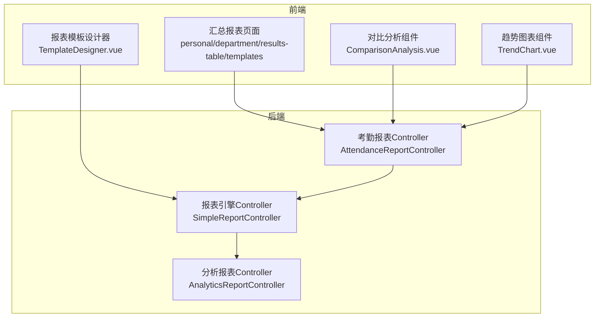
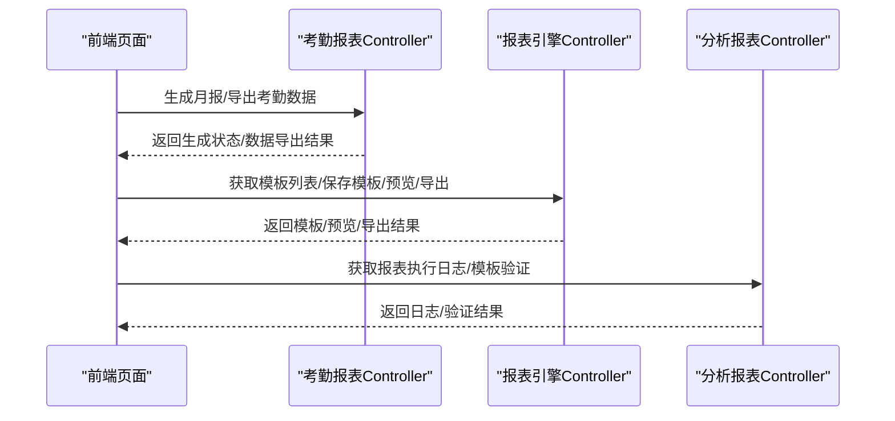
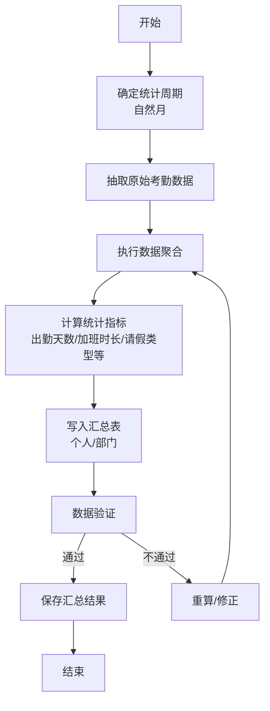
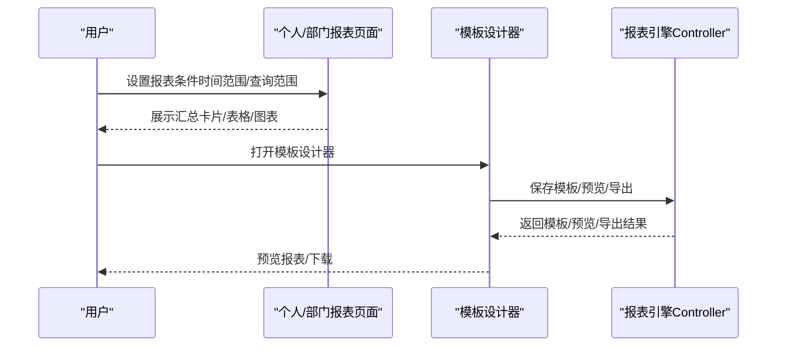
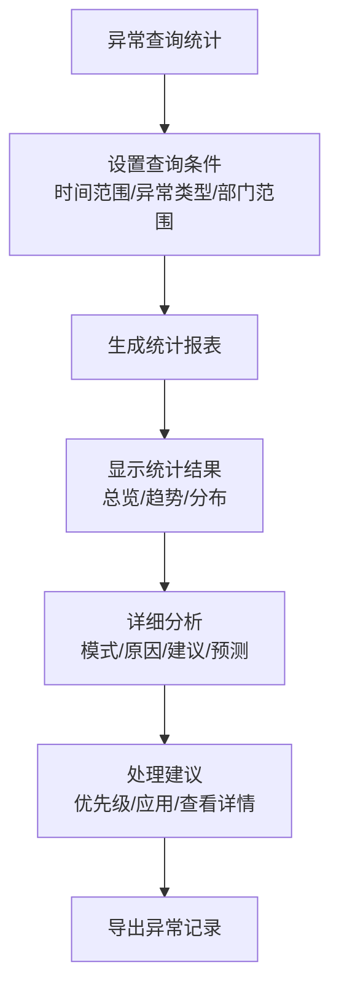
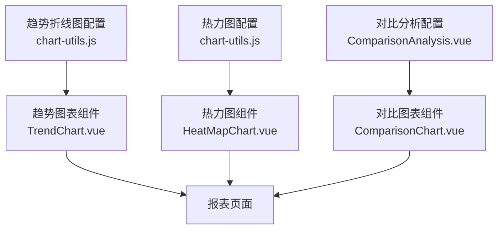
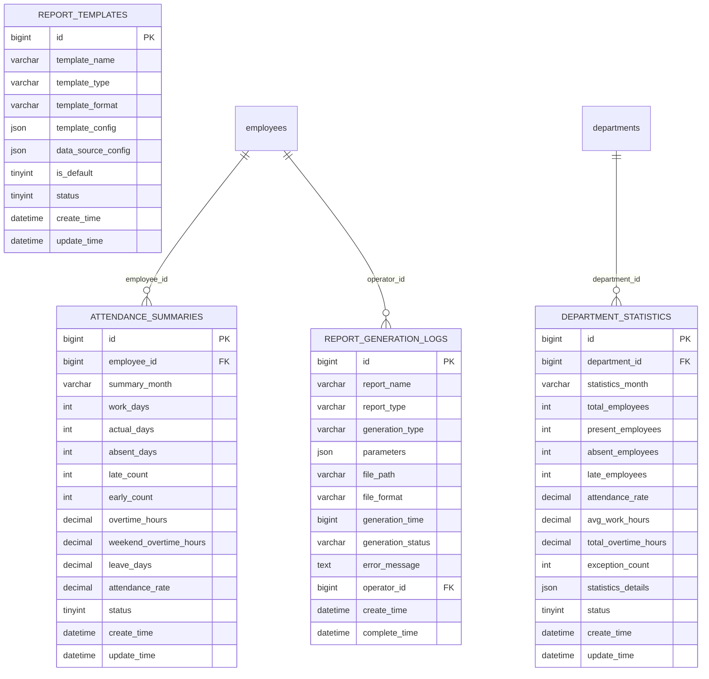

# 月报统计

<cite>
**本文引用的文件**
- [考勤汇总报表.md](file://documentation/03-业务模块/考勤/考勤汇总报表.md)
- [考勤业务菜单功能流程图.md](file://documentation/03-业务模块/各业务模块文档/考勤/考勤业务菜单功能流程图.md)
- [考勤前端原型布局_汇总报表功能布局文档_完整版.md](file://documentation/03-业务模块/考勤/考勤前端原型布局/汇总报表功能布局文档_完整版.md)
- [考勤前端原型布局_仪表中心功能布局文档_完整版.md](file://documentation/03-业务模块/考勤/考勤前端原型布局/仪表中心功能布局文档_完整版.md)
- [考勤前端原型布局_异常管理功能布局文档_完整版.md](file://documentation/03-业务模块/考勤/考勤前端原型布局/异常管理功能布局文档_完整版.md)
- [考勤系统数据库ER图设计.md](file://documentation/03-业务模块/考勤/考勤系统数据库ER图设计.md)
- [AttendanceReportController.java](file://restful_refactor_backup_20251202_014224/microservices_ioedream-attendance-service_src_main_java_net_lab1024_sa_attendance_controller_AttendanceReportController.java)
- [SimpleReportController.java](file://restful_refactor_backup_20251202_014224/microservices_ioedream-report-service_src_main_java_net_lab1024_sa_report_controller_SimpleReportController.java)
- [AnalyticsReportController.java](file://restful_refactor_backup_20251202_014224/microservices_ioedream-report-service_src_main_java_net_lab1024_sa_report_controller_AnalyticsReportController.java)
</cite>

## 目录
1. [简介](#简介)
2. [项目结构](#项目结构)
3. [核心组件](#核心组件)
4. [架构总览](#架构总览)
5. [详细组件分析](#详细组件分析)
6. [依赖分析](#依赖分析)
7. [性能考虑](#性能考虑)
8. [故障排查指南](#故障排查指南)
9. [结论](#结论)
10. [附录](#附录)

## 简介
本文件面向“月报统计”主题，系统性阐述月报的统计周期与数据汇总方式、考勤汇总指标（出勤天数、加班时长、请假类型统计等）、自定义配置（按部门/岗位/班组等维度分组展示）、异常考勤的汇总逻辑与处理建议，以及月报数据可视化图表的配置方法（柱状图对比、趋势折线图等）。文档同时结合前端原型与后端接口设计，帮助开发者与产品/运营人员快速理解与落地。

## 项目结构
围绕月报统计，相关文档与前后端实现主要分布在以下位置：
- 考勤模块文档：定义了月报统计的表结构、统计口径、流程与接口约定
- 前端原型：提供报表设计器、对比分析、趋势图表、模板管理等页面与组件
- 后端接口：提供月报生成、导出、统计查询等REST接口
- 异常管理：提供异常类型、异常趋势、异常分布与处理建议的分析能力

图表来源
- [考勤前端原型布局_汇总报表功能布局文档_完整版.md](file://documentation/03-业务模块/考勤/考勤前端原型布局/汇总报表功能布局文档_完整版.md#L22-L125)
- [考勤汇总报表.md](file://documentation/03-业务模块/考勤/考勤汇总报表.md#L443-L546)
- [AttendanceReportController.java](file://restful_refactor_backup_20251202_014224/microservices_ioedream-attendance-service_src_main_java_net_lab1024_sa_attendance_controller_AttendanceReportController.java#L38-L178)
- [SimpleReportController.java](file://restful_refactor_backup_20251202_014224/microservices_ioedream-report-service_src_main_java_net_lab1024_sa_report_controller_SimpleReportController.java#L66-L212)
- [AnalyticsReportController.java](file://restful_refactor_backup_20251202_014224/microservices_ioedream-report-service_src_main_java_net_lab1024_sa_report_controller_AnalyticsReportController.java#L89-L177)

章节来源
- [考勤前端原型布局_汇总报表功能布局文档_完整版.md](file://documentation/03-业务模块/考勤/考勤前端原型布局/汇总报表功能布局文档_完整版.md#L22-L125)
- [考勤汇总报表.md](file://documentation/03-业务模块/考勤/考勤汇总报表.md#L443-L546)

## 核心组件
- 月报统计表与汇总口径
  - 个人月度汇总表：记录员工月度出勤天数、迟到/早退次数、加班时长、请假天数、出勤率等
  - 部门月度统计表：记录部门总人数、出勤人数、缺勤人数、迟到人数、平均工作时长、总加班时长、异常次数等
- 报表模板与生成
  - 模板管理：支持模板创建、复制、验证、预览与下载
  - 报表生成：支持同步与异步生成，支持导出Excel/PDF/HTML等格式
- 对比分析与趋势分析
  - 对比分析：支持按部门/时间/类型等维度对比多个指标
  - 趋势分析：支持时间序列的趋势展示
- 异常考勤分析
  - 异常类型：迟到、早退、缺勤、忘记打卡等
  - 异常趋势与分布：异常数量、涉及员工、人均异常等
  - 处理建议：基于模式与原因分析给出优先级建议

章节来源
- [考勤汇总报表.md](file://documentation/03-业务模块/考勤/考勤汇总报表.md#L8-L47)
- [考勤汇总报表.md](file://documentation/03-业务模块/考勤/考勤汇总报表.md#L231-L262)
- [考勤汇总报表.md](file://documentation/03-业务模块/考勤/考勤汇总报表.md#L355-L367)
- [考勤前端原型布局_汇总报表功能布局文档_完整版.md](file://documentation/03-业务模块/考勤/考勤前端原型布局/汇总报表功能布局文档_完整版.md#L884-L1311)
- [考勤前端原型布局_仪表中心功能布局文档_完整版.md](file://documentation/03-业务模块/考勤/考勤前端原型布局/仪表中心功能布局文档_完整版.md#L135-L251)
- [考勤前端原型布局_异常管理功能布局文档_完整版.md](file://documentation/03-业务模块/考勤/考勤前端原型布局/异常管理功能布局文档_完整版.md#L669-L1011)

## 架构总览
下图展示了月报统计从前端到后端的关键交互路径，包括报表生成、模板管理与异常分析的协同关系。

图表来源
- [AttendanceReportController.java](file://restful_refactor_backup_20251202_014224/microservices_ioedream-attendance-service_src_main_java_net_lab1024_sa_attendance_controller_AttendanceReportController.java#L38-L178)
- [SimpleReportController.java](file://restful_refactor_backup_20251202_014224/microservices_ioedream-report-service_src_main_java_net_lab1024_sa_report_controller_SimpleReportController.java#L66-L212)
- [AnalyticsReportController.java](file://restful_refactor_backup_20251202_014224/microservices_ioedream-report-service_src_main_java_net_lab1024_sa_report_controller_AnalyticsReportController.java#L89-L177)

## 详细组件分析

### 月报统计周期与数据汇总方式
- 统计周期
  - 月度周期：以自然月为单位，如“2024-01”
  - 支持个人与部门两个层面的月度汇总
- 数据来源与汇总口径
  - 个人汇总：基于员工当月的出勤记录，统计应出勤天数、实际出勤天数、迟到/早退次数、加班时长、请假天数、出勤率等
  - 部门汇总：基于部门维度的聚合，统计部门总人数、出勤人数、缺勤人数、迟到人数、平均工作时长、总加班时长、异常次数等
- 汇总流程
  - 触发汇总任务 -> 获取原始数据 -> 执行数据聚合 -> 计算统计指标 -> 生成汇总记录 -> 验证数据准确性 -> 保存汇总结果
  - 报表生成流程：选择报表模板 -> 配置生成参数 -> 获取数据源 -> 应用模板样式 -> 生成报表文件 -> 验证报表完整性 -> 保存报表文件
  - 统计分析流程：确定分析维度 -> 提取相关数据 -> 执行统计分析 -> 生成分析结果 -> 可视化展示 -> 导出分析报告
  - 数据钻取流程：选择汇总数据 -> 确定钻取维度 -> 获取明细数据 -> 分析明细情况 -> 生成钻取报表 -> 返回分析结果

图表来源
- [考勤汇总报表.md](file://documentation/03-业务模块/考勤/考勤汇总报表.md#L412-L431)

章节来源
- [考勤汇总报表.md](file://documentation/03-业务模块/考勤/考勤汇总报表.md#L8-L47)
- [考勤汇总报表.md](file://documentation/03-业务模块/考勤/考勤汇总报表.md#L231-L262)
- [考勤汇总报表.md](file://documentation/03-业务模块/考勤/考勤汇总报表.md#L355-L367)

### 考勤汇总指标（出勤天数、加班时长、请假类型统计）
- 个人维度
  - 出勤天数：应出勤天数、实际出勤天数、缺勤天数
  - 迟到/早退：迟到次数、早退次数
  - 加班时长：总加班时长、周末加班时长
  - 请假天数：请假天数
  - 出勤率：实际出勤天数/应出勤天数
- 部门维度
  - 部门总人数、出勤人数、缺勤人数、迟到人数
  - 平均工作时长、总加班时长
  - 异常次数
- 请假类型统计
  - 可在异常申请与请假记录中按类型统计，如病假、事假、年假、调休等

章节来源
- [考勤汇总报表.md](file://documentation/03-业务模块/考勤/考勤汇总报表.md#L8-L47)
- [考勤系统数据库ER图设计.md](file://documentation/03-业务模块/考勤/考勤系统数据库ER图设计.md#L985-L1028)

### 自定义配置（按部门/岗位/班组等维度分组展示）
- 报表维度
  - 个人报表：按员工维度展示
  - 部门报表：按部门维度展示
  - 公司报表：全公司维度
- 可变表头配置
  - 支持自定义列、排序、导出与打印
- 模板管理
  - 模板设计器支持拖拽组件、网格对齐、属性编辑、预览与生成
  - 支持模板复制、验证、下载与执行日志查看

图表来源
- [考勤业务菜单功能流程图.md](file://documentation/03-业务模块/各业务模块文档/考勤/考勤业务菜单功能流程图.md#L809-L891)
- [考勤前端原型布局_汇总报表功能布局文档_完整版.md](file://documentation/03-业务模块/考勤/考勤前端原型布局/汇总报表功能布局文档_完整版.md#L22-L125)
- [考勤前端原型布局_汇总报表功能布局文档_完整版.md](file://documentation/03-业务模块/考勤/考勤前端原型布局/汇总报表功能布局文档_完整版.md#L1311-L1375)
- [SimpleReportController.java](file://restful_refactor_backup_20251202_014224/microservices_ioedream-report-service_src_main_java_net_lab1024_sa_report_controller_SimpleReportController.java#L66-L212)

章节来源
- [考勤业务菜单功能流程图.md](file://documentation/03-业务模块/各业务模块文档/考勤/考勤业务菜单功能流程图.md#L809-L891)
- [考勤前端原型布局_汇总报表功能布局文档_完整版.md](file://documentation/03-业务模块/考勤/考勤前端原型布局/汇总报表功能布局文档_完整版.md#L22-L125)
- [考勤前端原型布局_汇总报表功能布局文档_完整版.md](file://documentation/03-业务模块/考勤/考勤前端原型布局/汇总报表功能布局文档_完整版.md#L1311-L1375)

### 异常考勤的汇总逻辑与处理建议
- 异常类型与统计
  - 异常类型：迟到、早退、缺勤、忘记打卡等
  - 统计维度：异常总览（总异常数、涉及员工、人均异常）、异常趋势、异常分布
- 分析与建议
  - 模式分析：识别高频异常时段/人员/原因
  - 原因分析：结合排班、打卡记录、请假记录等
  - 处理建议：按优先级给出改进建议，并支持应用建议与查看详情
- 流程
  - 异常查询统计 -> 生成统计报表 -> 显示统计结果 -> 导出异常记录

图表来源
- [考勤业务菜单功能流程图.md](file://documentation/03-业务模块/各业务模块文档/考勤/考勤业务菜单功能流程图.md#L586-L749)
- [考勤前端原型布局_异常管理功能布局文档_完整版.md](file://documentation/03-业务模块/考勤/考勤前端原型布局/异常管理功能布局文档_完整版.md#L669-L1011)
- [考勤系统数据库ER图设计.md](file://documentation/03-业务模块/考勤/考勤系统数据库ER图设计.md#L985-L1028)

章节来源
- [考勤业务菜单功能流程图.md](file://documentation/03-业务模块/各业务模块文档/考勤/考勤业务菜单功能流程图.md#L586-L749)
- [考勤前端原型布局_异常管理功能布局文档_完整版.md](file://documentation/03-业务模块/考勤/考勤前端原型布局/异常管理功能布局文档_完整版.md#L669-L1011)
- [考勤系统数据库ER图设计.md](file://documentation/03-业务模块/考勤/考勤系统数据库ER图设计.md#L985-L1028)

### 月报数据可视化图表配置方法
- 图表类型
  - 趋势折线图：展示出勤人数、迟到人数、早退人数等随时间的变化
  - 热力图：展示部门考勤率的热力分布
  - 对比分析：支持柱状图对比不同维度的指标
- 配置要点
  - 标题、图例、坐标轴、视觉映射（visualMap）
  - 鼠标悬浮详情、缩放/平移、排序等交互
- 前端组件
  - 趋势折线图组件、热力图组件、对比分析组件、排名分析组件等

图表来源
- [考勤前端原型布局_仪表中心功能布局文档_完整版.md](file://documentation/03-业务模块/考勤/考勤前端原型布局/仪表中心功能布局文档_完整版.md#L135-L251)
- [考勤前端原型布局_汇总报表功能布局文档_完整版.md](file://documentation/03-业务模块/考勤/考勤前端原型布局/汇总报表功能布局文档_完整版.md#L884-L1311)

章节来源
- [考勤前端原型布局_仪表中心功能布局文档_完整版.md](file://documentation/03-业务模块/考勤/考勤前端原型布局/仪表中心功能布局文档_完整版.md#L135-L251)
- [考勤前端原型布局_汇总报表功能布局文档_完整版.md](file://documentation/03-业务模块/考勤/考勤前端原型布局/汇总报表功能布局文档_完整版.md#L884-L1311)

## 依赖分析
- 表结构依赖
  - 个人汇总表与员工表关联
  - 部门统计表与部门表关联
  - 报表生成日志与操作员（员工）关联
- 接口依赖
  - 考勤报表Controller提供月报生成、导出、统计查询等接口
  - 报表引擎Controller提供模板管理、预览、导出、下载、日志查询等接口
  - 分析报表Controller提供模板验证、日志查询等能力

图表来源
- [考勤汇总报表.md](file://documentation/03-业务模块/考勤/考勤汇总报表.md#L152-L223)

章节来源
- [考勤汇总报表.md](file://documentation/03-业务模块/考勤/考勤汇总报表.md#L152-L223)

## 性能考虑
- 大数据量处理
  - 报表生成支持异步处理，避免阻塞主线程
  - 模板引擎支持分页查询与条件筛选
- 缓存策略
  - 建议对常用报表模板与统计结果进行缓存，降低重复计算成本
- 可视化性能
  - 图表组件支持缩放/平移与懒加载，减少一次性渲染压力
- 生成效率
  - 模板验证与预览可提前发现配置问题，减少无效生成

章节来源
- [考勤汇总报表.md](file://documentation/03-业务模块/考勤/考勤汇总报表.md#L547-L569)
- [SimpleReportController.java](file://restful_refactor_backup_20251202_014224/microservices_ioedream-report-service_src_main_java_net_lab1024_sa_report_controller_SimpleReportController.java#L66-L212)

## 故障排查指南
- 报表生成失败
  - 检查报表模板配置是否正确（模板验证接口）
  - 查看报表执行日志（日志查询接口）
  - 确认导出格式与参数是否匹配
- 数据不一致
  - 核对个人/部门汇总表的统计口径与时间范围
  - 检查异常申请与请假记录是否正确归集
- 可视化异常
  - 检查图表配置（标题、图例、坐标轴、视觉映射）
  - 确认数据源字段与图表组件映射一致
- 权限问题
  - 确认登录与权限校验（如“attendance:report:monthly”等）

章节来源
- [AnalyticsReportController.java](file://restful_refactor_backup_20251202_014224/microservices_ioedream-report-service_src_main_java_net_lab1024_sa_report_controller_AnalyticsReportController.java#L89-L177)
- [SimpleReportController.java](file://restful_refactor_backup_20251202_014224/microservices_ioedream-report-service_src_main_java_net_lab1024_sa_report_controller_SimpleReportController.java#L160-L212)
- [AttendanceReportController.java](file://restful_refactor_backup_20251202_014224/microservices_ioedream-attendance-service_src_main_java_net_lab1024_sa_attendance_controller_AttendanceReportController.java#L38-L178)

## 结论
月报统计以“自然月”为周期，通过个人与部门两个维度的汇总表实现数据沉淀；前端提供报表设计器、对比分析与趋势图表等可视化能力；后端提供模板管理、报表生成与导出、日志与验证等支撑。异常考勤分析作为月报的重要补充，能够识别模式、分析原因并给出处理建议。通过合理的配置与流程设计，可高效产出高质量的月报数据与可视化报告。

## 附录
- 接口参考
  - 考勤报表Controller：月报生成、导出、统计查询
  - 报表引擎Controller：模板管理、预览、导出、下载、日志查询
  - 分析报表Controller：模板验证、日志查询
- 前端页面与组件
  - 汇总报表主页面、个人/部门报表页面、结果表页面、模板页面
  - 对比分析、趋势图表、模板设计器等组件

章节来源
- [AttendanceReportController.java](file://restful_refactor_backup_20251202_014224/microservices_ioedream-attendance-service_src_main_java_net_lab1024_sa_attendance_controller_AttendanceReportController.java#L38-L178)
- [SimpleReportController.java](file://restful_refactor_backup_20251202_014224/microservices_ioedream-report-service_src_main_java_net_lab1024_sa_report_controller_SimpleReportController.java#L66-L212)
- [AnalyticsReportController.java](file://restful_refactor_backup_20251202_014224/microservices_ioedream-report-service_src_main_java_net_lab1024_sa_report_controller_AnalyticsReportController.java#L89-L177)
- [考勤前端原型布局_汇总报表功能布局文档_完整版.md](file://documentation/03-业务模块/考勤/考勤前端原型布局/汇总报表功能布局文档_完整版.md#L22-L125)