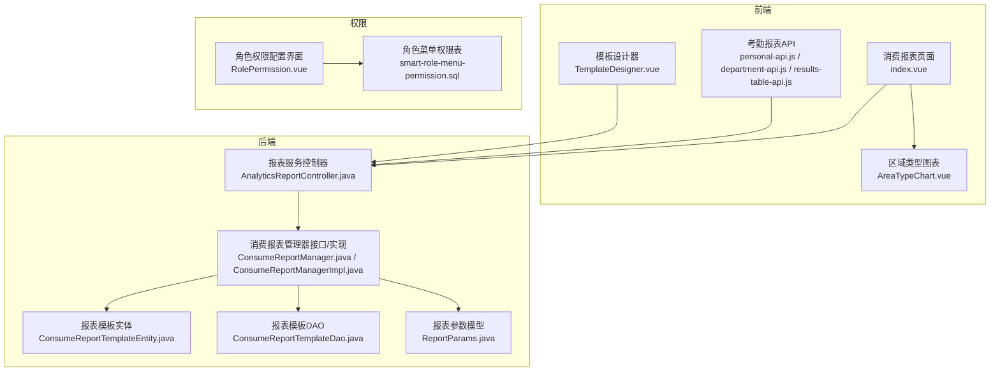
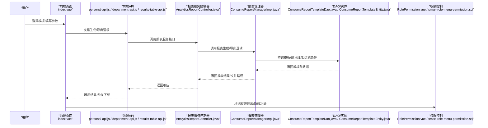
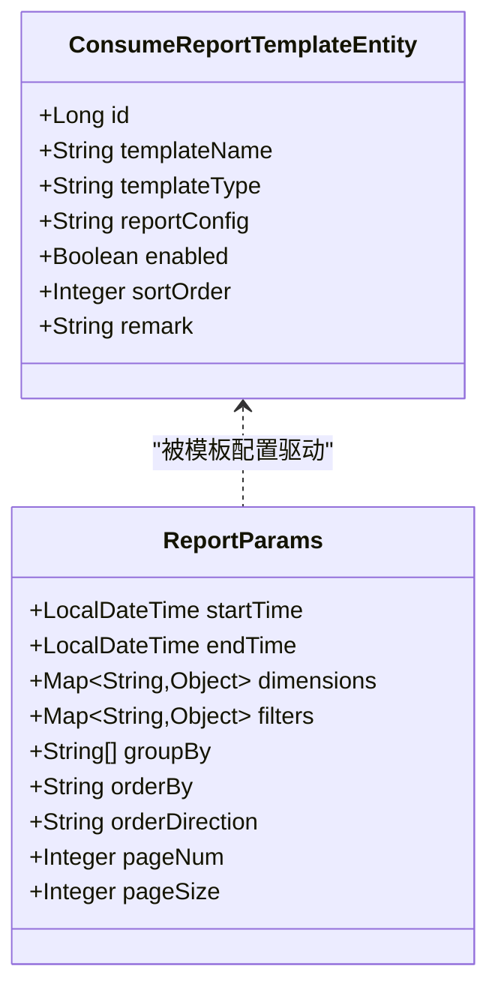
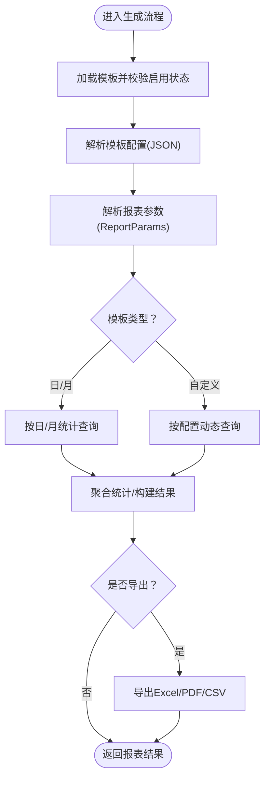
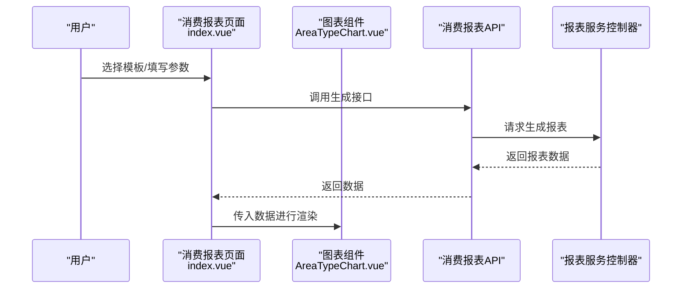
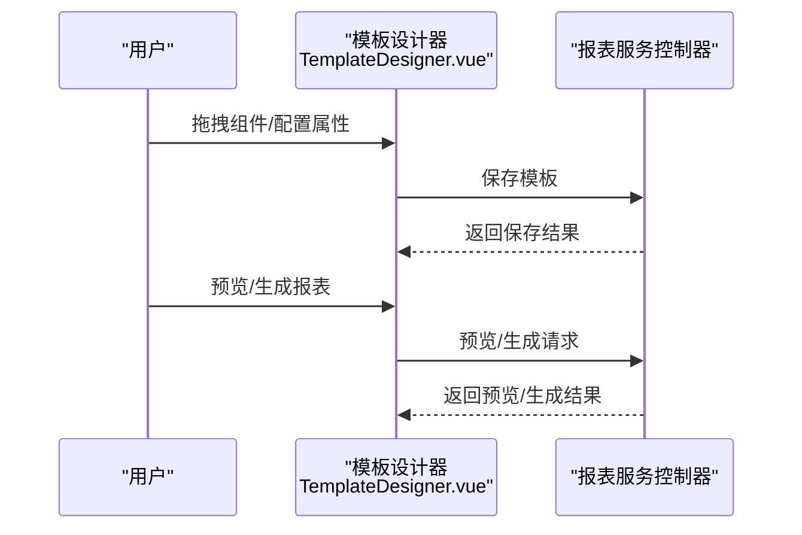
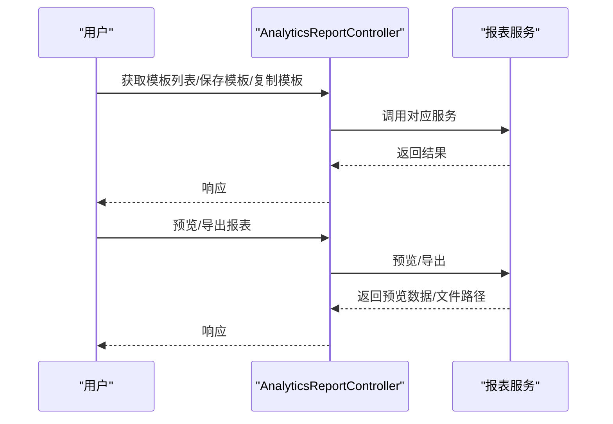
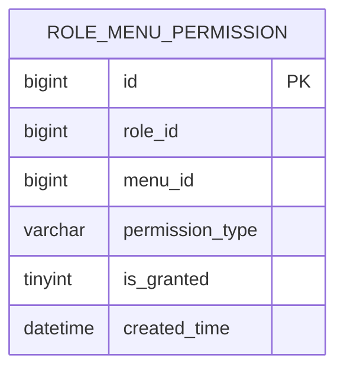
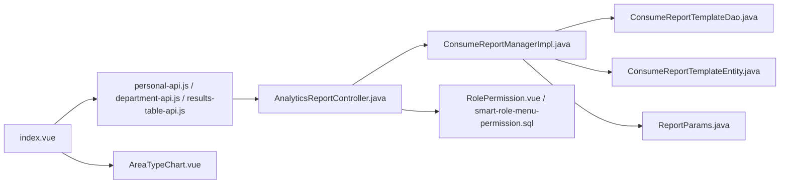

# 自定义报表

<cite>
**本文引用的文件**
- [ConsumeReportTemplateEntity.java](file://microservices/ioedream-consume-service/src/main/java/net/lab1024/sa/consume/report/domain/entity/ConsumeReportTemplateEntity.java)
- [ConsumeReportTemplateDao.java](file://microservices/ioedream-consume-service/src/main/java/net/lab1024/sa/consume/report/dao/ConsumeReportTemplateDao.java)
- [ReportParams.java](file://microservices/ioedream-consume-service/src/main/java/net/lab1024/sa/consume/report/domain/form/ReportParams.java)
- [ConsumeReportManager.java](file://microservices/ioedream-consume-service/src/main/java/net/lab1024/sa/consume/report/manager/ConsumeReportManager.java)
- [ConsumeReportManagerImpl.java](file://microservices/ioedream-consume-service/src/main/java/net/lab1024/sa/consume/report/manager/impl/ConsumeReportManagerImpl.java)
- [index.vue](file://smart-admin-web-javascript/src/views/business/consume/report/index.vue)
- [AreaTypeChart.vue](file://smart-admin-web-javascript/src/views/business/consume/report/components/AreaTypeChart.vue)
- [results-table-api.js](file://smart-admin-web-javascript/src/api/business/attendance/reports/results-table-api.js)
- [personal-api.js](file://smart-admin-web-javascript/src/api/business/attendance/reports/personal-api.js)
- [department-api.js](file://smart-admin-web-javascript/src/api/business/attendance/reports/department-api.js)
- [TemplateDesigner.vue](file://smart-admin-web-javascript/src/views/business/attendance/reports/templates/components/TemplateDesigner.vue)
- [AnalyticsReportController.java](file://restful_refactor_backup_20251202_014224/microservices_ioedream-report-service_src_main_java_net_lab1024_sa_report_controller_AnalyticsReportController.java)
- [smart-role-menu-permission.sql](file://database-scripts/common-service/06-t_role_permission.sql)
- [RolePermission.vue](file://documentation/technical/smart-business-integration.md)
</cite>

## 目录
1. [简介](#简介)
2. [项目结构](#项目结构)
3. [核心组件](#核心组件)
4. [架构总览](#架构总览)
5. [详细组件分析](#详细组件分析)
6. [依赖关系分析](#依赖关系分析)
7. [性能考虑](#性能考虑)
8. [故障排查指南](#故障排查指南)
9. [结论](#结论)
10. [附录](#附录)

## 简介
本文件面向“自定义报表”主题，系统化阐述消费类报表的创建流程、配置界面、数据源字段选择、筛选条件、分组与排序、模板保存与复用、权限控制、导出与分享、以及定时生成等能力。文档以仓库现有代码与文档为依据，结合前后端交互与业务模型，给出可操作的使用说明与最佳实践。

## 项目结构
围绕“自定义报表”的实现，主要涉及以下层次与模块：
- 前端页面与组件：消费报表管理页面、图表组件、模板设计器（考勤模块）
- 前端API封装：消费报表、考勤报表、结果表API
- 后端服务与管理器：消费报表模板实体、DAO、参数模型、报表管理器接口与实现
- 报表服务控制器：通用报表服务（模板、预览、导出、定时任务、复制模板）
- 权限控制：角色菜单权限表与权限配置界面

图表来源
- [index.vue](file://smart-admin-web-javascript/src/views/business/consume/report/index.vue#L1-L240)
- [AreaTypeChart.vue](file://smart-admin-web-javascript/src/views/business/consume/report/components/AreaTypeChart.vue#L1-L93)
- [TemplateDesigner.vue](file://smart-admin-web-javascript/src/views/business/attendance/reports/templates/components/TemplateDesigner.vue#L132-L880)
- [personal-api.js](file://smart-admin-web-javascript/src/api/business/attendance/reports/personal-api.js#L72-L125)
- [department-api.js](file://smart-admin-web-javascript/src/api/business/attendance/reports/department-api.js#L91-L125)
- [results-table-api.js](file://smart-admin-web-javascript/src/api/business/attendance/reports/results-table-api.js#L108-L124)
- [AnalyticsReportController.java](file://restful_refactor_backup_20251202_014224/microservices_ioedream-report-service_src_main_java_net_lab1024_sa_report_controller_AnalyticsReportController.java#L89-L162)
- [ConsumeReportManager.java](file://microservices/ioedream-consume-service/src/main/java/net/lab1024/sa/consume/report/manager/ConsumeReportManager.java#L1-L85)
- [ConsumeReportManagerImpl.java](file://microservices/ioedream-consume-service/src/main/java/net/lab1024/sa/consume/report/manager/impl/ConsumeReportManagerImpl.java#L1-L1317)
- [ConsumeReportTemplateEntity.java](file://microservices/ioedream-consume-service/src/main/java/net/lab1024/sa/consume/report/domain/entity/ConsumeReportTemplateEntity.java#L1-L81)
- [ConsumeReportTemplateDao.java](file://microservices/ioedream-consume-service/src/main/java/net/lab1024/sa/consume/report/dao/ConsumeReportTemplateDao.java#L1-L43)
- [ReportParams.java](file://microservices/ioedream-consume-service/src/main/java/net/lab1024/sa/consume/report/domain/form/ReportParams.java#L1-L93)
- [smart-role-menu-permission.sql](file://database-scripts/common-service/06-t_role_permission.sql#L109-L124)
- [RolePermission.vue](file://documentation/technical/smart-business-integration.md#L1025-L1397)

章节来源
- [index.vue](file://smart-admin-web-javascript/src/views/business/consume/report/index.vue#L1-L240)
- [ConsumeReportManagerImpl.java](file://microservices/ioedream-consume-service/src/main/java/net/lab1024/sa/consume/report/manager/impl/ConsumeReportManagerImpl.java#L1-L1317)

## 核心组件
- 报表模板实体：承载模板元信息（名称、类型、配置、启用状态、排序、备注）。
- 报表模板DAO：提供按类型与启用状态查询模板的能力。
- 报表参数模型：统一承载时间范围、统计维度、过滤条件、分组、排序、分页等参数。
- 报表管理器接口与实现：负责模板校验、参数解析、数据查询、聚合与结果组装，并提供导出能力。
- 前端消费报表页面：提供模板选择、参数配置、生成与导出入口；并以图表组件展示结果。
- 模板设计器（考勤模块）：提供可视化拖拽式报表模板设计、保存、预览与生成能力。
- 报表服务控制器：提供模板列表、保存、预览、导出、定时任务、复制模板等通用能力。
- 权限控制：基于角色菜单权限表与权限配置界面，限制报表相关操作的可见与使用范围。

章节来源
- [ConsumeReportTemplateEntity.java](file://microservices/ioedream-consume-service/src/main/java/net/lab1024/sa/consume/report/domain/entity/ConsumeReportTemplateEntity.java#L1-L81)
- [ConsumeReportTemplateDao.java](file://microservices/ioedream-consume-service/src/main/java/net/lab1024/sa/consume/report/dao/ConsumeReportTemplateDao.java#L1-L43)
- [ReportParams.java](file://microservices/ioedream-consume-service/src/main/java/net/lab1024/sa/consume/report/domain/form/ReportParams.java#L1-L93)
- [ConsumeReportManager.java](file://microservices/ioedream-consume-service/src/main/java/net/lab1024/sa/consume/report/manager/ConsumeReportManager.java#L1-L85)
- [ConsumeReportManagerImpl.java](file://microservices/ioedream-consume-service/src/main/java/net/lab1024/sa/consume/report/manager/impl/ConsumeReportManagerImpl.java#L1-L1317)
- [index.vue](file://smart-admin-web-javascript/src/views/business/consume/report/index.vue#L1-L240)
- [TemplateDesigner.vue](file://smart-admin-web-javascript/src/views/business/attendance/reports/templates/components/TemplateDesigner.vue#L132-L880)
- [AnalyticsReportController.java](file://restful_refactor_backup_20251202_014224/microservices_ioedream-report-service_src_main_java_net_lab1024_sa_report_controller_AnalyticsReportController.java#L89-L162)
- [smart-role-menu-permission.sql](file://database-scripts/common-service/06-t_role_permission.sql#L109-L124)
- [RolePermission.vue](file://documentation/technical/smart-business-integration.md#L1025-L1397)

## 架构总览
下图展示了从前端到后端、再到权限控制的整体流程，涵盖自定义报表的创建、配置、生成、导出与权限约束。

图表来源
- [index.vue](file://smart-admin-web-javascript/src/views/business/consume/report/index.vue#L1-L240)
- [personal-api.js](file://smart-admin-web-javascript/src/api/business/attendance/reports/personal-api.js#L72-L125)
- [department-api.js](file://smart-admin-web-javascript/src/api/business/attendance/reports/department-api.js#L91-L125)
- [results-table-api.js](file://smart-admin-web-javascript/src/api/business/attendance/reports/results-table-api.js#L108-L124)
- [AnalyticsReportController.java](file://restful_refactor_backup_20251202_014224/microservices_ioedream-report-service_src_main_java_net_lab1024_sa_report_controller_AnalyticsReportController.java#L89-L162)
- [ConsumeReportManagerImpl.java](file://microservices/ioedream-consume-service/src/main/java/net/lab1024/sa/consume/report/manager/impl/ConsumeReportManagerImpl.java#L1-L1317)
- [ConsumeReportTemplateDao.java](file://microservices/ioedream-consume-service/src/main/java/net/lab1024/sa/consume/report/dao/ConsumeReportTemplateDao.java#L1-L43)
- [ConsumeReportTemplateEntity.java](file://microservices/ioedream-consume-service/src/main/java/net/lab1024/sa/consume/report/domain/entity/ConsumeReportTemplateEntity.java#L1-L81)
- [RolePermission.vue](file://documentation/technical/smart-business-integration.md#L1025-L1397)
- [smart-role-menu-permission.sql](file://database-scripts/common-service/06-t_role_permission.sql#L109-L124)

## 详细组件分析

### 报表模板与参数模型
- 报表模板实体包含模板ID、名称、类型（日报/月报/自定义）、配置（JSON）、启用状态、排序与备注等字段，支撑模板的存储与复用。
- 报表参数模型提供统一的时间范围、统计维度、过滤条件、分组字段、排序字段与方向、分页参数，便于后端解析与执行。

图表来源
- [ConsumeReportTemplateEntity.java](file://microservices/ioedream-consume-service/src/main/java/net/lab1024/sa/consume/report/domain/entity/ConsumeReportTemplateEntity.java#L1-L81)
- [ReportParams.java](file://microservices/ioedream-consume-service/src/main/java/net/lab1024/sa/consume/report/domain/form/ReportParams.java#L1-L93)

章节来源
- [ConsumeReportTemplateEntity.java](file://microservices/ioedream-consume-service/src/main/java/net/lab1024/sa/consume/report/domain/entity/ConsumeReportTemplateEntity.java#L1-L81)
- [ReportParams.java](file://microservices/ioedream-consume-service/src/main/java/net/lab1024/sa/consume/report/domain/form/ReportParams.java#L1-L93)

### 报表管理器与数据处理流程
- 管理器接口定义了生成报表、获取模板列表、统计查询与导出等能力。
- 管理器实现负责：
  - 校验模板存在与启用状态
  - 解析模板配置与报表参数
  - 按模板类型（日/月/自定义）查询统计数据
  - 聚合与构建结果
  - 导出（Excel/PDF/CSV）并返回文件路径

图表来源
- [ConsumeReportManager.java](file://microservices/ioedream-consume-service/src/main/java/net/lab1024/sa/consume/report/manager/ConsumeReportManager.java#L1-L85)
- [ConsumeReportManagerImpl.java](file://microservices/ioedream-consume-service/src/main/java/net/lab1024/sa/consume/report/manager/impl/ConsumeReportManagerImpl.java#L1-L1317)

章节来源
- [ConsumeReportManager.java](file://microservices/ioedream-consume-service/src/main/java/net/lab1024/sa/consume/report/manager/ConsumeReportManager.java#L1-L85)
- [ConsumeReportManagerImpl.java](file://microservices/ioedream-consume-service/src/main/java/net/lab1024/sa/consume/report/manager/impl/ConsumeReportManagerImpl.java#L1-L1317)

### 前端消费报表页面与图表展示
- 页面提供模板选择、参数配置（开始/结束时间、区域ID、用户ID等）、生成与导出（Excel/PDF/CSV）入口。
- 报表数据以表格形式展示；区域类型图表组件负责渲染柱状图等可视化结果。

图表来源
- [index.vue](file://smart-admin-web-javascript/src/views/business/consume/report/index.vue#L1-L240)
- [AreaTypeChart.vue](file://smart-admin-web-javascript/src/views/business/consume/report/components/AreaTypeChart.vue#L1-L93)
- [personal-api.js](file://smart-admin-web-javascript/src/api/business/attendance/reports/personal-api.js#L72-L125)

章节来源
- [index.vue](file://smart-admin-web-javascript/src/views/business/consume/report/index.vue#L1-L240)
- [AreaTypeChart.vue](file://smart-admin-web-javascript/src/views/business/consume/report/components/AreaTypeChart.vue#L1-L93)

### 模板设计器（考勤模块）
- 提供组件库（图表/表格/基础组件）、画布拖拽、属性面板、模板属性设置、保存、预览与生成等功能。
- 支持将常用配置保存为模板，便于复用与分享。

图表来源
- [TemplateDesigner.vue](file://smart-admin-web-javascript/src/views/business/attendance/reports/templates/components/TemplateDesigner.vue#L132-L880)
- [AnalyticsReportController.java](file://restful_refactor_backup_20251202_014224/microservices_ioedream-report-service_src_main_java_net_lab1024_sa_report_controller_AnalyticsReportController.java#L89-L162)

章节来源
- [TemplateDesigner.vue](file://smart-admin-web-javascript/src/views/business/attendance/reports/templates/components/TemplateDesigner.vue#L132-L880)
- [AnalyticsReportController.java](file://restful_refactor_backup_20251202_014224/microservices_ioedream-report-service_src_main_java_net_lab1024_sa_report_controller_AnalyticsReportController.java#L89-L162)

### 报表服务控制器与通用能力
- 模板管理：获取模板列表、保存模板、复制模板。
- 数据处理：预览报表数据、导出报表数据（Excel/PDF/CSV）。
- 定时任务：创建/取消/查询定时报表生成任务。

图表来源
- [AnalyticsReportController.java](file://restful_refactor_backup_20251202_014224/microservices_ioedream-report-service_src_main_java_net_lab1024_sa_report_controller_AnalyticsReportController.java#L89-L162)

章节来源
- [AnalyticsReportController.java](file://restful_refactor_backup_20251202_014224/microservices_ioedream-report-service_src_main_java_net_lab1024_sa_report_controller_AnalyticsReportController.java#L89-L162)

### 权限控制机制
- 角色菜单权限表定义了角色对菜单的权限类型（查看/新增/编辑/删除/导出/审批等），并以唯一索引保证角色-菜单-权限类型的组合唯一。
- 权限配置界面支持按模块启用、勾选菜单与权限，保存后生效，从而控制用户对报表相关功能的可见与使用范围。

图表来源
- [smart-role-menu-permission.sql](file://database-scripts/common-service/06-t_role_permission.sql#L109-L124)

章节来源
- [smart-role-menu-permission.sql](file://database-scripts/common-service/06-t_role_permission.sql#L109-L124)
- [RolePermission.vue](file://documentation/technical/smart-business-integration.md#L1025-L1397)

## 依赖关系分析
- 前端页面与组件依赖于API封装与服务控制器，形成“页面-接口-服务”的链路。
- 后端管理器依赖DAO与实体，完成模板与数据的读写与聚合。
- 权限控制贯穿前后端，通过角色菜单权限表与权限配置界面实现细粒度控制。

图表来源
- [index.vue](file://smart-admin-web-javascript/src/views/business/consume/report/index.vue#L1-L240)
- [personal-api.js](file://smart-admin-web-javascript/src/api/business/attendance/reports/personal-api.js#L72-L125)
- [department-api.js](file://smart-admin-web-javascript/src/api/business/attendance/reports/department-api.js#L91-L125)
- [results-table-api.js](file://smart-admin-web-javascript/src/api/business/attendance/reports/results-table-api.js#L108-L124)
- [AreaTypeChart.vue](file://smart-admin-web-javascript/src/views/business/consume/report/components/AreaTypeChart.vue#L1-L93)
- [AnalyticsReportController.java](file://restful_refactor_backup_20251202_014224/microservices_ioedream-report-service_src_main_java_net_lab1024_sa_report_controller_AnalyticsReportController.java#L89-L162)
- [ConsumeReportManagerImpl.java](file://microservices/ioedream-consume-service/src/main/java/net/lab1024/sa/consume/report/manager/impl/ConsumeReportManagerImpl.java#L1-L1317)
- [ConsumeReportTemplateDao.java](file://microservices/ioedream-consume-service/src/main/java/net/lab1024/sa/consume/report/dao/ConsumeReportTemplateDao.java#L1-L43)
- [ConsumeReportTemplateEntity.java](file://microservices/ioedream-consume-service/src/main/java/net/lab1024/sa/consume/report/domain/entity/ConsumeReportTemplateEntity.java#L1-L81)
- [ReportParams.java](file://microservices/ioedream-consume-service/src/main/java/net/lab1024/sa/consume/report/domain/form/ReportParams.java#L1-L93)
- [RolePermission.vue](file://documentation/technical/smart-business-integration.md#L1025-L1397)
- [smart-role-menu-permission.sql](file://database-scripts/common-service/06-t_role_permission.sql#L109-L124)

章节来源
- [ConsumeReportManagerImpl.java](file://microservices/ioedream-consume-service/src/main/java/net/lab1024/sa/consume/report/manager/impl/ConsumeReportManagerImpl.java#L1-L1317)
- [AnalyticsReportController.java](file://restful_refactor_backup_20251202_014224/microservices_ioedream-report-service_src_main_java_net_lab1024_sa_report_controller_AnalyticsReportController.java#L89-L162)

## 性能考虑
- 大数据量的虚拟滚动与异步加载，减少前端渲染压力。
- 图表渲染的性能优化与模板数据缓存机制，提升预览与导出效率。
- 后端聚合与分页参数的合理使用，降低数据库查询与内存占用。

[本节为通用指导，无需列出具体文件来源]

## 故障排查指南
- 模板不存在或未启用：生成报表时会校验模板存在与启用状态，若失败需检查模板状态与类型。
- 参数解析失败：确保时间范围、维度、过滤条件、分组与排序字段合法。
- 导出失败：确认导出格式与后端支持情况，检查文件路径返回与下载流程。
- 权限不足：检查角色菜单权限配置，确保具备“查看/导出”等必要权限。

章节来源
- [ConsumeReportManagerImpl.java](file://microservices/ioedream-consume-service/src/main/java/net/lab1024/sa/consume/report/manager/impl/ConsumeReportManagerImpl.java#L1-L1317)
- [RolePermission.vue](file://documentation/technical/smart-business-integration.md#L1025-L1397)

## 结论
本项目提供了完善的自定义报表能力：从前端可视化配置与模板设计器，到后端模板与参数模型、数据聚合与导出，再到权限控制与定时任务，形成了从“创建-配置-生成-导出-权限-复用”的闭环。通过模板保存与复制、预览与生成、以及权限精细化控制，用户可以高效地构建与复用报表，满足多样化的数据分析需求。

[本节为总结性内容，无需列出具体文件来源]

## 附录

### 创建自定义报表的完整流程
- 选择模板：在页面选择已有模板或使用模板设计器新建模板。
- 配置参数：设置时间范围、区域ID、用户ID等筛选条件；定义分组与排序。
- 生成报表：点击生成，查看表格与图表结果。
- 导出与分享：支持导出Excel/PDF/CSV；模板可保存与复制以便复用。
- 权限控制：根据角色菜单权限决定可见与操作范围。

章节来源
- [index.vue](file://smart-admin-web-javascript/src/views/business/consume/report/index.vue#L1-L240)
- [TemplateDesigner.vue](file://smart-admin-web-javascript/src/views/business/attendance/reports/templates/components/TemplateDesigner.vue#L132-L880)
- [AnalyticsReportController.java](file://restful_refactor_backup_20251202_014224/microservices_ioedream-report-service_src_main_java_net_lab1024_sa_report_controller_AnalyticsReportController.java#L89-L162)
- [RolePermission.vue](file://documentation/technical/smart-business-integration.md#L1025-L1397)