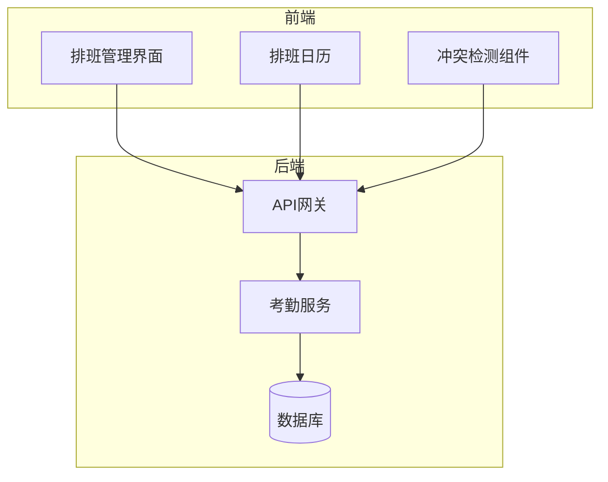
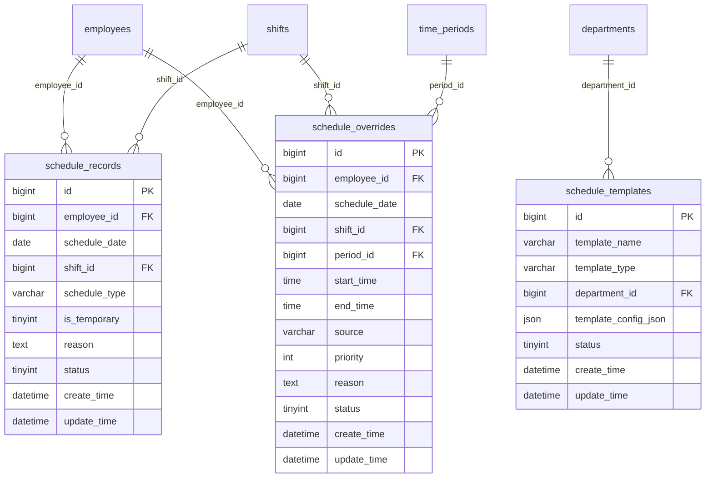
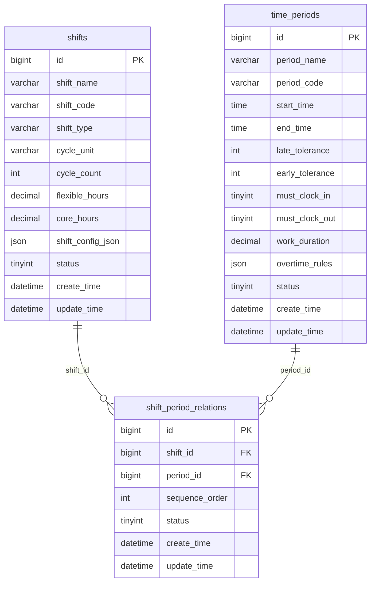
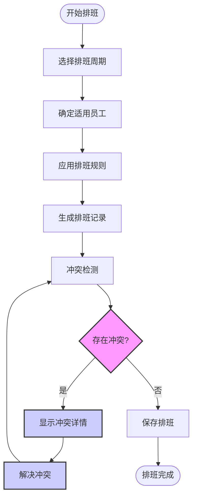
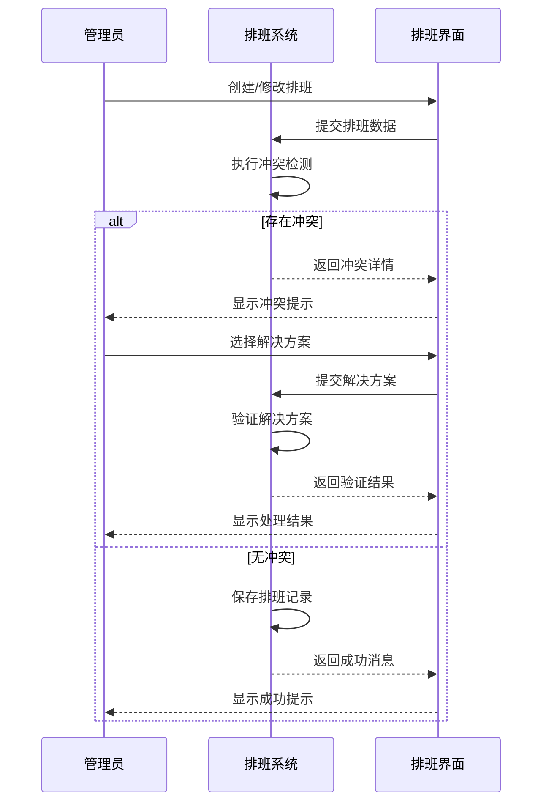

# 排班冲突检测

<cite>
**本文档引用文件**  
- [排班管理.md](file://documentation\03-业务模块\考勤\排班管理.md)
- [班次时间段管理.md](file://documentation\03-业务模块\考勤\班次时间段管理.md)
- [考勤前端原型布局\排班管理功能布局文档_完整版.md](file://documentation\03-业务模块\考勤\考勤前端原型布局\排班管理功能布局文档_完整版.md)
- [AttendanceRuleController.java](file://restful_refactor_backup_20251202_014224\microservices_ioedream-attendance-service_src_main_java_net_lab1024_sa_attendance_controller_AttendanceRuleController.java)
- [conflict-detector.js](file://smart-admin-web-javascript\src\views\business\attendance\scheduling\utils\conflict-detector.js)
</cite>

## 目录
1. [引言](#引言)
2. [系统架构](#系统架构)
3. [核心数据模型](#核心数据模型)
4. [冲突检测规则](#冲突检测规则)
5. [冲突检测流程](#冲突检测流程)
6. [冲突预警机制](#冲突预警机制)
7. [冲突处理流程](#冲突处理流程)
8. [冲突日志记录](#冲突日志记录)
9. [配置管理](#配置管理)
10. [前端实现](#前端实现)
11. [总结](#总结)

## 引言
排班冲突检测系统是考勤管理模块的核心功能之一，旨在确保员工排班安排的合理性和合规性。系统通过自动检测时间重叠、班次冲突、人员重复排班等情况，避免排班计划中的冲突问题。本文档详细介绍了排班冲突检测的实现机制、规则配置、预警机制、处理流程和日志记录功能，为管理员提供全面的指导。

## 系统架构
排班冲突检测系统采用微服务架构，主要由考勤服务（Attendance Service）负责核心业务逻辑处理。系统通过四层架构模式（Controller-Service-Manager-DAO）实现职责分离，确保代码的可维护性和可扩展性。

**Diagram sources**
- [排班管理.md](file://documentation\03-业务模块\考勤\排班管理.md)
- [考勤前端原型布局\排班管理功能布局文档_完整版.md](file://documentation\03-业务模块\考勤\考勤前端原型布局\排班管理功能布局文档_完整版.md)

## 核心数据模型
排班冲突检测系统依赖于多个核心数据表，这些表定义了排班、班次和时间段的基本结构。

### 排班相关数据表

**Diagram sources**
- [排班管理.md](file://documentation\03-业务模块\考勤\排班管理.md)

### 班次时间段相关数据表

**Diagram sources**
- [班次时间段管理.md](file://documentation\03-业务模块\考勤\班次时间段管理.md)

## 冲突检测规则
系统支持多种冲突检测规则，确保排班安排的合理性和合规性。

### 时间重叠冲突
检测同一员工在同一时间段内被安排多个班次的情况。系统通过比较排班记录的时间范围来判断是否存在重叠。

### 班次冲突
检测员工被安排相互冲突的班次，如夜班后立即安排早班，违反最小休息时间要求。

### 人员重复排班
检测同一员工在同一日期被重复排班的情况，避免工作量过载。

### 法律法规冲突
检测排班安排是否违反劳动法规定，如连续工作天数超过限制、休息时间不足等。

**Section sources**
- [排班管理.md](file://documentation\03-业务模块\考勤\排班管理.md)
- [班次时间段管理.md](file://documentation\03-业务模块\考勤\班次时间段管理.md)

## 冲突检测流程
排班冲突检测流程贯穿排班计划的整个生命周期，从创建到发布都进行严格的完整性检查。

**Diagram sources**
- [排班管理.md](file://documentation\03-业务模块\考勤\排班管理.md)

## 冲突预警机制
系统提供实时冲突预警机制，帮助管理员在排班计划发布前发现并解决潜在问题。

### 实时检测
在排班编辑过程中，系统实时检测并提示冲突，确保排班的合理性。

### 完整性检查
在排班计划发布前，系统进行全面的完整性检查，包括：
- 时间重叠检查
- 班次冲突检查
- 人员重复排班检查
- 法律法规合规性检查

### 预警通知
当检测到冲突时，系统通过以下方式通知管理员：
- 界面弹窗提示
- 邮件通知
- 系统消息

**Section sources**
- [排班管理.md](file://documentation\03-业务模块\考勤\排班管理.md)
- [考勤前端原型布局\排班管理功能布局文档_完整版.md](file://documentation\03-业务模块\考勤\考勤前端原型布局\排班管理功能布局文档_完整版.md)

## 冲突处理流程
当系统检测到排班冲突时，提供清晰的处理流程帮助管理员快速解决问题。

**Diagram sources**
- [排班管理.md](file://documentation\03-业务模块\考勤\排班管理.md)

## 冲突日志记录
系统详细记录所有冲突检测和处理的日志，便于后续审计和追溯。

### 日志内容
冲突日志包含以下信息：
- 冲突类型
- 涉及员工
- 冲突时间
- 检测时间
- 处理状态
- 处理人
- 处理时间

### 日志存储
冲突日志存储在数据库的`t_alert`表中，与系统监控和告警功能集成。

### 日志查询
管理员可以通过以下方式查询冲突日志：
- 按时间范围查询
- 按员工查询
- 按冲突类型查询
- 按处理状态查询

**Section sources**
- [database-scripts\common-service\11-t_alert.sql](file://database-scripts\common-service\11-t_alert.sql)
- [排班管理.md](file://documentation\03-业务模块\考勤\排班管理.md)

## 配置管理
系统支持灵活的冲突检测规则配置，管理员可以根据实际需求自定义判断条件。

### 规则配置
管理员可以配置以下冲突检测规则：
- 最小休息时间
- 最大连续工作天数
- 班次间隔时间
- 特殊岗位限制

### 优先级设置
系统支持设置冲突解决的优先级，确保重要规则优先处理。

### 自定义条件
管理员可以创建自定义冲突判断条件，满足特定业务需求。

**Section sources**
- [排班管理.md](file://documentation\03-业务模块\考勤\排班管理.md)
- [班次时间段管理.md](file://documentation\03-业务模块\考勤\班次时间段管理.md)

## 前端实现
前端通过可视化界面和实时反馈，提升排班冲突检测的用户体验。

### 排班日历
排班日历以月视图、员工视图和班次视图展示排班情况，支持拖拽操作调整排班。

### 冲突提示
当检测到冲突时，系统在日历上高亮显示冲突的排班记录，并提供详细的冲突信息。

### 解决方案
系统提供多种冲突解决方案建议，管理员可以选择合适的方案快速解决问题。

**Section sources**
- [考勤前端原型布局\排班管理功能布局文档_完整版.md](file://documentation\03-业务模块\考勤\考勤前端原型布局\排班管理功能布局文档_完整版.md)
- [conflict-detector.js](file://smart-admin-web-javascript\src\views\business\attendance\scheduling\utils\conflict-detector.js)

## 总结
排班冲突检测系统通过自动化的检测机制和灵活的配置选项，有效解决了排班管理中的各种冲突问题。系统不仅提高了排班效率，还确保了排班安排的合规性和合理性。通过完善的日志记录和审计功能，系统为管理员提供了全面的管理工具，支持后续的追溯和分析。