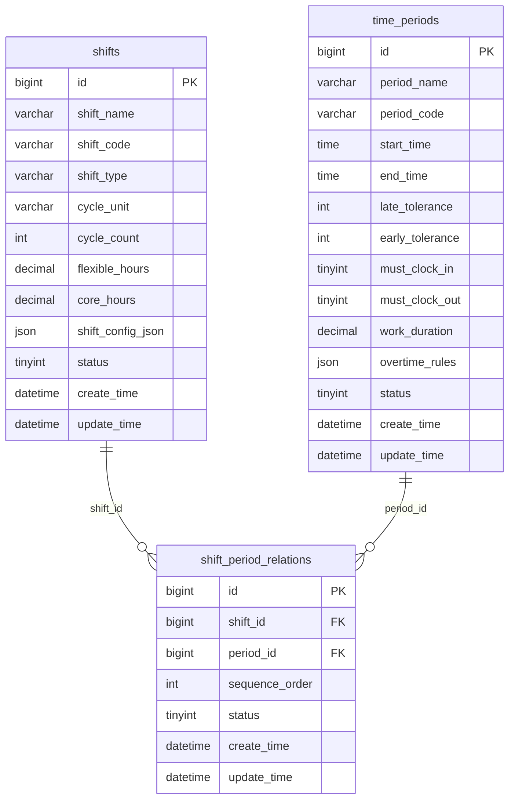
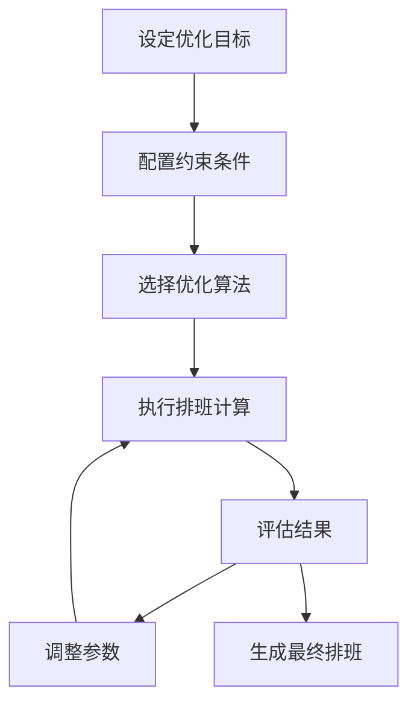
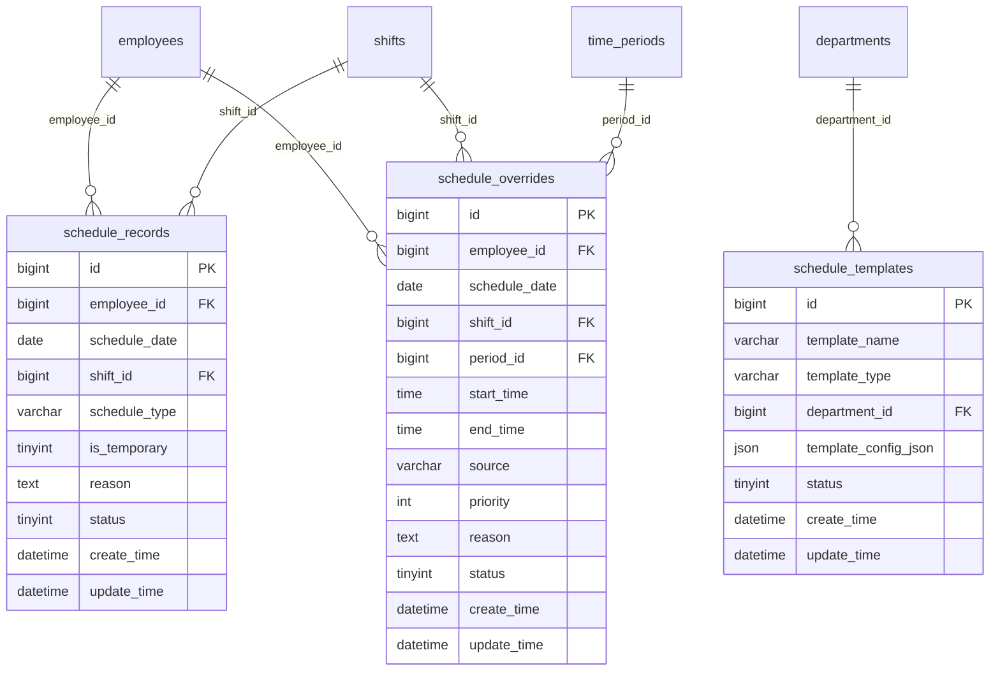

# 排班管理

<cite>
**本文档引用文件**   
- [排班管理.md](file://documentation\03-业务模块\考勤\排班管理.md)
- [班次时间段管理.md](file://documentation\03-业务模块\考勤\班次时间段管理.md)
- [ShiftsController.java](file://restful_refactor_backup_20251202_014224\microservices_ioedream-attendance-service_src_main_java_net_lab1024_sa_attendance_controller_ShiftsController.java)
- [AttendanceScheduleController.java](file://restful_refactor_backup_20251202_014224\microservices_ioedream-attendance-service_src_main_java_net_lab1024_sa_attendance_controller_AttendanceScheduleController.java)
- [排班管理功能布局文档_完整版.md](file://documentation\03-业务模块\考勤\考勤前端原型布局\排班管理功能布局文档_完整版.md)
- [13-前端移动端组件设计.md](file://documentation\03-业务模块\考勤\13-前端移动端组件设计.md)
</cite>

## 目录
1. [排班管理模块概述](#排班管理模块概述)
2. [班次管理](#班次管理)
3. [排班计划](#排班计划)
4. [轮班规则](#轮班规则)
5. [排班计划制定方法](#排班计划制定方法)
6. [高级排班功能](#高级排班功能)
7. [移动端排班查看与提醒](#移动端排班查看与提醒)
8. [数据模型与架构](#数据模型与架构)

## 排班管理模块概述

排班管理模块是考勤系统的核心功能之一，负责管理员工的排班安排。该模块支持多种排班模式，包括固定排班、轮班和自由排班，能够满足不同组织和岗位的排班需求。系统通过班次配置、排班模板和智能排班算法，实现高效、灵活的排班管理。

排班管理模块主要包含以下核心功能：
- **班次管理**：定义和管理各种班次，包括上班时间、下班时间、弹性时间、休息时间等参数
- **排班计划**：制定和管理员工的排班计划，支持周期性排班和临时排班
- **轮班规则**：配置轮班规则，支持三班倒、四班三倒等复杂轮班模式
- **排班冲突检测**：自动检测和解决排班冲突，确保排班的合理性和合规性
- **移动端支持**：提供移动端排班查看和提醒功能，方便员工随时了解自己的排班情况

**Section sources**
- [排班管理.md](file://documentation\03-业务模块\考勤\排班管理.md#L1-L404)

## 班次管理

班次管理是排班系统的基础，通过定义不同的班次来满足各种工作需求。系统支持创建和配置多种类型的班次，包括标准班、夜班、弹性班等。

### 班次参数配置

班次配置包含以下关键参数：

| 参数 | 说明 |
|------|------|
| 班次名称 | 班次的名称，如"标准早班"、"夜班"等 |
| 班次编码 | 班次的唯一标识符，用于系统内部引用 |
| 班次类型 | 班次的类型，如规律班次、弹性班次、三班倒等 |
| 周期单位 | 排班周期的单位，支持天、周、月 |
| 周期数 | 一个完整周期包含的天数，如7天一个周期 |
| 弹性工作时间 | 允许的弹性工作时间，以小时为单位 |
| 核心工作时间 | 必须在岗的核心工作时间，以小时为单位 |
| 状态 | 班次的启用状态，0-禁用，1-启用 |

### 时间段管理

班次由一个或多个时间段组成，每个时间段定义了具体的工作时间安排。系统通过`shift_period_relations`表实现班次与时间段的多对多关联。



**Diagram sources **
- [班次时间段管理.md](file://documentation\03-业务模块\考勤\班次时间段管理.md#L28-L122)

**Section sources**
- [班次时间段管理.md](file://documentation\03-业务模块\考勤\班次时间段管理.md#L28-L181)

## 排班计划

排班计划是将班次应用到具体员工的过程，系统支持多种排班计划模式，包括固定排班、轮班和自由排班。

### 固定排班

固定排班适用于工作时间相对固定的岗位，如办公室职员。系统支持为员工设置长期的固定排班计划。

**固定排班特点：**
- 每周工作日固定（如周一至周五）
- 每天工作时间固定（如09:00-18:00）
- 休息时间固定（如12:00-13:00）
- 适用于大多数办公室岗位

### 轮班

轮班适用于需要24小时连续工作的岗位，如生产线、安保等。系统支持多种轮班模式：

**三班倒模式：**
- 将员工分为三组，轮流工作
- 每班工作8小时，24小时不间断
- 常见班次：早班（08:00-16:00）、中班（16:00-24:00）、夜班（00:00-08:00）

**四班三倒模式：**
- 将员工分为四组，三组工作，一组休息
- 每班工作8小时，24小时不间断
- 工作-休息周期更合理，减少员工疲劳

### 自由排班

自由排班适用于工作时间灵活的岗位，如研发人员。系统支持弹性工作时间，允许员工在规定范围内自由选择上下班时间。

**自由排班特点：**
- 核心工作时间固定（如10:00-16:00必须在岗）
- 弹性工作时间可调（如可在08:00-10:00之间选择上班时间）
- 总工作时长固定（如每天8小时）
- 提高员工工作灵活性和满意度

**Section sources**
- [排班管理.md](file://documentation\03-业务模块\考勤\排班管理.md#L181-L204)

## 轮班规则

轮班规则定义了轮班的具体安排和约束条件，确保轮班的公平性和合理性。

### 轮班周期配置

轮班周期是轮班安排的基本单位，系统支持配置不同的轮班周期：

| 周期类型 | 说明 | 示例 |
|---------|------|------|
| 日周期 | 每天轮换一次 | 早班、中班、夜班每天轮换 |
| 周周期 | 每周轮换一次 | 每周轮换一次班次 |
| 月周期 | 每月轮换一次 | 每月轮换一次班次 |

### 轮班约束条件

系统支持配置多种轮班约束条件，确保轮班安排的合理性和合规性：

**基本约束：**
- 最大连续工作天数（如不超过6天）
- 最小休息时间（如不少于12小时）
- 周末平衡（确保周末休息的公平性）
- 节假日安排（考虑法定节假日）

**高级约束：**
- 技能匹配（确保岗位技能要求）
- 员工偏好（考虑员工个人偏好）
- 法律合规（符合劳动法规定）
- 成本优化（最小化人力成本）

### 轮班公平性

系统通过多种机制确保轮班的公平性：

- **轮换频率**：确保每个员工在不同班次间的轮换频率相同
- **夜班分配**：合理分配夜班，避免某些员工长期上夜班
- **周末安排**：均衡分配周末工作，确保公平性
- **假期安排**：考虑员工的年假、调休等特殊情况

**Section sources**
- [排班管理.md](file://documentation\03-业务模块\考勤\排班管理.md#L228-L237)

## 排班计划制定方法

系统提供多种排班计划制定方法，支持手动排班、模板应用和智能排班。

### 手动排班

手动排班适用于特殊情况或临时调整，管理员可以直接为员工安排具体的排班。

**手动排班流程：**
1. 选择目标员工
2. 选择排班日期
3. 选择适用班次
4. 设置排班原因
5. 保存排班记录

### 模板应用

模板应用是批量排班的主要方式，通过预定义的排班模板快速为多个员工安排排班。

**模板类型：**
- **部门模板**：适用于整个部门的排班模板
- **岗位模板**：适用于特定岗位的排班模板
- **个人模板**：适用于特定员工的个性化排班模板

**模板应用流程：**
1. 选择适用的排班模板
2. 确定应用范围（部门、岗位或个人）
3. 设置应用周期
4. 批量生成排班记录
5. 验证和调整排班结果

### 智能排班

智能排班利用优化算法自动生成最优的排班方案，考虑多种约束条件和优化目标。

**智能排班流程：**
1. 设定优化目标（如工作量平衡、成本最小化）
2. 配置约束条件（如法律法规、员工技能）
3. 选择优化算法（如遗传算法、模拟退火）
4. 执行排班计算
5. 评估和调整排班方案
6. 生成最终排班



**Diagram sources **
- [排班管理.md](file://documentation\03-业务模块\考勤\排班管理.md#L264-L267)

**Section sources**
- [排班管理.md](file://documentation\03-业务模块\考勤\排班管理.md#L248-L267)

## 高级排班功能

系统提供多种高级排班功能，满足复杂的排班需求。

### 批量排班

批量排班功能支持一次性为多个员工安排排班，提高排班效率。

**批量排班方式：**
- **按部门批量排班**：为整个部门的员工安排相同的排班
- **按岗位批量排班**：为特定岗位的员工安排排班
- **按条件筛选批量排班**：根据特定条件（如技能、经验）筛选员工进行批量排班

### 排班调整

排班调整功能支持对已安排的排班进行修改和调整。

**排班调整场景：**
- 员工请假或调休
- 临时工作安排
- 突发事件处理
- 员工岗位变动

### 排班冲突检测

系统提供实时的排班冲突检测功能，确保排班安排的合理性。

**冲突检测类型：**
- **时间冲突**：同一员工在同一时间被安排多个班次
- **工作量冲突**：员工工作量超出合理范围
- **法规冲突**：排班安排违反劳动法规定
- **技能冲突**：员工技能不符合岗位要求

**冲突处理机制：**
- 实时提示冲突信息
- 提供冲突解决方案建议
- 支持手动调整排班
- 记录冲突处理历史

**Section sources**
- [排班管理.md](file://documentation\03-业务模块\考勤\排班管理.md#L181-L204)

## 移动端排班查看与提醒

系统提供移动端支持，方便员工随时查看自己的排班情况，并接收相关提醒。

### 移动端排班查看

移动端提供直观的排班日历视图，员工可以方便地查看自己的排班安排。

**移动端功能特点：**
- **日历视图**：以月历形式展示排班情况
- **详情查看**：点击查看具体日期的排班详情
- **统计信息**：显示当月的工作日、节假日、请假等统计
- **离线查看**：支持离线查看最近的排班安排

```vue
<!-- 移动端排班日历组件 -->
<template>
  <div class="schedule-calendar">
    <!-- 日历头部 -->
    <div class="calendar-header">
      <van-button type="default" size="small" round @click="previousMonth">
        <van-icon name="arrow-left" />
      </van-button>
      <div class="month-title">{{ monthTitle }}</div>
      <van-button type="default" size="small" round @click="nextMonth">
        <van-icon name="arrow" />
      </van-button>
      <van-button v-if="showTodayButton" type="primary" size="small" round @click="goToToday">
        今天
      </van-button>
    </div>

    <!-- 星期标题 -->
    <div class="weekdays">
      <div v-for="(day, index) in weekDays" :key="index" class="weekday" :class="{ 'weekend': index >= 5 }">
        {{ day }}
      </div>
    </div>

    <!-- 日历网格 -->
    <div class="calendar-grid">
      <div v-for="(cell, index) in calendarDays" :key="index" class="calendar-cell" :class="getCellClass(cell)" @click="handleCellClick(cell)">
        <!-- 日期数字 -->
        <div class="day-number">
          {{ cell.day }}
          <span v-if="isToday(cell.date)" class="today-dot"></span>
        </div>

        <!-- 状态指示器 -->
        <div class="day-indicators">
          <!-- 工作状态 -->
          <div v-if="cell.schedule" class="schedule-indicator">
            <van-icon :name="getScheduleIcon(cell.schedule.scheduleType)" :color="getScheduleColor(cell.schedule.scheduleType)" size="12" />
          </div>
        </div>

        <!-- 详细信息 -->
        <div v-if="cell.schedule" class="schedule-info">
          <div class="schedule-name">{{ cell.schedule.scheduleName }}</div>
          <div v-if="cell.schedule.workTime" class="work-time">{{ cell.schedule.workTime }}</div>
        </div>
      </div>
    </div>
  </div>
</template>
```

**Diagram sources **
- [13-前端移动端组件设计.md](file://documentation\03-业务模块\考勤\13-前端移动端组件设计.md#L1476-L2261)

### 排班提醒功能

系统提供多种排班提醒功能，帮助员工及时了解自己的排班情况。

**提醒类型：**
- **上班提醒**：上班前30分钟提醒打卡
- **下班提醒**：下班时间提醒打卡
- **休息提醒**：休息时间结束提醒返回工作岗位
- **临时排班提醒**：收到临时排班安排时提醒

**提醒配置：**
- 支持自定义提醒时间
- 支持多种提醒方式（短信、微信、邮件）
- 支持提醒频率控制
- 支持周末和节假日跳过提醒

**Section sources**
- [13-前端移动端组件设计.md](file://documentation\03-业务模块\考勤\13-前端移动端组件设计.md#L1476-L2261)

## 数据模型与架构

排班管理模块的数据模型设计合理，支持复杂的排班需求。

### 核心数据表

系统包含以下核心数据表：

**排班记录表 (schedule_records)**
```sql
CREATE TABLE schedule_records (
    bigint id PK "主键ID，自增长"
    bigint employee_id FK "员工ID，关联employees表"
    date schedule_date "排班日期，如：2024-01-15"
    bigint shift_id FK "班次ID，关联shifts表"
    varchar schedule_type "排班类型：正常排班/临时调班/加班排班"
    tinyint is_temporary "是否临时排班：0-正常，1-临时"
    text reason "排班原因，如：项目需要、人员调整"
    tinyint status "状态：0-取消，1-正常"
    datetime create_time "创建时间，记录排班创建时间"
    datetime update_time "更新时间，记录最后修改时间"
);
```

**排班模板表 (schedule_templates)**
```sql
CREATE TABLE schedule_templates (
    bigint id PK "主键ID，自增长"
    varchar template_name "模板名称，如：技术部标准排班模板"
    varchar template_type "模板类型：部门模板/岗位模板/个人模板"
    bigint department_id FK "部门ID，关联departments表"
    json template_config_json "模板配置JSON，包含排班规则和周期"
    tinyint status "状态：0-禁用，1-启用"
    datetime create_time "创建时间，记录模板创建时间"
    datetime update_time "更新时间，记录最后修改时间"
);
```

**临时排班覆盖表 (schedule_overrides)**
```sql
CREATE TABLE schedule_overrides (
    bigint id PK "主键ID，自增长"
    bigint employee_id FK "员工ID，关联employees表"
    date schedule_date "日期，如：2024-01-15"
    bigint shift_id FK "班次ID(可空)，用于整班覆盖"
    bigint period_id FK "时间段ID(可空)，关联time_periods表"
    time start_time "自定义开始时间(当不引用period时)"
    time end_time "自定义结束时间(当不引用period时)"
    varchar source "来源：manual/system/api"
    int priority "优先级(数值越大优先级越高)"
    text reason "原因，如：临时支援、临时会议"
    tinyint status "状态：0-取消，1-生效"
    datetime create_time "创建时间"
    datetime update_time "更新时间"
);
```

### 数据表关系



**Diagram sources **
- [排班管理.md](file://documentation\03-业务模块\考勤\排班管理.md#L125-L173)

**Section sources**
- [排班管理.md](file://documentation\03-业务模块\考勤\排班管理.md#L8-L175)