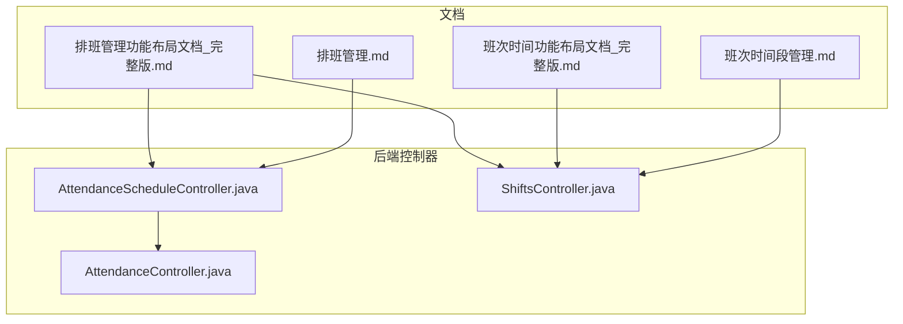
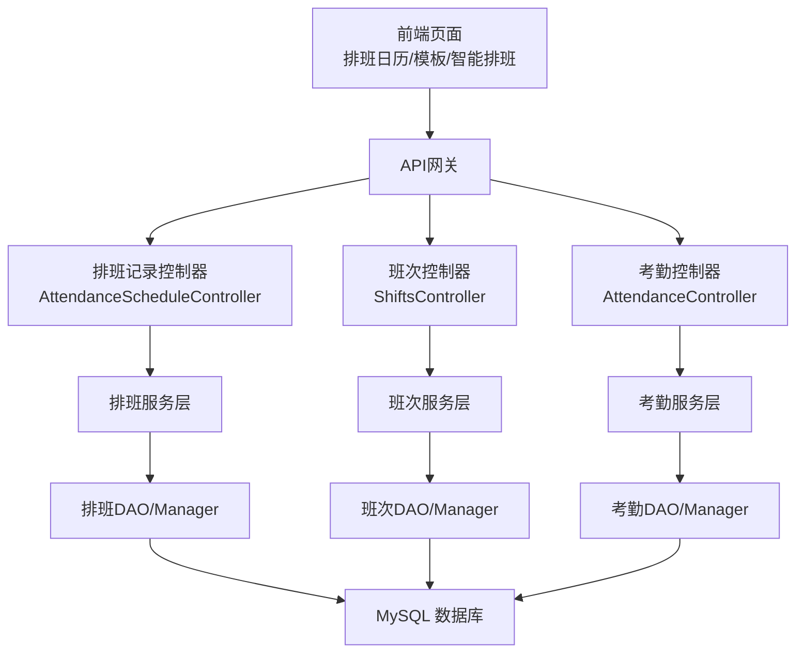
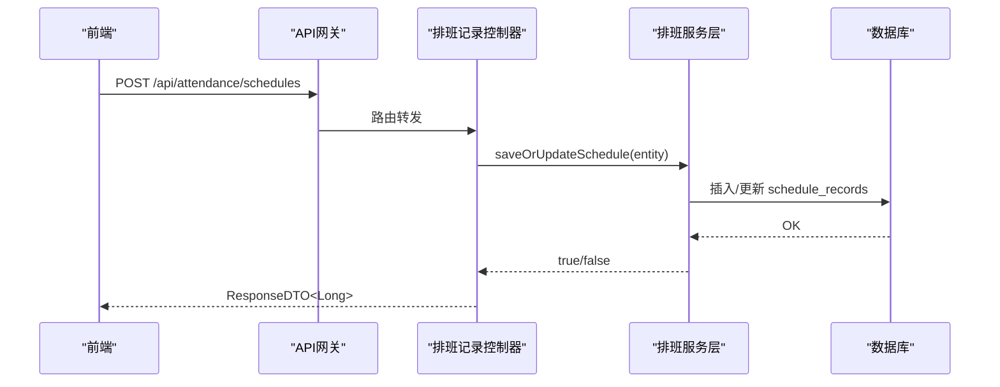
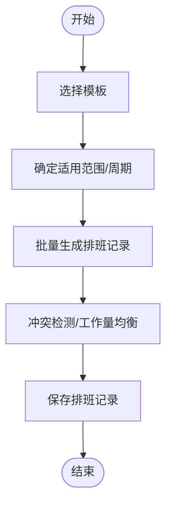
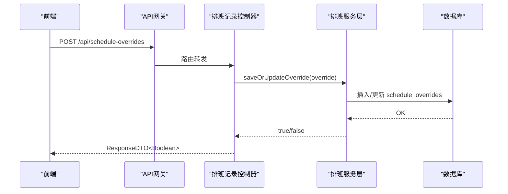
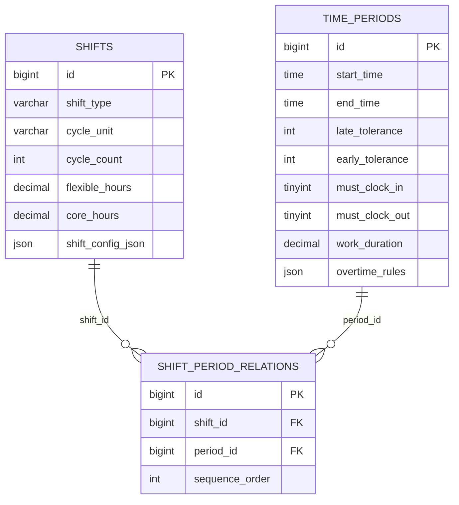
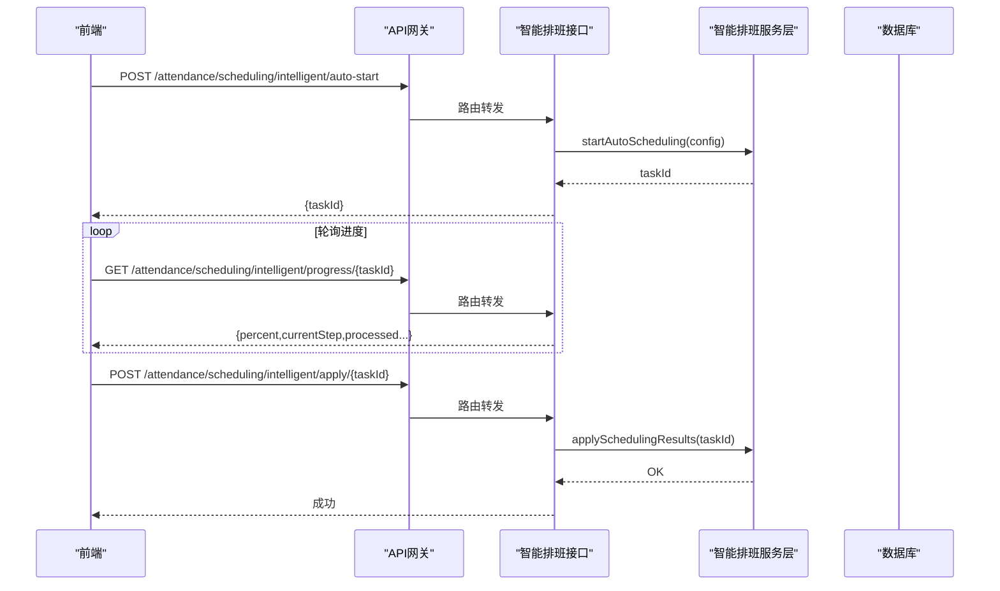
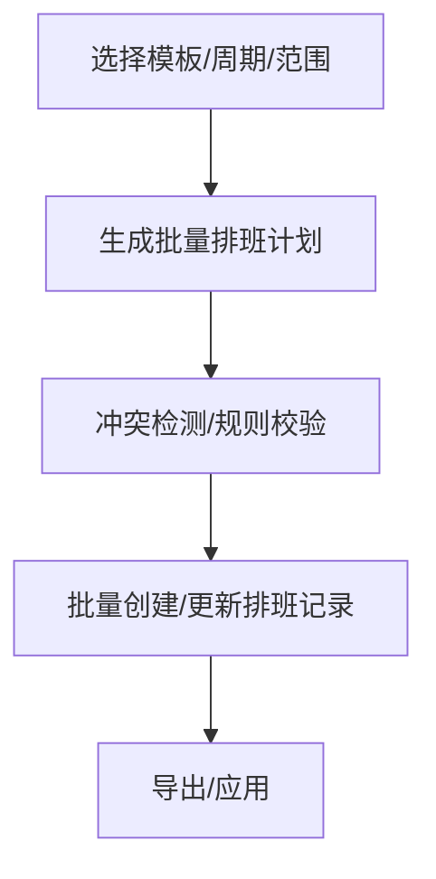
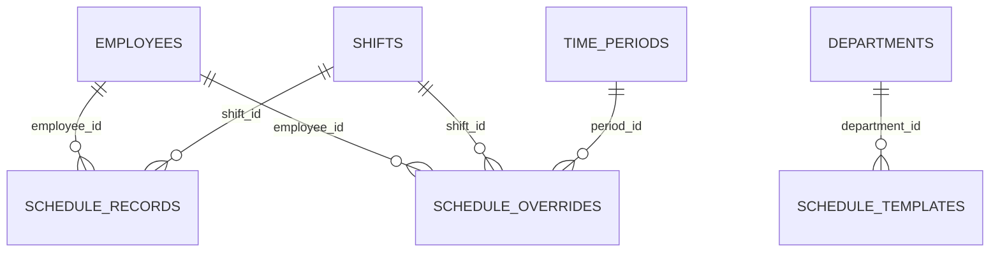

# 排班计划

<cite>
**本文引用的文件**
- [排班管理.md](file://documentation/03-业务模块/考勤/排班管理.md)
- [班次时间段管理.md](file://documentation/03-业务模块/考勤/班次时间段管理.md)
- [班次时间功能布局文档_完整版.md](file://documentation/03-业务模块/考勤/考勤前端原型布局/班次时间功能布局文档_完整版.md)
- [排班管理功能布局文档_完整版.md](file://documentation/03-业务模块/考勤/考勤前端原型布局/排班管理功能布局文档_完整版.md)
- [AttendanceScheduleController.java](file://restful_refactor_backup_20251202_014224/microservices_ioedream-attendance-service_src_main_java_net_lab1024_sa_attendance_controller_AttendanceScheduleController.java)
- [ShiftsController.java](file://restful_refactor_backup_20251202_014224/microservices_ioedream-attendance-service_src_main_java_net_lab1024_sa_attendance_controller_ShiftsController.java)
- [AttendanceController.java](file://restful_refactor_backup_20251202_014224/microservices_ioedream-attendance-service_src_main_java_net_lab1024_sa_attendance_controller_AttendanceController.java)
</cite>

## 目录
1. [引言](#引言)
2. [项目结构](#项目结构)
3. [核心组件](#核心组件)
4. [架构总览](#架构总览)
5. [详细组件分析](#详细组件分析)
6. [依赖分析](#依赖分析)
7. [性能考虑](#性能考虑)
8. [故障排查指南](#故障排查指南)
9. [结论](#结论)
10. [附录](#附录)

## 引言
本文件围绕“排班计划”主题，系统化梳理固定排班、轮班、自由排班等模式的实现思路与落地路径，并结合仓库中的排班管理、班次时间管理、前后端原型布局文档与控制器接口，给出按日/周/月周期性排班、批量排班、临时调班/替班、智能排班、发布生效与历史版本管理等能力的说明与流程图示。旨在帮助研发与产品同学快速理解与推进排班模块的设计与实现。

## 项目结构
排班相关能力主要由以下文档与后端控制器支撑：
- 文档层面：排班管理、班次时间段管理、前端排班与班次时间原型布局
- 控制器层面：排班记录管理、班次管理、考勤入口（含批量导入）

图表来源
- [排班管理.md](file://documentation/03-业务模块/考勤/排班管理.md#L1-L120)
- [班次时间段管理.md](file://documentation/03-业务模块/考勤/班次时间段管理.md#L1-L120)
- [班次时间功能布局文档_完整版.md](file://documentation/03-业务模块/考勤/考勤前端原型布局/班次时间功能布局文档_完整版.md#L1360-L1552)
- [排班管理功能布局文档_完整版.md](file://documentation/03-业务模块/考勤/考勤前端原型布局/排班管理功能布局文档_完整版.md#L76-L128)
- [AttendanceScheduleController.java](file://restful_refactor_backup_20251202_014224/microservices_ioedream-attendance-service_src_main_java_net_lab1024_sa_attendance_controller_AttendanceScheduleController.java#L1-L120)
- [ShiftsController.java](file://restful_refactor_backup_20251202_014224/microservices_ioedream-attendance-service_src_main_java_net_lab1024_sa_attendance_controller_ShiftsController.java#L1-L63)
- [AttendanceController.java](file://restful_refactor_backup_20251202_014224/microservices_ioedream-attendance-service_src_main_java_net_lab1024_sa_attendance_controller_AttendanceController.java#L1-L149)

章节来源
- [排班管理.md](file://documentation/03-业务模块/考勤/排班管理.md#L1-L120)
- [班次时间段管理.md](file://documentation/03-业务模块/考勤/班次时间段管理.md#L1-L120)
- [排班管理功能布局文档_完整版.md](file://documentation/03-业务模块/考勤/考勤前端原型布局/排班管理功能布局文档_完整版.md#L76-L128)

## 核心组件
- 排班记录（schedule_records）：承载员工在某一天的排班，支持正常排班与临时排班标记
- 排班模板（schedule_templates）：描述周期性排班规则、轮班策略、约束与适用范围
- 临时排班覆盖（schedule_overrides）：对正常排班进行优先级覆盖，支持整班或时间段覆盖
- 班次（shifts）：定义班次类型、轮班周期、弹性/核心工作时间、跨日支持等
- 时间段（time_periods）：定义工作时间段、容忍度、打卡要求、加班规则
- 班次-时间段关联（shift_period_relations）：将多个时间段组合为复杂班次

章节来源
- [排班管理.md](file://documentation/03-业务模块/考勤/排班管理.md#L8-L55)
- [排班管理.md](file://documentation/03-业务模块/考勤/排班管理.md#L104-L179)
- [班次时间段管理.md](file://documentation/03-业务模块/考勤/班次时间段管理.md#L8-L57)
- [班次时间段管理.md](file://documentation/03-业务模块/考勤/班次时间段管理.md#L126-L173)

## 架构总览
排班模块在考勤服务内以“控制器-服务-管理-数据访问”的分层实现，遵循统一的鉴权、权限与响应格式规范；前端通过API对接控制器，提供日历、拖拽、批量、智能排班等交互。

图表来源
- [排班管理.md](file://documentation/03-业务模块/考勤/排班管理.md#L60-L103)
- [班次时间段管理.md](file://documentation/03-业务模块/考勤/班次时间段管理.md#L60-L105)
- [排班管理功能布局文档_完整版.md](file://documentation/03-业务模块/考勤/考勤前端原型布局/排班管理功能布局文档_完整版.md#L76-L128)
- [排班管理.md](file://documentation/03-业务模块/考勤/排班管理.md#L280-L337)

## 详细组件分析

### 排班记录（正常/临时）
- 正常排班：按周期（日/周/月）与模板生成，支持冲突检测与工作量均衡
- 临时排班：支持整班覆盖与时间段覆盖，具备优先级与来源标记，实时生效
- 接口要点：创建/更新/删除/批量删除；按员工/部门/日期范围查询；单日排班查询与存在性检查

图表来源
- [排班管理.md](file://documentation/03-业务模块/考勤/排班管理.md#L8-L22)
- [排班管理.md](file://documentation/03-业务模块/考勤/排班管理.md#L280-L337)
- [排班管理功能布局文档_完整版.md](file://documentation/03-业务模块/考勤/考勤前端原型布局/排班管理功能布局文档_完整版.md#L76-L128)
- [AttendanceScheduleController.java](file://restful_refactor_backup_20251202_014224/microservices_ioedream-attendance-service_src_main_java_net_lab1024_sa_attendance_controller_AttendanceScheduleController.java#L53-L111)

章节来源
- [排班管理.md](file://documentation/03-业务模块/考勤/排班管理.md#L182-L205)
- [排班管理.md](file://documentation/03-业务模块/考勤/排班管理.md#L280-L337)
- [排班管理功能布局文档_完整版.md](file://documentation/03-业务模块/考勤/考勤前端原型布局/排班管理功能布局文档_完整版.md#L76-L128)
- [AttendanceScheduleController.java](file://restful_refactor_backup_20251202_014224/microservices_ioedream-attendance-service_src_main_java_net_lab1024_sa_attendance_controller_AttendanceScheduleController.java#L184-L335)

### 排班模板（周期性/轮班/约束）
- 模板配置：周期类型（日/周/月）、周期天数、每周排班模式、轮班规则、约束条件、适用员工范围
- 模板应用：按模板批量生成排班，支持复制与版本化（文档中提及模板版本与历史追踪）
- 模板与班次的关系：模板中的shift_id指向班次，模板驱动正常排班生成

图表来源
- [排班管理.md](file://documentation/03-业务模块/考勤/排班管理.md#L142-L199)
- [排班管理.md](file://documentation/03-业务模块/考勤/排班管理.md#L280-L337)

章节来源
- [排班管理.md](file://documentation/03-业务模块/考勤/排班管理.md#L142-L199)
- [排班管理.md](file://documentation/03-业务模块/考勤/排班管理.md#L195-L205)

### 临时排班（临时调班/替班）
- 临时覆盖：整班覆盖或时间段覆盖，支持优先级与来源（手动/系统/API），记录覆盖原因
- 生效策略：临时排班优先级高于正常排班，实时生效并通知相关方
- 适用场景：临时支援、临时会议、替班等

图表来源
- [排班管理.md](file://documentation/03-业务模块/考勤/排班管理.md#L38-L55)
- [排班管理.md](file://documentation/03-业务模块/考勤/排班管理.md#L188-L193)
- [排班管理.md](file://documentation/03-业务模块/考勤/排班管理.md#L312-L324)

章节来源
- [排班管理.md](file://documentation/03-业务模块/考勤/排班管理.md#L38-L55)
- [排班管理.md](file://documentation/03-业务模块/考勤/排班管理.md#L188-L193)
- [排班管理.md](file://documentation/03-业务模块/考勤/排班管理.md#L312-L324)

### 班次与时间段（固定/轮班/弹性）
- 班次类型：规律班次、弹性班次、三班倒、四班三倒；支持轮班周期（天/周/月）、弹性/核心时间、跨日、最大连续工作天数、最少休息天数
- 时间段：开始/结束时间、迟到/早退容忍、必须打卡、加班规则
- 关联关系：一个班次可包含多个时间段，支持午休等组合

图表来源
- [班次时间段管理.md](file://documentation/03-业务模块/考勤/班次时间段管理.md#L8-L57)
- [班次时间段管理.md](file://documentation/03-业务模块/考勤/班次时间段管理.md#L126-L173)

章节来源
- [班次时间段管理.md](file://documentation/03-业务模块/考勤/班次时间段管理.md#L28-L57)
- [班次时间段管理.md](file://documentation/03-业务模块/考勤/班次时间段管理.md#L180-L202)
- [班次时间功能布局文档_完整版.md](file://documentation/03-业务模块/考勤/考勤前端原型布局/班次时间功能布局文档_完整版.md#L1425-L1518)

### 智能排班（算法优化/进度监控/结果应用）
- 目标：在多约束条件下（工时平衡、技能匹配、合规、成本优化、满意度）生成最优排班方案
- 过程：启动任务 -> 进度监控 -> 生成结果 -> 导出/应用
- 前端提供可视化配置、进度条、结果分析与图表

图表来源
- [排班管理功能布局文档_完整版.md](file://documentation/03-业务模块/考勤/考勤前端原型布局/排班管理功能布局文档_完整版.md#L95-L1075)
- [排班管理功能布局文档_完整版.md](file://documentation/03-业务模块/考勤/考勤前端原型布局/排班管理功能布局文档_完整版.md#L76-L128)

章节来源
- [排班管理.md](file://documentation/03-业务模块/考勤/排班管理.md#L200-L205)
- [排班管理.md](file://documentation/03-业务模块/考勤/排班管理.md#L264-L268)
- [排班管理功能布局文档_完整版.md](file://documentation/03-业务模块/考勤/考勤前端原型布局/排班管理功能布局文档_完整版.md#L95-L1075)

### 批量排班（导入/导出/批量操作）
- 批量创建/更新/删除排班记录，支持模板化的批量排班流程
- 前端提供拖拽、批量操作、复制移动等交互
- 导出：智能排班结果导出（前端预留）

图表来源
- [排班管理.md](file://documentation/03-业务模块/考勤/排班管理.md#L360-L379)
- [排班管理功能布局文档_完整版.md](file://documentation/03-业务模块/考勤/考勤前端原型布局/排班管理功能布局文档_完整版.md#L76-L128)

章节来源
- [排班管理.md](file://documentation/03-业务模块/考勤/排班管理.md#L360-L379)
- [排班管理功能布局文档_完整版.md](file://documentation/03-业务模块/考勤/考勤前端原型布局/排班管理功能布局文档_完整版.md#L76-L128)

### 发布、生效与历史版本管理
- 发布/生效：智能排班完成后，前端触发“应用排班”，服务层落库并使新排班生效
- 历史版本：模板支持版本管理与历史追踪（文档明确提及）
- 建议：排班记录增加状态字段与版本号，支持回滚与审计

章节来源
- [排班管理.md](file://documentation/03-业务模块/考勤/排班管理.md#L195-L205)
- [排班管理.md](file://documentation/03-业务模块/考勤/排班管理.md#L264-L268)

## 依赖分析
- 排班记录依赖员工、班次；临时排班覆盖依赖员工、班次、时间段；模板依赖部门与适用员工范围
- 班次依赖时间段，支持多时间段组合与跨日配置
- 前端依赖控制器提供的REST接口，覆盖日历、模板、智能排班三大场景

图表来源
- [排班管理.md](file://documentation/03-业务模块/考勤/排班管理.md#L104-L179)
- [班次时间段管理.md](file://documentation/03-业务模块/考勤/班次时间段管理.md#L126-L173)

章节来源
- [排班管理.md](file://documentation/03-业务模块/考勤/排班管理.md#L104-L179)
- [班次时间段管理.md](file://documentation/03-业务模块/考勤/班次时间段管理.md#L126-L173)

## 性能考虑
- 排班数据缓存：班次配置、模板、时间段等高频配置可缓存
- 日历渲染优化：按需加载、虚拟滚动
- 批量操作优化：批量创建/更新/删除，减少往返次数
- 查询性能优化：索引设计（员工/日期/状态）、分页与过滤
- 并发控制：排班写入的互斥与事务一致性

章节来源
- [排班管理.md](file://documentation/03-业务模块/考勤/排班管理.md#L388-L399)
- [班次时间段管理.md](file://documentation/03-业务模块/考勤/班次时间段管理.md#L371-L381)
- [排班管理功能布局文档_完整版.md](file://documentation/03-业务模块/考勤/考勤前端原型布局/排班管理功能布局文档_完整版.md#L1072-L1086)

## 故障排查指南
- 排班创建/更新失败：检查控制器日志与异常返回；确认权限与资源校验
- 批量删除：确认传入ID集合有效，关注异常捕获与返回码
- 单日排班查询：若Service层未提供按ID查询方法，需扩展或通过其他查询路径定位
- 临时排班冲突：优先级与来源需正确设置，确保覆盖逻辑生效

章节来源
- [AttendanceScheduleController.java](file://restful_refactor_backup_20251202_014224/microservices_ioedream-attendance-service_src_main_java_net_lab1024_sa_attendance_controller_AttendanceScheduleController.java#L162-L182)
- [排班管理.md](file://documentation/03-业务模块/考勤/排班管理.md#L188-L193)

## 结论
本仓库提供了排班管理的完整文档与控制器骨架，明确了固定/轮班/弹性等班次类型、模板化周期排班、临时覆盖、智能排班与批量操作的实现路径。建议在现有基础上完善模板版本与历史追踪、排班记录状态与版本字段、以及更丰富的导入导出与发布生效流程，以满足企业级排班管理需求。

## 附录

### 接口一览（排班/班次/考勤）
- 排班记录
  - 创建/更新/删除/批量删除
  - 按员工/部门/日期范围查询
  - 单日排班查询与存在性检查
- 班次
  - 列表/创建/更新/删除/配置查询/复制
  - 班次-时间段关联与排序
- 智能排班
  - 启动/进度/停止/优化/建议/应用

章节来源
- [排班管理.md](file://documentation/03-业务模块/考勤/排班管理.md#L280-L337)
- [班次时间段管理.md](file://documentation/03-业务模块/考勤/班次时间段管理.md#L275-L320)
- [排班管理功能布局文档_完整版.md](file://documentation/03-业务模块/考勤/考勤前端原型布局/排班管理功能布局文档_完整版.md#L76-L128)