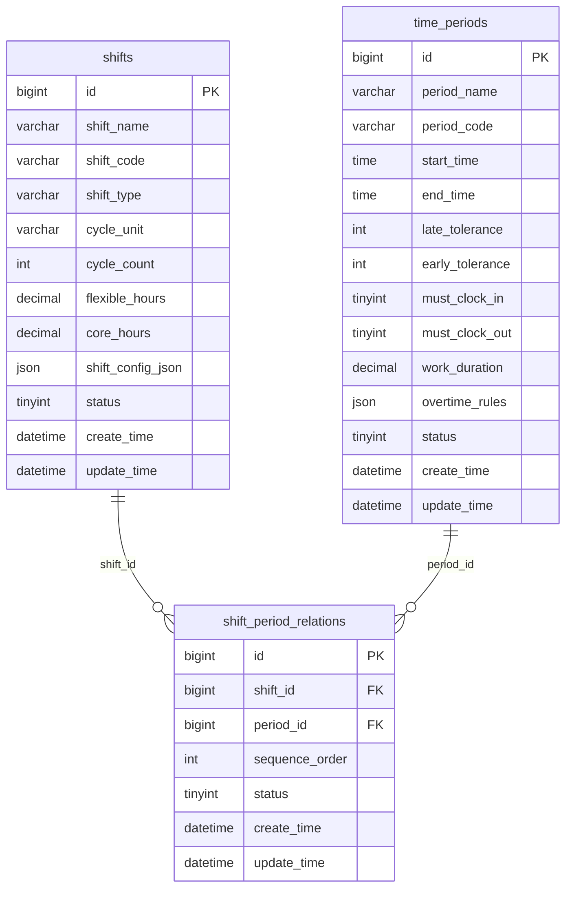

# 班次配置

<cite>
**本文档引用文件**  
- [班次时间段管理.md](file://documentation\03-业务模块\考勤\班次时间段管理.md)
- [排班管理.md](file://documentation\03-业务模块\考勤\排班管理.md)
- [考勤规则配置.md](file://documentation\03-业务模块\考勤\考勤规则配置.md)
- [原始记录及考勤计算.md](file://documentation\03-业务模块\考勤\原始记录及考勤计算.md)
- [ShiftsController.java](file://restful_refactor_backup_20251202_014224\microservices_ioedream-attendance-service_src_main_java_net_lab1024_sa_attendance_controller_ShiftsController.java)
</cite>

## 目录
1. [简介](#简介)
2. [核心数据模型](#核心数据模型)
3. [班次类型与配置](#班次类型与配置)
4. [班次模板管理](#班次模板管理)
5. [班次与考勤规则关联](#班次与考勤规则关联)
6. [班次变更历史](#班次变更历史)
7. [API接口说明](#api接口说明)
8. [前端页面建议](#前端页面建议)

## 简介
班次配置是考勤管理系统的核心功能之一，用于定义和管理员工的工作时间安排。本系统支持多种班次类型，包括标准班次、弹性班次、夜班等，能够满足不同岗位和部门的考勤需求。通过灵活的班次配置，可以精确计算员工的出勤情况，包括迟到、早退、加班等。

## 核心数据模型



**图示来源**  
- [班次时间段管理.md](file://documentation\03-业务模块\考勤\班次时间段管理.md#L127-L173)

**核心数据模型说明**  
1. **time_periods（时间段表）**：定义工作时间段的基本信息，包括开始时间、结束时间、迟到早退容忍时间等。
2. **shifts（班次表）**：定义班次的基本信息，包括班次名称、类型、周期等。
3. **shift_period_relations（班次时间段关联表）**：实现班次与时间段的多对多关联，支持一个班次包含多个时间段。

## 班次类型与配置

### 班次类型
系统支持多种班次类型，以满足不同的工作需求：

- **规律班次**：固定时间段的标准班次，适用于大多数办公室岗位。
- **弹性班次**：有弹性工作时间的班次，员工可以在规定的时间范围内自由选择上下班时间。
- **三班倒**：8小时一轮的三班制，适用于需要24小时连续工作的岗位。
- **四班三倒**：每天三班，四班轮换，适用于需要24小时连续工作的岗位。

### 班次参数配置
班次配置包含以下关键参数：

- **上班时间与下班时间**：定义班次的开始和结束时间。
- **弹性时间**：在弹性班次中，定义员工可以自由选择的上下班时间范围。
- **核心工作时间**：在弹性班次中，定义必须在岗的核心工作时间段。
- **迟到早退计算规则**：通过`late_tolerance`和`early_tolerance`字段定义迟到和早退的容忍时间（分钟）。
- **休息时间设置**：通过`break_duration`和`break_times`配置休息时长和时间段。

### 班次配置示例
```json
{
  "shift_pattern": "flexible",
  "flexible_start_time": "08:00",
  "flexible_end_time": "20:00",
  "core_start_time": "10:00",
  "core_end_time": "16:00",
  "break_duration": 60,
  "break_times": [
    {
      "start": "12:00",
      "end": "13:00"
    }
  ],
  "cross_day_enabled": true
}
```

**班次配置来源**  
- [班次时间段管理.md](file://documentation\03-业务模块\考勤\班次时间段管理.md#L243-L263)
- [考勤规则配置.md](file://documentation\03-业务模块\考勤\考勤规则配置.md#L291-L325)

## 班次模板管理

### 模板创建
班次模板允许用户创建可复用的班次配置，支持快速批量配置。模板包含完整的班次配置信息，包括：

- 班次基本信息（名称、编码、类型）
- 时间段配置
- 弹性时间设置
- 加班规则
- 适用范围

### 模板复用
班次模板支持以下复用方式：

1. **部门模板**：为特定部门创建的班次模板，可应用于该部门所有员工。
2. **岗位模板**：为特定岗位创建的班次模板，可应用于该岗位所有员工。
3. **个人模板**：为特定员工创建的班次模板。

### 模板应用流程
```
选择模板 -> 确定应用范围 -> 设置应用周期 -> 批量生成排班 -> 验证结果 -> 保存记录
```

**模板管理来源**  
- [排班管理.md](file://documentation\03-业务模块\考勤\排班管理.md#L259-L262)
- [排班管理.md](file://documentation\03-业务模块\考勤\排班管理.md#L195-L198)

## 班次与考勤规则关联

### 考勤规则配置
班次配置需要与考勤规则关联，以实现精确的考勤计算。考勤规则主要包括：

- **迟到早退规则**：定义迟到早退的判断标准和处理方式。
- **旷工规则**：定义旷工的判断条件和处理方式。
- **加班规则**：定义加班的认定标准和计算方式。
- **出勤统计规则**：定义出勤率、工时计算等统计规则。

### 规则关联配置
班次通过`shift_config_json`中的配置与考勤规则关联，主要配置项包括：

- `overtime_calculation_method`：加班计算方式
- `weekend_overtime_multiplier`：周末加班倍数
- `holiday_overtime_multiplier`：节假日加班倍数
- `night_shift_multiplier`：夜班加班倍数

### 数据流转
```
触发考勤事件 -> 加载适用规则 -> 执行规则判断 -> 生成考勤结果 -> 触发预警通知 -> 更新考勤记录
```

**考勤规则来源**  
- [考勤规则配置.md](file://documentation\03-业务模块\考勤\考勤规则配置.md#L257-L262)
- [考勤规则配置.md](file://documentation\03-业务模块\考勤\考勤规则配置.md#L447-L454)

## 班次变更历史
系统记录班次的变更历史，包括：

- **变更记录**：记录每次班次配置的修改，包括修改时间、修改人、修改内容。
- **版本管理**：支持班次配置的版本管理，可查看历史版本和恢复到指定版本。
- **变更审计**：通过审计日志记录所有班次相关的操作，确保数据的可追溯性。

**变更历史来源**  
- [排班管理.md](file://documentation\03-业务模块\考勤\排班管理.md#L176-L178)
- [原始记录及考勤计算.md](file://documentation\03-业务模块\考勤\原始记录及考勤计算.md#L206-L210)

## API接口说明

### 班次管理接口
```javascript
// 获取班次列表
GET /api/shifts?type={type}&status={status}
// 创建班次
POST /api/shifts
// 更新班次
PUT /api/shifts/{id}
// 删除班次
DELETE /api/shifts/{id}
// 获取班次配置
GET /api/shifts/{id}/config
// 复制班次
POST /api/shifts/{id}/copy
```

### 班次时间段关联接口
```javascript
// 获取班次的时间段
GET /api/shifts/{shift_id}/periods
// 添加时间段到班次
POST /api/shift-period-relations
// 更新时间段顺序
PUT /api/shift-period-relations/{id}/order
// 删除时间段关联
DELETE /api/shift-period-relations/{id}
// 预览班次时间线
GET /api/shifts/{shift_id}/timeline
```

**API接口来源**  
- [班次时间段管理.md](file://documentation\03-业务模块\考勤\班次时间段管理.md#L292-L319)
- [ShiftsController.java](file://restful_refactor_backup_20251202_014224\microservices_ioedream-attendance-service_src_main_java_net_lab1024_sa_attendance_controller_ShiftsController.java#L46)

## 前端页面建议

### 班次管理页面
- **班次类型选择**：标签页切换不同班次类型
- **班次配置器**：拖拽式班次配置界面
- **时间线预览**：可视化展示班次时间安排

### 班次时间段关联页面
- **关联关系图**：可视化展示班次与时间段的关联
- **时间段排序**：拖拽式时间段顺序调整

### 模板管理页面
- **模板列表**：展示可用班次模板
- **模板配置**：可视化模板配置界面
- **模板预览**：预览模板应用效果

**前端页面来源**  
- [班次时间段管理.md](file://documentation\03-业务模块\考勤\班次时间段管理.md#L328-L336)
- [排班管理.md](file://documentation\03-业务模块\考勤\排班管理.md#L350-L354)